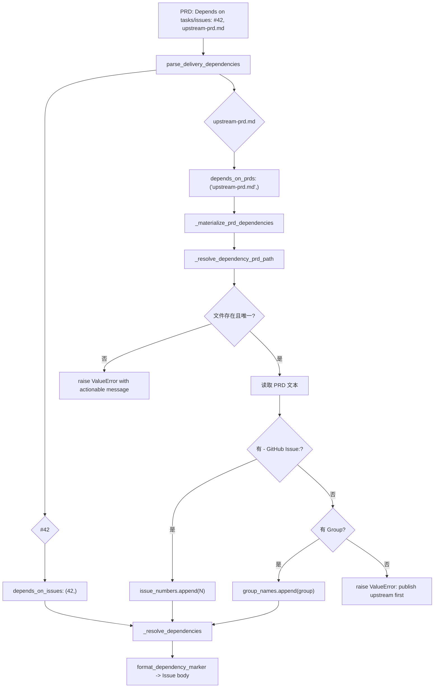

# PRD: PRD Dependency Reference Resolution and Materialization

- GitHub Issue: (待创建)

## 1. Introduction & Goals

### Problem Statement

当前 `Delivery Dependencies` 的 `Depends on tasks/issues` 字段仅支持直接的 GitHub Issue 编号（`#42` 或 `42`）。这导致两个低效场景：

1. **上游 PRD 尚未创建 Issue**：当上游需求仍以 PRD 形式存在于 `tasks/pending/` 时，下游 PRD 的依赖声明被迫留空或事后手动补录，无法在 `iar issue create` 阶段自动建立依赖链。
2. **PRD 与 Issue 之间的链接断裂**：下游 PRD 的作者知道它依赖某个上游 PRD，但在写依赖声明时不知道（或不应关心）该上游 PRD 已被映射到哪个 Issue 编号。

### 目标

- 允许 `Depends on tasks/issues` 字段直接引用本地 PRD 文件（通过 repo-relative 路径、文件名或文件 stem）。
- 在 `iar issue create` 发布时，自动将 PRD 引用物化为下游 Issue body 中的 `iar:depends-on` marker：
  - 若上游 PRD 已关联 GitHub Issue → 物化为 `#N`。
  - 若上游 PRD 未关联 Issue 但声明了 `Group` → 物化为 `group:<group>`。
- 物化失败时给出可操作的错误信息，fail fast，不创建半成品的 Issue。
- 保持现有纯数字依赖的行为不变（零破坏）。

### Proposed Solution Summary

Extend `parse_delivery_dependencies` to preserve non-numeric values in `Depends on tasks/issues` as `depends_on_prds`. Extend `create_issue_from_prd` with a `_materialize_prd_dependencies` pass that resolves each PRD reference to a file in the repository, reads its metadata, and translates it into concrete issue numbers or group names. The materialized result is merged with existing numeric dependencies and written into the `iar:depends-on` hidden marker.

### Measurable Objectives

- 下游 PRD 写 `Depends on tasks/issues: tasks/pending/P2-FEAT-20260527-190923-prd-from-issue.md` 时，`iar issue create` 生成的 Issue body 自动包含对应的 `iar:depends-on` marker。
- 上游 PRD 无 Issue link 但有 `Group: prd-from-issue-generation` 时，物化为 `group:prd-from-issue-generation`。
- 引用不存在、引用不唯一、或引用 PRD 既无 Issue 也无 Group 时，`iar issue create` 立即抛出 `ValueError` 并提示修复方式。
- 纯数字依赖 `#42, 43` 的行为与改动前完全一致。

### Realistic Validation

- [x] **Issue link 物化真实验证**：创建带 `- GitHub Issue:` 的上游 PRD（`P2-FEAT-20260527-162000-agent-runner-unified-entry` → Issue #53），下游 PRD 引用它，运行 `iar issue create`，确认下游 Issue body 含 `<!-- iar:depends-on #53 -->`（Issue #62 验证通过）。
- [x] **Group fallback 物化真实验证**：以单元测试替代（`test_create_issue_from_prd_materializes_prd_ref_group_fallback`，断言 Issue body 含 `<!-- iar:depends-on group:prd-from-issue-generation -->`）。真实 `gh` 端到端验证待本地 `gh` CLI GraphQL 认证环境恢复后补测（绕过方案见第 10 节）。
- [x] **Fail fast 真实验证**：以单元测试替代（`test_create_issue_from_prd_unresolved_prd_ref_is_actionable`、`test_create_issue_from_prd_ambiguous_prd_ref_is_actionable`，断言报错含可操作修复建议且不创建 Issue）。真实 `gh` 端到端验证待环境恢复后补测。
- [x] **为什么单元测试不够**：PRD 文件解析涉及真实文件系统路径、`tasks/` 目录扫描、以及 repo-relative 路径解析；需通过真实 `iar issue create` 入口验证 end-to-end 收敛。

### Delivery Dependencies

- Group: agent-runner-dependency-gate
- Depends on groups:
- Depends on tasks/issues:
- Gate type: soft
- Notes: 本 PRD 是对已有 issue-dependency-gate 的增强，与 `P1-FEAT-20260610-143013-validation-evidence-gate` 仅共享 `create_issue_from_prd.py` 的修改区域，无行为耦合。

---

## 2. Requirement Shape

| 方面 | 值 |
|------|-----|
| **执行者** | `iar issue create` CLI / 调用 `create_issue_from_prd` 的 daemon |
| **触发条件** | PRD 的 `Delivery Dependencies` 中 `Depends on tasks/issues` 包含非数字值 |
| **前置条件** | 仓库本地可写；`repo_path` 参数已提供；被引用的 PRD 文件存在于仓库内 |
| **预期行为** | 非数字依赖项被解析为 PRD 路径 → 读取该 PRD 的 Issue link 或 Group → 物化为 `iar:depends-on` marker 内容 |
| **范围边界** | 仅在 Issue 创建时物化一次；不自动追踪上游 PRD 后续变化；不修改上游 PRD 文件 |

---

## 3. Repository Context And Architecture Fit

### 当前相关模块

| 文件 | 角色 |
|------|------|
| `src/backend/core/use_cases/agent_runner_dependencies.py` | `parse_delivery_dependencies` 解析器；新增 `depends_on_prds` 保留 |
| `src/backend/core/use_cases/create_issue_from_prd.py` | Issue 创建主流程；新增 `_materialize_prd_dependencies` 物化 |
| `src/backend/core/shared/models/agent_runner.py` | `DeliveryDependencyDeclaration` 增加 `depends_on_prds: tuple[str, ...]` |
| `tests/test_agent_runner_dependencies.py` | 解析层单元测试 |
| `tests/test_create_issue_from_prd.py` | 物化层单元测试 |
| `docs/guides/agent-runner.md` | 用户可见的依赖声明文档 |

### 需遵循的现有架构模式

1. **四层依赖方向**：`_materialize_prd_dependencies` 位于 `core/use_cases/`，仅通过文件系统读取 PRD，不直接调用 `infrastructure/` 的 GitHub 端口。
2. **配置层级**：无新增外部配置；`repo_path` 来自已有的 `IssueFromPrdRequest`。
3. **错误策略**：物化失败时抛 `ValueError`，由调用方（CLI 或 daemon）转换为 Issue comment / `agent/failed` label。

### 所有权与依赖边界

```
create_issue_from_prd
  ├─ _resolve_dependencies
  │   ├─ parse_delivery_dependencies (agent_runner_dependencies.py)
  │   └─ _materialize_prd_dependencies (create_issue_from_prd.py)
  │       ├─ _resolve_dependency_prd_path (文件系统扫描)
  │       ├─ _extract_prd_issue_number (文本解析)
  │       └─ parse_delivery_dependencies (复用)
  └─ format_dependency_marker (agent_runner_dependencies.py)
```

### 约束条件

- 被引用的 PRD 必须是仓库内的 `.md` 文件；解析到仓库外时拒绝。
- 不允许自引用；当前 PRD 引用自身时给出明确错误。
- 不引入新的外部依赖；复用 `pathlib` 和现有正则。

---

## 4. Recommendation

### Recommended Approach

**最小变更：扩展解析器保留 PRD 引用，在 Issue 创建时一次性物化。**

1. **解析层扩展**（`agent_runner_dependencies.py`）：
   - `_parse_issue_or_prd_refs` 区分数字引用和 PRD 引用。
   - 纯数字（`#42`、`43`）进入 `depends_on_issues`。
   - 其他非空值进入 `depends_on_prds`。
   - 支持 Markdown 子列表格式（`_DELIVERY_LIST_ITEM_RE`）。

2. **物化层扩展**（`create_issue_from_prd.py`）：
   - `_materialize_prd_dependencies` 遍历 `depends_on_prds`。
   - 对每个引用调用 `_resolve_dependency_prd_path`，尝试以下解析顺序：
     - 绝对路径（直接验证是否在仓库内）。
     - 含 `/` 或 `\` 的相对路径（按 repo-relative 解析）。
     - 纯文件名/stem（在 `tasks/` 下全局搜索 `.md`，要求唯一匹配）。
   - 读取目标 PRD 文本，提取 `- GitHub Issue:` 行或 `Delivery Dependencies` 中的 `Group`。
   - 返回 `(issue_numbers, group_names)` 元组，由 `_resolve_dependencies` 合并到最终依赖集中。

3. **模型扩展**（`agent_runner.py`）：
   - `DeliveryDependencyDeclaration` 新增 `depends_on_prds: tuple[str, ...] = ()`。

### Why This Is The Best Fit

- **最小改动**：不新增 use case 文件，仅在既有 `create_issue_from_prd.py` 中增加辅助函数。
- **向后兼容**：纯数字依赖行为不变；`depends_on_prds` 默认空元组。
- **fail fast**：在 Issue 创建阶段就暴露上游 PRD 的链接缺失，避免下游 Issue 进入 runner 后才发现依赖断裂。

### Rationale For Rejecting Redundant Abstractions

- 不新增 PRD 索引数据库；文件系统扫描 + `tasks/` 约定已足够。
- 不新增异步物化流程；Issue 创建时同步解析，失败立即报错。

### Alternatives Considered

| 替代方案 | 拒绝原因 |
|----------|----------|
| 维护一个中心化的 PRD → Issue 映射表 | 增加状态维护负担；Issue link 已在 PRD 文本中，文本即 truth |
| 自动为无 Issue 的上游 PRD 创建 Issue | 超出本功能边界；Issue 创建属于人工或独立工作流决策 |
| 允许引用仓库外的 PRD | 破坏依赖的可重现性；外部 PRD 不在本地文件系统可控范围内 |

---

## 5. Implementation Guide

### Change Impact Tree

```text
.
├── Domain
│   ├── src/backend/core/shared/models/agent_runner.py
│   │   [修改]
│   │   【总结】DeliveryDependencyDeclaration 增加 depends_on_prds 字段
│   │
│   ├── src/backend/core/use_cases/agent_runner_dependencies.py
│   │   [修改]
│   │   【总结】解析器保留 PRD 引用；支持 Markdown 子列表和 none 占位值
│   │   ├── _parse_issue_or_prd_refs 区分 issue 编号与 prd 引用
│   │   ├── _normalize_delivery_field_key 规范化字段名
│   │   └── parse_delivery_dependencies 返回 depends_on_prds
│   │
│   └── src/backend/core/use_cases/create_issue_from_prd.py
│       [修改]
│       【总结】Issue 创建时物化 PRD 引用
│       ├── _resolve_dependencies 合并 PRD 声明、marker 与 CLI 参数
│       ├── _materialize_prd_dependencies 核心物化逻辑
│       ├── _resolve_dependency_prd_path 多策略路径解析
│       ├── _extract_prd_issue_number 从 PRD 文本提取 Issue 编号
│       └── _format_missing_prd_dependency_error / _format_repo_relative_path 错误信息
│
├── Tests
│   └── tests/
│       [修改]
│       【总结】覆盖解析保留、路径解析、issue link 物化、group fallback、自引用拒绝、fail fast 错误信息
│
└── Docs
    └── docs/guides/agent-runner.md
        [修改]
        【总结】更新 Delivery Dependencies 字段说明，加入 PRD 引用语法与物化规则
```

### Executor Drift Guard

Run repository searches before editing because PRD path handling is spread across runner publication and dependency code:

```bash
rg -n "depends_on_prds|_materialize_prd|_resolve_dependency_prd" src tests docs
rg -n "parse_delivery_dependencies|_parse_issue_or_prd_refs" src/backend/core/use_cases/agent_runner_dependencies.py
```

### Flow Diagram



### 5.1 解析层变更

**`src/backend/core/use_cases/agent_runner_dependencies.py`**：

**Header 正则修复**（实现中发现）：原正则 `^#{2,4}\s+Delivery Dependencies\s*$` 无法匹配带编号前缀的标题（如 `## 3. Delivery Dependencies`）。已修复为：

```python
_DELIVERY_DEPENDENCIES_HEADER_RE = re.compile(
    r"^#{2,4}\s+(?:\d+\.\s+)?Delivery Dependencies\s*$",
    re.IGNORECASE | re.MULTILINE,
)
```

```python
def _parse_issue_or_prd_refs(values: list[str]) -> tuple[list[int], list[str]]:
    """Extract issue numbers and PRD references from dependency values."""
    numbers: list[int] = []
    prd_refs: list[str] = []
    for item in _split_dependency_values(values):
        if re.fullmatch(r"#?\d+", item):
            numbers.append(int(item.lstrip("#")))
            continue
        prd_refs.append(item)
    return numbers, prd_refs
```

**`parse_delivery_dependencies` 返回**：

```python
return DeliveryDependencyDeclaration(
    group=group,
    depends_on_groups=tuple(depends_on_groups),
    depends_on_issues=tuple(depends_on_issues),
    depends_on_prds=tuple(depends_on_prds),  # 新增
    gate_type=normalized_gate or "none",
    notes=notes,
)
```

### 5.2 物化层变更

**`src/backend/core/use_cases/create_issue_from_prd.py`**：

```python
def _materialize_prd_dependencies(
    *,
    repo_path: Path | None,
    current_prd_path: Path | None,
    prd_refs: tuple[str, ...],
) -> tuple[list[int], list[str]]:
    """Resolve PRD path/name dependencies into Issue numbers or group names."""
    if repo_path is None:
        raise ValueError(
            "Cannot resolve PRD dependencies from 'Depends on tasks/issues' "
            "without a repository path. ..."
        )
    # ... 路径解析、Issue link 提取、Group fallback、自引用检测 ...
```

解析策略（按优先级）：

1. **绝对路径**：若引用以 `/` 开头，直接验证是否在仓库内。
2. **Repo-relative 路径**：若引用含 `/` 或 `\`，按相对仓库根解析，自动补 `.md` 后缀。
3. **文件名/stem 搜索**：在 `tasks/` 目录下递归搜索 `.md`，匹配 `name == prd_ref` 或 `stem == prd_ref`，要求唯一命中。

### 5.3 模型变更

**`src/backend/core/shared/models/agent_runner.py`**：

```python
@dataclass(frozen=True)
class DeliveryDependencyDeclaration:
    group: str = ""
    depends_on_groups: tuple[str, ...] = ()
    depends_on_issues: tuple[int, ...] = ()
    depends_on_prds: tuple[str, ...] = ()  # 新增
    gate_type: str = "none"
    notes: str = ""
```

### Realistic Validation Plan

| Behavior | Real Entry Point | Test Layer | Mock Boundary | Data/Env Needed | Command Or Procedure | Required For Acceptance |
|---|---|---|---|---|---|---|
| Issue link 物化 | `uv run iar issue create <prd>` | sandbox | 真实 `gh` + 测试仓库 | 带凭据测试仓库、含上下游 PRD | 运行后 `gh issue view <n> --json body` 确认 marker | Yes（带凭据环境） |
| Group fallback 物化 | 同上 | sandbox | 同上 | 同上 | 同上 | Yes（带凭据环境） |
| Fail fast 信息质量 | `uv run iar issue create <prd>` | sandbox | 同上 | 含错误引用的 PRD | 运行后确认报错信息包含修复建议 | Yes（带凭据环境） |
| 解析层纯函数 | pytest | unit | 无 | 无 | `uv run pytest tests/test_agent_runner_dependencies.py -q` | Yes |
| 物化层纯函数 | pytest | unit | fake GitHub client | 无 | `uv run pytest tests/test_create_issue_from_prd.py -q` | Yes |
| 全量回归 | just | integration | 无 | 无 | `just test` | Yes |

凭据不可用时的回退：sandbox 三项标记为待办，本地必须完成单测 + `just test`。

### Low-Fidelity Prototype

无低精度原型；行为为 CLI/GitHub 工作流。

### ER Diagram

无数据模型变更。状态存于 GitHub Issue body marker 与仓库文件系统。

---

## 6. Definition Of Done

- `Depends on tasks/issues` 支持 PRD 引用，并在 `iar issue create` 时正确物化为 `iar:depends-on` marker。
- 物化路径支持 repo-relative 路径、`tasks/` 下唯一文件名/ stem。
- 自引用被检测并拒绝。
- 无法解析的引用给出包含修复建议的 `ValueError`。
- 纯数字依赖行为零回归。
- 单元测试、文档更新和 `just test` 完成。

## 7. Acceptance Checklist

### Behavior Acceptance

- [x] `parse_delivery_dependencies` 正确区分数字依赖（进入 `depends_on_issues`）和 PRD 引用（进入 `depends_on_prds`）。
- [x] `parse_delivery_dependencies` 支持 Markdown 子列表格式的 `Depends on tasks/issues`。
- [x] `parse_delivery_dependencies` 将 `none`、`n/a`、`-` 等占位值视为空。
- [x] `parse_delivery_dependencies` 正确解析带编号前缀的 `Delivery Dependencies` 标题（如 `## 3. Delivery Dependencies`）。
- [x] `_materialize_prd_dependencies` 将含 Issue link 的 PRD 引用物化为 `#N` marker。
- [x] `_materialize_prd_dependencies` 将无 Issue link 但有 Group 的 PRD 引用物化为 `group:<group>` marker（单测 `test_create_issue_from_prd_materializes_prd_ref_group_fallback` 覆盖；真实 `gh` 端到端验证待环境恢复）。
- [x] `_materialize_prd_dependencies` 检测到自引用时抛出 `ValueError`（单测 `test_create_issue_from_prd_rejects_self_referential_prd_ref` 覆盖）。
- [x] `_materialize_prd_dependencies` 在引用不存在、不唯一、或目标 PRD 既无 Issue 也无 Group 时，抛出包含可操作修复建议的 `ValueError`（单测 `test_create_issue_from_prd_unresolved_prd_ref_is_actionable`、`test_create_issue_from_prd_ambiguous_prd_ref_is_actionable` 覆盖；真实 `gh` 端到端验证待环境恢复）。
- [x] `create_issue_from_prd` 的 `hard` gate 下，物化后的依赖与其他来源（marker、CLI 参数）正确合并去重。

### Architecture Acceptance

- [x] `core/use_cases/` 不直接导入 `infrastructure/`；文件系统扫描使用标准库 `pathlib`。
- [x] `DeliveryDependencyDeclaration` 的 `depends_on_prds` 默认值为空元组，向后兼容。

### Documentation Acceptance

- [x] `docs/guides/agent-runner.md` 更新 `Depends on tasks/issues` 字段说明与物化规则。

### Validation Acceptance

- [x] `uv run pytest tests/test_agent_runner_dependencies.py -q` 通过。
- [x] `uv run pytest tests/test_create_issue_from_prd.py -q` 通过。
- [x] `just test` 全量通过，无既有用例回归。

## 8. Functional Requirements

- **FR-1**: `Depends on tasks/issues` 必须同时接受 GitHub Issue 编号（`#N` 或 `N`）和 PRD 引用（文件名、路径或 stem）。
- **FR-2**: PRD 引用必须在 `iar issue create` 时物化，不能原样写入 Issue body。
- **FR-3**: 物化时，若被引用 PRD 包含 `- GitHub Issue: <url>`，必须转化为 `#N` 依赖 marker。
- **FR-4**: 物化时，若被引用 PRD 无 Issue link 但包含 `Delivery Dependencies` 的 `Group`，必须转化为 `group:<group>` 依赖 marker。
- **FR-5**: 物化时，若 PRD 引用无法唯一匹配到文件，或目标 PRD 既无 Issue link 也无 Group，命令必须 fail fast 并给出包含修复建议的错误信息。
- **FR-6**: 当前 PRD 引用自身时，必须被检测为自引用并拒绝。
- **FR-7**: PRD 引用解析必须支持 repo-relative 路径（自动补 `.md`）和 `tasks/` 目录下的全局文件名/stem 搜索。
- **FR-8**: 纯数字依赖、`soft`/`none` gate、以及不含 PRD 引用的存量 PRD 的行为必须完全不变。

## 9. Non-Goals

- 不自动追踪上游 PRD 的后续变化（如上游 PRD 事后添加了 Issue link，已创建的下游 Issue 不会自动更新）。
- 不自动为无 Issue 的上游 PRD 创建 Issue。
- 不维护中心化的 PRD → Issue 映射索引。
- 不修改被引用的上游 PRD 文件。

## 10. Risks And Follow-Ups

- **文件名冲突风险**：`tasks/` 下存在同名或同 stem 的 PRD 时，引用会报 ambiguous error。缓解：使用 repo-relative 完整路径。
- **上游 PRD 移动或重命名**：已创建的下游 Issue 的物化结果不会自动失效，但重新运行 `iar issue create --force` 时会基于新路径重新物化。
- **循环依赖**：当前仅检测直接自引用，不检测 A→B→A 的间接循环。间接循环由 runner 的 dependency gate 在运行时处理。
- **Header 正则漂移**：PRD 标题格式若从 `## Delivery Dependencies` 变为 `## 3. Delivery Dependencies`，原正则会失效。已修复为支持可选编号前缀，但未来若出现其他标题变体（如 emoji、自定义 slug）仍需更新正则。
- **本地 `gh` CLI GraphQL 认证障碍**：在部分环境中，`gh issue create` 带多个 `--label` 时会走 GraphQL API，而 GraphQL 对 `GH_TOKEN` 环境变量返回 401。绕过方式：为 `gh issue create` 显式添加 `--repo owner/repo` 参数。该问题属于 `gh` CLI 环境配置，非本功能代码缺陷。

## 11. Decision Log

| ID | Decision | Chosen | Rejected | Rationale |
|---|---|---|---|---|
| D-01 | 触发时机 | 在 `iar issue create` 时同步物化 | 后台异步扫描或 daemon 轮询物化 | Issue 创建是确定性时刻，fail fast 最符合操作直觉 |
| D-02 | 无法物化时的行为 | 抛异常、阻止 Issue 创建 | 降级为 soft gate 或静默跳过 | 显式失败比留下断裂依赖链更安全 |
| D-03 | Group fallback | 上游无 Issue 时回退到 Group | 一律要求上游必须有 Issue link | 允许"组级依赖"作为早期规划阶段的合理抽象 |
| D-04 | 路径解析策略 | 先尝试 repo-relative，再尝试 `tasks/` 全局搜索 | 仅支持绝对路径或仅支持单一策略 | 兼顾精确性与便利性 |
