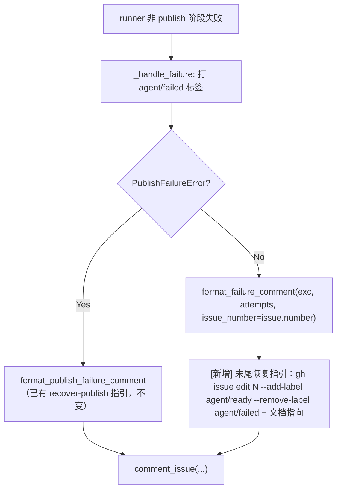

# PRD: Agent Runner Failure Comment Recovery Guidance

## 1. Introduction & Goals

Agent Runner 失败时有两个评论构建函数（`src/backend/core/use_cases/agent_runner_failure.py`），但只有发布阶段失败的评论带恢复指引：

- `format_publish_failure_comment(...)`：结尾包含 "To resume publishing without re-running the agent: `uv run iar recover-publish --issue N`"。
- `format_failure_comment(...)`：覆盖其余所有失败（pre-push review 不通过、agent error、verification 失败、超时等），只输出根因摘要、Attempt History 与异常文本，**没有任何恢复指引**，且函数签名没有 `issue_number`，无法拼出可复制的恢复命令。

恢复流程本身在 `docs/guides/agent-runner.md` 的"失败重跑"章节有完整文档（relabel `agent/ready` → runner 轮询自动拾取），但失败评论不指向它。Issue #53 的两次 `Agent Runner Failed` 评论即为实例：operator 只看到错误信息，不知道下一步该做什么。

本 PRD 约束一个最小补齐切片：

1. `format_failure_comment(...)` 新增 keyword-only 参数 `issue_number: int | None = None`；提供时在评论末尾追加恢复指引段（relabel 命令、脏 worktree 清理提示、文档指向），缺省时行为与现状完全一致。
2. `agent_runner_orchestrate.py` 的两个调用点传入 `issue.number`。
3. 增加回归测试；同步更新 `docs/guides/agent-runner.md` 失败重跑章节说明失败评论自带指引。

### Realistic Validation

除单元测试外，本 PRD 要求通过**真实项目入口点**验证关键行为：

- [x] **失败评论恢复指引真实验证**：通过 `uv run pytest tests/test_run_agent.py -q` 验证带 `issue_number` 的 `format_failure_comment` 输出包含 `gh issue edit <n> --add-label agent/ready --remove-label agent/failed` 命令与文档指向，且不带 `issue_number` 时输出与现状一致（向后兼容）。
- [x] **失败路径端到端真实验证**：通过 `uv run pytest tests/test_run_agent.py tests/test_agent_runner_orchestrate.py -q` 中的 `test_mark_issue_failed_comment_includes_recovery_guidance`验证 runner 失败时通过 `FakeGitHubClient` 收到的 `Agent Runner Failed` 评论包含恢复指引段。
- [x] **真实仓库测试入口验证**：通过 `just test` 验证 lint、架构检查、PRD checklist 检查和全量 pytest 均通过。
- [x] **为什么不直接运行 live `iar run`**：真实失败路径需要 live GitHub Issue 与一次真实 agent 失败；评论内容在 client 边界即可完整断言，pytest 走真实 orchestrate 失败处理路径（`FakeGitHubClient` 捕获 `comment_issue` 调用），避免对 live Issue 制造人为失败事件。

### Delivery Dependencies

- Group: none
- Depends on groups:
  - none
- Depends on tasks/issues:
  - none
- Gate type: none
- Notes: 与已归档 `P1-BUG-20260611-102155-pre-push-review-approved-patch-verdict-override.md` 同源于 Issue #53 排障，但相互独立，可单独交付。

### Proposed Solution Summary

- 核心机制：在既有 `format_failure_comment(...)` 内追加可选恢复指引段，与 `format_publish_failure_comment` 的指引风格对齐；不新增评论构建函数。
- 输入来源：调用方（`agent_runner_orchestrate._handle_failure` 路径）显式传入 `issue.number`，函数不做任何推断。
- 接入点：仅改 `agent_runner_failure.py` 一个函数与 `agent_runner_orchestrate.py` 两个调用点。
- 行为变化：所有非 publish 失败的 `Agent Runner Failed` 评论末尾出现可复制的 relabel 恢复命令与文档指向。
- 刻意避免的复杂度：不按失败类型分支生成不同指引（恢复入口统一是 relabel 重跑），不新增配置项，不改 label 状态机。

### Measurable Objectives

- runner 任意非 publish 失败写出的 Issue 评论包含 `gh issue edit <issue-number> --add-label agent/ready --remove-label agent/failed`。
- 不传 `issue_number` 的既有调用（含测试）输出逐字符不变。

## 2. Requirement Shape

**Actor**：在 GitHub Issue 上看到 `Agent Runner Failed` 评论的 operator。

**Trigger**：runner 在非 publish 阶段失败（pre-push review 不通过、agent error、verification 失败、超时等），`_handle_failure` 打 `agent/failed` 标签并写失败评论。

**Expected Behavior**：失败评论在异常详情之后追加恢复指引段，包含：

- relabel 重跑命令：`gh issue edit <n> --add-label agent/ready --remove-label agent/failed`
- 脏 worktree 先清理的提示（指向 `git worktree remove` 与默认 worktree 路径约定）
- 指向 `docs/guides/agent-runner.md` 失败重跑章节的说明

**Explicit Scope Boundary**：

- 不修改 `format_publish_failure_comment`（已有指引）。
- 不修改 label 状态机、失败分类、Attempt History 内容。
- 不按 `FailureType` 定制差异化指引。
- 不修改 `iar recover` / `iar recover-publish` 行为。

## 3. Repository Context And Architecture Fit

### Current Relevant Modules And Files

| Path | Current Role | Change Relationship |
|---|---|---|
| `src/backend/core/use_cases/agent_runner_failure.py` | 失败分类与失败评论构建 | `format_failure_comment` 新增 keyword-only `issue_number` 与恢复指引段 |
| `src/backend/core/use_cases/agent_runner_orchestrate.py` | 失败处理：打 `agent/failed` 标签、写失败评论 | 两个 `format_failure_comment` 调用点传入 `issue.number` |
| `tests/test_run_agent.py` | 既有 `format_failure_comment` 测试所在 | 新增恢复指引与向后兼容断言 |
| `docs/guides/agent-runner.md` | 失败重跑章节 | 注明失败评论自带 relabel 指引 |

### Existing Path

```text
runner 失败
  -> agent_runner_orchestrate._handle_failure 风格路径
  -> edit_issue_labels(add=[agent/failed], remove=workflow labels)
  -> isinstance(exc, PublishFailureError)?
       Yes -> format_publish_failure_comment(...)   # 带 recover-publish 指引
       No  -> format_failure_comment(exc[, attempt_results])  # 无指引、无 issue number
  -> comment_issue(issue.number, body)
```

### Reuse Candidates

- 复用 `format_publish_failure_comment` 的指引文案结构（说明句 + bash 代码块）。
- 复用 `docs/guides/agent-runner.md` 失败重跑章节既有命令，评论与文档保持同一命令拼写。
- 复用 `tests/test_run_agent.py` 中既有 `format_failure_comment` 测试的 `AttemptResult` 构造模式。

### Architecture Constraints

- 变更全部留在 `src/backend/core/use_cases/`、`tests/`、`docs/`；`core/` 不得导入 `engines.*`、`infrastructure.*`、`api.*`。
- 不新增配置项、状态文件、依赖。

### Existing PRD Relationship

- `tasks/pending/` 无重叠工作；`P2-FEAT-20260527-162000-agent-runner-unified-entry.md` 等均不涉及失败评论内容。
- `tasks/archive/P1-BUG-20260611-102155-pre-push-review-approved-patch-verdict-override.md` 修复了同一 Issue #53 暴露的 review 收敛 bug，本 PRD 补齐其姊妹问题（失败后无指引），二者独立。
- 本 PRD 可独立执行。

### Potential Redundancy Risks

- 不应新增独立的 "recovery guidance builder" 模块或按失败类型生成多套指引——恢复入口统一是 relabel 重跑，多套文案会与文档漂移。

## 4. Recommendation

### Recommended Approach：在 `format_failure_comment` 内追加可选恢复指引段（最小改动）

1. 函数签名变为 `format_failure_comment(exc, attempt_results=None, *, issue_number: int | None = None)`；keyword-only 保证既有位置参数调用零破坏。
2. `issue_number` 非 None 时，在异常详情之后追加恢复指引段；None 时输出与现状逐字符一致。
3. orchestrate 两个调用点补传 `issue_number=issue.number`。

**为什么最适合现有架构**：失败评论的所有内容已集中在 `format_failure_comment`，指引属于评论内容的一部分；与 publish 失败评论的"末尾给可复制命令"模式完全对齐，operator 在两类失败下获得一致体验。

**拒绝的冗余抽象**：不为指引建独立函数/模板文件；不引入按 `FailureType` 分支的指引矩阵。

### Alternatives Considered

- **在 `_handle_failure` 调用处拼接指引再传入**：把评论内容的职责泄漏到 orchestrate 层，且两个调用点要重复拼接。拒绝。
- **只改文档不改评论**：文档已经写了完整流程，问题恰恰是失败现场（Issue 评论）不指向它；不解决 operator 的发现成本。拒绝。

## 5. Implementation Guide

This section is a living implementation guide based on current repository analysis. If implementation discovers additional affected files, hidden dependencies, edge cases, or a better path, update this PRD before proceeding.

### Core Logic

#### Failure Comment Recovery Section

Search anchors:

```bash
rg -n "def format_failure_comment|Agent Runner Failed" src/backend/core/use_cases/agent_runner_failure.py
```

Required behavior:

- 新增 keyword-only 参数 `issue_number: int | None = None`，更新 docstring。
- `issue_number` 非 None 时在评论末尾追加（与 publish 指引风格一致）：
  - 说明句：修复根因后 relabel 让 runner 重新拾取。
  - bash 代码块：`gh issue edit <n> --add-label agent/ready --remove-label agent/failed`
  - 脏 worktree 提示与文档指向：`docs/guides/agent-runner.md` 失败重跑章节。

#### Orchestrate Call Sites

Search anchors:

```bash
rg -n "format_failure_comment\(" src/backend/core/use_cases/agent_runner_orchestrate.py
```

Required behavior：两个调用点（带/不带 `attempt_results`）均补传 `issue_number=issue.number`。

#### Test Coverage

Search anchors:

```bash
rg -n "test_format_failure_comment" tests/test_run_agent.py
```

Required behavior:

- `test_format_failure_comment_includes_recovery_guidance`：传 `issue_number=53` → body 包含 relabel 命令全文与 `docs/guides/agent-runner.md` 指向，且指引位于异常文本之后。
- `test_format_failure_comment_without_issue_number_unchanged`：不传 `issue_number` → body 不含 `gh issue edit`（向后兼容）。

### Change Impact Tree

```text
Domain
├── src/backend/core/use_cases/agent_runner_failure.py
│   [修改]
│   【总结】format_failure_comment 支持可选 issue_number 并追加 relabel 恢复指引段
│
│   ├── 签名新增 keyword-only issue_number: int | None = None
│   └── issue_number 非 None 时末尾追加恢复指引（relabel 命令 + worktree 提示 + 文档指向）
│
├── src/backend/core/use_cases/agent_runner_orchestrate.py
│   [修改]
│   【总结】失败评论两个调用点补传 issue_number=issue.number
│
├── Tests
│   └── tests/test_run_agent.py
│       [修改]
│       【总结】覆盖恢复指引内容与不传 issue_number 的向后兼容
│       │
│       ├── test_format_failure_comment_includes_recovery_guidance
│       └── test_format_failure_comment_without_issue_number_unchanged
│
└── Docs
    └── docs/guides/agent-runner.md
        [修改]
        【总结】失败重跑章节注明失败评论自带 relabel 指引，与 publish 失败的 recover-publish 提示对齐
```

文件列表是分析起点而非穷举保证，发现新受影响文件时先更新本 PRD（见 Executor Drift Guard）。

### Executor Drift Guard

- Run `rg -n "format_failure_comment\(" src tests` and confirm every call site either passes `issue_number=` or intentionally relies on the backward-compatible default.
- Run `rg -n "add-label agent/ready --remove-label agent/failed" src docs` and confirm the comment command and the docs command stay textually identical.
- Run `rg -n "How to recover|relabel" src/backend/core/use_cases/agent_runner_failure.py` and confirm the guidance section exists only in `format_failure_comment` (not duplicated in orchestrate).

### Flow Diagram



### Realistic Validation Plan

| Behavior | Real Entry Point | Test Layer | Mock Boundary | Data/Env Needed | Command Or Procedure | Required For Acceptance |
|---|---|---|---|---|---|---|
| 失败评论包含恢复指引 | pytest through `format_failure_comment(...)`（真实评论构建路径） | use-case | 无外部依赖 | `AttemptResult` fixtures | `uv run pytest tests/test_run_agent.py -q` | Yes |
| 不传 issue_number 向后兼容 | pytest through `format_failure_comment(...)` | use-case | 无外部依赖 | 同上 | `uv run pytest tests/test_run_agent.py -q` | Yes |
| 全仓回归 | Repository test entry | full local regression | 既有测试 fake，无 live 外部写入 | 本地 uv/just 环境 | `just test` | Yes |
| Optional live 观察 | CLI against disposable Issue | manual/sandbox | 无 mock | 可丢弃 Issue；operator opt-in | 对一次性仓库制造一次失败，确认 Issue 评论末尾出现 relabel 指引 | No |

Failure triage:

- 若指引未出现在评论中：检查 orchestrate 调用点是否传了 `issue_number=issue.number`，以及 `issue_number is not None` 守卫。
- 若既有测试输出断言失败：确认指引段只在 `issue_number` 非 None 时追加。
- 若 `just test` 在 PRD checklist 检查失败：确认本 PRD 归档前 Acceptance Checklist 全部勾选。

### Low-Fidelity Prototype

No UI or multi-step human interaction changes in this PRD.

### ER Diagram

No data model changes in this PRD.

### Interactive Prototype Change Log

No interactive prototype file changes in this PRD.

### External Validation

No external validation required; repository evidence (Issue #53 failure comments and `agent_runner_failure.py` source) was sufficient.

## 6. Definition Of Done

- 非 publish 失败的 `Agent Runner Failed` 评论末尾包含 relabel 恢复命令与文档指向。
- 不传 `issue_number` 的调用输出与现状逐字符一致；既有测试不修改即通过。
- 新增回归测试通过；`just test` 全部通过。
- `docs/guides/agent-runner.md` 失败重跑章节同步更新。
- `src/backend/core/` 依赖方向约束不被破坏。

## 7. Acceptance Checklist

### Architecture Acceptance

- [x] Changes remain in `src/backend/core/use_cases/agent_runner_failure.py`, `src/backend/core/use_cases/agent_runner_orchestrate.py`, `tests/test_run_agent.py`, and `docs/guides/agent-runner.md`.
- [x] No new config key, module, dependency, or label state is introduced.

### Dependency Acceptance

- [x] `src/backend/core/` does not import `backend.infrastructure`, `backend.engines`, or `backend.api`.
- [x] No new Python or npm dependency is added.

### Behavior Acceptance

- [x] `format_failure_comment(exc, attempts, issue_number=53)` 输出包含 `gh issue edit 53 --add-label agent/ready --remove-label agent/failed` 与 `docs/guides/agent-runner.md` 指向。
- [x] `format_failure_comment(exc, attempts)`（不传 issue_number）输出不含 `gh issue edit`。
- [x] `rg -n "issue_number=issue.number" src/backend/core/use_cases/agent_runner_orchestrate.py` 命中两个失败评论调用点。
- [x] `format_publish_failure_comment` 行为不变。

### Documentation Acceptance

- [x] `docs/guides/agent-runner.md` 失败重跑章节注明失败评论自带 relabel 指引。

### Validation Acceptance

- [x] `uv run pytest tests/test_run_agent.py -q` passes with the new tests.
- [x] `just test` passes.
- [x] `git diff --check` passes.
- [x] This PRD is archived with all Acceptance Checklist items complete.

## 8. Functional Requirements

**FR-1**: `format_failure_comment(...)` 必须接受 keyword-only 参数 `issue_number: int | None = None`，并在非 None 时于评论末尾追加恢复指引段。

**FR-2**: 指引段必须包含可复制的 `gh issue edit <n> --add-label agent/ready --remove-label agent/failed` bash 代码块，命令文本与 `docs/guides/agent-runner.md` 失败重跑章节保持一致。

**FR-3**: 指引段必须包含脏 worktree 先清理的提示与 `docs/guides/agent-runner.md` 失败重跑章节指向。

**FR-4**: `issue_number` 为 None 时输出与修改前逐字符一致（向后兼容）。

**FR-5**: `agent_runner_orchestrate.py` 中两个 `format_failure_comment` 调用点必须传入 `issue_number=issue.number`。

## 9. Non-Goals

- 不修改 `format_publish_failure_comment` 或 `iar recover` / `iar recover-publish`。
- 不按 `FailureType` 生成差异化指引。
- 不修改 label 状态机、失败分类逻辑、Attempt History 内容。
- 不要求 live GitHub 验证作为验收条件。

## 10. Risks And Follow-Ups

- 评论中的 relabel 命令使用默认 label 名（`agent/ready` / `agent/failed`）；若仓库通过配置自定义了 label 名，命令需要 operator 自行替换。如需精确渲染配置后的 label 名，需把 `config.labels` 传入评论构建函数，属后续增强，另立 PRD。
- 指引文案与文档章节标题（"失败重跑"）若未来重命名，需同步更新评论文案（见 Executor Drift Guard 的文本一致性检查）。

## 11. Decision Log

| ID | Decision | Chosen | Rejected | Rationale |
|---|---|---|---|---|
| D-01 | 指引生成位置 | `format_failure_comment` 内部追加可选段 | 在 orchestrate `_handle_failure` 调用处拼接 | 评论内容职责已集中在 failure 模块；调用处拼接会在两个调用点重复且泄漏内容职责到编排层。 |
| D-02 | 参数兼容策略 | keyword-only `issue_number: int | None = None` | 必选位置参数并改全部调用点 | 既有测试与 re-export 调用方零破坏；None 时逐字符不变可直接用测试证明。 |
| D-03 | 指引内容范围 | 统一 relabel 重跑指引 + 文档指向 | 按 FailureType 生成差异化指引矩阵 | 非 publish 失败的恢复入口统一是 relabel 重跑；多套文案与文档漂移风险高、收益低。publish 失败已有专用指引。 |
| D-04 | label 名渲染 | 使用默认 label 名硬编码于文案 | 注入 `config.labels` 渲染配置名 | 当前仓库未自定义 label 名；注入 config 会扩大函数签名与调用链改动面，留作记录在案的后续增强。 |
| D-05 | PRD placement | 完成后归档至 `tasks/archive/` | 长期留在 `tasks/pending/` | 仓库规则要求完成的 PRD 勾选全部 Acceptance Checklist 后归档。 |
