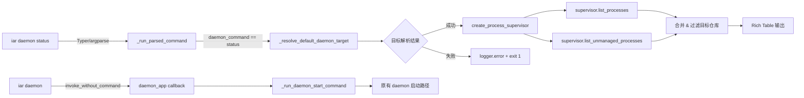

# 新增 `iar daemon status` 子命令

## 1. Introduction & Goals

`iar daemon` 与 `iar review-daemon` 目前只能启动常驻 runner，用户无法通过 CLI 查看当前有哪些 daemon 进程在跑、是托管还是未托管、由哪个可执行文件启动、启动时间是什么。现有 `iar registry list` 虽然能显示 `running (unmanaged xN)`，但只给汇总计数，无法定位具体进程，出了问题仍需手动 `ps`。

### Proposed Solution Summary

将 `iar daemon` 扩展为可带子命令的入口：保留 `iar daemon` 作为 `iar daemon run` 的向后兼容别名，新增 `iar daemon status` 子命令。`status` 复用现有 `IRunnerProcessSupervisor.list_processes()` 与 `list_unmanaged_processes()`，按仓库聚合输出 daemon / review-daemon 的进程明细，包括 PID、进程 ID、可执行路径、启动时间、托管/未托管标记、目标 repo_id 与完整命令行。

该改动只增加 CLI 观测入口，不修改 daemon 启动/停止/轮询逻辑，也不改变 `processes.json` 托管模型。

### Measurable Objectives

- **OBJ-1**：执行 `iar daemon status` 时，对每一个 registry 仓库，分别列出 daemon 与 review-daemon 的 running 进程明细；无进程时显示 `stopped`。
- **OBJ-2**：`iar daemon status` 区分托管进程（来自 `processes.json`）与未托管进程（系统进程扫描），并在同一行标注。
- **OBJ-3**：`iar daemon status` 在未指定 `--repo-id` / `--repo` / `--all` 时，按 cwd 推断当前仓库并只显示该仓库状态（复用现有 `_resolve_default_daemon_target` 逻辑）。
- **OBJ-4**：`iar daemon status --all` 显示所有 enabled registry 仓库的状态；`iar daemon status --repo-id <id>` 显示指定仓库状态。
- **OBJ-5**：原有 `iar daemon` 命令继续工作，等效于 `iar daemon run`；`iar daemon --interval 60 --repo-id keda-main` 等用法不受影响。
- **OBJ-6**：`docs/guides/agent-runner.md` 新增 `iar daemon status` 使用说明，并澄清 `iar daemon` 与 `iar daemon run` 的关系。

### Realistic Validation

除单元测试和集成测试外，本 PRD 要求通过**真实项目入口点**验证关键行为，确保真实 OS 进程在真实 CLI 下被正确列出。

- [x] **未指定仓库时 status 推断当前仓库**：在 `/Users/zata/code/keda` 执行 `iar daemon status`，验证只输出 `keda-main` 的状态。
- [x] **status 显示未托管进程**：先手动执行 `iar daemon --repo-id keda-main`，再在另一个终端执行 `iar daemon status --repo-id keda-main`，验证输出包含该进程的 PID、命令行与 `unmanaged` 标记。
- [x] **status 显示托管进程**：执行 `iar registry start --repo-id keda-main` 后，执行 `iar daemon status --repo-id keda-main`，验证输出包含托管进程 ID 与 `managed` 标记。
- [x] **原有 `iar daemon` 命令仍可用**：执行 `iar daemon --repo-id keda-main --interval 300` 验证命令正常启动/尝试运行，不因子命令重构而失败。

**为什么单元测试不够**：status 依赖真实 OS 进程扫描、`psutil` 在真实进程表上的行为、以及 Typer 子命令与 argparse 后端的参数传递；mock 无法证明未托管进程的真实 PID、可执行路径与启动时间能被正确呈现，也无法证明 `iar daemon` 旧调用形式仍然有效。

### Delivery Dependencies

- Group: iar-cli-process-management
- Depends on groups:
  - none
- Depends on tasks/issues:
  - `P2-FEAT-20260623-110000-iar-daemon-default-current-repo-only.md`（soft）：该 PRD 修改 daemon 默认目标解析逻辑；本 PRD 复用同一函数，建议其先合并或同步测试，避免冲突。
- Gate type: soft
- Notes: 本任务与 pending 的 daemon 默认行为 PRD 正交但共享 `cli.py` 中的 `_resolve_default_daemon_target`；建议本 PRD 落地前确认该函数签名/语义稳定。

## 2. Requirement Shape

- **actor**：需要查看 iAR daemon 运行状态的开发者 / 运维人员。
- **trigger**：执行 `iar daemon status` 或其带 selector 的变体。
- **expected behavior**：
  - `iar daemon status` 默认按 cwd 推断单一目标仓库并显示其 daemon / review-daemon 状态。
  - `iar daemon status --repo-id <id>` 只显示指定仓库状态。
  - `iar daemon status --all` 显示所有 enabled registry 仓库状态。
  - 对每仓库每 kind，列出所有 running 进程明细：PID、进程 ID（托管）或 `unmanaged-<pid>`（未托管）、managed/unmanaged 标记、可执行文件路径、启动时间（ISO8601 或人类可读）、完整命令行。
  - 无 running 进程时显示 `stopped`。
  - 原有 `iar daemon [OPTIONS]` 继续作为启动入口，等效于 `iar daemon run [OPTIONS]`。
- **explicit scope boundary**：
  - 只新增观测子命令，不修改 daemon 运行逻辑、不修改 `processes.json` 格式、不新增生命周期操作。
  - 不修改 `iar registry start/stop/list` 行为。
  - 不修改 review-daemon 的启动方式。

## 3. Repository Context And Architecture Fit

### Current Relevant Modules

- `src/backend/api/cli_typer.py`
  - 当前 `@app.command("daemon")` 是单一命令。需要改为 `daemon_app` Typer 子应用，并保留无子命令时调用 `run` 的向后兼容行为。
  - `review-daemon` 保持独立顶级命令不变。
- `src/backend/api/cli_parser.py`
  - 当前 `daemon_parser = subparsers.add_parser("daemon")` 直接定义运行参数。需要改为 `daemon` 子解析器，下设 `run` 和 `status` 两个子命令，`run` 为默认。
- `src/backend/api/cli.py`
  - `_run_parsed_command` 中 `parsed.command == "daemon"` 分支需根据 `parsed.daemon_command` 分发到 `run` 或 `status`。
  - `_resolve_default_daemon_target()` 可被 status 复用，用于无 selector 时的 cwd 推断。
  - daemon 运行逻辑（原分支）应抽取为 `_run_daemon_start_command()` 或类似函数，供 `run` 子命令与无子命令的兼容入口共用。
- `src/backend/api/cli_registry.py`
  - 已有 `_run_registry_list_command` 与 `_format_process_status`，status 命令可参考其实现，但应独立输出明细表格而非 registry 汇总表。
  - 建议新增 `_run_daemon_status_command()`（可放在 `cli_registry.py` 或新建 `cli_daemon.py`，优先复用现有模块）。
- `src/backend/core/shared/interfaces/runner_console.py`
  - `IRunnerProcessSupervisor.list_processes()` 与 `list_unmanaged_processes()` 已提供所需数据；`RunnerProcessRecord` 已含 `pid`、`started_at`、`command` 等字段。
- `src/backend/engines/agent_runner/factory.py`
  - `create_process_supervisor()` 与 `create_registry_editor()` 用于组装依赖。
- `tests/test_agent_runner_cli.py`
  - 已有 daemon parser/behavior 测试，需要更新并新增 status 测试。
- `docs/guides/agent-runner.md`
  - 需要补充 `iar daemon status` 说明。

### Existing Architecture Pattern

- CLI 层 `api/` 负责参数解析与分发；`core/` 定义端口；`engines/` 提供仓库解析与工厂；`infrastructure/` 负责系统进程扫描。
- 系统进程扫描必须在 `infrastructure/` 层完成；status 命令通过 `create_process_supervisor()` 消费扫描结果，不直接调用 `psutil`。
- Typer 前端与 argparse 后端必须保持同步：参数、默认值、命令路径一致。

### Ownership And Dependency Boundaries

- **新增代码**：`daemon_app` 子应用、`status` 命令实现、argparse 子解析器、cli.py 分发分支、测试、文档。
- **复用代码**：`create_process_supervisor()`、`list_processes()`、`list_unmanaged_processes()`、`create_registry_editor()`、`_resolve_default_daemon_target()`。
- **不修改**：`PidfileProcessSupervisor` 内部实现、`processes.json` schema、daemon 轮询逻辑。

### Constraints

- `just test` 必须继续通过。
- `just lint` 必须通过；`cli.py` / `cli_typer.py` 已接近 1000 行上限，新增代码应尽量紧凑，必要时将 status 实现抽到独立模块。
- Python 文本 I/O 必须显式 `encoding="utf-8"`（本次如读取/写入 evidence 文件才涉及）。
- 文档必须同步更新。

### Matching Or Related PRDs

- **`tasks/pending/P2-FEAT-20260623-110000-iar-daemon-default-current-repo-only.md`**：soft 依赖。该 PRD 修改 `_resolve_default_daemon_target()` 的语义（不再 fallback 到 `--all`）。本 PRD 复用同一函数做 status 的默认仓库推断，建议两个 PRD 合并前确认函数签名一致。
- **`tasks/archive/P1-FEAT-20260623-111945-iar-registry-list-unmanaged-daemons.md`**：已归档。引入 `list_unmanaged_processes()` 与 unmanaged 状态显示；本 PRD 在此基础上增加明细输出。
- **`tasks/archive/P1-FEAT-20260623-012835-iar-registry-start-stop-daemon.md`**：已归档。引入托管 daemon 模型；本 PRD 的 status 命令同时展示托管与未托管进程。
- **未发现与本 PRD 重复的 pending PRD**。

## 4. Recommendation

### Recommended Approach

采用**最小改动路径**：把 `iar daemon` 升级为 Typer 子应用 / argparse 子解析器，保留旧调用作为默认行为，新增 `status` 子命令。

1. **Typer 前端 (`src/backend/api/cli_typer.py`)**：
   - 将 `daemon_command` 改为 `daemon_app = typer.Typer(...)`。
   - `daemon_app.callback(invoke_without_command=True)` 保留无子命令时运行 daemon 的行为（等效于 `run`）。
   - 新增 `@daemon_app.command("run")`（显式启动）。
   - 新增 `@daemon_app.command("status")`（状态查看）。
   - 用 `app.add_typer(daemon_app, name="daemon")` 注册。

2. **argparse 后端 (`src/backend/api/cli_parser.py`)**：
   - `daemon` 改为子解析器，下设 `run` 和 `status`。
   - `run` 子命令继承当前所有 daemon 选项；`daemon` 本身设置默认 `daemon_command="run"` 保持兼容。
   - `status` 子命令只带仓库选择器（`--repo`、`--repo-id`、`--all`）与 `--config`。

3. **调度层 (`src/backend/api/cli.py`)**：
   - 在 `_run_parsed_command` 中，若 `parsed.command == "daemon"`：
     - `parsed.daemon_command == "run"` 或未设置时，走现有 daemon 启动逻辑（抽取为 `_run_daemon_start_command`）。
     - `parsed.daemon_command == "status"` 时，调用新的 `_run_daemon_status_command`。
   - `_run_daemon_status_command` 复用 `_resolve_default_daemon_target()` 解析目标仓库，然后：
     - 加载 registry entries 与 process supervisor。
     - 合并 `list_processes()` 与 `list_unmanaged_processes()` 结果。
     - 按 `(repo_id, kind)` 分组渲染 Rich Table，每行一个进程。

4. **输出格式**：
   - 表头：`repo_id`、`kind`、`status`、`pid`、`process_id`、`started_at`、`executable`、`command`。
   - `status` 列：托管 running 显示 `managed running`，未托管显示 `unmanaged running`，无进程时该仓库整体显示 `stopped`。
   - `executable` 列：取 `command[0]` 的绝对路径（或 `command` 中 Python 解释器之后的脚本路径，用于 `python -m ...` 场景）。

5. **文档**：在 `docs/guides/agent-runner.md` 的 daemon 章节新增 `iar daemon status` 示例，并说明 `iar daemon` 是 `iar daemon run` 的别名。

6. **测试**：
   - 更新现有 daemon parser 测试，确认 `daemon` 默认解析为 `run`。
   - 新增 `daemon status` parser 测试，验证 `--repo-id`、`--all` 解析。
   - 新增 `daemon status` behavior 测试，mock supervisor 验证输出包含 expected PID / command / managed 标记。

### Why This Is The Best Fit

- 不破坏现有用户习惯：`iar daemon` 继续启动 daemon。
- 复用现有 supervisor/registry 能力，零新增存储或进程模型。
- 将观测能力集中到 `daemon` 命名空间，符合用户心智模型。
- 保持 Typer/argparse 双前端一致。

### Rationale For Rejecting Redundant Abstractions

- 不新建 `DaemonStatusService`：status 只是对现有 supervisor 端口的一次只读查询，不需要新服务层。
- 不新建 `ProcessReporter`：Rich Table 渲染与 `_run_registry_list_command` 同层，直接放在 CLI 实现中。
- 不修改 `RunnerProcessRecord`：已有字段足够。

### Alternatives Considered

- **Alternative A：新增顶层命令 `iar daemon-status`**
  - 实现最简单，但命令命名与用户期望的 `iar daemon status` 不一致。
  - rejected：用户明确希望子命令形式。
- **Alternative B：给 `iar daemon` 增加 `--status` flag**
  - 保留单一命令，但不支持未来扩展（如后续 `iar daemon logs`、`iar daemon stop` 等）。
  - rejected：子命令命名空间更符合长期演进。
- **Alternative C：把 `iar daemon` 直接改为 group，不再兼容旧调用**
  - 要求所有脚本/文档改为 `iar daemon run`。
  - rejected：用户要求向后兼容。

## 5. Implementation Guide

> This section is a living implementation guide based on current repository analysis. If implementation discovers additional affected files, hidden dependencies, edge cases, or a better path, update this PRD before proceeding.

### Core Logic

```text
用户输入 iar daemon status
  └── Typer/argparse 解析
        └── _run_parsed_command()
              └── parsed.command == "daemon" && parsed.daemon_command == "status"
                    ├── 若无 repo selector：调用 _resolve_default_daemon_target() 得到 repo_id
                    │      ├── 失败 → logger.error + return 1
                    │      └── 成功 → repo_id 确定
                    ├── 若 --all → 处理所有 enabled registry entries
                    ├── 加载 supervisor 与 registry editor
                    ├── 合并 list_processes() 与 list_unmanaged_processes(registry_entries)
                    ├── 按 (repo_id, kind) 过滤目标仓库/kind
                    └── Rich Table 输出

用户输入 iar daemon [run] [OPTIONS]
  └── 走原有 daemon 启动路径（保持行为不变）
```

### Change Impact Tree

```text
.
├── src/backend/api/cli_typer.py
│   [修改]
│   【将 daemon 从单一命令改为 Typer 子应用，保留无子命令时默认执行 run 的兼容行为，新增 status 子命令】
│   ├── 移除/重命名原有 @app.command("daemon")
│   ├── 新增 daemon_app = typer.Typer(...)
│   ├── 新增 daemon_app.callback(invoke_without_command=True) 作为默认 run 入口
│   ├── 新增 @daemon_app.command("run")
│   └── 新增 @daemon_app.command("status")
│
├── src/backend/api/cli_parser.py
│   [修改]
│   【将 daemon 从单一解析器改为子解析器，run 为默认子命令，status 为新增子命令】
│   ├── daemon_parser 改为子解析器容器
│   ├── 新增 daemon_run_parser（继承现有 daemon 选项）
│   └── 新增 daemon_status_parser（仅仓库选择器）
│
├── src/backend/api/cli.py
│   [修改]
│   【daemon 分支按子命令分发；新增 _run_daemon_status_command；复用 _resolve_default_daemon_target】
│   ├── 修改 parsed.command == "daemon" 分支，读取 parsed.daemon_command
│   ├── 抽取/保留 _run_daemon_start_command 供 run 子命令与兼容入口使用
│   └── 新增 _run_daemon_status_command()
│
├── src/backend/api/cli_registry.py
│   [可能修改 / 参考]
│   【status 命令可参考 _run_registry_list_command 的合并逻辑，但独立输出明细表】
│   └── 如 cli.py 过长，可将 _run_daemon_status_command 放到 cli_registry.py
│
├── tests/test_agent_runner_cli.py
│   [修改]
│   【更新 daemon 测试以兼容子命令结构；新增 status 测试】
│   ├── 更新 parser 测试：daemon 默认 daemon_command="run"
│   ├── 新增 test_cli_parser_daemon_status
│   └── 新增 test_main_daemon_status_* behavior 测试
│
└── docs/guides/agent-runner.md
    [修改]
    【新增 iar daemon status 说明与示例】
    └── 在 daemon 使用章节追加子命令说明
```

### Executor Drift Guard

- `rg -n "@app.command(\"daemon\")" src/backend/api/cli_typer.py` 确认旧命令定义位置。
- `rg -n "daemon_parser = subparsers.add_parser" src/backend/api/cli_parser.py` 确认 argparse 注册点。
- `rg -n "parsed.command == \"daemon\"" src/backend/api/cli.py` 确认调度分支。
- `rg -n "def test.*daemon" tests/test_agent_runner_cli.py` 确认需要更新的测试范围。
- 如果 `cli.py` 单文件行数接近 1000 行，优先把 `_run_daemon_status_command` 抽到 `src/backend/api/cli_registry.py` 或新建 `src/backend/api/cli_daemon.py`。

### Flow / Architecture Diagram



### Realistic Validation Plan

| Behavior | Real Entry Point | Test Layer | Mock Boundary | Data/Env Needed | Command Or Procedure | Required For Acceptance |
|---|---|---|---|---|---|---|
| status 默认推断当前仓库 | CLI | manual/smoke | 不 mock OS 进程 | keda 仓库已 init 并注册 | `cd /Users/zata/code/keda && iar daemon status` | Yes |
| status 显示未托管进程 | CLI | manual | 不 mock psutil | 手动启动的 `iar daemon --repo-id keda-main` 正在运行 | `iar daemon --repo-id keda-main &` 然后 `iar daemon status --repo-id keda-main` | Yes |
| status 显示托管进程 | CLI | manual | 不 mock supervisor | 通过 `iar registry start --repo-id keda-main` 启动 | `iar registry start --repo-id keda-main && iar daemon status --repo-id keda-main` | Yes |
| 旧 `iar daemon` 调用仍可用 | CLI | manual/smoke | 不 mock daemon 运行 | keda 仓库已 init | `iar daemon --repo-id keda-main --interval 300 --dry-run` | Yes |
| parser 默认子命令为 run | 单元测试 | pytest | argparse Namespace | fixture | `just test tests/test_agent_runner_cli.py -k daemon` | Yes |
| status 输出包含关键字段 | 单元测试 | pytest | mock supervisor | fixture | `just test tests/test_agent_runner_cli.py -k status` | Yes |

**Fallback**：手动验证若 daemon 真实启动受环境限制，可用 `python -c "import psutil; ..."` 确认 `list_unmanaged_processes` 能扫描到当前进程；但 acceptance 仍需至少一次真实 `iar daemon status` 调用。

### External Validation

No external validation required; repository evidence was sufficient.

### Low-Fidelity Prototype

Not required; this is a CLI output change.

### ER Diagram

No data model changes in this PRD.

### Interactive Prototype Change Log

No interactive prototype file changes in this PRD.

## 6. Definition Of Done

- `iar daemon status` 可通过 Typer 与 argparse 两种入口正确解析并输出。
- 手动启动的 `iar daemon` 进程能被 `iar daemon status` 识别为 unmanaged 并显示 PID、命令行、启动时间。
- `iar registry start` 启动的托管进程能被识别为 managed 并显示 process_id。
- `iar daemon` 旧调用形式（无子命令）继续工作。
- `just test` 全量通过，新增测试覆盖 status 解析与输出。
- `just lint` 通过。
- `docs/guides/agent-runner.md` 已更新。
- PRD Acceptance Checklist 全部完成并归档。

## 7. Acceptance Checklist

### Architecture Acceptance

- [x] `iar daemon status` 不直接调用 `psutil`，仅通过 `create_process_supervisor()` 消费端口方法。
- [x] Typer 前端与 argparse 后端的命令路径、选项、默认值保持一致。
- [x] 新增代码未破坏四层依赖方向（`api/` → `core/`/`engines/` → `infrastructure/`）。
- [x] `src/backend/api/cli.py` 单文件行数未超过 1000 行；status 实现抽到 `src/backend/api/cli_registry.py`。

### Behavior Acceptance

- [x] `iar daemon` 无子命令时等效于 `iar daemon run`，可正常启动 daemon。
- [x] `iar daemon run [OPTIONS]` 与旧 `iar daemon [OPTIONS]` 行为完全一致。
- [x] `iar daemon status` 在已 init 的仓库根目录下只显示当前仓库状态。
- [x] `iar daemon status --repo-id <id>` 只显示指定仓库状态。
- [x] `iar daemon status --all` 显示所有 enabled registry 仓库状态。
- [x] status 输出区分 `managed` 与 `unmanaged` 进程。
- [x] status 输出包含 PID、process_id、started_at、executable、command。
- [x] 无 running 进程时显示 `stopped`。

### Documentation Acceptance

- [x] `docs/guides/agent-runner.md` 已新增 `iar daemon status` 说明与示例输出。
- [x] 文档中说明 `iar daemon` 是 `iar daemon run` 的向后兼容别名。

### Validation Acceptance

- [x] 在 `/Users/zata/code/keda` 执行 `iar daemon status` 验证只输出 `keda-main`。
- [x] 手动启动 `iar daemon --repo-id keda-main` 后，`iar daemon status --repo-id keda-main` 显示 unmanaged 进程明细。
- [x] `iar registry start --repo-id keda-main` 后，`iar daemon status --repo-id keda-main` 显示 managed 进程明细。
- [x] `iar daemon --repo-id keda-main --interval 300` 验证旧调用仍可用。
- [x] `just test` 通过。

## 8. Functional Requirements

- **FR-1**：CLI 必须接受 `iar daemon status` 作为有效命令。
- **FR-2**：`iar daemon` 无子命令时必须继续作为启动 daemon 的向后兼容入口。
- **FR-3**：`status` 必须复用现有 `_resolve_default_daemon_target()` 在无 selector 时推断目标仓库。
- **FR-4**：`status` 必须同时展示托管进程（`supervisor.list_processes()`）与未托管进程（`supervisor.list_unmanaged_processes()`）。
- **FR-5**：`status` 输出必须包含每进程的 repo_id、kind、PID、process_id、managed/unmanaged 标记、启动时间、可执行路径、完整命令行。
- **FR-6**：`status` 必须支持 `--repo`、`--repo-id`、`--all` 三种目标选择器，行为与现有 daemon 命令一致。
- **FR-7**：当目标仓库无任何 running 进程时，`status` 必须显示 `stopped`。
- **FR-8**：Typer 前端与 argparse 后端必须对 `daemon` 命令保持相同解析结果。

## 9. Non-Goals

- 不通过 `status` 停止、重启或管理任何进程。
- 不修改 `iar registry list` 的输出格式。
- 不新增持久化存储或配置文件字段。
- 不修改 `iar review-daemon` 的顶层命令结构（仅 daemon 改为子应用）。
- 不实现历史状态查询（如“过去 24 小时有哪些 daemon 运行过”）。

## 10. Risks And Follow-Ups

- **R-1**：Typer 子应用 + `invoke_without_command` 回调的实现若处理不当，可能导致 `iar daemon --help` 行为变化。需在实现后验证 help 文本。
  - 缓解：保留 `no_args_is_help=False` 并为 callback 与 `run` 命令提供清晰 help；手动验证 `iar daemon -h`、`iar daemon run -h`、`iar daemon status -h`。
- **R-2**：`cli.py` 单文件行数接近上限，新增 status 实现可能导致 lint 警告。
  - 缓解：将 `_run_daemon_status_command` 抽到 `src/backend/api/cli_registry.py` 或新建 `src/backend/api/cli_daemon.py`。
- **R-3**：与 pending PRD `P2-FEAT-20260623-110000-iar-daemon-default-current-repo-only.md` 共享 `_resolve_default_daemon_target()`，合并冲突可能改变 status 默认行为。
  - 缓解：实现前确认该函数当前语义；如有冲突，以最新 main 为准并更新本 PRD。

## 11. Decision Log

| ID | Decision | Chosen | Rejected | Rationale |
|---|---|---|---|---|
| D-01 | daemon 命令结构 | 改为 Typer 子应用，保留 `iar daemon` 作为默认 run 的兼容入口，新增 `status` 子命令 | 新增顶层 `iar daemon-status` 或仅添加 `--status` flag | 子命令命名空间符合用户期望并预留扩展空间，同时保留旧调用兼容 |
| D-02 | status 默认目标推断 | 复用 `_resolve_default_daemon_target()` | 在 status 命令中重新实现 cwd 推断 | 复用现有逻辑避免重复，保证 daemon/status 默认行为一致 |
| D-03 | status 数据来源 | 复用 `list_processes()` + `list_unmanaged_processes()` | 直接调用 `psutil` 或读取 `processes.json` | 通过 supervisor 端口获取数据，符合分层原则且已有字段足够 |
| D-04 | status 实现位置 | 优先放在 `src/backend/api/cli.py`；如行数超限则抽到 `src/backend/api/cli_registry.py` | 新建独立 `cli_daemon.py` 模块 | 减少新增模块，先内聚在 CLI 层；仅当单文件约束触发时才拆分 |
