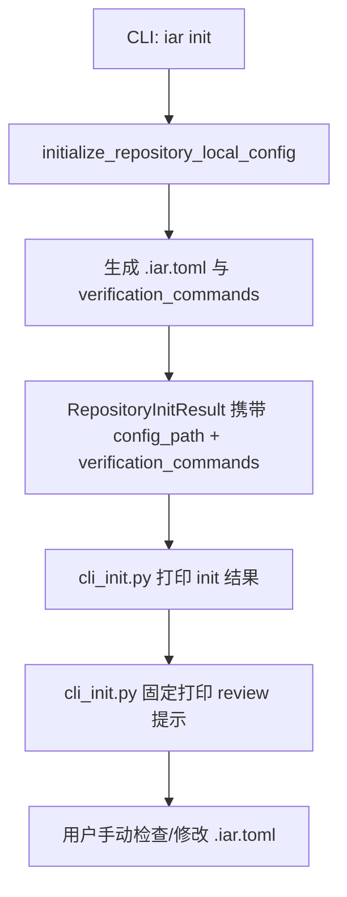

# PRD: iar init 完成后始终提示用户 review verification_commands

> 本 PRD 分为两层：Part A 供人审快速理解问题、价值与风险；Part B 供执行器实现。人审层不包含文件路径、命令或调度元数据。

# Part A · 人审层 (Review Layer)

## 1. Introduction & Goals

### Problem Statement

`iar init` 通过 `detect_verification_commands()` 用规则探测目标仓库的交付门禁，生成的 `verification_commands` 写入 `.iar.toml`。但规则探测只能识别常见技术栈（Python/uv/just/pre-commit/pytest/mkdocs），对其他语言、自定义脚本或特殊项目结构常常生成过弱的命令（例如只剩 `git diff --check`）。

更重要的是，`verification_commands` 直接决定 runner 提交前跑哪些检查，**是交付质量的最后防线**。当前 `iar init` 写完后没有任何提醒，用户很容易误以为生成结果就是最佳配置，导致后续 agent 提交未通过测试或 lint 的代码。

### Interpretation (解读回显)

本需求被理解为：

- **不是**要在 `iar init` 内部集成 AI agent；
- **也不是**要根据生成结果强弱做条件提示；
- **而是**在 `iar init`（含 `--dry-run`）完成后，**始终**给出一行简洁、明确的提醒：请用户根据实际情况 review 并调整 `.iar.toml` 里的 `[agent_runner.runner].verification_commands`；
- 提示里给出 `.iar.toml` 路径、当前生成的命令、以及一条操作建议（可复制给 AI 或自己修改）；
- 不新增 CLI flag，不调用任何 LLM，不增加 init 耗时，不做强弱判断。

### What The User Gets

作为在任意仓库首次运行 `iar init` 的开发者/operator：

- 每次 `iar init` 或 `iar init --dry-run` 完成后，都会看到一条提示；
- 提示明确告知：`verification_commands` 是自动探测的，需要按实际项目情况检查和调整；
- 提示包含 `.iar.toml` 路径和当前生成的命令列表；
- 用户可以根据提示手动修改，或复制内容到自己的 AI 工具询问建议；
- 不强制、不自动、不影响 init 原有行为。

### Measurable Objectives

- `iar init` 与 `iar init --dry-run` 完成后均打印 review 提示；
- 提示中包含 `.iar.toml` 的绝对路径和当前 `verification_commands`；
- 提示文案不超过 5 行，不淹没其他 init 输出；
- 不引入新的 CLI 参数、不调用 LLM、不增加 init 耗时；
- 同步更新 `docs/guides/agent-runner.md`，说明 init 后必须 review `verification_commands`。

## 2. Human Review Map (介入与风险地图)

固定 zone 与跨层 trigger 菜单：

① core 业务逻辑 / 编排层
② 数据库结构 / schema / 迁移
③ 安全 / 认证 / 信任边界
④ 外部 API 契约 / 破坏性变更
⑤ 资金 / 计费 / 配额
⑥ 不可逆或破坏性数据操作
⑦ 并发 / 事务 / 幂等性

### 命中的人审项

本次无人工确认项。

### 未命中

①②③④⑤⑥⑦ 均不命中：
- ① core 业务逻辑：只改 init 完成后的提示文案，不改 verification 执行逻辑；
- ② 数据库结构变化：无 schema/迁移；
- ③ 安全 / 信任边界：不执行任何命令，不引入任意命令执行风险；
- ④ 外部 API 契约：不改 CLI 契约；
- ⑤ 资金/计费：不调用 LLM；
- ⑥ 不可逆/破坏性数据操作：最坏情况只是多打印一行提示；
- ⑦ 并发/事务：`iar init` 仍是单进程本地文件操作。

### 改动点分类

| 改动点 | 架构层 | 风险 | 介入方式 | 证据 / Oracle |
|---|---|---|---|---|
| init 完成后固定打印 review 提示 | api | 低 | 执行器 + 门禁 | rv-1 |
| `--dry-run` 模式同样打印提示 | api | 低 | 执行器 + 门禁 | rv-2 |
| 文档更新 | docs | 低 | 执行器 + 门禁 | rv-3 |

### 如何证明它生效（真实入口，白话）

在任意仓库执行 `iar init --dry-run`，终端除了打印 TOML 外，最后一行（或附近）会出现黄色提示："请检查 `.iar.toml` 中的 `[agent_runner.runner].verification_commands`，当前为 [...]，建议根据项目实际 test/lint/build 命令调整。" 同一仓库执行 `iar init` 写入文件后，也打印相同提示。在 keda 仓库执行时同样打印，不因规则探测结果强而跳过。

### 数据库结构评审

本次无数据库结构变化。

## 3. Usage And Impact After Implementation

### 按角色使用流程

**开发者 / operator（任意仓库首次初始化）**

```bash
cd /path/to/target-repo
iar init --dry-run
# 输出 TOML + review 提示

iar init
# 写入 .iar.toml + 打印 review 提示
```

**看到提示后**

1. 打开 `.iar.toml`；
2. 检查 `[agent_runner.runner].verification_commands`；
3. 根据项目实际 test/lint/build 命令修改；
4. 可选：把当前命令列表复制到自己的 AI 工具，询问建议。

### 提示输出示例

```text
⚠️  请检查 /Users/zata/code/keda/.iar.toml 中的 verification_commands / Please review verification_commands in /Users/zata/code/keda/.iar.toml:
    ["git diff --check", "just test", "uv run mkdocs build --strict"]
    这些命令由 iar init 自动探测生成，建议根据项目实际 test/lint/build 命令复核并调整。
    These commands are auto-detected by iar init; please review against your actual test/lint/build setup.
```

### 对现有行为的影响

- 不新增 CLI flag；
- 不改规则探测逻辑；
- 不调用任何 LLM；
- 每次 init 多打印一行提示，无其他副作用。

## 4. Requirement Shape

- **Actor**: 在目标仓库运行 `iar init` 的开发者或 operator。
- **Trigger**: `iar init` 或 `iar init --dry-run` 完成。
- **Expected Behavior**:
  - `iar init` 正常生成基线 `verification_commands` 并写入/展示 `.iar.toml`；
  - 完成后始终打印一行 review 提示，告知用户需要检查 `[agent_runner.runner].verification_commands`；
  - 提示包含 `.iar.toml` 路径和当前生成的命令列表；
  - `--dry-run` 与真实写入均打印。
- **Scope Boundary**:
  - 只增加一条固定提示；
  - 不集成 agent、不新增 CLI 参数、不做强弱判断、不改 verification 执行逻辑；
  - 不替用户修改 `.iar.toml`。

# Part B · 执行器层 (Build Layer)

## 5. Repository Context And Architecture Fit

### Current relevant modules / files

- `src/backend/engines/agent_runner/repository_local.py` — `initialize_repository_local_config()` 返回 `RepositoryInitResult`，其中已包含 `config_path` 和生成的 TOML 文本。
- `src/backend/api/cli_init.py` — `_run_init_command()`，负责打印 init 结果。
- `docs/guides/agent-runner.md` — `verification_commands` 说明章节。
- `tests/test_agent_runner_init.py` — 现有 init 行为测试。

### Existing architecture pattern to follow

- 四层依赖方向：`api/` → `core/` → `engines/` → `infrastructure/`。
- 提示打印放在 `api/cli_init.py`，与现有 init 结果输出同层。
- 当前命令列表可从 `RepositoryInitResult.config_text` 解析，或从 `RepositoryInitOptions` 透传过来的结果中提取；最简单做法是在 `repository_local.py` 把 `verification_commands` 放进 `RepositoryInitResult`。

### Ownership and dependency boundaries

- `engines/agent_runner/repository_local.py`：`RepositoryInitResult` 增加 `verification_commands: list[str]` 字段。
- `api/cli_init.py`：在 init 输出末尾打印固定提示。
- 不改动 `core/`、`infrastructure/` 或 runner 执行逻辑。

### Constraints from runtime, docs, tests, workflows

- 单文件 ≤ 1000 行；本次改动很小，无膨胀风险。
- Python I/O 显式 `encoding="utf-8"`（本次不涉及新文件 I/O）。
- `just test` 为最终回归门禁。
- 提示文案需简洁，颜色使用参考 `backend.api.cli_console` 的 `error_console` / `console`。

### Matching or related PRDs found

- `tasks/archive/20260525-230847-prd-iar-repository-local-init-config.md`：引入 `iar init` 与规则探测。本 PRD 是其小幅增强，无冲突。
- 未发现重复 pending PRD；本 PRD 可独立交付。

### Potential redundancy risks

- 不要把提示逻辑散到多个 CLI 入口；只在 `cli_init.py` 的 `_run_init_command` 里统一处理。
- 不要引入复杂的 TOML 解析来提取 `verification_commands`；优先在生成阶段直接带出来。

## 6. Recommendation

### Recommended Approach

1. 扩展 `RepositoryInitResult`，增加 `verification_commands: list[str]` 字段。
2. 在 `build_repository_local_config_text()` / `initialize_repository_local_config()` 中，把最终写入 TOML 的 `verification_commands` 填入该字段。
3. `api/cli_init.py` 的 `_run_init_command()` 在打印完现有结果后，统一追加一行黄色提示：
   - 提示 `.iar.toml` 路径；
   - 提示当前 `verification_commands`；
   - 建议用户根据实际项目情况调整。
4. `--dry-run` 与真实写入走同一路径。
5. 同步更新 `docs/guides/agent-runner.md`，在 `iar init` 使用说明里加入"检查 verification_commands"步骤。

### Proposed Solution Summary (实现机制)

- 不调用任何 LLM，不做强弱判断。
- `iar init` 只负责：生成配置 → 写入/展示 → 固定追加 review 提示。
- 新增代码量极少：一个 dataclass 字段 + 一行打印。

### Why this is the best fit for the current architecture

- 最小侵入：不改 CLI 参数、不改配置 schema、不改规则探测、不依赖 agent。
- 影响明确：只是提醒，不自动改任何行为。
- 覆盖面全：无论规则探测强弱，用户都被提醒 review，避免遗漏。

### Alternatives Considered

- **根据生成结果强弱条件提示**：拒绝。判断逻辑可能误判（如纯文档仓库确实只需要 `git diff --check`），且增加无必要的复杂度；统一提醒更稳妥。
- **在 `iar init` 内部调用 agent 自动生成并写入**：拒绝。引入非确定性、agent 依赖、安全校验复杂度。
- **扩展规则探测覆盖所有技术栈**：拒绝。维护成本高，且无法覆盖自定义脚本；文档和提示已足够引导用户处理。
- **完全不提示**：拒绝。当前行为让用户误以为生成结果就是最佳配置，导致交付门禁偏弱。

## 7. Implementation Guide

This section is a living implementation guide based on current repository analysis. If implementation discovers additional affected files, hidden dependencies, edge cases, or a better path, update this PRD before proceeding.

### Core Logic

1. `iar init` / `iar init --dry-run` 正常生成 `.iar.toml`。
2. `initialize_repository_local_config()` 返回的 `RepositoryInitResult` 携带 `verification_commands`。
3. `cli_init.py` 的 `_run_init_command()` 在输出 TOML/写入结果后，打印固定 review 提示。
4. 用户根据提示手动检查/修改 `.iar.toml`。

### 提示文案格式（供实现直接采用）

使用 `error_console.print` 输出黄色警告样式，文案如下：

```text
⚠️  请检查 {config_path} 中的 verification_commands / Please review verification_commands in {config_path}:
    {verification_commands}
    这些命令由 iar init 自动探测生成，建议根据项目实际 test/lint/build 命令复核并调整。
    These commands are auto-detected by iar init; please review against your actual test/lint/build setup.
```

其中 `{config_path}` 为 `.iar.toml` 绝对路径，`{verification_commands}` 为列表的 repr 字符串。保持四行，避免淹没其他输出。

### Change Impact Tree

```text
.
├── src/backend/engines/agent_runner/repository_local.py
│   [修改]
│   【总结】RepositoryInitResult 增加 verification_commands 字段，便于 CLI 打印提示
│
│   └── RepositoryInitResult dataclass 新增 verification_commands: list[str]
│
├── src/backend/api/cli_init.py
│   [修改]
│   【总结】init 完成后固定打印 review 提示
│
│   └── _run_init_command 在输出 TOML/写入结果后，打印包含 config_path 和 verification_commands 的提示
│
├── tests/test_agent_runner_init.py
│   [修改]
│   【总结】验证 RepositoryInitResult 携带 verification_commands 且 CLI 输出包含提示
│
│   ├── test_init_result_includes_verification_commands
│   └── test_iar_init_dry_run_prints_review_hint
│
└── docs/guides/agent-runner.md
    [修改]
    【总结】在 iar init 使用说明里加入检查 verification_commands 的步骤
```

### Executor Drift Guard

- `RepositoryInitResult` 是 frozen dataclass，新增字段时注意所有构造点；可用 `rg -n "RepositoryInitResult\(" src/backend tests/` 扫全。
- 提示不要硬编码 ANSI 颜色；使用 `backend.api.cli_console` 的 `error_console` / `console`。
- 提示文案保持简短，避免淹没 `iar init` 的其他输出。

搜索锚点：

```bash
# 确认 RepositoryInitResult 所有构造点都已更新
rg -n 'RepositoryInitResult\(' src/backend/ tests/

# 确认 init 输出中 verification_commands 出现位置
rg -n 'verification_commands' src/backend/api/cli_init.py
```

### Flow or Architecture Diagram



### Realistic Validation Plan

```yaml
- id: rv-1
  behavior: 任意仓库 iar init 完成后打印 review 提示
  real_entry: "cd /tmp/iar-test && git init && iar init"
  expected: "stdout/stderr 出现包含 '.iar.toml' 路径和当前 verification_commands 的提示"
  mock_boundary: "文件系统真实"
  negative_control: "注释掉 _run_init_command 里的提示打印逻辑"
  expected_fail: "init 完成后没有 review 提示"
  test_layer: integration
  required_for_acceptance: true

- id: rv-2
  behavior: --dry-run 模式同样打印 review 提示
  real_entry: "cd /tmp/iar-test && iar init --dry-run"
  expected: "stdout 出现与真实写入一致的 review 提示"
  mock_boundary: "文件系统真实"
  negative_control: "只在 wrote_file 分支打印提示，dry-run 分支不打印"
  expected_fail: "dry-run 时无提示"
  test_layer: integration
  required_for_acceptance: true

- id: rv-3
  behavior: 文档同步且可构建
  real_entry: "uv run mkdocs build --strict"
  expected: "构建成功，docs/guides/agent-runner.md 中出现 init 后检查 verification_commands 的说明"
  mock_boundary: "无"
  negative_control: "删除文档新增段落后 rg 搜索为空"
  expected_fail: "mkdocs 构建失败或文档未同步"
  test_layer: smoke
  required_for_acceptance: true
```

Failure triage: 若 rv-1 失败，检查 `RepositoryInitResult` 是否正确携带 `verification_commands` 以及 `_run_init_command` 是否打印；若 rv-2 失败，检查提示是否在 dry-run 分支也执行。

### Low-Fidelity Prototype

不需要 UI 原型。

### ER Diagram

本次无数据模型变化。

### Interactive Prototype Change Log

无交互原型文件变更。

### External Validation

No external validation required; repository evidence was sufficient.

## 8. Delivery Dependencies

- Group: none
- Depends on groups:
  - none
- Depends on tasks/issues:
  - none
- Gate type: none
- Notes: 本 PRD 可独立交付；不依赖其他 pending PRD。

## 9. Acceptance Checklist

### Human-Confirmed

本次无人工确认项。

### Behavior Acceptance

- [x] 任意仓库执行 `iar init` 后打印 review 提示（rv-1）。
- [x] 任意仓库执行 `iar init --dry-run` 后也打印 review 提示（rv-2）。
- [x] 提示中包含 `.iar.toml` 路径和当前 `verification_commands`。
- [x] 提示不淹没其他 init 输出，长度控制在 5 行以内。

### Documentation Acceptance

- [x] `docs/guides/agent-runner.md` 已更新 init 后检查 `verification_commands` 的说明（rv-3）。

### Validation Acceptance

- [x] rv-1、rv-2、rv-3 全部通过。
- [x] `just test` 全量回归通过。

### Delivery Readiness

- [x] 推荐方案完整实现，无开放回归或 rollout blocker。
- [x] PRD 中所有 Decision Log 决策已在代码中落地。

## 10. Functional Requirements

- **FR-1**: `iar init` 完成后始终打印 `verification_commands` review 提示。
- **FR-2**: `--dry-run` 模式与真实写入模式打印相同提示。
- **FR-3**: 提示包含 `.iar.toml` 路径和当前生成的 `verification_commands`。
- **FR-4**: 提示建议用户根据项目实际 test/lint/build 命令调整。
- **FR-5**: 不新增 CLI flag，不调用任何 LLM，不增加 init 耗时。

## 11. Non-Goals

- 不在 `iar init` 内部集成 AI agent 自动生成命令。
- 不做 `verification_commands` 强弱条件判断。
- 不替用户写回 `.iar.toml`。
- 不扩展规则探测覆盖所有技术栈。

## 12. Risks And Follow-Ups

- **提示被忽略**：只是打印一行文字，无法强制用户行动。缓解：使用黄色高亮，并在文档中强调其重要性。
- **提示频率**：每次 `iar init --force` 都会打印。缓解：这是预期行为，用户看到一次即可修改。

## 13. Decision Log

| ID | Decision | Chosen | Rejected | Rationale |
|---|---|---|---|---|
| D-01 | 是否集成 agent 到 `iar init` | 不集成，只打印固定提示 | 内部调用 agent 自动生成 | 避免非确定性、agent 依赖和安全校验复杂度。 |
| D-02 | 提示触发策略 | 始终打印，不做条件判断 | 仅基线偏弱时打印 | 判断逻辑可能误判，统一提醒更稳妥；实现也最简单。 |
| D-03 | 提示内容 | 简短提醒 + 当前命令列表 | 提供完整 AI prompt | 用户可自行决定是否用 AI；保持提示简短，不增加复杂度。 |
| D-04 | 是否新增 CLI flag | 不增加 | 增加 `--skip-hint` / `--show-hint` | 最小改动；提示无侵入性，不需要开关。 |
