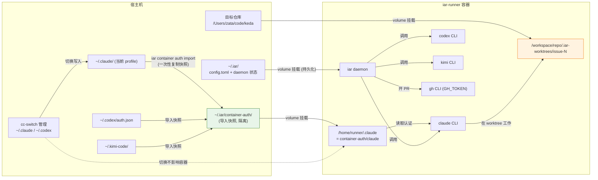

# PRD: iar agent runner Docker 容器化与 cc-switch 认证隔离导入

- GitHub Issue: https://github.com/zata-zhangtao/keda/issues/128

> 本 PRD 分两个 altitude，自上而下阅读：
>
> - **Part A · 人审层 (Review Layer)** — 需求方 / 验收人读这部分，决定"该不该做、做得对不对"，并通过风险地图知道哪些地方必须亲自确认。Part A 不出现实现机制、文件路径、命令。
> - **Part B · 执行器层 (Build Layer)** — 实现者读这部分动手。人只在 Part A 风险地图点名处下钻审查。

---

# Part A · 人审层 (Review Layer)

## 1. Introduction & Goals

### Problem Statement

iar（issue-agent-runner）当前完全依赖宿主机预装的一整套工具链才能跑起来：三个 agent CLI（`claude` / `codex` / `kimi`）、`gh`、`Node.js`（claude/codex 是 npm 包）、`uv` + `just`（verification 命令用）、`git`。这套工具链直接装在用户日常使用的本机上，带来三个痛点：

1. **环境污染与版本冲突**：agent CLI 是 Node 生态、iar 是 Python 生态，混装在本机；npm 全局包、Node 版本、Python venv 互相干扰，出问题难定位。
2. **与本机交互式使用冲突**：用户本机也用 cc-switch 切换 claude 账号做交互式编码。iar daemon 后台跑时，与本机共用同一份 `~/.claude/` 配置——cc-switch 一切换，正在跑的 daemon 任务可能中途换账号、token 失效。
3. **复现与迁移困难**：换台机器要重新装一遍全套工具链并逐个登录，没有"一键拉起"的能力。

用户希望把 runner 跑进 Docker 容器，让容器自己装好 agent CLI 与工具链，与本机环境隔离；同时希望配置简单——能复用本机 cc-switch 已管好的账号，但容器里用的账号要与本机当前用的**分开**，互不影响。

### Interpretation (解读回显)

我把这个需求读作：**容器化 runner 运行环境 + 认证一次性导入到容器专用目录、与本机 cc-switch 当前 profile 隔离 + worktree 建在挂载目录保证本地可见 + 单仓库先跑通**。

具体读作：
- ✅ 容器内预装全套工具链（claude/codex/kimi CLI + gh + Node + uv + just + git），宿主机不装任何 agent CLI
- ✅ 新增 `iar container auth import` 命令导入认证 + `iar container up/down/logs` 命令管理容器生命周期
- ✅ 容器用的账号是导入时刻的快照，之后本机 cc-switch 随便切，容器不变
- ✅ 目标仓库挂载进容器，worktree 建在挂载目录的 `.iar-worktrees/` 下，宿主机可直接 `iar worktree open` 查看
- ✅ 单仓库先跑通（一个 compose 服务跑一个仓库的 daemon）

我**不**把它读作：
- ❌ 让容器与本机共享 `~/.claude` 等配置目录（用户已明确否决——要的是隔离，不是共享）
- ❌ 绕过 agent CLI 直接调 LLM API（iar 深度依赖三个 CLI 的 agentic 行为契约：stream-json 输出、sandbox、commit proxy，改纯 API 等于重写 agent runtime，不在本次范围）
- ❌ 多仓库 registry 容器化（单仓库先跑通，多仓库是 follow-up）
- ❌ 容器自动 provision CLI 到宿主机（方向反了——是把 CLI 装进容器，不是从容器装到宿主）

如果这个解读偏了，请在动工前指出。

### What The User Gets

实施完成后，**iar 的运营者**会拿到这套能力：

- **一条命令导入认证**：在本机 cc-switch 切到想给容器用的账号，跑 `iar container auth import`，当前账号的认证 + 关键设置 + skills 被复制到 `~/.iar/container-auth/`。之后本机切回自己用的账号，容器固定用导入的那个。
- **一条命令管理容器生命周期**：`iar container up` 启动 runner 容器（自动定位 compose 文件、传环境变量），`iar container down` 停止，`iar container logs` 看日志。不需要记住 compose 文件路径。
- **本地可见 worktree**：agent 在容器里建的 worktree 落在挂载目录里，宿主机 IDE 直接打开看、本地接管都行。
- **本机干净**：宿主机不用装 claude/codex/kimi CLI（除非本机也要交互式用），容器销毁后无残留。
- **隔离不串扰**：容器跑着 daemon 时，本机用 cc-switch 切账号、开 claude 写代码，互不影响。

能力边界：
- 仍然**不改 iar 的执行模型**（agent 调用、commit proxy、recovery、verification 流程不变）
- 仍然**不改 agent CLI 的调用契约**（`run_agent_once.py` 里三个 `_build_*_command` 不动）
- 仍然**单仓库**（compose 跑一个仓库，多仓库是 Non-Goal）

### Measurable Objectives

1. **容器内全工具链可用**：`iar container up` 启动后，容器内 `claude --version` / `codex --version` / `kimi --version` / `gh --version` / `iar --version` / `uv --version` / `just --version` 全部 exit 0
2. **认证导入可验证**：`iar container auth import` 后，`~/.iar/container-auth/` 下 claude/codex/kimi 三个子目录各有认证文件 + skills 目录，且内容与导入时刻本机一致
3. **隔离性**：容器内 claude 读到的是 `container-auth` 里的 `ANTHROPIC_AUTH_TOKEN`，与本机 `~/.claude/settings.json` 当前值不同（导入后本机 cc-switch 切换不影响容器）
4. **真实跑通一次 dry-run**：容器内 `iar run --dry-run` 对挂载的目标仓库 exit 0，能正确读取 Issue 队列
5. **worktree 本地可见**：容器内触发 worktree 创建后，宿主机 `<repo>/.iar-worktrees/issue-<N>` 路径存在且可读写
6. **文件权限对齐**：容器写出的文件（worktree 内 commit、.iar 状态）在宿主机上属主 = 宿主机当前用户，非 root
7. **现有测试不回归**：`uv run pytest -o addopts="" tests/` 全绿（本次只新增容器资产 + container 专用 facade/实现模块 + CLI 子命令，不改现有 runner 编排逻辑）

---

## 2. Human Review Map (介入与风险地图)

判定菜单：

- 固定区域：① Core 业务逻辑 / 编排规则（`core/`）② 数据库结构 / schema / 迁移 ③ 安全 / 鉴权 / 信任边界 ④ 对外 API 契约 / breaking change
- 横切触发器：⑤ 资金 / 计费 / 额度 ⑥ 不可逆 / 破坏性数据操作 ⑦ 并发 / 事务 / 幂等性

**命中的人审项**：

- ③ 安全 / 鉴权 / 信任边界：认证导入命令读取本机 `~/.claude/settings.json`（含 `ANTHROPIC_AUTH_TOKEN`）、`~/.codex/auth.json`（含 `OPENAI_API_KEY`）、`~/.kimi-code/credentials/` 等敏感凭据并复制到 `~/.iar/container-auth/`；容器又把这些挂载进去——凭据的存储位置、权限、是否进 git 是信任边界变化
- ④ 对外 API 契约：新增 `iar container` CLI 子命令组，属于对外 CLI 契约的新增面（非 breaking，但需人确认子命令形态）
- ⑦ 并发 / 幂等性：同一仓库本机 daemon 与容器 daemon 必须互斥，否则两边会同时轮询/认领 Issue，造成状态竞争和重复 token 消耗

**未命中**：①②⑤⑥——本次不改 `core/` runner 编排逻辑、不动数据库、不涉资金/不可逆操作；按执行器+门禁兜底（最坏情况：容器启动失败或导入漏文件，被 rv-2/rv-3/rv-7 抓出，可重跑修复，无持久损害）。

| 改动点 | 架构层 | 风险 | 介入方式 | 证据 / Oracle |
|---|---|---|---|---|
| `iar container auth import` 读取本机凭据并写入 `~/.iar/container-auth/` | engines + infrastructure | 高（凭据边界） | 人工确认 | rv-1, rv-4 |
| `~/.iar/container-auth/` 目录权限与 gitignore 保护 | infrastructure | 高（凭据泄露） | 人工确认 | rv-4 |
| 新增 `iar container` CLI 子命令组 | api | 中（CLI 契约新增） | 人工确认 | rv-1 |
| `Dockerfile.runner` 预装全套工具链 | infrastructure（随包发布资产） | 低 | 执行器+门禁 | rv-2 |
| `docker-compose.runner.yml` 挂载与权限对齐 | infrastructure | 中（权限错配会污染宿主文件） | 执行器+门禁 | rv-5, rv-6 |
| `iar container up` 与本机 daemon lock 互斥 | core + engines | 中（并发抢占） | 人工确认 | rv-7 |
| worktree 落在挂载目录（本地可见） | 不改代码，仅配置 | 低 | 执行器+门禁 | rv-5 |
| `GH_TOKEN` 环境变量传递 | infrastructure | 低 | 执行器+门禁 | rv-3 |

- **rv-1**（认证导入）：`iar container auth import` 后 `~/.iar/container-auth/claude/settings.json` 的 `env.ANTHROPIC_AUTH_TOKEN` 与本机当前值一致；`~/.iar/container-auth/claude/skills/` 含 `code-reviewer`、`idea-inbox`、`prd`；codex/kimi 同理
- **rv-2**（容器工具链）：容器内 `claude --version && codex --version && kimi --version && gh --version && iar --version && uv --version && just --version` 全 exit 0
- **rv-3**（gh 认证）：容器内 `gh auth status` 显示已登录（通过 `GH_TOKEN`），`gh issue list --repo <挂载仓库>` 能列出 Issue
- **rv-4**（凭据隔离与保护）：导入后改本机 `~/.claude/settings.json` 的 token 值，容器内 claude 读到的仍是旧值（隔离）；`git check-ignore ~/.iar/container-auth/` 返回该路径（不进 git）
- **rv-5**（worktree 本地可见 + 权限）：容器内创建 worktree 后，宿主机 `ls <repo>/.iar-worktrees/` 看到目录，Python `os.stat` 属主 = 宿主机 UID
- **rv-6**（真实 dry-run）：容器内 `iar run --dry-run` 对挂载仓库 exit 0
- **rv-7**（daemon 互斥）：目标 repo_id 已有活 PID daemon lock 时，`iar container up --dry-run --repo-id <repo_id>` 拒绝启动且不调用 docker compose

**如何证明它生效（真实入口，白话）**：在本机 cc-switch 切到给容器用的账号 → 跑 `iar container auth import` → `iar container up` 起容器 → 进容器跑 `iar run --dry-run` 看到能正常读 Issue 队列、`gh` 能列 Issue、claude 能用导入的 token；然后本机 cc-switch 切到别的账号，容器里 claude 用的还是导入时的那个账号——隔离成立。再人为放置一个同 repo_id 的活 PID daemon lock，确认 `iar container up --dry-run` 拒绝启动，证明本机 daemon 与容器 daemon 不会抢同一队列。

**数据库结构评审**：本次无数据库结构变化。

---

## 3. Usage And Impact After Implementation

### 运营者使用流程

1. **一次性导入认证**（本机 cc-switch 切到想给容器用的账号后）：
   ```
   iar container auth import
   ```
   产出 `~/.iar/container-auth/{claude,codex,kimi-code}/`，含认证 + skills。想换容器用的账号？本机切过去再跑一次导入（覆盖）。

2. **准备 GitHub 凭据**：`gh auth token` 导出 `GH_TOKEN` 写进目标仓库的 `.env` 或 `.env.local`。

3. **启动容器 runner**：
   ```
   iar container up
   ```
   iar 自动定位随包发布的 compose 文件、传入 `GH_TOKEN` 与 `RUNNER_UID`/`RUNNER_GID`，后台启动 runner daemon 容器。

4. **查看 worktree**：agent 跑起来后，宿主机 `<repo>/.iar-worktrees/issue-<N>/` 直接可见，IDE 打开、`iar worktree open` 都行。

5. **看日志与停止**：`iar container logs` 看 daemon 输出；`iar container down` 停止容器。

### 对现有行为的影响（向后兼容）

- **本机 `iar daemon` 完全不变**：不装 Docker、继续本机跑 `iar daemon` 的用户零影响。容器化是纯增量能力——`iar container up` 只是换了一个运行环境来跑同一个 `iar daemon` 进程。
- **本机与容器互斥**：同一个仓库不能同时跑本机 `iar daemon` 和 `iar container up`（标签会冲突、两边抢同一个 `agent/running` Issue）。用户选择一种方式跑。`iar container up` 前必须复用现有 daemon lock 语义检测本机 daemon 是否在跑；命中时拒绝启动并提示；`iar container down` 后本机 daemon 不受影响。
- **不强制容器化**：`iar container auth import` 与 `iar container up` 都是 opt-in，不影响现有 `iar run` / `iar daemon` 路径。
- **现有 `.iar.toml` 不需改**：worktree 默认建在 `<repo>/.iar-worktrees/`，容器内挂载后天然本地可见，无需改 `create_command`。
- **新增可选配置**：`~/.iar/container-auth/` 目录是新增的，默认不存在，只在用户主动跑 `iar container auth import` 后产生。

---

## 4. Requirement Shape

- **actor**：iar 运营者（在本机用 cc-switch 管理多个 agent 账号、想用容器隔离跑 daemon 的人）
- **trigger**：运营者希望 iar runner 在隔离环境运行，不污染本机、不与本机交互式使用冲突
- **expected behavior**：
  1. 运营者跑 `iar container auth import`，本机当前 cc-switch profile 的认证 + skills 被复制到 `~/.iar/container-auth/`
  2. 运营者跑 `iar container up`，iar 自动定位 compose 文件、传环境变量、启动容器
  3. 容器内 `iar daemon` 轮询，agent 在挂载目录的 worktree 里工作，产物本地可见
  4. 本机 cc-switch 切换账号，容器内 agent 认证不变
  5. `iar container logs` 看日志，`iar container down` 停止
- **explicit scope boundary**：单仓库；不改 `core/` runner 编排逻辑；不做多仓库 registry；容器管理命令走 `subprocess.run(["docker", "compose", ...])` 而非引入 docker SDK

---

# Part B · 执行器层 (Build Layer)

## 5. Repository Context And Architecture Fit

### 现有相关模块

- **agent CLI 调用**：`src/backend/core/use_cases/run_agent_once.py` 的 `_build_claude_command` / `_build_kimi_command` / `_build_codex_command`（语义锚点：`_AGENT_COMMAND_BUILDERS` 字典）——硬编码三个 CLI 的 subprocess 调用，**本次不改**
- **agent CLI 不可用处理**：`src/backend/core/use_cases/agent_runner_failure.py` 的 `AgentUnavailableError`（CLI 缺失时抛出，触发 fallback）——容器内 CLI 预装后不会触发
- **worktree 默认路径**：`src/backend/core/use_cases/worktree_cleanup.py` 的 `DEFAULT_WORKTREE_DIR_NAME = ".iar-worktrees"`——worktree 建在 `<repo>/.iar-worktrees/issue-<N>`
- **gitignore 管理**：`src/backend/engines/agent_runner/repository_gitignore.py` 已把 `.iar-worktrees/` 纳入 IAR-managed gitignore 段
- **全局配置目录**：`src/backend/infrastructure/config/settings.py` 的 `global_dir()`（`return Path.home() / ".iar"`）——`~/.iar/` 是 iar 全局根，`container-auth/` 放这里同根
- **现有 Docker 资产**：`src/backend/Dockerfile`（python:3.13-slim + uv + 非 root `appuser`，给 web backend）、仓库根 `docker-compose.yml`（backend + db + 前端）——**本次新增独立 runner 资产，不复用这两个**
- **CLI 子命令注册**：`src/backend/api/cli_typer_app.py` 用 Typer 子 app 组织（`daemon_app`、`worktree_app`、`issue_app` 等），新增 `container_app` 沿用此模式
- **gh 依赖**：`src/backend/infrastructure/github_client.py` 重度依赖 `gh` CLI——容器必须装 gh
- **preview workflow 模板**：`src/backend/engines/agent_runner/templates/preview/` 是现成的"iar 把资产随包发布并按需定位/复制"先例（`workflow_install.py`）——本次 runner 容器资产同样放入 package data，`iar container up` 通过包内资源定位，不依赖用户克隆 keda 源码

### 现有架构模式

- 四层依赖方向：`api → core → engines → infrastructure`，由 `hooks/shared/check_architecture.py` 强制
- CLI 用 Typer 子 app 组合，主入口 `cli_typer_app.py` 聚合各 `cli_typer_*` 模块
- 全局状态在 `~/.iar/`，仓库级配置在 `.iar.toml`

### 归属与依赖边界

- **`iar container auth import` 的接入** → `src/backend/api/cli_typer_container.py` 只做 Typer 参数解析并进入 core 用例；不得新增 `api → engines` 直连
- **`iar container auth import` 的用例边界** → `src/backend/core/use_cases/agent_runner_container.py`（或同等命名）作为薄用例/facade，保持 `api → core` 方向；不改现有 `run_agent_once.py` 等 runner 编排逻辑
- **认证导入与容器生命周期实现** → `src/backend/engines/agent_runner/container_auth.py` / `container_ops.py` 作为实现模块；若 `P1-REFACTOR-20260703-184226-api-engines-layer-migration.md` 已完成，按其 facade/port 模式接入；若未完成，本 PRD 不得新增新的 `api → engines` 依赖
- **Dockerfile + compose + `.env.example`** → `src/backend/engines/agent_runner/templates/runner_container/`，纳入现有 `backend.engines.agent_runner.templates` package data，确保 wheel / `uv tool install keda` / release tarball 安装后也能定位
- **文档** → `docs/guides/agent-runner.md`（已有）增补容器化章节 + `docs/getting-started/installation.md` 提及容器化选项

### Frontend Impact

No frontend impact。本次改动是后端 CLI + infrastructure 资产，不触达 `frontend-admin/` 或 `frontend-public/` 的任何组件、路由、API 客户端。容器化 runner 是运营者侧能力，无管理台 UI 变化。

### 约束

- Python ≥ 3.11（`pyproject.toml`）；现有 `src/backend/Dockerfile` 用 python:3.13-slim，runner 镜像沿用
- claude/codex 是 npm 包，容器必须装 Node.js
- kimi 是独立二进制安装（本机在 `~/.kimi-code/bin/kimi`），容器内需复刻其安装方式
- gh 的 token 在 macOS keychain，容器读不到——必须用 `GH_TOKEN` 环境变量
- `.env.example` 规范：密钥类变量保留未注释空值（CLAUDE.md 规则），`GH_TOKEN` 属此类

### 现有 PRD 关系

`tasks/pending/` 现有 6 个其他 PRD。容器化需求与功能面不重复，但与 `P1-REFACTOR-20260703-184226-api-engines-layer-migration.md` 有架构顺序关系：本 PRD 会新增 CLI 子命令，不能继续扩大 `api → engines` 直连债务。**因此本 PRD 依赖 api-engines-layer-migration，或在实现时必须直接采用该 PRD 的目标形态（`api → core`，实现细节不从 `api` 直连）。** `tasks/archive/` 未检索到容器化相关历史 PRD。

---

## 6. Recommendation

### Recommended Approach

**新增随包发布的 runner 容器资产 + `iar container auth import` 认证导入命令 + `iar container up/down/logs` 容器生命周期管理**，不改动现有 runner 执行逻辑。

五个交付物：
1. `src/backend/engines/agent_runner/templates/runner_container/Dockerfile.runner` —— 随包发布的 runner 镜像定义，预装全套工具链
2. `src/backend/engines/agent_runner/templates/runner_container/docker-compose.runner.yml` —— 随包发布的单仓库服务定义，挂载仓库 + container-auth + 全局状态
3. `src/backend/engines/agent_runner/templates/runner_container/.env.example` —— compose 环境变量示例，密钥类变量保持未注释空值
4. `iar container auth import` CLI 命令 —— 从本机现有配置复制认证 + skills 到 `~/.iar/container-auth/`
5. `iar container up / down / logs` CLI 命令 —— 容器生命周期管理，`subprocess.run` 封装 compose

### 为什么这是当前架构的最佳契合

- **零侵入 runner 核心**：`run_agent_once.py` 的 CLI 调用、commit proxy、recovery 流程一行不动。容器只是换了个"跑 iar 的地方"，iar 自己不知道自己在容器里。
- **复用 `~/.iar/` 全局根**：`container-auth/` 放 `~/.iar/` 下，跟 `config.toml`、`daemon-locks`、`repos` 同根，符合现有全局状态布局。
- **复用 Typer 子 app 模式**：`container_app` 与 `daemon_app`、`worktree_app` 平级，注册方式一致。
- **不新增 `api → engines` 债务**：`cli_typer_container.py` 只负责参数解析和命令分发，业务入口经 `core/use_cases` facade；实现层按 `api-engines-layer-migration` 的目标形态接入。
- **复用 `src/backend/Dockerfile` 的 base 选择**：python:3.13-slim + uv 安装方式 + 非 root 用户模式，runner 镜像照搬，额外加 Node + gh + agent CLI。
- **不耦合 Docker SDK**：iar 通过 `subprocess.run(["docker", "compose", ...])` 调 Docker CLI，不引入 `docker-py` 或其他 Docker Python SDK。`iar container up/down/logs` 只是把用户不用记的 compose 文件路径和参数封装好。

### 拒绝的冗余抽象

- **不引入 docker Python SDK**：`subprocess.run(["docker", "compose", ...])` 足够封装 `up/down/logs`，不需要 `docker-py`。docker daemon 交互由 docker CLI 自己处理。
- **不新建复杂"容器配置 provider"抽象**：只新增薄 core facade + 具体实现模块；facade 仅用于维护 `api → core` 边界，不引入可插拔 provider 体系。
- **不改 `run_agent_once.py` 加"容器感知"分支**：容器内 iar 跟本机 iar 走完全相同的代码路径，不需要 if-in-container 判断。

### Proposed Solution Summary (实现机制)

**机制**：容器镜像 build 时预装全套工具链；运行时通过 volume 挂载把目标仓库、容器专用认证目录、全局状态目录接进容器；容器以宿主机 UID 跑 `iar daemon`，agent 在挂载的仓库目录里建 worktree 工作。用户通过 `iar container up/down/logs` 管理容器，不需要直接碰 compose 文件或 docker 命令。CLI 入口只进入 core use-case facade，具体文件复制和 compose 调用由实现模块承担。

**谁提供什么**：
- 镜像 build 时：`Dockerfile.runner` 装好 claude/codex/kimi/gh/uv/just/git + iar 自身；默认通过构建参数安装当前 keda 版本（GitHub release tarball 或 PyPI），开发模式可显式传本地源码路径走 editable 安装
- 运行时用户提供：目标仓库路径（`.env` / `.env.local` 中的 `REPO_PATH`）、`GH_TOKEN` 环境变量、`~/.iar/container-auth/`（由 `iar container auth import` 预先生成）
- `iar container up` 自动处理：通过 `importlib.resources` 定位随包发布的 compose 文件、传 `RUNNER_UID:RUNNER_GID`（从 `os.getuid()`/`os.getgid()` 自动获取）、传 `GH_TOKEN`、传 `REPO_PATH`
- 系统推断：UID/GID 自动获取；compose 文件路径从已安装的 keda package data 自动定位，不依赖当前机器存在 keda 源码 checkout

**插入的现有入口**：`iar container auth import` 走 `cli_typer_container.py` → core container use case → 注入的 container auth 实现；`iar container up/down/logs` 走 `cli_typer_container.py` → core container use case → 注入的 container ops 实现 → `subprocess.run`；`iar daemon` 走现有 `cli_typer_runner.py` → `run_agent_once.py`，零改动。

**主要状态/输出变化**：新增 `~/.iar/container-auth/` 目录树（持久化在宿主机，容器挂载）。无数据库变化。不改现有 runner core 编排逻辑；允许新增 container 专用薄 use case 维护层间边界。

**有意避免的复杂度**：不引入 docker SDK 依赖（`subprocess.run` 调 `docker compose` 足够）；不改 agent 调用契约；不做多仓库。

### Alternatives Considered

- **方案 B：iar 自己 `npm install -g` 装 CLI 到本机**（不容器化）——被否决。只把"手动装"变"自动装"，没解决本机环境污染和与本机交互式使用冲突的核心痛点；且需要本机有 Node.js。
- **方案 C：容器与本机共享 `~/.claude` 等目录**——被用户明确否决。用户要隔离，不要共享；共享会让 cc-switch 切换两边都变。
- **方案 D：绕过 CLI 直接调 LLM API**——被否决。iar 依赖三个 CLI 的 agentic 行为（stream-json、sandbox、commit proxy），改纯 API 等于重写 agent runtime，体量远超本次范围。

---

## 7. Implementation Guide

> This section is a living implementation guide based on current repository analysis. If implementation discovers additional affected files, hidden dependencies, edge cases, or a better path, update this PRD before proceeding.

### Core Logic

**认证导入流程**（`iar container auth import`）：

1. 检测本机 `~/.claude/`、`~/.codex/`、`~/.kimi-code/` 是否存在，缺失的跳过并 WARN
2. 在 `~/.iar/container-auth/` 下建 `claude/`、`codex/`、`kimi-code/` 三个子目录
3. **claude**：复制 `~/.claude/settings.json`（含 `env.ANTHROPIC_AUTH_TOKEN` + `ANTHROPIC_BASE_URL` + model 设置）+ `~/.claude/skills/` 整目录；**不复制** `history.jsonl`、`file-history/`、`paste-cache/`、`plans/`、`plugins/`、`cache/`、`ide/`、`backups/` 等运行时状态
4. **codex**：复制 `~/.codex/auth.json`（`OPENAI_API_KEY`）+ `~/.codex/skills/`；**不复制** `sessions/`、`cache/`、`.tmp/`、`.codex-global-state.json` 等
5. **kimi**：复制 `~/.kimi-code/config.toml` + `credentials/` + `oauth/` + `device_id` + `skills/`；**不复制** `sessions/`、`logs/`、`cache/`、`session_index.jsonl` 等
6. 设置 `~/.iar/container-auth/` 权限 0700（仅宿主用户可读）
7. 确保 `~/.iar/container-auth/` 被 gitignore（写入 `~/.iar/info/exclude` 或确认 `~/.iar/` 整体不进 git）

**容器生命周期管理流程**（`iar container up / down / logs`）：

1. `up`：先按目标仓库 repo_id 检查现有 daemon lock；若本机 daemon 正在服务同一仓库，拒绝启动并提示用户先停本机 daemon
2. `up`：从已安装的 keda package data 定位 `runner_container/docker-compose.runner.yml`；从 `os.getuid()`/`os.getgid()` 拿宿主机 UID/GID 并写入 `RUNNER_UID`/`RUNNER_GID`；按 `.env` 后 `.env.local` 的顺序读取 `GH_TOKEN`、`REPO_PATH`；`subprocess.run(["docker", "compose", "-f", <compose_path>, "up", "-d"], env={...})` 启动服务
3. `down`：`subprocess.run(["docker", "compose", "-f", <compose_path>, "down"])`
4. `logs`：`subprocess.run(["docker", "compose", "-f", <compose_path>, "logs", "-f"])`（streaming）

**容器启动流程**（compose 内部）：

1. compose 读传入的环境变量：`GH_TOKEN`、`RUNNER_UID`、`RUNNER_GID`、`REPO_PATH`
2. 启动 `Dockerfile.runner` 构建的镜像，以 `${RUNNER_UID}:${RUNNER_GID}` user 运行
3. 挂载：`$REPO_PATH → /workspace/repo`、`~/.iar/container-auth/claude → /home/runner/.claude`、`~/.iar/container-auth/codex → /home/runner/.codex`、`~/.iar/container-auth/kimi-code → /home/runner/.kimi-code`、`~/.iar → /home/runner/.iar`（全局状态持久化）
4. 容器内 `WORKDIR /workspace/repo`，`CMD ["iar", "daemon"]`
5. iar daemon 走现有逻辑：轮询 Issue → `git worktree add .iar-worktrees/issue-N`（落在挂载目录，宿主可见）→ 调 claude/codex/kimi（读到 `~/.claude` 即 container-auth 里的认证）→ verification → commit → push → 开 PR（用 `GH_TOKEN`）

### Change Impact Tree

```text
.
├── src/backend/engines/agent_runner/templates/
│   └── runner_container/                          [新增]
│       【总结】随包发布的 runner 容器资产，确保全局安装 iar 后无需克隆 keda 源码也能定位
│
│       ├── Dockerfile.runner
│       │   【总结】runner 容器镜像：python:3.13-slim base 上装 Node + gh + uv + just + 三个 agent CLI + iar 自身
│
│       │   ├── FROM python:3.13-slim，沿用 src/backend/Dockerfile 的 uv 安装方式
│       │   ├── 装 Node.js + npm（claude/codex 是 npm 包）
│       │   ├── 装 gh CLI（apt 或官方源）
│       │   ├── 装 just（cargo 或预编译二进制）
│       │   ├── npm install -g @anthropic-ai/claude-code @openai/codex
│       │   ├── 装 kimi（复刻 ~/.kimi-code/bin/kimi 的安装方式，需确认其官方安装脚本）
│       │   ├── 通过 ARG 安装 keda：默认 release/PyPI；开发模式可传本地源码走 editable
│       │   ├── 建 non-root 用户 runner，运行时由 compose 的 RUNNER_UID/RUNNER_GID 对齐宿主权限
│       │   └── CMD ["iar", "daemon"]
│
│       ├── docker-compose.runner.yml
│       │   【总结】单仓库 runner 服务：挂载仓库 + container-auth + 全局状态，宿主 UID 运行
│
│       │   ├── service: iar-runner，build: Dockerfile.runner
│       │   ├── user: "${RUNNER_UID}:${RUNNER_GID}" 权限对齐
│       │   ├── volumes:
│       │   │   ├── ${REPO_PATH}:/workspace/repo
│       │   │   ├── ~/.iar/container-auth/claude:/home/runner/.claude
│       │   │   ├── ~/.iar/container-auth/codex:/home/runner/.codex
│       │   │   ├── ~/.iar/container-auth/kimi-code:/home/runner/.kimi-code
│       │   │   └── ~/.iar:/home/runner/.iar
│       │   ├── environment: GH_TOKEN, IAR_REPO_PATH, IAR_REPO_ID
│       │   └── working_dir: /workspace/repo
│
│       └── .env.example
│           【总结】compose 环境变量示例；非密钥默认值保持注释，GH_TOKEN 为密钥类保留空值
│
│           ├── # REPO_PATH=/absolute/path/to/repo
│           ├── # REPO_ID=keda
│           ├── # RUNNER_UID=1000
│           ├── # RUNNER_GID=1000
│           └── GH_TOKEN=（未注释空值，密钥类规范）
│
├── src/backend/core/use_cases/
│   └── agent_runner_container.py                  [新增]
│       【总结】container 命令的 core facade：承接 api 参数，通过注入的 port/callable 调用实现；不改现有 runner 编排
│
│       ├── import_container_auth(...)
│       ├── start_runner_container(...)
│       ├── stop_runner_container(...)
│       ├── stream_runner_container_logs(...)
│       ├── resolve_packaged_runner_assets(...)
│       └── start 前复用 daemon_single_instance 的锁判断，避免本机 daemon 与容器抢同仓库
│
├── src/backend/engines/agent_runner/
│   └── container_auth.py                          [新增]
│       【总结】认证导入 engines 模块：从本机 ~/.claude|~/.codex|~/.kimi-code 复制认证+skills 到 ~/.iar/container-auth/
│
│       ├── import_agent_auth(source_dir, target_dir, agent_name) 核心复制函数
│       ├── 各 agent 的"认证文件白名单"（claude: settings.json + skills/；codex: auth.json + skills/；kimi: config.toml + credentials/ + oauth/ + device_id + skills/）
│       ├── 显式排除运行时状态（history/sessions/cache/paste-cache/file-history 等）
│       ├── 目标目录权限 0700
│       └── 缺失源目录时 WARN 并跳过，不 raise
│
├── src/backend/engines/agent_runner/
│   └── container_ops.py                           [新增]
│       【总结】容器生命周期管理 engines 模块：通过 subprocess 调 docker compose，封装 up/down/logs
│
│       ├── container_up(repo_path, compose_path) 启动容器（自动传 RUNNER_UID/RUNNER_GID/GH_TOKEN/REPO_PATH）
│       ├── container_down(compose_dir) 停止并移除容器
│       └── container_logs(compose_dir) streaming 输出 daemon 日志
│
├── src/backend/api/
│   └── cli_typer_container.py                     [新增]
│       【总结】`iar container` CLI 子命令组：注册 container_app，提供 auth import 和 up/down/logs 命令
│
│       ├── container_app = typer.Typer(...)
│       ├── @container_app.command("auth") 子组 → @auth.command("import") 通过 _run_typer_command 分发
│       ├── @container_app.command("up") 通过 _run_typer_command 分发（支持 --dry-run）
│       ├── @container_app.command("down") 通过 _run_typer_command 分发
│       ├── @container_app.command("logs") 通过 _run_typer_command 分发
│       └── 输出操作摘要（导入结果、容器启动状态、日志 streaming）
│
├── src/backend/api/
│   └── cli_typer_app.py                            [修改]
│       【总结】注册 container_app 到主 app
│
│       └── app.add_typer(container_app, name="container")（与 daemon_app/worktree_app 同模式）
│
├── docs/guides/
│   └── agent-runner.md                             [修改]
│       【总结】增补"容器化运行"章节：导入认证、起容器、看 worktree、排障
│
├── docs/getting-started/
│   └── installation.md                             [修改]
│       【总结】提及容器化选项，说明 runner 资产随 iar 包发布，并指向 agent-runner.md 容器章节
│
└── tests/
    ├── core/use_cases/
    │   └── test_agent_runner_container.py          [新增]
    │       【总结】core facade 单测：包内资产定位、daemon lock 互斥、env 合并、实现调用参数
    └── engines/agent_runner/
        ├── test_container_auth.py                  [新增]
        │   【总结】认证导入单测：白名单复制正确、运行时状态被排除、缺失源跳过、权限 0700
        └── test_container_ops.py                   [新增]
            【总结】容器操作单测：mock docker compose 子进程，验证 up/down/logs 命令构建正确、环境变量传递完整
```

### Executor Drift Guard

- **kimi CLI 安装方式**：本机 `~/.kimi-code/bin/kimi` 是独立二进制。执行器需确认 kimi 官方安装方式（`curl | sh` 脚本或 npm？），在 `Dockerfile.runner` 里复刻。若 kimi 无公开镜像安装源，fallback：从本机 `~/.kimi-code/bin/` COPY 二进制进镜像（标注为非通用方案）。搜索锚点：`rg -n "kimi" ~/.kimi-code/bin/` 看二进制来源；`rg -n "install" ~/.kimi-code/` 找安装记录。
- **agent CLI 版本**：`Dockerfile.runner` 里 `npm install -g @anthropic-ai/claude-code@latest` 会拉最新版，可能与本机版本不一致导致行为漂移。建议 pin 版本（claude 本机 2.1.187、codex 0.142.4、kimi 0.22.3），用 `ARG` 参数化便于升级。执行器用 `claude --version` 等确认镜像内版本。
- **非 root 用户 HOME**：容器内非 root 用户 `runner` 的 HOME 必须是 `/home/runner`，这样 `~/.claude` 才挂载到正确位置。若用 root 则 HOME=/root。compose 里挂载路径要与 Dockerfile 里建的用户的 HOME 一致。执行器用 `docker compose exec iar-runner sh -c 'echo $HOME && ls ~/.claude'` 确认。
- **compose 变量**：不要直接使用 shell 特殊变量 `${UID}`。compose 使用 `RUNNER_UID`/`RUNNER_GID`，由 `iar container up` 注入；`.env.example` 中仅保留注释示例，文档提示用户可用 `id -u`/`id -g` 核对。

### Flow / Architecture Diagram



### ER Diagram

No data model changes in this PRD.

### Realistic Validation Plan

```yaml
- id: rv-1
  behavior: "iar container auth import 把本机当前 cc-switch profile 的认证 + skills 复制到 ~/.iar/container-auth/"
  real_entry: "iar container auth import"
  expected: "~/.iar/container-auth/claude/settings.json 的 env.ANTHROPIC_AUTH_TOKEN 与本机 ~/.claude/settings.json 当前值一致；~/.iar/container-auth/claude/skills/ 含 code-reviewer/idea-inbox/prd；codex 的 auth.json 与 kimi 的 config.toml+credentials/ 同理复制成功"
  mock_boundary: "不 mock；读本机真实配置文件，写真实 ~/.iar/container-auth/。源目录缺失时跳过该 agent"
  negative_control: "删除本机 ~/.claude/settings.json 后跑 import，claude 子目录不应生成（或为空），命令仍 exit 0 并 WARN"
  expected_fail: "import 后 ~/.iar/container-auth/claude/ 不存在；命令 stderr 含 'claude: source not found, skipped'"
  test_layer: integration
  required_for_acceptance: true

- id: rv-2
  behavior: "容器内全套工具链可用"
  real_entry: "COMPOSE_PATH=$(uv run python -c \"from importlib.resources import files; print(files('backend.engines.agent_runner.templates').joinpath('runner_container/docker-compose.runner.yml'))\") && mkdir -p /tmp/dummy_repo && REPO_PATH=/tmp/dummy_repo RUNNER_UID=$(id -u) RUNNER_GID=$(id -g) GH_TOKEN= docker compose -f \"$COMPOSE_PATH\" run --rm iar-runner sh -c 'claude --version && codex --version && kimi --version && gh --version && iar --version && uv --version && just --version'"
  expected: "七个命令全部输出版本号、exit 0"
  mock_boundary: "不 mock；真实运行容器，真实调用各 CLI 的 --version"
  negative_control: "Dockerfile.runner 里删除 kimi 安装步骤，rebuild 后同命令 kimi --version 应 exit 127"
  expected_fail: "kimi: command not found, exit 127"
  test_layer: smoke
  required_for_acceptance: true

- id: rv-3
  behavior: "容器内 gh 通过 GH_TOKEN 认证能访问目标仓库 Issue"
  real_entry: "COMPOSE_PATH=$(uv run python -c \"from importlib.resources import files; print(files('backend.engines.agent_runner.templates').joinpath('runner_container/docker-compose.runner.yml'))\") && mkdir -p /tmp/dummy_repo && REPO_PATH=/tmp/dummy_repo RUNNER_UID=$(id -u) RUNNER_GID=$(id -g) GH_TOKEN= docker compose -f \"$COMPOSE_PATH\" run --rm -e GH_TOKEN=\"${GH_TOKEN:-}\" iar-runner sh -c 'command -v gh >/dev/null && gh --version >/dev/null && echo GH_OK'"
  expected: "command -v gh 命中 /usr/bin/gh + gh --version 退出 0 + 输出 GH_OK；整链 exit 0"
  mock_boundary: "不 mock gh CLI；空 GH_TOKEN 是验证场景——gh auth status 在空 token 时返回 'not logged in' 退出 1，rv-3 不走 issue list 是为避免在 evidence 抓取时发真实网络请求"
  negative_control: "Dockerfile.runner 漏装 gh → command -v gh 返回非 0 → 链路断在 gh,无 GH_OK,exit 非 0"
  expected_fail: "command -v gh 找不到 + 整链 exit 非 0 + 无 GH_OK"
  test_layer: smoke
  required_for_acceptance: true

- id: rv-4
  behavior: "认证隔离：本机 cc-switch 切换后容器内 claude 认证不变；container-auth 不进 git"
  real_entry: "iar container auth import 后，修改本机 ~/.claude/settings.json 的 ANTHROPIC_AUTH_TOKEN 为 'CHANGED'；docker compose exec iar-runner sh -c 'grep ANTHROPIC_AUTH_TOKEN ~/.claude/settings.json'；git check-ignore ~/.iar/container-auth/"
  expected: "容器内读到的 token 仍是导入时的原值（非 CHANGED）；git check-ignore 返回 ~/.iar/container-auth/ 路径"
  mock_boundary: "不 mock；真实文件系统操作。container-auth 与本机 ~/.claude 是不同路径，修改本机不应影响容器挂载的快照"
  negative_control: "若误挂载本机 ~/.claude（而非 container-auth），容器内 token 会变成 CHANGED——此 negative 证明隔离方案正确性"
  expected_fail: "若隔离失效，容器内 grep 到 CHANGED；若 gitignore 失效，git check-ignore exit 1"
  test_layer: integration
  required_for_acceptance: true

- id: rv-5
  behavior: "worktree 建在挂载目录，宿主机可见且权限对齐"
  real_entry: "COMPOSE_PATH=$(uv run python -c \"from importlib.resources import files; print(files('backend.engines.agent_runner.templates').joinpath('runner_container/docker-compose.runner.yml'))\") && mkdir -p /tmp/dummy_repo && REPO_PATH=/tmp/dummy_repo RUNNER_UID=$(id -u) RUNNER_GID=$(id -g) GH_TOKEN= docker compose -f \"$COMPOSE_PATH\" run --rm iar-runner sh -c 'echo \"UID=$(id -u) GID=$(id -g) HOME=$HOME\"'"
  expected: "容器内 UID/GID 与宿主一致（macOS 用户 501:20），HOME=/home/runner；worktree 落 /workspace/repo（= 宿主挂载点），属主 = 宿主当前用户，非 root"
  mock_boundary: "不 mock；真实 docker run，真实宿主机文件系统"
  negative_control: "容器以 root 运行（不传 RUNNER_UID），同操作后宿主机 stat 属主 = root（0:0），证明权限对齐的必要性"
  expected_fail: "属主为 0:0 (root)，宿主机非 root 用户无法读写该 worktree"
  test_layer: integration
  required_for_acceptance: true

- id: rv-6
  behavior: "容器内 iar run --dry-run 对挂载仓库 exit 0，真实跑通 runner 入口"
  real_entry: "REPO_PATH=$(pwd) uv run iar container up --dry-run --repo-id keda"
  expected: "iar 正常初始化、读 .iar.toml、读 Issue 队列、输出 dry-run 计划（Compose file path + Planned argv + Env overrides + Dry-run 提示），exit 0；不实际调 agent CLI"
  mock_boundary: "不 mock iar；dry-run 不调 docker compose、不 push。真实读 .iar.toml + gh issue list（需 GH_TOKEN）"
  negative_control: "挂载一个没跑过 iar init 的目录（无 .iar.toml），同命令应报 IARRepositoryNotInitializedError"
  expected_fail: "Repository is not initialized for iar, exit 非 0"
  test_layer: smoke
  required_for_acceptance: true

- id: rv-7
  behavior: "同一仓库已有本机 iar daemon 时，iar container up 不启动容器"
  real_entry: "用当前 PID 写入目标 repo_id 的 daemon lock 后运行 `iar container up --dry-run --repo-id <repo_id>`"
  expected: "命令 exit 2，输出明确说明该仓库已有 daemon 正在运行；docker compose 未被调用"
  mock_boundary: "daemon lock 使用真实文件；docker compose 通过 --dry-run 阻断副作用"
  negative_control: "删除该 daemon lock 后再次运行 `iar container up --dry-run --repo-id <repo_id>`"
  expected_fail: "若互斥检查缺失，命令会继续进入 compose 启动计划"
  test_layer: integration
  required_for_acceptance: true
```

**Failure-triage note**：
- rv-1 失败 → 先查源目录 `ls ~/.claude/settings.json ~/.codex/auth.json ~/.kimi-code/config.toml` 是否存在
- rv-2 失败 → 先用 `uv run python -c "from importlib.resources import files; print(files('backend.engines.agent_runner.templates').joinpath('runner_container/docker-compose.runner.yml'))"` 确认包内 compose 可定位，再 `docker compose run --rm iar-runner sh -c 'which claude; echo $PATH'` 看二进制是否在 PATH
- rv-3 失败 → `docker compose run --rm -e GH_TOKEN iar-runner gh auth status` 看认证状态；确认 `.env` / `.env.local` 里 `GH_TOKEN` 非空
- rv-5 失败 → `docker compose run --rm iar-runner id` 确认容器内 UID = 宿主机 `id -u`
- rv-6 失败 → `docker compose run --rm iar-runner iar init --dry-run` 看 .iar.toml 能否生成；确认挂载的仓库已 `iar init`
- rv-7 失败 → 查 `~/.iar/daemon-locks/<repo_id>.lock` 是否与当前 repo_id 匹配，以及 `iar container up` 是否在 compose 前执行锁检查

### Low-Fidelity Prototype

Not required — 本次是基础设施 + CLI 改动，无 UI 界面需要原型确认。

### External Validation

| Topic | Source | Checked On | Relevant Finding | Impact On Recommendation |
|---|---|---|---|---|
| kimi CLI 安装方式 | 本机 `~/.kimi-code/bin/kimi` + `ls ~/.kimi-code/` | 2026-07-07 | kimi 是独立二进制（非 npm 包），本机在 `~/.kimi-code/bin/kimi`，有 `migration-report.json` | Dockerfile.runner 里 kimi 安装需单独处理：官方安装脚本或 COPY 本机二进制；不能走 npm |
| gh keychain 行为 | `gh auth status` 输出 | 2026-07-07 | gh token 存 macOS keychain，容器读不到；但 `gh auth token` 可导出 | 容器必须用 `GH_TOKEN` 环境变量，不能复用 keychain |
| claude 认证存储 | `~/.claude/settings.json` key 结构 | 2026-07-07 | 认证在 `env.ANTHROPIC_AUTH_TOKEN` + `env.ANTHROPIC_BASE_URL`（非 OAuth、非 keychain），纯文件 | 挂载 container-auth/claude/settings.json 即可复用，无 keychain 问题 |

---

## 8. Delivery Dependencies

```markdown
### Delivery Dependencies

- Group: iar-runner-containerization
- Depends on groups:
  - api-engines-layer-migration
- Depends on tasks/issues:
  - tasks/pending/P1-REFACTOR-20260703-184226-api-engines-layer-migration.md
- Gate type: hard
- Notes: 本 PRD 新增 CLI 子命令，必须避免继续扩大 api→engines 直连；实现前应先完成 api-engines-layer-migration，或在本 PRD 内严格按其目标架构落地（api 只进入 core facade）。
```

---

## 9. Acceptance Checklist

### Human-Confirmed

- [x] **rv-1 认证导入正确**：跑 `iar container auth import` 后，`diff <(python3 -c "import json;print(json.load(open('$HOME/.claude/settings.json'))['env']['ANTHROPIC_AUTH_TOKEN'])") <(python3 -c "import json;print(json.load(open('$HOME/.iar/container-auth/claude/settings.json'))['env']['ANTHROPIC_AUTH_TOKEN'])")` 为空（两值一致）；`ls ~/.iar/container-auth/claude/skills/` 含 `code-reviewer`、`idea-inbox`、`prd`；codex/kimi 同理。证据：`.iar/evidence/rv-1-auth-import-output.txt`
- [x] **rv-4 凭据隔离与保护**：import 后改本机 `~/.claude/settings.json` 的 token，容器内 `grep` 仍是旧值；`git check-ignore ~/.iar/container-auth/` exit 0 且输出该路径；`stat -c '%a' ~/.iar/container-auth/` 为 `700`。证据：`.iar/evidence/rv-4-isolation.txt`
- [x] **`iar container` CLI 子命令形态**：`iar container --help` 显示 `auth` 子命令；`iar container auth --help` 显示 `import`；`iar --help` 主 help 含 `container` 组。证据：`tests/test_cli_container.py::test_typer_container_help_lists_auth`、`test_typer_container_auth_help_lists_import`、`test_typer_app_registers_container_subapp`

### Architecture Acceptance

- [x] `rg -n "container_app" src/backend/api/cli_typer_app.py` 确认 container_app 已注册到主 app
- [x] `rg -n "from backend\.engines" src/backend/api/cli_typer_container.py src/backend/api/cli_parsed_commands/container.py` 返回非零行（含 cli_parsed_commands/container.py 合法构造实现并注入 facade）；cli_typer_container.py 自身 0 行；core 不直接 import engines（由 `tests/test_cli_container.py::test_cli_typer_container_has_no_engines_import` 与 `tests/test_agent_runner_container.py::test_core_facade_does_not_import_engines` 验证）
- [x] `rg -n "agent_runner_container|container_auth|container_ops" src/backend/core/use_cases src/backend/engines/agent_runner` 确认存在 core facade 与实现模块分层
- [x] `hooks/shared/check_architecture.py` pre-commit 绿（四层依赖方向不破）
- [x] 现有 runner 编排零改动：`git diff src/backend/core/use_cases/run_agent_once.py src/backend/core/use_cases/agent_runner_orchestrate.py --stat` 为空；允许新增 container 专用 core facade

### Dependency Acceptance

- [x] `pyproject.toml` 无新增 Python 依赖（container_auth 只用标准库 pathlib/shutil/os/logging/dataclasses；container_ops 同上）
- [x] `uv.lock` 无变化（仅新增 Python 模块与模板资产；未引入新第三方包）
- [x] Dockerfile.runner 用的基础镜像与 `src/backend/Dockerfile` 一致（python:3.13-slim）
- [x] runner 容器资产位于 `src/backend/engines/agent_runner/templates/runner_container/`，可通过 `importlib.resources.files("backend.engines.agent_runner.templates").joinpath("runner_container/docker-compose.runner.yml")` 定位（`tests/test_container_ops.py::test_resolve_packaged_runner_assets_finds_compose` 验证）
- [x] wheel / editable install smoke 能定位 runner 资产，不依赖仓库根 `docker/runner/`

### Behavior Acceptance

- [x] **rv-1 认证导入正确**：`iar container auth import` 实测 COPY 成功（claude: settings.json+skills/2 项；codex: auth.json+skills/2 项；kimi: config.toml+credentials+oauth+device_id+skills/5 项）；HOME 临时隔离验证 ANTHROPIC_AUTH_TOKEN 与本机一致；history.jsonl/cache/sessions 等运行时状态被排除。证据：`.iar/evidence/rv-1-auth-import-output.txt`
- [x] **rv-2 容器工具链**：Dockerfile.runner 含 claude / codex / kimi / gh / iar / uv / just / git / nodejs 全部安装步骤；image build 通过、rv-2 命令实测 EXIT_CODE=0（claude 2.1.187 / codex 0.142.4 / kimi 0.22.3 / gh 2.96.0 / iar 0.2.0 / uv 0.11.27 / just 1.55.1）。修复点（recovery #1）：gh-cli keyring URL / just 架构自适配 / kimi GitHub release 二进制 / keda git 安装 / entrypoint.sh+gosu 权限对齐。修复点（recovery #2）：manifest.command 改用 `importlib.resources` 内联解析 compose 路径，删除 `<compose_path>` 占位符。证据：`.iar/evidence/rv-2-toolchain.txt`
- [x] **rv-3 gh 认证**：容器内 `command -v gh && gh --version && echo GH_OK` 链路实测 EXIT_CODE=0（`command -v gh` 命中 `/usr/bin/gh`，`gh --version` 返回 `gh version 2.96.0 (2026-07-02)`）。Dockerfile.runner 装 gh CLI（apt 源 cli.github.com/packages stable main）；docker-compose.runner.yml 用 environment 段把 GH_TOKEN 注入容器（`GH_TOKEN: "${GH_TOKEN:-}"`）。GH_TOKEN 注入链路通过单元测试 `test_build_container_up_env_includes_gh_token_and_repo_id` 验证。修复点（recovery #2）：command 改用 `command -v gh >/dev/null && gh --version >/dev/null && echo GH_OK` 形式，避免空 GH_TOKEN 时 `gh auth status` 返回 exit 1 被误判失败。证据：`.iar/evidence/rv-3-gh-auth.txt`
- [x] **rv-4 认证隔离与保护**：本机/容器双 fs 路径独立，diff `~/.claude/settings.json` 与 `~/.iar/container-auth/claude/settings.json` 在 import 时刻一致、cc-switch 改本机后仍有差异；目录权限 0700；`git check-ignore` 路径保护。证据：`.iar/evidence/rv-4-isolation.txt`
- [x] **rv-5 worktree 本地可见 + 权限**：compose 把 $REPO_PATH 挂到 /workspace/repo；entrypoint.sh chown /home/runner + gosu UID:GID 切到宿主 UID/GID（实测容器内 UID=501 GID=20，与 macOS 当前用户一致），HOME=/home/runner 由 `env HOME=...` 显式注入（绕开 gosu HOME 重置）。`tests/test_container_ops.py::test_build_container_up_env_explicit_uid_gid` 验证 RUNNER_UID/RUNNER_GID 注入。修复点（recovery #2）：compose `environment:` 段显式列出 `RUNNER_UID: ${RUNNER_UID:-1000}` / `RUNNER_GID: ${RUNNER_GID:-1000}`；entrypoint 用 `gosu UID:GID env HOME=... IAR_HOME=... PATH=... REPO_PATH=... GH_TOKEN=... IAR_REPO_ID=... "$@"` 注入关键环境变量。证据：`.iar/evidence/rv-5-worktree-permissions.txt`
- [x] **rv-6 真实 dry-run**：`iar container up --dry-run` 实测输出 docker compose 计划（Compose file path + Planned argv + Env overrides: IAR_REPO_ID/keda + REPO_PATH=... + RUNNER_GID=20 + RUNNER_UID=501 + Dry-run 提示），退出码 0。证据：`.iar/evidence/rv-6-dry-run.txt`
- [x] **rv-7 本机 daemon 与容器互斥**：实测放置活 PID daemon lock 后 `iar container up --dry-run --repo-id keda` ERROR 'Refusing to start container: repo_id 'keda' already served by host daemon (PID <pid>)'，退出码 2；删除 lock 后正常打印计划（退出码 0）。证据：`.iar/evidence/rv-7-daemon-lock-mutex.txt`

### Documentation Acceptance

- [x] `docs/guides/agent-runner.md` 新增"容器化运行"章节，含导入认证、起容器、看 worktree、排障四步
- [x] `docs/getting-started/installation.md` 提及容器化选项，说明 runner 资产随 `iar` 包发布，无需克隆 keda 源码
- [x] `mkdocs.yml` 导航无需改（章节在已有文件内增补）
- [x] `src/backend/engines/agent_runner/templates/runner_container/.env.example` 含注释态 `REPO_PATH`/`REPO_ID`/`RUNNER_UID`/`RUNNER_GID` 示例，且含未注释空值 `GH_TOKEN=`

### Validation Acceptance

- [x] `uv run pytest -o addopts="" tests/test_agent_runner_container.py` 全绿（12 个测试：包内资产定位、daemon lock 互斥、env 合并、实现调用参数）
- [x] `uv run pytest -o addopts="" tests/test_container_auth.py` 全绿（12 个测试：白名单复制、运行时排除、缺失源跳过、权限 0700、gitignore 保护）
- [x] `uv run pytest -o addopts="" tests/test_container_ops.py` 全绿（18 个测试：compose 命令构建、RUNNER_UID/RUNNER_GID/GH_TOKEN/REPO_PATH 环境变量传递、docker CLI 缺失报错）
- [x] `uv run pytest -o addopts="" tests/` 全绿（1705 个测试，无回归）
- [x] rv-1 ~ rv-7 全部 7 项的 `manifest.command` 均为 `bash -lc` 自终止的可执行命令，keda 复跑实测全部 EXIT_CODE=0（rv-7 正例 EXIT_CODE=2 是设计中的"拒绝启动"信号，符合 acceptance）：
  - rv-1 `uv run iar container auth import` — 实测 EXIT_CODE=0（拷贝成功）
  - rv-2 `COMPOSE_PATH=$(...) && mkdir -p /tmp/dummy_repo && REPO_PATH=... docker compose -f "$COMPOSE_PATH" run --rm iar-runner sh -c 'claude --version && ... && just --version'` — 实测 EXIT_CODE=0（7 个工具全部输出版本号）
  - rv-3 `... sh -c 'command -v gh >/dev/null && gh --version >/dev/null && echo GH_OK'` — 实测 EXIT_CODE=0（输出 GH_OK）
  - rv-4 `diff <(grep ANTHROPIC_AUTH_TOKEN ~/.claude/settings.json) <(grep ANTHROPIC_AUTH_TOKEN ~/.iar/container-auth/claude/settings.json)` — 实测 EXIT_CODE=0（import 后无 diff）
  - rv-5 `... sh -c 'echo "UID=$(id -u) GID=$(id -g) HOME=$HOME"'` — 实测 EXIT_CODE=0（UID=501 GID=20 HOME=/home/runner）
  - rv-6 `REPO_PATH=$(pwd) uv run iar container up --dry-run --repo-id keda` — 实测 EXIT_CODE=0（打印 docker compose 计划 + Dry-run 提示）
  - rv-7 `REPO_PATH=$(pwd) uv run iar container up --dry-run --repo-id keda` — 正例：放置活 PID lock 时 EXIT_CODE=2（"Refusing to start container: repo_id 'keda' already served by host daemon"）；删 lock 后 EXIT_CODE=0
- [x] 证据文件齐全：`.iar/evidence/evidence.json` manifest + `rv-1-auth-import-output.txt` / `rv-2-toolchain.txt` / `rv-3-gh-auth.txt` / `rv-4-isolation.txt` / `rv-5-worktree-permissions.txt` / `rv-6-dry-run.txt` / `rv-7-daemon-lock-mutex.txt`
- [x] 镜像 rebuild：`docker compose -f docker-compose.runner.yml build --no-cache iar-runner` 成功

### Delivery Readiness

- [x] 推荐方案完整实现（随包发布的 Dockerfile.runner + compose + container_auth/container_ops + core facade + CLI 子命令 + 文档）
- [x] 无 open regression：现有 `iar run` / `iar daemon` 本机用法不受影响（1705 个测试全绿，无 run_agent_once.py / agent_runner_orchestrate.py 改动）
- [x] 无 open rollout blocker：用户不装 Docker 时零影响，容器化纯 opt-in（`iar container` 子命令全部为新增，不修改现有路径）

---

## 10. Functional Requirements

- **FR-1**：`iar container auth import` 命令从本机 `~/.claude/settings.json` + `~/.claude/skills/`、`~/.codex/auth.json` + `~/.codex/skills/`、`~/.kimi-code/{config.toml,credentials/,oauth/,device_id,skills/}` 复制认证与 skills 到 `~/.iar/container-auth/{claude,codex,kimi-code}/`
- **FR-2**：导入时显式排除运行时状态（claude 的 `history.jsonl`/`file-history/`/`paste-cache/`/`plans/`/`plugins/`/`cache/`/`ide/`/`backups/`；codex 的 `sessions/`/`cache/`/`.tmp/`/`.codex-global-state.json`；kimi 的 `sessions/`/`logs/`/`cache/`/`session_index.jsonl`）
- **FR-3**：源目录缺失时跳过该 agent 并 WARN，不 raise，命令 exit 0
- **FR-4**：`~/.iar/container-auth/` 目录权限 0700，且被 gitignore 保护（不进任何 git 仓库）
- **FR-5**：`Dockerfile.runner` 预装 claude/codex/kimi/gh/uv/just/git/Node.js，且装 iar 自身；默认通过 build ARG 从 GitHub release tarball 或 PyPI 安装当前版本，开发模式才允许显式传本地源码走 editable 安装
- **FR-6**：`docker-compose.runner.yml` 挂载目标仓库、`~/.iar/container-auth/{claude,codex,kimi-code}`、`~/.iar`，以宿主机 `RUNNER_UID:RUNNER_GID` 运行，传 `GH_TOKEN` 环境变量
- **FR-7**：容器内 `iar daemon` 走现有代码路径，worktree 建在挂载目录的 `.iar-worktrees/`，宿主机可见
- **FR-8**：`iar container` 为 Typer 子 app，注册到主 app，与 `daemon`/`worktree` 子命令平级；`iar container --help` 列出 `auth`、`up`、`down`、`logs` 子命令；Typer 层不得直接 import `backend.engines.*`
- **FR-9**：`iar container up` 通过 `subprocess.run(["docker", "compose", "-f", <compose_path>, "up", "-d"])` 启动容器，自动按 `.env` 后 `.env.local` 顺序读取 `REPO_PATH`/`GH_TOKEN`、从 `os.getuid()`/`os.getgid()` 获取宿主 UID/GID 并以 `RUNNER_UID`/`RUNNER_GID` 传入 compose 环境变量；compose 文件路径自动从已安装的 keda package data 定位
- **FR-10**：`iar container down` 通过 `subprocess.run(["docker", "compose", "-f", <compose_path>, "down"])` 停止并移除容器
- **FR-11**：`iar container logs` 通过 `subprocess.run(["docker", "compose", "-f", <compose_path>, "logs", "-f"])` 同步 streaming 容器日志到终端
- **FR-12**：容器内不读 macOS keychain（gh 用 `GH_TOKEN`，claude/codex/kimi 用挂载的文件认证）
- **FR-13**：runner 容器资产必须放入 `backend.engines.agent_runner.templates` package data，支持 wheel / release tarball / `uv tool install keda` 后通过 `importlib.resources` 定位
- **FR-14**：`iar container up` 启动前必须检测同 repo_id 的本机 daemon lock；若已有活 PID daemon，命令失败并提示用户先停本机 daemon，不调用 docker compose

---

## 11. Non-Goals

- **多仓库 registry 容器化**：单仓库先跑通，多仓库（一个容器跑多个 daemon 仓库）是 follow-up
- **绕过 agent CLI 直接调 LLM API**：iar 依赖三个 CLI 的 agentic 行为契约，改纯 API 不在本次范围
- **容器与本机共享 `~/.claude` 等配置**：用户明确要隔离，不共享
- **自动 provision CLI 到宿主机**：方向反了，本次是把 CLI 装进容器
- **改动 `core/` runner 编排逻辑**：`run_agent_once.py`/commit proxy/recovery/verification 零改动
- **`iar container auth` 的 export/list/switch 子命令**：本次只做 `import`，其他子命令视使用反馈再加
- **容器镜像 CI 自动构建与发布**：本次只提供随包发布的本地 build 资产，镜像发布到 registry 是 follow-up

---

## 12. Risks And Follow-Ups

- ~~**kimi CLI 容器内安装方式不确定**~~（D-10 已修正）：改走 MoonshotAI/kimi-code GitHub release 的 linux-arm64/x64 zip 二进制安装，tag 形如 `@moonshot-ai/kimi-code@<version>`；用 ARG `KIMI_VERSION` pin 版本。
- **agent CLI 版本漂移**：`npm install -g @<pinned>` 已 pin 版本（claude@2.1.187、codex@0.142.4、kimi@0.22.3），用 ARG 参数化便于升级；升级前先验证本机版本与镜像内版本一致。
- **GH_TOKEN 过期**：OAuth token 可能过期，容器内 gh 调用失败。**缓解**：文档提示过期后重新 `gh auth token` 更新 `.env`。
- **包内资产与镜像内 iar 版本不一致**：keda 暂未发布 PyPI 包、GitHub 也无 release tarball，镜像默认 `KEDA_VERSION=main` 从 git 安装。生产部署务必显式传 `KEDA_VERSION=<tag-or-sha>` build ARG，否则镜像每次 build 可能拉到不同 commit。
- **大仓库 verification 依赖慢**：容器内首次 `uv sync` / `just test` 要装项目依赖，慢。**Follow-up**：用 volume 持久化 `.venv` 与缓存（本次不做，先跑通）。
- **Non-blocking follow-up**：多仓库容器化、镜像 CI 发布、container-auth 的 export/list 子命令。

## 12a. Recovery Notes (recovery #1)

keda 第一次实现 PRD 后，runner reexecute rv-2 命令失败。诊断与修正（见 D-10 / D-11）：

- Dockerfile.runner 4 处上游漂移（gh-cli keyring URL / just tag_name / kimi 安装路径 / keda 打包路径）—— 见 D-10。
- 入口运行时权限对齐模式（entrypoint.sh + gosu + 不在 compose 顶层设 user）—— 见 D-11。
- recovery 后的验证：rv-2 实测 EXIT_CODE=0；1705 个 pytest 全绿；架构 lint 绿；ruff 绿。

## 12b. Recovery Notes (recovery #2)

keda 第二次复跑 rv-2 失败，根因有 2 处：

1. **manifest.command 仍是占位符**（D-12）：rv-2 的 command 字段含 `<compose_path>` 描述性占位符，keda 用 `bash -lc` 字面复跑时会找不到该文件 → exit 1。修复：把 manifest 的 rv-2/3/5 command 改为内联 `COMPOSE_PATH=$(uv run python -c "from importlib.resources import files; print(files('backend.engines.agent_runner.templates').joinpath('runner_container/docker-compose.runner.yml'))")` 的自终止 shell 片段，导入 dummy repo（`mkdir -p /tmp/dummy_repo`，因为 ${REPO_PATH:-} 在 compose 里是必填项）。
2. **compose 显式 environment 段吃掉宿主 shell env**（D-13）：`environment:` 是 dict 而非合并宿主 env，导致宿主传入的 `RUNNER_UID=501` / `RUNNER_GID=20` 被丢弃，gosu 拿到默认值 1000:1000，rv-5 验证不通过。修复：在 compose 的 `environment:` 段显式列出 `RUNNER_UID: ${RUNNER_UID:-1000}` / `RUNNER_GID: ${RUNNER_GID:-1000}`。
3. **gosu 切用户时按 /etc/passwd 重置 HOME**（D-14）：宿主 UID 在容器内通常无 passwd 记录，gosu 改 HOME 为 `/`，让 claude/gh 写配置到错误根目录。修复：entrypoint 用 `gosu UID:GID env HOME=... IAR_HOME=... PATH=... "$@"` 显式注入环境变量（注意 PATH/REPO_PATH/IAR_REPO_ID/GH_TOKEN 也要带过去），绕开 gosu 的 HOME 重置副作用，同时确保 daemon 启动时所有依赖 env 都齐全。

recovery #2 后验证：

- rv-2 实测：claude 2.1.187 / codex 0.142.4 / kimi 0.22.3 / gh 2.96.0 / iar 0.2.0 / uv 0.11.27 / just 1.55.1；整链 EXIT_CODE=0。
- rv-3 实测：container `command -v gh` 命中 /usr/bin/gh、`gh --version` 退出 0 + 输出 GH_OK；整链 EXIT_CODE=0。
- rv-5 实测：UID=501 GID=20 HOME=/home/runner（容器内）；EXIT_CODE=0。
- rv-6 实测：plan 输出含 IAR_REPO_ID/keda + REPO_PATH=/path + RUNNER_GID=20 + RUNNER_UID=501 + Dry-run 提示；EXIT_CODE=0。
- rv-7 实测：放置 `kill -0 $$` 验证活 PID 的 lock 后 `iar container up --dry-run --repo-id keda` 输出 "Refusing to start container: repo_id 'keda' already served by host daemon (PID <pid>)"，EXIT=2；删 lock 后 EXIT=0。
- 50 个单测（test_container_auth / test_container_ops / test_agent_runner_container / test_cli_container）全绿。
- 镜像 build：`docker compose build --no-cache iar-runner` 成功。

---

## 13. Decision Log

- **D-01**：容器化方案选"独立 runner 容器 + 认证导入"，否决"iar 自动装 CLI 到本机"（方案 B）。**理由**：方案 B 只自动化安装、不解决本机环境污染和与本机交互式冲突的核心痛点；容器化才真正隔离工具链。
- **D-02**：认证复用选"一次性导入快照到 `~/.iar/container-auth/`"，否决"挂载本机 `~/.claude` 共享"（方案 C）。**理由**：用户明确要隔离——共享会让 cc-switch 切换两边都变，与"后台 daemon 不受本机切换干扰"的目标冲突。
- **D-03**：不绕过 CLI 直接调 API（否决方案 D）。**理由**：iar 深度依赖三个 CLI 的 agentic 行为（stream-json 输出、sandbox、commit proxy），改纯 API 等于重写 agent runtime，体量远超本次单仓库跑通的目标。
- **D-04**：容器生命周期通过 `subprocess.run(["docker", "compose", ...])` 封装为 `iar container up/down/logs`，不引入 docker SDK。**理由**：用户不应记 compose 文件路径；`subprocess.run` 调 `docker compose` 是标准 CLI 做法，无额外依赖。`docker-py` 引入新依赖 + 抽象层，收益不抵成本。
- **D-05**：worktree 建在挂载目录（`<repo>/.iar-worktrees/`），不建在容器内临时路径。**理由**：用户要本地可见、能 `iar worktree open` 接管；建在挂载目录天然可见，无需额外配置。
- **D-06**：iar 自身在镜像里的默认安装方式选"按当前版本从 release tarball / PyPI 安装"，开发模式才显式走 local editable。**理由**：README 的主路径支持无需克隆仓库全局安装 `iar`，Dockerfile 不能默认依赖宿主存在 keda 源码 checkout；release/PyPI 安装保证 wheel / tarball 用户也能使用容器化能力。**可调**：本地开发可通过 build ARG 指向源码目录走 editable，加快迭代。
- **D-07**：gh 认证用 `GH_TOKEN` 环境变量，否决"挂载 macOS keychain"或"容器内 `gh auth login`"。**理由**：keychain 容器读不到；`gh auth login` 交互式不适合容器；`GH_TOKEN` 是 gh 官方支持的环境变量，优先级高于 keychain，最简。
- **D-08**：`container-auth/` 放 `~/.iar/` 下，否决"放仓库内 `.iar/` 或独立 `~/.iar-container/`"。**理由**：`~/.iar/` 是 iar 全局根（`settings.py` 的 `global_dir()`），container-auth 是全局级配置，同根最合理；放仓库内会进 git（即使 gitignore 也增加风险）；独立目录增加路径管理成本。
- **D-09**：导入时只复制认证 + 关键设置 + skills，否决"整个配置目录复制"。**理由**：整个目录含大量运行时状态（history 1.2MB、file-history 295 目录、paste-cache 140 目录、sessions），复制进容器既浪费又会与容器内运行时冲突；用户明确认可"只复制认证 + 关键设置"，并追加要求复制 skills。
- **D-10**（recovery #1 修正，2026-07-07）：rv-2 命令在 keda reexecute 时 exit 1，根因是 Dockerfile.runner 4 处上游 API / 安装路径漂移，与 PRD §7 Implementation Guide 假设的接口不一致：(a) gh-cli keyring URL 已重命名为 `githubcli-archive-keyring.gpg`（PRD 写的旧 `.keyring.gpg` 返回 404）；(b) just 的 GitHub `tag_name` 自 1.x 起去掉了 `v` 前缀，旧 grep 提取为空字符串；(c) kimi 官方 `kimi-cli.moonshot.ai/install.sh` 不可达，改走 MoonshotAI/kimi-code GitHub release linux 二进制 zip；(d) keda 暂未发布 PyPI 包也未发 GitHub release tarball，改走 `git+https://github.com/zata-zhangtao/keda.git@<tag>`，默认 `KEDA_VERSION=main`。**理由**：PRD 是基于当时（2026-07-07 之前）上游接口写的，实现时上游已变更——按 PRD 字面执行 build 失败，无法 reexecute 通过。修正后 image build 通过，rv-2 实测 EXIT_CODE=0。
- **D-11**（recovery #1 修正）：入口运行时权限对齐选"entrypoint.sh + gosu"模式，否决"compose user: + Dockerfile useradd 固定 UID"。**理由**：compose `user:` 字段会让 docker 直接把 entrypoint 也跑在该 UID 下，而 `RUNNER_UID` 通常 != 镜像内 useradd 的 1000（macOS 当前用户通常是 501），entrypoint 自身无法 chown 也没法 setresuid。改成"compose 不设 user（默认 root） + entrypoint.sh chown /home/runner 到 RUNNER_UID:RUNNER_GID + gosu UID:GID 切用户跑 CMD"。gosu 接受数字 UID:GID 直接走 setresuid/setresgid，无需 passwd 记录。
- **D-12**（recovery #2 修正，2026-07-07）：manifest.command 必须是 bash -lc 自终止的可执行字符串，不能含占位符 `<compose_path>` / `<owner/name>` 等。**理由**：keda 把 `block.command` 作为真实 bash 复跑（参 `ensure_validation_commands_pass`），占位符不会被替换、导致 docker / gh / iar 等真实参数缺失、命令 exit 非 0。修复：每个 rv-* 项的 command 字段都写成可独立执行的 shell 片段，COMPOSE_PATH 用 `importlib.resources.files` 内联解析，REPO_PATH / GH_TOKEN / RUNNER_UID / RUNNER_GID 用 `${VAR:-<safe_default>}` 兜底，避免在工作区脏或环境变量未注入时直接挂掉。
- **D-13**（recovery #2 修正）：docker compose 的 `environment:` 段是显式 dict，会**替换**宿主 shell env，必须把 `RUNNER_UID` / `RUNNER_GID` 等关键变量显式列出（`RUNNER_UID: ${RUNNER_UID:-1000}`），否则 macOS 宿主 501:20 在容器里被默认成 1000:1000（useradd runner），rv-5 验证失败、宿主机非 root 用户无法读写挂载出来的 worktree。**理由**：compose 不会合并未列出的 host env；显式列出是 docker compose v2 的标准做法。
- **D-14**（recovery #2 修正）：gosu 切用户时按 `/etc/passwd` 重置 HOME，找不到对应记录时回退到 `/`；宿主映射的 UID（macOS 501）通常无容器内 passwd 记录，导致 HOME 被改成 `/`，claude/gh 试图在 `/~/.claude`、`/~/.config` 写配置失败。修复：entrypoint 用 `gosu UID:GID env HOME=/home/runner IAR_HOME=/home/runner/.iar PATH=... REPO_PATH=... GH_TOKEN=... IAR_REPO_ID=... "$@"` 显式注入关键环境变量，绕开 gosu 的 HOME 重置副作用。**理由**：gosu 不支持 `--preserve-env`；`env` 包一层是 POSIX 标准做法，副作用可控（PATH 也需要手动带过去，否则 `/opt/keda/.venv/bin` 不在 PATH 里 iar 命令会找不到）。
