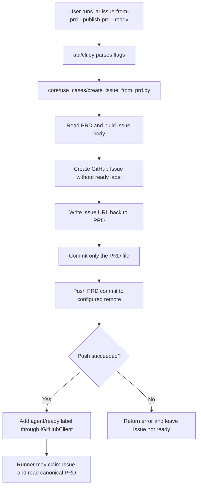

# PRD: issue-from-prd 在 ready 前发布 PRD

- GitHub Issue: https://github.com/zata-zhangtao/keda/issues/3

## 1. Introduction & Goals

当前 `iar issue-from-prd` 会从本地 PRD 创建 GitHub Issue，并把 Issue URL 回写到 PRD 文件。问题是：如果 PRD 还没有提交并推送，Issue 已经带上 `agent/ready` 后，runner 在新 worktree 中可能读到过时 PRD，甚至完全读不到该文件。具体有两种失败模式：

- PRD 已存在但修改未 push（包括回写 Issue URL）→ runner 读取到过时版本，元数据不一致。
- PRD 是全新文件，从未进入 Git 历史 → runner worktree 中该文件不存在，agent 只能凭 Issue body 摘要盲做。

本 PRD 目标是在 `issue-from-prd` 中加入显式 PRD 发布流程，让用户可以用一个命令完成 Issue 创建、PRD URL 回写、PRD-only commit、push，以及最后加 `agent/ready`。

目标结果：

- 新增 `--publish-prd` 参数；用户显式传入后，一条命令完成「创建 Issue → 回写 PRD → commit PRD → push PRD → 添加 `agent/ready`」的完整发布链。
- 不传入 `--publish-prd` 时，`issue-from-prd` 保持现有行为（仅创建 Issue 并本地回写 URL，不触发任何 Git 提交或推送）。
- `agent/ready` 的添加被推迟到 PRD 成功 push 之后；push 失败或分支条件不满足时，Issue 不会进入 ready 状态，runner 不会读取到过时或缺失的 PRD。
- 自动 Git 操作严格限定为仅目标 PRD 文件；用户工作区中的其他 staged、untracked 或已修改文件均不会被提交。
- 所有改动收敛在现有 CLI、core use case 和基础设施端口内，不新增独立服务或持久化模型。

## 2. Requirement Shape

| Field | 内容 |
|---|---|
| Actor | 写好 PRD 后准备把任务交给 `iar` / AI runner 的开发者 |
| Trigger | 执行 `uv run iar issue-from-prd tasks/pending/xxx.md --publish-prd --ready` |
| Expected Behavior | 系统创建 Issue、回写 PRD、只提交并推送该 PRD，然后给 Issue 加 `agent/ready` |
| Scope Boundary | 仅覆盖 `issue-from-prd` 的 PRD 发布与 ready gating；不处理实现完成后的 PRD 归档 |

可实现行为声明：

> 当用户通过 `issue-from-prd` 从本地 PRD 创建 ready Issue 时，可以显式要求工具发布该 PRD；工具在确认 PRD 文件已成功提交并推送之前，不得让 runner 可领取该 Issue。

## 3. Repository Context And Architecture Fit

### Existing Path

- `src/backend/api/cli.py`
  - `build_parser()` 定义 `issue-from-prd` 参数。
  - `main()` 负责创建 `github_client` / `process_runner` 并调用 core use case。
- `src/backend/core/use_cases/create_issue_from_prd.py`
  - 当前负责读取 PRD、解析标题和验收项、创建 Issue、回写 Issue URL。
  - 已经是本需求最接近的业务入口。
- `src/backend/core/shared/interfaces/agent_runner.py`
  - `IProcessRunner` 已抽象外部命令执行。
  - `IGitHubClient` 已提供 `create_issue()` 和 `edit_issue_labels()`。
- `src/backend/core/use_cases/run_agent_once.py`
  - 已在 core 层通过 `IProcessRunner` 编排 git/worktree/commit/push，说明 core 用例可以通过端口执行 Git 命令。
- `docs/guides/agent-runner.md` 与 `README.md`
  - 当前说明 `issue-from-prd` 的使用方式，需要同步新增 `--publish-prd`。
- `tests/test_create_issue_from_prd.py` 与 `tests/test_agent_runner_cli.py`
  - 当前覆盖 PRD 回写、Issue label、CLI 默认参数。

### Reuse Candidates

- 直接扩展 `create_issue_from_prd(...)`，避免新增 parallel use case。
- 复用 `IProcessRunner` 执行 `git status`、`git add`、`git commit`、`git push`。
- 复用 `IGitHubClient.edit_issue_labels()` 在 push 成功后添加 ready label。
- 复用 `LabelConfig.ready`，不引入新的 label。

### Architecture Constraints

- `api/` 只做 CLI 参数解析、依赖组装和 use case 调用。
- `core/` 可以依赖 `core/shared/interfaces/` 和纯业务模型，不直接依赖 subprocess 或 GitHub SDK。
- `engines/` / `infrastructure/` 的现有工厂与实现不需要新增职责。
- 新增逻辑不能让 `api/` 直接操作 Git，也不能让 `core/` 直接导入 infrastructure。

### Potential Redundancy Risks

- 新增 `publish_prd.py` use case 会和 `create_issue_from_prd.py` 重复 PRD path、Issue URL、label 顺序控制。
- 在 CLI 中手写 Git 流程会绕开 core 用例，导致业务规则分散。
- 把完整 PRD 内容复制进 Issue body 会制造两个 source of truth，后续 PRD 完成同步和归档会变得不可靠。

## 4. Options And Recommendation

### Option A: 最小改动，给 `issue-from-prd` 增加显式 `--publish-prd`

推荐。

新增 `--publish-prd` 参数，并扩展 `create_issue_from_prd(...)`：

1. 若用户传入 `--publish-prd --ready`，创建 Issue 时先不加 `agent/ready`。
2. 回写 Issue URL 到 PRD。
3. 使用 `IProcessRunner` 只 stage / commit 该 PRD 文件。
4. push 到配置的 remote。
5. push 成功后再通过 `IGitHubClient.edit_issue_labels()` 给 Issue 添加 `agent/ready`。

该方案复用现有 CLI、core use case、process runner 和 GitHub client，不新增持久化、不新增服务、不改变 runner 的 worktree 机制。

### Option B: 默认 `issue-from-prd` 自动 commit + push

不推荐。

默认自动 Git 发布会给现有命令增加强副作用。用户只是想创建 backlog Issue 或本地验证 PRD 解析时，也可能意外产生 commit 和 push。

### Option C: 把完整 PRD 内容复制到 Issue body

不推荐。

这会让 Issue body 和 PRD 文件并存为两个任务源，后续实现过程中需要同步实际交付结果、验证记录和 Decision Log，重复 source of truth 会增加偏差。

### Recommended Approach

选择 Option A。它把发布行为收敛到显式开关，且把 ready label 作为最后一步，解决 runner 抢任务时 PRD 不存在的问题，同时避免默认命令悄悄修改 Git 历史。

## 5. Implementation Guide

本节是实现时的活文档。实现中如发现更好的路径、隐藏依赖或额外文件，需要先更新本 PRD 再继续。

### CLI Interaction Design

`issue-from-prd` 支持交互式提示以降低参数记忆成本，同时保留 flag 供非交互式/脚本化调用。

交互规则：

- 若用户通过 flag 显式传参（如 `--publish-prd`、`--no-ready`、`--agent codex`），跳过对应 prompt，直接使用传入值。
- 若用户未传相关 flag，CLI 在解析 PRD 后依次提示：
  1. `Publish PRD? (Y/n)` — 对应 `--publish-prd` / `--no-publish-prd`。
  2. `Queue as ready? (Y/n)` — 对应 `--ready` / `--no-ready`。
  3. `Select agent: [1] codex [2] claude` — 对应 `--agent`；可直接按回车选择默认值。
- 交互模式不影响 core 用例的入参；`api/cli.py` 负责将交互结果转换为明确的布尔/字符串参数后传入 `create_issue_from_prd(...)`。
- CI 或批量脚本场景应继续使用 flag 形式，避免 stdin 阻塞。

### Core Logic

新增行为应遵循以下控制流：

1. CLI 解析 `--publish-prd`。
2. CLI 把 `process_runner`、`config.git.remote`、`config.git.base_branch` 传给 `create_issue_from_prd(...)`。
3. use case 解析 PRD，决定实际创建 Issue 时是否暂缓 ready label：
   - `publish_prd=True` 且 `queue_ready=True`：创建 Issue 时不带 ready label。
   - 其他情况：保持现有 label 行为。
4. use case 创建 Issue，得到 Issue URL。
5. use case 回写 Issue URL 到 PRD。
6. 若 `publish_prd=True`：
   - 校验当前分支适合发布 ready PRD。
   - 校验不会提交非 PRD 文件。
   - 自动将该 PRD 文件 stage 并 commit（统一执行 `git add <prd_file>` 后 `git commit`，不区分 tracked 或 untracked）。
   - push 到配置 remote。
7. 若原始请求要求 ready，且 PRD 发布成功，再解析 Issue number 并添加 ready label。
8. 任一步骤失败时返回错误；如果 Issue 已创建但 PRD push 失败，不得添加 ready label。

### Git Safety Rules

- `--publish-prd` 自动将目标 PRD 文件 stage 并 commit；commit 只包含该文件，不混入其他工作区改动。
- 自动发布前检查 Git index；存在非目标 PRD 的 staged changes 时拒绝并提示用户先处理。
- 不使用 `git add -A`。
- commit message 推荐：`docs(prd): publish <prd-slug>`。
- `--publish-prd --ready` 应要求当前分支等于 `config.git.base_branch`，因为 runner worktree 默认从 base branch 创建；如果当前分支不是 base branch，应报错并提示使用 `--no-ready` 或切回 base branch 后再发布。
- push 失败时保留本地 PRD commit，但 Issue 不进入 ready。

### Planned Change Matrix

```text
API
└── src/backend/api/cli.py
    [修改]
    【总结】为 issue-from-prd 增加显式 PRD 发布参数并把 Git 配置注入 core use case

    ├── 在 issue-from-prd parser 上新增 --publish-prd
    ├── 调用 create_issue_from_prd 时传入 process_runner、remote、base_branch
    └── 保持 --ready / --no-ready / --agent / --force 的现有语义

Core
└── src/backend/core/use_cases/create_issue_from_prd.py
    [修改]
    【总结】在创建 Issue 与添加 ready label 之间插入 PRD-only commit/push gating

    ├── 新增 publish_prd 参数和注入式 process_runner 参数
    ├── 新增 PRD-only Git 发布辅助逻辑
    ├── 新增 Issue URL 到 issue number 的解析逻辑
    ├── publish_prd + ready 时先创建非 ready Issue
    └── push 成功后再通过 edit_issue_labels 添加 ready label

Tests
├── tests/test_create_issue_from_prd.py
│   [修改]
│   【总结】覆盖 PRD 发布成功、push 失败不 ready、只提交 PRD 文件等核心行为
│
│   ├── 新增 publish_prd 成功路径测试
│   ├── 新增 push 失败时不添加 ready label 测试
│   └── 新增存在非 PRD staged change 时拒绝发布测试
│
└── tests/test_agent_runner_cli.py
    [修改]
    【总结】验证 issue-from-prd CLI 暴露 --publish-prd 且默认不启用

    ├── 确认默认 publish_prd 为 False
    └── 确认 --publish-prd 可被 argparse 正确解析

Docs
├── README.md
│   [修改]
│   【总结】更新从 PRD 创建 Issue 的推荐命令，展示 --publish-prd 用法
│
└── docs/guides/agent-runner.md
    [修改]
    【总结】说明 ready Issue 前发布 PRD 的工作流、失败行为和安全边界
```

### Flow Diagram



### Low-Fidelity Prototype

No low-fidelity prototype required for this PRD.

### ER Diagram

No data model changes in this PRD.

### Interactive Prototype Change Log

No interactive prototype file changes in this PRD.

### External Validation

No external validation required; repository evidence was sufficient.

## 6. Definition Of Done

- `issue-from-prd --publish-prd --ready` 创建的 ready Issue 只会在 PRD commit push 成功后出现。
- 自动 commit 只包含目标 PRD 文件，不包含其他 staged 或 unstaged 改动。
- push 失败、分支不满足 ready 发布条件或存在非 PRD staged changes 时，命令返回非零状态并输出明确错误。
- `--publish-prd` 未传入时，不发生自动 commit 或 push。
- README 与 Agent Runner 指南同步说明推荐用法、失败行为和安全边界。
- `just test` 通过。

## 7. Acceptance Checklist

### Architecture Acceptance

- [ ] `src/backend/api/cli.py` 只负责参数解析、依赖组装和调用 `create_issue_from_prd(...)`，不直接执行 Git 命令。
- [ ] `src/backend/core/use_cases/create_issue_from_prd.py` 通过 `IProcessRunner` 执行 Git 命令，不导入 `backend.infrastructure`。
- [ ] 未新增新的 use case、service、repository 或持久化模型来重复 PRD 发布职责。

### Behavior Acceptance

- [ ] `uv run iar issue-from-prd tasks/pending/example.md --publish-prd --ready` 创建 Issue 时先不带 `agent/ready`，PRD push 成功后再添加 `agent/ready`。
- [ ] `--publish-prd` 自动 stage 并只提交目标 PRD 文件（无论其当前为 tracked 或 untracked）；工作区其他 tracked、untracked 或 staged 改动不会进入 PRD 发布 commit。
- [ ] Git index 中存在非目标 PRD 的 staged changes 时，命令失败且不创建 ready Issue。
- [ ] push 失败时命令失败，Issue 不包含 `agent/ready`。
- [ ] 当前分支不是 `config.git.base_branch` 且用户请求 `--publish-prd --ready` 时，命令失败并提示切换 base branch 或使用 `--no-ready`。
- [ ] 未传 `--publish-prd` 时，`issue-from-prd` 不执行 `git add`、`git commit` 或 `git push`。

### Documentation Acceptance

- [ ] `README.md` 的 `issue-from-prd` 示例包含 `--publish-prd` 推荐用法。
- [ ] `docs/guides/agent-runner.md` 说明 `--publish-prd` 的 ready label 顺序、PRD-only commit 边界和 push 失败行为。
- [ ] 本 PRD 在实现完成前同步实际执行过的验证命令和结果。

### Validation Acceptance

- [ ] `uv run pytest tests/test_create_issue_from_prd.py -q` 通过。
- [ ] `uv run pytest tests/test_agent_runner_cli.py -q` 通过。
- [ ] `just test` 通过。
- [ ] `uv run python hooks/check_architecture.py` 通过或由 `just test` 覆盖通过。

## 8. Functional Requirements

- FR-1: `issue-from-prd` 必须新增 `--publish-prd` 参数，默认值为 `False`。
- FR-2: 当 `publish_prd=False` 时，命令不得执行 `git add`、`git commit`、`git push`。
- FR-3: 当 `publish_prd=True` 时，命令必须在 Issue URL 回写后只提交目标 PRD 文件。
- FR-4: 当 `publish_prd=True` 且 `queue_ready=True` 时，Issue 创建阶段不得包含 ready label。
- FR-5: 当 PRD push 成功且用户请求 ready 时，系统必须通过 `edit_issue_labels()` 添加 ready label。
- FR-6: 当 PRD push 失败时，系统必须返回失败状态，且不得添加 ready label。
- FR-7: 当 Git index 中存在非目标 PRD 的 staged changes 时，系统必须拒绝自动发布 PRD。
- FR-8: 当当前分支不是配置的 base branch 且用户请求 `--publish-prd --ready` 时，系统必须拒绝发布 ready Issue。
- FR-9: commit message 必须清晰表达这是 PRD 发布 commit。
- FR-10: 文档必须说明 `--publish-prd` 是显式发布行为，不是默认副作用。

## 9. Non-Goals

- 不让 `issue-from-prd` 默认自动 commit 或 push。
- 不自动执行 `git add -A`。
- 不创建 PRD-only Pull Request。
- 不解决远端分支保护导致的 push 拒绝；push 失败时只保证 Issue 不 ready。
- 不把完整 PRD 内容复制进 Issue body 来替代 canonical PRD 文件。
- 不改变 `run-once` / `daemon` 的 worktree 创建策略。
- 不在本 PRD 中处理实现完成后的 PRD 归档流程。

## 10. Risks And Follow-Ups

- 分支保护风险：如果 base branch 禁止直接 push，`--publish-prd --ready` 会失败并留下非 ready Issue。后续如确有需要，可另开 PRD 设计 `--publish-prd-pr`。
- 本地 Git 状态风险：用户已有 staged changes 时需要先处理，否则工具无法保证 PRD-only commit。
- Issue 已创建但发布失败时会产生 backlog Issue；这是为了避免 runner 读取不到 PRD，比自动 ready 更安全。

## 11. User Stories

### US-1: 作为任务创建者，我想一条命令发布 PRD 并创建 ready Issue

当我执行：

```bash
uv run iar issue-from-prd tasks/pending/example.md --agent codex --publish-prd --ready
```

系统应创建 Issue、回写 PRD、只提交并推送该 PRD 文件，最后添加 `agent/ready`。

### US-2: 作为任务创建者，我不希望工具误提交其他改动

当我的工作区有其他未提交文件时，`--publish-prd` 仍只能提交目标 PRD 文件；如果其他文件已经 staged，系统应拒绝自动发布并提示我清理 staged changes。

### US-3: 作为 runner 维护者，我不希望 ready Issue 指向不存在的 PRD

当 PRD push 失败或当前分支不是 runner 的 base branch 时，Issue 不应进入 `agent/ready` 状态。

## 12. Decision Log

| # | 决策问题 | 选择 | 放弃的方案 | 理由 |
|---|---|---|---|---|
| D-01 | PRD 发布是否默认启用 | 使用显式 `--publish-prd` | 默认 `issue-from-prd` 自动 commit + push | 默认自动发布会让现有命令产生强 Git 副作用，显式开关能保留当前安全边界。 |
| D-02 | ready label 的添加时机 | PRD push 成功后再添加 ready | 创建 Issue 时直接带 ready label | 直接带 ready 会让 runner 有机会在 PRD 尚未发布时领取任务。 |
| D-03 | 发布逻辑放在哪里 | 扩展 `create_issue_from_prd.py` 并注入 `IProcessRunner` | 在 CLI 中直接执行 Git 命令 | CLI 直接执行 Git 会把业务顺序分散到 api 层，难以测试 ready gating。 |
| D-04 | PRD 内容如何提供给 runner | 继续使用仓库内 canonical PRD path | 把完整 PRD 复制进 Issue body | 复制完整内容会产生双 source of truth，后续验收和归档容易偏离。 |
| D-05 | ready 发布的分支条件 | 要求当前分支等于配置的 base branch | 允许任意当前分支 push 后 ready | runner worktree 默认从 base branch 创建，任意分支上的 PRD 即使已 push 也未必能被 runner 读到。 |
| D-06 | Issue URL 回写由谁执行 | 创建者在本地执行 | 由 runner 在 worktree 中回写 | runner 的职责是执行 PRD 定义的任务，不应修改任务元数据；且 Issue URL 在创建后才产生，本地回写最自然。 |
