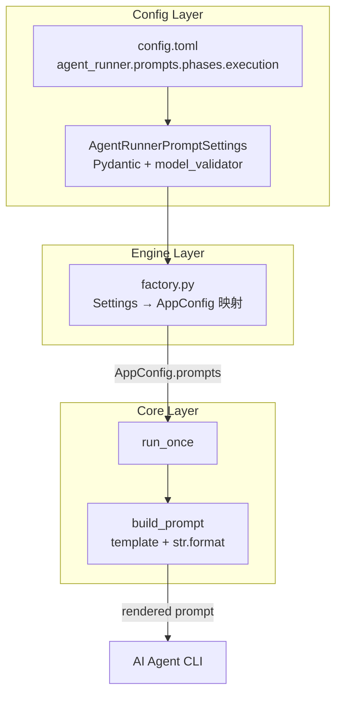

# PRD: Agent Prompt Template & Phase System

- GitHub Issue: https://github.com/zata-zhangtao/keda/issues/14

## 1. Introduction & Goals

当前 `build_prompt` 在 `run_agent_once.py` 中硬编码了完整的 AI prompt，包括：

- 任务标题与元数据（Issue number、title、URL、worktree）
- PRD 路径提示
- Issue body
- Execution rules（5 条固定规则）

这带来以下问题：

- **调整提示词需要改代码**：修改 prompt 语义（如放宽/收紧某条规则）必须修改 Python 源文件并重新部署。
- **无法按场景切换提示策略**：不同 Issue 类型或不同阶段可能需要不同的 Execution rules；硬编码使这种灵活切换不可能。
- **提示词与渲染逻辑耦合**：`build_prompt` 同时负责"拼字符串"和"决定说什么"，违反单一职责。
- **与 commit handoff PRD 的冲突**：另一个 pending PRD（agent-commit-handoff）计划修改 Execution rules 的内容；若 prompt 已配置化，该 PRD 只需改 TOML 而无需碰代码。

本 PRD 的目标是将 prompt **模板从代码中彻底抽离**，引入可配置的 phase-based 模板系统，为后续多阶段提示策略（planning → coding → review 等）预留干净扩展点。

## 2. Requirement Shape

- **Actor**：
  - 开发者/运维人员：通过编辑 `config.toml` 调整 prompt 模板。
  - Agent Runner：`build_prompt` 从配置读取模板并按变量渲染。
- **Trigger**：`run_agent` 在启动 AI agent 前调用 `build_prompt`。
- **Expected Behavior**：
  - `build_prompt` 不再包含任何硬编码的 prompt 正文，仅从配置读取模板并做变量替换。
  - 配置未提供模板时，使用与当前行为一致的默认模板作为 fallback，保证向后兼容。
  - 模板支持多 phase（当前仅实现 `execution` phase），`build_prompt` 的 signature 预留 `phase` 参数。
  - 模板变量使用显式占位符（如 `{issue_number}`），而非隐式的 f-string 拼接。
- **Scope Boundary**：
  - 只改动 prompt 的**构建方式**，不改动 prompt 的**消费方式**（agent CLI 命令不变）。
  - 不改动 worktree 管理、验证流程、发布流程。
  - 不引入外部模板引擎（Jinja2 等），保持零依赖。

## 3. Repository Context And Architecture Fit

### 相关模块

| 文件 | 职责 | 改动类型 |
|---|---|---|
| `src/backend/core/shared/models/agent_runner.py` | core 层领域模型：`AppConfig`、`IssueSummary` 等 | 修改（扩展 `AppConfig`） |
| `src/backend/infrastructure/config/settings.py` | Pydantic Settings：从 env/TOML 加载配置 | 修改（新增 Prompt Settings） |
| `config.toml` | 非敏感配置默认值 | 修改（新增 `[agent_runner.prompts]`） |
| `src/backend/core/use_cases/run_agent_once.py` | Runner 核心编排，含 `build_prompt` | 修改（重写为模板渲染） |
| `src/backend/engines/agent_runner/factory.py` | `AgentRunnerSettings` → `AppConfig` 转换 | 修改（映射 prompts 字段） |
| `tests/test_run_agent.py` | Runner 行为单元测试 | 修改（补充模板渲染测试） |
| `tests/test_agent_config_consistency.py` | 配置一致性测试 | 可能需修改 |

### 架构约束

- `AppConfig` 位于 **core 层**，新增字段必须是纯数据结构（`dataclass`），禁止引入外部依赖。
- `AgentRunnerPromptSettings` 位于 **infrastructure 层**，使用 Pydantic `BaseModel`，支持 TOML/env 加载。
- `run_agent_once.py` 位于 **core 层**，只能依赖 `shared/models/` 和 `shared/interfaces/`，禁止直接读取 TOML 或 env。
- 配置值通过 `factory.py`（engines 层）从 `AgentRunnerSettings` 映射到 `AppConfig`，再注入 `run_once`。

### 复用与扩展点

- 模板渲染逻辑足够简单（字符串 `str.format()`），不引入模板引擎，保持轻量。
- `phase` 参数默认值为 `"execution"`，后续新增 phase（如 `"planning"`、`"review"`）时无需改动 `build_prompt` 的 signature。
- 默认模板作为代码 fallback，保证空配置下行为与当前完全一致。

## 4. Recommendation

### Recommended Approach：配置化模板 + 变量替换 + Phase 预留

1. **新增 `PromptConfig` dataclass**（core 层）：
   - `default_phase: str = "execution"`
   - `phases: dict[str, str]` — key 为 phase 名，value 为模板字符串（可包含 `\n` 或多行拼接逻辑）

2. **新增 `AgentRunnerPromptSettings` Pydantic 模型**（infrastructure 层）：
   - 结构与 `PromptConfig` 对应，但支持 TOML 中字符串列表写法（更友好的多行编辑体验）。
   - TOML 中写 `phases.execution = ["line1", "line2", ...]`，加载时自动 `\n`.join。

3. **重写 `build_prompt`**：
   - Signature 改为 `build_prompt(issue: IssueSummary, worktree_path: Path, prompt_config: PromptConfig, phase: str = "execution") -> str`
   - 从 `prompt_config.phases.get(phase)` 获取模板，fallback 到内置默认模板。
   - 使用 `str.format()` 做变量替换，支持以下占位符：
     - `{issue_number}`
     - `{issue_title}`
     - `{issue_url}`
     - `{worktree_path}`
     - `{issue_body}`
     - `{prd_line}` — PRD 路径提示（当前由 `extract_prd_path` 动态生成的那一行）

4. **`extract_prd_path` 保留**，但 `prd_line` 的生成逻辑从 `build_prompt` 中显式提取为一个独立变量，再注入模板。

5. **`factory.py` 映射**：在 `AgentRunnerSettings` → `AppConfig` 转换时，把 `agent_runner.prompts` 映射为 `AppConfig.prompts`。

### 为什么这是最佳方案

- **最小依赖**：仅用 Python 内置 `str.format()`，不引入 Jinja2 等模板引擎。
- **向后兼容**：未配置时行为与现在完全一致。
- **分层清晰**：core 层只负责"渲染"，infrastructure 层负责"提供模板"，TOML 负责"存储模板"。
- **预留扩展**：`phase` 参数和 `phases` 字典天然支持未来新增阶段。
- **与 commit handoff PRD 解耦**：该 PRD 只需修改 Execution rules 的文本内容；如果本 PRD 先落地，commit handoff PRD 可以直接在 TOML 中改模板，不需要改 Python 代码。

### Alternatives Considered

| 方案 | 说明 | 拒绝原因 |
|---|---|---|
| 引入 Jinja2 模板引擎 | 支持条件、循环等高级语法 | 过度设计，当前需求只是简单变量替换；增加依赖和认知负担 |
| 模板存为独立 `.md` / `.txt` 文件 | 每个 phase 一个文件 | 增加文件管理和路径配置复杂度；TOML 内联数组已足够友好 |
| 仅把 Execution rules 抽出，保留其余硬编码 | 最小改动 | 没有解决"prompt 与渲染逻辑耦合"的根本问题；后续扩展阶段时仍需大改 |
| phase 作为函数而非配置（如 `build_planning_prompt()`） | 每个 phase 一个函数 | 回到硬编码老路，丧失配置化灵活性 |

## 5. Implementation Guide

### Core Logic

```
BEFORE (build_prompt 硬编码):
  extract_prd_path(issue.body)
  return "\n".join([
      f"Complete GitHub Issue #{issue.number}: {issue.title}",
      "",
      f"Issue URL: {issue.url}",
      ...  # 全部硬编码
  ])

AFTER (build_prompt 从配置渲染):
  template = prompt_config.phases.get(phase) or DEFAULT_TEMPLATES[phase]
  prd_path = extract_prd_path(issue.body)
  prd_line = ...  # 与现在相同
  return template.format(
      issue_number=issue.number,
      issue_title=issue.title,
      issue_url=issue.url,
      worktree_path=worktree_path,
      issue_body=issue.body,
      prd_line=prd_line,
  )
```

### Change Impact Tree

```text
.
src/backend/core/shared/models/
└── agent_runner.py
    [修改] 【总结】扩展 AppConfig，新增 PromptConfig dataclass
    └── 新增 @dataclass(frozen=True) PromptConfig
    │   └── default_phase: str = "execution"
    │   └── phases: dict[str, str] = field(default_factory=lambda: {"execution": DEFAULT_EXECUTION_TEMPLATE})
    └── AppConfig
        └── 新增 prompts: PromptConfig = PromptConfig()

src/backend/infrastructure/config/
└── settings.py
    [修改] 【总结】新增 Pydantic Prompt Settings，支持 TOML 字符串列表自动 join
    └── 新增 class AgentRunnerPromptSettings(BaseModel)
    │   └── default_phase: str = "execution"
    │   └── phases: dict[str, str | list[str]] = Field(default_factory=dict)
    │   └── @model_validator(mode="after") _join_list_templates
    │       └── 把 phases 中值为 list[str] 的项用 "\n".join 转成 str
    └── AgentRunnerSettings
        └── 新增 prompts: AgentRunnerPromptSettings = Field(default_factory=AgentRunnerPromptSettings)

config.toml
[修改] 【总结】新增 agent_runner.prompts 配置段
└── [agent_runner.prompts]
    └── default_phase = "execution"
    └── [agent_runner.prompts.phases]
        └── execution = [
              "Complete GitHub Issue #{issue_number}: {issue_title}",
              "",
              "Issue URL: {issue_url}",
              "Worktree: {worktree_path}",
              "{prd_line}",
              "",
              "Issue body:",
              "{issue_body}",
              "",
              "Execution rules:",
              "- Read AGENTS.md and follow repository instructions.",
              "- Only modify files inside the current worktree.",
              "- Do not merge main, delete branches, push, create PRs, or commit; the runner handles publishing.",
              "- Do not touch production systems or real business data.",
              "- Implement the requested task with focused tests and docs updates.",
              "- Finish with a concise summary, tests run, and remaining risk.",
            ]

src/backend/core/use_cases/
└── run_agent_once.py
    [修改] 【总结】build_prompt 改为从配置读取模板并渲染
    ├── extract_prd_path()
    │   └── 保留，无需改动
    ├── 新增 _build_prd_line(issue: IssueSummary) -> str
    │   └── 从 build_prompt 中抽出的 PRD 行生成逻辑
    ├── build_prompt()
    │   └── signature 改为 (issue, worktree_path, prompt_config, phase="execution")
    │   └── 删除所有硬编码字符串
    │   └── 从 prompt_config.phases.get(phase) 获取模板
    │   └── fallback 到模块级常量 _DEFAULT_EXECUTION_TEMPLATE
    │   └── 调用 template.format(...) 渲染
    └── run_agent()
        └── 调用 build_prompt 时传入 prompt_config（从外部注入）

src/backend/engines/agent_runner/
└── factory.py
    [修改] 【总结】在 Settings → AppConfig 转换中映射 prompts 字段
    └── 转换函数中新增 prompts 字段映射
    └── 把 AgentRunnerPromptSettings.phases（已 join 后的 str dict）映射为 PromptConfig.phases

tests/
├── test_run_agent.py
│   [修改] 【总结】补充模板渲染相关测试
│   └── 新增 test_build_prompt_uses_config_template
│   └── 新增 test_build_prompt_fallback_to_default
│   └── 新增 test_build_prompt_replaces_all_placeholders
│   └── 调整现有测试：AppConfig() 默认包含 PromptConfig，无需额外传入
└── test_agent_config_consistency.py
    [可能修改] 若该测试校验 AppConfig 字段，同步加入 prompts 字段断言
```

### Flow or Architecture Diagram



### ER Diagram

No data model changes beyond adding `PromptConfig` to `AppConfig`.

### Interactive Prototype Change Log

No interactive prototype file changes in this PRD.

### External Validation

No external validation required; repository evidence was sufficient.

## 6. Definition Of Done

- [x] `build_prompt` 不再包含任何硬编码 prompt 正文，仅从配置渲染模板。
- [x] `AppConfig` 新增 `prompts: PromptConfig` 字段。
- [x] `AgentRunnerSettings` 新增 `prompts: AgentRunnerPromptSettings` 字段，支持 TOML 字符串列表自动 join。
- [x] `config.toml` 新增 `[agent_runner.prompts]` 配置段，包含当前行为一致的默认模板。
- [x] `factory.py` 完成 prompts 字段的 Settings → AppConfig 映射。
- [x] 未配置模板时，`build_prompt` 使用内置默认模板，行为与当前完全一致。
- [x] 测试覆盖：模板渲染、fallback 机制、变量替换完整性。
- [x] `just lint` 和 `just test` 通过。

## 7. Acceptance Checklist

### Architecture Acceptance

- [ ] `src/backend/core/shared/models/agent_runner.py` 中新增 `PromptConfig` dataclass，字段为 `default_phase: str` 和 `phases: dict[str, str]`。
- [ ] `AppConfig` 新增 `prompts: PromptConfig` 字段，默认值为 `PromptConfig()`。
- [ ] `src/backend/infrastructure/config/settings.py` 中新增 `AgentRunnerPromptSettings` Pydantic 模型，支持 `phases` 的 `str | list[str]` 值类型。
- [ ] `AgentRunnerPromptSettings` 包含 `model_validator`，在加载后将 `list[str]` 值的 phase 自动 `\n`.join 为 `str`。
- [ ] `AgentRunnerSettings` 新增 `prompts: AgentRunnerPromptSettings` 字段。
- [ ] `config.toml` 中新增 `[agent_runner.prompts]` 和 `[agent_runner.prompts.phases]` 配置段。
- [ ] `src/backend/engines/agent_runner/factory.py` 中 `AgentRunnerSettings` → `AppConfig` 转换包含 `prompts` 字段映射。
- [ ] 依赖方向未被破坏：`run_agent_once.py` 不直接读取 TOML 或 env，prompt 通过 `AppConfig` 注入。

### Behavior Acceptance

- [ ] `build_prompt` 的 signature 包含 `prompt_config: PromptConfig` 和 `phase: str = "execution"` 参数。
- [ ] `build_prompt` 从 `prompt_config.phases.get(phase)` 获取模板；不存在时使用内置默认模板。
- [ ] 内置默认模板渲染后的输出与当前硬编码 `build_prompt` 的输出完全一致（字符级等价）。
- [ ] 模板变量 `{issue_number}`、`{issue_title}`、`{issue_url}`、`{worktree_path}`、`{issue_body}`、`{prd_line}` 均被正确替换。
- [ ] `run_agent` 调用 `build_prompt` 时传入 `prompt_config`，且 phase 为 `"execution"`。
- [ ] 当 `config.toml` 中自定义 `agent_runner.prompts.phases.execution` 时，`build_prompt` 返回自定义模板渲染结果。

### Documentation Acceptance

- [ ] 若 `docs/` 中有描述 runner prompt 行为的内容，同步更新以反映配置化变更。
- [ ] `config.toml` 中的新配置段包含注释说明每个模板变量的含义。
- [ ] PRD 自身包含完整的 Acceptance Checklist 且所有项在归档前完成。

### Validation Acceptance

- [ ] `uv run pytest tests/test_run_agent.py -v` 全部通过。
- [ ] `uv run pytest tests/ -v` 无回归失败。
- [ ] `just lint` 通过。

## 8. Functional Requirements

**FR-1**: `build_prompt` 必须不再包含任何硬编码的 prompt 正文字符串，所有正文必须从 `PromptConfig.phases` 中获取模板后渲染。

**FR-2**: `PromptConfig` 必须定义在 `src/backend/core/shared/models/agent_runner.py` 中，为 `frozen=True` 的 `dataclass`，包含 `default_phase: str` 和 `phases: dict[str, str]` 两个字段。

**FR-3**: `AgentRunnerPromptSettings` 必须定义在 `src/backend/infrastructure/config/settings.py` 中，为 Pydantic `BaseModel`，包含 `default_phase: str` 和 `phases: dict[str, str | list[str]]`。当 phase 值为 `list[str]` 时，必须通过 model validator 自动 join 为单个字符串。

**FR-4**: `config.toml` 必须新增 `[agent_runner.prompts]` 和 `[agent_runner.prompts.phases]` 配置段，其中 `execution` phase 的模板内容必须与当前 `build_prompt` 硬编码内容等价。

**FR-5**: 模板渲染必须支持以下变量占位符：`{issue_number}`、`{issue_title}`、`{issue_url}`、`{worktree_path}`、`{issue_body}`、`{prd_line}`。`{prd_line}` 的值由 `extract_prd_path` 的结果动态生成（与当前逻辑一致）。

**FR-6**: 当 `prompt_config.phases` 中不存在请求的 `phase` 时，`build_prompt` 必须使用模块级内置默认模板作为 fallback，且 fallback 模板的行为必须与当前硬编码行为一致。

**FR-7**: `factory.py` 中的 `AgentRunnerSettings` → `AppConfig` 转换必须包含 `prompts` 字段的映射，确保 TOML 配置能正确传递到 core 层。

**FR-8**: `run_agent` 函数必须在调用 `build_prompt` 时传入 `prompt_config`，且默认使用 `"execution"` phase。

**FR-9**: 所有现有 CLI 参数、配置结构、`IGitHubClient` / `IProcessRunner` 接口不得发生破坏性变更。

## 9. Non-Goals

- **不引入外部模板引擎**：仅用 Python 内置 `str.format()`，不引入 Jinja2、Mako 等。
- **不实现多 phase 调度逻辑**：当前只定义和使用 `execution` phase；`phase` 参数是为未来预留的扩展点，本 PRD 不实现 `"planning"`、`"review"` 等 phase 的实际调用路径。
- **不改动 agent CLI 命令**：`run_agent` 中构建的 `claude` / `kimi` / `codex` CLI 命令保持不变。
- **不改动 prompt 语义**：默认模板的内容与当前硬编码内容一致；语义调整（如 commit handoff 的 rules 变更）不属于本 PRD 范围。
- **不删除 `extract_prd_path`**：该函数保留在 `run_agent_once.py` 中，仅被 `_build_prd_line` 调用。

## 10. Risks And Follow-Ups

| 风险 | 缓解措施 |
|---|---|
| 默认模板与当前硬编码不一致导致行为漂移 | 验收清单要求"字符级等价"，测试用例对比渲染输出与预期字符串 |
| TOML 多行字符串/数组格式让用户困惑 | `config.toml` 中提供完整注释和示例；优先使用数组写法（每行一个规则，便于 diff） |
| 后续 commit handoff PRD 与本 PRD 冲突 | 本 PRD 先落地后，commit handoff PRD 只需改 TOML 模板中的 Execution rules 文本，无需再改 Python 代码 |
| `str.format()` 与模板中大括号冲突 | 模板中不需要原生大括号；若未来需要，可转义为 `{{` / `}}`，在文档中说明 |

## 11. Decision Log

| ID | Decision | Chosen | Rejected | Rationale |
|---|---|---|---|---|
| D-01 | 模板引擎选择 | Python 内置 `str.format()` | Jinja2 / Mako | 当前只需简单变量替换，零新增依赖 |
| D-02 | 模板存储位置 | TOML 内联 `config.toml` | 独立 `.md` / `.txt` 文件 | 减少文件管理复杂度，配置集中化 |
| D-03 | TOML 中模板格式 | 字符串列表（每行一项） | 多行字符串 `"""..."""` | 数组便于 diff 和逐行编辑，且天然支持 model_validator join |
| D-04 | phase 默认值 | `"execution"` | `"default"` | 与当前功能语义对应，直观 |
| D-05 | fallback 策略 | 内置默认模板字典 | 报错要求必须配置 | 向后兼容，空配置即可运行 |
| D-06 | 是否把 `prd_line` 也模板化 | 是，`{prd_line}` 作为变量 | 把 PRD 逻辑硬编码在渲染器里 | 让模板完全控制 prompt 结构，渲染器只负责变量注入 |
