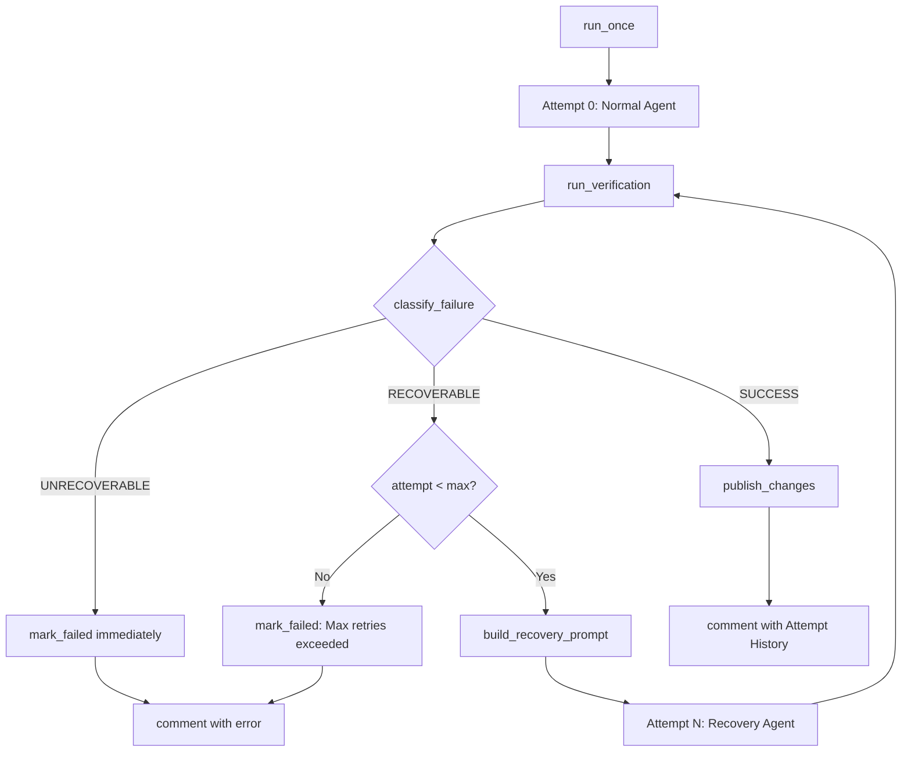

# PRD: Surgical Failure Recovery & Retry Loop

## 1. Introduction & Goals

当前 `run_once` 的失败处理是「一锤子买卖」：只要 `run_agent` 或 `run_verification` 出现异常，整个 Issue 立即标为 `failed`。这与 commit handoff 的设计愿景矛盾——我们把 commit 职责交给了 AI，却没给 AI「犯错后修正」的机会。

实际运行中，大量失败属于**可恢复错误**：

- **忘 commit**：AI 改了文件但忘记 `git commit`（commit handoff 后的典型人为失误）。
- **pre-commit 失败**：格式化或 lint 没通过，AI 完全有能力在同一会话内修复再提交。
- **测试失败**：AI 的改动破坏了测试，给它看 pytest 输出，它能定位并修复。
- **零产出**：AI 读完 issue 觉得「不用改」，结果没有产生任何 commit，一次重试 prompt 往往就能解决。

本 PRD 的目标是引入**分层失败识别 + 定向恢复策略**，把「硬失败」变成「可恢复失败」，在 runner 层构建一个轻量级 retry loop。

## 2. Requirement Shape

- **Actor**：Agent Runner 编排器（`run_once`）。
- **Trigger**：`run_agent` 退出后或 `run_verification` 返回非零 exit code。
- **Expected Behavior**：
  - Runner 根据 worktree 状态和进程输出判断失败类型。
  - 对可恢复失败，构建定向修复 prompt，在同一 worktree 上重新启动 agent。
  - 恢复尝试设有上限（默认 2 次额外尝试，共 3 轮）。
  - 每轮尝试的进度和结果都记录到 Issue comment。
  - 不可恢复失败（如 agent 进程崩溃、安全路径拦截）才最终标为 `failed`。
- **Scope Boundary**：
  - 不改动 agent CLI 调用方式（`run_agent` 的命令构建逻辑不变）。
  - 不引入外部状态存储（复用现有 worktree 和 GitHub Issue comment 作为持久化媒介）。
  - 不改动成功路径（无失败时不增加任何额外开销）。

## 3. Repository Context And Architecture Fit

### 相关模块

| 文件 | 职责 | 改动类型 |
|---|---|---|
| `src/backend/core/use_cases/run_agent_once.py` | Runner 核心编排：异常处理逻辑、agent 调用顺序 | 修改（重构异常处理为 retry loop） |
| `src/backend/core/shared/models/agent_runner.py` | core 层领域模型 | 修改（新增失败分类与恢复结果模型） |
| `src/backend/infrastructure/config/settings.py` | Pydantic Settings | 可能修改（新增可选恢复配置） |
| `src/backend/engines/agent_runner/factory.py` | Settings → AppConfig 映射 | 可能修改（映射新配置字段） |
| `tests/test_run_agent.py` | Runner 行为单元测试 | 修改（补充失败恢复场景） |

### 架构约束

- 失败分类逻辑属于**纯业务规则**，必须放在 `core/` 层，不得依赖 GitHub API 或进程执行细节。
- `IProcessRunner` 和 `IGitHubClient` 接口保持不变；恢复循环通过现有接口驱动。
- 修复 prompt 的构建复用已有的 `build_prompt` 机制，通过新增 `phase="recovery"` 或额外上下文参数注入失败信息。
- 依赖方向不变：`run_agent_once.py` 不得直接导入 `engines/` 或 `infrastructure/`。

### 复用与扩展点

- `has_changes`、`get_head_sha`、`run_verification` 已存在，可直接用于失败分类。
- `build_prompt` 的 phase 预留（prompt template PRD）可被本 PRD 复用：新增 `recovery` phase 模板。
- `FakeProcessRunner` 和 `FakeGitHubClient` 测试桩无需结构性改动。

## 4. Recommendation

### Recommended Approach：失败分类器 + 定向恢复策略 + 轻量 Retry Loop

1. **新增 `FailureType` 枚举**（`core/shared/models/`）：
   - `SUCCESS` — 无失败
   - `UNCOMMITTED_CHANGES` — `has_changes()` 为 True
   - `NO_COMMITS` — `before_sha == after_sha`
   - `VERIFICATION_FAILED` — `run_verification` 任一命令返回非零
   - `AGENT_ERROR` — agent 进程非零退出且不属于以上类别
   - `UNRECOVERABLE` — 安全路径拦截、权限错误等

2. **新增 `classify_failure()` 函数**（`run_agent_once.py` 内）：
   ```
   classify_failure(
       before_sha: str,
       after_sha: str,
       has_uncommitted: bool,
       agent_result: CommandResult,
       verification_results: list[CommandResult],
   ) -> FailureType
   ```
   判断优先级：`UNRECOVERABLE`（由异常捕获优先） > `UNCOMMITTED_CHANGES` > `NO_COMMITS` > `VERIFICATION_FAILED` > `AGENT_ERROR`。

3. **新增 `build_recovery_prompt()` 函数**（`run_agent_once.py` 内）：
   根据 `FailureType` 和上下文（verification 输出、git status 等）构建修复 prompt。

4. **新增 `AttemptResult` dataclass**（`core/shared/models/`）：
   - `attempt_number: int`
   - `failure_type: FailureType`
   - `recovered: bool`
   - `detail: str`

5. **重构 `run_once` 核心循环**：
   ```
   max_attempts = config.runner.max_recovery_attempts + 1  # 默认 3
   attempt_results: list[AttemptResult] = []

   for attempt in range(max_attempts):
       if attempt > 0:
           recovery_prompt = build_recovery_prompt(...)
           run_agent_with_recovery_prompt(...)
       else:
           run_agent(selected_agent, issue, worktree_path, process_runner)

       verification_results = run_verification(...)
       after_sha = get_head_sha(...)
       failure_type = classify_failure(...)

       if failure_type == FailureType.SUCCESS:
           publish_changes(...)
           break

       attempt_results.append(AttemptResult(...))

       if failure_type == FailureType.UNRECOVERABLE:
           raise RuntimeError(...)

       if attempt == max_attempts - 1:
           raise RuntimeError(f"Failed after {max_attempts} attempts.")

       # loop continues: next iteration will run recovery agent
   ```

6. **Issue comment 格式**：在最终 comment 中追加「Attempt History」表格，让人工 review 时一眼看到 agent 挣扎了几轮、分别卡在哪。

### 为什么这是最佳方案

- **零新增外部依赖**：完全复用现有 agent 调用、worktree 和 comment 机制。
- **向后兼容**：成功路径无任何变化；配置项有默认值，不升级配置也能跑。
- **与 commit handoff 天然互补**：commit handoff 把 commit 职责交给 AI，本 PRD 解决 AI commit 失败后的自愈。
- **可观测**：每轮尝试都写到 Issue comment，人工 review 时能看到 agent 的「挣扎轨迹」。

### Alternatives Considered

| 方案 | 说明 | 拒绝原因 |
|---|---|---|
| Runner 自动修复（不重新启动 agent） | runner 自己调用 `black`、`git add` 等工具修复 | 违背 commit handoff 的「AI 自主决策」原则，runner 又变成保姆 |
| 无限重试直到成功 | 不设上限 | 可能产生无限循环，烧光 API token；需要人工兜底 |
| 把 recovery 做成独立后台 worker | 失败 issue 丢进队列，由另一个进程消费 | 过度设计，当前失败率不值得引入分布式复杂度；且会丢失 worktree 上下文 |
| 让 agent 在执行中 self-check | 修改 prompt 让 agent 每步自检 | 无法解决 agent 已退出后的失败；且会增加正常路径的 prompt 长度 |

## 5. Implementation Guide

### Core Logic

```
BEFORE (run_once 异常处理):
  try:
      run_agent(...)
      verification_results = run_verification(...)
      if has_changes(...): raise RuntimeError("...")
      after_sha = get_head_sha(...)
      if before_sha == after_sha: raise RuntimeError("...")
      publish_changes(...)
  except Exception as exc:
      mark_failed(issue, exc)

AFTER (run_once retry loop):
  max_attempts = config.runner.max_recovery_attempts + 1
  attempt_results: list[AttemptResult] = []
  failure_type = FailureType.SUCCESS

  for attempt in range(max_attempts):
      if attempt > 0:
          recovery_prompt = build_recovery_prompt(
              issue, worktree_path, failure_type, verification_results
          )
          agent_result = run_recovery_agent(selected_agent, recovery_prompt, ...)
      else:
          agent_result = run_agent(selected_agent, issue, worktree_path, ...)

      verification_results = run_verification(...)
      after_sha = get_head_sha(...)
      has_uncommitted = has_changes(...)
      failure_type = classify_failure(
          before_sha, after_sha, has_uncommitted, agent_result, verification_results
      )

      attempt_results.append(AttemptResult(...))

      if failure_type == FailureType.SUCCESS:
          publish_changes(...)
          break

      if failure_type == FailureType.UNRECOVERABLE:
          raise UnrecoverableError(...)

      if attempt == max_attempts - 1:
          raise MaxRetriesExceededError(attempt_results)

  comment_issue_with_attempt_history(issue, attempt_results, pr_url)
```

### Change Impact Tree

```text
.
src/backend/core/shared/models/
└── agent_runner.py
    [修改] 【总结】新增失败分类与恢复结果模型
    ├── 新增 FailureType(Enum)
    │   └── SUCCESS / UNCOMMITTED_CHANGES / NO_COMMITS / VERIFICATION_FAILED / AGENT_ERROR / UNRECOVERABLE
    └── 新增 AttemptResult dataclass
        └── attempt_number, failure_type, recovered, detail

src/backend/core/use_cases/
└── run_agent_once.py
    [修改] 【总结】重构异常处理为带恢复策略的 retry loop
    ├── 新增 classify_failure(...)
    │   └── 根据 SHA、changes、agent_result、verification_results 返回 FailureType
    ├── 新增 build_recovery_prompt(...)
    │   └── UNCOMMITTED_CHANGES: "You have uncommitted changes. Stage and commit them."
    │   └── NO_COMMITS: "No commits were produced. Re-read the issue and implement the requested changes."
    │   └── VERIFICATION_FAILED: "Tests failed. Here is the output. Fix the issues and commit."
    │   └── AGENT_ERROR: "The previous execution failed. Re-attempt the task from the beginning."
    ├── 新增 run_recovery_agent(...)
    │   └── 复用 run_agent 逻辑，但传入 recovery prompt
    ├── 新增 comment_issue_with_attempt_history(...)
    │   └── 在 Issue comment 中渲染尝试历史表格
    └── run_once()
        └── 重构 try/except 为 for attempt in range(max_attempts) loop
        └── 第 0 轮走正常路径；第 1+ 轮走 recovery 路径
        └── 最终 comment 包含 Attempt History

src/backend/infrastructure/config/
└── settings.py
    [可能修改] 【总结】新增可选恢复配置
    └── AgentRunnerSettings 新增 max_recovery_attempts: int = 2

src/backend/engines/agent_runner/
└── factory.py
    [可能修改] 【总结】映射 max_recovery_attempts 到 AppConfig

tests/
├── test_run_agent.py
│   [修改] 【总结】补充失败恢复场景测试
│   └── 新增 test_classify_failure_uncommitted
│   └── 新增 test_classify_failure_no_commits
│   └── 新增 test_classify_failure_verification_failed
│   └── 新增 test_recovery_loop_success_on_second_attempt
│   └── 新增 test_recovery_loop_exhausted_raises_max_retries
│   └── 新增 test_attempt_history_in_issue_comment
└── conftest.py
    [无需修改] FakeProcessRunner / FakeGitHubClient 已支持
```

### Flow or Architecture Diagram



### ER Diagram

No data model changes beyond adding `FailureType` and `AttemptResult`.

### Interactive Prototype Change Log

No interactive prototype file changes in this PRD.

### External Validation

No external validation required; repository evidence was sufficient.

## 6. Definition Of Done

- [x] `run_once` 包含 retry loop，默认支持最多 3 轮尝试（1 次正常 + 2 次恢复）。
- [x] 新增 `FailureType` 枚举覆盖所有主要失败场景。
- [x] `classify_failure` 能正确区分可恢复与不可恢复错误。
- [x] `build_recovery_prompt` 为每种可恢复失败类型生成定向修复指令。
- [x] 每轮尝试结果记录到 Issue comment，包含 Attempt History 表格。
- [x] 成功路径无任何额外性能开销（不调用额外逻辑）。
- [x] 所有现有 CLI、配置、接口契约无破坏性变更（新配置项有默认值）。
- [x] `just lint` 和 `just test` 通过。

## 7. Acceptance Checklist

### Architecture Acceptance

- [ ] `src/backend/core/shared/models/agent_runner.py` 中新增 `FailureType` 枚举，包含至少 5 个成员。
- [ ] `src/backend/core/shared/models/agent_runner.py` 中新增 `AttemptResult` dataclass，字段包含 `attempt_number`, `failure_type`, `recovered`, `detail`。
- [ ] `src/backend/core/use_cases/run_agent_once.py` 中新增 `classify_failure` 函数，签名包含 `before_sha`, `after_sha`, `has_uncommitted`, `agent_result`, `verification_results`。
- [ ] `src/backend/core/use_cases/run_agent_once.py` 中新增 `build_recovery_prompt` 函数，根据 `FailureType` 返回不同修复指令。
- [ ] `run_once` 的核心逻辑从单次 try/except 重构为 `for attempt in range(max_attempts)` 循环。
- [ ] 依赖方向未被破坏：`run_agent_once.py` 不直接导入 `engines/` 或 `infrastructure/` 层。

### Behavior Acceptance

- [ ] 当 agent 退出后仍有未提交变更时，runner 不立即标 failed，而是启动 recovery agent 提示 commit，最多重试 2 次。
- [ ] 当 agent 未产生任何 commit 时，runner 启动 recovery agent 重新执行任务，最多重试 2 次。
- [ ] 当 verification 命令返回非零时，runner 把失败输出作为 recovery prompt，启动 recovery agent 修复。
- [ ] 当遇到安全路径拦截（`validate_safe_changes` 抛出异常）时，runner 立即标 failed，不走 recovery loop。
- [ ] 最终 Issue comment 包含「Attempt History」表格，列出每轮的 `attempt_number`、`failure_type`、`recovered` 状态。
- [ ] 当所有尝试均失败时，Issue comment 包含完整错误信息和每轮失败的详细原因。

### Configuration Acceptance

- [ ] `AppConfig` 或相关配置模型包含 `max_recovery_attempts: int`，默认值为 `2`。
- [ ] 未配置时系统行为与升级前一致（仅尝试 1 次）。

### Documentation Acceptance

- [ ] 若 `docs/` 中有描述 runner 行为的内容，同步更新以反映失败恢复机制。
- [ ] PRD 自身包含完整的 Acceptance Checklist 且所有项在归档前完成。

### Validation Acceptance

- [ ] `uv run pytest tests/test_run_agent.py -v` 全部通过。
- [ ] `uv run pytest tests/ -v` 无回归失败。
- [ ] `just lint` 通过。

## 8. Functional Requirements

**FR-1**: `classify_failure` 必须按以下优先级判断失败类型：若异常为 `RuntimeError` 且消息包含 forbidden paths，返回 `UNRECOVERABLE`；否则若 `has_uncommitted` 为 True，返回 `UNCOMMITTED_CHANGES`；否则若 `before_sha == after_sha`，返回 `NO_COMMITS`；否则若任一 `verification_results` 的 `return_code != 0`，返回 `VERIFICATION_FAILED`；否则若 `agent_result.return_code != 0`，返回 `AGENT_ERROR`；否则返回 `SUCCESS`。

**FR-2**: `build_recovery_prompt` 在 `UNCOMMITTED_CHANGES` 场景下，必须返回包含以下指令的 prompt：「当前 worktree 中有未提交的修改。请执行 `git status` 查看变更，然后 `git add` 并 `git commit`，使用描述性的 commit message。」

**FR-3**: `build_recovery_prompt` 在 `NO_COMMITS` 场景下，必须返回包含以下指令的 prompt：「你似乎没有做任何代码修改。请重新阅读 issue 要求，实现所需变更，并记得 `git commit`。"

**FR-4**: `build_recovery_prompt` 在 `VERIFICATION_FAILED` 场景下，必须返回包含以下内容的 prompt：原始 issue 信息摘要、失败命令及其 stdout/stderr 输出、以及「请根据上述测试失败信息修复代码，然后重新 commit。」

**FR-5**: `run_once` 的 retry loop 必须支持 `max_recovery_attempts + 1` 轮总尝试。当 `failure_type == FailureType.SUCCESS` 时立即跳出循环并执行 `publish_changes`。

**FR-6**: 当 `failure_type == FailureType.UNRECOVERABLE` 时，runner 必须立即抛出异常并标为 `failed`，不消耗剩余重试次数。

**FR-7**: 当所有尝试耗尽仍未成功时，runner 必须抛出包含完整 `attempt_results` 信息的异常，Issue comment 中必须列出每轮失败类型和详细原因。

**FR-8**: 配置模型必须包含 `max_recovery_attempts`，默认值为 `2`，且允许通过 `config.toml` 覆盖。

**FR-9**: 所有现有 CLI 参数、抽象接口（`IGitHubClient`、`IProcessRunner`）不得发生破坏性变更。

## 9. Non-Goals

- **不修改 agent CLI 命令**：`run_agent` 中构建的 `claude` / `kimi` / `codex` CLI 命令保持不变。
- **不引入外部模板引擎**：recovery prompt 使用简单字符串拼接或复用已有的 `str.format()` 模板机制。
- **不实现跨 issue 的状态共享**：每个 issue 的恢复循环是独立的，不共享 worktree 或上下文。
- **不处理网络/API 级别的重试**：本 PRD 只处理业务逻辑层面的失败恢复，LLM API 的 rate limit 重试由 agent CLI 自身处理。
- **不实现人工 approve 后才继续**：检查点暂停机制属于另一个潜在 PRD，本 PRD 的 recovery loop 是全自动的。

## 10. Risks And Follow-Ups

| 风险 | 缓解措施 |
|---|---|
| Recovery agent 也失败，进入死循环 | 硬编码 `max_recovery_attempts` 上限（默认 2），且不可配置为无限 |
| Recovery prompt 过长，超出 LLM context window | 对 verification 输出做截断（保留前 3000 字符），并提示 agent「如有需要可本地运行测试查看完整输出」 |
| 反复重试导致 API token 消耗激增 | 默认仅 2 次恢复；监控 `failed` label 频率，若因本机制上升则收紧策略 |
| 与 prompt template phase PRD 冲突 | 本 PRD 的 `build_recovery_prompt` 应复用 `build_prompt` 的模板机制；若 template PRD 先落地，recovery prompt 应作为新的 `recovery` phase 模板实现 |
| Recovery agent 误解指令，把已有 commit 冲掉 | recovery prompt 中明确强调「基于当前 worktree 状态继续，不要删除已有进度」 |

## 11. Decision Log

| ID | Decision | Chosen | Rejected | Rationale |
|---|---|---|---|---|
| D-01 | Recovery 由谁执行 | 重新启动同类型 AI agent，传入 recovery prompt | Runner 直接调用 shell 工具修复 | 保持 AI 自主决策，避免 runner 重新变成自动提交器 |
| D-02 | Recovery 上下文如何传递 | 复用现有 worktree（文件已修改）+ 构建新 prompt（告知失败原因） | 保存/恢复完整 agent 会话状态 | 无会话状态持久化机制，且各 agent CLI 会话模型不同；worktree + prompt 足够 |
| D-03 | 最大重试次数默认值 | `2`（共 3 轮） | `0` 或 `5` | `0` 等于没做；`5` 风险和成本过高；`2` 是经验平衡点 |
| D-04 | 失败分类位置 | `core` 层纯函数 `classify_failure` | 在 `infrastructure` 层根据 stderr 正则匹配 | 分类规则是业务规则，不应与具体执行细节耦合 |
| D-05 | Attempt history 展示位置 | 编辑已有的结果 comment（追加 Attempt History 表格） | 每轮发一个新 comment | 避免 spam；一个 issue 一个最终结果 comment 是现有惯例 |
