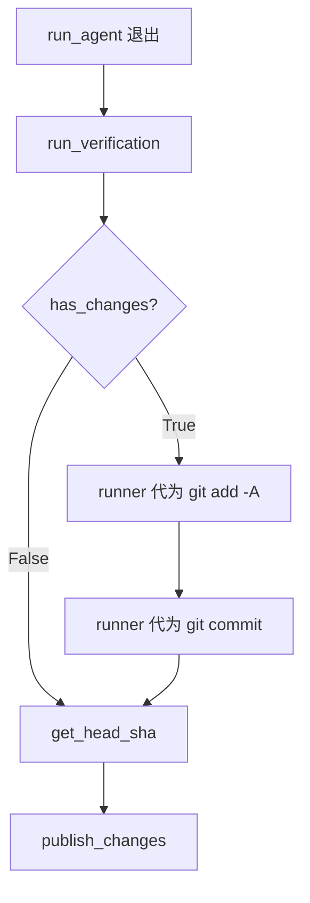

# PRD: Runner Auto-Commit Fallback for Sandbox-Blocked Commits

- GitHub Issue: https://github.com/zata-zhangtao/keda/issues/4

## 1. Introduction & Goals

当前 Agent Runner 使用 Codex agent 处理 Issue 时，Codex 运行在 `--sandbox workspace-write` 模式下。该 sandbox 只允许 agent 写入当前 worktree 目录，但 Git worktree 的 `.git` 是一个 gitfile，指向主仓库的 `.git/worktrees/<branch>/` 目录。当 agent 执行 `git commit` 时，Git 需要在该目录创建 `index.lock`，sandbox 阻止了这一操作，导致 commit 失败。

结果：agent 成功修改了文件，但无法提交。Runner 最终检查到未提交变更，抛出 `RuntimeError("Agent left uncommitted changes.")`，将 Issue 标为 `failed`。

本 PRD 的目标是在 runner 层引入一个**轻量级兜底提交机制**：当 agent 退出后仍有未提交变更时，由 runner（host 侧，不受 sandbox 限制）代为执行 `git add` 和 `git commit`，然后继续正常发布流程。

## 2. Requirement Shape

- **Actor**：Agent Runner 编排器（`run_once`）。
- **Trigger**：`run_agent` 退出后，`has_changes()` 返回 `True`。
- **Expected Behavior**：
  - runner 检测到未提交变更时，不立即报错标 `failed`。
  - runner 在 worktree 中执行 `git add -A` 和 `git commit`。
  - commit message 使用固定格式：`[Agent] Issue #{number}: {title}`。
  - 提交后继续正常流程：`get_head_sha`、`publish_changes`。
  - 写日志记录本次为 runner 兜底提交，方便排查。
- **Scope Boundary**：
  - 只修改 `src/backend/core/use_cases/run_agent_once.py` 的 `run_once` 函数。
  - 不改 agent CLI 调用方式、不改 sandbox 设置、不改 agent prompt。
  - 不处理 agent 完全未产生任何变更的场景（`before_sha == after_sha` 仍按现有逻辑报错）。

## 3. Repository Context And Architecture Fit

### 相关模块

| 文件 | 职责 | 改动类型 |
|---|---|---|
| `src/backend/core/use_cases/run_agent_once.py` | Runner 核心编排：agent 调用、变更检查、发布 | 修改（`has_changes` 分支改为兜底提交） |

### 架构约束

- 兜底提交是 runner 的**编排职责**，放在 `run_once` 中合适。
- `process_runner` 在 host 环境执行，无 sandbox 限制，可以正常写入主仓库的 `.git/worktrees/<branch>/`。
- 依赖方向不变：不涉及 `engines/` 或 `infrastructure/` 层的新导入。

## 4. Recommendation

### Recommended Approach：Runner 代为兜底提交

在 `run_once` 的 `has_changes` 检查点做最小改动：

```python
if has_changes(worktree_path, process_runner):
    _logger.warning(
        "Agent left uncommitted changes for Issue #%d; runner committing.",
        issue.number,
    )
    process_runner.run(["git", "add", "-A"], cwd=worktree_path)
    process_runner.run(
        [
            "git",
            "commit",
            "-m",
            f"[Agent] Issue #{issue.number}: {issue.title}",
        ],
        cwd=worktree_path,
    )
```

### 为什么这是最佳方案

- **改动最小**：只改 `has_changes` 分支的几行代码，不牵动 agent 调用、prompt、sandbox 等其他部分。
- **安全隔离保留**：codex 的 `workspace-write` sandbox 继续生效，runner 只在 host 侧做最后一步提交。
- **向后兼容**：对 Claude / Kimi agent 同样适用（虽然它们通常不受此 sandbox 限制）。

### Alternatives Considered

| 方案 | 说明 | 拒绝原因 |
|---|---|---|
| 放宽 codex sandbox 到 `none` | 让 agent 自己 commit | 拆掉了文件系统隔离的第一道防线，agent 可写 `.git`、系统配置等，风险过高 |
| 修改 prompt 不让 agent commit | agent 只做 `git add`，runner 统一 commit | 需要改 prompt 和 runner 流程，改动面大于当前方案；且破坏了「commit handoff」的设计意图 |
| 构建 retry loop 让 agent 重新 commit | 启动第二轮 agent 专门修复 commit | 过度设计；问题不是 agent 不会 commit，是 sandbox 物理上阻止了 commit，再跑一百轮也没用 |

## 5. Implementation Guide

### Core Logic

```
BEFORE (run_once):
  run_agent(...)
  verification_results = run_verification(...)
  if has_changes(...):
      raise RuntimeError("Agent left uncommitted changes.")
  after_sha = get_head_sha(...)

AFTER (run_once):
  run_agent(...)
  verification_results = run_verification(...)
  if has_changes(...):
      _logger.warning("Agent left uncommitted changes for Issue #%d; runner committing.", issue.number)
      process_runner.run(["git", "add", "-A"], cwd=worktree_path)
      process_runner.run(
          ["git", "commit", "-m", f"[Agent] Issue #{issue.number}: {issue.title}"],
          cwd=worktree_path,
      )
  after_sha = get_head_sha(...)
```

### Change Impact Tree

```text
.
src/backend/core/use_cases/
└── run_agent_once.py
    [修改] has_changes 分支由报错改为 runner 兜底提交
    └── run_once()
        └── if has_changes(...): 分支
            ├── BEFORE: raise RuntimeError("Agent left uncommitted changes.")
            └── AFTER: git add -A + git commit（runner 代为执行）
```

### Flow Diagram



### External Validation

无需外部验证；问题已在本地复现，解决方案基于 Git worktree + sandbox 的已知行为。

## 6. Definition Of Done

- [x] `run_once` 中 `has_changes` 为 `True` 时由 runner 代为提交，不再报错。
- [x] runner 代为提交时先执行 `git add -A`，再执行 `git commit`。
- [x] commit message 格式为 `[Agent] Issue #{number}: {title}`。
- [x] 日志中记录 runner 兜底提交的 warning 信息。
- [x] 代为提交后正常进入 `get_head_sha` 和 `publish_changes`。
- [x] 所有现有测试无回归失败。
- [x] `just lint` 和 `just test` 通过。

## 7. Acceptance Checklist

### Architecture Acceptance

- [ ] `src/backend/core/use_cases/run_agent_once.py` 中 `run_once` 的 `has_changes` 分支不再抛出 `RuntimeError`。
- [ ] runner 代为提交时调用 `process_runner.run` 执行 `git add -A` 和 `git commit`。
- [ ] commit message 格式严格为 `[Agent] Issue #{issue.number}: {issue.title}`。

### Behavior Acceptance

- [ ] 当 Codex agent 因 sandbox 限制无法 commit 时，runner 能成功代为提交未提交的变更。
- [ ] 代为提交后，`get_head_sha` 能获取到新 commit 的 SHA。
- [ ] 代为提交后，`publish_changes` 正常执行（push + 创建 draft PR）。
- [ ] 日志中出现 `Agent left uncommitted changes for Issue #%d; runner committing.` 级别的 warning 信息。
- [ ] 当 agent 完全未产生任何变更（`before_sha == after_sha`）时，仍按现有逻辑报错。

### Validation Acceptance

- [ ] `uv run pytest tests/test_run_agent.py -v` 全部通过。
- [ ] `uv run pytest tests/ -v` 无回归失败。
- [ ] `just lint` 通过。

## 8. Functional Requirements

**FR-1**: 当 `has_changes` 返回 `True` 时，`run_once` 不得抛出 `RuntimeError("Agent left uncommitted changes.")`。

**FR-2**: runner 代为提交前必须先执行 `git add -A`，确保所有变更（包括 agent 已 staged 和未 staged 的）都被纳入 commit。

**FR-3**: runner 代为提交的 commit message 必须为 `[Agent] Issue #{issue.number}: {issue.title}`。

**FR-4**: 代为提交后，`run_once` 应继续执行 `get_head_sha` 和 `publish_changes`，不得中断流程。

**FR-5**: `before_sha == after_sha` 的检测必须在兜底提交之后执行，以正确判断 agent 是否实际产生了变更。

## 9. Non-Goals

- **不修改 agent prompt**：agent 仍被提示自行 commit；兜底提交是透明补偿。
- **不改 codex sandbox 设置**：`--sandbox workspace-write` 保持不变。
- **不在 Issue comment 中特别标注兜底提交**：保持现有 comment 格式，不增加额外噪音；排查依赖日志。
- **不处理 agent 进程崩溃或无变更场景**：这些仍按现有异常处理逻辑报错。

## 10. Risks And Follow-Ups

| 风险 | 缓解措施 |
|---|---|
| runner 代为提交可能包含 agent 本想排除的文件 | `git add -A` 会把所有变更一起提交；当前设计下 agent 在 sandbox 内无法精确控制暂存区，这是可接受的妥协 |
| 无法得知 agent 原本想用的 commit message | 使用固定格式 `[Agent] Issue #N: title`，语义清晰，足够用于后续 review |
| 误报兜底（agent 故意不 commit）| 极不可能；prompt 明确要求 commit，agent 不 commit 几乎总是失败而非故意 |

## 11. Decision Log

| ID | Decision | Chosen | Rejected | Rationale |
|---|---|---|---|---|
| D-01 | 谁来做兜底提交 | runner 在 host 侧代为提交 | 放宽 codex sandbox 到 `none` | 保持 sandbox 安全隔离，不拆第一道防线；host 侧的 `process_runner` 本身就有完整文件系统权限 |
| D-02 | commit message 来源 | runner 构造固定格式 | 尝试从 agent stdout 解析 | agent 输出中通常不包含 commit message，解析不可靠且增加复杂度 |
| D-03 | 是否写 Issue comment 说明 | 不写（保持现有 comment 格式） | 在 Issue comment 中追加兜底说明 | 改动最小化；runner 日志已包含 warning，足够排查 |
| D-04 | 是否先检查 staged 再决定 `git add` | 统一 `git add -A` | 只提交已 staged 的文件 | agent 在 sandbox 内 commit 失败后，staged 状态不确定；`-A` 最安全 |
