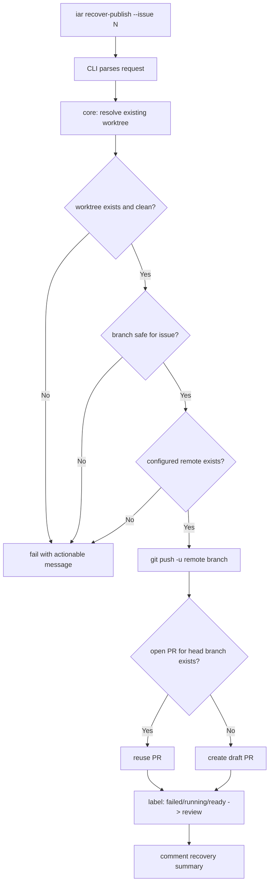
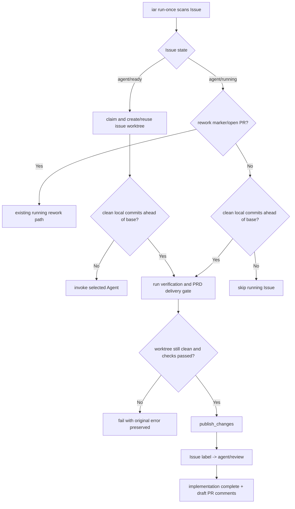

# PRD: Agent Runner Publish Failure Recovery & Resume

- GitHub Issue: https://github.com/zata-zhangtao/keda/issues/28

## 1. Introduction & Goals

`iar run-once` 当前把 Agent 执行、runner 提交、Git push、PR 创建和 label 收尾串在同一次流程里。实际故障中，Agent 已经完成代码修改、runner 已经生成本地 commit、验证也通过，但最后 `git push` 因配置 remote 不存在而失败，Issue 被标记为 `agent/failed`。

同类发布阶段失败还包括网络中断、GitHub CLI 认证过期、GitHub API 临时错误、rate limit、`git push` 连接失败、`gh pr create` 超时或 PR 查询失败。这些失败的共同点是：代码成果已经在本地 commit 中，恢复应重试发布收尾，而不是重跑 Agent。

这类失败不应该重新启动 Agent。正确恢复方式是复用已有 worktree 和本地 commit，幂等完成发布收尾：push 分支、创建或复用 draft PR、把 Issue 从 `agent/failed` 切到 `agent/review`。

2026-05-25 的 Issue #27 事故暴露了一个相邻失败模式：本地 commit `79ae0277ee08058907992321f345e9a7e49561f4` 已经存在且验证通过，但 Issue 仍停在 `agent/running`；后续 `run-once` 没有识别该 clean local commit，重新进入 Agent/recovery 路径并因 quota/auth 失败耗尽 6 次尝试。同时，失败上报阶段的 GitHub label/comment 操作失败又掩盖了原始上下文。本 PRD 因此追加 `run-once` 内联发布恢复、label 幂等编辑、失败上报 best-effort 三项实际修复范围。

本 PRD 的目标：

- 在 `run-once` 领取 Issue 前发现明显的发布配置错误，避免 Agent 做完后才失败。
- 为“已有本地 commit，但发布阶段失败”的任务提供显式恢复命令。
- 恢复命令必须幂等、安全，不重复创建 PR，不误推 base branch，不处理未提交脏变更。
- 在 `run-once` 自身再次看到已有 clean local commit 的 ready/running Issue 时，直接完成验证与发布收尾，而不是重新启动 Agent。
- GitHub label/comment 收尾失败不得掩盖原始 runner 错误。

### Final Live Integration Test Checklist

最终交付必须做真实环境验收，不能用 mock、pytest 或 `just test` 替代。以下清单必须实际操作一个可丢弃的 GitHub Issue、真实 Git remote、真实 GitHub CLI 认证和真实本地 worktree：

- [ ] 用 `gh issue create` 或 GitHub 页面创建一个真实测试 Issue，打上 `agent/ready`，记录 Issue URL、Issue number、测试 repo path、配置 remote 名称和当前 `gh auth status` 结果。
- [ ] 临时把 `[agent_runner.git].remote` 配成一个本仓库不存在的 remote，执行 `uv run iar run-once --max-issues 1`，然后用 `gh issue view <number> --json labels,comments` 确认 runner 没有领取 Issue、labels/comments 未变化，并确认命令输出包含配置 remote 和实际可用 remote 列表。
- [ ] 恢复正确 remote 后，使用真实 `run-once` 让 runner 处理该 Issue，并在 publish 阶段制造真实失败，例如使用不可 push 的 remote、临时失效的 GitHub CLI auth、或真实网络断开；失败后用本地 `git -C <issue_worktree> log -1 --oneline` 确认已有本地 commit。
- [ ] 继续用 `gh issue view <number> --json labels,comments` 确认 Issue 进入 `agent/failed`，并确认失败 comment 明确包含 worktree path、失败类别、失败命令上下文和 `iar recover-publish --issue <number>`。
- [ ] 修复真实 publish 环境后，执行 `uv run iar recover-publish --issue <number>`，并用本地 shell history 或 runner 日志确认该命令没有启动 Agent、没有执行 `git add`、没有执行 `git commit`，只进行了 publish 收尾。
- [ ] 用 `git ls-remote <configured_remote> <issue_branch>` 或 GitHub 页面确认远程 issue branch 已存在，且远程 head SHA 等于本地 issue worktree 的 `git rev-parse HEAD`。
- [ ] 用 `gh pr list --head <issue_branch> --state open --json number,url,isDraft,body,headRefName` 确认只存在一个 open draft PR，PR body 包含 `Closes #<issue_number>`。
- [ ] 用 `gh issue view <number> --json labels,comments` 确认 Issue 已移除 `agent/failed`、`agent/running`、`agent/ready`，已添加 `agent/review`，且成功 comment 记录 branch、HEAD SHA、PR URL、是否复用已有 PR。
- [ ] 对同一个 Issue 再执行一次 `uv run iar recover-publish --issue <number>`，再次用 `gh pr list --head <issue_branch> --state open` 确认没有创建第二个 PR，且命令成功复用现有 PR。
- [ ] 在真实 issue worktree 制造未提交变更后执行 `uv run iar recover-publish --issue <number>`，确认命令拒绝继续；随后用 `gh issue view` 和 `gh pr list` 确认没有新的 label、comment、push 或 PR 变化。
- [ ] 在真实 issue worktree 切到 base branch 后执行 `uv run iar recover-publish --issue <number>`，确认拒绝发布 base branch；再切到不含 Issue number 的分支，确认无 `--branch` 时拒绝，带不匹配 `--branch` 时也拒绝。
- [ ] 真实验收完成后，关闭或清理测试 Issue、测试 PR 和测试 branch，并把实际执行命令、Issue URL、PR URL、关键 `gh`/`git` 验证输出摘要记录到实现 PR 或交付说明中。

### Observed Issue #27 Recovery Evidence

- [x] 执行 `uv run iar run-once --repo /Users/zata/code/keda --agent codex --max-issues 1` 后，runner 复用本地 clean commit `79ae0277ee08058907992321f345e9a7e49561f4`，没有重新调用 Agent。
- [x] `gh pr view 31 --json number,title,state,isDraft,headRefName,headRefOid,baseRefName,url` 确认 draft PR #31 已创建，head branch 为 `issue-27`，head SHA 为 `79ae0277ee08058907992321f345e9a7e49561f4`。
- [x] `gh issue view 27 --json labels,comments` 确认 Issue #27 已进入 `agent/review`，并包含 implementation complete 与 draft PR created 两条事件评论。
- [x] `just test` 通过：`310 passed`。

## 2. Requirement Shape

- **Actor**：本地操作者或自动化 runner 运维者。
- **Trigger**：
  - `iar run-once` 即将领取 ready Issue。
  - `iar run-once` 在 `publish_changes` 阶段失败。
  - `iar run-once` 重新扫描到一个 ready Issue，且复用的 issue worktree 已经有 clean local commit ahead of configured base。
  - `iar run-once` 重新扫描到一个 `agent/running` Issue，没有 rework marker 或 open PR，但 issue worktree 已经有 clean local commit ahead of configured base。
  - `git push`、PR 查询、PR 创建、Issue label 更新或 Issue comment 创建因为网络/API/认证类错误失败。
  - 用户显式执行 `iar recover-publish --issue <number>`。
- **Expected Behavior**：
  - `run-once` 非 dry-run 时先做 publish preflight，配置 remote 不存在时直接失败，不领取 Issue。
  - publish 阶段失败时，Issue comment 明确说明本地 commit 已存在但发布收尾失败，并给出恢复命令；错误摘要保留失败命令、exit code、stdout/stderr 或异常文本。
  - `run-once` 发现已有 clean local commit 时，先运行配置的 verification 与 PRD delivery check；通过后直接 push、创建 draft PR、更新 Issue 到 `agent/review`，不调用 Agent。
  - 失败上报尽力执行 label/comment 更新，但这些上报失败只能记录日志，不能覆盖原始执行失败。
  - `recover-publish` 只恢复发布收尾，不启动 Agent，不运行 recovery prompt，不要求新 commit。
  - `recover-publish` 成功后，远程分支存在，draft PR 存在或被复用，Issue label 进入 review 状态。
- **Scope Boundary**：
  - 不处理 Agent 代码修复、测试失败、无 commit、未提交变更等执行阶段问题；这些属于 surgical failure recovery。
  - 不自动选择非配置 remote；配置 remote 不存在必须失败并提示用户修配置。
  - 不引入数据库、状态文件或后台队列；恢复基于 Git worktree、GitHub API 和现有配置。

## 3. Repository Context And Architecture Fit

### Existing Path

| 路径 | 当前职责 | 与本 PRD 的关系 |
|---|---|---|
| `src/backend/api/cli.py` | `iar` CLI 参数解析与 use case 调用 | 新增 `recover-publish` 子命令 |
| `src/backend/core/use_cases/run_agent_once.py` | Issue 领取、Agent 执行、验证、提交代理、发布 PR | 复用 `get_current_branch`, `get_head_sha`, `has_changes`, `publish_changes` 的部分逻辑；补强 publish failure comment |
| `src/backend/core/use_cases/agent_runner_orchestrate.py` | 多仓库/多状态 Issue 编排、ready/running/review 流转、失败上报 | 追加 clean local commit 识别、ready/running 内联发布恢复、失败上报 best-effort |
| `src/backend/core/shared/interfaces/agent_runner.py` | GitHub 与进程端口 | 需要扩展 PR 查询能力，避免 core 直接硬编码 `gh pr list` |
| `src/backend/core/shared/models/agent_runner.py` | core 层配置与值对象 | 新增 PR summary / publish recovery request-result 模型 |
| `src/backend/infrastructure/github_client.py` | GitHub CLI 适配器 | 实现按 head branch 查询 open PR；label edit 前读取当前 labels，跳过无效 add/remove |
| `tests/test_run_agent.py` | runner 编排行为测试 | 覆盖 preflight、publish failure comment、ready/running 复用 clean local commit |
| `tests/test_github_client.py` | GitHub CLI adapter 行为测试 | 覆盖 label 幂等编辑与 no-op 跳过 |
| `tests/test_agent_runner_config.py` | runner 配置解析测试 | 隔离开发者本地 `config.toml` 的 repositories 配置，避免测试受本机环境影响 |
| `tests/test_agent_runner_cli.py` | CLI parser 测试 | 覆盖 `recover-publish` 参数 |

### Architecture Constraints

- CLI 层只解析参数和装配依赖，不写恢复业务规则。
- 发布恢复编排属于 core use case，建议新增 `src/backend/core/use_cases/recover_publish.py`。
- core 层不得直接导入 `infrastructure`，PR 查询必须通过 `IGitHubClient`。
- Git 命令仍通过 `IProcessRunner` 执行，保持测试可替换。
- `run-once` 与 `recover-publish` 应复用相同的 remote 校验与 PR 创建逻辑，避免并行实现。

### Reuse Candidates

- `format_command(config.worktree.path_command, issue_number=...)`：只解析预期 worktree 路径，不创建新 worktree。
- `get_current_branch`, `get_head_sha`, `has_changes`, `validate_publish_remote`：作为恢复前安全检查。
- `run_verification`, `ensure_verification_passed`, `ensure_prd_delivery_ready`：复用现有验证和 PRD 交付检查，保证已有 local commit 仍满足发布门禁。
- `publish_changes(...)`：复用既有 push、draft PR 创建与 PR body 生成路径，避免另写发布逻辑。
- `github_client.create_draft_pr(...)`：PR 不存在时继续使用现有 draft PR 创建入口。
- `github_client.edit_issue_labels(...)` 与 `comment_issue(...)`：完成 label 收尾和结果记录。

### Potential Redundancy Risks

- 不应新增第二套 GitHub CLI wrapper；只扩展现有 `GitHubCliClient`。
- 不应新增“恢复状态文件”；状态可以从 Git 分支、PR 列表和 Issue labels 推导。
- 不应让 `recover-publish` 调用 `create_or_reuse_worktree`，因为该函数可能创建 worktree；恢复命令必须只处理已经存在的工作成果。
- 不应为了 Issue #27 事故复制一套轻量 publish 流程；`run-once` 内联恢复必须复用 `publish_changes(...)` 和既有 verification/PRD gate。

## 4. Recommendation

### Recommended Approach：新增 `recover-publish` 用例 + 发布前 preflight + 幂等 PR 复用

1. 在 core 层新增 `recover_publish_issue(...)`：
   - 根据 `config.worktree.path_command` 解析 issue worktree。
   - 校验 worktree 存在且是 Git worktree。
   - 校验 worktree clean，拒绝未提交变更。
   - 校验当前 branch 安全：不能为空、不能等于 base branch、默认必须匹配 issue number；不匹配时要求显式 `--branch`。
   - 校验 `[agent_runner.git].remote` 存在。
   - push 当前 branch 到配置 remote。
   - 查询 head branch 是否已有 open PR；有则复用，没有则创建 draft PR。
   - 将 Issue label 从 `agent/failed` / `agent/running` / `agent/ready` 切到 `agent/review`。
   - 写 Issue comment，记录 branch、HEAD、PR URL、是否复用已有 PR。

2. 在 CLI 层新增：

   ```bash
   uv run iar recover-publish --issue 5
   uv run iar recover-publish --issue 5 --branch issue-5
   ```

3. `run-once` publish 阶段失败时：
   - 不再只输出原始异常。
   - comment 中加入“本地 commit 已存在，发布失败”的诊断、失败命令摘要和 `iar recover-publish --issue <number>` 命令。
   - 保持 Issue 为 `agent/failed`，由恢复命令成功后切到 review。

4. 追加 `run-once` 内联恢复路径：
   - ready Issue 创建或复用 worktree 后，若当前 branch 已有 clean local commit ahead of configured base，跳过 Agent，直接运行 verification 与 PRD delivery check。
   - running Issue 若没有 rework marker，但已有 clean local commit，则进入 publish recovery 分支，不再因“没有 rework marker”而永久跳过。
   - 该路径成功后同样调用 `publish_changes(...)`、添加 `agent/review`、移除 workflow state labels，并写 implementation complete / draft PR created comments。

5. `GitHubCliClient.edit_issue_labels(...)` 改为先读取 Issue 当前 labels：
   - 只添加当前不存在的 labels。
   - 只移除当前存在且没有同时被 add 的 labels。
   - add/remove 均为空时跳过 `gh issue edit`。

6. `run-once` 失败上报改为 best-effort：
   - label 标记失败和 failure comment 都单独 try/catch。
   - 上报失败只写日志，不覆盖原始 runner exception。

### Why This Fits

- 只新增一个明确 use case，不改变 Agent retry loop。
- 用现有 worktree、GitHub client、process runner 端口完成恢复。
- 幂等性来自 GitHub PR 查询和 label set 操作，不需要外部状态。
- 发布恢复与代码修复分离，避免 push 失败时错误地重启 Agent。
- Issue #27 的即时修复没有引入新状态或新发布抽象，而是把已有 commit 识别接入现有 orchestrator 与 publish path。

### Alternatives Considered

| 方案 | 说明 | 拒绝原因 |
|---|---|---|
| 把发布失败纳入 Agent recovery loop | push 失败后重新启动 Agent，让它继续处理 | Agent 被明确禁止 push/建 PR；且代码已完成，重启 Agent 可能产生无关改动 |
| `run-once` 自动在失败后立即重试 push 多次 | 对所有 publish failure 做内置重试 | remote 配置错误、权限错误不是短暂问题；自动重试会浪费时间且仍无恢复入口 |
| 只要求用户手动执行 git push / gh pr create | 文档化人工恢复步骤 | 可行但不可重复、容易漏 label/comment 收尾，且不适合 daemon 场景 |
| 新增状态文件记录 publish checkpoint | 在 `.agent-runner/` 写 publish 状态 | 额外状态会过期；当前状态可从 Git 和 GitHub 查询得到 |

## 5. Implementation Guide

This section is a living implementation guide based on current repository analysis. If implementation discovers additional affected files, hidden dependencies, edge cases, or a better path, update this PRD before proceeding.

### Core Logic

```text
recover_publish_issue(request, config, github_client, process_runner):
  worktree_path = resolve_existing_issue_worktree(repo_path, issue_number, config)
  ensure worktree_path exists
  ensure has_changes(worktree_path) == False

  branch = get_current_branch(worktree_path)
  ensure branch != config.git.base_branch
  ensure branch matches issue number, unless request.expected_branch is provided
  if expected_branch provided, ensure branch == expected_branch

  head_sha = get_head_sha(worktree_path)
  validate_publish_remote(worktree_path, config)
  git push -u <configured_remote> <branch>

  existing_pr = github_client.find_open_pr_by_head(branch, cwd=worktree_path)
  if existing_pr:
      pr_url = existing_pr.url
      reused_pr = True
  else:
      pr_url = github_client.create_draft_pr(...)
      reused_pr = False

  github_client.edit_issue_labels(
      issue_number,
      add=[config.labels.review],
      remove=[config.labels.failed, config.labels.running, config.labels.ready],
  )
  github_client.comment_issue(issue_number, publish recovery summary)
  return PublishRecoveryResult(...)
```

### Implemented Run-Once Resume Logic

2026-05-25 的实际补丁先完成了 `run-once` 内联恢复，而不是新增 `recover-publish` CLI：

```text
run_once:
  collect ready issues
  collect running issues
  for running issue without rework marker:
      if issue worktree has clean local commits ahead of configured base:
          process as running_publish_recovery
      else:
          skip as active/unknown running issue

process ready issue:
  claim issue as running
  create_or_reuse_worktree(...)
  if clean local commits ahead of configured base:
      run verification
      ensure PRD delivery ready
      publish_changes(...)
      label -> review
      comment implementation + draft PR
      return
  run agent until committed
  continue existing publish flow

process running_publish_recovery:
  resolve existing issue worktree only
  require clean local commits ahead of configured base
  run verification
  ensure PRD delivery ready
  publish_changes(...)
  label -> review
  comment implementation + draft PR
```

### Change Impact Tree

```text
.
├── src/backend/api/
│   └── cli.py
│       [修改] 新增 recover-publish 子命令与参数解析
├── src/backend/core/shared/
│   ├── interfaces/agent_runner.py
│   │   [修改] IGitHubClient 新增 find_open_pr_by_head(...)
│   └── models/agent_runner.py
│       [修改] 新增 PullRequestSummary, PublishRecoveryRequest, PublishRecoveryResult
├── src/backend/core/use_cases/
│   ├── agent_runner_orchestrate.py
│   │   [修改] _mark_issue_failed best-effort failure reporting
│   │   [修改] _reuse_existing_local_commit 检测 clean local commit 并运行 verification / PRD gate
│   │   [修改] _finish_existing_commit_publication 复用 publish_changes 完成 PR 与 label 收尾
│   │   [修改] _process_running_publish_recovery 处理 agent/running 但已有本地 commit 的恢复
│   ├── run_agent_once.py
│   │   [修改] publish failure comment 增加恢复命令与本地 commit 说明
│   └── recover_publish.py
│       [新增] 发布恢复编排、worktree 解析、安全校验、幂等 PR 复用
├── src/backend/infrastructure/
│   └── github_client.py
│       [修改] 通过 gh pr list 实现 find_open_pr_by_head(...)
│       [修改] edit_issue_labels 先读取当前 labels，仅执行真实 add/remove，no-op 时跳过 gh issue edit
├── tests/
│   ├── test_agent_runner_cli.py
│   │   [修改] 覆盖 recover-publish CLI parser
│   ├── test_agent_runner_config.py
│   │   [修改] 隔离本地 config.toml 中的 repositories，避免开发者环境污染配置测试
│   ├── test_github_client.py
│   │   [修改] 覆盖只移除已存在 labels 与 no-op label update
│   ├── test_run_agent.py
│   │   [修改] 覆盖 ready/running Issue 复用 existing clean local commit 且不调用 Agent
│   ├── test_recover_publish.py
│   │   [新增] 覆盖恢复成功、复用 PR、安全拒绝、label 收尾
│   └── conftest.py
│       [修改] FakeGitHubClient 支持 PR 查询
└── docs/
    └── guides/agent-runner.md
        [修改] 增加发布失败恢复说明
```

### Flow Or Architecture Diagram





### Realistic Validation Plan

| Behavior | Real entry point | Dependencies | Procedure | Why lower-level tests are insufficient |
|---|---|---|---|---|
| Existing clean local commit is reused without invoking Agent | `uv run iar run-once --repo /Users/zata/code/keda --agent codex --max-issues 1` | Real Git worktree, real configured remote, real GitHub CLI auth | Start from an Issue worktree with a clean commit ahead of configured base, run `run-once`, then inspect terminal/log output, `gh issue view`, and `gh pr view` | Unit tests can prove command selection, but only the real entry point proves GitHub labels/comments/PR state converge |
| GitHub label edits are idempotent | `gh issue view` plus runner label transition | Real GitHub Issue labels | Run a transition where several remove labels are absent, confirm `gh issue edit` succeeds and final labels are correct | Fake runner cannot reproduce GitHub CLI failure behavior for absent labels |
| Failure reporting does not hide original runner failure | `uv run iar run-once` against a controlled failing publish/comment scenario | Real or sandbox GitHub CLI failure, local logs | Force label/comment failure after an original runner exception and confirm logs preserve both messages | Mock tests can assert catch blocks, but real logs prove operator-visible diagnosis |
| Regression coverage | `just test` | Local test suite | Run `just test` after code changes | Required repository-wide regression gate |

### Low-Fidelity Prototype

No UI changes.

### ER Diagram

No persistent data model changes.

### Interactive Prototype Change Log

No prototype files changed.

### External Validation

No external web validation required; repository code paths and GitHub CLI usage are already present in the project.

## 6. Definition Of Done

- `recover-publish` can finish a task where Agent already produced a local commit but publish failed.
- `run-once` fails early for missing configured remote before claiming an Issue.
- Publish failure comments distinguish execution failure from publish failure.
- PR creation is idempotent and does not duplicate an existing open PR for the same head branch.
- Safety checks reject dirty worktrees, base branch publishing, missing remotes, and suspicious branches.
- `run-once` can recover ready/running Issues with existing clean local commits without invoking Agent.
- Failure reporting does not hide the original runner exception when GitHub label/comment updates fail.
- GitHub label editing is idempotent and skips absent-label removals/no-op updates.
- Documentation and tests are updated.
- `just test` passes.

## 7. Acceptance Checklist

### Architecture Acceptance

- [ ] `src/backend/core/use_cases/recover_publish.py` exists and contains the publish recovery orchestration.
- [ ] `src/backend/api/cli.py` exposes `recover-publish --issue <number>` and optional `--branch <branch>`.
- [ ] `src/backend/core/shared/interfaces/agent_runner.py` extends `IGitHubClient` with PR lookup capability.
- [ ] `src/backend/infrastructure/github_client.py` implements PR lookup without leaking infrastructure imports into core.
- [ ] `recover_publish.py` does not call Agent CLI builders or recovery prompt logic.
- [x] `src/backend/core/use_cases/agent_runner_orchestrate.py` contains best-effort failure reporting via `_mark_issue_failed`.
- [x] `src/backend/core/use_cases/agent_runner_orchestrate.py` contains ready/running existing clean local commit recovery without adding new infrastructure dependencies.
- [x] `src/backend/infrastructure/github_client.py` performs idempotent label edits by reading current Issue labels before `gh issue edit`.

### Behavior Acceptance

- [ ] `iar run-once` checks configured remote before claiming ready Issues when not in dry-run mode.
- [ ] Missing configured remote produces an error that includes the configured remote and available remotes.
- [ ] `iar recover-publish --issue 5` resolves an existing issue worktree without creating a new worktree.
- [ ] Recovery refuses to continue when the worktree has uncommitted changes.
- [ ] Recovery refuses to publish when current branch equals `[agent_runner.git].base_branch`.
- [ ] Recovery refuses suspicious branch names that do not reference the issue number unless `--branch` is supplied.
- [ ] Recovery pushes to `[agent_runner.git].remote` only; it never auto-selects another remote.
- [ ] If an open PR already exists for the head branch, recovery reuses it and does not create a duplicate PR.
- [ ] If no open PR exists, recovery creates one draft PR with body containing `Closes #<issue_number>`.
- [ ] Successful recovery removes `agent/failed`, `agent/running`, and `agent/ready`, then adds `agent/review`.
- [ ] Successful recovery comments the Issue with branch, HEAD SHA, PR URL, and whether the PR was reused.
- [ ] Publish failure in `run-once` comments the Issue with `iar recover-publish --issue <number>`.
- [ ] Publish failure comments include the failed publish operation category, such as push, PR lookup, PR create, label update, or comment update when available.
- [x] A ready Issue whose worktree already has a clean local commit ahead of configured base is published without invoking Agent.
- [x] An `agent/running` Issue without a rework marker but with a clean local commit ahead of configured base is published without invoking Agent.
- [x] Existing-commit recovery runs verification and PRD delivery checks before publishing.
- [x] Existing-commit recovery writes implementation complete and draft PR created comments.
- [x] Issue #27 was recovered to draft PR #31 with head SHA `79ae0277ee08058907992321f345e9a7e49561f4`.

### Safety Acceptance

- [ ] `recover-publish` does not run `git add`, `git commit`, `git merge`, or branch deletion commands.
- [ ] `recover-publish` does not run any Agent command.
- [ ] `recover-publish` leaves labels unchanged when push or PR creation fails.
- [ ] `recover-publish` leaves labels unchanged when network/API/auth failures interrupt push, PR lookup, or PR creation.
- [ ] Re-running `recover-publish` after success exits successfully and reuses the existing PR.
- [x] Existing-commit recovery refuses dirty worktrees by requiring `has_changes(...) == False`.
- [x] Existing-commit recovery uses configured base comparison via `<remote>/<base_branch>..HEAD` and does not publish when no local commits are ahead.
- [x] Failure label/comment updates are best-effort and cannot replace the original exception.

### Documentation Acceptance

- [ ] `docs/guides/agent-runner.md` documents when to use `recover-publish`.
- [ ] The docs clarify that `labels sync` is not a publish environment validator.
- [ ] The docs include the manual recovery fallback commands for cases where GitHub CLI is unavailable.

### Validation Acceptance

- [ ] `uv run pytest tests/test_recover_publish.py -v` passes.
- [ ] `uv run pytest tests/test_run_agent.py tests/test_agent_runner_cli.py -v` passes.
- [ ] `just test` passes.
- [x] `uv run pytest tests/test_github_client.py -v` covers idempotent label editing.
- [x] `uv run pytest tests/test_run_agent.py -v` covers ready/running existing clean local commit recovery.
- [x] `just test` passed on 2026-05-25 with `310 passed`.

## 8. Functional Requirements

**FR-1**: `run_once` must perform publish preflight before calling `github_client.list_ready_issues` when `dry_run == False`.

**FR-2**: Publish preflight must fail if `[agent_runner.git].remote` is not present in `git remote` output, and the error must include all available remotes.

**FR-3**: `recover-publish` must resolve the issue worktree using `config.worktree.path_command` only; it must not call the worktree create command.

**FR-4**: `recover-publish` must fail if the resolved path does not exist or is not a Git worktree.

**FR-5**: `recover-publish` must fail if `git status --porcelain` is non-empty.

**FR-6**: `recover-publish` must fail if current branch is empty, equals `config.git.base_branch`, or does not reference the issue number and no explicit `--branch` was supplied.

**FR-7**: If `--branch` is supplied, `recover-publish` must fail unless the current branch exactly equals that value.

**FR-8**: `recover-publish` must push with `git push -u <config.git.remote> <current_branch>`.

**FR-9**: `IGitHubClient.find_open_pr_by_head` must return an open PR summary for the current branch when one exists.

**FR-10**: `recover-publish` must call `create_draft_pr` only when `find_open_pr_by_head` returns no open PR.

**FR-11**: `recover-publish` must update Issue labels only after push and PR lookup/create succeed.

**FR-12**: `recover-publish` must write an Issue comment after success with enough information for a human reviewer to inspect the recovered publication.

**FR-13**: `run-once` publish failure comments must include the worktree path when available and the exact recovery command.

**FR-14**: `run-once` publish failure comments must preserve enough error context for network/API/auth failures, including failed operation name and captured stdout/stderr when available.

**FR-15**: `recover-publish` must be safe to rerun after transient network/API/auth failures; it must derive current state from Git and GitHub instead of assuming the previous failed operation completed nothing.

**FR-16**: `run_once` must detect when a reused ready Issue worktree already has one or more clean local commits ahead of `<config.git.remote>/<config.git.base_branch>` and must publish that commit without invoking the selected Agent.

**FR-17**: `run_once` must detect `agent/running` Issues without rework markers that have clean local commits ahead of the configured base and route them to publish recovery instead of skipping indefinitely.

**FR-18**: Existing local commit reuse must run configured verification and PRD delivery checks before push/PR/label/comment publication.

**FR-19**: Failure reporting must be best-effort: GitHub label or comment failures must be logged but must not replace the original exception that caused the Issue processing failure.

**FR-20**: `GitHubCliClient.edit_issue_labels` must be idempotent by reading current Issue labels, adding only missing labels, removing only present labels, and skipping `gh issue edit` when no effective changes exist.

## 9. Non-Goals

- Do not retry or repair Agent-generated code.
- Do not recover failed verification.
- Do not migrate or delete worktrees.
- Do not auto-detect and use a different remote when config is wrong.
- Do not merge PRs or enable auto-merge.
- Do not support closed PR reopening in the first implementation; closed PRs are ignored and a new draft PR may be created.
- Do not move a recovered `agent/review` Issue back to `agent/ready` for the same local commit; review/merge should continue through the PR.

## 10. Risks And Follow-Ups

| 风险 | 缓解措施 |
|---|---|
| Branch safety matching is too strict for unusual branch names | Support explicit `--branch` override that must exactly match current branch |
| Transient network or GitHub API failures leave publish half-complete | Make recovery idempotent by checking remote branch state and existing PR before creating or updating anything |
| Existing PR lookup misses fork-qualified head branches | Keep lookup in `GitHubCliClient` so implementation can adapt the `gh pr list` flags without touching core |
| Label update succeeds but comment fails | Treat comment failure as command failure in tests unless existing GitHub client behavior already makes partial comment failures unavoidable |
| `agent/running` Issue may still represent an actually active runner | Only recover when an existing issue worktree has clean commits ahead of configured base and no uncommitted changes; otherwise keep skipping |
| Inline recovery could duplicate future `recover-publish` behavior | Keep shared behavior on existing helpers (`publish_changes`, verification gates, label APIs) and avoid a separate publish implementation |

## 11. Decision Log

| ID | Decision | Chosen | Rejected | Rationale |
|---|---|---|---|---|
| D-01 | Recovery mechanism | Add explicit `iar recover-publish` command | Re-run Agent recovery loop | Publish failure happens after code is complete, so rerunning Agent risks unrelated code churn |
| D-02 | State source | Derive state from worktree, Git remotes, PR list, and Issue labels | Add `.agent-runner` publish checkpoint file | Existing external state is authoritative and avoids stale local recovery metadata |
| D-03 | Remote behavior | Require configured remote to exist | Auto-use the only available remote | Wrong remote selection can publish sensitive or unintended branches |
| D-04 | PR idempotency | Query open PR by head branch before creating | Always call `gh pr create` and catch failure | Explicit lookup is testable and avoids relying on CLI error text |
| D-05 | Worktree behavior | Resolve existing worktree only | Create missing worktree during recovery | Publish recovery must operate on the completed local commit, not start a new execution environment |
| D-06 | Immediate incident recovery | Add `run-once` inline reuse of existing clean local commits | Require a separate manual `recover-publish` command before recovering Issue #27 | The runner already had enough local state to finish publication safely; inline recovery prevents repeated Agent calls and fixes daemon behavior |
| D-07 | Failure reporting semantics | Make label/comment failure reporting best-effort | Let label/comment failures replace the original exception | Operators need the original failure cause first; reporting failures are secondary diagnostics |
