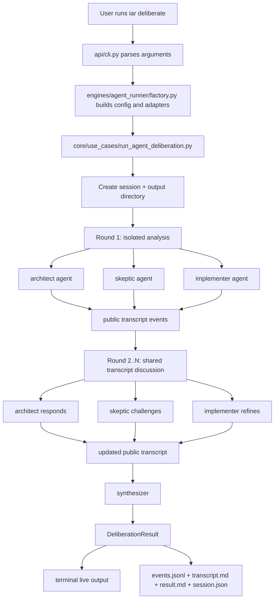

# PRD: Multi-Agent Deliberation Session

## 1. Introduction & Goals

当前 `iar` 的 Agent Runner 主要围绕 GitHub Issue 队列执行单个 agent：`run-once` / `daemon` 从 ready Issue 中选择一个 agent，在 worktree 中完成代码修改、验证和 draft PR 发布。这个路径适合执行明确任务，但不适合在编码前对一个复杂需求做多视角推演。

本 PRD 目标是在现有 `iar` CLI 中新增一个只读的多 Agent 合议能力：

- 用户输入一个自然语言需求或问题。
- 系统同时启动多个具有不同思考模式和行为风格的 agent profile。
- 第一轮所有 agent 互相隔离，只看到用户原始输入和自己的 profile 指令。
- 后续轮次共享公开 transcript，让 agent 互相质疑、反驳、补充。
- 最终由 synthesizer 汇总共识、分歧、推荐结论和后续动作。
- 终端实时输出全过程，同时写入本地文件。

重要边界：本功能不展示模型隐藏 chain-of-thought。所谓“全过程”指可审计过程，包括 prompt 阶段、公开回复、工具调用摘要、状态事件、讨论记录和最终报告。

### Measurable Objectives

- `uv run iar deliberate "需求文本"` 可以启动一次多 agent 合议会话。
- 默认启动 3 个参与 agent：`architect`、`skeptic`、`implementer`，并使用一个 synthesizer 汇总结论。
- 第一轮隔离分析的 prompt 不包含其他 agent 输出。
- 第二轮及后续讨论 prompt 包含截至上一轮的公开 transcript。
- 终端实时显示 `session_id`、`round`、`agent`、`event_type` 和 agent 公开输出。
- 每次会话默认写入 `logs/agent-runner/deliberations/<session_id>/`：
  - `events.jsonl`
  - `transcript.md`
  - `result.md`
  - `session.json`
- 第一版不允许修改目标仓库代码，不创建 commit、branch、Issue、PR 或 worktree。

## 2. Requirement Shape

| Dimension | Requirement |
|---|---|
| Actor | 开发者或需求提出者，在终端通过 `iar deliberate` 发起多 agent 合议 |
| Trigger | 用户输入一个需要多视角分析、方案评估或决策建议的问题 |
| Expected behavior | 系统创建会话 -> 并发启动多个 agent profile -> 第一轮隔离分析 -> 后续轮次共享公开 transcript 讨论 -> synthesizer 汇总结论 -> 终端实时输出并写入文件 |
| Explicit scope boundary | 只做只读分析和报告输出；不修改仓库代码；不引入数据库；不做 Web UI；不暴露隐藏 chain-of-thought |

### Confirmed Decisions

- 第一版不允许 agent 修改代码。
- “看到全过程”定义为可审计 transcript，而不是模型隐藏思维链。
- 输出形态是终端实时输出加本地文件。
- 最终结论必须落到文件中。

## 3. Repository Context And Architecture Fit

### Existing Path

当前最接近的代码路径：

- `src/backend/api/cli.py`
  - 已有 `iar` CLI 入口和子命令注册方式。
  - 适合新增 `deliberate` 子命令，只负责参数解析、DTO 转换和调用 use case。
- `src/backend/core/use_cases/run_agent_once.py`
  - 已有 agent 命令构建函数：`_build_claude_command`、`_build_kimi_command`、`_build_codex_command`。
  - 已有 `run_agent_with_prompt(...)`，但该函数用于 Issue 执行，当前命令形态允许写代码，不可直接用于只读合议执行。
- `src/backend/infrastructure/process_runner.py`
  - 已有 `SubprocessRunner` 和 Claude `stream-json` 过滤渲染器。
  - 当前 `capture_output=False` 能实时输出，但不能同时稳定写入结构化 transcript；需要扩展为事件化 streaming 输出。
- `src/backend/core/shared/interfaces/agent_runner.py`
  - 已有 `IProcessRunner` 端口。
  - 可扩展或新增更适合 agent transcript 的 streaming 端口。
- `src/backend/core/shared/models/agent_runner.py`
  - 已有 Agent Runner 配置 dataclass。
  - 可新增合议会话、profile、round、event、result 等纯数据模型。
- `src/backend/engines/agent_runner/factory.py`
  - 已作为 settings -> core config 和基础设施实现装配层。
  - 可继续负责把配置映射为 core 层可用的 deliberation config。
- `config.toml`
  - 已有 `[agent_runner]` 配置段。
  - 推荐在其下新增 `[agent_runner.deliberation]`，避免引入平行配置体系。
- `docs/guides/agent-runner.md`
  - 已是 `iar` 使用指南，应补充 `deliberate` 命令说明。

### Reuse Candidates

- 复用现有 agent 名称体系：`codex`、`claude`、`kimi`。
- 复用现有 `SubprocessRunner` 的进程启动和 Claude stream-json 解析经验。
- 复用 `factory.py` 作为 composition adapter，避免 `api/` 直接依赖 `infrastructure/`。
- 复用 `logs/` 作为本地运行输出目录；该目录已被 `.gitignore` 排除。
- 复用测试风格中的 `FakeProcessRunner` / fake client 思路，为合议 use case 提供可控 agent 输出。

### Architecture Constraints

- `src/backend/api/` 可以导入 `core/` 和 `engines/`，不得直接导入 `infrastructure/`。
- `src/backend/core/` 不得导入 `engines/`、`infrastructure/` 或 `api/`。
- `src/backend/engines/` 可以导入 `core/` 和 `infrastructure/`，承担配置映射与实现装配。
- `src/backend/infrastructure/` 不得导入 `core/`、`engines/` 或 `api/`。
- Python 文本 I/O 必须显式使用 `encoding="utf-8"`。
- 单个 Python 代码文件非空行不超过 1000 行。
- 变更代码时必须同步更新相关 `docs/`。

### Potential Redundancy Risks

- 不应把合议逻辑塞进 `run_agent_once.py`；Issue 执行和只读合议有不同生命周期、安全边界和输出模型。
- 不应复制 `_build_claude_command` / `_build_kimi_command` / `_build_codex_command` 的写权限执行语义；只读合议需要独立 command policy。
- 不应引入数据库存储会话历史；本次范围内文件输出足够。
- 不应新增前端页面；当前确认范围是终端实时输出加文件。
- 不应把“完整思考过程”表述为 chain-of-thought；只能记录可公开的审计事件和回复。

## 4. Recommendation

### Recommended Approach

推荐实现 `iar deliberate`，新增一个与 Issue Runner 并列的只读合议 use case。

1. **CLI 入口**
   - 在 `src/backend/api/cli.py` 新增 `deliberate` 子命令。
   - 支持：
     - positional `prompt`
     - `--agents claude:architect,kimi:skeptic,codex:implementer`
     - `--rounds 2`
     - `--synthesizer claude`
     - `--output logs/agent-runner/deliberations`
     - `--session-id` 可选，便于重现或测试。

2. **Core use case**
   - 新增 `src/backend/core/use_cases/run_agent_deliberation.py`。
   - 负责：
     - 构建 `DeliberationSession`
     - 执行隔离轮、讨论轮和综合轮
     - 通过抽象端口启动 agent
     - 将事件交给 `DeliberationEventSink`
     - 返回 `DeliberationResult`

3. **Core models**
   - 在 `src/backend/core/shared/models/agent_runner.py` 中新增只读合议模型，或在文件变大时拆到 `core/shared/models/agent_deliberation.py` 并保持架构检查通过。
   - 模型包括：
     - `DeliberationSession`
     - `DeliberationAgentProfile`
     - `DeliberationRound`
     - `DeliberationEvent`
     - `DeliberationResult`

4. **Streaming transcript port**
   - 当前 `IProcessRunner.run()` 可以捕获或直连 stdout，但不能同时稳定满足“实时终端输出 + 结构化文件”。
   - 推荐新增 core 端口，例如 `IAgentTranscriptRunner`：
     - 输入：agent name、prompt、cwd、event sink、read-only mode。
     - 输出：`CommandResult` 或 `AgentRunResult`。
   - `infrastructure/process_runner.py` 实现该端口，复用现有 subprocess 能力和 Claude stream-json 过滤逻辑。

5. **Read-only execution policy**
   - 合议 agent 不在目标仓库 worktree 中运行。
   - 每个 agent 在 `logs/agent-runner/deliberations/<session_id>/workspaces/<profile_id>/` 下获得独立 cwd。
   - 只向 agent 提供用户原始需求、profile 指令、公开 transcript 和必要的只读上下文文件。
   - 每次 agent 运行前后记录目标仓库 `git status --porcelain`，如目标仓库发生变化则会话失败并写入 error event。
   - prompt 必须明确禁止修改文件、提交、推送、创建 PR 或触碰真实业务数据。

6. **Output writer**
   - 新增输出 writer，负责以 UTF-8 写入：
     - `events.jsonl`：机器可读事件流。
     - `transcript.md`：按轮次和 agent 分组的人类可读讨论记录。
     - `result.md`：最终结论。
     - `session.json`：会话元数据、profile 配置、命令参数。
   - writer 属于 use case 外围依赖；core 可以通过抽象 event sink 写事件，文件 I/O 由 API 或 infrastructure 适配层完成。

7. **Configuration**
   - 在 `[agent_runner.deliberation]` 增加默认值：
     - `default_rounds = 2`
     - `default_synthesizer = "claude"`
     - `default_output_dir = "logs/agent-runner/deliberations"`
   - 在 `[agent_runner.deliberation.profiles.<profile_id>]` 定义 profile：
     - `agent = "claude"`
     - `role = "architect"`
     - `behavior_prompt = "..."`

### Why This Fits The Current Architecture

- 合议能力是新的业务编排，不是 Issue Runner 的失败恢复或发布路径，单独 use case 更清晰。
- agent CLI、进程 I/O 和文件输出属于外层实现细节，core 只依赖接口和纯模型。
- 配置继续通过 `settings.py` -> `factory.py` -> core dataclass 映射，延续现有模式。
- 不引入数据库、Web UI 或外部编排框架，符合当前仓库轻量 CLI-first 的实现风格。
- 独立事件流比直接 stdout 拼接更适合并发 agent，能同时满足实时输出和文件追溯。

### Alternatives Considered

| Option | Description | Decision |
|---|---|---|
| 复用 `run_agent_with_prompt` 直接并发启动 agent | 改动最少，但当前命令面向代码执行，Codex 使用 `workspace-write`，Claude 使用跳过权限确认 | 拒绝；不满足只读安全边界 |
| 将合议逻辑塞进 `run_agent_once.py` | 让 Issue Runner 支持一种“debate mode” | 拒绝；会混淆 Issue 执行、验证、发布和只读讨论 |
| 使用 Git worktree 隔离每个 agent | 每个 agent 一个 worktree | 拒绝；本功能不改代码，不需要分支语义，worktree 增加清理和误提交风险 |
| 引入 LangGraph/LangChain 多 agent 编排 | 使用外部框架处理多 agent 对话 | 拒绝；引入依赖和抽象成本，且当前 CLI agent 集成已通过 subprocess 管理 |
| 存入数据库并提供历史查询 API | 长期保存会话历史 | 拒绝；当前范围只要求终端实时输出和文件输出 |
| 做前端 WebSocket 页面 | 浏览器中看多 agent 讨论 | 拒绝；用户已确认第一版是终端实时输出加文件 |

## 5. Implementation Guide

本节是实现时的活文档。实现中如发现隐藏依赖、额外影响文件或更好的安全执行方式，需要先更新本 PRD 再继续。

### Core Logic

```text
User runs:
  uv run iar deliberate "需求文本" --rounds 2

CLI:
  parse args
  build DeliberationRequest
  create output session directory
  create event sink / terminal renderer
  call run_agent_deliberation use case

Use case:
  create session metadata
  write session_started event

  Round 1: isolated
    for each participant profile, concurrently:
      build isolated prompt:
        original user prompt
        profile behavior prompt
        read-only rules
      run agent through transcript runner
      record public output events
    assemble round_1 transcript

  Round 2..N: discussion
    for each participant profile, concurrently:
      build discussion prompt:
        original user prompt
        own profile behavior prompt
        public transcript through previous round
        instruction to challenge, refine, or defend positions
        read-only rules
      run agent through transcript runner
      record public output events
    append discussion transcript

  Synthesis:
    build synthesis prompt:
      original user prompt
      full public transcript
      instruction to summarize consensus, disagreements, recommendation, risks
    run synthesizer agent
    write result.md

  write session_finished event
  return DeliberationResult
```

### Change Impact Tree

```text
.
├── config.toml
│   [修改]
│   └── 新增 [agent_runner.deliberation] 与默认 profiles 配置。
│
├── src/backend/api/
│   └── cli.py
│       [修改]
│       ├── 新增 deliberate subparser。
│       ├── 解析 prompt、agents、rounds、synthesizer、output、session-id。
│       └── 调用 factory 创建 deliberation dependencies 后执行 use case。
│
├── src/backend/core/shared/interfaces/
│   └── agent_runner.py
│       [修改]
│       └── 新增 IAgentTranscriptRunner 或等价 streaming transcript 端口。
│
├── src/backend/core/shared/models/
│   ├── agent_runner.py
│   │   [修改]
│   │   └── 如文件规模仍可控，新增 DeliberationConfig 到 AppConfig。
│   └── agent_deliberation.py
│       [可选新增]
│       └── 若 agent_runner.py 过大，则放置 DeliberationSession/Profile/Round/Event/Result。
│
├── src/backend/core/use_cases/
│   └── run_agent_deliberation.py
│       [新增]
│       ├── 编排隔离轮、讨论轮、综合轮。
│       ├── 构建每阶段 prompt。
│       ├── 并发运行同一轮 agent。
│       ├── 调用 event sink 记录终端与文件输出事件。
│       └── 校验目标仓库未发生代码变更。
│
├── src/backend/engines/agent_runner/
│   └── factory.py
│       [修改]
│       ├── 映射 AgentRunnerSettings.deliberation 到 core config。
│       ├── 创建 transcript runner 实现。
│       └── 创建 deliberation output writer / event sink。
│
├── src/backend/infrastructure/
│   ├── config/settings.py
│   │   [修改]
│   │   └── 新增 AgentRunnerDeliberationSettings 与 profile settings。
│   └── process_runner.py
│       [修改]
│       ├── 实现 streaming transcript runner。
│       ├── 将 stdout/stderr 转换为 DeliberationEvent。
│       └── 保留现有 SubprocessRunner.run 行为向后兼容。
│
├── docs/guides/
│   ├── agent-runner.md
│   │   [修改]
│   │   └── 新增 deliberate 命令说明、示例、输出文件说明。
│   └── configuration.md
│       [修改]
│       └── 新增 [agent_runner.deliberation] 配置说明。
│
└── tests/
    ├── test_agent_runner_cli.py
    │   [修改]
    │   └── 覆盖 deliberate 参数解析。
    ├── test_run_agent_deliberation.py
    │   [新增]
    │   ├── 覆盖第一轮隔离 prompt。
    │   ├── 覆盖第二轮共享 transcript prompt。
    │   ├── 覆盖 result.md / transcript.md / events.jsonl 输出。
    │   └── 覆盖目标仓库变更检测。
    ├── test_process_runner.py
    │   [修改]
    │   └── 覆盖 streaming transcript runner 事件输出。
    └── test_agent_config_consistency.py
        [修改]
        └── 覆盖默认 deliberation profiles 中引用的 agent 均可运行。
```

### Flow Diagram



### Event File Shape

`events.jsonl` should contain one JSON object per event:

```json
{"session_id":"20260522-101500-example","round":1,"agent":"architect","event_type":"agent_started","message":"started isolated analysis","timestamp":"2026-05-22T10:15:00+08:00"}
{"session_id":"20260522-101500-example","round":1,"agent":"architect","event_type":"agent_output","message":"Public answer text...","timestamp":"2026-05-22T10:15:03+08:00"}
{"session_id":"20260522-101500-example","round":1,"agent":"architect","event_type":"agent_finished","message":"exit=0","timestamp":"2026-05-22T10:15:30+08:00"}
```

### Output Markdown Shape

`transcript.md`:

```markdown
# Deliberation Transcript

## Session

- Session ID: `...`
- Prompt: ...
- Agents: architect, skeptic, implementer

## Round 1: Isolated Analysis

### architect

...

### skeptic

...

## Round 2: Discussion

...
```

`result.md`:

```markdown
# Deliberation Result

## Recommendation

...

## Consensus

...

## Disagreements

...

## Risks

...

## Next Actions

...
```

### Low-Fidelity Prototype

No low-fidelity prototype is required because the confirmed scope is CLI plus files, not UI.

### ER Diagram

No ER diagram is required because this PRD does not introduce database persistence.

### Interactive Prototype Change Log

No interactive prototype files are created or modified by this PRD.

### External Validation

No external web validation was used. Repository structure and existing runner code were sufficient for this PRD.

## 6. Definition Of Done

- `iar deliberate` 可用，并能完成隔离轮、讨论轮和综合轮。
- 第一版保持只读，不修改目标仓库代码。
- 终端实时输出可审计事件和 agent 公开回复。
- `events.jsonl`、`transcript.md`、`result.md`、`session.json` 均生成成功。
- 文档说明命令、配置、安全边界和输出文件。
- 单元测试覆盖 prompt 隔离、transcript 注入、事件输出、CLI 参数解析和只读保护。
- `just test` 通过。

## 7. Acceptance Checklist

### Architecture Acceptance

- [ ] `src/backend/api/cli.py` 只负责解析 `deliberate` 参数、构建 request、调用 use case，不直接导入 `backend.infrastructure.*`。
- [ ] `src/backend/core/use_cases/run_agent_deliberation.py` 不导入 `backend.engines.*`、`backend.infrastructure.*` 或 `backend.api.*`。
- [ ] agent subprocess 执行通过 core 层接口完成，不在 core 中直接调用 `subprocess`。
- [ ] 合议流程不复用 Issue Runner 的 worktree、commit、publish 或 GitHub label 流程。
- [ ] 新增配置仍通过 `settings.py` -> `factory.py` -> core dataclass 映射。

### Security And Read-Only Acceptance

- [ ] `iar deliberate` 不执行 `git add`、`git commit`、`git push`、`gh issue` 或 `gh pr` 命令。
- [ ] agent 的 cwd 位于 `logs/agent-runner/deliberations/<session_id>/workspaces/<profile_id>/`，不是目标仓库根目录。
- [ ] 每次 agent 运行前后检查目标仓库 `git status --porcelain`；若发生变化，会话失败并写入 error event。
- [ ] 合议 prompt 明确禁止文件修改、提交、推送、创建 PR 和触碰真实业务数据。
- [ ] 输出文件只写入配置的 deliberation output 目录，默认位于已忽略的 `logs/` 下。

### Behavior Acceptance

- [ ] `uv run iar deliberate "测试需求" --rounds 2` 能启动默认 profile 并生成完整输出。
- [ ] 第一轮每个 agent 的 prompt 只包含原始用户输入、自己的 profile 指令和只读规则。
- [ ] 第二轮及后续每个 agent 的 prompt 包含截至上一轮的公开 transcript。
- [ ] synthesizer prompt 包含完整公开 transcript，并要求输出推荐结论、共识、分歧、风险和下一步。
- [ ] 终端实时输出包含 `session_id`、`round`、`agent`、`event_type`。
- [ ] 并发 agent 输出不会互相穿插成不可读文本；终端 renderer 按事件串行显示。

### Output Acceptance

- [ ] `events.jsonl` 为 UTF-8 JSON Lines，每行包含 `session_id`、`round`、`agent`、`event_type`、`message`、`timestamp`。
- [ ] `transcript.md` 按 session、round、agent 分组展示公开讨论记录。
- [ ] `result.md` 包含 `Recommendation`、`Consensus`、`Disagreements`、`Risks`、`Next Actions`。
- [ ] `session.json` 记录原始 prompt、profile 配置、rounds、synthesizer、输出路径和开始/结束时间。
- [ ] `--output <path>` 可以覆盖默认输出根目录。

### Configuration Acceptance

- [ ] `config.toml` 支持 `[agent_runner.deliberation]`。
- [ ] 默认 profile 至少包含 `architect`、`skeptic`、`implementer`。
- [ ] 每个 profile 支持配置 `agent`、`role`、`behavior_prompt`。
- [ ] CLI `--agents claude:architect,kimi:skeptic` 可以覆盖默认参与者列表。
- [ ] `--synthesizer <agent>` 可以覆盖默认 synthesizer。

### Documentation Acceptance

- [ ] `docs/guides/agent-runner.md` 增加 `iar deliberate` 使用说明。
- [ ] `docs/guides/configuration.md` 增加 `[agent_runner.deliberation]` 配置说明。
- [ ] 文档明确说明本功能不展示隐藏 chain-of-thought，只展示可审计 transcript。
- [ ] 文档明确说明第一版只读，不会修改仓库代码。
- [ ] 如新增文档页面，`mkdocs.yml` 已同步导航。

### Validation Acceptance

- [ ] `uv run pytest tests/test_agent_runner_cli.py tests/test_run_agent_deliberation.py tests/test_process_runner.py tests/test_agent_config_consistency.py -q` 通过。
- [ ] `uv run mkdocs build --strict` 通过。
- [ ] `just test` 通过。
- [ ] 新增或修改的 Python 文本文件 I/O 均显式使用 `encoding="utf-8"`。

## 8. Functional Requirements

- **FR-1**: CLI must support `iar deliberate <prompt>`.
- **FR-2**: CLI must support `--agents`, `--rounds`, `--synthesizer`, `--output`, and optional `--session-id`.
- **FR-3**: The default participant profiles must include `architect`, `skeptic`, and `implementer`.
- **FR-4**: Round 1 must run participant agents in isolation; prompts must not include other agent outputs.
- **FR-5**: Round 2 and later must include the public transcript through the previous round.
- **FR-6**: The synthesizer must produce `result.md` with recommendation, consensus, disagreements, risks, and next actions.
- **FR-7**: The terminal must display live structured events during the session.
- **FR-8**: The system must write `events.jsonl`, `transcript.md`, `result.md`, and `session.json`.
- **FR-9**: The first version must not modify target repository code or use Issue Runner publishing operations.
- **FR-10**: The implementation must treat hidden chain-of-thought as out of scope and must not claim to expose it.
- **FR-11**: Agent profile behavior must be configurable through `config.toml`.
- **FR-12**: The system must fail the session if target repository status changes during deliberation.

## 9. Non-Goals

- 不修改代码、不生成 patch、不提交 commit、不推送分支。
- 不创建 GitHub Issue、PR、comment 或 label。
- 不接入 Issue Runner 的 `run-once` / `daemon` 队列。
- 不展示或保存模型隐藏 chain-of-thought。
- 不引入数据库、ORM 或长期历史查询 API。
- 不实现 Web UI、SSE 或 WebSocket。
- 不实现 agent 运行过程中的实时交叉输入。
- 不引入 LangChain、LangGraph 或其他多 agent 框架。
- 不自动选择“赢家”或对 agent 输出做模型评分。

## 10. Risks And Follow-Ups

| Risk | Impact | Mitigation |
|---|---|---|
| 不同 agent CLI 的输出格式差异较大 | transcript 格式可能不稳定 | 用统一 event sink 包装 stdout/stderr；Claude stream-json 继续走专门解析 |
| 多 agent 并发导致 API quota 或本机资源压力 | 会话失败或响应变慢 | 默认 3 个参与 agent；后续可增加 `--max-concurrency` |
| prompt 历史在多轮后过长 | agent 上下文溢出或输出质量下降 | 第一版限制默认 rounds=2；后续可增加 transcript 摘要策略 |
| 只读安全依赖执行策略和状态检测 | 某些 agent CLI 仍可能尝试写临时文件 | agent cwd 放在 session workspace；目标仓库 pre/post status 检测兜底 |
| profile prompt 设计过于相似 | 多 agent 输出同质化 | 默认 profile 明确区分架构、质疑、实现三个角色；允许用户配置 |

## 11. Decision Log

| ID | Decision Question | Chosen | Rejected | Rationale |
|---|---|---|---|---|
| D-01 | 第一版是否允许 agent 改代码 | 不允许改代码，只做只读合议输出 | 讨论后直接生成 patch 或 PR | 用户已确认第一版不允许改代码，且当前 runner 已有独立 Issue 执行路径 |
| D-02 | “全过程”如何定义 | 可审计 transcript：公开回复、工具摘要、事件、报告 | 隐藏 chain-of-thought | 隐藏思维链不应暴露；可审计 transcript 已满足调试和追溯需求 |
| D-03 | 输出形态 | 终端实时输出 + 本地文件 | 仅终端 / 仅文件 / Web UI | 用户已确认需要终端实时输出和文件输出 |
| D-04 | CLI 命令名称 | `iar deliberate` | 复用 `run-once` 或新增 `iar debate` | `deliberate` 更准确表达“先隔离分析、再讨论、最后综合”的完整流程 |
| D-05 | 配置位置 | `[agent_runner.deliberation]` | 顶层 `[debate]` 或独立配置文件 | 该能力属于 Agent Runner，放在现有配置树下可避免平行配置体系 |
| D-06 | agent 执行目录 | session output 下的 per-agent workspace | 目标 repo 根目录或 Git worktree | 只读合议不需要分支语义，隔离 workspace 能降低误改仓库风险 |
| D-07 | streaming 输出抽象 | 新增 transcript runner/event sink | 直接让多个 subprocess stdout 打到终端 | 并发 stdout 直接混排不可审计，也无法稳定生成 events.jsonl |
