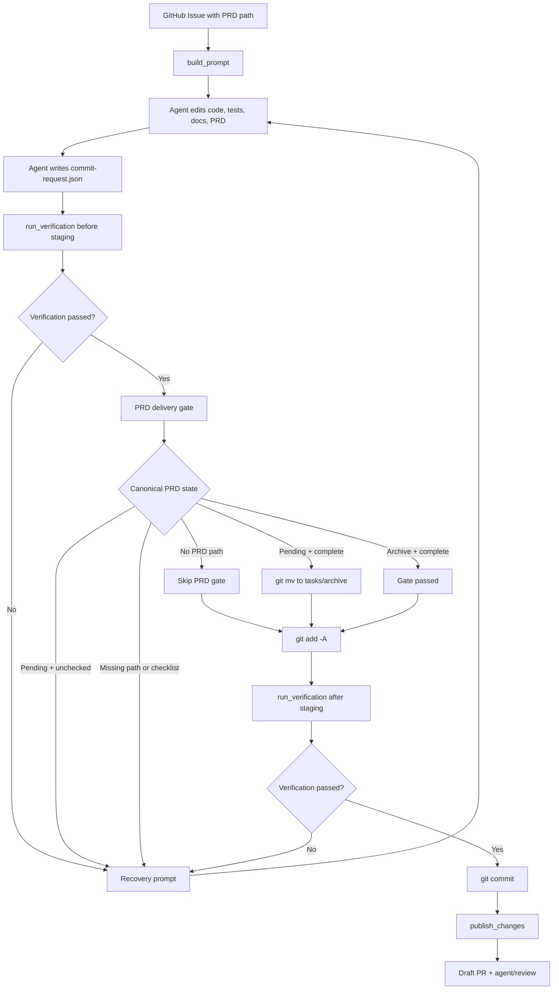

# PRD: Agent Runner PRD Archive Enforcement

- GitHub Issue: https://github.com/zata-zhangtao/keda/issues/11

- GitHub Issue: https://github.com/zata-zhangtao/keda/issues/11

## 1. Introduction & Goals

当前 PRD 驱动的 Issue 在完成后可能生成了代码 commit 和 Draft PR，但对应 PRD 仍停留在 `tasks/pending/`，没有更新 `Acceptance Checklist`，也没有归档到 `tasks/archive/`。

根因不是单点 bug，而是三层缺口叠加：

- `src/backend/core/use_cases/run_agent_once.py` 的 `build_prompt()` 只要求 agent 读取 canonical PRD，没有把"更新验收清单并归档 PRD"写成提交前协议。
- `hooks/archive_tasks.py` 只会自动移动 `tasks/` 根目录下已 staged 的 active PRD，明确排除 `tasks/pending/`，因此 pending PRD 不会被 pre-commit 自动归档。
- `hooks/check_prd_acceptance_checklist.py` 只检查 `tasks/` 根目录 active PRD 和新增进入 `tasks/archive/` 的 PRD，pending PRD 可以保留未完成项，所以 `just test` 和提交门禁不会发现"任务已完成但 PRD 仍 pending"。

本 PRD 的目标是让 Agent Runner 在 PRD-backed Issue 成功发布前，对 PRD 交付状态做机器级收口：prompt 明确要求 agent 更新和归档 PRD，runner 在提交/推送前校验 canonical PRD 的最终位置和验收清单状态，并把遗漏交回 recovery loop 修复，而不是让已完成任务继续停留在 `tasks/pending/`。

## 2. Requirement Shape

- **Actor**: Agent Runner 编排器，以及被 runner 调用的 Codex / Claude / Kimi agent。
- **Trigger**: `iar run-once` 或 `iar daemon` 处理带 `source/prd` 且 Issue body 包含 `PRD path: \`...\`` 的 Issue。
- **Expected Behavior**: 对 PRD-backed Issue，runner 成功路径必须保证 canonical PRD 不再停留在 `tasks/pending/`，并且进入 `tasks/archive/` 的 PRD 没有未勾选的 Acceptance Checklist 条目。
- **Explicit Scope Boundary**:
  - 只处理 Issue body 中已包含 canonical PRD path 的场景。
  - 只约束 runner 完成 Issue 的成功路径，不修改 `issue-from-prd` 创建 Issue 的行为。
  - 不让 runner 判断业务实现是否真的满足验收项；runner 只校验 agent 是否把 PRD 状态更新到交付完成态。
  - 不自动勾选 checklist；具体哪些条目完成仍由 agent 根据实现和验证结果更新。

## 3. Repository Context And Architecture Fit

### Current Relevant Modules

| File | Current Responsibility | Relevant Finding |
|---|---|---|
| `src/backend/core/use_cases/run_agent_once.py` | Claim ready Issue, build prompt, run agent, recover failures, commit requested changes, publish PR | 已有 `extract_prd_path()` 和 recovery loop，是最接近的扩展点 |
| `src/backend/core/shared/models/agent_runner.py` | Runner core dataclasses | 不需要新增持久状态；如需返回校验结果，可新增纯 dataclass |
| `hooks/check_prd_acceptance_checklist.py` | pre-commit PRD checklist validation | 已有 Acceptance Checklist 解析规则，但目前只服务 hook |
| `hooks/archive_tasks.py` | pre-commit 自动归档 root-level active PRD | 只处理 `tasks/*.md`，不会处理 `tasks/pending/*.md` |
| `docs/guides/agent-runner.md` | Runner 使用说明 | 需要同步说明 PRD-backed Issue 的成功收口规则 |
| `docs/ai-standards/tooling.md` | AI/工具链规范 | 已写明实现完成后将 PRD 从 pending 移到 archive，需要和 runner 行为对齐 |
| `tests/test_run_agent.py` | Runner use case tests | 覆盖 prompt、commit proxy、recovery、publish success path |
| `tests/test_prd_acceptance_checklist.py` | Hook checklist parser tests | 可迁移或复用为共享 parser 的回归测试 |

### Existing Path

最接近的现有路径是 `run_agent_until_committed()`:

1. 构建 prompt 并调用 agent。
2. 执行 `verification_commands`。
3. 如果存在未提交变更，通过 `.agent-runner/commit-request.json` 进入 `commit_requested_changes()`。
4. runner 执行 `git add -A`、验证、`git commit`。
5. `run_once()` 随后调用 `publish_changes()` 推送并创建 Draft PR。

PRD 归档必须发生在第 4 步 commit 完成前或至少在第 5 步 publish 前，否则归档 commit 不会进入已创建的 PR。

### Reuse Candidates

- 复用 `extract_prd_path(issue.body)` 提取 canonical PRD 路径。
- 复用 `run_agent_until_committed()` 的 bounded recovery loop，把 PRD 状态错误作为可恢复失败交回 agent。
- 复用 `commit_requested_changes()` 的提交代理，让 PRD 归档和代码变更进入同一个 runner-managed commit。
- 提取 hook 中 Acceptance Checklist 解析逻辑为 shared pure helper，避免 runner 和 pre-commit 使用两套正则。

### Architecture Constraints

- `run_agent_once.py` 位于 `src/backend/core/`，新增 PRD 状态判断必须保持纯业务/编排逻辑，不能直接依赖 GitHub API 或 infrastructure。
- Git 操作仍通过 `IProcessRunner` 执行，保持可测试性。
- 不新增数据库、外部服务或 GitHub Issue 状态字段；Git 文件状态仍是 source of truth。
- 不扩大 `archive_tasks.py` 的职责到 pending PRD，否则 hook 缺少 Issue 上下文，容易误伤尚未执行的 pending PRD。

### Potential Redundancy Risks

- 直接在 runner 中复制 `check_prd_acceptance_checklist.py` 的 regex 会造成两套 checklist 语义漂移。
- 只改 prompt 会继续依赖 agent 自觉执行，无法解释或阻断下一次遗漏。
- 在 `publish_changes()` 后追加归档 commit 会生成未推送的新提交，导致 Draft PR 不包含归档变更。

## 4. Recommendation

### Recommended Approach

采用"明确 prompt + 提交前 PRD delivery gate + recovery loop"：

1. 在 `build_prompt()` 和 `build_recovery_prompt()` 中显式要求：
   - 读取 canonical PRD。
   - 在请求 commit 前更新 `Acceptance Checklist`。
   - 如果所有验收项完成，将 PRD 从 `tasks/pending/` 移到 `tasks/archive/`。
2. 新增共享 PRD checklist helper，集中判断 Acceptance Checklist 是否存在、是否还有未勾选项。
3. 在 runner 提交/推送前执行 PRD delivery gate：
   - 无 PRD path: 跳过。
   - PRD path 为 `tasks/pending/<name>.md`: 若仍有未勾选项，作为可恢复失败交回 agent；若 checklist 已全勾但文件还在 pending，由 runner 执行 `git mv` 到 `tasks/archive/<name>.md`，纳入同一个 commit。
   - PRD 已在 `tasks/archive/<name>.md`: 校验 checklist 全部完成。
   - PRD 缺失、archive 目标缺失或 checklist 缺失: 作为可恢复失败处理。
4. PRD delivery gate 必须在 `publish_changes()` 前完成；成功发布到 Draft PR 的分支必须已经包含 PRD 归档变更。

### Why This Fits The Current Architecture

- 归档要求属于 runner 成功路径的交付门禁，放在 `run_agent_until_committed()` / `commit_requested_changes()` 比放在 GitHub client 或 hook 中更接近 Issue 上下文。
- recovery loop 已经能处理 verification failure 和 commit request failure；把 PRD delivery failure 接入同一机制，不需要新增状态机。
- checklist 解析是纯文本规则，适合提取为 core shared helper；hook 和 runner 都能复用，避免重复正则。
- runner 只在 checklist 已全勾时自动 `git mv`，不会替 agent 判断业务验收是否完成。

### Alternatives Considered

| Alternative | Description | Rejection Reason |
|---|---|---|
| Prompt-only fix | 只在 `build_prompt()` 中加一条归档指令 | 成本最低，但无法阻断 agent 再次遗漏；当前问题本质是缺少机器校验 |
| Broaden pre-commit hooks | 让 `check_prd_acceptance_checklist.py` 或 `archive_tasks.py` 检查/移动 `tasks/pending/` | hook 没有 Issue 上下文，会阻断尚未执行的 pending PRD，误伤正常 backlog |
| Post-publish archive commit | `publish_changes()` 后再移动 PRD 并提交 | 新 commit 不会自动进入已经 push 的 Draft PR，除非再 push 一次，流程复杂且易产生状态不一致 |
| Fully automatic checklist completion | runner 根据 Issue 或 diff 自动勾选 checklist | runner 无法可靠判断业务验收是否真实完成，容易制造虚假完成状态 |

## 5. Implementation Guide

### Core Logic

```text
Issue body contains PRD path
  -> build prompt includes explicit PRD closeout instructions
  -> agent edits code/tests/docs/PRD and writes commit request
  -> runner validates normal verification commands
  -> PRD delivery gate checks canonical PRD state
       no PRD path: skip
       pending + unchecked checklist: recover
       pending + complete checklist: git mv pending -> archive
       archive + complete checklist: pass
       missing checklist/path: recover
  -> runner git add -A
  -> runner verification after staging
  -> runner git commit
  -> publish_changes push + Draft PR
  -> Issue label becomes review
```

### Change Impact Tree

```text
.
├── src/backend/core/shared/
│   └── prd_checklist.py
│       [新增]
│       【总结】集中提供 PRD Acceptance Checklist 解析和完成态判断
│
│       ├── 提供 Acceptance Checklist section bounds 解析
│       ├── 忽略 fenced code block 中的 checkbox
│       ├── 返回 missing section、unchecked items、complete state
│       └── 供 runner 和 hook 复用，避免重复正则
│
├── src/backend/core/use_cases/
│   └── run_agent_once.py
│       [修改]
│       【总结】在 agent prompt、commit proxy 和 recovery loop 中加入 PRD delivery gate
│
│       ├── `build_prompt()` 增加 canonical PRD closeout 指令
│       ├── `build_recovery_prompt()` 保留 PRD closeout 约束
│       ├── 新增 `resolve_prd_delivery_paths()` 解析 pending/archive 对应路径
│       ├── 新增 `ensure_prd_delivery_ready()` 校验 PRD 是否可随本次提交发布
│       ├── checklist 全部完成但仍在 pending 时执行 `git mv`
│       └── PRD delivery failure 进入现有 bounded recovery loop
│
├── hooks/
│   └── check_prd_acceptance_checklist.py
│       [修改]
│       【总结】改用 core shared checklist parser，保持 hook 与 runner 判定一致
│
│       ├── 删除本文件内重复 section / checkbox parsing
│       └── 保留候选文件筛选和 pre-commit 输出格式
│
├── tests/
│   ├── test_run_agent.py
│   │   [修改]
│   │   【总结】覆盖 prompt 文本、PRD delivery gate 和 recovery 接入
│   │
│   │   ├── prompt 包含精确 canonical PRD path 和归档要求
│   │   ├── pending PRD 未完成时触发 recoverable failure
│   │   ├── pending PRD 全完成时执行 git mv 后进入 runner commit
│   │   ├── archive PRD 全完成时 gate 通过
│   │   └── 无 PRD path 时 gate 跳过
│   │
│   └── test_prd_acceptance_checklist.py
│       [修改]
│       【总结】迁移 parser 断言到 shared helper，同时保留 hook candidate 规则测试
│
│       ├── missing Acceptance Checklist 被报告
│       ├── unchecked items 只在 Acceptance Checklist section 内生效
│       ├── bilingual heading 继续支持
│       └── code fence 内 checkbox 被忽略
│
├── docs/
│   ├── guides/agent-runner.md
│   │   [修改]
│   │   【总结】说明 PRD-backed Issue 成功发布前会强制完成 PRD closeout
│   │
│   │   ├── 说明 agent 需要更新 checklist 并归档 PRD
│   │   ├── 说明 runner 会在 publish 前校验 PRD delivery state
│   │   └── 说明失败会进入 recovery loop 或标记 failed
│   │
│   └── ai-standards/tooling.md
│       [修改]
│       【总结】同步 runner 级 PRD 归档门禁与现有 pre-commit 规则的边界
│
│       ├── 明确 pending PRD 不由 pre-commit 自动归档
│       └── 明确 runner 对 PRD-backed Issue 做 publish 前收口
```

### Flow Or Architecture Diagram



### Low-Fidelity Prototype

No low-fidelity prototype required; this is a CLI/backend workflow change.

### ER Diagram

No data model changes in this PRD.

### Interactive Prototype Change Log

No interactive prototype file changes in this PRD.

### External Validation

No external validation required; repository evidence was sufficient.

## 6. Definition Of Done

- PRD-backed Issue 的 prompt 明确要求完成前更新 Acceptance Checklist 并归档 PRD。
- Runner 成功发布 Draft PR 前会校验 canonical PRD 的完成态和归档态。
- PRD delivery failure 会进入现有 recovery loop，而不是静默发布。
- checklist 解析规则由 hook 与 runner 共享。
- PRD 归档变更被包含在 publish 前的任务分支 commit 中。
- 文档同步说明 prompt、runner gate、pre-commit hook 三者边界。
- `just test` 通过。

## 7. Acceptance Checklist

### Architecture Acceptance

- [ ] `src/backend/core/use_cases/run_agent_once.py` 不直接导入 `hooks/`，而是复用 `src/backend/core/shared/prd_checklist.py` 中的纯 helper。
- [ ] `hooks/check_prd_acceptance_checklist.py` 使用同一套 checklist parser，不再维护独立重复解析逻辑。
- [ ] PRD delivery gate 只通过 `IProcessRunner` 执行 Git 操作，不直接依赖 GitHub client 或 infrastructure。
- [ ] `archive_tasks.py` 的 root-level active PRD 归档职责保持不变，不扩大到 `tasks/pending/`。

### Behavior Acceptance

- [ ] `build_prompt()` 在 Issue body 包含 `PRD path: \`tasks/pending/example.md\`` 时，输出包含该精确路径、`Acceptance Checklist` 更新要求和 `tasks/pending/` -> `tasks/archive/` 归档要求。
- [ ] `build_recovery_prompt()` 在 recovery 中继续提醒检查 canonical PRD closeout 状态。
- [ ] 当 PRD path 缺失时，PRD delivery gate 跳过，不改变现有非 PRD Issue 行为。
- [ ] 当 `tasks/pending/<name>.md` 存在未勾选 Acceptance Checklist 条目时，runner 不执行 `publish_changes()`，而是把失败原因交回 recovery prompt。
- [ ] 当 `tasks/pending/<name>.md` 的 Acceptance Checklist 全部完成时，runner 在 `git add -A` 前执行 `git mv tasks/pending/<name>.md tasks/archive/<name>.md`。
- [ ] 当 canonical PRD 已位于 `tasks/archive/<name>.md` 且 Acceptance Checklist 全部完成时，runner gate 通过。
- [ ] 当 canonical PRD 文件不存在、archive 目标不存在或 Acceptance Checklist section 缺失时，runner 进入 recovery 或最终标记 failed。
- [ ] 成功创建 Draft PR 的分支包含 PRD checklist 更新和 archive move，不需要 publish 后追加 commit。

### Dependency Acceptance

- [ ] 新增 shared helper 只使用 Python 标准库，不引入新的第三方依赖。
- [ ] `src/backend/core/` 仍不导入 `src/backend/infrastructure/` 或 `src/backend/api/`。
- [ ] `hooks/check_prd_acceptance_checklist.py` 的导入路径在 `uv run python hooks/check_prd_acceptance_checklist.py` 下可用。

### Documentation Acceptance

- [ ] `docs/guides/agent-runner.md` 说明 PRD-backed Issue 的 runner 成功路径会强制 PRD closeout。
- [ ] `docs/ai-standards/tooling.md` 说明 pre-commit hook 与 runner PRD delivery gate 的职责边界。
- [ ] 如新增长期文档页，`mkdocs.yml` 同步加入导航；若只更新既有页面则无需新增 nav。

### Validation Acceptance

- [ ] `uv run pytest tests/test_run_agent.py tests/test_prd_acceptance_checklist.py tests/test_archive_tasks.py` 通过。
- [ ] `uv run python hooks/check_prd_acceptance_checklist.py tasks/archive/<completed-prd>.md` 能校验新归档 PRD。
- [ ] `just test` 通过。
- [ ] `uv run mkdocs build --strict` 通过。

## 8. Functional Requirements

**FR-1**: `build_prompt()` 必须在 PRD-backed Issue 中输出明确 PRD closeout 指令：更新 Acceptance Checklist，完成后将 PRD 从 `tasks/pending/` 移动到 `tasks/archive/`，并在写 commit request 前完成。

**FR-2**: `build_recovery_prompt()` 必须在 recovery 规则中保留 PRD closeout 约束，避免 agent 修复验证失败时忘记 PRD 状态。

**FR-3**: 新增 shared checklist parser，支持当前 hook 已支持的语义：英文 `Acceptance Checklist`、中文 `验收清单`、双语标题、忽略 fenced code block、只检查 Acceptance Checklist section 内 checkbox。

**FR-4**: Runner 必须在 `publish_changes()` 前执行 PRD delivery gate；gate 失败时不得推送分支或创建 Draft PR。

**FR-5**: 对 `tasks/pending/` 下的 canonical PRD，如果 Acceptance Checklist 已全部勾选，runner 必须在 staging 前将其移动到 `tasks/archive/`，使归档进入同一个任务 commit。

**FR-6**: 对 `tasks/pending/` 下的 canonical PRD，如果 Acceptance Checklist 仍有未勾选项，runner 必须把失败原因作为 recovery prompt 的上下文交回 agent；重试耗尽后 Issue 标记为 failed。

**FR-7**: 对已位于 `tasks/archive/` 的 canonical PRD，runner 必须校验 Acceptance Checklist 全部完成；否则进入 recovery/failure。

**FR-8**: 对没有 PRD path 的 Issue，runner 行为必须保持现状，不新增失败条件。

**FR-9**: 文档必须说明：prompt 是行为引导，runner gate 是成功路径门禁，pre-commit hook 是通用本地提交防线，三者不互相替代。

## 9. Non-Goals

- 不自动判断哪些业务验收项应该被勾选。
- 不修改 `iar issue-from-prd` 的 PRD 创建、Issue 创建或 `--publish-prd` 行为。
- 不把所有 `tasks/pending/` PRD 纳入 pre-commit 强制检查。
- 不新增 GitHub label、数据库表、状态文件或外部服务。
- 不改变 runner 的 Draft PR 创建策略，也不实现自动 merge。

## 10. Risks And Follow-Ups

| Risk | Impact | Mitigation |
|---|---|---|
| Agent 未勾选 checklist，runner 无法判断是否应该完成 | Runner 会进入 recovery，可能增加一次执行轮次 | Prompt 明确要求 closeout；recovery 给出具体 PRD path 和未完成项 |
| Shared parser 被 hook 导入时路径配置错误 | pre-commit hook 失败 | 增加 hook 直接调用测试，确保 `uv run python hooks/check_prd_acceptance_checklist.py` 可用 |
| Runner 自动 `git mv` 与 agent 已移动文件的状态重复 | Git 命令失败或路径不存在 | delivery gate 先检查 pending/archive 两个位置，再决定是否 `git mv` |
| 旧 Issue 引用非 `tasks/pending/` PRD | 可能不满足新 gate 假设 | 第一版只对 `tasks/pending/` 和 `tasks/archive/` 做强约束；其他路径 warning 并跳过或按实现时确认的兼容规则处理 |

## 11. Decision Log

| ID | Decision | Chosen | Rejected | Rationale |
|---|---|---|---|---|
| D-01 | 如何解决 PRD 完成后未归档 | Prompt + runner delivery gate | Prompt-only fix | Prompt-only 无法阻断遗漏，runner gate 能在 publish 前失败并进入 recovery |
| D-02 | PRD 归档发生在哪个阶段 | `publish_changes()` 前 | `publish_changes()` 后追加 commit | publish 后追加 commit 不会自然进入已创建的 Draft PR |
| D-03 | 是否扩大 pre-commit 检查 pending PRD | 不扩大，runner 使用 Issue 上下文检查 | Broad pre-commit pending scan | pending 目录包含未执行 backlog，hook 无法区分当前 Issue |
| D-04 | checklist parser 放在哪里 | `src/backend/core/shared/prd_checklist.py` | 在 runner 中复制 hook regex | shared helper 避免 hook 和 runner 使用两套完成态语义 |
| D-05 | runner 是否自动勾选 checklist | 不自动勾选 | Fully automatic checklist completion | runner 无法可靠判断业务验收是否真实完成，只能校验和移动已完成 PRD |
