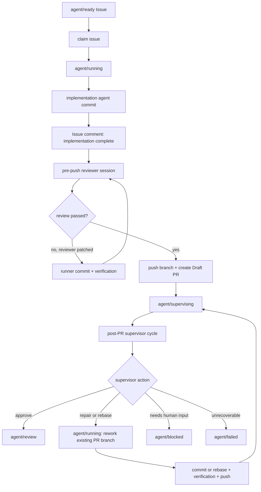
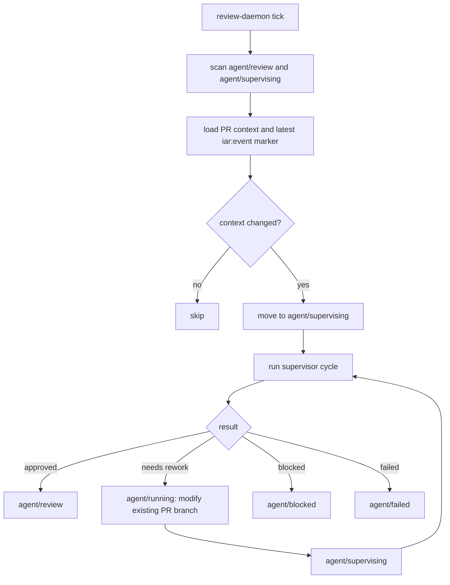

# PRD: Two-Stage Agent Review And PR Supervisor

- GitHub Issue: (pending)

## 1. Introduction & Goals

当前 `iar run-once` 的成功路径是：从 `agent/ready` 领取 Issue，切到 `agent/running`，调用执行 agent 完成代码修改，runner 验证并提交，随后直接 push 分支、创建 Draft PR，并把 Issue 切到 `agent/review`。

这个流程缺少两类审查：

- **任务内审查**：执行 agent 做完并提交后，push 之前应该有一个新的 AI session 做 code review。这个 reviewer 可以和执行 agent 相同，也可以不同；它可以直接修改代码，runner 再验证、commit，然后才发布。
- **PR 后总控审查**：Draft PR 创建后，在等待人类 review 之前，应该至少自动 review 一次，并且后续持续检查 PR 是否仍处于最新、可交付状态。它要从项目整体视角处理 main 更新、CI 状态、Issue/PR 新评论、新需求、冲突、rebase、修复和 label 流转。

本 PRD 的目标是把 Agent Runner 从“一次执行后直接交给人类”升级为“两层 AI review + 可审计 PR supervisor”的工作流，同时确保每一次状态变化都记录到 GitHub Issue。

### Measurable Objectives

- `iar run-once` 在实现 commit 后、push 前执行一次 pre-push AI code review。
- pre-push reviewer 可以在同一 worktree 中修改代码，修改必须经过 runner commit proxy、`verification_commands` 和安全检查后才能发布。
- Draft PR 创建后立即执行至少一次 post-PR supervisor review；通过后 Issue 才进入 `agent/review`。
- 新增长期状态 label `agent/supervising`，表示 PR 已创建但自动总控审查尚未完成或正在重新处理。
- 每个关键阶段都向 Issue 写入结构化 Markdown comment，并带隐藏 event marker，便于后续幂等识别。
- 后续 `iar review-daemon` 或等价轮询入口可以反复检查 `agent/review` / `agent/supervising` 的 PR，在发现新 base、新评论、新 CI 状态或新需求时重新进入 supervisor cycle。
- Post-PR supervisor 可以根据审查结果改变 Issue label，例如从 `agent/review` / `agent/supervising` 切回 `agent/running`，让 runner 在已有 PR branch 上重新修改内容、验证、提交、推送，再回到 `agent/supervising` 继续总控审查。
- `run-once` 处理 `agent/running` Issue 时必须有 guard：只有同时存在 open PR 或已知 PR branch，并且 Issue comment 中存在 supervisor 写入的 rework intent marker，才能走已有 PR branch rework 路径；否则必须跳过，避免抢占正在首次实现的任务。

## 2. Requirement Shape

| Dimension | Requirement |
|---|---|
| Actor | 本地 Agent Runner、执行 agent、pre-push reviewer、post-PR supervisor、人类 reviewer |
| Trigger | `iar run-once` 完成实现 commit；Draft PR 创建；后续 PR/Issue/base branch/check 状态发生变化 |
| Expected behavior | 实现 commit 后先做可修改代码的 pre-push review；PR 创建后进入 post-PR supervisor；自动审查通过后才进入等待人类 review；所有状态变化记录到 Issue |
| Explicit scope boundary | 不自动 merge PR；不绕过人类最终 review；不引入数据库；不把每个内部子步骤都做成 GitHub label；不把 post-PR rework 送回普通 `agent/ready` 流程以免重复创建 PR |

### Labels Decision

需要修改 labels，但不要为每个内部环节新增 label。

推荐新增一个 durable workflow label：

- `agent/supervising`：PR 已存在，自动 post-PR supervisor 正在审查、rebase、修复或等待本轮自动审查收口。

保留并收紧现有 label 语义：

- `agent/ready`：尚未开始的执行队列。
- `agent/running`：代码正在被修改。它既可以表示初次实现和 pre-push review，也可以表示 post-PR supervisor 要求的已有 PR branch rework；实现和文档不得把它收窄为“正在首次实现”。
- `agent/supervising`：Draft PR 已创建，但自动总控审查尚未通过或正在重新处理。
- `agent/review`：自动总控审查已通过，当前 PR 状态可交给人类 review。
- `agent/blocked`：需要人类做需求、权限、冲突或策略决策。
- `agent/failed`：自动流程失败且不能继续恢复。

pre-push review 的开始、结果、修复 commit、post-PR 每轮总结、rebase、冲突处理、需求分类等细粒度信息写入 Issue comment，不额外变成 labels。Post-PR supervisor 需要实际修改代码时，可以临时把 Issue 切回 `agent/running`；这表示“代码正在被修改”，不是重新进入普通 `agent/ready` 队列。`run-once` 只有在确认 open PR/branch 和 rework intent marker 都存在时，才可以把 `agent/running` 解释为已有 PR branch rework。

## 3. Repository Context And Architecture Fit

### Current Relevant Modules

| File | Current Responsibility | Relevant Finding |
|---|---|---|
| `src/backend/core/use_cases/run_agent_once.py` | 领取 ready Issue、运行 agent、验证、commit、push、创建 Draft PR、切 label | 最接近的扩展点；当前 commit 后直接 publish，需要插入 pre-push review 和 post-PR supervisor |
| `src/backend/core/shared/models/agent_runner.py` | Runner 配置、labels、命令结果、Issue summary | 需要扩展 label config 和 review/supervisor 相关纯 dataclass |
| `src/backend/core/shared/interfaces/agent_runner.py` | GitHub client 与 process runner 端口 | 需要扩展 PR 查询、Issue/PR comments、checks/base/head 状态读取能力 |
| `src/backend/infrastructure/github_client.py` | GitHub CLI 适配器 | 需要通过 `gh` 实现新增 GitHub 端口，并继续使用 UTF-8 临时文件写 comment |
| `src/backend/infrastructure/config/settings.py` | `config.toml` 到 settings 的映射 | 需要新增 `agent_runner.labels.supervising` 和 review/supervisor 配置 |
| `src/backend/engines/agent_runner/factory.py` | settings 到 core config 的装配 | 需要映射新增 label 和 review 配置，不让 API 直接依赖 infrastructure |
| `src/backend/api/cli.py` | `iar` CLI 子命令入口 | 需要新增或扩展 review daemon / review once 入口，保持 CLI 只做参数解析 |
| `docs/guides/agent-runner.md` | Agent Runner 使用说明 | 需要更新状态流转、labels、pre-push review、post-PR supervisor 和 Issue comment 事件 |
| `docs/guides/review-workflow.md` | 项目 review 目标与输出契约 | post-PR supervisor 应复用这里的 review 视角和 verdict 规则 |
| `tests/test_run_agent.py` | runner 成功/失败/恢复行为测试 | 需要覆盖 pre-push review、supervisor 首轮、label 流转和 Issue comments |

### Existing Path

当前成功路径：

```text
list_ready_issues
  -> edit labels: ready -> running
  -> create_or_reuse_worktree
  -> run_agent_until_committed
  -> publish_changes
  -> edit labels: running -> review
  -> comment Agent Runner Result
```

目标路径：

```text
normal run_once:
  list_ready_issues
    -> edit labels: ready -> running
    -> create_or_reuse_worktree
    -> implementation agent commit
    -> pre-push review and optional repair commit
    -> publish branch and Draft PR
    -> edit labels: running -> supervising
    -> post-PR supervisor cycle
    -> edit labels: supervising -> review

rework run_once:
  list_running_issues_with_rework_intent
    -> guard: open PR or known branch exists
    -> guard: latest iar:event includes post_pr_rework_requested
    -> reuse existing PR branch and worktree
    -> repair/rebase/conflict resolution commit
    -> verification and push
    -> edit labels: running -> supervising
    -> post-PR supervisor cycle
```

### Reuse Candidates

- 复用 `run_agent_with_prompt(...)` 和 agent command builders，但要新增 review prompt contract 和只读/可写边界。
- 复用 `commit_requested_changes(...)` 作为 reviewer 修改代码后的唯一 commit proxy。
- 复用 `run_verification(...)`，所有 reviewer/rebase/repair 产生的新 commit 前后都必须通过同一组 `verification_commands`。
- 复用 `publish_changes(...)` 的 remote 校验、push、Draft PR 创建能力，但需要让 PR 后首轮 supervisor 在 label 进入 `agent/review` 前执行。
- 复用 `docs/guides/review-workflow.md` 的 review scope，避免为 supervisor 发明另一套审查标准。

### Architecture Constraints

- `api/` 只能解析 CLI 参数和调用 use case，不写 review 业务规则。
- `core/` 只能依赖 core models、interfaces 和纯 helper，不直接导入 `infrastructure/`。
- GitHub PR 查询、comments、checks、mergeable 状态必须通过 `IGitHubClient` 端口。
- Git、agent CLI、verification 命令仍通过 `IProcessRunner`。
- Python 文本 I/O 必须显式 `encoding="utf-8"`。
- 新增文件应避免让 `run_agent_once.py` 继续膨胀；如果实现导致单文件接近 1000 非空行，应拆出 `agent_review.py` / `pr_supervisor.py` 等 core use case helper。

### Potential Redundancy Risks

- 不应新增第二套 publish 或 PR 创建逻辑；PR 复用/发布应继续围绕现有 publish 边界扩展。
- 不应把 post-PR supervisor 塞成 `run_agent_once.py` 内部无限循环；持续观察应由单独 `review-once` / `review-daemon` 有限轮询完成。
- 不应用本地状态文件作为唯一 cursor；Issue comments 中的 hidden marker 应作为可审计 source of truth，避免多机 runner 状态丢失。
- 不应把 post-PR 的自动 rework 重新送回普通 `agent/ready`，否则容易重复创建 PR 或污染初始执行队列。
- 不应把所有 `agent/running` Issue 都当作 rework 候选；没有 open PR/branch 和 supervisor rework intent marker 的 `agent/running` Issue 可能正在被另一个 runner 首次执行，必须跳过。

## 4. Recommendation

### Recommended Approach

采用“两阶段 review + 一个新增 label + Issue comment 事件账本”的目标态。

#### Stage 1: Pre-Push Review

Pre-push review 发生在实现 commit 之后、push 之前，仍属于 `agent/running`。

Runner 行为：

1. 实现 agent 完成修改并通过 runner commit proxy 产生 implementation commit。
2. Runner 写 Issue comment：`Implementation Complete`，记录 agent、branch、head、 verification summary 和实现总结。
3. Runner 构建 review packet：
   - Issue body
   - canonical PRD 内容和路径
   - `AGENTS.md` 摘要
   - `docs/ai-standards/` 相关标准
   - `docs/guides/review-workflow.md`
   - `git diff <base>...HEAD`
   - changed paths
   - verification results
4. 打开新的 AI session 执行 pre-push review。
5. Reviewer 可以直接修改 worktree；如果产生修改，必须写 `.agent-runner/commit-request.json`，由 runner commit。
6. Runner 对 reviewer 修改后的结果重新执行 `verification_commands`。
7. Runner 写 Issue comment：`Pre-Push Review Result`，记录 verdict、findings、是否产生 repair commit、最终 head。
8. Pre-push review 通过后才调用 `publish_changes(...)`。

Pre-push reviewer 可以与 implementation agent 相同，也可以不同。配置允许：

```toml
[agent_runner.pre_push_review]
enabled = true
review_agent = "auto"
allow_same_agent = true
max_attempts = 2
```

#### Stage 2: Post-PR Supervisor

Post-PR supervisor 发生在 Draft PR 创建后，且至少立即执行一次。它不只是 code review，而是从项目整体角度决定 PR 是否仍可交付。

Runner 行为：

1. `publish_changes(...)` 成功后，Issue label 从 `agent/running` 切到 `agent/supervising`，暂不进入 `agent/review`。
2. Runner 写 Issue comment：`Draft PR Created`。
3. 立即运行一次 supervisor cycle。
4. Supervisor 收集：
   - Issue body、canonical PRD、PR URL、branch、head/base SHA
   - PR diff 和 changed paths
   - latest Issue comments
   - latest PR comments/review comments
   - base branch remote head
   - CI/check 状态
   - review workflow 和仓库 AI standards
5. Supervisor 输出结构化 action：
   - `approve_for_human_review`
   - `repair_pr_branch`
   - `rebase_pr_branch`
   - `resolve_conflict`
   - `request_human_input`
   - `mark_failed`
6. Runner 根据 action 执行有限动作：
   - 通过：切 `agent/supervising -> agent/review`。
   - 需要修复：切 `agent/supervising -> agent/running`，在已有 PR branch 上调用可写 repair prompt，commit、验证、push，再切回 `agent/supervising` 并重新 supervisor cycle。
   - 需要 rebase：切 `agent/supervising -> agent/running`，执行 fetch/rebase，必要时调用 agent 解决冲突，验证后使用 `--force-with-lease` push，再切回 `agent/supervising` 并重新 supervisor cycle。
   - 需要人类输入：切到 `agent/blocked`，保留原因。
   - 不可恢复失败：切到 `agent/failed`。

持续观察由新增入口负责：

```bash
uv run iar review-once [--repo]
uv run iar review-daemon [--repo] [--interval 600]
```

`review-once` / `review-daemon` 扫描 `agent/review` 和 `agent/supervising` 的 open Issues/PRs，通过 Issue comment event marker 判断是否需要重新处理。发现以下变化时先进入 `agent/supervising` 做总控判断；如果判断结果要求修改代码，则再切到 `agent/running` 做已有 PR branch rework：

- PR head SHA 变化。
- base branch remote head 变化。
- CI/check 状态从 pending 变成 failed 或从 failed 变成 passed。
- Issue 或 PR 出现新的人类评论。
- PR mergeability / conflict 状态变化。

#### Issue Comment Event Contract

每个关键状态变化必须写 Issue comment，并带隐藏 marker：

```markdown
<!-- iar:event version=1 phase=pre_push_review cycle=1 head=abc123 base=def456 -->

## Agent Runner Pre-Push Review

- Verdict: changes requested
- Reviewer: codex
- Head Before: `abc123`
- Head After: `789abc`
- Verification: passed
- Findings: 1 high, 2 medium
- Action: reviewer patched and runner committed follow-up changes
```

Marker 是幂等 cursor，不依赖本地状态文件。可读正文用于人类审计。

### Why This Fits The Current Architecture

- Stage 1 复用现有 agent execution、verification 和 commit proxy，不需要新增发布路径。
- Stage 2 是 PR 存在后的长期控制循环，单独 use case 比塞进 `run-once` 更清楚。
- 新增一个 `agent/supervising` label 足以表达 durable queue state；细节事件放 Issue comment，减少 label 爆炸。
- GitHub 状态读取通过接口扩展，保持 core/infrastructure 边界。
- Issue comment marker 同时满足审计、幂等和多机 runner cursor，不需要数据库。

### Alternatives Considered

| Alternative | Description | Decision |
|---|---|---|
| 只增强执行 agent prompt | 要求执行 agent 完成后自查 | 拒绝；这是分内自查，不是独立 review，也不能提供 runner-level gate |
| Pre-push review 只读不修改 | reviewer 只输出 findings，由原执行 agent 修 | 拒绝；用户明确希望第一层 review 后可以直接修改并 commit |
| Post-PR supervisor 复用普通 `agent/ready` | 有新需求或 main 更新时把 Issue 打回 ready | 拒绝；会和已有 PR/branch 生命周期冲突，容易重复创建 PR |
| 为每个环节新增 label | 如 `agent/pre-review`、`review/stale`、`review/rebase`、`review/repairing` | 拒绝；GitHub labels 会变成过细执行日志，难维护；Issue comment 更适合记录细节 |
| 本地 JSON state 作为唯一 cursor | 在 logs 或 `.agent-runner/` 记录 review 状态 | 拒绝作为唯一来源；多机 runner 和 GitHub 审计需要以 Issue comments 为准 |
| 引入数据库存储 supervisor 状态 | 用表记录 PR review loop | 拒绝；当前 CLI-first 架构没有数据库队列需求，GitHub Issue/PR 已是状态来源 |

## 5. Implementation Guide

This section is a living implementation guide based on current repository analysis. If implementation discovers additional affected files, hidden dependencies, edge cases, or a better path, update this PRD before proceeding.

### Core Logic

```text
run_once:
  issue = list_ready_issues(...) or guarded_running_rework_issue(...)

  if issue has ready:
    labels: ready -> running
    comment: Agent Runner Claimed
    worktree = create_or_reuse_worktree(...)
    implementation_result = run_agent_until_committed(...)
    comment: Implementation Complete

  if issue has running:
    require open PR or known PR branch
    require latest iar:event phase=post_pr_rework_requested
    reuse existing PR branch and worktree
    repair_or_rebase_result = run_pr_branch_rework_until_committed(...)
    comment: PR Branch Rework Complete

  pre_push_review_result = run_pre_push_review_until_passed(...)
    reviewer session starts fresh
    reviewer may edit files
    if edits exist:
      runner reads commit request
      runner validates safe paths
      runner runs verification
      runner commits reviewer repair
    repeat until pass or max attempts
  comment: Pre-Push Review Result

  branch, pr_url = publish_changes(...)
  labels: running -> supervising
  comment: Draft PR Created

  supervisor_result = run_post_pr_supervisor_cycle(...)
    collect PR/Issue/base/check context
    decide action
    if repair/rebase:
      labels: supervising -> running
      execute bounded repair/rebase on existing PR branch
      verify, commit/push as needed
      labels: running -> supervising
      repeat cycle
    if pass:
      labels: supervising -> review
    if needs human:
      labels: supervising -> blocked
    if failure:
      labels: supervising -> failed
  comment: Post-PR Supervisor Result
```

```text
review_once:
  candidates = list_open_issues_with_any_label(supervising, review)
  for each candidate:
    pr_context = load linked PR context
    last_event = parse latest iar:event marker from Issue comments
    if no prior supervisor event or context changed:
      labels: review -> supervising
      run_post_pr_supervisor_cycle(...)
    if supervisor requires code changes:
      write iar:event phase=post_pr_rework_requested with PR branch/head
      labels: supervising -> running
```

### Change Impact Tree

```text
Core
├── src/backend/core/shared/models/agent_runner.py
│   [修改]
│   【总结】扩展 runner label、review 配置、PR context、review event 和 supervisor result 纯模型
│
│   ├── LabelConfig 新增 supervising
│   ├── 新增 PrePushReviewConfig / PostPrSupervisorConfig
│   ├── 新增 PullRequestContext / ReviewEventMarker / SupervisorActionResult
│   └── AppConfig 聚合新增 review 配置
│
├── src/backend/core/shared/interfaces/agent_runner.py
│   [修改]
│   【总结】扩展 GitHub 端口以读取 PR、comments、checks 和可监督候选 Issue
│
│   ├── 新增 list_review_candidate_issues(...)
│   ├── 新增 get_pull_request_context(...)
│   ├── 新增 list_issue_comments(...) / list_pr_comments(...)
│   └── 新增 find_open_pr_by_head(...) 或复用发布恢复 PRD 中的同名端口
│
├── src/backend/core/use_cases/run_agent_once.py
│   [修改]
│   【总结】在现有执行成功路径中插入 pre-push review、首次 post-PR supervisor gate 和 guarded running rework 入口
│
│   ├── ready Issue 继续走首次实现路径
│   ├── running Issue 只有在 open PR/branch 和 rework intent marker 同时存在时才走已有 PR branch rework
│   ├── implementation commit 后写 Implementation Complete comment
│   ├── publish 前调用 pre-push review use case
│   ├── Draft PR 创建后切到 agent/supervising
│   ├── Draft PR 后立即调用一次 supervisor cycle
│   └── 自动审查通过后才切到 agent/review
│
├── src/backend/core/use_cases/agent_review.py
│   [新增]
│   【总结】封装 pre-push review prompt、review packet、review result 解析和 bounded repair commit
│
│   ├── 构建包含 Issue、PRD、diff、验证结果和 review workflow 的 review packet
│   ├── 读取 reviewer 结构化输出和可选 commit request
│   ├── reviewer 修改后复用 commit_requested_changes(...)
│   └── 输出标准 Issue comment section
│
└── src/backend/core/use_cases/pr_supervisor.py
    [新增]
    【总结】封装 post-PR supervisor 单轮决策、rebase/repair 执行和 Issue event marker

    ├── 从 GitHub 端口收集 PR/Issue/base/check context
    ├── 解析最新 iar:event marker 作为幂等 cursor
    ├── 判定 approve/repair/rebase/conflict/blocked/failed action
    ├── 需要代码修改时先写 post_pr_rework_requested marker，再切到 agent/running
    ├── 对 repair/rebase 执行有限循环和验证
    └── 写每轮 supervisor summary comment

Engines And Infrastructure
├── src/backend/engines/agent_runner/factory.py
│   [修改]
│   【总结】把 settings 中的 label、pre-push review 和 supervisor 配置映射到 core AppConfig
│
├── src/backend/infrastructure/config/settings.py
│   [修改]
│   【总结】新增 agent_runner labels 和 review/supervisor 配置读取
│
│   ├── AgentRunnerLabelSettings 新增 supervising
│   ├── 新增 AgentRunnerPrePushReviewSettings
│   └── 新增 AgentRunnerPostPrSupervisorSettings
│
└── src/backend/infrastructure/github_client.py
    [修改]
    【总结】通过 gh CLI 实现 PR context、comments、checks 和 review candidate 查询

    ├── labels sync 创建 agent/supervising
    ├── 读取 linked PR 或按 branch/head 查询 open PR
    ├── 读取 Issue/PR comments 用于 event cursor
    └── 读取 PR head/base/check/mergeable 状态

API
└── src/backend/api/cli.py
    [修改]
    【总结】新增 review-once 和 review-daemon 入口，并暴露相关配置参数

    ├── `iar review-once [--repo]`
    ├── `iar review-daemon [--repo] [--interval 600]`
    └── 保持 run-once 参数兼容

Configuration
├── config.toml
│   [修改]
│   【总结】新增 supervising label 和 review/supervisor 默认配置
│
│   ├── [agent_runner.labels] 新增 supervising = "agent/supervising"
│   ├── 新增 [agent_runner.pre_push_review]
│   └── 新增 [agent_runner.post_pr_supervisor]
│
└── docs/guides/agent-runner.md
    [修改]
    【总结】更新 Agent Runner 状态流转、labels、两层 review、review daemon 和 Issue event 说明

Tests
├── tests/test_run_agent.py
│   [修改]
│   【总结】覆盖 run-once 的 pre-push review、首次 supervisor gate 和 label/comment 顺序
│
├── tests/test_agent_review.py
│   [新增]
│   【总结】覆盖 pre-push review packet、reviewer repair commit、失败重试和 comment 输出
│
├── tests/test_pr_supervisor.py
│   [新增]
│   【总结】覆盖 supervisor action、event cursor、rebase/repair/blocked/failed label 流转
│
└── tests/test_agent_config_consistency.py
    [修改]
    【总结】确保 core/infrastructure/settings 中的 label 和 agent routing 配置保持一致
```

### Flow Diagram



### Supervisor Recheck Diagram



### Realistic Validation Plan

| Behavior | Real Entry Point | Test Layer | Mock Boundary | Data/Env Needed | Command Or Procedure | Required For Acceptance |
|---|---|---|---|---|---|---|
| run-once performs pre-push review before publish | `uv run iar run-once --repo <fixture>` via CLI or use case test | integration-style unit with fake GitHub/process runners | Mock GitHub CLI and agent CLI; keep runner orchestration real | Fake Issue with PRD path, fake worktree commands, fake review output | `uv run pytest tests/test_run_agent.py tests/test_agent_review.py -q` | Yes |
| pre-push reviewer can patch and runner commits repair | core use case | unit | Mock process runner command outputs | Fake dirty worktree and commit request | `uv run pytest tests/test_agent_review.py -q` | Yes |
| Draft PR enters supervising before human review | `run_once(...)` | unit | Fake GitHub client records label calls | Fake publish success and supervisor approve | `uv run pytest tests/test_run_agent.py -q` | Yes |
| post-PR supervisor immediately runs once after PR creation | `run_once(...)` | unit | Fake PR context and supervisor action | Fake PR URL/head/base/check state | `uv run pytest tests/test_run_agent.py tests/test_pr_supervisor.py -q` | Yes |
| review-once rechecks changed PR context | `uv run iar review-once --repo <fixture>` parser + use case | integration-style unit | Mock GitHub/process runners | Candidate Issue with prior event marker and changed base SHA | `uv run pytest tests/test_pr_supervisor.py tests/test_agent_runner_cli.py -q` | Yes |
| automated rebase keeps an existing PR branch current safely | post-PR supervisor rework path | unit | Mock GitHub PR context and process runner git commands | Candidate PR with stale base SHA, expected PR branch/head, optional conflict output, and configured verification commands | `uv run pytest tests/test_pr_supervisor.py -q` with assertions for fetch base, no base-branch push, verification after conflict resolution, and `--force-with-lease` only on the PR branch | Yes |
| running rework guard prevents task theft | `run_once(...)` | unit | Fake GitHub client and process runner | `agent/running` Issue with and without open PR/branch plus `post_pr_rework_requested` marker | `uv run pytest tests/test_run_agent.py tests/test_pr_supervisor.py -q` | Yes |
| labels sync creates supervising label | `uv run iar labels sync` use case/infrastructure tests | unit | Fake process runner for gh commands | Default LabelConfig | `uv run pytest tests/test_sync_labels.py tests/test_agent_config_consistency.py -q` | Yes |
| docs and MkDocs reflect new workflow | docs build | docs validation | No external services | Updated `docs/guides/agent-runner.md` and mkdocs nav if needed | `uv run mkdocs build --strict` | Yes |
| full repo remains healthy | repository command | regression | Normal project mocks | Local dev environment | `just test` | Yes |

Live GitHub validation should be opt-in only. If implemented, it should require explicit environment variables such as `IAR_LIVE_GITHUB_REVIEW_TEST=1` and a sandbox repository. Live validation is not required for default acceptance because existing tests can mock GitHub CLI boundaries.

### Low-Fidelity Prototype

No low-fidelity prototype required for this PRD. This is a CLI/background workflow change, not a UI layout change.

### ER Diagram

No data model changes in this PRD. The target state adds structured Issue comment markers and core dataclasses, but no database table, ORM model, or persistent local state schema.

### Interactive Prototype Change Log

No interactive prototype file changes in this PRD.

### External Validation

No external validation required; repository evidence was sufficient.

## 6. Definition Of Done

- `iar run-once` no longer publishes immediately after implementation commit; it performs pre-push review first.
- Reviewer-generated code changes are committed only through the existing runner commit proxy and pass configured verification before publish.
- Draft PR creation transitions Issue into `agent/supervising`, not directly into `agent/review`.
- A post-PR supervisor cycle runs at least once immediately after Draft PR creation.
- `agent/review` means the latest automated supervisor cycle approved the current PR context for human review.
- `iar review-once` and `iar review-daemon` can detect changed PR/Issue/base/check context and rerun supervisor cycles.
- Every stage writes an auditable Issue comment with an `iar:event` marker and human-readable summary.
- `docs/guides/agent-runner.md`, `config.toml`, tests, and label sync behavior are synchronized.
- `just test` passes after implementation.

## 7. Acceptance Checklist

### Architecture Acceptance

- [ ] `src/backend/core/use_cases/run_agent_once.py` delegates pre-push review and post-PR supervisor details to focused core helpers instead of embedding an unbounded review loop inline.
- [ ] Core code does not import `src/backend/infrastructure/`, `src/backend/engines/`, or `src/backend/api/`.
- [ ] `src/backend/api/cli.py` only parses `review-once` / `review-daemon` arguments and calls core use cases through existing factory/composition patterns.
- [ ] Post-PR continuous review is implemented as finite `review-once` / `review-daemon` polling, not as an infinite loop inside `run-once`.

### Label Acceptance

- [ ] `LabelConfig` and `AgentRunnerLabelSettings` include `supervising = "agent/supervising"`.
- [ ] `GitHubCliClient.sync_labels(...)` creates or updates `agent/supervising`.
- [ ] `docs/guides/agent-runner.md` documents the final label semantics: `ready -> running -> supervising -> review`, with `blocked` and `failed` exits, and the post-PR rework loop `review/supervising -> running -> supervising`.
- [ ] `docs/guides/agent-runner.md` defines `agent/running` as "code is being modified", covering both first implementation and existing PR branch rework.
- [ ] Pre-push review does not introduce a separate durable label; it remains inside `agent/running`.

### Behavior Acceptance

- [ ] After implementation commit, `run_once(...)` writes an Issue comment summarizing the first running-stage completion before pre-push review starts.
- [ ] Pre-push reviewer receives Issue, PRD, diff, changed files, verification results, AGENTS/AI standards context, and review workflow context.
- [ ] If pre-push reviewer modifies files, runner commits the changes through `.agent-runner/commit-request.json` and reruns `verification_commands`.
- [ ] `publish_changes(...)` is not called until pre-push review has passed or reached its configured successful terminal condition.
- [ ] After Draft PR creation, Issue labels move from `agent/running` to `agent/supervising`.
- [ ] The first post-PR supervisor cycle runs before Issue can enter `agent/review`.
- [ ] Supervisor can classify at least approve, repair, rebase, human-input-needed, and failed outcomes.
- [ ] When supervisor requires code changes, the Issue can move from `agent/review` or `agent/supervising` back to `agent/running` for rework on the existing PR branch.
- [ ] `run_once(...)` only treats an `agent/running` Issue as rework when both guard conditions pass: an open PR or known PR branch exists, and the latest relevant Issue event includes `phase=post_pr_rework_requested`.
- [ ] `run_once(...)` skips `agent/running` Issues that lack either the PR/branch guard or the rework intent marker, instead of creating a new branch or stealing an in-progress first implementation.
- [ ] Rebase/repair outcomes produce new verification evidence and Issue comments before returning to supervisor review.
- [ ] `agent/review` is only applied after supervisor approval for the current PR context.

### Issue Audit Acceptance

- [ ] Issue comments are written for claim, implementation complete, pre-push review result, Draft PR creation, each post-PR supervisor cycle, each rebase/repair action, blocked, and failed states.
- [ ] Each machine-generated Issue comment includes an `<!-- iar:event ... -->` hidden marker with phase, cycle, head SHA, and enough cursor fields to support idempotent rechecks.
- [ ] Human-readable comment body includes reviewer/supervisor name, verdict/action, summary, findings counts, verification status, and resulting head SHA when applicable.

### Documentation Acceptance

- [ ] `docs/guides/agent-runner.md` explains pre-push review, post-PR supervisor, new label, and review daemon usage.
- [ ] `config.toml` examples show `[agent_runner.pre_push_review]` and `[agent_runner.post_pr_supervisor]`.
- [ ] `docs/guides/review-workflow.md` remains the canonical review scope referenced by supervisor prompts, or is updated if the review contract changes.

### Validation Acceptance

- [ ] `uv run pytest tests/test_run_agent.py tests/test_agent_review.py tests/test_pr_supervisor.py -q` passes.
- [ ] `uv run pytest tests/test_pr_supervisor.py -q` includes dedicated rebase safety coverage for stale base detection, conflict-resolution verification, branch protection, and `--force-with-lease` usage.
- [ ] `uv run pytest tests/test_sync_labels.py tests/test_agent_config_consistency.py -q` passes.
- [ ] `uv run mkdocs build --strict` passes.
- [ ] `just test` passes.

## 8. Functional Requirements

### FR-1: Pre-Push Review Gate

After implementation agent produces at least one runner-managed commit, `run-once` must run a fresh pre-push review session before publishing the branch.

### FR-2: Pre-Push Review Packet

The review session must receive enough context to review the code against the task and repository: Issue body, PRD content when available, diff, changed paths, verification results, repository AI standards, and review workflow guidance.

### FR-3: Reviewer Repair Commit

If pre-push reviewer modifies files, the runner must process those changes through the same restricted commit proxy used for implementation agent changes.

### FR-4: Pre-Push Verification

Any reviewer repair commit must pass configured `verification_commands` before publish. A failed verification must enter a bounded repair/review loop or fail the Issue with a comment.

### FR-5: Draft PR Supervising State

After successful Draft PR creation, the Issue must move to `agent/supervising` and must not move to `agent/review` until post-PR supervisor approval.

### FR-6: Immediate Post-PR Supervisor Review

`run-once` must run at least one post-PR supervisor cycle immediately after Draft PR creation.

### FR-7: Supervisor Context

Supervisor cycles must inspect PR context, Issue context, PR/Issue comments, base branch state, checks/CI status, diff, changed paths, PRD, AI standards, and review workflow guidance when available.

### FR-8: Supervisor Actions

Supervisor result must support approve, repair PR branch, rebase PR branch, resolve conflict, request human input, and mark failed. Repair, rebase, and conflict-resolution actions may change the Issue label back to `agent/running` while modifying the existing PR branch, but the supervisor must first write a `post_pr_rework_requested` event marker with the expected PR branch/head.

### FR-9: Supervisor Recheck

`review-once` and `review-daemon` must detect changed PR context since the last `iar:event` marker and rerun supervisor when necessary.

### FR-10: Rebase Safety

Automated rebase must fetch the configured base branch, avoid pushing the base branch itself, run verification after conflict resolution, and use `--force-with-lease` only for the PR branch.

### FR-11: Label Semantics

The system must add `agent/supervising` and use labels as durable queue states only; detailed stage events must be recorded in Issue comments instead of adding many transient labels. `agent/running` means code is being modified; it may be reused after PR creation only for guarded rework on the existing PR branch, not for creating a fresh task branch.

### FR-12: Issue Audit Trail

Every state transition and review result must be written to the Issue with both a hidden machine marker and a concise human-readable summary.

### FR-13: Running Rework Guard

When `run_once` encounters an `agent/running` Issue, it must not assume the Issue is a rework task. It may enter the existing PR branch rework path only if an open PR or known PR branch exists and the latest relevant Issue event includes `phase=post_pr_rework_requested`; otherwise it must skip the Issue.

### FR-14: Human Review Boundary

The system must not auto-merge PRs. `agent/review` means the automated supervisor is satisfied and the PR is ready for human review, not that the PR is approved for merge.

## 9. Non-Goals

- No automatic PR merge.
- No database-backed queue or review state table.
- No Web UI for review status.
- No live GitHub integration test required by default.
- No attempt to expose model hidden chain-of-thought.
- No conversion of every internal review/rebase/repair step into a separate GitHub label.
- No automatic creation of new GitHub Issues for newly discovered requirements unless a human asks for that behavior in a separate task.
- No reuse of ordinary `agent/ready` for post-PR rework in the target state.
- No processing of arbitrary `agent/running` Issues as rework without both an open PR/branch guard and an explicit supervisor rework intent marker.

## 10. Risks And Follow-Ups

- **Interaction with pending publish recovery PRD**: `find_open_pr_by_head(...)` and PR reuse may be needed by both publish recovery and supervisor. Implementation should consolidate this GitHub client capability instead of adding duplicate methods.
- **Agent output parsing risk**: Review and supervisor prompts must require structured JSON or a parseable result file. Invalid output should be recoverable within bounded attempts.
- **Long-running daemon risk**: `review-daemon` must avoid busy loops by relying on event markers, interval configuration, and context-change detection.
- **Running label ambiguity risk**: `agent/running` can now mean first implementation or existing PR rework. Implementation must rely on the rework intent marker plus PR/branch guard, not label alone.
- **Force push risk**: Automated rebase requires strict branch validation and `--force-with-lease` only after verifying the branch still matches expected remote state.
- **Comment volume risk**: Every state change must be auditable, but comments should remain concise and structured to avoid overwhelming Issue history.

## 11. Decision Log

| ID | Decision | Chosen Option | Rejected Alternative | Rationale |
|---|---|---|---|---|
| D-01 | Label strategy | Add one durable label: `agent/supervising` | Add a label for every review/rebase/repair substep | Durable labels should express queue ownership/state; detailed events belong in Issue comments |
| D-02 | Pre-push review scope | Reviewer may modify code and runner commits repairs before push | Reviewer is read-only and only reports findings | User explicitly wants first-layer review to be able to fix before push |
| D-03 | Post-PR review trigger | Run one supervisor cycle immediately after Draft PR creation and rerun via review daemon on context changes | Wait for human to request AI review manually | The requirement says PR 后默认至少 review 一次，并持续检查最新状态 |
| D-04 | Post-PR rework path | Allow supervisor to move an existing PR from `agent/review` / `agent/supervising` back to `agent/running` for branch rework, then return to `agent/supervising` | Move Issue back to `agent/ready` | Returning to ready risks duplicate PR creation; `agent/running` communicates that code is actively being changed while preserving the existing PR branch lifecycle |
| D-05 | Review cursor | Use Issue comment `iar:event` markers as source of truth | Use only local JSON state | Issue comments are auditable, GitHub-native, and safer for multi-machine runners |
| D-06 | Continuous supervisor shape | Add finite `review-once` and daemon polling entry points | Put an infinite supervisor loop inside `run-once` | `run-once` should remain bounded; long-running observation belongs to daemon-style commands |
| D-07 | Running rework guard | Require both open PR/known branch and `post_pr_rework_requested` marker before `run_once` treats `agent/running` as rework | Treat every `agent/running` Issue with a branch as rework | Label alone is ambiguous and could steal an in-progress first implementation from another runner |
| D-08 | Human review boundary | `agent/review` means ready for human review after automated supervisor approval | Treat AI supervisor approval as merge approval | Existing workflow still requires human review and no auto-merge |
