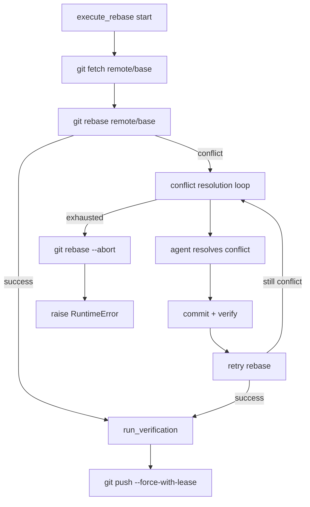
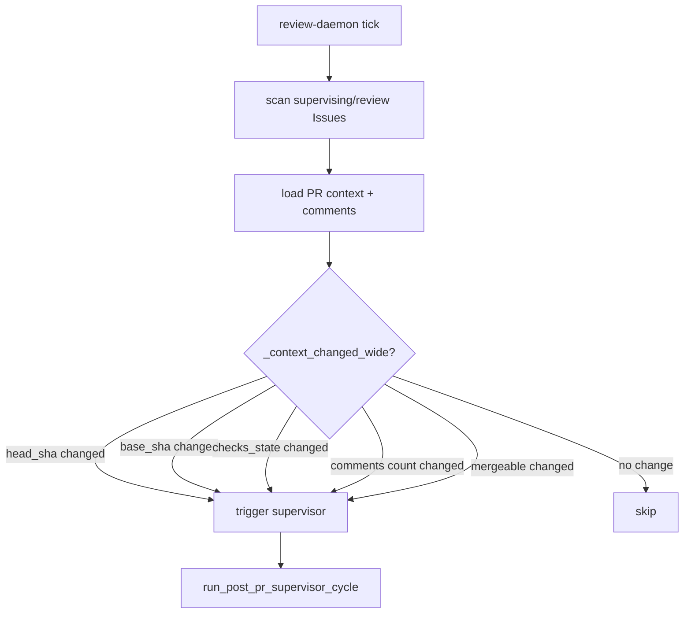

# PRD: Rebase Conflict Agent Resolution And Review Daemon Context Expansion

- GitHub Issue: (to be created)

## 1. Introduction & Goals

PRD #12 (Two-Stage Agent Review And PR Supervisor) 已归档，但其 Acceptance Checklist 有两项被标记为完成而代码未实际交付：

1. **Rebase 冲突时缺少 agent 自动解决路径**。当前 `execute_rebase` 在 `git rebase` 冲突后直接 `git rebase --abort` 并抛 `RuntimeError`，导致 Issue 进入 `agent/failed`。PRD #12 明确承诺"必要时调用 agent 解决冲突"。
2. **`review-daemon` 的 `_context_changed` 维度不足**。当前仅对比 `head_sha` 和 `base_sha`，未检测 `checks_state`、新评论、`mergeable` 状态变化，导致人类评论、CI 状态翻转、冲突状态变化无法触发重新评估。

本 PRD 目标是在最小变更前提下补全这两个缺口，复用现有的 `execute_repair` agent 调用模式、commit proxy、verification 链和 supervisor cycle，不引入新 label。

### Measurable Objectives

- `execute_rebase` 冲突时调用与 `execute_repair` 同构的 agent 解决流程，冲突解决后重新验证并通过 `--force-with-lease` push。
- `review_once` 的 `_context_changed` 增加 `checks_state`、`issue_comments_count`、`pr_comments_count`、`mergeable` 维度检测。
- `review_once` 在 context changed 时重新进入 supervisor cycle，行为与 PRD #12 承诺一致。
- `just test` 通过后归档本 PRD。

## 2. Requirement Shape

| Dimension | Requirement |
|---|---|
| Actor | 本地 Agent Runner、post-PR supervisor、repair/rebase agent、人类 reviewer |
| Trigger | `execute_rebase` 遇到冲突；`review-daemon` 轮询检测到 PR/Issue/base/check/comment 上下文变化 |
| Expected behavior | Rebase 冲突由 agent 解决并重新验证后安全 push；review 轮询在更多维度变化时自动触发 supervisor 重新评估 |
| Explicit scope boundary | 不新增 label；不修改 pre-push review 逻辑；不改变 run-once 首次实现路径；不引入数据库存储 |

## 3. Repository Context And Architecture Fit

### Current Relevant Modules

| File | Current Responsibility | Relevant Finding |
|---|---|---|
| `src/backend/core/use_cases/pr_supervisor.py` | Post-PR supervisor prompt、action 解析、rebase/repair 执行 | `execute_rebase` 缺少冲突解决 agent 调用；已有 `execute_repair` 模式可直接复用 |
| `src/backend/core/use_cases/review_once.py` | 扫描 `supervising`/`review` Issues，判断 context 是否变化，触发 supervisor | `_context_changed` 只比 SHA，需要扩展维度 |
| `src/backend/core/shared/models/agent_runner.py` | PullRequestContext、ReviewEventMarker 等纯模型 | `PullRequestContext` 已有 `checks_state` 和 `mergeable`，`ReviewEventMarker` 需扩展 cursor 字段 |
| `src/backend/core/shared/interfaces/agent_runner.py` | GitHub client 端口 | `list_issue_comments` / `list_pr_comments` 已存在，`_context_changed` 需复用 comment 列表长度 |
| `src/backend/infrastructure/github_client.py` | GitHub CLI 适配器 | `get_pull_request_context` 已返回 `checks_state` 和 `mergeable`，无需新增 CLI 命令 |
| `tests/test_pr_supervisor.py` | Rebase/repair/supervisor 单元测试 | 需补充冲突解决路径测试 |
| `tests/test_run_agent.py` | Runner 行为测试 | review-daemon context 扩展需确认无回归 |

### Existing Path

当前 rebase 成功路径：
```text
execute_rebase:
  git fetch remote base_branch
  git rebase remote/base_branch
  if success: run_verification -> git push --force-with-lease
  if conflict: git rebase --abort -> raise RuntimeError
```

当前 review 轮询路径：
```text
review_once:
  scan supervising/review Issues
  for each candidate:
    load PR context and latest iar:event marker
    if head_sha changed or base_sha changed:
      run_post_pr_supervisor_cycle
    else: skip
```

### Reuse Candidates

- 复用 `execute_repair` 的 agent prompt 模式和 `run_agent_with_prompt(...)` 调用方式，把冲突解决视为一种特殊的"repair"。
- 复用 `.agent-runner/commit-request.json` commit proxy，冲突解决后的修改通过同一套 proxy 提交。
- 复用 `run_verification(...)`，冲突解决前后都必须通过验证。
- 复用 `review_once` 的候选 Issue 扫描和 supervisor cycle 触发结构，只扩展 `_context_changed` 判断条件。
- 复用 `ReviewEventMarker` 的 hidden marker 结构，扩展字段记录 `checks_state` 和 `mergeable`。

### Architecture Constraints

- `core/` 不可导入 `infrastructure/` 或 `engines/`。
- `review_once` 的 label 修改和 supervisor cycle 调用保持现有顺序。
- 扩展 `ReviewEventMarker` 时保持 frozen dataclass 语义，新增字段必须有默认值以兼容已有 marker。
- Python 文本 I/O 必须显式 `encoding="utf-8"`。
- 单文件非空行不超过 1000 行；`pr_supervisor.py` 当前已较长，需评估是否拆分冲突解决逻辑到独立 helper。

### Potential Redundancy Risks

- 不应为冲突解决发明新的 agent 调用协议；它应和 `execute_repair` 使用同一套"写 commit request -> runner commit -> verification"模式。
- 不应为 `_context_changed` 引入新的本地状态文件；应继续以 Issue comment marker 为唯一 cursor。
- 不应新增 `_context_changed` 维度检测的独立轮询入口；应直接在 `review_once` 内部扩展。

## 4. Recommendation

### Recommended Approach

采用"最小扩展现有路径"的策略：

1. **Rebase 冲突解决**：在 `execute_rebase` 内部，rebase 失败后不直接 abort+raise，而是进入有限的 agent 冲突解决循环（类似 `execute_repair`）。Agent 收到冲突上下文 prompt，修改文件后写 `commit-request.json`，runner 提交、验证、再尝试 rebase 或 push。最大尝试次数从 `post_pr_supervisor.max_repair_attempts` 复用。如果有限次数内仍无法解决，再 abort 并 raise。

2. **Review daemon 扩展**：扩展 `_context_changed` 为 `_context_changed_wide`，增加 `checks_state`（字符串比较）、`issue_comments_count`（整数比较）、`pr_comments_count`（整数比较）、`mergeable`（布尔比较）。扩展 `ReviewEventMarker` 增加 `checks_state`、`mergeable`、`issue_comments_count`、`pr_comments_count` 字段，均有默认值保持向后兼容。`review_once` 在加载 candidate 时先获取 comments 列表长度，再传入判断函数。

### Why This Fits

- 两个缺口都发生在已有代码路径的"判断条件"或"执行分支"内部，不需要新模块或新 CLI 入口。
- Rebase 冲突解决直接复用已有的 agent commit proxy 和 verification 链，架构边界不变。
- `_context_changed` 扩展只在 `review_once.py` 内部修改判断逻辑，不影响 `run_once` 或 `daemon`。

### Alternatives Considered

| Alternative | Description | Decision |
|---|---|---|
| 把 rebase 冲突解决抽出为独立 `execute_rebase_with_conflict_resolution` 函数 | 增加一层独立函数，但逻辑和 `execute_repair` 高度重叠 | 拒绝；直接在 `execute_rebase` 内部增加有限循环，保持调用方不变 |
| 为 `_context_changed` 引入可配置维度列表 | 让用户在 `config.toml` 决定检测哪些维度 | 拒绝；当前只有 4 个明确缺失的维度，全部补全即可，配置化增加无必要复杂度 |
| 把 review-daemon 的 comment 检测改为内容哈希而非数量 | 检测评论内容变化而非数量变化 | 拒绝；GitHub comments 不支持稳定哈希（emoji 渲染、markdown 规范化），数量变化足够触发重新评估 |

## 5. Implementation Guide

This section is a living implementation guide based on current repository analysis. If implementation discovers additional affected files, hidden dependencies, edge cases, or a better path, update this PRD before proceeding.

### Core Logic

```text
execute_rebase (extended):
  validate HEAD and branch
  git fetch remote base_branch
  git rebase remote/base_branch
  if success:
    run_verification
    git push --force-with-lease remote pr_branch
    return verification_results
  if conflict:
    for attempt in 1..max_conflict_resolution_attempts:
      run_conflict_resolution_agent(...)   # 类似 execute_repair
      if commit_request exists:
        commit and verify
      git rebase --continue 或重新 git rebase remote/base_branch
      if rebase success:
        run_verification
        git push --force-with-lease remote pr_branch
        return verification_results
    if exhausted:
      git rebase --abort
      raise RuntimeError("Rebase conflict resolution exhausted")

review_once (extended):
  candidates = list_review_candidate_issues(supervising, review)
  for each candidate:
    comments = list_issue_comments(issue.number)
    last_marker = parse_latest_event_marker(comments)
    pr_comments = list_pr_comments(pr_number)
    pr_context = get_pull_request_context(pr_branch)
    base_sha_remote = get_remote_base_sha(...)
    if _context_changed_wide(pr_context, last_marker, base_sha_remote,
                             issue_comments_count=len(comments),
                             pr_comments_count=len(pr_comments)):
      if review in labels: move to supervising
      run_post_pr_supervisor_cycle(...)
    else:
      skip
```

### Change Impact Tree

```text
Core
├── src/backend/core/shared/models/agent_runner.py
│   [修改]
│   【总结】扩展 ReviewEventMarker 纯模型，增加 checks_state、mergeable、comments_count 字段
│
│   └── ReviewEventMarker 新增可选字段：checks_state、mergeable、issue_comments_count、pr_comments_count
│
├── src/backend/core/use_cases/pr_supervisor.py
│   [修改]
│   【总结】execute_rebase 增加冲突时调用 agent 解决冲突的有限循环
│
│   ├── execute_rebase 冲突分支改为：调用 run_conflict_resolution_agent
│   ├── 新增 build_conflict_resolution_prompt：构建冲突上下文 prompt
│   ├── 复用 commit_requested_changes 或内联 commit proxy 提交 agent 修改
│   ├── 复用 run_verification 验证冲突解决后的结果
│   ├── 最大尝试次数复用 config.post_pr_supervisor.max_repair_attempts
│   └── 若冲突解决成功，继续原有 push 流程；若耗尽则 abort 并 raise
│
├── src/backend/core/use_cases/agent_runner_events.py
│   [修改]
│   【总结】parse_latest_event_marker 需解析新增字段
│
│   └── 扩展 marker 解析正则或结构化逻辑，提取新增可选字段
│
└── src/backend/core/use_cases/review_once.py
    [修改]
    【总结】扩展 _context_changed 检测维度，增加 checks_state、comments、mergeable

    ├── _context_changed 重命名为 _context_changed_wide 或原地扩展
    ├── 增加 issue_comments_count、pr_comments_count、checks_state、mergeable 比较
    ├── review_once 在调用 _context_changed 前获取 comments 列表长度
    └── 保持跳过逻辑和 label 流转不变

Tests
├── tests/test_pr_supervisor.py
│   [修改]
│   【总结】补充 rebase 冲突解决的测试覆盖
│
│   ├── test_execute_rebase_resolves_conflict_via_agent：mock 冲突后 agent 修复成功
│   ├── test_execute_rebase_conflict_exhaustion：mock 冲突后多次尝试均失败
│   └── 验证冲突解决后通过 verification 和 force-with-lease push
│
├── tests/test_run_agent.py
│   [修改/确认]
│   【总结】确认 review-daemon 扩展不破坏现有 runner 行为
│
│   └── 无新增测试需求，但需确保现有测试通过
│
└── tests/test_agent_runner_cli.py (if exists)
    [确认]
    【总结】确认 review-once CLI 入口无参数变化

Docs
└── docs/guides/agent-runner.md
    [修改]
    【总结】更新 rebase 行为描述和 review-daemon 检测维度说明
```

### Flow Diagram





### Realistic Validation Plan

| Behavior | Real Entry Point | Test Layer | Mock Boundary | Data/Env Needed | Command Or Procedure | Required For Acceptance |
|---|---|---|---|---|---|---|
| Rebase conflict resolved by agent | `execute_rebase` unit test | unit | Fake process runner with conflict then success sequence | Fake worktree, fake commit request | `uv run pytest tests/test_pr_supervisor.py -q` | Yes |
| Rebase conflict exhaustion aborts safely | `execute_rebase` unit test | unit | Fake process runner with persistent conflict | Fake worktree | `uv run pytest tests/test_pr_supervisor.py -q` | Yes |
| Review daemon detects checks_state change | `review_once` unit test | unit | Fake GitHub client returning different checks_state | Fake Issue with marker | `uv run pytest tests/test_run_agent.py -q` | Yes |
| Review daemon detects new comments | `review_once` unit test | unit | Fake GitHub client returning more comments than marker recorded | Fake Issue with marker | `uv run pytest tests/test_run_agent.py -q` | Yes |
| Full repo remains healthy | repository command | regression | Normal project mocks | Local dev environment | `just test` | Yes |

### Low-Fidelity Prototype

No low-fidelity prototype required. This is a CLI/background workflow change.

### ER Diagram

No data model changes in this PRD. `ReviewEventMarker` 是纯 dataclass 字段扩展，不涉及数据库或持久化 schema。

### Interactive Prototype Change Log

No interactive prototype file changes in this PRD.

### External Validation

No external validation required; repository evidence was sufficient.

## 6. Definition Of Done

- `execute_rebase` 在冲突时调用 agent 解决，有限次数内重试，成功则验证并 push，失败则 abort 并 raise。
- `review_once` 的 context changed 检测覆盖 `checks_state`、comments 数量、`mergeable` 变化。
- `ReviewEventMarker` 扩展字段保持向后兼容，旧 marker 无新增字段时仍能正确解析。
- `tests/test_pr_supervisor.py` 包含冲突解决成功和耗尽的测试用例。
- `docs/guides/agent-runner.md` 更新 rebase 和 review-daemon 行为描述。
- `just test` 通过后归档本 PRD。

## 7. Acceptance Checklist

### Architecture Acceptance

- [ ] `src/backend/core/use_cases/pr_supervisor.py` 的冲突解决逻辑复用现有 agent commit proxy，不引入新的提交协议。
- [ ] `src/backend/core/shared/models/agent_runner.py` 的 `ReviewEventMarker` 新增字段均有默认值，保持 frozen dataclass 语义。
- [ ] `review_once.py` 的 `_context_changed` 扩展不破坏现有 SHA-only 检测语义，新维度是增量检测。
- [ ] `core/` 未引入对 `infrastructure/` 或 `engines/` 的直接依赖。

### Behavior Acceptance

- [ ] `execute_rebase` 在 `git rebase` 返回非零时进入冲突解决循环，而非直接 abort。
- [ ] 冲突解决循环最大尝试次数由 `config.post_pr_supervisor.max_repair_attempts` 控制。
- [ ] 冲突解决成功后运行 `verification_commands` 并通过 `--force-with-lease` push。
- [ ] 冲突解决耗尽后执行 `git rebase --abort` 并 raise `RuntimeError`。
- [ ] `_context_changed_wide` 检测以下维度变化：`head_sha`、`base_sha`、`checks_state`、`issue_comments_count`、`pr_comments_count`、`mergeable`。
- [ ] 任一维度变化时，`review_once` 正常进入 supervisor cycle；无变化时 skip。
- [ ] `agent/review` 的 Issue 在 context changed 时先移回 `agent/supervising` 再运行 supervisor，行为不变。

### Documentation Acceptance

- [ ] `docs/guides/agent-runner.md` 更新 `execute_rebase` 的冲突解决行为描述。
- [ ] `docs/guides/agent-runner.md` 更新 `review-daemon` 检测维度说明，列出 checks、comments、mergeability。

### Validation Acceptance

- [ ] `uv run pytest tests/test_pr_supervisor.py -q` 包含 rebase 冲突 agent 解决的成功路径测试。
- [ ] `uv run pytest tests/test_pr_supervisor.py -q` 包含 rebase 冲突解决耗尽后安全 abort 的测试。
- [ ] `uv run pytest tests/test_run_agent.py -q` 确认 review-daemon 扩展无回归。
- [ ] `just test` 通过。

## 8. Functional Requirements

### FR-1: Rebase Conflict Agent Resolution

When `execute_rebase` encounters a non-zero exit from `git rebase`, it must not immediately abort. Instead, it must enter a bounded conflict-resolution loop where an agent is invoked to resolve the conflict, the changes are committed through the existing commit proxy, verification is re-run, and rebase is retried. The loop must not exceed `max_repair_attempts`. If the loop exhausts without success, `git rebase --abort` must run and a `RuntimeError` must be raised.

### FR-2: Conflict Resolution Prompt

The conflict-resolution prompt must include:
- The issue number and title.
- The PR branch and expected HEAD.
- The conflicted file list (from `git diff --name-only --diff-filter=U` or similar).
- The instruction to resolve conflicts and write `.agent-runner/commit-request.json`.
- The restriction to not switch branches, push, or abort the rebase.

### FR-3: Review Daemon Wide Context Detection

`review_once` must detect the following additional context changes beyond head/base SHA:
- `checks_state` string value change (e.g., `PENDING` -> `FAILURE`).
- `issue_comments_count` integer increase.
- `pr_comments_count` integer increase.
- `mergeable` boolean change (e.g., `true` -> `false` or `null` -> `true`).

### FR-4: Event Marker Backward Compatibility

`ReviewEventMarker` and `parse_latest_event_marker` must handle markers that lack the new fields (`checks_state`, `mergeable`, `issue_comments_count`, `pr_comments_count`) by treating them as `None` or default values, preserving compatibility with markers written before this change.

## 9. Non-Goals

- 不修改 pre-push review 逻辑。
- 不修改 `run_once` 首次实现路径（ready -> running -> implementation）。
- 不新增 CLI 子命令或参数。
- 不引入数据库存储或本地状态文件。
- 不为冲突解决引入新的 label（仍使用 `agent/running` 表示 rework）。
- 不为 review-daemon 引入可配置检测维度列表；四个维度全部硬编码启用。
- 不检测评论内容变化（仅检测数量变化）。

## 10. Risks And Follow-Ups

| Risk | Mitigation |
|---|---|
| `pr_supervisor.py` 文件行数接近 1000 行限制 | 若冲突解决逻辑使文件膨胀，考虑拆出 `rebase_conflict_resolution.py` helper |
| Agent 冲突解决 prompt 效果不佳 | 依赖 `max_repair_attempts` 上限，耗尽后安全 abort 并转人工 |
| `ReviewEventMarker` 新增字段导致旧解析失败 | 所有新增字段必须有默认值，parser 使用 `.get(..., default)` 模式 |
| Review-daemon 误报（如 bot 评论触发重评） | 当前仅检测数量变化，存在误报可能；如生产中出现，后续可引入评论作者过滤 |

## 11. Decision Log

| ID | Decision | Chosen | Rejected | Rationale |
|---|---|---|---|---|
| D-01 | 冲突解决执行位置 | 在 `execute_rebase` 内部增加有限循环 | 抽出独立 `execute_rebase_with_conflict_resolution` 函数 | 复用现有 `execute_rebase` 的验证和 push 流程，减少调用方改动 |
| D-02 | 冲突解决 agent 模式 | 复用 `execute_repair` 的 prompt + commit-request 模式 | 让 agent 直接调用 git 命令 | 保持 commit proxy 安全边界，agent 不直接操作 git |
| D-03 | 评论变化检测粒度 | 仅检测 comments 数量变化 | 检测评论内容哈希 | GitHub comment 渲染不稳定，数量变化足够触发重评 |
| D-04 | 新维度是否可配置 | 四个维度全部硬编码启用 | config.toml 可配置列表 | 当前只有 4 个明确缺失维度，配置化增加无必要复杂度 |
| D-05 | ReviewEventMarker 兼容性 | 新增可选字段，parser 使用默认值回退 | 迁移旧 marker | Marker 是纯 comment 文本，无法迁移；向后兼容解析即可 |
