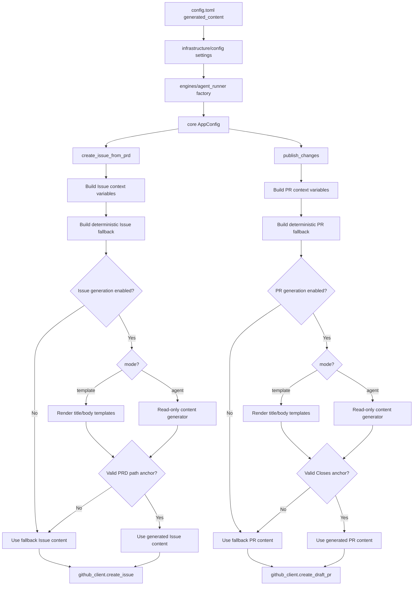

# PRD: Configurable Generated Issue And PR Content

- GitHub Issue: https://github.com/zata-zhangtao/keda/issues/19

## 1. Introduction & Goals

`iar issue-from-prd` 目前会用静态 Markdown 模板创建 GitHub Issue。`iar run-once` 在发布 draft PR 时也只写入非常简短的正文，核心内容是 `Closes #<issue-number>` 和生成器标记。这些内容对自动化流程足够可用，但对人类 Review 不够友好，因为它们没有总结需求背景、实现意图、验证重点、风险和 Reviewer 应重点关注的内容。

仓库已经存在 `[agent_runner.prompts]`，但这组配置只控制实现 Agent 收到的执行提示词，不控制 GitHub Issue 和 PR 这类面向人类阅读的产物内容。

本 PRD 的目标是为以下内容增加可配置的 generated-content 路径：

- 从本地 PRD 生成 GitHub Issue 标题和正文。
- 在 `gh pr create` 前生成 draft PR 标题和正文。
- 支持 deterministic template 和 local AI agent 两种生成模式。
- 当生成未启用、失败或输出不合法时，安全回退到现有确定性模板。

可衡量目标：

- `iar issue-from-prd` 生成的 Issue 内容可以通过 `config.toml` 配置。
- `iar run-once` 生成的 draft PR 内容可以通过 `config.toml` 配置。
- deterministic template 模式支持 PRD、Issue 和 Git 上下文变量，且使用现有 `.format()` 风格渲染。
- agent 模式支持配置本地 agent、prompt、timeout 和输出格式。
- 现有自动化依赖的机器可读锚点保持稳定。
- AI 内容生成必须是只读行为，不能修改仓库文件。
- 现有确定性行为仍可作为默认路径或回退路径使用。

## 2. Requirement Shape

- **Actor**：使用 `iar issue-from-prd` 的本地维护者，或在 Agent 实现完成后自动创建 draft PR 的 Agent Runner。
- **Trigger**：
  - 用户执行 `uv run iar issue-from-prd <prd-path>`。
  - Runner 在实现、验证、pre-push review 和本地 commit 完成后调用 `publish_changes(...)`。
- **Expected Behavior**：
  - 当配置启用时，runner 根据目标配置选择 deterministic template 或 local AI agent，生成更适合阅读的 GitHub Issue 和 draft PR 内容。
  - 生成的 Issue 正文必须保留规范 PRD 引用行格式：`- PRD path: \`<path>\``。
  - 生成的 PR 正文必须保留 `Closes #<issue-number>`，确保 GitHub Issue 关联和关闭语义继续工作。
  - 生成内容必须先经过校验，再进入 GitHub 创建流程；校验不通过时回退到确定性模板。
  - 用户可以在 `config.toml` 中调节 deterministic template、AI prompt，并分别启用或禁用不同内容目标。
- **Explicit Scope Boundary**：
  - 本功能只改变生成的 Markdown 内容，不改变 Issue 队列 label、worktree 创建、实现提示词、commit 协议、验证命令、PR supervisor 流程或 GitHub 认证方式。
  - 本功能不要求新增实时外部 LLM SDK 集成；优先复用仓库已有的本地 Agent 执行路径。
  - 本功能不新增数据库、状态文件或生成内容历史记录。

## 3. Repository Context And Architecture Fit

### Current Relevant Modules And Files

| 路径 | 当前职责 | 与本 PRD 的关系 |
|---|---|---|
| `config.toml` | 非敏感默认配置，包含 `[agent_runner.prompts]` | 增加 `[agent_runner.generated_content]` 配置示例，支持 template 和 agent 两种模式 |
| `src/backend/infrastructure/config/settings.py` | 通过 Pydantic 读取 TOML 和环境变量配置 | 增加 generated content settings，并支持 prompt/template list 合并为字符串 |
| `src/backend/core/shared/models/agent_runner.py` | core 层冻结配置和值对象 | 增加 generated content 配置、请求和结果值对象 |
| `src/backend/core/shared/interfaces/agent_runner.py` | core 层的 process、agent transcript 和 GitHub 端口 | 复用或扩展 agent transcript/content generation 端口，避免 core 导入 infrastructure |
| `src/backend/core/use_cases/create_issue_from_prd.py` | 从 PRD 构造 Issue 标题和正文，并创建 GitHub Issue | 在 `github_client.create_issue(...)` 前加入可选 AI 生成 |
| `src/backend/core/use_cases/run_agent_once.py` | 构造实现提示词、运行 Agent、验证并发布 PR | 在 `publish_changes(...)` 内加入可选 draft PR 内容生成 |
| `src/backend/core/use_cases/run_agent_deliberation.py` | 只读多 Agent 讨论和仓库 clean 检查 | 复用只读安全模式和输出提取思路 |
| `src/backend/engines/agent_runner/factory.py` | 把 settings 转成 core config，并构造具体 runner adapter | 负责接入 generated content config 和具体内容生成器 |
| `tests/test_create_issue_from_prd.py` | 覆盖 PRD 驱动的 Issue 创建行为 | 增加 generated Issue 成功、回退和锚点校验测试 |
| `tests/test_run_agent.py` | 覆盖发布行为和 prompt 生成 | 增加 generated PR 成功、回退和锚点校验测试 |
| `docs/guides/agent-runner.md` | Agent Runner 用户文档 | 记录配置、变量、回退行为和安全约束 |

### Existing Architecture Pattern To Follow

后端遵循四层依赖方向：

```text
src/backend/api/ -> src/backend/core/ -> src/backend/engines/ -> src/backend/infrastructure/
```

现有 Agent Runner 已经沿用这个模式：

- `src/backend/api/cli.py` 负责 CLI 入口。
- `src/backend/core/use_cases/` 负责业务编排。
- `src/backend/core/shared/` 负责 core 拥有的接口和冻结配置。
- 具体 settings、process runner、GitHub CLI 和 Agent runner 装配位于 core 外层。

生成内容也应沿用同一模式。core 可以决定何时生成内容以及如何校验生成内容，但具体 Agent 命令构造必须留在 core 外部，或隐藏在 core 定义的接口之后。

### Ownership And Dependency Boundaries

- `src/backend/core/use_cases/create_issue_from_prd.py` 可以接收内容生成器端口，但不能导入具体 CLI 或 LLM 实现。
- `src/backend/core/use_cases/run_agent_once.py` 可以为 PR 生成构造上下文，但不能知道内容来自 Codex、Claude、Kimi 还是未来的模型客户端。
- `src/backend/infrastructure/config/settings.py` 负责 TOML 解析形状，不负责 `PRD path` 或 `Closes #...` 这类业务锚点校验。
- `src/backend/engines/agent_runner/factory.py` 是把 settings 转换为 `AppConfig` 并实例化具体内容生成 adapter 的合适位置。
- `IGitHubClient` 仍只负责 GitHub 操作，不应新增内容生成职责。

### Runtime, Docs, Tests, And Workflow Constraints

- Python 文本文件 I/O 必须显式使用 `encoding="utf-8"`。
- 公共 Python API 需要 Google Style Docstrings。
- 配置项变化必须同步更新文档。
- 最终实现完成前必须运行 `just test`。
- PRD-backed task 必须保持 `PRD path: \`...\`` 可解析，因为 `extract_prd_path(...)`、PRD delivery gate 和 PRD 归档都依赖它。
- PR 正文必须保留 `Closes #<issue-number>`，用于 GitHub Issue 关联和关闭语义。
- AI 生成必须适合无人值守执行：不写文件、不产生 Git 变更，也不绕过 runner 的既有发布路径创建 PR。

## 4. Recommendation

### Recommended Approach

新增一组 Agent Runner generated-content 配置，并新增一个小型 core 内容生成用例，用于产出经过校验的 Issue 和 draft PR Markdown。

保留一个配置树：`[agent_runner.generated_content]`。不要再新增 `[agent_runner.content_generation]`，避免出现两个并行配置入口。

推荐配置形态：

```toml
[agent_runner.generated_content]
enabled = false
fallback = "template"
max_input_chars = 20000
default_agent = "auto"

[agent_runner.generated_content.issue_from_prd]
enabled = false
mode = "agent" # "template" or "agent"
output = "json"
title_template = "{prd_title}"
body_template = [
  "## Summary",
  "",
  "{prd_introduction}",
  "",
  "## Canonical PRD",
  "",
  "- PRD path: `{relative_prd_path}`",
  "",
  "## Acceptance Summary",
  "",
  "{acceptance_items}",
  "",
  "## Delivery Notes",
  "",
  "- Recommended branch: `task/<issue-number>-<slug>`",
  "- Worktree command: `just worktree --issue <issue-number>`",
  "- PR should include: `Closes #<issue-number>`",
]
agent = "auto"
timeout_seconds = 60
prompt = [
  "Generate a readable GitHub Issue from this PRD.",
  "Return strict JSON with keys: title, body.",
  "The body must contain this exact machine-readable line:",
  "- PRD path: `{relative_prd_path}`",
  "",
  "Issue type: {issue_type}",
  "Initial title: {title}",
  "PRD goals:",
  "{prd_goals}",
  "",
  "Acceptance items:",
  "{acceptance_items}",
  "",
  "PRD content:",
  "{prd_text}",
]

[agent_runner.generated_content.draft_pr]
enabled = false
mode = "agent" # "template" or "agent"
output = "markdown"
include_commit_log = true
include_diff_stat = true
title_template = "[Agent] {issue_title}"
body_template = [
  "Closes #{issue_number}",
  "",
  "Generated by issue-agent-runner.",
]
agent = "auto"
timeout_seconds = 60
prompt = [
  "Generate a concise, readable draft PR description.",
  "The first non-empty line must be: Closes #{issue_number}",
  "Use these sections: Summary, Validation, Risk, Reviewer Notes.",
  "",
  "Issue title: {issue_title}",
  "Issue body:",
  "{issue_body}",
  "",
  "Commit log:",
  "{commit_log}",
  "",
  "Diff stat:",
  "{diff_stat}",
]
```

默认 `enabled = false`，保持现有确定性输出。目标启用后：

- `mode = "template"`：用 `.format()` 渲染 `title_template` 和 `body_template`。
- `mode = "agent"`：用 `.format()` 渲染 `prompt`，调用本地只读 agent，解析输出。

无论使用哪种模式，只要输出不合法或生成失败，都应回退到现有确定性模板，因为 Issue/PR 创建不应该被文案生成质量阻断。

生成路径应返回结构化结果：

- Issue 目标：生成后的 `title` 和 `body`。
- PR 目标：生成后的 `title` 和 `body`；至少必须能生成 `body`，标题可回退到当前标题。
- 两类目标都应携带 metadata，用于说明最终使用的是 AI 输出还是模板回退。

实现需要包含校验层：

- Issue body 必须包含精确 PRD path 锚点。
- Issue body 不能为空。
- Issue title 不能为空，并应遵守配置或代码内的最大长度限制。
- PR body 必须包含 `Closes #<issue-number>`。
- PR body 不能为空。
- 生成内容不应包含隐藏的“运行命令”或“修改文件”类指令。

模板和 prompt 变量应由 core 统一构造，至少支持：

- Issue variables: `{issue_type}`、`{title}`、`{prd_title}`、`{relative_prd_path}`、`{acceptance_items}`、`{prd_text}`、`{prd_introduction}`、`{prd_goals}`、`{prd_requirement_shape}`、`{prd_change_impact_tree}`。
- Draft PR variables: `{issue_number}`、`{issue_title}`、`{issue_body}`、`{branch}`、`{base_branch}`、`{commit_log}`、`{commit_messages}`、`{diff_stat}`、`{git_diff_stat}`。

`{commit_messages}` 是 `{commit_log}` 的兼容别名，`{git_diff_stat}` 是 `{diff_stat}` 的兼容别名，避免后续模板作者猜测变量命名。

### Why This Is The Best Fit For Current Architecture

- 用户想要的是配置入口，这与现有 `[agent_runner.prompts]` 的使用方式一致。
- 行为落点正好位于现有 use case：`create_issue_from_prd(...)` 和 `publish_changes(...)`。
- 独立的 `generated_content` 配置避免污染 `PromptConfig`；当前 `PromptConfig` 的语义是实现 Agent 的任务提示词。
- 复用现有 `.format()` prompt 模式和只读 Agent 执行模式，避免引入新的模板引擎或 LLM SDK 依赖路径。
- 校验和回退机制可以保持当前自动化契约稳定。

### Rationale For Rejecting Redundant Abstractions

不需要新增独立的 content service，也不需要数据库驱动的模板注册表。内容只在两个已有工作流节点同步生成，持久事实仍然是 GitHub Issue/PR 内容和 canonical PRD 文件。

不需要新增 GitHub adapter。GitHub 创建仍由 `IGitHubClient` 负责；内容生成应在调用 GitHub client 前产出字符串。

不需要新增公开 CLI 命令。本 PRD 应让现有命令在配置启用时生成更好的内容。

### Alternatives Considered

| 方案 | 说明 | 不推荐原因 |
|---|---|---|
| 复用 `[agent_runner.prompts.phases]` 做 Issue/PR 生成 | 在现有 prompt config 下新增 `issue_from_prd` 和 `draft_pr` phase | 会混淆实现提示词和产物生成提示词，两者变量、校验和回退语义不同 |
| 只改进确定性模板 | 用更丰富的静态 Markdown 替换当前短模板 | 可以提升可读性，但不满足用户想要 AI 生成和可配置提示词的需求；本 PRD 改为把 template 作为一等模式保留 |
| 新增 `[agent_runner.content_generation]` 配置树 | 用另一个并列配置名表达 template/agent strategy | 拒绝；与 `[agent_runner.generated_content]` 重复，且会让同一行为有两个配置入口 |
| 直接新增 LangChain model 调用 | 使用 `create_chat_model(...)` 和 provider SDK 生成内容 | 会把 provider、凭证和模型调用复杂度带入该流程，并绕过现有本地 Agent runner 模式 |
| 让实现 Agent 在编码时写 PR body artifact | 要求实现 Agent 额外生成 PR 描述文件 | 会把实现和发布耦合在一起；真正创建 PR 的是 runner，不是实现 Agent |

## 5. Implementation Guide

本节是基于当前仓库分析形成的实时实施指南。如果实现过程中发现更多受影响文件、隐藏依赖、边界情况或更合适的路径，必须先更新本 PRD 再继续。

### Core Logic

目标控制流：

```text
issue-from-prd:
  用 encoding="utf-8" 读取 PRD
  提取确定性标题、acceptance items 和 PRD sections
  构造确定性 fallback Issue body
  if generated_content.issue_from_prd enabled:
      构造 Issue generated-content context
      if mode == "template":
          用 .format() 渲染 title_template/body_template
      if mode == "agent":
          基于配置变量构造 prompt
          运行只读 content generator
          解析 JSON title/body
      校验 PRD path 锚点和非空字段
      如果合法，使用 generated title/body
      否则使用 fallback title/body
  用最终 title/body 创建 GitHub Issue
  把 Issue link 写回 PRD

publish_changes:
  校验 branch、安全变更和配置 remote
  push branch
  按配置收集 commit_log 和 diff_stat
  构造确定性 fallback PR title/body
  if generated_content.draft_pr enabled:
      构造 draft PR generated-content context
      if mode == "template":
          用 .format() 渲染 title_template/body_template
      if mode == "agent":
          基于配置变量构造 prompt
          运行只读 content generator
          按配置解析 markdown 或 JSON
      校验 Closes 锚点和非空字段
      如果合法，使用 generated title/body
      否则使用 fallback title/body
  创建 draft PR
```

推荐 helper 边界：

- `src/backend/core/use_cases/generated_content.py`
  - 构造 Issue 和 draft PR 上下文变量。
  - 渲染 deterministic title/body templates。
  - 渲染 generated content prompt。
  - 解析 JSON/Markdown。
  - 校验必需锚点。
  - 选择 fallback。
- `src/backend/core/shared/models/agent_runner.py`
  - `GeneratedContentConfig`
  - `GeneratedContentTargetConfig`
  - `GeneratedIssueContent`
  - `GeneratedPrContent`
  - 必要的 request/result 值对象。
- `src/backend/core/shared/interfaces/agent_runner.py`
  - 如果 `IAgentTranscriptRunner` 足够窄，优先复用它。
  - 如果需要更清晰的语义，可以在 core 定义 `IContentGenerator`，由 engines 实现。
- `src/backend/engines/agent_runner/factory.py`
  - 把 TOML settings 转为 core config。
  - 提供基于现有 Agent 命令构造的只读 generator adapter。

### Change Impact Tree

```text
Config
├── config.toml
│   [修改]
│   【总结】增加 Issue 和 PR generated-content 默认配置示例。
│
│   ├── 增加 [agent_runner.generated_content]
│   ├── 增加 [agent_runner.generated_content.issue_from_prd]
│   └── 增加 [agent_runner.generated_content.draft_pr]
│
├── src/backend/infrastructure/config/settings.py
│   [修改]
│   【总结】解析 generated-content TOML 设置，并规范化 list prompt/template。
│
│   ├── 增加 generated content pydantic settings models
│   ├── 增加 repository-level override 支持
│   └── 保持 env > TOML > defaults 优先级
│
Core
├── src/backend/core/shared/models/agent_runner.py
│   [修改]
│   【总结】向 core use case 暴露冻结的 generated-content config 和结果值对象。
│
│   ├── 增加 GeneratedContentConfig
│   ├── 增加 target-specific config objects
│   └── 挂载到 AppConfig
│
├── src/backend/core/shared/interfaces/agent_runner.py
│   [修改]
│   【总结】如 IAgentTranscriptRunner 不够窄，则提供 core 拥有的只读 AI 内容生成端口。
│
│   ├── 保持 core 不依赖具体 Agent CLI
│   └── 确保 generated content 可以用 fake 测试
│
├── src/backend/core/use_cases/generated_content.py
│   [新增]
│   【总结】集中处理上下文提取、template 渲染、prompt 渲染、AI 输出解析、必需锚点校验和 fallback 行为。
│
│   ├── 构造 Issue 和 PR 变量上下文
│   ├── 渲染 Issue 和 PR title/body templates
│   ├── 渲染 Issue 和 PR generation prompts
│   ├── 解析 Issue strict JSON 输出
│   ├── 校验 `PRD path` 和 `Closes #...` 锚点
│   ├── 提取 PRD sections: introduction, goals, requirement shape, change impact tree
│   └── 返回 fallback metadata 便于观测
│
├── src/backend/core/use_cases/create_issue_from_prd.py
│   [修改]
│   【总结】可选地用校验通过的 AI 生成内容替换确定性 Issue title/body。
│
│   ├── 接收 app/generated-content config 或 generator dependency
│   ├── 先构造 fallback content
│   └── 保持 publish_prd 和 ready label 顺序
│
├── src/backend/core/use_cases/run_agent_once.py
│   [修改]
│   【总结】可选地用校验通过的 AI 生成内容替换确定性 draft PR title/body。
│
│   ├── 仅在配置模板或 prompt 需要时收集 commit log 和 diff stat
│   ├── 在 create_draft_pr 前生成 PR Markdown
│   └── 保持 push-before-PR 流程和安全检查
│
Engines
├── src/backend/engines/agent_runner/factory.py
│   [修改]
│   【总结】把 settings 映射到 AppConfig，并构造只读 content generator adapter。
│
│   ├── 合并 repository-specific generated-content overrides
│   ├── 尽量复用只读 Agent 命令行为
│   └── 保持实现细节不进入 core
│
Tests
├── tests/test_generated_content.py
│   [新增]
│   【总结】验证 generated-content context、template 渲染、AI 输出解析、锚点校验和 fallback 选择。
│
├── tests/test_agent_runner_config.py
│   [修改]
│   【总结】验证 global 和 repository-level generated-content config 加载与合并，覆盖 prompt/template list joining。
│
├── tests/test_create_issue_from_prd.py
│   [修改]
│   【总结】验证 generated Issue 成功、校验失败和 fallback 行为。
│
├── tests/test_run_agent.py
│   [修改]
│   【总结】验证 generated draft PR 成功、`Closes` 校验和 fallback 行为。
│
├── tests/conftest.py
│   [修改]
│   【总结】增加 fake content generator 或 transcript runner 响应，保证测试确定性。
│
Docs
├── docs/guides/agent-runner.md
│   [修改]
│   【总结】记录 generated-content 配置、变量、fallback 行为和安全约束。
│
├── docs/ai-standards/tooling.md
│   [修改]
│   【总结】仅当 generated content 成为长期 AI tooling 规范时更新。
│
└── mkdocs.yml
    [验证]
    【总结】预计不新增文档页；只需确认现有 Agent Runner guide 仍可发现。
```

### Flow Or Architecture Diagram



### Realistic Validation Plan

最高保真验证应通过真实 CLI use case 路径证明行为，但默认不依赖真实 GitHub 或真实 AI 凭证。

- **Generated Issue content path**：
  - 真实入口：通过 `uv run pytest tests/test_create_issue_from_prd.py -q` 覆盖 `create_issue_from_prd(...)`。
  - 可 mock 依赖：`IGitHubClient`、process runner 和 content generator。
  - 保留真实依赖：PRD 文件读写、相对路径解析、label 构造、fallback 模板构造。
  - 所需测试数据：临时 Git 仓库、`tasks/pending/` 下的 PRD 文件、template mode 配置、返回合法和非法输出的 fake generator。
  - 为什么单元级入口足够：GitHub 网络创建已经被 `IGitHubClient` 隔离；本次变化点是 GitHub 调用前的内容选择和校验。

- **Generated PR content path**：
  - 真实入口：通过 `uv run pytest tests/test_run_agent.py -q` 覆盖 `publish_changes(...)`。
  - 可 mock 依赖：`IGitHubClient`、process runner 和 content generator。
  - 保留真实依赖：branch 校验流程、remote 校验流程、传入 `create_draft_pr` 的 PR body。
  - 所需测试数据：fake issue、fake branch、fake remote list、template mode 配置、fake generator 输出、fake commit log 和 diff stat 命令输出。
  - 为什么只测低层 helper 不够：PR body 必须通过真实 `publish_changes(...)` 路径验证，因为这里同时组装 push、PR title 和 PR body。

- **Generated content helper path**：
  - 真实入口：通过 `uv run pytest tests/test_generated_content.py -q` 覆盖 `generated_content.py`。
  - 可 mock 依赖：content generator 或 transcript runner。
  - 保留真实依赖：`.format()` 渲染、JSON/Markdown 解析、锚点校验、fallback 选择。
  - 必要断言：PRD section 缺失时返回空字符串；Issue template 变量可渲染；PR template 变量可渲染；agent 输出非法时 fallback metadata 正确。

- **Configuration path**：
  - 真实入口：通过 `uv run pytest tests/test_agent_runner_config.py -q` 覆盖 `build_app_config_from_settings(...)` 和 repository merge。
  - 可 mock 依赖：除构造 settings object 外无需额外 mock。
  - 必要断言：global defaults、target enabled config、list prompt joining、list template joining、repository override merge。

- **Full regression**：
  - 命令：`just test`。
  - 目的：验证架构、lint、docs-linked tests 和现有 runner 行为不回归。

真实 GitHub 或真实 AI 验证应保持可选，并通过显式本地凭证启用。如果执行 sandbox 手工验证，必须使用非生产测试仓库，并在归档 PRD 前记录确切命令和生成的 Issue/PR URL。

### Low-Fidelity Prototype

本 PRD 不需要低保真原型。该功能改变的是 CLI 生成的 Markdown 和配置，不涉及交互 UI。

### ER Diagram

本 PRD 不涉及数据模型变更。

### Interactive Prototype Change Log

本 PRD 不修改交互原型文件。

### External Validation

本 PRD 未使用外部 Web 验证。设计依据来自当前仓库代码路径、现有 Agent Runner 架构和本地配置模式。

## 6. Definition Of Done

- `config.toml` 暴露 Issue-from-PRD 和 draft PR 内容生成配置。
- settings 能加载到 core `AppConfig`，并与现有 Agent Runner 配置一致地支持 repository-specific overrides。
- `iar issue-from-prd` 在启用后可以使用校验通过的 template 或 AI 生成 Issue title/body。
- `iar run-once` / `publish_changes(...)` 在启用后可以使用校验通过的 template 或 AI 生成 draft PR title/body。
- deterministic template 模式支持文档化的 PRD、Issue 和 Git 上下文变量。
- 现有确定性模板仍作为默认行为或 fallback 行为存在。
- 生成内容校验保留 `PRD path` 和 `Closes #...` 自动化契约。
- AI 生成是只读行为，且不会留下仓库文件变更。
- 用户文档说明配置、变量、fallback 行为和安全约束。
- 交付前 `just test` 通过。

## 7. Acceptance Checklist

### Architecture Acceptance

- [ ] `src/backend/core/use_cases/generated_content.py` 或等价 core use case 负责 prompt 渲染、解析、校验和 fallback 行为。
- [ ] `src/backend/core/use_cases/create_issue_from_prd.py` 不导入 `backend.infrastructure` 或具体 Agent CLI 代码。
- [ ] `src/backend/core/use_cases/run_agent_once.py` 不导入 `backend.infrastructure` 或具体 Agent CLI 代码。
- [ ] `src/backend/engines/agent_runner/factory.py` 仍是 settings 转换和 generated-content 具体依赖装配点。
- [ ] Generated-content config 通过 `src/backend/core/shared/models/agent_runner.py` 挂载到 `AppConfig`。
- [ ] 内容生成职责没有被加入 `IGitHubClient`。

### Configuration Acceptance

- [ ] `config.toml` 包含 `[agent_runner.generated_content]` 默认配置说明。
- [ ] `config.toml` 包含 `[agent_runner.generated_content.issue_from_prd]` 默认配置说明。
- [ ] `config.toml` 包含 `[agent_runner.generated_content.draft_pr]` 默认配置说明。
- [ ] 每个目标配置支持 `mode = "template"` 和 `mode = "agent"`。
- [ ] `title_template`、`body_template` 和 `prompt` 支持 TOML string list，并以换行符合并。
- [ ] Agent 配置支持 `agent`、`timeout_seconds` 和 `output`。
- [ ] Generated-content config 支持 `[agent_runner.repositories.<id>.generated_content]` 下的 repository-specific overrides。
- [ ] 默认 generated-content 设置在未显式启用时保持当前确定性行为。

### Behavior Acceptance

- [ ] 当 Issue generation 禁用时，`iar issue-from-prd` 生成当前确定性 Issue 内容。
- [ ] 当 Issue generation 使用 `mode = "template"` 且模板输出合法时，`github_client.create_issue(...)` 收到渲染后的 title/body。
- [ ] 当 Issue generation 使用 `mode = "agent"` 且返回合法 JSON 时，`github_client.create_issue(...)` 收到生成后的 title/body。
- [ ] Issue template 和 prompt 支持 `{issue_type}`、`{title}`、`{prd_title}`、`{relative_prd_path}`、`{acceptance_items}`、`{prd_text}`、`{prd_introduction}`、`{prd_goals}`、`{prd_requirement_shape}`、`{prd_change_impact_tree}`。
- [ ] 缺少 `- PRD path: \`<relative_prd_path>\`` 的 generated Issue body 会被拒绝，并使用 fallback Issue 内容。
- [ ] title 或 body 为空的 generated Issue 输出会被拒绝，并使用 fallback Issue 内容。
- [ ] 当 draft PR generation 禁用时，`publish_changes(...)` 生成当前确定性 PR body，且包含 `Closes #<issue_number>`。
- [ ] 当 draft PR generation 使用 `mode = "template"` 且模板输出合法时，`github_client.create_draft_pr(...)` 收到渲染后的 title/body。
- [ ] 当 draft PR generation 使用 `mode = "agent"` 且返回合法 Markdown 时，`github_client.create_draft_pr(...)` 收到生成后的 PR title/body。
- [ ] PR template 和 prompt 支持 `{issue_number}`、`{issue_title}`、`{issue_body}`、`{branch}`、`{base_branch}`、`{commit_log}`、`{commit_messages}`、`{diff_stat}`、`{git_diff_stat}`。
- [ ] `{commit_log}` / `{commit_messages}` 能输出 branch 相对 base 的 commit message 列表。
- [ ] `{diff_stat}` / `{git_diff_stat}` 能输出 branch 相对 base 的 diff stat。
- [ ] 缺少 `Closes #<issue_number>` 的 generated PR body 会被拒绝，并使用 fallback PR 内容。
- [ ] body 为空的 generated PR 输出会被拒绝，并使用 fallback PR 内容。
- [ ] 当 `fallback = "template"` 时，AI 生成失败不会阻止 Issue 创建或 PR 创建。
- [ ] Generated content 路径不会运行 `git add`、`git commit`、`git push`、`gh issue create` 或 `gh pr create`。
- [ ] Generated content 路径在生成后保持目标仓库 clean；如果生成导致 dirty worktree，应视为生成失败。

### Documentation Acceptance

- [ ] `docs/guides/agent-runner.md` 记录 generated-content 配置区块。
- [ ] `docs/guides/agent-runner.md` 明确 `[agent_runner.generated_content]` 是唯一配置入口，不新增 `[agent_runner.content_generation]`。
- [ ] `docs/guides/agent-runner.md` 说明 `mode = "template"` 与 `mode = "agent"` 的差异。
- [ ] `docs/guides/agent-runner.md` 记录 Issue generation 可用模板变量。
- [ ] `docs/guides/agent-runner.md` 记录 PR generation 可用模板变量。
- [ ] `docs/guides/agent-runner.md` 记录必需锚点：Issue 的 `PRD path` 和 PR 的 `Closes #...`。
- [ ] `docs/guides/agent-runner.md` 记录 fallback 行为和只读安全预期。
- [ ] 检查 `mkdocs.yml`；除非新增文档页，否则不需要更新导航。

### Validation Acceptance

- [ ] `uv run pytest tests/test_generated_content.py -q` 通过。
- [ ] `uv run pytest tests/test_agent_runner_config.py -q` 通过。
- [ ] `uv run pytest tests/test_create_issue_from_prd.py -q` 通过。
- [ ] `uv run pytest tests/test_run_agent.py -q` 通过。
- [ ] `uv run mkdocs build --strict` 通过。
- [ ] `just test` 通过。

## 8. Functional Requirements

- **FR-1**：系统必须支持 `[agent_runner.generated_content]` 下的 generated-content 配置。
- **FR-2**：系统必须支持 `[agent_runner.generated_content.issue_from_prd]` 下的 Issue generation 目标配置。
- **FR-3**：系统必须支持 `[agent_runner.generated_content.draft_pr]` 下的 draft PR generation 目标配置。
- **FR-4**：每个 generated-content 目标必须支持 `mode = "template"` 和 `mode = "agent"`。
- **FR-5**：系统必须允许 `title_template`、`body_template` 和 `prompt` 使用 TOML string list 表达，并规范化为换行拼接字符串。
- **FR-6**：`mode = "template"` 时，系统必须使用 `.format()` 渲染 title/body，并在校验通过后使用渲染结果。
- **FR-7**：`mode = "agent"` 时，系统必须渲染 prompt、调用本地只读 agent、解析输出，并在校验通过后使用生成结果。
- **FR-8**：Issue generation 必须支持 PRD-derived variables: `{issue_type}`、`{title}`、`{prd_title}`、`{relative_prd_path}`、`{acceptance_items}`、`{prd_text}`、`{prd_introduction}`、`{prd_goals}`、`{prd_requirement_shape}`、`{prd_change_impact_tree}`。
- **FR-9**：Draft PR generation 必须支持 Issue/Git variables: `{issue_number}`、`{issue_title}`、`{issue_body}`、`{branch}`、`{base_branch}`、`{commit_log}`、`{commit_messages}`、`{diff_stat}`、`{git_diff_stat}`。
- **FR-10**：当 generated content 未启用时，系统必须保持确定性 Issue 和 PR 模板生成。
- **FR-11**：系统必须只在必需字段和精确 PRD path 锚点校验通过后使用 generated Issue title/body。
- **FR-12**：系统必须只在必需字段和 `Closes #<issue-number>` 锚点校验通过后使用 generated PR title/body。
- **FR-13**：当 template/AI 生成失败、输出不可解析或校验失败时，系统必须回退到确定性模板。
- **FR-14**：系统必须保持 AI 内容生成只读，且不允许 generated-content run 发布、提交或修改仓库文件。
- **FR-15**：系统必须支持 generated-content settings 的 repository-specific overrides。
- **FR-16**：系统必须文档化配置、模板变量、必需锚点和 fallback 行为。
- **FR-17**：系统必须为 Issue 和 PR 内容生成覆盖 template 成功、agent 成功、fallback、配置加载和锚点校验测试。

## 9. Non-Goals

- 新增 Web UI 或交互式内容编辑器。
- 新增数据库、状态文件或内容历史存储。
- 替换现有实现 Agent prompt 系统。
- 新增 `[agent_runner.content_generation]` 平行配置树。
- 引入 Jinja2、Mako 等外部模板引擎。
- 改变 Issue label 分类或队列状态流转。
- 改变 PRD 归档或 delivery gate 行为。
- 要求普通自动化测试依赖真实 GitHub 或真实 AI 凭证。
- 除非实现证明现有本地 Agent runner 路径不足，否则不新增外部 LLM SDK 依赖。
- 自动合并 PR，或改变 review/supervisor 行为。

## 10. Risks And Follow-Ups

- **Generated output quality risk**：AI 内容可能冗长、不够具体或风格不一致。缓解方式是配置化 prompts、严格锚点校验和确定性 fallback。
- **Read-only enforcement risk**：部分本地 Agent 可能没有强只读保证。缓解方式是优先使用可用的 read-only 命令模式，并在生成前后校验仓库 clean。
- **Configuration complexity risk**：新增 generated-content tree 可能让用户混淆。缓解方式是在文档中明确区分 `[agent_runner.prompts]` 是实现提示词，`[agent_runner.generated_content]` 是面向人类阅读的 Markdown 生成配置，且不再新增 `[agent_runner.content_generation]`。
- **Template variable drift risk**：模板变量和 prompt 变量如果分散实现，未来容易不一致。缓解方式是由 `generated_content.py` 统一构造上下文，并用 tests 覆盖每个文档化变量。
- **PR body timing risk**：PR 生成发生在 push 之后、`create_draft_pr(...)` 之前；如果生成较慢，会增加发布延迟。缓解方式是允许按目标禁用生成，并保持 fallback 快速可用。

## 11. Decision Log

| 日期 | 决策 | 理由 | 状态 |
|---|---|---|---|
| 2026-05-23 | 新增独立 `[agent_runner.generated_content]` 配置树，而不是复用 `[agent_runner.prompts]` | 实现提示词和面向人类的内容生成提示词有不同变量、校验和 fallback 语义 | Accepted |
| 2026-05-23 | 保留确定性模板作为默认和 fallback 行为 | 保持当前自动化可靠，并让 AI 生成成为显式 opt-in 能力 | Accepted |
| 2026-05-23 | 使用生成内容前必须校验机器可读锚点 | 现有 PRD 提取和 GitHub Issue 关联依赖精确锚点 | Accepted |
| 2026-05-23 | 优先使用只读本地 Agent 生成，而不是新增直接 LLM SDK 路径 | 复用现有 Agent Runner 执行模式，并避免新增 provider 和凭证复杂度 | Accepted |
| 2026-05-23 | 合并重复 PRD，只保留本 PRD 作为唯一实现来源 | 两个 PRD 修改同一路径且配置名冲突，保留一个可以避免重复实现 | Accepted |
| 2026-05-23 | 在 `[agent_runner.generated_content]` 下同时支持 `template` 和 `agent` 模式 | 吸收被删除 PRD 的可配置模板能力，同时保留本 PRD 的锚点校验、fallback 和只读约束 | Accepted |
