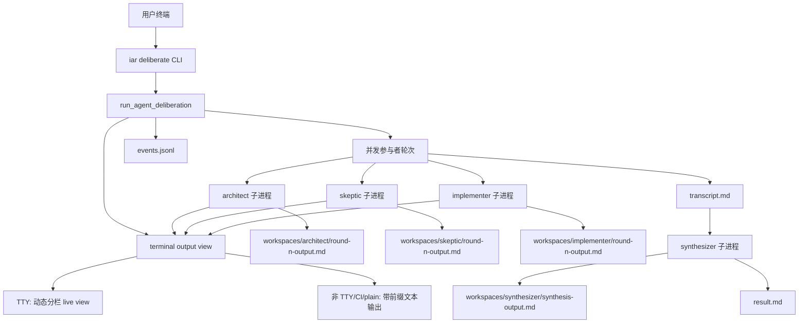

# PRD: Deliberation Live Agent Output

- GitHub Issue: https://github.com/zata-zhangtao/keda/issues/29

## 1. Introduction & Goals

`iar deliberate` 现在已经会并发启动默认参与者 profile，但运行中的可观察性仍然不符合预期。当前终端输出会交错在一起，用户很难判断某段内容来自哪个 agent；同时每个 agent 的 workspace 输出文件是在子进程结束后才一次性写入，因此运行中查看 `workspaces/<profile_id>/` 会短暂看到空目录。

本 PRD 的目标不是把并发改成串行，而是在保留并发执行的前提下，让同时运行的 agent 输出可以按 agent 分栏、实时观察并实时落盘。默认三参与者运行时终端显示三栏；自定义参与者数量时，列数等于当前并发运行的 agent 数量。

可衡量目标：

- `uv run iar deliberate "<prompt>"` 继续并发运行默认参与者：`architect`、`skeptic`、`implementer`。
- 每个参与者在子进程运行期间都有一个实时增长的 workspace 输出文件。
- 交互式 TTY 终端默认显示动态分栏视图，默认三 agent 显示三栏，自定义 agent 数量时按当前并发 agent 数量分栏。
- 非 TTY、CI、重定向输出或显式 plain 模式下，终端退回带 `round` 和 `agent` 标识的普通文本输出。
- 会话结束后，`transcript.md`、`result.md`、`events.jsonl` 和各 agent workspace 输出文件保持一致。
- 真实 CLI 验证可以证明默认三位参与者的输出文件都存在，并且内容是可读文本。

### Real CLI Validation Checklist

- [ ] 本机确认 `claude`、`kimi`、`codex` 三个真实 agent CLI 都可执行、已配置且可以发起请求；任一不可用时，本 checklist 不能标记完成，只能记录阻塞或跳过原因。
- [ ] 在交互式 TTY 中执行真实命令 `uv run iar deliberate "<prompt>" --rounds 1 --session-id <id>`，不使用 fake runner、mock、pytest fixture 或替代 provider。
- [ ] 命令运行期间检查 `logs/agent-runner/deliberations/<id>/workspaces/{architect,skeptic,implementer}/round-1-output.md` 三个文件都已经创建，并且在对应子进程结束前持续增长。
- [ ] 命令运行期间检查终端显示为三栏 live view，三栏分别对应 `architect`、`skeptic`、`implementer`，每栏标题包含 round、agent、状态和输出文件路径提示。
- [ ] 使用自定义参与者数量再执行一次真实命令，例如两个或四个 agent；检查 live view 列数等于当前并发运行的 agent 数量。
- [ ] 使用非 TTY 或显式 plain 模式执行真实命令；检查输出退回普通文本，并且每个可见输出块包含 round 和 agent 归属标识。
- [ ] 命令结束后检查三个 participant 输出文件都有真实模型产生的可读内容，且不是空文件、占位文本或测试 fixture。
- [ ] 命令结束后检查 `transcript.md`、`events.jsonl`、`session.json`、`result.md` 都存在，并且 `transcript.md` 使用真实 profile ID 汇总三位参与者输出。

### Supporting Automated Checks

- [ ] 执行 `uv run pytest tests/test_run_agent_deliberation.py -q`，用 fake transcript runner 验证 streaming append 的文件写入契约。
- [ ] 执行 `uv run pytest tests/test_process_runner.py -q`，用 fixture JSON lines 验证 Claude stream-json 不会进入 transcript-safe 输出。
- [ ] 执行 `uv run pytest tests/test_agent_runner_cli.py -q`，验证 CLI dispatch 仍传入 output path、session metadata 和 selected profiles。
- [ ] 执行 `just test`，确认仓库现有自动化测试全部通过。
- [ ] 执行 `uv run mkdocs build --strict`，确认文档构建通过。
- [ ] 本组检查只能证明实现契约和回归安全，不能替代 `### Real CLI Validation Checklist` 的真实 agent 端到端验证。

## 2. Requirement Shape

| 维度 | 要求 |
|---|---|
| 执行者 | 在终端运行 `iar deliberate` 的开发者 |
| 触发条件 | 用户使用默认三 agent 或自定义 `--agents` 发起多 agent 合议 |
| 期望行为 | 多个参与 agent 并发运行；交互式终端按当前并发 agent 数量分栏展示实时输出，同时每个 agent 的输出增量写入自己的 workspace 文件 |
| 范围边界 | 不做 Web UI、数据库持久化、串行执行模式、键盘交互式控制台或新的外部多 agent 框架 |

具体行为变化：

- 当前 `SubprocessTranscriptRunner.run(...)` 只有在子进程退出后才返回完整 stdout，`_write_workspace_output(...)` 也只在结束后写完整文件。
- 目标状态是输出 chunk 到达时立即通过 per-agent sink 追加写入 `workspaces/<profile_id>/round-<n>-output.md`，同时在交互式终端按当前并发 agent 数量刷新分栏视图。

## 3. Repository Context And Architecture Fit

### Current Relevant Modules And Files

- `src/backend/api/cli.py`
  - 注册 `deliberate` CLI 子命令。
  - 创建 `output_path`、`event_sink`、`transcript_runner`，并调用 `run_agent_deliberation(...)`。
- `src/backend/core/use_cases/run_agent_deliberation.py`
  - 负责合议编排。
  - 当前通过 `ThreadPoolExecutor(max_workers=len(profiles))` 并发运行参与者，因此并发模型已经存在。
  - 当前在 `transcript_runner.run(...)` 返回后才写 per-agent 输出文件。
- `src/backend/core/shared/interfaces/agent_runner.py`
  - 定义 `IAgentTranscriptRunner.run(...)`。
  - 当前接口只返回完成态 `CommandResult`，没有流式输出回调。
- `src/backend/engines/agent_runner/factory.py`
  - 实现 `SubprocessTranscriptRunner`。
  - 当前会把 stdout 流式打印到终端，但没有 profile-aware 的实时文件 sink。
  - 负责构建 `claude`、`kimi`、`codex` 命令。
- `src/backend/engines/agent_runner/` 或相邻 engines 模块
  - 适合新增 terminal live view adapter。
  - 该 adapter 只负责展示，不拥有合议编排、文件落盘或 provider-specific subprocess 逻辑。
- `src/backend/infrastructure/process_runner.py`
  - 包含 `run_filtered_claude_stream(...)` 和 `ClaudeStreamRenderer`。
  - Claude stream-json 已有可读渲染逻辑。
- `tests/test_run_agent_deliberation.py`
  - 覆盖合议编排、输出文件、失败和 synthesis 解析。
- `tests/test_process_runner.py`
  - 覆盖 Claude stream 渲染和 deliberate 命令构建。
- `docs/guides/agent-runner.md`
  - 记录 `iar deliberate` 使用方式和输出文件说明。

### Existing Architecture Pattern To Follow

本变更必须继续遵守四层方向：

```text
src/backend/api/ -> src/backend/core/ -> src/backend/engines/ -> src/backend/infrastructure/
```

- Core 层负责合议编排和抽象的 streaming contract。
- Engines 层把抽象 contract 适配到具体 subprocess 执行。
- 交互式终端分栏属于 engines 层的展示 adapter，不能把 terminal UI 依赖引入 core。
- Infrastructure 层保留 subprocess 细节和 Claude stream-json 渲染细节。
- API 层只负责参数解析和依赖装配。

### Ownership And Dependency Boundaries

- `run_agent_deliberation.py` 可以创建 per-agent output sink，但不能导入 `engines` 或 `infrastructure`。
- Core 层可以发出 profile-aware output event 或调用抽象 output view port，但不能直接依赖 Rich、curses 或其他 terminal UI 包。
- `factory.py` 可以把 core 的 streaming callback 传给具体 agent CLI runner。
- `process_runner.py` 可以提供 provider stream 的渲染辅助能力，但不能导入 core 类型。
- 所有文本文件 I/O 必须显式使用 `encoding="utf-8"`。

### Constraints From Runtime, Docs, Tests, Or Workflows

- 实现后必须运行 `just test`。
- 如果改变 `iar deliberate` 行为，必须同步更新 `docs/guides/agent-runner.md`。
- agent 输出文件位于 `logs/agent-runner/deliberations/` 下，属于运行期日志，不应纳入源码提交。
- 默认三个参与 profile 来自 `config.toml`：
  - `architect -> claude`
  - `skeptic -> kimi`
  - `implementer -> codex`
- 真实三 agent 验证依赖本机 `claude`、`kimi`、`codex` 可用；自动化测试必须提供不依赖真实模型凭证的 fallback。
- 当前 `pyproject.toml` 没有 `rich`、`textual`、`curses`、`blessed` 或 `prompt_toolkit` 依赖。若实现交互式分栏，推荐新增最小依赖 `rich`，使用其 `Live` 和 `Columns`/`Layout` 能力；非 TTY 环境必须不依赖 live repaint。

## 4. Recommendation

### Recommended Approach

推荐在现有 deliberate 编排中增加 streaming output callback，并在 engines 层新增一个 terminal live view adapter；不要替换现有并发模型。

推荐目标状态：

1. 扩展 `IAgentTranscriptRunner.run(...)` 的 core-level contract。
   - 可选参数示例：`output_sink: Callable[[str], None] | None = None`
   - callback 接收已经渲染过、可以给用户阅读的文本 chunk。
   - callback 保持可选，避免让已有 fake runner 和测试变复杂。

2. 在 `run_agent_deliberation.py` 中，每个 agent 子进程启动前创建自己的 append sink。
   - participant 输出文件：`workspaces/<profile_id>/round-<n>-output.md`
   - synthesizer 输出文件：`workspaces/synthesizer/synthesis-output.md`
   - 输出到达时立即 append，而不是等进程退出后整体写入。

3. 交互式终端默认使用动态分栏 live view。
   - 栏数等于当前并发运行的 participant 数量。
   - 默认参与者显示三栏：`architect`、`skeptic`、`implementer`。
   - 每栏标题显示 round、agent、provider、状态和 workspace 输出文件路径提示。
   - 每栏只保留最近 N 行或按终端高度裁剪，完整内容以 workspace 文件为准。
   - synthesis 阶段可以单独显示为一栏或全宽区域，因为它不是和 participant 同时并发运行。

4. 非交互终端必须有 plain fallback。
   - 当 stdout 不是 TTY、检测到 CI、设置显式 plain 模式或 live view 初始化失败时，退回普通文本输出。
   - fallback 每行或每个可见 block 前加 `[round=<n> agent=<profile_id>]`。
   - 保留现有 `events.jsonl` 事件行。

5. Claude、Kimi、Codex 输出都应进入可读 sink。
   - Claude 继续使用 `ClaudeStreamRenderer`，sink 收到渲染后的文本，不收到 raw stream-json。
   - Kimi 和 Codex stdout 可以按当前文本流直接进入 sink。

6. 保持现有最终产物。
   - `transcript.md` 仍按轮次和 profile 汇总公开讨论。
   - `result.md` 仍存放 synthesizer 的总结。
   - `workspaces/<profile_id>/round-<n>-output.md` 从“结束后文件”升级为“运行中实时增长文件”。

### Why This Is The Best Fit

- 当前 `run_agent_deliberation.py` 已经拥有 round 生命周期和并发调度，不需要新的编排服务。
- 变更点刚好在 `IAgentTranscriptRunner` 边界上：subprocess 输出从 engines 回到 core 的地方。
- 分栏 live view 是展示问题，不改变 core 的合议模型；把 UI adapter 放在 engines 层可以避免污染 core。
- 不需要数据库、Web UI 或外部 multi-agent dependency。
- 直接解决观察到的问题：运行中 workspace 文件为空，是因为文件只在进程结束后写入。
- 直接解决新的展示诉求：同时运行几个 agent，终端就显示几栏，默认三 agent 就是三栏。

### Rationale For Rejecting Redundant Abstractions

- 新增独立 orchestration service 会重复 `run_agent_deliberation.py` 已有职责。
- 直接在 core 层引入 terminal UI 会破坏依赖方向；展示 adapter 必须留在 engines/API 装配边界。
- 数据库或 event bus 不适合当前需求；本功能输出是本地运行期证据，放在 logs 目录即可。
- 不采用复杂键盘交互控制台；本需求只需要 live 分栏观察，不需要暂停、滚动、筛选或输入控制。

### Alternatives Considered

| 方案 | 说明 | 结论 |
|---|---|---|
| 改成串行执行 | 把多个 agent 改成串行执行，天然避免输出交错 | 拒绝；用户要的是同步观察三个并发 agent，而不是降低并发能力 |
| 只记录当前时序 | 只在文档中解释文件会在 agent 结束后写入 | 拒绝；这不能满足运行中同步查看输出的需求 |
| 带前缀普通日志 | 每行加 `[round agent]`，不做分栏 | 仅作为 fallback；不能满足用户希望同步看到多栏输出的诉求 |
| 复杂全屏 TUI 控制台 | 做支持滚动、快捷键、暂停、筛选的交互控制台 | 拒绝；当前只需要自动刷新的分栏观察视图 |
| Rich live 分栏 | 用轻量 terminal live renderer 按 agent 数量分栏 | 推荐；范围可控，和当前 CLI 形态匹配 |
| 单独文件监听器 | 增加 watcher 去 tail 各文件 | 拒绝；runner 本身已经拥有 subprocess 输出流，可以直接 append |

## 5. Implementation Guide

本节是基于当前仓库分析形成的活文档。实现过程中如果发现额外影响文件、隐藏依赖、边界条件或更好的路径，必须先更新本 PRD 再继续。

### Core Logic

目标流程：

```text
CLI 启动 deliberate 会话
└── run_agent_deliberation(...)
    ├── 选择 profiles: architect, skeptic, implementer
    ├── 初始化 output view
    │   ├── TTY: 创建 live columns，列数等于并发 profile 数
    │   └── 非 TTY/CI/plain: 创建带前缀的 line logger
    ├── 对本轮每个 profile 并发执行:
    │   ├── 创建 workspace/<profile_id>/
    │   ├── 为 round-<n>-output.md 创建实时 sink
    │   ├── 调用 transcript_runner.run(..., output_sink=sink)
    │   ├── sink 在渲染后 chunk 到达时追加写入文件
    │   ├── sink 同步更新对应 agent 栏
    │   └── 完成后的 stdout 返回给 transcript 组装逻辑
    ├── 写入本轮 transcript
    ├── synthesis 阶段切换为 synthesizer 单栏或全宽区域
    ├── 使用 synthesis-output.md sink 运行 synthesizer
    └── 写入 result/session 产物
```

关键点：

- `output_sink` 只接收可读渲染文本。
- 如果 agent 非 0 退出，已产生的 partial output 仍保留在 workspace 文件中。
- live view 更新必须通过线程安全队列或同步锁串行刷新，避免多个 worker thread 同时重绘终端。
- plain fallback 仍需要避免多线程输出互相破坏行结构。
- 最终 workspace 文件内容应与 `CommandResult.stdout` 保持一致，最多只允许尾部空白策略差异。
- live view 是可观察展示，不是持久化来源；完整历史以 workspace 文件和 transcript 为准。

### Change Impact Tree

```text
.
├── 领域层
│   └── src/backend/core/shared/interfaces/agent_runner.py
│       [修改]
│       【总结】为 transcript runner 端口增加实时可读输出回调，让 core 编排能接收 agent 输出 chunk。
│
│       ├── 增加可选 output sink 参数
│       └── 明确 chunk 是可读渲染文本，不是 provider 原始事件
│
├── 领域层
│   └── src/backend/core/use_cases/run_agent_deliberation.py
│       [修改]
│       【总结】在并发子进程启动前创建 per-agent live sink，并保持最终 transcript 产物一致。
│
│       ├── 每个 participant 启动前创建 workspace 输出文件
│       ├── agent 运行中持续追加 chunk
│       ├── 将 profile-aware output event 交给 output view
│       └── 保持失败传播和最终 transcript 组装
│
├── 领域层
│   └── src/backend/core/shared/interfaces/agent_output_view.py
│       [修改或新增]
│       【总结】定义 terminal output view 的抽象 contract，避免 core 依赖具体 terminal UI 库。
│
│       ├── 支持开始 round 时注册当前并发 profiles
│       ├── 支持按 profile 追加可读 chunk
│       ├── 支持更新 profile 状态
│       └── 支持 close/fallback/no-op 实现
│
├── 基础设施适配层
│   └── src/backend/engines/agent_runner/factory.py
│       [修改]
│       【总结】把具体 agent CLI 的可读输出 chunk 传回 core 的 live output sink。
│
│       ├── 将 output_sink 传入 SubprocessTranscriptRunner.run
│       ├── Codex 和 Kimi stdout 到达时写入 sink
│       └── Claude 使用渲染后的 stream 文本写入 sink
│
├── 基础设施适配层
│   └── src/backend/engines/agent_runner/live_terminal.py
│       [新增]
│       【总结】实现 terminal live view adapter，在交互式 TTY 中按当前并发 agent 数量动态分栏展示输出。
│
│       ├── TTY 且非 CI 时启用 live columns
│       ├── 栏数等于当前并发 profiles 数量
│       ├── 每栏显示 profile、provider、round、状态和最近输出
│       ├── 非 TTY/CI/plain 模式退回 line-prefixed logger
│       └── 不参与 workspace 文件写入和 transcript 组装
│
├── 基础设施层
│   └── src/backend/infrastructure/process_runner.py
│       [修改]
│       【总结】让 Claude stream 渲染同时服务终端显示和实时 transcript 收集。
│
│       ├── 确保收集的 Claude stdout 是可读文本
│       └── 避免 raw stream-json 泄露到 workspace 输出文件
│
├── 测试
│   ├── tests/test_run_agent_deliberation.py
│   │   [修改]
│   │   【总结】验证 fake runner 的 streaming chunk 会实时写入 per-agent workspace 文件。
│   │
│   │   ├── 增加会调用 output_sink 的 fake streaming runner
│   │   └── 验证 per-agent 文件包含多个 chunk
│   │
│   ├── tests/test_process_runner.py
│   │   [修改]
│   │   【总结】验证 provider stream 收集结果是可读文本而不是原始事件 payload。
│   │
│   │   ├── 覆盖 Claude rendered collection
│   │   └── 覆盖 raw stream-json 不进入 transcript-safe 输出
│   │
│   └── tests/test_agent_runner_cli.py
│       [修改]
│       【总结】保持 CLI deliberate dispatch 测试与扩展后的 runner interface 对齐。
│
│       └── 只在签名变化需要时更新 mock
│
└── 文档
    └── docs/guides/agent-runner.md
        [修改]
        【总结】记录实时 per-agent 输出文件、动态分栏 live view 和 plain fallback 含义。

        ├── 说明 workspace 文件会在 agent 运行中增长
        ├── 说明交互式终端按当前并发 agent 数量分栏
        ├── 说明非 TTY/CI/plain 模式输出按 round 和 agent 标识
        └── 补充默认三 agent 的真实验证方式
```

### Flow Or Architecture Diagram



### Realistic Validation Plan

真实 agent 端到端验证已经按本次要求改为 checklist，并前置到 `## 1. Introduction & Goals` 的 `### Real CLI Validation Checklist`。自动化回归检查单独放在同一节的 `### Supporting Automated Checks`，本节只保留引用，避免同一组验收步骤在 PRD 中维护两份。

### Low-Fidelity Prototype

交互式 TTY 中，默认三 agent 运行时显示三栏；栏数随当前并发 agent 数量变化：

```text
┌─ round=1 agent=architect provider=claude running ─┐ ┌─ round=1 agent=skeptic provider=kimi running ─┐ ┌─ round=1 agent=implementer provider=codex running ─┐
│ 架构师：这是我的可读输出样例。              │ │ 质疑者：这是我的可读输出样例。            │ │ implementer：这是我的可读输出样例。       │
│ ...                                               │ │ ...                                         │ │ ...                                           │
└─ workspaces/architect/round-1-output.md ─────────┘ └─ workspaces/skeptic/round-1-output.md ────────┘ └─ workspaces/implementer/round-1-output.md ───────┘
```

非 TTY、CI、重定向输出或 plain 模式下，退回普通文本：

```text
[round=1 agent=architect status=running] 架构师：这是我的可读输出样例。
[round=1 agent=skeptic status=running] 质疑者：这是我的可读输出样例。
[round=1 agent=implementer status=running] implementer：这是我的可读输出样例。

[round=0 agent=synthesizer status=running] ## 综合建议
[round=0 agent=synthesizer status=running] ...
```

workspace 文件在运行中应可读且持续增长：

```text
logs/agent-runner/deliberations/<session_id>/
├── workspaces/
│   ├── architect/
│   │   └── round-1-output.md   # architect 运行中持续增长
│   ├── skeptic/
│   │   └── round-1-output.md   # skeptic 运行中持续增长
│   └── implementer/
│       └── round-1-output.md   # implementer 运行中持续增长
├── transcript.md
├── result.md
├── events.jsonl
└── session.json
```

### ER Diagram

本 PRD 不涉及数据模型变更。

### Interactive Prototype Change Log

本 PRD 不涉及交互原型文件变更。

### External Validation

本 PRD 使用外部文档只判断 terminal live view 的可行实现方式，不改变仓库架构边界。

- 截至 2026-05-24，[Rich `Live` 官方文档](https://rich.readthedocs.io/en/latest/reference/live.html) 说明 `Live` 支持自动刷新的 renderable 展示，可用于 agent 输出的实时刷新。
- 截至 2026-05-24，[Rich `Layout` 官方文档](https://rich.readthedocs.io/en/stable/layout.html) 说明 `Layout` 可把终端区域划分成多个独立内容区域，适合多 agent 分栏。
- 截至 2026-05-24，[Rich `Columns` 官方文档](https://rich.readthedocs.io/en/latest/columns.html) 说明 `Columns` 支持把多个 renderable 渲染成整齐列，适合按当前 agent 数量生成等宽列。
- 结论：实现时优先使用 `rich` 的 live rendering 能力，且设置非 TTY/CI/plain fallback，避免把交互式能力变成 CI 必需条件。

## 6. Definition Of Done

- 默认 `iar deliberate` 继续并发运行所有 selected participant profiles。
- 每个参与者在子进程运行期间都有实时更新的 workspace 输出文件。
- 交互式 TTY 终端按当前并发 agent 数量显示动态分栏 live view。
- 非 TTY、CI、重定向输出或 plain 模式下，终端输出退回带 round/agent 前缀的普通文本。
- Claude stream-json 被存为可读渲染文本，而不是 raw JSON。
- agent 失败时保留 partial output 文件，并且 CLI 仍返回非 0。
- `docs/guides/agent-runner.md` 说明实时 workspace 文件、动态分栏 live view 和 plain fallback。
- `uv run pytest tests/test_run_agent_deliberation.py tests/test_process_runner.py tests/test_agent_runner_cli.py -q` 通过。
- `just test` 通过。
- `uv run mkdocs build --strict` 通过。

## 7. Acceptance Checklist

### Architecture Acceptance

- [ ] `src/backend/core/use_cases/run_agent_deliberation.py` 仍然拥有 round orchestration，不导入 `engines`、`infrastructure` 或 `api`。
- [ ] `src/backend/core/shared/interfaces/agent_runner.py` 定义 use case 需要的 streaming callback contract。
- [ ] `src/backend/engines/agent_runner/factory.py` 仍是 subprocess transcript execution 的具体 adapter。
- [ ] terminal live view 的具体实现位于 engines/API 装配侧，core 不导入 `rich` 或其他 terminal UI 依赖。
- [ ] 不新增 service、database table、Web UI、复杂键盘交互控制台或外部 multi-agent dependency。

### Behavior Acceptance

- [ ] 默认 `uv run iar deliberate "<prompt>" --rounds 1 --session-id <id>` 会为 `architect`、`skeptic`、`implementer` 创建参与者输出文件。
- [ ] `workspaces/<profile_id>/round-1-output.md` 在对应 subprocess 运行前或运行中创建，并随着可读输出到达持续增长。
- [ ] 交互式 TTY 中，默认三 participant 运行时显示三栏 live view，分别对应 `architect`、`skeptic`、`implementer`。
- [ ] 交互式 TTY 中，自定义 participant 数量时，live view 栏数等于当前并发运行的 participant 数量。
- [ ] 非 TTY、CI、重定向输出或 plain 模式下，终端可见输出包含 agent identity，不只显示 start/finish events。
- [ ] `workspaces/synthesizer/synthesis-output.md` 在 synthesis 运行中也持续更新。
- [ ] 最终 `transcript.md` 按真实 profile ID 分组，并包含同样的可读公开输出。
- [ ] participant 失败时保留 partial output 文件，并导致 `iar deliberate` 返回非 0。

### Provider Output Acceptance

- [ ] Claude 输出文件包含可读文本和工具摘要，不包含 raw stream-json event object。
- [ ] Kimi 和 Codex 输出文件包含可读 stdout 文本。
- [ ] hidden thinking/signature delta 不会写入 transcript-safe 输出文件。

### Documentation Acceptance

- [ ] `docs/guides/agent-runner.md` 说明 live per-agent workspace files。
- [ ] 指南说明 participant profiles 是并发运行，交互式终端按当前并发 agent 数量分栏。
- [ ] 指南说明非 TTY、CI、重定向输出或 plain 模式会退回按 agent 标识的普通文本。
- [ ] 指南包含检查默认三 agent 输出文件的验证命令或流程。

### Validation Acceptance

- [ ] `uv run pytest tests/test_run_agent_deliberation.py -q` 通过。
- [ ] `uv run pytest tests/test_process_runner.py -q` 通过。
- [ ] `uv run pytest tests/test_agent_runner_cli.py -q` 通过。
- [ ] `just test` 通过。
- [ ] `uv run mkdocs build --strict` 通过。
- [ ] 本机 `claude`、`kimi`、`codex` 可用时，在交互式 TTY 中执行真实 `uv run iar deliberate "<prompt>" --rounds 1 --session-id <id>`，并检查三栏 live view 和 `workspaces/{architect,skeptic,implementer}/round-1-output.md`。
- [ ] 使用非 TTY 或 plain 模式执行真实命令，检查 fallback 输出包含 round/agent 标识。

## 8. Functional Requirements

- **FR-1**: 默认 `iar deliberate` 的 participant round 必须继续并发运行所有 selected profiles。
- **FR-2**: runner 必须在每个 participant subprocess 运行前或运行中创建/open `workspaces/<profile_id>/round-<n>-output.md`。
- **FR-3**: runner 必须在 output chunk 到达时追加写入对应 participant 的 workspace 文件。
- **FR-4**: 交互式 TTY 中，runner 必须按当前并发 participant 数量显示动态分栏 live view。
- **FR-5**: runner 必须在 synthesis 运行时追加写入 `workspaces/synthesizer/synthesis-output.md`。
- **FR-6**: `CommandResult.stdout`、workspace output files 和 `transcript.md` 必须使用可读渲染文本，而不是 provider 内部 raw event payload。
- **FR-7**: participant 或 synthesizer 失败时必须保留 partial output 文件，并让 CLI 返回非 0。
- **FR-8**: 现有 `events.jsonl`、`session.json`、`transcript.md` 和 `result.md` 输出 contract 必须继续可用。
- **FR-9**: 非 TTY、CI、重定向输出或 plain 模式下，runner 必须退回带 round/agent 标识的普通文本输出。

## 9. Non-Goals

- 不构建浏览器 UI 或 WebSocket dashboard。
- 不构建带键盘操作、滚动搜索、暂停恢复或筛选功能的复杂全屏 TUI 控制台。
- 不把 deliberate 从并发执行改为串行执行。
- 不增加数据库会话历史。
- 不暴露模型隐藏 chain-of-thought。
- 不要求真实 GitHub、Issue、PR 或 branch 操作。

## 10. Risks And Follow-Ups

- 不同 provider 的 stream 格式不一致。Claude 需要渲染，Kimi 和 Codex 当前主要是纯 stdout；实现时不能把 provider-specific 格式泄露到 core。
- live view 需要处理多线程输出刷新。实现时应通过队列或锁集中刷新，避免 worker thread 直接重绘终端。
- 分栏宽度在窄终端中可能不足。实现时应裁剪每栏最近输出，并提示完整内容在 workspace 文件中。
- 非 TTY、CI、日志采集和重定向输出不能依赖 live repaint，必须使用 plain fallback。
- 真实 live-agent 验证依赖本地 CLI 凭证，因此 fake-runner 自动化测试仍是必需验收项。
- 如果实现发现 Codex 或 Kimi 不会在进程退出前 flush 有效 chunk，需要记录 provider 限制，但仍保留 live sink contract。

## 11. Decision Log

| ID | 决策问题 | 选择 | 拒绝 | 理由 |
|---|---|---|---|---|
| D-01 | 是否为了简化输出而把 agent 改成串行执行？ | 保留并发执行，并增加 per-agent streaming attribution | 串行 agent execution | 现有 use case 已经并发运行 profile，用户需要同步可见性而不是牺牲并发 |
| D-02 | 实时输出文件应该写到哪里？ | 继续使用 `workspaces/<profile_id>/round-<n>-output.md` | 新增 `live/` 或 `streams/` 目录 | workspace 路径已经是 per-agent 输出位置，复用它可以避免新的 artifact taxonomy |
| D-03 | 终端可见性应该如何改进？ | 交互式 TTY 使用动态分栏 live view，非 TTY/CI/plain 使用普通文本 fallback | 只使用普通文本 agent/round attribution | 用户希望同步看到几个 agent 就分成几栏；plain 输出只作为兼容 fallback |
| D-04 | provider stream payload 应该如何保存？ | 只保存可读渲染文本 | 保存 provider raw stdout/events | raw stream-json 不适合人读，也可能包含不该进入 transcript-safe 文件的噪声事件 |
| D-05 | 是否允许新增 terminal rendering 依赖？ | 允许新增最小依赖 `rich`，并限制在 engines/API 展示 adapter 中使用 | 在 core 中手写 ANSI 重绘或引入复杂 TUI 框架 | Rich 官方支持 live display、layout 和 columns，能降低实现复杂度；core 仍保持无 UI 依赖 |
