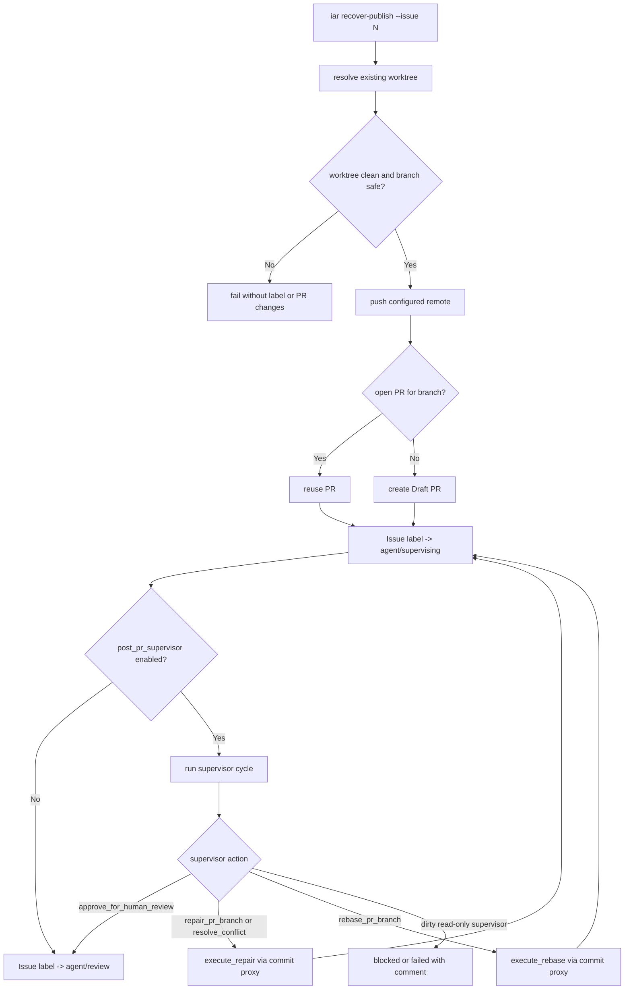

# PRD: Agent Runner 发布恢复后的 Supervisor 安全闭环


## 1. Introduction & Goals

Issue #28 为“Agent 已经生成本地 commit，但 push、PR 创建或 GitHub label/comment 收尾失败”的场景新增了发布恢复能力。代码审查发现当前恢复路径存在三个需要后续修正的问题：

- 恢复成功后可能直接进入 `agent/review`，绕过正常 Draft PR 后的 `agent/supervising` 和 post-PR supervisor 流程。
- 分支安全校验可能把 Issue #42 错误匹配到 `issue-421` 这类相似编号分支。
- publish failure comment 可能把 PR 创建失败等阶段统一误报为 `push`，影响人工判断恢复动作。

本 PRD 的目标是把发布恢复纳入现有 post-PR supervisor 闭环，使恢复后的 PR 与普通 `run-once` 生成的 PR 走同一套状态机：

- `recover-publish` 成功 push 并创建/复用 PR 后，先进入 `agent/supervising`。
- 只有当前 PR head 被 supervisor `approve_for_human_review` 后，Issue 才能进入 `agent/review`。
- supervisor 发现架构、代码、冲突或 rebase 问题时，必须通过现有 repair/rebase commit proxy 处理，而不是提交只读 supervisor 的副作用。
- 默认分支匹配必须按完整 Issue number token 判断，避免误发布相邻编号分支。
- 发布失败 comment 必须能区分 `push`、`pr_lookup`、`pr_create`、`label_update`、`comment_update` 等真实失败阶段。

### Realistic Validation

除单元测试和集成测试外，本 PRD 要求通过**真实项目入口点**验证关键行为，确保真实使用路径生效，而非仅在隔离 fixture 中通过。

- [ ] **恢复后 supervisor 真实验证**：通过 `uv run iar recover-publish --issue <number> --repo <repo_path>` 在可丢弃 GitHub Issue/PR 上验证恢复成功后先进入 `agent/supervising`，supervisor approve 后再进入 `agent/review`。
- [ ] **repair/rebase 路由真实验证**：通过同一 CLI 入口和可控 supervisor action 验证 `repair_pr_branch` / `rebase_pr_branch` 会走现有 commit proxy、verification、push，再回到 supervisor。
- [ ] **安全拒绝真实验证**：通过当前分支 `issue-421` 恢复 Issue #42，或执行 `uv run iar recover-publish --issue 42 --branch issue-421`，验证系统不会误发布错误分支。
- [ ] **为什么单元测试不够**：单元测试可以证明 helper 判断和 label 调用顺序，但不能证明 CLI 装配、GitHub label 状态、PR 复用、supervisor comment marker 和真实 Git worktree 状态在同一入口中闭环。

## 2. Requirement Shape

- **Actor**：本地 Agent Runner 运维者、人类 reviewer、自动 review daemon。
- **Trigger**：
  - 用户执行 `iar recover-publish --issue <number>` 恢复已有本地 commit 的发布收尾。
  - `run-once` 在 publish 阶段失败并写出恢复提示后，用户或 runner 再次进入恢复路径。
  - post-PR supervisor 在恢复后的 PR 上发现架构问题、测试问题、base 更新、冲突或需要 rebase。
- **Expected Behavior**：
  - 恢复命令完成 push 和 PR 创建/复用后，行为与普通 Draft PR 发布保持一致：进入 `agent/supervising`，运行 post-PR supervisor；只有 supervisor approve 当前 head 后才进入 `agent/review`。
  - 如果 supervisor 输出 `repair_pr_branch`、`resolve_conflict` 或 `rebase_pr_branch`，runner 使用现有 repair/rebase 执行路径提交修改、验证、push，并继续下一轮 supervisor。
  - 如果只读 supervisor cycle 自身留下未提交变更，runner 必须视为协议违规并阻止进入 `agent/review`；不得把这些变更静默遗留在 worktree 中，也不得在 approve 路径提交它们。
  - `recover-publish` 默认分支校验必须匹配完整 Issue number，不能把 Issue #42 的恢复误放行到 `issue-421`、`feature/issue-420` 等分支。
  - publish failure comment 的 failure category 必须对应真实失败阶段，便于人工选择恢复动作。
- **Explicit Scope Boundary**：
  - 不改变普通 implementation Agent prompt 的主流程，不引入新的 Agent 类型。
  - 不自动 merge PR，不改变 `agent/review` 的含义；它仍表示自动 supervisor 已批准当前 PR context，等待人类 review。
  - 不新增数据库、后台队列或持久状态文件。
  - 不要求 supervisor 在只读审查阶段直接提交文件；需要改代码时必须通过现有 repair/rebase commit proxy。

## 3. Repository Context And Architecture Fit

| Path | Current Responsibility | Fit For This PRD |
|---|---|---|
| `src/backend/api/cli.py` | `iar` CLI 参数解析和 use case 装配 | `recover-publish` 入口只组装依赖，不承载业务分支逻辑 |
| `src/backend/core/use_cases/recover_publish.py` | Issue #28 新增的发布恢复编排 | 需要把成功恢复后的状态从直接 review 改为 supervisor lifecycle |
| `src/backend/core/use_cases/agent_runner_orchestrate.py` | `run-once` 编排、post-PR supervisor loop、repair/rebase loop | 应复用或抽取其中 supervisor loop，避免 recovery 另写一套状态机 |
| `src/backend/core/use_cases/pr_supervisor.py` | 单轮 supervisor、repair、rebase、conflict resolution | 继续作为 supervisor action 和提交代理的唯一执行路径 |
| `src/backend/core/use_cases/run_agent_once.py` | Git publish helper、remote 校验、failure comment 格式 | 需要细化 publish failure category，不把 PR create 失败误报为 push |
| `src/backend/core/shared/interfaces/agent_runner.py` | core 端口协议 | 如果恢复命令需要从 issue number 获取 `IssueSummary`，应在接口层扩展，而不是 core 直接调用 `gh` |
| `src/backend/infrastructure/github_client.py` | GitHub CLI adapter | 可实现 `get_issue` / PR lookup 等端口，基础设施细节留在 infrastructure |
| `tests/test_recover_publish.py` | publish recovery 单元/集成测试 | 需要覆盖 supervisor 路由、dirty supervisor guard、branch boundary |
| `tests/test_run_agent.py` / `tests/test_pr_supervisor.py` | runner 与 supervisor 既有行为测试 | 需要防止改动破坏普通 `run-once` 和 repair/rebase 路径 |
| `docs/guides/agent-runner.md` | 运维和 workflow 文档 | 需要把 recover-publish 说明从直接 review 改成 supervising/supervisor |

架构约束：

- `src/backend/api/` 只能调用 core use case，不写 GitHub/Git 业务规则。
- `src/backend/core/` 不能导入 infrastructure，也不能直接硬编码 `gh issue view` 等基础设施命令。
- `src/backend/core/use_cases/recover_publish.py` 不能调用普通 implementation Agent prompt；只允许进入 post-PR supervisor 和已有 repair/rebase commit proxy。
- Git 命令仍通过 `IProcessRunner`，GitHub 操作仍通过 `IGitHubClient`。

复用候选：

- `_run_supervisor_with_repair_loop(...)`，或从 `agent_runner_orchestrate.py` 抽出的公开 core helper。
- `run_post_pr_supervisor_cycle(...)`、`execute_repair(...)`、`execute_rebase(...)`。
- `build_draft_pr_created_comment(...)` 和 `review_once` 已使用的 event marker/branch 解析约定。
- `validate_publish_remote(...)`、`list_git_remotes(...)`、`get_head_sha(...)`、`get_current_branch(...)`。
- 现有 `find_open_pr_by_head(...)` 和 `get_pull_request_context(...)`。

潜在重复风险：

- 在 `recover_publish.py` 中复制 supervisor label/action 状态机会形成第二套 post-PR 状态机。
- 新增 recovery 专用 repair executor 会重复 `pr_supervisor.py` 的提交代理能力。
- 新增本地 recovery checkpoint 会重复 Git、PR lookup、Issue labels 和 supervisor event comments 已能推导出的状态。

## 4. Recommendation

### Recommended Approach

扩展 Issue #28 的 publish recovery 实现，使其复用现有 post-PR supervisor lifecycle：

1. `recover-publish` 成功 push 分支并创建或复用 Draft PR 后，写入 `review_once` 能识别的 PR branch/head 上下文，并把 Issue label 切到 `agent/supervising`，不要直接切到 `agent/review`。
2. 当 `config.post_pr_supervisor.enabled` 为 true 时，针对恢复后的 PR context 运行现有 supervisor repair loop。supervisor approve 后进入 `agent/review`；supervisor 要求 repair/rebase 时，使用现有 `execute_repair` / `execute_rebase` 路径处理。
3. 当 `config.post_pr_supervisor.enabled` 为 false 时，保留直接进入 `agent/review` 的 fallback，并在文档和测试中明确这是禁用 supervisor 时的特例。
4. 在只读 supervisor cycle 周围增加 dirty-worktree guard：supervisor 调用前确认 clean，调用后如果 action 是 approve 或仅解析决策却留下未提交变更，则阻止进入 review，并转为 blocked/failed 或明确错误 comment。
5. 用 segment-aware 的分支校验替换宽松 issue-number regex。
6. 将 publish 子步骤分别包装或分类，使失败 comment 能准确报告失败阶段。

这是最小完整变更：它复用现有 supervisor、repair、rebase、verification 和 commit proxy，不新增 recovery 专用 reviewer 或提交路径。

### Why This Fits

- 保留现有 durable label 模型：`ready -> running -> supervising -> review`。
- 所有写代码行为继续经过既有 commit proxy 和 verification gate。
- 不改变 `agent/review` 的语义。
- infrastructure 细节继续留在 `GitHubCliClient`，core 只依赖接口。

### Alternatives Considered

| Alternative | Description | Rejection Reason |
|---|---|---|
| 保持 `recover-publish` 成功后直接进入 `agent/review` | 把发布恢复视为纯运维收尾，让人类 reviewer 自行发现 PR 问题 | 这会绕过当前 workflow 要求的人审前自动 supervisor gate |
| 只读 supervisor 修改后自动提交 | 即使 action 是 approve，也提交 supervisor 留下的 dirty files | 这破坏只读 supervisor 契约，且绕过 repair action 的显式提交代理 |
| 新增 `recover-publish-supervisor` 二段命令 | 恢复后要求运维者手动再跑一个 supervisor 命令 | 增加容易遗漏的操作步骤，恢复后的 PR 仍可能直接停在 review |
| 新增 recovery 状态 label | 引入 `agent/recovered` 或 `agent/recovering` 等标签 | 现有 `agent/supervising` 已表达“PR 存在且自动 post-PR review 正在处理” |

## 5. Implementation Guide

This section is a living implementation guide based on current repository analysis. If implementation discovers additional affected files, hidden dependencies, edge cases, or a better path, update this PRD before proceeding.

### Core Logic

目标 `recover_publish_issue(...)` 流程：

```text
resolve existing worktree
ensure worktree clean
validate branch with exact issue-number boundary
head_sha = git rev-parse HEAD
validate configured remote
git push -u <remote> <branch>
existing_pr = find_open_pr_by_head(branch)
if no existing_pr:
    create draft PR
write recovery/draft PR comment with Branch and HEAD SHA
if post_pr_supervisor.enabled:
    labels: failed/running/ready/review -> supervising
    pr_context = get_pull_request_context(branch) or fallback context
    run existing supervisor repair loop
else:
    labels: failed/running/ready/supervising -> review
return result with pr_url, head_sha, pr_reused, supervisor_action
```

只读 supervisor 的 dirty-worktree guard：

```text
before read-only supervisor cycle:
    assert git status --porcelain is empty
run supervisor with capture_output=True
after action parse:
    if worktree changed before any repair/rebase executor:
        comment protocol violation
        move to blocked or failed
        do not enter review
```

publish failure category 精细化：

```text
validate_safe_changes / validate_publish_remote -> preflight 或 push category，取决于所在阶段
git push failure -> push
find_open_pr_by_head failure -> pr_lookup
create_draft_pr failure -> pr_create
edit_issue_labels failure -> label_update
comment_issue failure -> comment_update
```

### Change Impact Tree

```text
.
├── src/backend/core/shared/
│   └── interfaces/agent_runner.py
│       [修改]
│       【总结】为 recovery supervisor 路径补足按 Issue number 获取 IssueSummary 或等价上下文的端口。
│
│       ├── 如需要，新增 get_issue(issue_number) -> IssueSummary
│       └── 保持 core 只依赖接口，不直接调用 GitHub CLI
│
├── src/backend/infrastructure/
│   └── github_client.py
│       [修改]
│       【总结】实现新增 GitHub issue context 端口，并保持 PR lookup 错误语义可区分。
│
│       ├── 使用 gh issue view 读取 number/title/url/body/labels
│       ├── find_open_pr_by_head 对 CLI/API 失败保留可分类错误上下文
│       └── 不改变已有 label idempotency 行为
│
├── src/backend/core/use_cases/
│   ├── recover_publish.py
│   │   [修改]
│   │   【总结】将恢复成功后的状态接入 post-PR supervisor lifecycle，并修正分支匹配边界。
│   │
│   │   ├── 成功 push/PR 后进入 supervising 而不是直接 review
│   │   ├── post_pr_supervisor.enabled 时运行现有 supervisor loop
│   │   ├── post_pr_supervisor.disabled 时保留直接 review fallback
│   │   ├── 分支默认校验使用完整 issue number boundary
│   │   └── 成功结果包含 supervisor/recovery 状态，便于日志和测试断言
│   │
│   ├── agent_runner_orchestrate.py
│   │   [修改]
│   │   【总结】暴露或抽取可复用的 post-PR supervisor repair loop，供 run-once 和 recovery 共用。
│   │
│   │   ├── 避免 recover_publish.py 复制 label/action 状态机
│   │   ├── 在 read-only supervisor 后增加 dirty-worktree guard
│   │   └── 保持 run-once 现有行为不回退
│   │
│   ├── pr_supervisor.py
│   │   [修改]
│   │   【总结】确保 read-only supervisor 和 repair/rebase 执行边界可被检测和测试。
│   │
│   │   ├── supervisor approve 不得伴随未提交变更
│   │   └── repair/rebase action 继续使用 commit-request proxy
│   │
│   └── run_agent_once.py
│       [修改]
│       【总结】细化 publish failure category，使 failure comment 对应真实失败阶段。
│
│       ├── push、PR lookup、PR create、label update、comment update 分类准确
│       └── failure comment 保留恢复命令和底层错误上下文
│
├── tests/
│   ├── conftest.py
│   │   [修改]
│   │   【总结】扩展 FakeGitHubClient 支持 recovery supervisor 所需的 Issue/PR context。
│   │
│   ├── test_recover_publish.py
│   │   [修改]
│   │   【总结】覆盖 recovery 进入 supervisor、repair/rebase、branch boundary 和 idempotency。
│   │
│   ├── test_pr_supervisor.py
│   │   [修改]
│   │   【总结】覆盖 read-only supervisor 留下脏变更时不会 approve 到 review。
│   │
│   └── test_run_agent.py
│       [修改]
│       【总结】覆盖 publish failure category 和普通 run-once supervisor 行为无回归。
│
└── docs/
    └── guides/agent-runner.md
        [修改]
        【总结】把 recover-publish 文档更新为恢复后先进入 supervising 并运行 supervisor。

        ├── 修正文档中的 label 流转说明
        ├── 补充 supervisor disabled 时的 fallback
        └── 补充分支安全和手动恢复注意事项
```

### Flow Or Architecture Diagram



### Realistic Validation Plan

| Behavior | Real Entry Point | Test Layer | Mock Boundary | Data/Env Needed | Command Or Procedure | Required For Acceptance |
|---|---|---|---|---|---|---|
| `recover-publish` 先进入 supervisor 再进入 review | `iar recover-publish` CLI | sandbox/manual smoke | Git worktree 和 GitHub CLI 尽量真实；使用可丢弃 Issue/PR | 测试 repo、open Issue、本地 issue worktree、有效 `gh auth status` | `uv run iar recover-publish --issue <number> --repo <repo_path>` 后用 `gh issue view <number> --json labels,comments` 验证先 supervising 后 review | Yes |
| 恢复后的 supervisor repair action 通过 commit proxy 提交 | `iar recover-publish` CLI 加可控 supervisor action | integration | supervisor 可 fake/sandbox；Git worktree 状态尽量真实 | 已有本地恢复 head；supervisor 返回 `repair_pr_branch`；repair agent 写 `.agent-runner/commit-request.json` | 执行恢复命令，确认产生新 commit、verification 已运行、分支已 push、latest supervisor event 指向新 head | Yes |
| 分支边界拒绝相似 Issue 编号 | `iar recover-publish` CLI 或 core use case 的 CLI-level test | unit + CLI smoke | Process/GitHub 可 mock | 当前分支 `issue-421`，请求 Issue #42 | `uv run pytest tests/test_recover_publish.py::test_recover_publish_rejects_issue_number_prefix_branch -q`，并补 CLI main/parser 断言 | Yes |
| publish failure category 对应真实失败阶段 | `iar run-once` orchestrator test | integration | Fake GitHub/process runner 分别在 push、PR lookup/create、label、comment 失败 | Fake Issue 和已存在本地 commit | `uv run pytest tests/test_run_agent.py -k "publish_failure_category" -q` | Yes |
| 文档描述与 workflow 一致 | MkDocs build | docs | None | 仓库文档 | `uv run mkdocs build` | Yes |
| 全量回归 | 仓库标准命令 | regression | 使用现有测试 fake | 本地开发环境 | `just test` | Yes |

真实 GitHub 验证需要可丢弃 Issue/branch 和有效 GitHub CLI 登录。如果凭据不可用，实施 PR 必须明确记录 live validation blocked；但自动化 CLI/use-case 测试和 `just test` 仍为必跑项，不能用“没有凭据”跳过。

### Low-Fidelity Prototype

本 PRD 不涉及 UI 变更。

### ER Diagram

本 PRD 不涉及数据模型变更。

### Interactive Prototype Change Log

本 PRD 不修改交互原型文件。

### External Validation

不需要外部调研；仓库现有实现和 Issue #28 审查证据已足够。

## 6. Definition Of Done

- `recover-publish` 在 supervisor enabled 时不再绕过 post-PR supervisor。
- 恢复后的 PR 与普通 `run-once` PR 使用同样的最终 label 语义。
- 恢复后的 supervisor-requested repair/rebase 只通过现有 commit proxy 和 verification chain 提交。
- 只读 supervisor 协议违规不能静默留下 dirty worktree 并把 Issue 推进 review。
- 分支安全校验拒绝相似 Issue 编号前缀，且 `--branch` 仍要求精确匹配。
- Failure comment 能准确识别实际发布失败阶段。
- 文档准确描述更新后的恢复 workflow 和手动 fallback。
- `just test`、目标 recovery/supervisor 测试和 `uv run mkdocs build` 均通过。
- live/sandbox 恢复验证已执行并记录，或因缺少凭据明确标记 blocked，同时附上自动化 fallback 证据。

## 7. Acceptance Checklist

### Architecture Acceptance

- [ ] `recover_publish.py` 复用 `agent_runner_orchestrate.py` 中现有 post-PR supervisor 逻辑，或复用抽取后的 shared core helper，不复制 supervisor action 状态机。
- [ ] 没有 core 模块导入 `src/backend/infrastructure/`。
- [ ] `recover-publish` 不调用普通 implementation Agent prompt 或 recovery prompt。
- [ ] 如需 Issue context retrieval，必须通过 `IGitHubClient` 暴露，并由 `GitHubCliClient` 实现。

### Behavior Acceptance

- [ ] 当 `post_pr_supervisor.enabled = true` 时，成功 `recover-publish` 在任何 `agent/review` 转换前先把 Issue label 移到 `agent/supervising`。
- [ ] 只有 supervisor approve 当前 recovered PR head 后，才添加 `agent/review`。
- [ ] supervisor 返回 `repair_pr_branch` 或 `resolve_conflict` 时，恢复路径使用现有 repair commit proxy，并在下一轮 supervisor 前 push 新 head。
- [ ] supervisor 返回 `rebase_pr_branch` 时，恢复路径使用现有 rebase 路径，包括必要时的冲突解决 commit proxy。
- [ ] 当 `post_pr_supervisor.enabled = false` 时，成功恢复可以直接进入 `agent/review`，且文档/测试明确覆盖该 fallback。
- [ ] 只读 supervisor cycle 留下未提交变更时，不能 approve Issue 进入 human review。
- [ ] 对已 approve 的 recovered PR 重新执行 `recover-publish` 会复用已有 PR，不创建重复 PR。
- [ ] 恢复成功 comment 包含 branch、head SHA、PR URL、PR reuse status，并包含 `review_once` 可解析的 PR branch context。

### Safety Acceptance

- [ ] 恢复 Issue #42 时，默认拒绝 `issue-421`、`feature/issue-420`、`task-142` 等相似编号分支；除非操作者显式传入且当前分支与 `--branch` 完全一致。
- [ ] `recover-publish` 在 push 前仍拒绝 dirty worktree。
- [ ] push、PR lookup 或 PR creation 失败时，`recover-publish` 不修改 labels。
- [ ] 除现有 repair/rebase commit proxy 路径外，`recover-publish` 不执行 `git add`、`git commit`、`git merge` 或删除分支。

### Failure Reporting Acceptance

- [ ] Push 失败报告为 `push`。
- [ ] 查询已有 PR 失败报告为 `pr_lookup`。
- [ ] Draft PR 创建失败报告为 `pr_create`。
- [ ] Label 更新失败报告为 `label_update`。
- [ ] Comment 更新失败报告为 `comment_update`。
- [ ] Failure comment 包含 worktree path、recovery command、failure category 和底层命令/异常上下文。

### Documentation Acceptance

- [ ] `docs/guides/agent-runner.md` 说明 recovered PR 会进入 `agent/supervising`，并在 human review 前运行 supervisor。
- [ ] 手动 fallback 命令在 supervisor enabled 时不再指导用户直接添加 `agent/review`。
- [ ] 文档单独说明 supervisor disabled 时的 direct-review fallback。
- [ ] 文档说明精确分支确认和 Issue number boundary 行为。

### Validation Acceptance

- [ ] `uv run pytest tests/test_recover_publish.py -q` 通过，并覆盖 supervisor routing、branch boundary 和 idempotent PR reuse。
- [ ] `uv run pytest tests/test_pr_supervisor.py -q` 通过，并覆盖 dirty read-only supervisor guard。
- [ ] `uv run pytest tests/test_run_agent.py -q` 通过，并覆盖 publish failure category 和普通 `run-once` 无回归。
- [ ] `uv run mkdocs build` 通过。
- [ ] `just test` 通过。
- [ ] 使用可丢弃 GitHub Issue/PR 执行一次 live/sandbox `uv run iar recover-publish --issue <number> --repo <repo_path>`，验证 label flow 和 PR reuse；如果 live validation 被凭据或环境阻塞，实施 PR 必须明确记录阻塞原因。

## 8. Functional Requirements

**FR-1**: 当 `config.post_pr_supervisor.enabled` 为 true 时，`recover-publish` 必须先把 recovered PR 对应 Issue 转到 `agent/supervising`，不能直接转到 `agent/review`。

**FR-2**: 当 supervisor enabled 时，`recover-publish` 必须针对 recovered PR context 运行现有 post-PR supervisor repair loop。

**FR-3**: 只有 supervisor 对当前 recovered head SHA 返回 `approve_for_human_review` 后，`recover-publish` 才能让 Issue 进入 `agent/review`。

**FR-4**: 只有当 `config.post_pr_supervisor.enabled` 为 false 时，`recover-publish` 才能保留 direct-to-review fallback。

**FR-5**: `recover-publish` 必须为当前 branch 创建或复用且仅复用一个 open Draft PR，重复执行不能创建重复 PR。

**FR-6**: Recovery success comment 必须包含 branch、head SHA、PR URL、PR reused/created status，以及 `review_once` 可解析的 PR branch context。

**FR-7**: 只读 supervisor cycle 不能在返回或被视为 approve 的同时留下未提交文件变更。

**FR-8**: 恢复后的 supervisor repair/rebase action 必须使用现有 commit-request proxy 和 verification commands，成功后才能 push。

**FR-9**: 默认分支匹配必须把 Issue number 当作完整 token 或路径 segment；`issue-421` 不能匹配 Issue #42。

**FR-10**: `--branch` 必须继续要求与当前分支完全相等。

**FR-11**: Publish failure category 必须区分 `push`、`pr_lookup`、`pr_create`、`label_update`、`comment_update` 和 `unknown`。

**FR-12**: Failure comment 必须包含 failure category，并在可用时保留底层命令输出或异常上下文。

**FR-13**: 本实现不得为该 workflow 新增 durable labels、持久文件、队列或数据库。

## 9. Non-Goals

- 不实现自动 merge PR。
- 不改变 `agent/review` 为“PR 已存在”或“发布成功”的含义；它仍表示“自动 supervisor 已批准，等待人类 review”。
- 不把只读 supervisor 变成可提交代码的 Agent。
- 不用 recovery 专用 executor 替换现有 repair/rebase 逻辑。
- 不重设计整个 runner 状态机或 label taxonomy。
- 不要求普通单元测试运行时访问真实 GitHub。

## 10. Risks And Follow-Ups

| Risk | Impact | Mitigation |
|---|---|---|
| recovery 阶段运行 supervisor 会消耗额外 Agent quota | 恢复可能更慢，或被 provider quota 阻塞 | 保留 supervisor-disabled fallback；当 supervisor 无法运行时明确 comment/label 状态 |
| 抽取 supervisor loop 可能误改普通 `run-once` 行为 | ready Issue 主流程可能回归 | 抽取保持机械化，新增 run-once 回归测试，并对比 label/comment 调用顺序 |
| live validation 依赖 GitHub CLI auth 和可丢弃 repo 状态 | 部分本地环境无法完成最终真实验证 | 必须跑自动化 fallback 测试，并在实施 PR 中明确记录 live validation blocked |
| dirty supervisor guard 可能暴露现有 agent 行为违规 | 某些 provider 仍可能在只读审查中修改文件 | 将其视为安全信号，转 blocked/failed，不静默 approve |

## 11. Decision Log

| ID | Decision | Chosen | Rejected | Rationale |
|---|---|---|---|---|
| D-01 | recovery 发布成功后的状态 | 进入 `agent/supervising` 并运行 supervisor | push/PR 成功后直接添加 `agent/review` | 普通 workflow 要求人类 review 前必须经过自动 supervisor approval，恢复路径不能绕过该 gate |
| D-02 | supervisor finding 后如何写代码 | 使用现有 repair/rebase commit proxy | 自动提交只读 supervisor 留下的修改 | 现有 repair/rebase 路径已经提供 commit request、verification 和 branch safety |
| D-03 | supervisor loop 复用方式 | 复用或抽取当前 core supervisor loop | 在 `recover_publish.py` 复制 label/action 状态机 | 第二套状态机会与 `run-once` 漂移，后续维护成本更高 |
| D-04 | 分支 Issue number 匹配 | 要求完整 issue-number token，或显式 exact `--branch` | 保留宽松 substring regex | 宽松匹配可能把相邻编号 Issue 发布到错误分支 |
| D-05 | 发布失败分类 | 按 publish 子步骤明确分类 | 把所有 `publish_changes` 错误都报告为 `push` | 运维者需要真实失败阶段才能选择正确恢复动作 |
