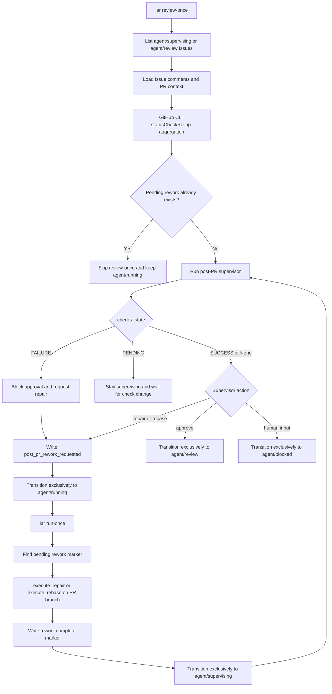

# PRD: Agent Runner CI Rework State Recovery

## 1. Introduction & Goals

`iar review-once` / `iar run-once` 当前在 post-PR 阶段对 CI 失败、rework marker 和 workflow labels 的处理不够严格。真实 fsense Issue #1 暴露了以下组合故障：

- Supervisor 曾返回 `repair_pr_branch` 并写入 `post_pr_rework_requested`，但后续一次 supervisor approval 覆盖了最新 event marker，导致 `run-once` 不再识别待 rework。
- Issue 同时残留 `agent/running` 和 `agent/review`，破坏了 workflow state 单一性。
- GitHub CLI 当前支持 `statusCheckRollup`，但 runner 查询 `statusCheckRollupState`，导致 CI 状态读取不可靠。
- Supervisor 在 PR checks 仍有 failure 时仍可进入 `agent/review`，把 CI 修复变成人工 follow-up。

目标是在不引入数据库、队列或新服务的前提下，让 Agent Runner 对 post-PR CI failure 保持可恢复、可审计、状态互斥：

1. `review-once` 能可靠读取 GitHub PR checks rollup，并把失败 checks 带入 supervisor prompt 和 event marker。
2. workflow state labels 始终保持互斥，任何状态切换都清理其他 durable workflow labels。
3. `repair_pr_branch` / `rebase_pr_branch` / `resolve_conflict` 请求在真正被 `run-once` 消费前不得被错误 approval 覆盖。
4. PR checks 失败时，runner 不允许自动进入 `agent/review`；必须触发 repair/rebase、等待 pending checks，或进入 blocked/failed。
5. `run-once` 能通过真实 CLI 路径消费 rework marker，并在现有 PR branch 上执行修复。
6. 本 PRD 负责抽取通用 workflow label transition 和 marker-history helper；后续 forbidden blocked resolution 等恢复任务必须复用这些 helper，不再复制 label remove list、latest-marker 扫描或 claim 状态机。

### Realistic Validation

除单元测试和集成测试外，本 PRD 要求通过**真实项目入口点**验证关键行为，确保真实使用路径生效，而非仅在隔离 fixture 中通过。

- [ ] **CI failure review-once 真实验证**：通过 `uv run iar review-once --repo <fixture-repo> --max-issues 1`，配合 PATH 中的 fake `gh`，验证 failed `statusCheckRollup` 不会进入 `agent/review`，而是写入 rework/blocking comment 并保持互斥 label。
- [ ] **pending rework run-once 真实验证**：通过 `uv run iar run-once --repo <fixture-repo> --max-issues 1`，验证带 `post_pr_rework_requested` marker 的 `agent/running` Issue 会执行 existing PR branch repair，而不是被最新 approval marker 或残留 `agent/review` 跳过。
- [ ] **label 互斥真实验证**：通过真实 CLI fixture 检查任意一次 state transition 后 Issue 不会同时包含 `agent/running`、`agent/review`、`agent/supervising`、`agent/blocked`、`agent/failed`。
- [ ] **为什么单元测试不够**：该问题发生在 CLI 目标解析、GitHub CLI JSON 字段、Issue comments marker 顺序、labels 当前状态和本地 worktree 路径共同作用时；单元测试无法证明真实入口组合路径收敛。

### Implementation Progress

2026-05-27 已完成一个最小安全修复切片：

- `GitHubCliClient.get_pull_request_context(...)` 已从 `statusCheckRollupState` 改为当前 GitHub CLI 支持的 `statusCheckRollup`，并聚合为 `SUCCESS`、`PENDING`、`FAILURE` 或 `None`。
- `PullRequestContext` 已新增 `checks_summary`，supervisor prompt 和 gate summary 可携带 failed/pending check 摘要。
- `pr_supervisor.guard_supervisor_action_for_pr_state(...)` 已加入 deterministic gate：PR 冲突时将 approval 改写为 `rebase_pr_branch`，checks failure 时将 approval 改写为 `repair_pr_branch`。
- `review_once` 已复用该 gate，防止 review polling 路径把冲突或 failed-check PR 放入 `agent/review`。
- 2026-05-28 补充修复：当 open PR 存在但完整 PR context 暂时无法读取时，`review_once`、发布/rework 后 supervisor 路径以及修复循环内的后续评审都会 defer，而不是构造未知 `mergeable` 的 fallback context 继续 approve；CLI outcome 日志也会明确显示 queued/deferred/approved。
- `docs/guides/agent-runner.md` 已记录 checks 聚合和 approval gate 行为。
- 已用真实 `gh` 对 keda PR #32 / branch `issue-28` 验证 adapter 可返回 `mergeable=False`，不再因 unsupported JSON field 丢失 PR context。

仍未完成：workflow label transition helper、marker history helper、pending rework consumption 修复、CLI smoke fixture，以及完整 label 互斥收敛。因此本 PRD 继续保留在 `tasks/pending/`。

## 2. Requirement Shape

**Actor**: 使用 `iar run-once`、`iar review-once` 或 `iar review-daemon` 运维跨仓库 Agent Runner 的本地 operator。

**Trigger**:

- PR 已创建并 linked 到 Issue，Issue 处于 `agent/supervising` 或 `agent/review`。
- GitHub PR checks 从 pending/success 变为 failure，或 supervisor 在 review 中发现 CI workflow / test / config gap。
- Supervisor 返回 `repair_pr_branch`、`rebase_pr_branch` 或 `resolve_conflict`。
- 后续 `iar run-once` 扫描 `agent/running` Issue。

**Expected Behavior**:

- `review-once` 从 GitHub CLI 当前可用字段读取 PR checks，并聚合为稳定的 `checks_state`。
- 若 checks failure 存在，runner 不允许 `approve_for_human_review` 直接进入 `agent/review`。
- 需要修复时，Issue 只保留 `agent/running`，最新 pending rework marker 可被 `run-once` 消费。
- `run-once` 在现有 PR branch worktree 中执行 repair/rebase，成功后重新进入 `agent/supervising` 并再次跑 supervisor。
- 所有失败路径都用互斥 workflow label 落到 `agent/blocked` 或 `agent/failed`，不产生多状态残留。
- 新增的 workflow / marker helper 必须是 phase-agnostic：当前用于 `post_pr_rework_requested`，也能被后续 `blocked_resolution_requested` 等恢复 marker 复用。

**Explicit Scope Boundary**:

- 不新增数据库、队列、后台服务、GitHub App 或 Webhook。
- 不改变 Issue/PR durable state 的来源，仍以 GitHub labels/comments/PR context 为准。
- 不自动 merge PR，不跳过人工 review。
- 不要求所有外部 CI infrastructure failure 都必须自动修好；若多次 repair 后仍失败，应进入 blocked 并保留诊断。
- 不修改目标仓库 fsense 的业务代码；本 PRD 只修改 keda 中 Agent Runner 机制。

## 3. Repository Context And Architecture Fit

**Current Relevant Modules/Files**:

| Path | Current Role | Observed Gap |
|---|---|---|
| `src/backend/api/cli.py` | `iar` CLI 参数解析与 use case 调用 | 真实入口应保持不承载业务状态机逻辑 |
| `src/backend/core/use_cases/review_once.py` | post-PR polling 单次处理 | 状态切换只局部 remove label；rework request 后可能留下 `agent/review` |
| `src/backend/core/use_cases/agent_runner_orchestrate.py` | `run-once` ready/running/rework 编排 | running rework 只认最新 event marker；workflow label helper 是私有函数 |
| `src/backend/core/use_cases/pr_supervisor.py` | post-PR supervisor prompt、action parse、repair/rebase 执行 | supervisor approval 没有 deterministic CI failure gate |
| `src/backend/core/use_cases/agent_runner_events.py` | `iar:event` marker parse/format | 当前只提供 latest marker 解析，缺少 pending rework 语义 |
| `src/backend/core/shared/models/agent_runner.py` | Core dataclasses | `PullRequestContext` 只有粗粒度 `checks_state`，缺少 failed check detail |
| `src/backend/infrastructure/github_client.py` | GitHub CLI adapter | 查询了当前 `gh` 不支持的 `statusCheckRollupState` |
| `docs/guides/agent-runner.md` | Agent Runner 操作文档 | 需要记录 CI gate、互斥 labels、rework marker 规则 |
| `tests/test_review_once.py` | review-once unit coverage | 需要覆盖 failed checks approval downgrade 和 label exclusivity |
| `tests/test_pr_supervisor.py` | supervisor prompt/action tests | 需要覆盖 checks aggregation 和 approval gate |
| `tests/test_run_agent.py` | run-once/rework orchestration tests | 需要覆盖 pending rework marker 不被 stale approval 覆盖 |

**Existing Path**:

最接近本需求的是现有 post-PR workflow：

```text
review-once
  -> _process_review_candidate
  -> run_post_pr_supervisor_cycle
  -> repair/rebase action
  -> build_rework_intent_comment
  -> agent/running
  -> run-once
  -> _process_running_rework
  -> execute_repair / execute_rebase
  -> _run_supervisor_with_repair_loop
```

**Reuse Candidates**:

- 复用 `IGitHubClient.get_pull_request_context(...)` 作为 PR context source，不新增 GitHub access path。
- 复用 `PullRequestContext` 承载 checks 状态，必要时扩展字段。
- 复用 `format_event_marker(...)` / `parse_latest_event_marker(...)`，补充 phase-agnostic marker history helper 而不是新增另一套 comment protocol。
- 复用 `edit_issue_labels(...)`，在 core 增加 workflow label transition helper，避免各 use case 手写不完整 remove list。该 helper 后续也作为 `agent/blocked -> agent/running` 等恢复认领路径的唯一入口。
- 复用 `execute_repair(...)` / `execute_rebase(...)`，不新增 repair executor。

**Architecture Constraints**:

- `src/backend/core/` 不得导入 `src/backend/infrastructure/`；GitHub CLI JSON 字段适配只能留在 infrastructure client 内。
- `src/backend/infrastructure/github_client.py` 只做适配和 JSON 转换，不承担 workflow 决策。
- workflow 决策、state transition、CI gate 必须在 `src/backend/core/use_cases/`。
- CLI 层继续只负责参数解析和依赖装配。

**Potential Redundancy Risks**:

- 直接在 `review_once.py`、`agent_runner_orchestrate.py` 各自复制 label remove list，会再次出现状态残留。
- 直接在 prompt 中要求 supervisor 不 approve failed CI，而没有 core hard gate，会继续受 agent 判断波动影响。
- 新建持久 rework queue 会复制 GitHub labels/comments 已承担的 durable state，增加恢复复杂度。

## 4. Recommendation

### Recommended Approach

采用最小闭环修复：

1. 在 core 增加一个小型 workflow state helper，统一计算 durable workflow labels，并提供 “replace state label” 行为。
2. 修复 GitHub CLI PR checks adapter，从 `statusCheckRollup` 聚合出 `SUCCESS`、`PENDING`、`FAILURE` 或 `None`，并保留 failed/pending check 摘要。
3. 在 supervisor cycle 后增加 deterministic CI gate：当 PR checks failure 存在时，`approve_for_human_review` 不得生效，必须转为 repair 或 blocked。
4. 修正 review/run state transitions，使 `agent/running`、`agent/review`、`agent/supervising`、`agent/blocked`、`agent/failed` 永远互斥。
5. 补充 pending rework marker 语义，确保未被实际消费的 `post_pr_rework_requested` 不会因为后续 stale approval 失效。
6. 将 workflow label transition 和 marker-history helper 设计为通用能力，供 forbidden blocked resolution 等后续恢复 PRD 复用。
7. 更新 tests 和 docs，并通过真实 CLI fixture 验证 `review-once` 和 `run-once` 的组合路径。

### Why This Fits The Current Architecture

- 变更集中在现有 Agent Runner workflow use cases，不新增服务边界。
- GitHub CLI 字段变化只影响 infrastructure adapter，core 继续依赖 `IGitHubClient` 和 domain model。
- label 互斥 helper 是对现有 `_workflow_state_labels(...)` 私有逻辑的提取，降低重复而不是引入新状态源。
- CI failure gate 放在 core，能约束所有 agent 输出，不依赖 prompt 的非确定性。

### Rationale For Rejecting Redundant Abstractions

- 不引入数据库 rework table：当前 durable state 已经在 GitHub Issue labels/comments 和 PR context 中，新增 DB 会产生同步一致性问题。
- 不引入 webhook：本地 runner 的设计是 polling CLI/daemon，webhook 需要公网入口、鉴权和额外部署面。
- 不新增独立 CI analyzer service：checks 聚合是 GitHub adapter 的自然职责，修复决策属于现有 supervisor workflow。

### Alternatives Considered

| Alternative | Description | Rejected Because |
|---|---|---|
| Prompt-only fix | 只修改 supervisor prompt，要求 CI failure 时不要 approve | 不能防止 agent 错判，真实 incident 已证明 supervisor 可能把 failure 当 follow-up |
| Manual operator cleanup | 要求 operator 手工移除 `agent/review` 并重新 comment marker | 不能解决 daemon 自动路径，仍会重复出现状态残留 |
| New durable queue | 把 rework intent 写入本地文件或数据库 | 与 GitHub comments/labels 形成第二状态源，恢复和跨仓库运行更复杂 |

## 5. Implementation Guide

This section is a living implementation guide based on current repository analysis. If implementation discovers additional affected files, hidden dependencies, edge cases, or a better path, update this PRD before proceeding.

### Core Logic

#### 1. Workflow Label Exclusivity

新增或提取 core helper，例如 `src/backend/core/use_cases/agent_runner_workflow.py`：

- `workflow_state_labels(config: AppConfig) -> list[str]`
- `transition_issue_workflow_state(github_client, issue_number, config, target_label)`
- `build_transition_labels(current_labels, config, target_label) -> list[str]`
- `find_latest_unconsumed_marker(comments, phase, completion_phases, current_head) -> ReviewEventMarker | None`

规则：

- durable workflow labels 包括 ready、running、supervising、review、failed、blocked。
- transition 时 `add=[target_label]`，`remove=[all workflow labels except target_label]`。
- 保留 agent routing labels，例如 `agent/codex`、`agent/claude`、`agent/kimi`。
- 所有 use case 禁止手写局部 `remove=[config.labels.supervising]` 来完成状态切换。
- marker history helper 不得写死 `post_pr_rework_requested`；调用方传入目标 phase 和 completion phases。CI rework 使用 `post_pr_rework_requested`，forbidden blocked resolution 可复用同一 helper 查找 `blocked_resolution_requested`。
- 本 PRD 不实现 forbidden blocked resolution 的业务流程，只保证 helper shape 足以支持后续 `agent/blocked -> agent/running` claim。

#### 2. GitHub Checks Rollup Adapter

修改 `GitHubCliClient.get_pull_request_context(...)`：

- 查询字段改为 `url,headRefName,headRefOid,baseRefOid,mergeable,statusCheckRollup`。
- 对 `statusCheckRollup` 聚合：
  - 任一 check/status conclusion 为 failure 类结果时：`checks_state="FAILURE"`。
  - 任一 check/status 仍 queued、in_progress、pending 或无 conclusion 时：`checks_state="PENDING"`。
  - 所有 check/status 都成功、skipped 或 neutral 时：`checks_state="SUCCESS"`。
  - rollup 为空数组或字段缺失时：`checks_state=None`。
- 保留 failed/pending check 摘要，例如 check name、workflow name、status、conclusion、details URL。

建议在 `PullRequestContext` 中新增可选字段：

```python
checks_summary: tuple[str, ...] = ()
```

如果需要更结构化，可新增 `PullRequestCheckSummary` dataclass，但只有当 prompt 和 tests 需要字段级断言时才引入。

#### 3. Supervisor CI Gate

在 `run_post_pr_supervisor_cycle(...)` parse agent action 后加 deterministic gate：

- `checks_state == "PENDING"`:
  - 不允许 approve。
  - 返回或转换为 `request_human_input` 不合适，因为 pending 是暂态。
  - 推荐新增 action handling：保持 `agent/supervising` 并写 comment 表示等待 checks 完成。
  - 若不新增 action，最小实现可把 pending 视为 `request_human_input` 之外的 internal skip，由 `review_once` 不做 label 改动。
- `checks_state == "FAILURE"`:
  - 若 supervisor 返回 `approve_for_human_review`，覆盖为 `repair_pr_branch`，summary 说明 approval 被 CI failure gate 拦截。
  - 若 repair 已超过 `max_repair_attempts`，进入 `agent/blocked`，comment 列出失败 checks 和已尝试次数。
- `checks_state is None`:
  - 兼容无 CI 的仓库，不阻断 approval。

为了保持 target-state 简洁，本 PRD 推荐不新增 public action 名称，直接在 core 内把 failed-check approval 改写为 `repair_pr_branch`，并在 comment summary 中明确说明。

#### 4. Pending Rework Marker Semantics

当前 `_guard_running_issue_is_rework(...)` 只检查 latest marker 是否为 `post_pr_rework_requested`。需要改成更稳健：

- 对 `agent/running` Issue，从 comments 倒序扫描 event markers。
- 找到最近的 `post_pr_rework_requested` 且其 head 仍等于 open PR head 时，视为 pending rework。
- 如果在该 marker 之后出现明确完成 marker，例如 `rebase_repair_complete`，且 head 已变化，则视为已消费。
- 如果在该 marker 之后只出现同 head 的 `post_pr_supervisor approve`，不得取消 pending rework，除非 Issue 已不在 `agent/running`。

同时修复 `_process_running_rework(...)` 成功执行 repair/rebase 后的 comment：

- 不再再次写 `post_pr_rework_requested`。
- 使用现有但未使用的 `build_rebase_repair_complete_comment(...)`，或新增更准确的 `build_rework_complete_comment(...)`。
- 完成后 transition 到 `agent/supervising`，再跑 supervisor loop。

#### 5. Review Once State Handling

修改 `_process_review_candidate(...)`：

- 如果 candidate 当前 labels 包含 `agent/running`，并且存在 pending rework marker，跳过 review-once，避免覆盖 run-once 待处理 work。
- 从 `agent/review` 进入 review cycle 时，用 transition helper 切到 `agent/supervising`，不是局部 add/remove。
- `approve_for_human_review` 用 transition helper 切到 `agent/review`。
- `repair_pr_branch` / `rebase_pr_branch` / `resolve_conflict` 用 transition helper 切到 `agent/running`。
- `request_human_input` 切到 `agent/blocked`。
- `mark_failed` 和异常路径切到 `agent/failed`。

#### 6. Run Once Rework Handling

修改 `run_once(...)` running issue selection：

- 继续只扫描 `agent/running`。
- 使用新的 pending rework helper，而不是 latest marker helper。
- 若 pending rework 存在但 worktree 路径不存在，进入 `agent/blocked` 并 comment 明确说明缺失 worktree path 和恢复命令建议，而不是混合 `agent/running`/`agent/failed`。
- 若 open PR head 与 marker head 不一致，刷新 context 后重新确认是否需要 repair，避免旧 marker 修错 head。

### Change Impact Tree

```text
.
├── Infrastructure
│   └── src/backend/infrastructure/github_client.py
│       [修改]
│       【总结】适配当前 GitHub CLI 的 statusCheckRollup 字段并聚合 PR checks 状态。
│
│       ├── 查询字段从 statusCheckRollupState 改为 statusCheckRollup
│       ├── 聚合 check/status conclusion 为 SUCCESS/PENDING/FAILURE/None
│       └── 将失败或 pending checks 摘要写入 PullRequestContext
│
├── Domain
│   ├── src/backend/core/shared/models/agent_runner.py
│   │   [修改]
│   │   【总结】扩展 PR context 以承载 checks 聚合结果和可读摘要。
│   │
│   │   ├── 为 PullRequestContext 增加 checks_summary 可选字段
│   │   └── 保持默认值兼容现有 tests/fixtures
│   │
│   ├── src/backend/core/use_cases/agent_runner_workflow.py
│   │   [新增]
│   │   【总结】集中提供 Agent Runner workflow label 互斥转换和 phase-agnostic marker history 判断。
│   │
│   │   ├── 提供 workflow_state_labels
│   │   ├── 提供 transition_issue_workflow_state
│   │   ├── 提供 build_transition_labels
│   │   └── 提供 find_latest_unconsumed_marker
│   │
│   ├── src/backend/core/use_cases/review_once.py
│   │   [修改]
│   │   【总结】让 review polling 遵守 CI gate、pending rework guard 和互斥 label transition。
│   │
│   │   ├── 跳过已有 pending rework 的 running/review 脏状态 Issue
│   │   ├── 所有 action 使用统一 workflow transition helper
│   │   └── exception path 不再基于 stale issue.labels 清理状态
│   │
│   ├── src/backend/core/use_cases/agent_runner_orchestrate.py
│   │   [修改]
│   │   【总结】让 run-once 稳定消费 pending rework marker 并统一 workflow state cleanup。
│   │
│   │   ├── 使用 shared workflow_state_labels helper 替换私有重复逻辑
│   │   ├── running rework guard 改为调用 phase-agnostic marker history helper
│   │   ├── repair/rebase 完成后写 complete marker 而不是再次写 request marker
│   │   └── failure/blocking path 只保留一个 workflow label
│   │
│   └── src/backend/core/use_cases/pr_supervisor.py
│       [修改]
│       【总结】加入 deterministic CI failure approval gate 并把 checks 摘要传给 supervisor。
│
│       ├── prompt 中列出 checks_state 和 failed/pending check summaries
│       ├── failed checks 时拦截 approve_for_human_review
│       └── pending checks 时避免错误进入 human review
│
├── API
│   └── src/backend/api/cli.py
│       [不修改预期]
│       【总结】CLI 继续作为真实入口和依赖装配层，无业务状态机变更。
│
├── Tests
│   ├── tests/test_review_once.py
│   │   [修改]
│   │   【总结】覆盖 failed checks、pending rework、互斥 labels 和 dirty label recovery。
│   │
│   ├── tests/test_pr_supervisor.py
│   │   [修改]
│   │   【总结】覆盖 supervisor approval 被 CI failure gate 改写为 repair/blocking。
│   │
│   ├── tests/test_run_agent.py
│   │   [修改]
│   │   【总结】覆盖 run-once 对 pending rework marker 的消费和 complete marker 写入。
│   │
│   ├── tests/test_github_client.py
│   │   [新增或修改]
│   │   【总结】用 GitHub CLI JSON fixture 验证 statusCheckRollup 聚合。
│   │
│   └── tests/test_agent_runner_cli.py
│       [修改]
│       【总结】增加通过真实 iar CLI 入口执行 review-once/run-once 的 fake gh smoke。
│
└── Docs
    └── docs/guides/agent-runner.md
        [修改]
        【总结】记录 CI gate、互斥 workflow labels、pending rework 和恢复操作。
```

### Flow Or Architecture Diagram



### Realistic Validation Plan

| Behavior | Real Entry Point | Test Layer | Mock Boundary | Data/Env Needed | Command Or Procedure | Required For Acceptance |
|---|---|---|---|---|---|---|
| failed PR checks cannot be approved into review | `uv run iar review-once --repo <fixture-repo> --max-issues 1` | CLI smoke + integration | Mock GitHub via PATH fake `gh`; real CLI parser, settings loader, core use cases, local filesystem | Temp git repo with `.iar.toml`, fake Issue #1 with `agent/review`, PR JSON with failed `statusCheckRollup`, existing worktree path | Run CLI with fake `gh`, then inspect fake gh call log for exclusive label transition to `agent/running` or `agent/blocked` and no final `agent/review` | Yes |
| pending rework is consumed by run-once | `uv run iar run-once --repo <fixture-repo> --max-issues 1 --agent codex` | CLI smoke + integration | Mock GitHub via PATH fake `gh`; mock agent executable via PATH fake `codex`; real git worktree commands where feasible | Temp repo/worktree on branch `issue-1`, Issue comments include `post_pr_rework_requested`, open PR head matches marker | Run CLI and assert fake agent received repair prompt, commit-request path was honored, and labels moved running -> supervising/review according to supervisor result | Yes |
| workflow labels remain mutually exclusive | `uv run iar review-once` and `uv run iar run-once` fixture commands | CLI smoke + integration | Mock only GitHub/agent boundary; label transition helper real | Fixture Issue intentionally starts with `agent/running` + `agent/review` + `agent/failed` | After command, inspect fake `gh issue edit` calls and final fixture state: exactly one durable workflow label remains | Yes |
| statusCheckRollup aggregation works for current gh JSON shape | `GitHubCliClient.get_pull_request_context` through fake process runner | unit/integration | Mock process runner stdout only | JSON samples for CheckRun success/failure/pending, empty rollup, status context style objects | `uv run pytest tests/test_github_client.py -q` | Yes |
| no broad regression in Agent Runner | existing test suite | regression | Existing tests mock external boundaries | Local development env with uv dependencies | `just test` | Yes |
| optional live GitHub sanity check | `uv run iar review-once --repo /Users/zata/code/fsense --max-issues 1 --agent claude` | manual/sandbox | No mocks; live GitHub CLI auth and disposable Issue/PR only | `gh auth status`, target repo with disposable PR whose checks can fail safely | Opt-in only when `IAR_LIVE_GITHUB_VALIDATION=1`; verify live Issue never ends with multiple workflow labels and failed checks do not auto-approve | No |

Live GitHub validation is useful but not required for acceptance because it depends on credentials, remote repo state, and safe disposable PR availability. The fake `gh` CLI smoke must still exercise the real `iar` command path.

### Low-Fidelity Prototype

No UI changes in this PRD. No low-fidelity prototype required.

### ER Diagram

No data model changes in this PRD.

### Interactive Prototype Change Log

No interactive prototype file changes in this PRD.

### External Validation

No external validation required; repository evidence and local `gh --json` behavior were sufficient.

## 6. Definition Of Done

- `GitHubCliClient.get_pull_request_context(...)` works with current `gh pr list --json statusCheckRollup` output and produces stable checks state.
- `review-once` and `run-once` use a single shared workflow label transition path and no longer leave multiple durable workflow labels on an Issue.
- failed PR checks cannot be automatically approved into `agent/review`.
- pending rework markers are consumed by `run-once` through the real CLI path and are not invalidated by stale same-head supervisor approval.
- successful repair/rebase writes a completion marker and returns to `agent/supervising` for another supervisor pass.
- shared workflow / marker helpers are generic enough for later `blocked_resolution_requested` recovery without adding another label transition or marker scanning implementation.
- Unit tests, integration tests, CLI smoke tests, docs build, and `just test` pass.
- `docs/guides/agent-runner.md` describes the updated CI gate and recovery behavior.
- No backend architecture dependency direction is violated.

## 7. Acceptance Checklist

### Architecture Acceptance

- [x] `src/backend/api/cli.py` remains a thin CLI adapter and does not gain workflow decision branches.
- [x] GitHub CLI JSON field handling remains in `src/backend/infrastructure/github_client.py`.
- [ ] CI gate, pending rework semantics, and label transition decisions live in `src/backend/core/use_cases/`.
- [ ] Workflow transition and marker-history helpers are phase-agnostic and not named around CI or rework only.
- [x] No new database, queue, HTTP service, webhook receiver, or persistent local state source is introduced.

### Dependency Acceptance

- [x] `src/backend/core/` does not import `src/backend/infrastructure/`, `src/backend/engines/`, or `src/backend/api/`.
- [ ] New shared workflow helper imports only core models/interfaces.
- [x] Existing `IGitHubClient` contract remains the boundary between core and GitHub CLI implementation.

### Behavior Acceptance

- [x] `statusCheckRollup` with one failed CheckRun yields `PullRequestContext.checks_state == "FAILURE"` and includes the failed check name in the summary.
- [x] Empty `statusCheckRollup` yields `checks_state is None` and does not block approval for repos without CI.
- [x] `review-once` receiving supervisor `approve_for_human_review` while `checks_state == "FAILURE"` does not transition to `agent/review`.
- [x] `review-once` writes or preserves a rework/blocking comment that names failed checks when approval is blocked by CI failure.
- [ ] `repair_pr_branch`, `rebase_pr_branch`, and `resolve_conflict` transitions leave only `agent/running` among durable workflow labels.
- [ ] `approve_for_human_review` transitions leave only `agent/review` among durable workflow labels.
- [ ] exception paths in `review-once` and `run-once` leave only `agent/failed` or `agent/blocked`, not mixed workflow labels.
- [ ] `run-once` detects a pending `post_pr_rework_requested` marker even if a later same-head supervisor approval exists on a dirty-label Issue.
- [ ] successful `_process_running_rework(...)` writes a completion marker, not another `post_pr_rework_requested` marker.
- [ ] missing rework worktree path produces an actionable blocked/failed comment and does not leave `agent/running` plus another workflow label.
- [ ] a unit-level helper test proves non-workflow labels are preserved while workflow labels are replaced, so future blocked-resolution CAS can reuse the same computation.

### Documentation Acceptance

- [x] `docs/guides/agent-runner.md` documents checks aggregation and failed-check/conflict approval gates.
- [ ] `docs/guides/agent-runner.md` documents pending checks behavior.
- [ ] `docs/guides/agent-runner.md` documents that durable workflow labels are mutually exclusive.
- [ ] `docs/guides/agent-runner.md` documents how `post_pr_rework_requested` is consumed and how operators recover a blocked missing-worktree case.

### Validation Acceptance

- [x] `uv run pytest tests/test_github_client.py tests/test_pr_supervisor.py tests/test_review_once.py tests/test_run_agent.py -q` passes.
- [ ] A CLI smoke test or documented fixture runs `uv run iar review-once --repo <fixture-repo> --max-issues 1` and proves failed checks do not enter `agent/review`.
- [ ] A CLI smoke test or documented fixture runs `uv run iar run-once --repo <fixture-repo> --max-issues 1` and proves pending rework is consumed.
- [x] `uv run mkdocs build` passes after docs updates.
- [x] `just test` passes before marking the PRD task complete.

## 8. Functional Requirements

**FR-1**: `GitHubCliClient.get_pull_request_context(...)` must query `statusCheckRollup`, not `statusCheckRollupState`.

**FR-2**: PR checks must be aggregated into `SUCCESS`, `PENDING`, `FAILURE`, or `None` using deterministic rules.

**FR-3**: Failed or pending check names and details must be available to the supervisor prompt and/or result comment.

**FR-4**: `approve_for_human_review` must not transition to `agent/review` when `checks_state == "FAILURE"`.

**FR-5**: `checks_state == "PENDING"` must not trigger repair or human review approval; the Issue must remain observable for a later checks state transition.

**FR-6**: All workflow state transitions must remove every durable workflow label except the target state.

**FR-7**: Agent routing labels such as `agent/codex`, `agent/claude`, and `agent/kimi` must not be removed by workflow state transitions.

**FR-8**: `review-once` must not overwrite a pending rework request on an Issue that is already effectively in `agent/running`.

**FR-9**: `run-once` must detect pending rework by scanning event marker history, not only by checking the latest marker.

**FR-10**: `run-once` must verify the pending rework marker branch and head against the open PR before executing repair/rebase.

**FR-11**: successful repair/rebase must write a completion marker and transition back to `agent/supervising`.

**FR-12**: missing worktree during pending rework must produce an actionable failure/blocking comment with the expected path and recovery suggestion.

**FR-13**: Existing ready Issue implementation flow must keep current behavior except for shared workflow label cleanup.

**FR-14**: Tests must cover the fsense incident shape: failed checks, rework request, stale approval, dirty labels, and later `run-once` consumption.

**FR-15**: Documentation must describe CI gate and label exclusivity in operator-facing language.

**FR-16**: The workflow transition helper must preserve non-workflow labels and be reusable for any target workflow label, including future `agent/blocked -> agent/running` recovery claims.

**FR-17**: The marker-history helper must accept a marker phase and completion phases as parameters; it must not hard-code only `post_pr_rework_requested`.

## 9. Non-Goals

- No automatic PR merge.
- No GitHub webhook receiver or GitHub App migration.
- No durable local database or queue for runner state.
- No broad rewrite of Agent Runner architecture.
- No attempt to classify every possible CI infrastructure outage perfectly.
- No changes to fsense application behavior as part of this PRD.
- No new frontend or operations console behavior.
- No implementation of forbidden-path blocked recovery in this PRD; it only provides the shared helper surface that that PRD must reuse.

## 10. Risks And Follow-Ups

| Risk | Impact | Mitigation |
|---|---|---|
| Some repos have flaky infrastructure-only CI failures | Runner may spend repair attempts on non-code failures | Bound by `max_repair_attempts`, then block with failed check details for human action |
| GitHub CLI rollup object shapes vary between CheckRun and StatusContext | Incorrect aggregation could block or approve incorrectly | Add fixture tests for known shapes and default unknown active objects to pending/failure-safe behavior |
| Dirty historical Issues have mixed labels and stale markers | First run after deployment may need cleanup | Transition helper must clean mixed states opportunistically when any candidate is processed |
| Pending checks may stay pending indefinitely | Issue remains supervising | Document operator recovery and rely on daemon interval; optionally block after future configurable timeout, but not in this PRD |

## 11. Decision Log

| ID | Decision | Chosen | Rejected | Rationale |
|---|---|---|---|---|
| D-01 | Durable workflow state source | Keep GitHub labels/comments as the only durable runner state | Add DB or local queue | The current runner is a local polling CLI and already recovers from GitHub state without extra storage. |
| D-02 | CI failure enforcement | Add deterministic core gate that blocks failed-check approval | Prompt-only supervisor instruction | Agent output is non-deterministic and already approved a PR while checks were failing. |
| D-03 | Label state handling | Add shared workflow label transition helper | Continue per-file add/remove lists | The incident left mixed `agent/running` and `agent/review`, proving local remove lists are error-prone. |
| D-04 | Checks adapter | Aggregate `statusCheckRollup` in `GitHubCliClient` | Keep querying `statusCheckRollupState` | The local GitHub CLI exposes `statusCheckRollup`, and the unsupported field makes PR context unreliable. |
| D-05 | Pending rework detection | Scan marker history for unconsumed rework intent | Require latest marker to be `post_pr_rework_requested` | A stale same-head supervisor approval can otherwise hide a pending repair request. |
| D-06 | Pending checks behavior | Keep supervising and wait for state change | Treat pending as repair or human input | Pending checks are not yet actionable failures and should not consume repair attempts prematurely. |
