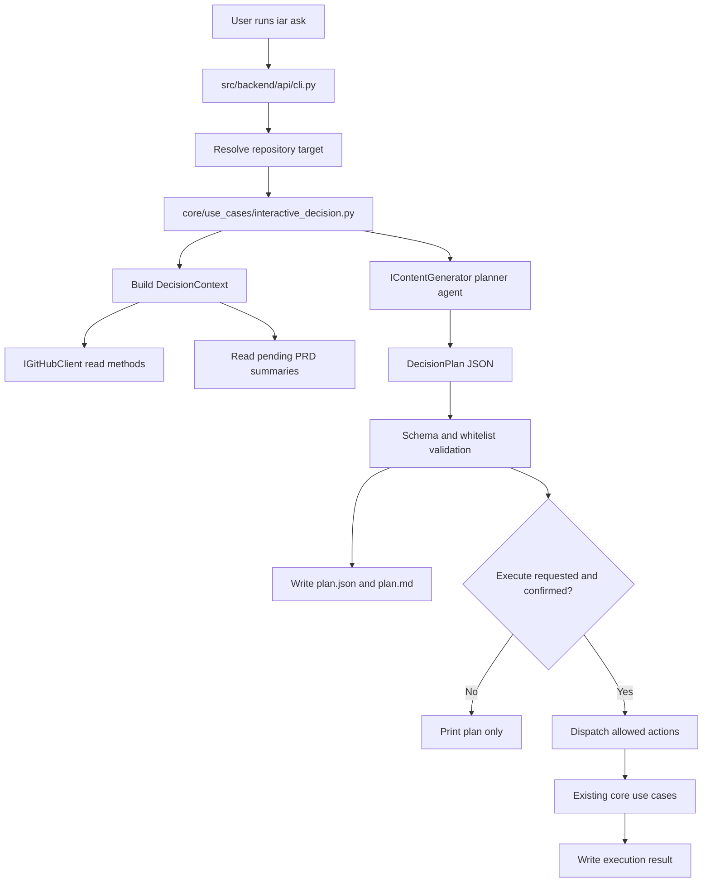
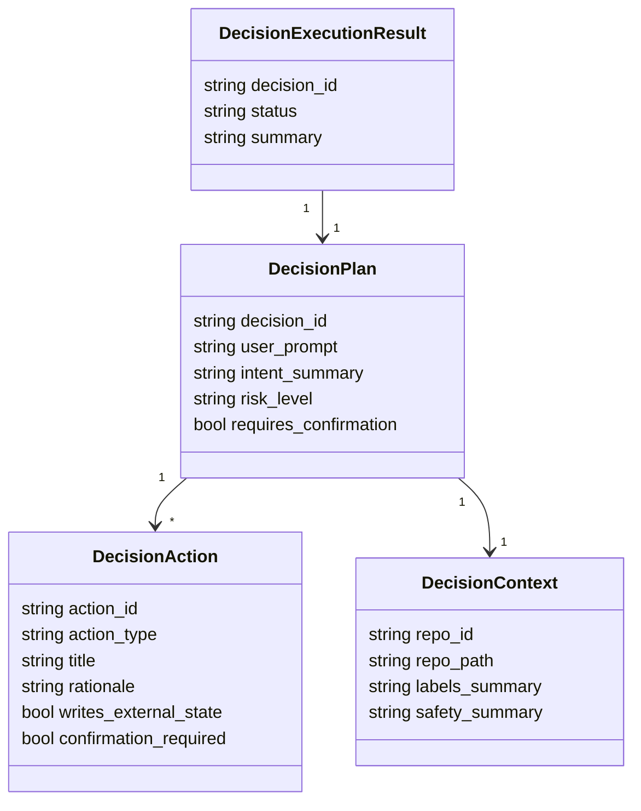

# PRD: Agent Runner 受限自然语言决策入口 (`iar ask`)

- GitHub Issue: https://github.com/zata-zhangtao/keda/issues/38

- Supersedes: 本文件旧版 `Agent Runner 自然语言总入口 (iar ask) -- 1 个月内不实现` 暂缓结论

## 1. 引言与目标 (Introduction & Goals)

### 问题说明

当前 `iar` 已经具备 GitHub Issue 队列、`issue-from-prd`、`run-once`、`review-once`、`daemon`、`recover-publish` 和 `deliberate` 等能力，但这些能力仍要求操作者理解精确子命令、标签状态机、PRD 与 Issue 的关系，以及何时应该创建 Issue、标记 ready 或启动 runner。

旧版同主题 PRD 的结论是暂缓实现自然语言入口，原因是担心 LLM 误路由、写操作不可控、默认值策略不清晰以及 CLI chat 形态不稳。现在重新打开该需求的前提不是实现通用 ChatOps，而是实现一个**受限、可审计、默认只生成计划、确认后才执行白名单动作**的决策入口。

### 目标

- 新增 `iar ask` CLI 入口，让用户用自然语言描述目标，例如“帮我判断哪个 PRD 应该创建 issue”或“看看现在是否可以启动一个任务”。
- 直接接入本地 `codex` / `claude` / `kimi` 中的一个 agent 作为只读 planner，生成结构化 `DecisionPlan`，而不是让模型直接操作 GitHub 或 shell。
- 默认只输出计划和风险，不产生 GitHub label、Issue、PR、branch、commit 或 worktree 副作用。
- 所有可执行动作必须属于白名单，并且最终调用现有 use case，不新增平行执行路径。
- 写操作必须经过显式确认；高风险动作不支持 `--yes` 静默执行。
- 每次计划和执行结果落盘到 `logs/agent-runner/decisions/<decision_id>/`，便于审计和复现。
- 更新 `docs/guides/agent-runner.md`、`README.md` 和配置文档，说明 `iar ask` 的权限边界和推荐用法。

### Realistic Validation

除单元测试和集成测试外，本 PRD 要求通过**真实项目入口点**验证关键行为，确保真实使用路径生效，而非仅在隔离 fixture 中通过。

- [ ] **计划生成真实验证**：通过 `uv run iar ask "判断下一步应该做什么" --repo <fixture-repo> --agent codex --plan-only`，在 PATH 注入 fake `codex`，验证 CLI 输出结构化计划并写入 `logs/agent-runner/decisions/`。
- [ ] **确认执行真实验证**：通过 `uv run iar ask "从 PRD 创建 issue" --repo <fixture-repo> --agent codex --execute`，在 PATH 注入 fake `codex` 和 fake `gh`，验证未确认时不执行，确认后只调用白名单 use case。
- [ ] **写操作防护真实验证**：通过 fake planner 返回未允许动作（如 `git_push`、`daemon` 或任意 shell 命令），验证真实 CLI 返回非零并且没有 GitHub/fake `gh` 写调用。
- [ ] **为什么单元测试不够**：本功能横跨 CLI 参数解析、agent 子进程、仓库目标解析、GitHub client 适配、use case 调度和本地审计文件；真实入口验证可以证明这些边界按生产路径连接。

## 2. 需求形态 (Requirement Shape)

- **Actor**：本地运行 `iar` 的开发者或 operator。
- **Trigger**：用户执行 `iar ask "<自然语言需求>"`，希望系统判断是否应创建 Issue、标记 ready、启动任务、运行 review、或先做只读分析。
- **Expected Behavior**：
  1. CLI 解析目标仓库和用户自然语言输入。
  2. 系统收集受限上下文，包括当前仓库 `.iar.toml`、pending PRD 列表摘要、ready/supervising/review Issue 摘要、相关配置摘要和安全边界。
  3. 只读 planner agent 生成严格 JSON `DecisionPlan`。
  4. core 层校验 plan schema、白名单动作、风险级别、必要参数和确认策略。
  5. 默认打印计划并落盘，不执行任何副作用。
  6. 用户显式确认后，系统按顺序调用现有 use case 执行允许动作，并写入执行结果。
- **Explicit Scope Boundary**：
  - 仅做单轮意图决策，不做多轮记忆或长期偏好学习。
  - 不允许模型执行任意 shell 命令。
  - 不允许自动 merge、直接 push main、创建非 draft PR、启动 daemon、修改生产系统或访问真实业务数据。
  - 不替代 `iar deliberate`；复杂方案讨论仍由 `iar deliberate` 负责。
  - 不替代 pending 的 `prd-from-issue` 工作流；自由文本需求若缺少 PRD，`iar ask` 只能建议先创建/补齐 PRD，除非该功能已由对应 PRD 实现。

## 3. 仓库上下文与架构适配 (Repository Context And Architecture Fit)

### Existing Path

| 文件或模块 | 当前职责 | 本 PRD 相关性 |
|---|---|---|
| `src/backend/api/cli.py` | 注册 `iar` 子命令，解析参数，调用 core use case | 新增 `ask` 子命令，保持 API 层只做入口适配 |
| `src/backend/core/use_cases/run_agent_deliberation.py` | 只读多 agent 合议，带事件和输出落盘 | 复杂分析可复用，但 V1 不把简单意图路由默认升级为合议 |
| `src/backend/core/use_cases/generated_content.py` | 通过 `IContentGenerator` 调用本地只读 agent 生成内容 | planner agent 可复用相同只读子进程能力，新增决策专用 prompt 与 JSON 解析 |
| `src/backend/core/use_cases/create_issue_from_prd.py` | PRD -> GitHub Issue 工作流 | `create_issue_from_prd` 白名单动作必须调用该 use case |
| `src/backend/core/use_cases/run_agent_once.py` | ready Issue 执行入口和 agent 选择 | `run_once` / `dry_run` 白名单动作必须调用该 use case |
| `src/backend/core/use_cases/review_once.py` | supervising/review Issue 的 supervisor 检查 | `review_once` 白名单动作必须调用该 use case |
| `src/backend/core/shared/interfaces/agent_runner.py` | `IContentGenerator`、`IGitHubClient`、`IProcessRunner` 等端口 | core 新用例只能依赖这些端口 |
| `src/backend/core/shared/models/agent_runner.py` | runner 配置和领域模型 | 可新增 interactive decision 纯模型或拆到专门模型文件 |
| `src/backend/engines/agent_runner/factory.py` | settings -> core config 映射，创建 content generator / GitHub client | 新增 settings 映射和 planner runner 装配 |
| `src/backend/infrastructure/config/settings.py` | Pydantic settings 定义 | 新增 `[agent_runner.interactive_decision]` 配置 |
| `docs/guides/agent-runner.md` | `iar` 使用指南 | 需要补充 `iar ask` 权限边界、示例和故障排查 |
| `README.md` | 快速开始 | 需要加入最小用法示例 |

### Existing Architecture Pattern To Follow

- `api/cli.py` 只解析参数、创建 adapter、调用 use case，不承载业务规则。
- `core/use_cases/` 负责 plan 校验、白名单动作调度和状态流转判断。
- `core/shared/interfaces/` 定义跨层端口；core 不直接导入 `engines/` 或 `infrastructure/`。
- `engines/agent_runner/factory.py` 负责把 settings 和具体 subprocess/GitHub 实现装配给 core。
- GitHub 操作统一通过 `IGitHubClient`，不能在 planner 或 CLI 中直接拼接 `gh` 命令。
- 文本文件读写必须显式 `encoding="utf-8"`。

### Ownership And Dependency Boundaries

```text
src/backend/api/cli.py
  -> src/backend/core/use_cases/interactive_decision.py
     -> IContentGenerator / IGitHubClient / IProcessRunner ports
     -> existing core use cases:
        - create_issue_from_prd
        - run_agent_once
        - review_once
        - run_agent_deliberation
  -> src/backend/engines/agent_runner/factory.py
     -> infrastructure adapters
```

### Constraints From Runtime, Docs, Tests, Or Workflows

- Python 项目优先使用 `uv` 和 `just`。
- 实现完成后必须运行 `just test`。
- 行为变更需要同步 `docs/`，如新增长期文档页则更新 `mkdocs.yml`。
- pending PRD 可保留未完成 checklist；归档前必须全部完成并移动到 `tasks/archive/`。
- 单文件非空行不得超过 1000 行；不要把所有决策逻辑塞进 `cli.py` 或既有大型 use case。
- `iar deliberate` 明确只读，不应被修改为带写权限的执行入口。

## 4. 推荐方案 (Recommendation)

### Recommended Approach

推荐在现有 `iar` CLI 中新增 `ask` 子命令，并新增一个核心用例 `interactive_decision`，实现“只读计划 -> 严格校验 -> 用户确认 -> 白名单执行”的闭环。

#### CLI 形态

```bash
# 默认只生成计划，不执行副作用
uv run iar ask "帮我判断现在应该创建 issue 还是启动任务"

# 显式选择 planner agent
uv run iar ask "从 pending PRD 中挑一个最适合创建 issue 的任务" --agent codex

# 只打印计划，适合 CI 或脚本验证
uv run iar ask "现在可以跑一个 ready issue 吗" --plan-only

# 进入确认执行；TTY 中要求输入 decision_id 或 action_id
uv run iar ask "从 tasks/pending/example.md 创建 issue，但不要直接 ready" --execute

# 非交互执行只允许 low/medium 风险且所有动作可自动确认
uv run iar ask "运行一次 dry-run 看看 ready 队列" --execute --yes
```

#### 白名单动作

V1 只允许以下动作类型：

| Action Type | 是否写操作 | 默认确认 | 调用路径 |
|---|---:|---:|---|
| `show_status` | 否 | 否 | 读取 repository context、配置摘要、Issue 摘要 |
| `run_deliberation` | 否 | 否 | `run_agent_deliberation()` |
| `create_issue_from_prd` | 是 | 是 | `create_issue_from_prd()` |
| `mark_issue_ready` | 是 | 是 | `IGitHubClient.edit_issue_labels()`，仅限已存在 Issue |
| `run_once_dry_run` | 否 | 否 | `run_agent_once(..., dry_run=True)` |
| `run_once` | 是 | 是 | `run_agent_once(..., dry_run=False, max_issues=1 默认)` |
| `review_once` | 可能写 Issue comment/label | 是 | `review_once()` |
| `needs_clarification` | 否 | 否 | 打印问题，不执行 |
| `no_op` | 否 | 否 | 打印原因，不执行 |

禁止动作包括但不限于：任意 shell、`git push`、`git merge`、`git reset`、`daemon`、`review-daemon`、自动 merge、直接关闭 Issue、删除分支、修改 secret 文件、访问生产系统。

#### Planner agent

- 默认 agent 由 `[agent_runner.interactive_decision].default_agent` 控制，建议默认 `claude` 或 `auto`。
- planner prompt 必须要求输出严格 JSON，不得输出自然语言加 JSON 混合体作为执行依据。
- planner 输出只能表达意图和参数，不能包含 shell command。
- `core` 层必须独立校验 action type、参数、风险和确认要求；planner 的判断不能直接变成执行权限。

#### DecisionPlan 核心模型

建议新增 `src/backend/core/shared/models/agent_decision.py`，避免继续膨胀 `agent_runner.py`：

```python
@dataclass(frozen=True)
class DecisionPlan:
    decision_id: str
    user_prompt: str
    intent_summary: str
    risk_level: str
    actions: tuple[DecisionAction, ...]
    assumptions: tuple[str, ...]
    warnings: tuple[str, ...]
    requires_confirmation: bool
```

```python
@dataclass(frozen=True)
class DecisionAction:
    action_id: str
    action_type: str
    title: str
    rationale: str
    parameters: dict[str, str | int | bool]
    writes_external_state: bool
    confirmation_required: bool
```

### Why This Is The Best Fit

- 复用 `IContentGenerator` 的本地只读 agent 调用能力，避免给简单意图路由引入多 agent 合议的成本。
- 复用既有 use cases 执行真实动作，避免出现一套平行的 Issue/runner 状态机。
- 默认只生成计划，解决旧 PRD 中“LLM 误路由导致真实副作用”的核心风险。
- 白名单动作和 schema 校验让模型只负责建议，不负责授权。
- 本地 JSON/Markdown 审计文件足够满足追踪需求，不需要数据库、会话存储或 WebSocket。

### Rationale For Rejecting Redundant Abstractions

- 不新增通用 tool executor；现有 use case 已经是正确执行边界。
- 不新增数据库；`logs/agent-runner/decisions/` 的文件输出与 `deliberate` 的输出模式一致。
- 不新增 Web UI；pending 的 Ops Console 可以后续复用同一 core use case，但本 PRD 不要求前端。
- 不把 `iar ask` 写成 `deliberate` 的包装；合议适合复杂方案推演，计划路由适合单轮操作建议。

### Alternatives Considered

| 替代方案 | 拒绝原因 |
|---|---|
| 保持旧决策，继续暂缓实现 | 当前需求已明确要求 Codex/Claude 帮助决策；通过默认只读计划和白名单确认可以把旧风险降到可控 |
| 让 LLM 直接生成并执行 CLI 命令 | 无法稳定限制副作用，且会绕开现有 use case 的状态机和测试覆盖 |
| 所有请求都走 `iar deliberate` | 成本高、速度慢，且 deliberation 输出是建议报告，不是机器可校验执行计划 |
| 做 Ops Console 自然语言入口优先 | Web UI 有价值，但当前仓库 CLI 是主入口；core 用例可后续被 Ops Console 复用 |
| 引入会话 Memory | 会制造隐式默认值和责任归属问题；V1 单轮决策更容易审计和测试 |

## 5. 实现指南 (Implementation Guide)

This section is a living implementation guide based on current repository analysis. If implementation discovers additional affected files, hidden dependencies, edge cases, or a better path, update this PRD before proceeding.

### Core Logic

1. `api/cli.py` 注册 `ask` 子命令，解析：
   - positional `prompt`
   - `--agent`
   - `--plan-only`
   - `--execute`
   - `--yes`
   - `--repo`
   - `--repo-id`
   - `--output`
2. CLI 使用现有 repository target 解析逻辑，拿到单个 `RepositoryRunContext`。
3. `engines/agent_runner/factory.py` 创建：
   - `IContentGenerator`
   - `IGitHubClient`
   - interactive decision config
   - audit writer 或输出目录配置
4. `core/use_cases/interactive_decision.py` 收集 `DecisionContext`：
   - repo id、display name、repo path
   - `.iar.toml` 生效配置摘要
   - `tasks/pending/` PRD 文件摘要和 checklist 状态摘要
   - `list_ready_issues()` 结果
   - `list_review_candidate_issues()` 结果
   - 当前 safety config 和允许动作清单
5. `plan_interactive_decision()` 构建 planner prompt，并通过 `IContentGenerator.generate()` 运行只读 agent。
6. `parse_decision_plan()` 从 stdout 提取严格 JSON，构建 frozen dataclass。
7. `validate_decision_plan()` 执行白名单、参数、路径、风险和确认校验：
   - PRD 路径必须位于目标仓库内，通常位于 `tasks/pending/`。
   - Issue number 必须为正整数。
   - `run_once` 默认 `max_issues=1`，除非用户自然语言和显式参数都要求更高。
   - `ready=true` 只有在用户明确表达“启动/ready/执行”时才允许。
   - 未知 action type 或未知参数直接失败。
8. 默认输出：
   - 控制台打印计划摘要、动作、风险、确认要求和下一步命令。
   - 写入 `plan.json`、`plan.md`、`context-summary.json`。
9. 如果传入 `--execute`：
   - 非 TTY：除非 `--yes` 且所有 action 风险不高于 medium，否则失败。
   - TTY：要求用户输入 `decision_id` 或逐个输入 `action_id` 确认写操作。
   - 执行时逐个调用现有 use case，不直接拼 shell。
   - 写入 `execution.json` 和 `execution.md`。

### Change Impact Tree

```text
.
├── src/backend/core/shared/models/
│   └── agent_decision.py
│       [新增]
│       【总结】定义自然语言决策入口的纯领域模型和动作枚举，避免把计划 schema 混入 runner 执行模型
│
│       ├── DecisionPlan / DecisionAction / DecisionContext
│       ├── DecisionActionType / DecisionRiskLevel
│       └── DecisionExecutionResult
│
├── src/backend/core/use_cases/
│   └── interactive_decision.py
│       [新增]
│       【总结】编排上下文收集、planner 调用、计划解析校验、确认策略和白名单动作调度
│
│       ├── build_decision_context
│       ├── build_planner_prompt
│       ├── parse_decision_plan
│       ├── validate_decision_plan
│       └── execute_decision_plan
│
├── src/backend/core/shared/interfaces/
│   └── agent_runner.py
│       [修改]
│       【总结】如审计落盘需要跨层端口，则新增最小 writer 接口；否则保持既有 IContentGenerator / IGitHubClient 复用
│
│       └── 优先避免新增接口，除非 core 需要抽象文件输出
│
├── src/backend/infrastructure/config/
│   └── settings.py
│       [修改]
│       【总结】新增 interactive decision 配置段，定义默认 planner、允许动作、输出目录和确认策略
│
│       ├── AgentRunnerInteractiveDecisionSettings
│       └── 嵌入 AgentRunnerSettings
│
├── src/backend/engines/agent_runner/
│   └── factory.py
│       [修改]
│       【总结】把 settings 映射为 core 决策配置，并复用 content generator 与 GitHub client 装配
│
│       ├── build_interactive_decision_config_from_settings
│       └── create_decision_audit_writer 或等价适配
│
├── src/backend/api/
│   └── cli.py
│       [修改]
│       【总结】注册 iar ask 子命令并把参数转换为 core request，不承载决策业务规则
│
│       ├── ask parser
│       └── command dispatch
│
├── config.toml
│   [修改]
│   【总结】提供 interactive decision 默认配置和注释示例
│
├── tests/
│   ├── test_interactive_decision.py
│   │   [新增]
│   │   【总结】覆盖 planner JSON 解析、白名单校验、确认策略和动作调度
│   ├── test_agent_runner_cli.py
│   │   [修改]
│   │   【总结】覆盖 iar ask 参数解析、真实 CLI dispatch 和 fake agent/fake gh 边界
│   └── test_agent_config_consistency.py
│       [修改]
│       【总结】确保默认 planner agent 有命令构建器，配置映射保持一致
│
└── Docs
    ├── README.md
    │   [修改]
    │   【总结】加入 iar ask 最小用法和默认只读说明
    ├── docs/guides/agent-runner.md
    │   [修改]
    │   【总结】补充自然语言决策入口、白名单动作、确认策略和故障排查
    ├── docs/guides/configuration.md
    │   [修改]
    │   【总结】记录 [agent_runner.interactive_decision] 配置段
    └── mkdocs.yml
        [按需修改]
        【总结】仅当新增独立文档页时更新导航；若只改现有 guide 则不需要新增 nav
```

### Executor Drift Guard

实现前先用以下命令确认相关路径和隐藏引用；列出的文件是起点，不保证覆盖所有受影响位置：

```bash
rg -n "deliberate|issue-from-prd|run-once|review-once|recover-publish|daemon|AgentRunnerSettings|GeneratedContentConfig|IContentGenerator|IGitHubClient" src tests docs README.md config.toml
```

确认旧 PRD 暂缓表述已被当前决策替代：

```bash
rg -n "1 个月内不实现|暂缓实现|三个月|3 个月|自然语言总入口|iar ask" tasks/pending docs README.md
```

确认没有引入绕过 use case 的 shell 执行动作：

```bash
rg -n "shell=True|subprocess|gh issue|gh pr|git push|git merge|git reset|daemon" src/backend/core src/backend/api tests
```

如果 `iar ask` 真实入口测试失败，优先检查：

- `src/backend/api/cli.py` 是否把 `--repo` / `--repo-id` 传入现有 repository target resolver。
- `src/backend/engines/agent_runner/factory.py` 是否复用 `create_content_generator()` 和 `create_github_client()`，而不是在 API 层直接实例化 infrastructure。
- fake `codex` / `claude` 是否输出严格 JSON，且 stdout 没有额外 banner。
- fake `gh` 是否覆盖了 `issue list`、`issue create`、`issue edit`、`issue comment` 等测试路径需要的子命令。
- `logs/agent-runner/decisions/` 写入路径是否使用目标仓库 cwd，并显式 `encoding="utf-8"`。

### Flow Or Architecture Diagram



### Decision Data Diagram



No database, migration, ORM, or relational ER changes in this PRD. The only persistent structured state is local audit JSON under `logs/agent-runner/decisions/`.

### Low-Fidelity Prototype

```text
$ uv run iar ask "帮我看看要不要从 pending PRD 创建 issue"

Decision: dec-20260610-153012-a1b2
Intent: Evaluate pending PRDs and recommend the next safe runner action.
Risk: medium

Recommended actions:
  [A1] create_issue_from_prd
       PRD: tasks/pending/example.md
       agent: codex
       ready: false
       Rationale: PRD has unchecked acceptance items but is specific enough for backlog issue.

Warnings:
  - This will create a GitHub Issue.
  - The issue will NOT be marked ready unless you confirm ready=true.

No changes were made.

To execute in this terminal:
  uv run iar ask "帮我看看要不要从 pending PRD 创建 issue" --execute
```

```text
$ uv run iar ask "从 tasks/pending/example.md 创建 issue" --execute

Decision: dec-20260610-153412-c9d0
Action A1 writes external state: create_issue_from_prd
Type decision id to execute: dec-20260610-153412-c9d0
> dec-20260610-153412-c9d0

Executing A1...
Created Issue: https://github.com/example/repo/issues/42
Audit: logs/agent-runner/decisions/dec-20260610-153412-c9d0/execution.md
```

### Interactive Prototype Change Log

No interactive prototype file changes in this PRD.

### External Validation

No external validation required; repository evidence was sufficient.

### Realistic Validation Plan

| Behavior | Real Entry Point | Test Layer | Mock Boundary | Data/Env Needed | Command Or Procedure | Required For Acceptance |
|---|---|---|---|---|---|---|
| Plan-only `iar ask` writes audit files and no external state | `uv run iar ask ... --plan-only` | CLI smoke/integration | fake `codex` or fake `claude` in PATH; real filesystem and real CLI parser | temp Git repo with `.iar.toml`; fake planner stdout JSON | `PATH="$TMPDIR/bin:$PATH" uv run iar ask "show status" --repo "$TMP_REPO" --agent codex --plan-only` | Yes |
| Unknown planner action is rejected | `uv run iar ask ... --plan-only` | CLI smoke/integration | fake planner returns `{"action_type":"git_push"}`; fake `gh` records no calls | temp Git repo; fake planner | `PATH="$TMPDIR/bin:$PATH" uv run iar ask "push changes" --repo "$TMP_REPO" --agent codex --plan-only; test $? -ne 0` | Yes |
| Create Issue from PRD requires confirmation | `uv run iar ask ... --execute` | CLI integration | fake planner returns `create_issue_from_prd`; fake `gh` records calls | temp Git repo with `tasks/pending/example.md`; fake `gh` | Run without confirmation and assert no fake `gh issue create`; then confirm decision id and assert one issue create call | Yes |
| `run_once` through ask dispatches existing use case | `uv run iar ask ... --execute --yes` | CLI integration | fake planner returns `run_once_dry_run` or low-risk dry-run; fake `gh` returns no ready issues | temp Git repo with `.iar.toml`; fake `gh` | `PATH="$TMPDIR/bin:$PATH" uv run iar ask "dry run ready queue" --repo "$TMP_REPO" --agent codex --execute --yes` | Yes |
| Core plan validation and execution dispatch | Direct pytest of `interactive_decision.py` | unit | fake `IContentGenerator`, fake `IGitHubClient`, fake process runner | in-memory plans and temp paths | `uv run pytest tests/test_interactive_decision.py -q` | Yes |
| CLI parser and config consistency | Existing CLI/config tests | integration | monkeypatch factory boundaries where needed | repository test fixtures | `uv run pytest tests/test_agent_runner_cli.py tests/test_agent_config_consistency.py -q` | Yes |
| Documentation builds with new command docs | MkDocs build | docs | no external services | repo docs | `uv run mkdocs build --strict` | Yes |
| Full repository regression | Test suite | repo validation | normal test fakes | local dev env | `just test` | Yes |

Live GitHub validation is optional and must be explicitly gated, for example `IAR_LIVE_GITHUB_ASK_TEST=1`, using a disposable repository or disposable Issue. Skipping live validation does not block acceptance when fake `gh` CLI integration proves the command boundaries.

## 6. 完成定义 (Definition Of Done)

- `iar ask` CLI 子命令可用，默认只生成计划并写入 audit 文件。
- planner agent 输出必须经过 strict schema parse 和白名单校验，未知动作不得执行。
- 写操作必须经过确认；无确认时没有 GitHub、Git、Issue、PR、branch、commit 或 worktree 副作用。
- `create_issue_from_prd`、`run_once`、`review_once` 等执行动作复用现有 use case。
- 新配置项可从 `config.toml` 和仓库本地 `.iar.toml` 合并进入 core config。
- 文档同步更新 `README.md`、`docs/guides/agent-runner.md` 和相关配置说明。
- 通过 targeted tests、真实 CLI fake-boundary smoke tests、`uv run mkdocs build --strict` 和 `just test`。
- 本 PRD 的 Acceptance Checklist 在实现完成后全部勾选，并按仓库规则归档到 `tasks/archive/`。

## 7. 验收清单 (Acceptance Checklist)

### Architecture Acceptance

- [ ] `iar ask` 的业务规则位于 `src/backend/core/use_cases/interactive_decision.py` 或等价 core use case，不写在 `src/backend/api/cli.py`。
- [ ] core 层不导入 `src/backend/engines/`、`src/backend/infrastructure/` 或 `src/backend/api/`。
- [ ] 所有 GitHub 写操作通过 `IGitHubClient` 或现有 use case 完成，不在 planner、CLI 或 core 中直接拼接 `gh` shell 命令。
- [ ] 计划模型使用 frozen dataclass 或等价不可变值对象，并与 runner 执行模型保持职责分离。

### Behavior Acceptance

- [ ] `uv run iar ask "<prompt>"` 默认只输出计划并写入 `logs/agent-runner/decisions/<decision_id>/plan.json` 和 `plan.md`。
- [ ] planner 输出未知 action type 时，CLI 非零退出，输出清晰错误，并且不执行任何写操作。
- [ ] `create_issue_from_prd` 动作默认 `ready=false`，除非用户明确要求 ready/start/run 且确认执行。
- [ ] `run_once` 动作默认 `max_issues=1`，并且不允许通过自然语言隐式启动 `daemon`。
- [ ] `--execute` 在 TTY 中要求输入 `decision_id` 或 `action_id`；输入不匹配时不执行。
- [ ] `--execute --yes` 只允许 low/medium 风险动作，高风险动作必须失败并要求交互确认。
- [ ] 所有执行动作写入 `execution.json` 和 `execution.md`，包含 action id、调用结果和错误摘要。

### Dependency Acceptance

- [ ] 默认 planner agent 来自 `[agent_runner.interactive_decision].default_agent`，且 `codex`、`claude`、`kimi` 的可用性与现有命令构建器保持一致。
- [ ] `AgentRunnerSettings` 到 core config 的映射覆盖 interactive decision 新配置。
- [ ] `tests/test_agent_config_consistency.py` 覆盖默认 planner agent 有对应 command builder。
- [ ] 没有新增外部 Python 依赖、Node 依赖、数据库或常驻服务。

### Documentation Acceptance

- [ ] `README.md` 包含 `iar ask` 的最小示例，并明确默认 plan-only。
- [ ] `docs/guides/agent-runner.md` 包含白名单动作、确认策略、禁止动作和 fake-boundary 验证说明。
- [ ] `docs/guides/configuration.md` 或现有配置文档包含 `[agent_runner.interactive_decision]` 示例。
- [ ] 如新增独立文档页，则同步更新 `mkdocs.yml`；若只修改现有页面，则不新增 nav。
- [ ] 旧的“1 个月内不实现 / 暂缓实现 / 3 个月只读数据”结论不再作为当前 pending PRD 的执行结论保留。

### Validation Acceptance

- [ ] `uv run pytest tests/test_interactive_decision.py -q` 通过。
- [ ] `uv run pytest tests/test_agent_runner_cli.py tests/test_agent_config_consistency.py -q` 通过。
- [ ] 使用 fake planner 和 fake `gh` 通过真实 CLI 验证 `uv run iar ask ... --plan-only`。
- [ ] 使用 fake planner 和 fake `gh` 通过真实 CLI 验证 `uv run iar ask ... --execute` 的确认防护。
- [ ] `uv run mkdocs build --strict` 通过。
- [ ] `just test` 通过。

## 8. 功能需求 (Functional Requirements)

- **FR-1**：系统必须提供 `iar ask "<prompt>"` CLI 子命令。
- **FR-2**：`iar ask` 默认不得执行任何写操作，只能生成和展示 `DecisionPlan`。
- **FR-3**：`DecisionPlan` 必须由 core 层解析为严格 schema；解析失败或存在额外未知动作时必须失败。
- **FR-4**：所有可执行动作必须属于硬编码白名单，不能由配置或 planner 动态扩展为任意 shell。
- **FR-5**：写操作必须显式确认；确认失败或缺失时不得产生副作用。
- **FR-6**：`--yes` 只能用于 low/medium 风险动作，高风险动作必须要求 TTY 交互确认。
- **FR-7**：`create_issue_from_prd` 动作必须复用现有 `create_issue_from_prd` use case。
- **FR-8**：`run_once` 和 `review_once` 动作必须复用现有 runner/review use case。
- **FR-9**：planner agent 必须以只读方式运行，不得获得 workspace-write、approval 或任意 shell 执行权限。
- **FR-10**：每次计划必须写入 `logs/agent-runner/decisions/<decision_id>/plan.json` 和 `plan.md`。
- **FR-11**：每次执行必须写入 `execution.json` 和 `execution.md`，包括成功、失败和跳过动作。
- **FR-12**：CLI 输出必须明确标注哪些动作会写 GitHub 或本地状态。
- **FR-13**：系统必须支持 `--repo` 和 `--repo-id`，并复用现有 repository target resolution 行为。
- **FR-14**：系统必须支持选择 planner agent：`--agent codex|claude|kimi|auto`。
- **FR-15**：文档必须说明禁止动作和安全边界，避免用户把 `iar ask` 当成通用 shell agent。

## 9. 非目标 (Non-Goals)

- 不实现多轮 chat memory、长期偏好存储或会话数据库。
- 不实现 Web UI、WebSocket 或 Ops Console 集成。
- 不允许模型直接执行 shell 命令。
- 不支持自动 merge、关闭 Issue、删除分支、直接 push main 或启动 daemon。
- 不自动从自由文本需求生成完整 PRD；该能力属于 `prd-from-issue` 或后续独立 PRD。
- 不替代 `iar deliberate` 的多 agent 方案讨论能力。
- 不要求默认连接真实 GitHub 进行验收；fake `gh` 真实入口测试是默认验收路径。

## 10. 风险与后续 (Risks And Follow-Ups)

- **R-1 (medium)**：planner 可能输出合理但不完整的计划。缓解：默认 plan-only、展示 assumptions/warnings，并要求确认。
- **R-2 (medium)**：白名单动作随 `iar` 能力增加而漂移。缓解：新增 action 必须补测试、文档和 Decision Log，不允许配置动态扩展。
- **R-3 (low)**：fake planner 的真实入口测试可能无法覆盖真实模型输出格式漂移。缓解：schema parser 对真实模型输出保持严格，失败时退回 plan error，不执行。
- **R-4 (low)**：`logs/agent-runner/decisions/` 可能积累大量文件。后续可单独增加清理策略；本 PRD 不实现自动清理。

## 11. 决策日志 (Decision Log)

| ID | Decision Question | Chosen | Rejected | Rationale |
|---|---|---|---|---|
| D-01 | 是否新建 PRD 还是更新现有 PRD | 更新 `tasks/pending/20260527-162000-prd-agent-runner-unified-entry.md` | 新建另一个 `iar ask` / interactive decision PRD | 现有 pending PRD 已覆盖同一自然语言入口主题，新建会造成重复 backlog 和冲突决策。 |
| D-02 | 第一版入口默认行为 | 默认 plan-only | 默认直接执行 planner 建议 | plan-only 保留 AI 决策价值，同时避免旧 PRD 指出的误路由真实副作用。 |
| D-03 | 执行动作边界 | 硬编码白名单并调用现有 use case | 让 planner 输出 CLI/shell 命令执行 | 白名单 use case 复用已有状态机、测试和安全边界，shell 命令无法可靠约束副作用。 |
| D-04 | Planner 调用路径 | 复用 `IContentGenerator` 运行单个只读 agent | 所有请求默认走 `run_agent_deliberation` | 单 agent 结构化 planner 足够处理操作路由，deliberation 成本更高且输出不是机器执行计划。 |
| D-05 | 审计存储 | 本地 `logs/agent-runner/decisions/` JSON/Markdown 文件 | 新增数据库或会话 Memory | 文件审计与现有 deliberation 输出模式一致，避免引入持久化服务和隐式状态。 |
| D-06 | `--yes` 策略 | 仅允许 low/medium 风险动作 | 所有确认动作都允许 `--yes` | 高风险动作必须保留人工确认，避免自然语言误判扩大副作用。 |
