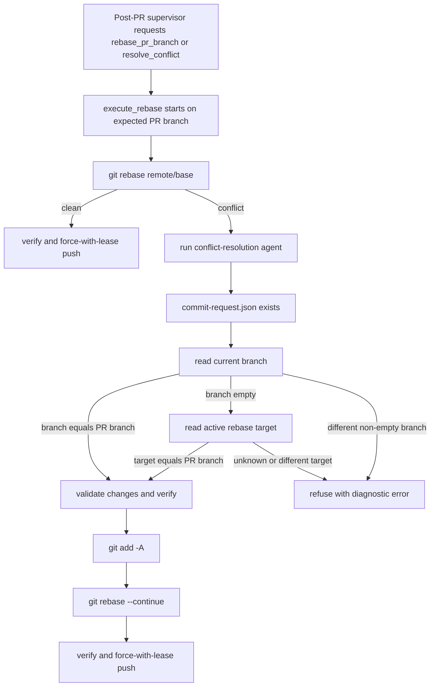

# PRD: Agent Runner Rebase Detached HEAD Branch Guard

## 1. Introduction & Goals

Issue #28 的 post-PR supervisor 在处理 `resolve_conflict` / `rebase_pr_branch` 时暴露了一个 rebase 冲突恢复边界问题：

```text
Refusing to commit on unexpected branch:
```

该错误发生在 runner 进入 rebase 冲突恢复后，agent 已尝试解决冲突并写出 `.agent-runner/commit-request.json`，runner 准备继续 `git rebase --continue` 前再次检查当前分支。当前实现只使用 `git branch --show-current` 与 PR 分支比较。真实 Git rebase 冲突过程中，worktree 可能处于 detached HEAD 或 rebase 中间状态，导致该命令返回空字符串。runner 因此把合法的 rebase 中间状态误判为不安全分支，阻断自动恢复。

目标：

- 保留 runner 的分支安全门禁，禁止在错误分支上 staging、verification、`rebase --continue` 或 push。
- 在 rebase 冲突恢复阶段正确识别“当前处于针对 PR 分支的 active rebase”，即使 `git branch --show-current` 为空也不误报。
- 只修改 post-PR supervisor 的 rebase conflict handling，不放宽普通 agent commit proxy 的分支检查。
- 明确 rebase conflict 阶段的 `.agent-runner/commit-request.json` 只是 agent 授权 runner staging 和继续 rebase 的意图文件；runner 不应在该路径新增 `git commit -m`。
- 错误信息必须区分“真的不是预期分支”和“Git rebase 状态无法确认”，便于 operator 从 Issue 评论定位根因。
- 覆盖 fake process runner、真实 Git rebase 状态和 CLI/post-PR rework 入口，防止该问题再次出现在真实 runner 中。

### Realistic Validation

除单元测试和集成测试外，本 PRD 要求通过**真实项目入口点**验证关键行为，确保真实使用路径生效，而非仅在隔离 fixture 中通过。

- [ ] **rebase detached HEAD 真实验证**：通过包含真实 Git 仓库和冲突 rebase 的测试入口，验证 `git branch --show-current` 为空但 active rebase 目标为 PR 分支时，runner 允许 `git rebase --continue`。
- [ ] **错误分支拒绝真实验证**：通过同一入口制造 active rebase 目标分支与 PR 分支不一致，验证 runner 拒绝 staging、verification、`rebase --continue` 和 push。
- [ ] **CLI rework 消费验证**：通过 `uv run iar run-once --repo <fixture-repo> --max-issues 1` 等真实 CLI 路径或其 subprocess fixture，验证 pending `resolve_conflict` / `rebase_pr_branch` 请求不会因 detached HEAD 被误判失败。
- [ ] **为什么单元测试不够**：该 bug 依赖真实 Git rebase 元数据、worktree detached 状态、commit-request 协议和 runner supervisor 路由组合；只 mock `git branch --show-current` 无法证明真实 rebase 中间状态可恢复。

## 2. Requirement Shape

**Actor**：运行 `iar run-once`、`iar review-once` 或 `iar review-daemon` 的本地 Agent Runner operator。

**Trigger**：

- PR 已存在，post-PR supervisor 因 merge conflict 或 mergeability gate 输出 `rebase_pr_branch` / `resolve_conflict`。
- runner 在 PR branch worktree 中执行 `execute_rebase(...)`。
- `git rebase <remote>/<base_branch>` 产生冲突，agent 解决冲突并写出 `.agent-runner/commit-request.json`。
- runner 准备执行 `git add -A`、verification 和 `git rebase --continue`。

**Expected Behavior**：

- 如果 worktree 当前普通分支名等于 `pr_branch`，行为保持不变。
- 如果普通分支名为空，但 Git 显示当前处于 active rebase，且 rebase 目标分支可确认等于 `pr_branch`，runner 应继续既有安全流程。
- 如果普通分支名为空且无法确认 active rebase 目标分支，runner 应拒绝继续并给出明确错误。
- 如果 active rebase 目标分支与 `pr_branch` 不一致，runner 应拒绝继续并指出 observed branch / rebase target / expected branch。
- rebase-aware safety guard 拒绝时，runner 不应自动执行 `git rebase --abort`，因为此时 runner 无法证明当前 rebase 属于预期 PR 分支；应保留现场供 operator 诊断。只有已经确认处于预期 PR 分支 rebase 且修复尝试耗尽时，才沿用现有 exhausted path 的 `git rebase --abort`。
- rebase conflict path 读取并删除 `commit-request.json` 后，只能执行 safe-change validation、`git add -A`、verification 和 `git rebase --continue`；不得额外执行 `git commit`。
- 普通 `commit_requested_changes(...)` 的 branch guard 不应因此放宽；非 rebase 提交流程仍必须看到当前分支等于 expected branch。

**Explicit Scope Boundary**：

- 不改变 agent prompt，不新增 agent 类型。
- 不改变 publish recovery、worktree remote sync、CI checks gate 或 workflow label 状态机。
- 不自动选择冲突解决策略；agent 仍负责修改文件，runner 只验证和继续 rebase。
- 不引入数据库、队列、本地 checkpoint 或新的持久状态。
- 不允许 `git reset --hard`、自动 merge、分支删除、额外 `git commit` 或绕过 verification。

## 3. Repository Context And Architecture Fit

### Current Relevant Modules And Files

| Path | Current Responsibility | Relevance |
|---|---|---|
| `src/backend/core/use_cases/pr_supervisor.py` | post-PR supervisor action、repair/rebase 执行、冲突恢复循环 | bug 发生在 `execute_rebase(...)` 的 conflict recovery commit-request 分支 |
| `src/backend/core/use_cases/run_agent_once.py` | Git helper、commit proxy、verification、safe path validation | 提供 `get_current_branch(...)`、`run_verification(...)`、`validate_safe_changes(...)` 等复用能力 |
| `src/backend/core/shared/interfaces/agent_runner.py` | `IProcessRunner`、`IGitHubClient` 等端口 | Git 命令继续通过 process runner，不直接绑定 subprocess |
| `src/backend/core/shared/models/agent_runner.py` | `AppConfig`、`IssueSummary`、`CommandResult` 等模型 | 不需要新增持久模型 |
| `src/backend/api/cli.py` | `iar` CLI 入口装配 | 真实入口验证应覆盖 CLI，但业务判断不放入 API 层 |
| `docs/guides/agent-runner.md` | Agent Runner 操作文档 | 需要记录 rebase conflict 恢复和错误诊断语义 |
| `tests/test_pr_supervisor.py` | supervisor/rebase 行为测试 | 应新增 detached HEAD active rebase 和错误目标分支覆盖 |
| `tests/test_run_agent.py` / `tests/test_agent_runner_cli.py` | run-once orchestration 和 CLI 行为测试 | 需要覆盖 pending rework 经真实入口触发 rebase conflict path |

### Existing Path

当前最接近的代码路径是：

```text
review-once / run-once
  -> supervisor action: rebase_pr_branch or resolve_conflict
  -> execute_rebase(...)
  -> git fetch <remote> <base_branch>
  -> git rebase <remote>/<base_branch>
  -> conflict
  -> run_agent_with_prompt(...)
  -> read .agent-runner/commit-request.json
  -> get_current_branch(...)
  -> validate_safe_changes(...)
  -> git add -A
  -> run_verification(...)
  -> git rebase --continue
  -> git push --force-with-lease <remote> <pr_branch>
```

问题点只在 conflict 分支中 `get_current_branch(...)` 的语义不足。它适合普通分支状态，但不够表达 active rebase target。

### Reuse Candidates

- 继续复用 `IProcessRunner` 执行所有 Git 命令。
- 继续复用 `validate_safe_changes(...)`、`run_verification(...)`、`ensure_verification_passed(...)` 和 `has_changes(...)`。
- 可在 `pr_supervisor.py` 增加 file-private helper，例如 `_ensure_rebase_target_matches_pr_branch(...)`，仅服务 `execute_rebase(...)`。
- 如多个 use case 后续也需要 active rebase 识别，再考虑移动到 `run_agent_once.py` 的 Git helper 区；本 PRD 默认不提前抽象。

### Architecture Constraints

- 变更应留在 `src/backend/core/use_cases/`，因为这是 workflow 安全门禁和 rebase 编排逻辑。
- `src/backend/core/` 不得导入 `src/backend/infrastructure/`，也不直接使用外部 Git 库。
- `src/backend/api/cli.py` 只做入口装配，不承载 rebase 状态判断。
- 所有文件 I/O 如需读取 Git rebase metadata，必须显式使用 `encoding="utf-8"`；metadata 路径必须通过 `git rev-parse --git-path ...` 解析，避免在 linked worktree 中误读主仓库 `.git`。
- 不使用 line-number-dependent 实施说明；执行者应通过函数名和 `rg` 定位。

### Potential Redundancy Risks

- 不应新增 parallel rebase executor；应修正现有 `execute_rebase(...)`。
- 不应把 ordinary commit proxy 的 guard 改成“空分支也允许”；这会扩大安全面。
- 不应在多个文件复制 rebase metadata 解析；如果需要 helper，应保持单一入口。
- 不应通过跳过 branch guard 修复该 bug；目标是更精确的 guard，而不是取消 guard。

## 4. Recommendation

### Recommended Approach

采用最小闭环修复：在 `execute_rebase(...)` 的 conflict recovery 分支中，把“当前分支必须等于 `pr_branch`”替换为“当前分支等于 `pr_branch`，或当前 active rebase 的目标分支可确认等于 `pr_branch`”。

建议实现形态：

1. 保留 `execute_rebase(...)` 开始阶段的普通分支检查，确保 rebase 是从预期 PR 分支启动。
2. 在 rebase conflict 后处理 `.agent-runner/commit-request.json` 时，不直接调用普通 `get_current_branch(...)` 做唯一判断。
3. 增加 rebase 专用 guard：
   - 先读取 `git branch --show-current`。
   - 如果返回 `pr_branch`，通过。
   - 如果返回非空且不是 `pr_branch`，拒绝。
   - 如果为空，检查 Git 是否处于 active rebase，并读取 rebase target branch。
   - rebase target 等于 `pr_branch` 时通过，否则拒绝。
4. 优先使用 Git 自身可定位的 rebase metadata 路径，例如通过 `git rev-parse --git-path rebase-merge/head-name` 和 `git rev-parse --git-path rebase-apply/head-name` 定位，再读取 `refs/heads/<branch>` 形式的目标分支名。
5. guard 拒绝时只抛出诊断错误，不自动 abort rebase；attempt exhaustion path 仍可在已确认预期 rebase 后执行现有 `git rebase --abort`。
6. 错误消息包含 observed branch、observed rebase target、expected branch 和 worktree 状态提示，避免再次出现空冒号无法诊断。
7. 补充 fake runner 单元测试、真实 Git rebase 集成测试、CLI/run-once rework 测试和文档。

### Why This Is The Best Fit

- 问题发生在 `pr_supervisor.execute_rebase(...)`，直接修正该路径可以保持改动范围最小。
- 保留现有 safe-change、verification 和 force-with-lease push 门禁，不绕过既有安全边界。
- active rebase target 是 Git 在 rebase 中间态的真实状态来源，比把空分支当作任意分支更安全。
- 不影响普通 implementation agent 的 commit proxy，因此不会放宽非 rebase 工作流。

### Rationale For Rejecting Redundant Abstractions

- 不新增 `GitRebaseService`：当前只有一个 use case 需要该判断，新增服务会超过问题复杂度。
- 不把 rebase 状态塞进 GitHub comments/labels：rebase 是否 active 是本地 Git worktree 状态，持久化到 GitHub 会产生同步风险。
- 不用 prompt 要求 agent 切回分支：rebase 冲突中切分支可能破坏 Git 状态，runner 应理解合法的 rebase 中间态。

### Alternatives Considered

| Alternative | Description | Rejected Because |
|---|---|---|
| 直接删除 conflict recovery 中的 branch guard | 遇到 commit-request 就继续 add、verify、rebase continue | 会允许错误 worktree 或错误 rebase 被推进，破坏 runner 安全模型 |
| 在 `get_current_branch(...)` 全局返回 rebase target | 所有调用方在 detached rebase 时都看到 PR 分支 | 会改变普通 commit proxy 和 publish guard 的语义，风险过大 |
| 要求人工处理所有 rebase conflict | rebase conflict 一律 blocked，不让 agent 自动修 | 与现有 supervisor `resolve_conflict` 能力冲突，并降低自动恢复闭环价值 |
| 在 worktree preparation 阶段避免 detached HEAD | 尝试通过创建方式保证 rebase 中 `branch --show-current` 非空 | detached HEAD 是 Git rebase 中间态，不应依赖工作树创建方式规避 |

## 5. Implementation Guide

This section is a living implementation guide based on current repository analysis. If implementation discovers additional affected files, hidden dependencies, edge cases, or a better path, update this PRD before proceeding.

### Core Logic

推荐控制流：

```text
execute_rebase(...)
  ├─ assert HEAD == expected_head
  ├─ assert current branch == pr_branch
  ├─ git fetch <remote> <base_branch>
  ├─ git rebase <remote>/<base_branch>
  ├─ if clean rebase succeeds:
  │    ├─ run verification
  │    └─ push --force-with-lease
  └─ if conflict:
       ├─ run conflict-resolution agent
       ├─ if .agent-runner/commit-request.json exists:
       │    ├─ ensure current branch or active rebase target matches pr_branch
       │    ├─ read and remove commit request as an authorization marker
       │    ├─ validate safe changes
       │    ├─ git add -A
       │    ├─ run verification
       │    ├─ git rebase --continue
       │    ├─ run verification
       │    └─ push --force-with-lease
       └─ if no commit request:
            ├─ require no uncommitted changes
            └─ try git rebase --continue
```

Possible helper shape:

```python
def _ensure_rebase_context_matches_pr_branch(
    worktree_path: Path,
    process_runner: IProcessRunner,
    pr_branch: str,
) -> None:
    """Ensure conflict recovery is still operating on the expected PR branch."""
```

Rebase metadata parsing should normalize:

- `refs/heads/issue-28` -> `issue-28`
- `issue-28` -> `issue-28`
- empty, whitespace-only, or non-branch values -> unknown or invalid rebase target
- missing `rebase-merge/head-name` and `rebase-apply/head-name` -> unknown rebase target

Important safety rule:

- The rebase-aware guard may only authorize the existing `git add -A` + `git rebase --continue` path. It must not call `git commit`, and it must not call `git rebase --abort` when the active rebase target is unknown or mismatched.

Use repository searches before implementation:

```bash
rg -n "Refusing to commit on unexpected branch|execute_rebase|get_current_branch|rebase --continue|rebase-merge|rebase-apply" src tests docs tasks
rg -n "resolve_conflict|rebase_pr_branch|post_pr_rework_requested" src tests docs tasks
```

### Change Impact Tree

```text
.
├── src/
│   └── backend/
│       └── core/
│           └── use_cases/
│               └── pr_supervisor.py
│                   [修改]
│                   【总结】让 rebase conflict recovery 使用 rebase-aware branch guard，而不是只依赖普通分支名。
│
│                   ├── 在 execute_rebase(...) conflict recovery 中调用 rebase 专用 guard
│                   ├── 新增 file-private helper 读取并规范化 active rebase target
│                   ├── 明确 guard 拒绝时不自动 abort 未确认目标的 active rebase
│                   └── 改善错误消息，输出 observed branch、rebase target 和 expected branch
│
├── tests/
│   ├── test_pr_supervisor.py
│   │   [修改]
│   │   【总结】覆盖 detached HEAD active rebase、错误 rebase target 和现有普通分支路径。
│   │
│   │   ├── 使用 FakeProcessRunner 验证 branch 为空但 rebase target 匹配时允许继续
│   │   ├── 使用真实 Git 临时仓库验证 rebase conflict 中间态
│   │   ├── 验证不匹配 target 时不会调用 git add、verification、rebase --continue、rebase --abort 或 push
│   │   └── 验证 rebase conflict path 不执行 git commit
│   │
│   └── test_agent_runner_cli.py 或 test_run_agent.py
│       [修改]
│       【总结】通过真实 runner 入口覆盖 pending rework 触发 rebase conflict recovery 的路径。
│
│       ├── 构造 supervisor rework marker 或 PR context fixture
│       ├── 让入口走 execute_rebase(...) 而不是直接调用 helper
│       └── 断言 CLI outcome 不再出现空分支 unexpected branch 误报
│
└── docs/
    └── guides/
        └── agent-runner.md
            [修改]
            【总结】记录 rebase conflict recovery 的 branch safety 语义和 operator 诊断方式。

```

### Executor Drift Guard

- 如果 `execute_rebase(...)` 已被拆分或移动，先用 `rg -n "def execute_rebase|git rebase --continue|resolve_conflict" src/backend` 找到唯一执行路径，不要新增第二套 executor。
- 如果 `get_current_branch(...)` 已改名或泛化，确认普通 commit proxy `commit_requested_changes(...)` 的安全语义仍未放宽。
- 如果 workflow label helper 或 marker history helper 已落地，复用其入口触发 rework，但不要把 active rebase 状态持久化进 marker。
- 如果 `tests/test_agent_runner_cli.py` 已有 subprocess CLI fixture，优先复用；没有时可在 `tests/test_run_agent.py` 使用现有 fake GitHub/agent 边界，但必须保留至少一个真实 CLI 或 runner entry validation。
- 如果实现者倾向直接读取 `.git/rebase-merge/head-name`，先改为 `git rev-parse --git-path rebase-merge/head-name`，因为当前 runner 大量使用 Git worktree，`.git` 可能是指向 common git dir 的文件。

### Flow Diagram



### Realistic Validation Plan

| Behavior | Real Entry Point | Test Layer | Mock Boundary | Data/Env Needed | Command Or Procedure | Required For Acceptance |
|---|---|---|---|---|---|---|
| Active rebase target matching PR branch is allowed when `git branch --show-current` is empty | `execute_rebase(...)` through real Git temp repository fixture | integration | Git is real; agent and GitHub remain fake | Temporary repo with base branch, PR branch, conflicting rebase, commit-request file | `uv run pytest tests/test_pr_supervisor.py -k "rebase_detached_head" -v` | Yes |
| Active rebase target mismatch is rejected before staging or continuing | `execute_rebase(...)` through fake runner and real Git fixture | unit/integration | GitHub fake; process runner fake for command sequencing where useful | Rebase metadata target differs from `pr_branch` | `uv run pytest tests/test_pr_supervisor.py -k "rebase_target" -v` | Yes |
| Safety rejection preserves unknown rebase state | `execute_rebase(...)` through fake runner command sequencing | unit | Git may be fake; process runner records commands | Unknown or mismatched active rebase target with commit-request present | `uv run pytest tests/test_pr_supervisor.py -k "rebase_guard_does_not_abort" -v` | Yes |
| Rebase conflict path does not create an extra commit | `execute_rebase(...)` through fake runner command sequencing | unit | Git may be fake; process runner records commands | commit-request present after conflict resolution | `uv run pytest tests/test_pr_supervisor.py -k "rebase_conflict_no_git_commit" -v` | Yes |
| Pending post-PR rework can consume `resolve_conflict` / `rebase_pr_branch` without detached HEAD false failure | `iar run-once` CLI path or subprocess CLI fixture | smoke/integration | GitHub CLI and agent binary may be faked at PATH boundary; Git repository should be real | Fixture Issue with PR context, event marker, local worktree and conflicting rebase | `uv run pytest tests/test_agent_runner_cli.py -k "rebase_conflict_detached_head" -v` | Yes |
| Documentation describes operator-visible error and recovery behavior | Docs build | documentation | None | Local docs tree | `uv run mkdocs build --strict` | Yes |
| Full repository regression | `just test` | regression | Existing test environment | Existing repo config | `just test` | Yes |

Failure triage:

- If real Git tests cannot produce an empty `git branch --show-current`, inspect the Git version behavior and assert against active rebase metadata plus status output observed in that version.
- If CLI fixture setup is noisy, first verify `execute_rebase(...)` integration test, then inspect `agent_runner_orchestrate.py` rework marker routing.
- If `just test` fails on unrelated environment setup, record the failure command, stderr, and whether targeted tests passed.

### Data Model Changes

No data model changes in this PRD.

### Interactive Prototype Change Log

No interactive prototype file changes in this PRD.

### External Validation

No external validation required; repository evidence and Git behavior exercised through local validation are sufficient.

## 6. Definition Of Done

- `execute_rebase(...)` conflict recovery accepts detached HEAD only when the active rebase target is exactly the expected PR branch.
- Incorrect branch, unknown rebase target, or mismatched active rebase target fail before staging, verification, `rebase --continue`, `rebase --abort`, or push.
- Rebase conflict `commit-request.json` is treated as an authorization marker for staging and `git rebase --continue`; the path does not execute a new `git commit`.
- Ordinary `commit_requested_changes(...)` branch guard remains strict and does not accept detached HEAD.
- Tests cover fake runner command sequencing, real Git rebase metadata, and at least one runner/CLI entry path.
- `docs/guides/agent-runner.md` documents the behavior and diagnostics.
- `just test` passes before this PRD can be marked complete and archived.

## 7. Acceptance Checklist

### Architecture Acceptance

- [ ] The fix is implemented in `src/backend/core/use_cases/pr_supervisor.py` or an existing core Git helper; no infrastructure import is added to core.
- [ ] `src/backend/api/cli.py` remains an entry adapter and does not contain rebase branch guard logic.
- [ ] No new service, database table, queue, persistent checkpoint, or parallel rebase executor is introduced.

### Behavior Acceptance

- [ ] `execute_rebase(...)` allows conflict recovery when `git branch --show-current` is empty and active rebase target resolves to the expected `pr_branch`.
- [ ] `execute_rebase(...)` rejects conflict recovery when the active rebase target is missing, unreadable, or different from `pr_branch`.
- [ ] Rejection happens before `git add -A`, verification, `git rebase --continue`, and `git push --force-with-lease`.
- [ ] Safety guard rejection does not run `git rebase --abort`; abort remains limited to the exhausted conflict-resolution path after the expected PR branch rebase was established.
- [ ] The conflict recovery commit-request path does not run `git commit`; it only authorizes staging, verification, and `git rebase --continue`.
- [ ] `commit_requested_changes(...)` still rejects detached HEAD or any branch that does not equal `expected_branch`.
- [ ] Error messages no longer end with an empty `unexpected branch:` diagnostic without explaining rebase target status.

### Documentation Acceptance

- [ ] `docs/guides/agent-runner.md` explains how rebase conflict recovery validates the PR branch during detached HEAD active rebase.
- [ ] Documentation distinguishes this safety check from worktree remote sync and publish recovery.

### Validation Acceptance

- [ ] `uv run pytest tests/test_pr_supervisor.py -k "rebase_detached_head" -v` passes with coverage for real Git rebase conflict state.
- [ ] `uv run pytest tests/test_pr_supervisor.py -k "rebase_target" -v` passes with coverage for mismatch rejection.
- [ ] `uv run pytest tests/test_pr_supervisor.py -k "rebase_guard_does_not_abort or rebase_conflict_no_git_commit" -v` passes.
- [ ] `uv run pytest tests/test_agent_runner_cli.py -k "rebase_conflict_detached_head" -v` or an equivalent real `iar run-once` subprocess fixture passes.
- [ ] `uv run mkdocs build --strict` passes.
- [ ] `just test` passes.

## 8. Functional Requirements

- **FR-1**: The runner MUST preserve strict branch validation before starting a PR branch rebase.
- **FR-2**: During rebase conflict recovery, the runner MUST treat an empty current branch as acceptable only when active rebase metadata confirms the target branch equals `pr_branch`.
- **FR-3**: The runner MUST reject unknown, missing, or mismatched rebase target information before mutating the index or continuing the rebase.
- **FR-4**: The runner MUST keep ordinary commit proxy behavior unchanged for non-rebase agent commits.
- **FR-5**: The runner MUST NOT run `git rebase --abort` when the rebase-aware guard cannot prove the active rebase target is the expected PR branch.
- **FR-6**: The runner MUST NOT run `git commit` from the rebase conflict recovery commit-request path.
- **FR-7**: The runner MUST emit diagnostic messages that include enough branch and rebase target context for GitHub Issue comments and logs to be actionable.
- **FR-8**: Tests MUST prove the behavior with both command-level sequencing and real Git rebase state.
- **FR-9**: Documentation MUST describe the supported recovery state and the safety refusal state.

## 9. Non-Goals

- Automatically resolving semantic merge conflicts without agent changes.
- Changing PR approval, CI checks, workflow label exclusivity, or marker history semantics.
- Replacing `git rebase` with merge-based conflict resolution.
- Adding live GitHub API integration tests as a blocking requirement.
- Changing worktree creation or remote branch reconciliation behavior.
- Requiring live GitHub credentials for acceptance validation.

## 10. Risks And Follow-Ups

- Git stores rebase metadata differently for merge and apply backends; implementation must check both `rebase-merge` and `rebase-apply`.
- Different Git versions may vary in whether `git branch --show-current` is empty during rebase; tests should assert the safety helper behavior and record observed Git status output for diagnostics.
- If future work moves Git helpers out of `run_agent_once.py`, this guard should move with them only after confirming ordinary commit proxy semantics stay strict.
- Leaving an unknown-target rebase un-aborted may require operator cleanup, but this is safer than mutating a rebase whose branch ownership cannot be proven.

## 11. Decision Log

| ID | Decision | Chosen | Rejected | Rationale |
|---|---|---|---|---|
| D-01 | Where to fix the bug | Add rebase-aware guard inside the existing `execute_rebase(...)` conflict recovery path | Add a new rebase executor service | The bug is isolated to the existing post-PR rebase path, so a new executor would duplicate orchestration and safety checks. |
| D-02 | How to handle empty current branch | Accept only when active rebase target resolves to the expected PR branch | Treat empty branch as safe by default | Empty branch alone cannot prove the worktree belongs to the PR branch and would weaken the safety model. |
| D-03 | Scope of branch guard changes | Keep ordinary `commit_requested_changes(...)` strict | Globally change `get_current_branch(...)` to return rebase target | Non-rebase commit and publish guards need the real checked-out branch semantics, not rebase-specific fallback behavior. |
| D-04 | What to do when rebase target is unknown or mismatched | Refuse without running `git rebase --abort` | Automatically abort on guard failure | Aborting an unverified rebase is itself a branch-mutating operation and can destroy the evidence an operator needs to diagnose the unsafe state. |
| D-05 | How to interpret `commit-request.json` during rebase conflict recovery | Treat it as an authorization marker for staging and `git rebase --continue` | Use its `commit_message` to run `git commit -m` | Rebase should preserve or update the rebased commit through `git rebase --continue`, not create an unrelated extra commit. |
