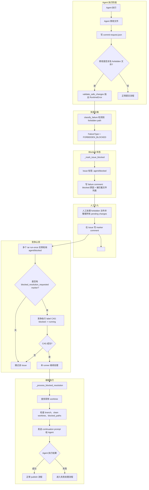

# PRD: Agent Runner Forbidden Path Blocked Resolution

## 1. Introduction & Goals

**Problem**: 当 `iar run-once` 执行时，Agent 的变更被 `forbidden_path_patterns` 拦截（如修改了 `.env.example`），Runner 直接归类为 `UNRECOVERABLE` 并将 Issue 标记为 `agent/failed`。此时 Agent 已经在 worktree 中留下修改和 `.agent-runner/commit-request.json`，但由于 forbidden 校验发生在 `git add` / `git commit` 之前，runner 尚未生成受管 commit，也不提供"人工处理 forbidden 文件后让 Agent 继续完成剩余任务"的路径。

**Goal**: 当 forbidden path 拦截发生时，Issue 进入 `agent/blocked`；人工确认 forbidden 文件并将 worktree 整理到可继续状态后，写入 `blocked_resolution_requested` marker。后续 `iar run-once` 扫描 `agent/blocked` Issue，通过竞争认领机制将其中一个 Issue 从 `blocked -> running`，并在现有 worktree 上让 Agent 继续完成剩余任务，不需要从头重跑。

### Proposed Solution Summary

Extend the existing Agent Runner failure classification and GitHub Issue workflow state path so commit-stage forbidden path failures become a recoverable `agent/blocked` state. The operator supplies an explicit `blocked_resolution_requested` marker after manually resolving forbidden files; the runner only consumes that marker through the existing `run-once` orchestration path and reuses the shared workflow transition / marker-history helpers planned by the CI rework recovery PRD. The change updates Issue labels, event markers, and continuation prompts while intentionally avoiding a new `agent/forbidden` label, database-backed queue, or parallel recovery command.

### Realistic Validation

- [ ] **Forbidden 拦截后进入 blocked**: 运行 iar run-once 处理一个会触发 forbidden 拦截的 Issue，验证 Issue 进入 `agent/blocked` 而非 `agent/failed`，失败 comment 包含 blocked 状态说明
- [ ] **人工处理后竞争认领继续**: 人工处理 forbidden 文件、确保 worktree 满足继续条件并写 marker comment 后，两个 iar run-once 实例同时运行，验证只有一个成功将 Issue 从 `agent/blocked` 认领到 `agent/running` 并继续，其余跳过
- [ ] **继续 prompt 导向正确**: 验证 Agent 收到的是"继续完成剩余任务"的 prompt，而非从头开始或修复模式
- [ ] **完成后的工作流正确**: 验证 PRD closeout、publish、label 流转等行为符合预期

### Delivery Dependencies

- Group: agent-runner-blocked-recovery
- Depends on groups:
  - agent-runner-workflow-recovery
- Depends on tasks/issues:
- Gate type: hard
- Notes: This PRD depends on the shared workflow transition and marker-history helpers from the CI rework recovery PRD. Without those helpers, this task would duplicate label transition and marker scanning logic.

---

## 2. Requirement Shape

| 元素 | 内容 |
|------|------|
| **Actor** | AI Agent、Runner、人工操作员 |
| **Trigger** | `validate_safe_changes()` 在 `commit_requested_changes()` 中检测到 forbidden path 变更 |
| **Expected Behavior** | Issue 进入 `agent/blocked`，failure comment 说明 blocked 原因；人工确认 forbidden 文件、清理 worktree 并写 marker 后，runner 扫描 blocked Issue，竞争认领成功者将 Issue 切到 `agent/running`，在现有 worktree 上继续让 Agent 完成剩余任务 |
| **Explicit Boundary** | 仅处理 commit 阶段的 forbidden 拦截（`commit_requested_changes` 中的 `validate_safe_changes`），不处理 `publish_changes` 中的拦截 |

---

## 3. Repository Context And Architecture Fit

### 3.1 Current Relevant Modules

| 文件 | 作用 | 改动点 |
|------|------|--------|
| `src/backend/core/use_cases/run_agent_once.py` | Agent 执行主循环，包含 `commit_requested_changes`、`classify_failure` | 新增 `FORBIDDEN_BLOCKED` 失败类型；修改失败处理逻辑 |
| `src/backend/core/use_cases/agent_runner_orchestrate.py` | Issue 编排入口，包含 `_mark_issue_failed`、issue kind 分类 | 新增 `blocked_resolution` issue kind；新增处理函数 |
| `src/backend/core/shared/models/agent_runner.py` | 领域模型，包含 `FailureType` enum | 新增 `FORBIDDEN_BLOCKED` 枚举值 |
| `src/backend/core/shared/models/agent_runner_events.py` | Issue comment marker 解析和格式化 | 新增 `blocked_resolution_requested` phase 和对应 marker 格式 |
| `src/backend/core/use_cases/agent_runner_workflow.py` | CI Rework PRD 计划新增的 workflow helper | 复用 label 互斥 transition 和 marker history helper，不另写一套 label/marker 状态机 |
| `src/backend/infrastructure/github_client.py` | GitHub API 实现 | 新增 `compare_and_swap_labels` 原子操作 |

### 3.2 Existing Architecture Pattern

- **Issue label 流转**: `agent/ready` → `agent/running` → `agent/supervising` / `agent/review` / `agent/failed` / `agent/blocked`
- **marker comment 协议**: `<!-- iar:event version=1 phase=X cycle=Y ... -->` 用于跨 runner 通信
- **竞争认领已有先例**: `_has_existing_local_commit_ready_for_publish` 通过检测已有 commit 决定是否 publish recovery，多个 runner 同时轮询时只有第一个 push 成功的会继续

### 3.3 Ownership And Dependency Boundaries

- `run_agent_once.py` 属于 `core/` 层，不依赖 `engines/` 层
- `agent_runner_orchestrate.py` 属于 `core/` 层，调用 `run_agent_once.py` 的用例函数
- 新增的 `FORBIDDEN_BLOCKED` 失败类型在 `core/` 层定义和使用，不跨越层边界

### 3.4 Constraints

- **多 runner 竞争**: 必须通过某种原子操作避免两个 runner 同时处理同一个 blocked Issue
- **worktree 完整性**: 人工处理 forbidden 文件时可能产生新 commit 或 revert，runner 必须处理这些边界情况
- **PRD 交付检查**: 如果 Issue 有 PRD，recovery prompt 仍需引导 Agent 完成 Acceptance Checklist

### Existing PRD Relationship

- Depends on `tasks/pending/P1-BUG-20260527-093356-agent-runner-ci-rework-state-recovery.md` for shared workflow transition and marker-history helpers.
- Related to `tasks/pending/P1-BUG-20260527-173500-process-runner-error-diagnosability.md` because both improve operator-facing failure handling, but the scopes are independent.
- Related to `tasks/pending/P1-BUG-20260528-095136-agent-runner-rebase-detached-head-branch-guard.md` because both recover interrupted post-agent work, but they operate on different guards.
- Does not duplicate any current pending PRD; it extends the blocked recovery path that the CI recovery PRD intentionally leaves for a follow-up.

### Potential Redundancy Risks

- Duplicating workflow label remove lists in this PRD would repeat the CI recovery bug class; use the shared helper instead.
- Introducing a dedicated `agent/forbidden` state would overlap with the existing `agent/blocked` operator-intervention semantics.
- Adding a bespoke recovery command would bypass the existing `run-once` orchestration and PRD closeout path.

---

## 4. Recommendation

### 4.1 Recommended Approach

**最小改动路径**：扩展 `classify_failure` 新增 `FORBIDDEN_BLOCKED` 失败类型，扩展 issue kind 分类新增 `blocked_resolution`，新增 `blocked_resolution_requested` marker phase，并复用 CI Rework PRD 中抽取的 workflow transition / marker history helper 实现竞争认领。

核心改动：

1. 在 `FailureType` 新增 `FORBIDDEN_BLOCKED`
2. 修改 `classify_failure` 中对 forbidden path 异常的判断，从 `UNRECOVERABLE` 改为 `FORBIDDEN_BLOCKED`
3. 修改 `_mark_issue_failed` 对 `FORBIDDEN_BLOCKED` 类型的处理：标记 `agent/blocked` 而非 `agent/failed`
4. 在 `agent_runner_orchestrate.py` 新增 `blocked_resolution` issue kind 分类和处理函数
5. 在 `ReviewEventMarker` 新增 `blocked_paths` 字段（存储被拦截的文件路径）
6. 复用 `agent_runner_workflow.py` 中的 `transition_issue_workflow_state` / marker-history helper；如果该 helper 尚未实现，应先完成 CI Rework PRD 的公共 helper 部分

### 4.2 Why This Is The Best Fit

- **复用量大**: 复用了 `post_pr_rework_requested` marker 的协议和解析逻辑
- **改动集中**: 只需要修改 4 个文件，新增约 100 行代码
- **符合语义**: `agent/blocked` 的语义是"需要人工介入后才能继续"，forbidden 拦截恰好符合这个语义
- **竞争安全**: marker comment 机制天然支持多个 runner 读取，需要的是 label 的原子更新

### 4.3 Alternatives Considered

**重试循环改写（不推荐）**: 将 forbidden path 失败从 UNRECOVERABLE 改为 VERIFICATION_FAILED 级别，进入重试循环。但重试循环设计用于"Agent 自己修复"场景，forbidden 拦截需要人工介入，不适合重试循环。

**新增 agent/forbidden label（不推荐）**: 引入新的 label `agent/forbidden`。但这增加了 label 管理负担，且 `agent/blocked` 语义已经覆盖这个场景。

---

## 5. Implementation Guide

This section is a living implementation guide based on current repository analysis. If implementation discovers additional affected files, hidden dependencies, edge cases, or a better path, update this PRD before proceeding.

### 5.1 Core Logic

#### 5.1.1 Forbidden Path Blocked 触发流程

```
Agent 执行 → 修改 forbidden 文件 → 写 commit-request.json
    ↓
commit_requested_changes() 调用 validate_safe_changes()
    ↓
发现 forbidden 变更 → RuntimeError("Refusing to publish forbidden paths: ...")
    ↓
classify_failure() 返回 FailureType.FORBIDDEN_BLOCKED（新增）
    ↓
UnrecoverableError 改为 ForbiddenBlockedError 或沿用现有异常类型
    ↓
_mark_issue_blocked() → Issue 标记 agent/blocked + 写 blocked comment
```

#### 5.1.2 竞争认领继续流程

```
多个 iar run-once 实例同时轮询
    ↓
Polling 时查询 agent/ready + agent/running + agent/blocked
    ↓
agent/blocked Issue 中检测是否有 blocked_resolution_requested marker
    ↓
_guard_blocked_issue_has_resolution() → 有 marker 则加入处理队列
    ↓
多个 runner 竞争处理同一个 blocked issue
    ↓
第一个执行 label compare-and-swap 的 runner 成功认领（原子操作）
    ↓
成功认领的 runner 执行 _process_blocked_resolution()
    ↓
其余 runner 的 CAS 失败，跳过该 Issue
```

#### 5.1.3 竞争认领机制

使用 `gh api` 的 compare-and-swap (CAS) 模式实现原子 label 更新。CAS 的语义必须是 `agent/blocked -> agent/running`，并保留 agent routing labels 与其他非 workflow labels；不得直接用 `labels=["agent/running"]` 覆盖整组 labels：

```bash
gh api repos/{owner}/{repo}/issues/{issue_number} \
  -H "X-GitHub-Api-Accept: application/vnd.github.v3+json" \
  -H "If-Match: {etag}" \
  --method PATCH \
  --field labels='["agent/running", "...preserved non-workflow labels..."]'
```

如果 GitHub API ETag 能力暂时无法封装，可先实现读-检查-写模式，但它只能在成功写入后重新读取 labels 确认当前 Issue 仍只由本 runner 持有；确认成功前不得启动 Agent 或修改 worktree：

```python
# Pseudo-code for compare_and_swap_label
def compare_and_swap_label(issue_number, expected_labels, new_labels):
    # 1. 获取当前 labels + ETag
    current_labels, etag = github_client.get_issue_labels(issue_number)
    # 2. 检查是否满足预期（没有其他 runner 已认领）
    if not all(l in current_labels for l in expected_labels):
        return False  # 已被其他 runner 认领
    # 3. 原子更新，new_labels 由 workflow transition helper 计算
    github_client.update_issue_labels(issue_number, new_labels, etag)
    return True
```

继续执行前必须满足 worktree 继续条件：

- 当前分支仍是 Issue 对应分支。
- 人工已提交或撤销所有 pending changes，worktree 为 clean。
- 若要保留 Agent 首轮留下的非 forbidden 修改，人工必须先把这些修改整理成一个或多个人工 commit；runner 不从脏 worktree 继续。
- marker 中的 `blocked_paths` 必须与 blocked comment 中记录的 forbidden paths 一致，且当前 pending diff 中不再包含这些 forbidden paths。

### 5.2 Change Impact Tree

```
src/backend/core/shared/models/agent_runner.py
    [修改]
    【新增 FORBIDDEN_BLOCKED 枚举值和 BLOCKED_DETAIL 字段】
    - ReviewEventMarker 新增 blocked_paths: list[str] | None 字段

src/backend/core/shared/models/agent_runner_events.py
    [修改]
    【新增 blocked_resolution_requested phase 解析和 blocked_paths 字段提取】
    - 正则 pattern 新增 blocked_paths 捕获组
    - format_event_marker 新增 blocked_paths 参数

src/backend/core/use_cases/run_agent_once.py
    [修改]
    【修改 classify_failure 和 _mark_issue_* 失败处理】
    - classify_failure: forbidden path 从 UNRECOVERABLE → FORBIDDEN_BLOCKED
    - 新增 _mark_issue_blocked() 函数

src/backend/core/use_cases/agent_runner_orchestrate.py
    [新增]
    【新增 blocked_resolution issue kind 分类和处理】
    - _guard_blocked_issue_has_resolution() 检测函数
    - _process_blocked_resolution() 处理函数
    - run_once() 中新增 blocked issue 轮询逻辑
    - 竞争认领 CAS 逻辑

tests/test_agent_runner_orchestrate.py
    [修改]
    【新增 blocked resolution 相关测试】
    - test_blocked_forbidden_detection
    - test_blocked_resolution_continuation
    - test_competition_claim_success
    - test_competition_claim_skip

docs/guides/agent-runner.md
    [修改]
    【新增 forbidden path blocked 恢复文档】
    - 状态机更新
    - blocked 恢复操作步骤
```

### 5.3 Executor Drift Guard

Before implementation, search for existing and hidden references rather than trusting this file list as exhaustive:

```bash
rg -n "FORBIDDEN_BLOCKED|Refusing to publish forbidden paths|forbidden_path_patterns|agent/blocked|blocked_resolution" src tests docs tasks/pending
rg -n "workflow_state|post_pr_rework_requested|format_event_marker|parse_latest_event_marker|edit_issue_labels" src/backend/core src/backend/infrastructure tests
```

If the shared workflow helper from `P1-BUG-20260527-093356-agent-runner-ci-rework-state-recovery` does not exist yet, implement that dependency first instead of creating a one-off blocked-resolution helper here. If CAS-style label updates fail in sandbox validation, inspect `src/backend/infrastructure/github_client.py` and the GitHub CLI/REST label update boundary before changing core orchestration.

### 5.4 Flow Diagram



### 5.5 Realistic Validation Plan

| Behavior | Real Entry Point | Test Layer | Mock Boundary | Data/Env Needed | Command Or Procedure | Required For Acceptance |
|----------|-----------------|------------|---------------|-----------------|---------------------|----------------------|
| forbidden 拦截后 Issue 进入 blocked 而非 failed | `uv run iar run-once` + 检查 Issue label | sandbox/manual | Mock GitHub API，模拟 Agent 修改 forbidden 文件 | 测试 Issue + worktree | 见下方验证流程 | Yes |
| 人工写 marker 后 runner 检测到 blocked issue | 手动 `gh issue comment` + `iar run-once` | sandbox | Mock GitHub API | 测试 Issue | 见下方验证流程 | Yes |
| 竞争认领：只有一个 runner 继续 | 两个 `iar run-once` 实例同时运行 | manual | 不 mock，真实 GitHub | 测试 Issue + 两个 runner | 见下方验证流程 | Yes |
| 继续 prompt 正确：提到 forbidden 文件和剩余任务 | 检查 Agent 收到的 prompt 内容 | unit | Mock Agent | 无 | 检查 `_process_blocked_resolution` 中的 prompt 构建逻辑 | Yes |
| PRD closeout 仍正常工作 | 有人工 PRD 的 Issue | sandbox | Mock GitHub API | 测试 PRD Issue | 验证 recovery prompt 包含 closeout 提醒 | Yes |
| `just test` 全部通过 | `just test` | unit/integration | 标准 mock | 无 | `cd /Users/zata/code/keda && just test` | Yes |

**Manual/sandbox 验证流程**（当 Mock 不足以覆盖时）：

1. **Forbidden 拦截验证**：
   ```bash
   # 创建会修改 .env.example 的测试 Issue
   gh issue create --title "test forbidden" --body "..."
   gh issue edit <n> --add-label agent/ready
   # 人工在 Issue body 里要求修改 .env.example
   # 运行 iar run-once
   # 验证 Issue 变成 agent/blocked
   gh issue view <n> --json labels --jq '.labels[].name'
   ```

2. **竞争认领验证**：
   ```bash
   # 终端1: iar run-once --dry-run
   # 终端2: iar run-once --dry-run
   # 两个应该只有一个真正处理该 Issue
   ```

### 5.6 Low-Fidelity Prototype

无。核心逻辑是文本处理和 label 操作，不需要 UI 或交互原型。

### 5.7 ER Diagram

No data model changes in this PRD.

### 5.8 Interactive Prototype Change Log

No interactive prototype file changes in this PRD.

### 5.9 External Validation

No external validation required; repository evidence and sandbox runner validation are sufficient.

---

## 6. Definition Of Done

- `classify_failure` 对 forbidden path 返回 `FORBIDDEN_BLOCKED` 而非 `UNRECOVERABLE`
- `FailureType` enum 包含 `FORBIDDEN_BLOCKED`
- `_mark_issue_blocked` 函数存在且正确设置 `agent/blocked` label
- `agent_runner_orchestrate.py` 正确识别和处理 `blocked_resolution` issue kind
- `ReviewEventMarker` 支持 `blocked_paths` 字段
- marker comment 正确包含被拦截文件列表
- 竞争认领机制（label CAS）正确工作
- blocked resolution 复用 CI Rework PRD 中的 workflow transition / marker history helper
- `docs/guides/agent-runner.md` 文档更新说明 blocked 恢复流程
- `just test` 通过
- 文档更新同步到 `mkdocs.yml`

---

## 7. Acceptance Checklist

### Architecture Acceptance

- [ ] `FailureType` enum 新增 `FORBIDDEN_BLOCKED` 值
- [ ] `ReviewEventMarker` 新增 `blocked_paths: list[str] | None` 字段
- [ ] `_EVENT_MARKER_PATTERN` 正则支持 `blocked_paths` 捕获
- [ ] `format_event_marker` 新增 `blocked_paths` 参数
- [ ] `parse_latest_event_marker` 正确解析 `blocked_paths`
- [ ] blocked resolution 复用 shared workflow helper，不复制 workflow label remove list 或 marker-history 扫描逻辑

### Behavior Acceptance

- [ ] `classify_failure` 对 "Refusing to publish forbidden paths" 返回 `FORBIDDEN_BLOCKED`
- [ ] `_mark_issue_blocked` 函数正确设置 `agent/blocked` label 并移除 `agent/running`
- [ ] blocked failure comment 包含被拦截文件列表和恢复说明
- [ ] `run_once()` 轮询 `agent/blocked` 时检测 `blocked_resolution_requested` marker
- [ ] `_guard_blocked_issue_has_resolution` 正确判断 blocked issue 是否有继续条件
- [ ] 竞争认领时使用 label CAS 将 Issue 从 `agent/blocked` 切到 `agent/running`，第一个成功的 runner 继续，其余跳过
- [ ] `_process_blocked_resolution` 构建的 prompt 正确引用 forbidden 文件和剩余任务
- [ ] 继续执行后 PRD closeout 引导仍正常工作

### Safety Acceptance

- [ ] 竞争认领不会导致两个 runner 同时处理同一个 Issue
- [ ] worktree 状态异常（如 dirty、当前分支不匹配或 pending diff 仍包含 forbidden path）时拒绝继续
- [ ] marker 中 `blocked_paths` 与实际 worktree 状态一致

### Failure Reporting Acceptance

- [ ] blocked comment 包含 "blocked_forbidden" 类型标识
- [ ] blocked comment 列出所有被拦截的文件路径
- [ ] blocked comment 说明人工确认步骤

### Documentation Acceptance

- [ ] `docs/guides/agent-runner.md` 新增 "Forbidden Path 阻塞恢复" 章节
- [ ] 状态机图更新包含 `agent/blocked` 和 forbidden blocked 路径
- [ ] 文档说明 marker comment 格式和人工操作步骤
- [ ] 文档说明多 runner 竞争认领行为

### Validation Acceptance

- [ ] **sandbox 验证 forbidden→blocked**: 创建测试 Issue，模拟 Agent 修改 forbidden 文件，运行 iar run-once，验证 Issue 进入 `agent/blocked` 且 failure comment 包含 blocked 说明
- [ ] **竞争认领验证**: 启动两个 iar run-once 实例同时处理同一个 blocked Issue，验证只有一个继续
- [ ] **`just test` 通过**: `cd /Users/zata/code/keda && just test`

---

## 8. Functional Requirements

**FR-1**: 当 `validate_safe_changes` 在 `commit_requested_changes` 中检测到 forbidden path 变更时，`classify_failure` 返回 `FailureType.FORBIDDEN_BLOCKED`，Issue 进入 `agent/blocked` 而非 `agent/failed`。

**FR-2**: blocked failure comment 包含被拦截文件列表、恢复说明和 marker comment 模板。

**FR-3**: 人工处理 forbidden 文件、将 worktree 整理为 clean 状态并写 `blocked_resolution_requested` marker 后，runner 在轮询 `agent/blocked` issues 时检测到该 marker。

**FR-4**: 多个 runner 同时处理同一个 blocked issue 时，通过 label compare-and-swap 原子操作实现 `agent/blocked -> agent/running` 竞争认领，只有一个 runner 成功认领继续执行。

**FR-5**: `_process_blocked_resolution` 构建的 continuation prompt 包含：
- Issue 标题和 URL
- worktree 路径
- "以下文件已由人工处理，请继续完成剩余任务" 的引导语
- 被处理过的 forbidden 文件列表
- PRD closeout 提醒（如果有 PRD）

**FR-6**: 继续执行后，如果 Agent 再次触发 forbidden 拦截，回到 FR-1 状态。

---

## 9. Non-Goals

- 不处理 `publish_changes` 中的 forbidden path 拦截（该路径目前是 unrecoverable，不在本 PRD 范围内）
- 不新增 `agent/forbidden` label；复用现有的 `agent/blocked`
- 不实现分布式锁；使用 label CAS 实现竞争认领
- 不修改 `verification_commands` 验证逻辑
- 不修改 `pre_push_review` 或 `post_pr_supervisor` 的行为

---

## 10. Risks And Follow-Ups

**Risk**: 如果实现退化为普通读-检查-写，两个 runner 可能同时认为自己已认领同一个 blocked Issue。

**Mitigation**: 优先实现基于 ETag / `If-Match` 的原子 label 更新。若只能读-检查-写，必须在启动 Agent 前重新读取 labels 和最新 `blocked_resolution_requested` marker，确认 Issue 已从 `agent/blocked` 独占切到 `agent/running` 且 marker 未变化；确认失败的 runner 必须跳过，不能依赖后续 push/PR 互斥来兜底。

**Follow-up**: 考虑在 `github_client.py` 实现真正的 `update_labels_if_match` 原子操作（使用 If-Match ETag）。

---

## 11. Decision Log

| ID | Decision | Chosen | Rejected | Rationale |
|----|----------|--------|---------|-----------|
| D-01 | Forbidden 拦截的失败类型 | `FORBIDDEN_BLOCKED` | `UNRECOVERABLE` | `UNRECOVERABLE` 语义是完全不可恢复，需要人工介入才能继续；`FORBIDDEN_BLOCKED` 语义是人工介入后可以继续，符合场景 |
| D-02 | Blocked Issue 的认领触发方式 | marker comment + 改 `agent/running` | 只改 `agent/running` | 纯 label 方式无法携带 blocked_paths 等上下文信息；marker comment 可以存储被拦截文件列表，供 runner 构建正确的 continuation prompt |
| D-03 | 多 runner 竞争认领机制 | label CAS | 分布式锁 / 专用命令 | CAS 改动最小，复用现有 label 操作；分布式锁引入额外依赖；专用命令增加用户负担 |
| D-04 | 继续 prompt 导向 | 继续导向 | 修复导向 / 从头开始 | 用户需求是"让 Agent 接着完成任务"，修复导向会让 Agent 以"修复错误"的心态工作；从头开始违背了避免重跑的核心目标 |
| D-05 | Forbidden 文件处理方式 | 人工单独提交 | 自动排除 / 撤销 | 人工处理最灵活，允许确认、修改或撤销；自动排除可能导致意外提交；撤销会丢失工作 |
