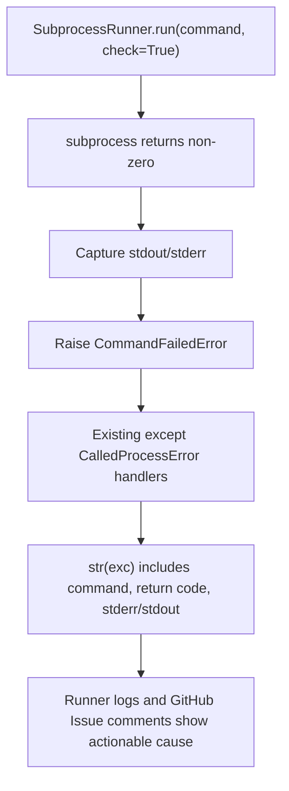

# PRD: Process Runner Error Diagnosability

- GitHub Issue: https://github.com/zata-zhangtao/keda/issues/72

## 1. Introduction & Goals

当前 Agent Runner 在 `process_runner.run()` 执行命令失败时，日志和 GitHub Issue 评论只显示：

```text
Command '['git', 'commit', '-m', '...']' returned non-zero exit status 1.
```

命令的真实失败原因（stderr）被完全丢弃。这意味着当 pre-commit hook、git push、just test 等命令失败时，operator 无法从日志或 Issue 评论中得知具体原因，必须手动进入 worktree 复现同样的命令才能定位问题。

真实案例：fsense Issue #5 的 `git commit` 被 pre-commit `check-test-flag` 拦截，但 agent-runner 日志完全没有体现这一点，导致无法判断失败根因。

目标：让 `process_runner.run()` 在命令失败时抛出的异常，其 `str()` 输出包含 stderr（以及可选的 stdout），确保上层日志记录和 GitHub Issue 评论自动携带可操作的诊断信息。

### Proposed Solution Summary

Enhance the existing infrastructure-layer `SubprocessRunner.run()` failure path by raising a `subprocess.CalledProcessError`-compatible subclass whose string representation includes captured stderr or stdout with bounded truncation. Callers continue to use the same process runner interface and existing exception handling, while logs and GitHub Issue comments automatically gain actionable command diagnostics through `str(exc)`. This avoids modifying every runner call site, changing global logging formatters, or adding a second command execution abstraction.

### Realistic Validation

- [ ] **Git commit pre-commit 失败真实验证**：通过 `uv run iar run` 触发一个已知会因 pre-commit hook 失败的 Issue，验证 runner 日志和 GitHub 评论中包含 pre-commit 的具体失败行（如 `Check just test flag.....................................................Failed`）。
- [ ] **Git push 被拒绝真实验证**：通过本地 fixture 模拟 remote rejection，验证 `git push` 失败时日志包含 remote 返回的拒绝原因。
- [ ] **现有测试不回归**：`uv run pytest tests/test_process_runner.py -q` 通过，且不破坏已有 `CalledProcessError` 捕获逻辑。

### Delivery Dependencies

- Group: process-runner-diagnostics
- Depends on groups:
  - none
- Depends on tasks/issues:
  - none
- Gate type: none
- Notes: This is a cross-cutting diagnosability improvement. It can be implemented independently and may make other runner recovery PRDs easier to debug, but it does not block them.

## 2. Requirement Shape

**Actor**：运行 `iar run`、`iar review` 或 `iar review-daemon` 的本地 operator，以及查看 GitHub Issue 评论的开发者。

**Trigger**：`process_runner.run()` 执行任意命令且 `check=True`（默认）时返回非零 exit code。

**Expected Behavior**：
- 异常消息中必须包含命令的 stderr 输出（若 stderr 非空）。
- 若 stderr 为空但 stdout 非空，异常消息应包含 stdout。
- 异常消息应保留原始命令和 return code，便于快速定位。
- 异常类型保持为 `subprocess.CalledProcessError` 或其语义兼容的子类，避免破坏现有 `except subprocess.CalledProcessError` 捕获。
- 对于长输出（>4KB），应截断并标注，避免异常消息膨胀。

**Explicit Scope Boundary**：
- 不改变 `process_runner.run()` 的正常执行路径（return code 为 0 时行为不变）。
- 不修改命令执行方式（仍使用 `subprocess.run` 或 `subprocess.Popen`）。
- 不新增外部依赖。
- 不修改日志格式或日志级别，只增强异常对象本身的信息量。

## 3. Repository Context And Architecture Fit

### Current Relevant Modules And Files

| Area | Current Path | Current Role |
|---|---|---|
| 进程执行器 | `src/backend/infrastructure/process_runner.py` | `SubprocessRunner.run()` 执行命令、捕获输出、抛出 `CalledProcessError` |
| 异常格式化 | `src/backend/core/use_cases/run_agent_once.py` | `format_failure_comment()` 将 `str(exc)` 写入 GitHub 评论 |
| 失败标记 | `src/backend/core/use_cases/agent_runner_orchestrate.py` | `_mark_issue_failed()` 记录 `str(exc)` 到日志和评论 |
| 测试 | `tests/test_process_runner.py` | 现有 `SubprocessRunner` 行为测试 |

### Existing Path

`SubprocessRunner.run()` 在 `check=True` 且 return code != 0 时抛出 `subprocess.CalledProcessError`：

```python
raise subprocess.CalledProcessError(
    completed.returncode,
    list(command),
    output=stdout,
    stderr=stderr,
)
```

`CalledProcessError.__str__` 的默认实现只输出命令和 return code，不访问 `output` 或 `stderr` 属性。因此所有上层调用方（`_mark_issue_failed`、`format_failure_comment`）在调用 `str(exc)` 时，都无法自动获得 stderr。

### Reuse Candidates

- 复用 `CommandResult` dataclass 中已经捕获的 stdout/stderr，不新增输出捕获逻辑。
- 复用现有 `tests/test_process_runner.py` 的 fixture，只需新增断言验证异常消息包含 stderr。

### Architecture Constraints

- `process_runner.py` 位于 `infrastructure/` 层，只能依赖标准库，禁止导入 `core/` / `engines/` / `api/` 类型。
- 若引入自定义异常类，应定义在 `process_runner.py` 内部或 `infrastructure/` 层，不破坏四层依赖方向。
- 所有上层 `except subprocess.CalledProcessError` 捕获必须继续生效。

### Potential Redundancy Risks

- 不在每个调用 `process_runner.run()` 的地方单独拼接 stderr；应在 `process_runner.py` 中统一处理，一次修复覆盖所有调用点。
- 不新增全局日志拦截器；只增强异常对象本身的信息量。

### Existing PRD Relationship

- Related to `tasks/pending/P1-BUG-20260527-093356-agent-runner-ci-rework-state-recovery.md`, `tasks/pending/P1-BUG-20260526-185149-agent-runner-forbidden-blocked-resolution.md`, and `tasks/pending/P1-BUG-20260528-095136-agent-runner-rebase-detached-head-branch-guard.md` because those tasks benefit from better command diagnostics.
- Does not depend on any pending PRD and does not duplicate their recovery behavior; it only improves the shared command failure message surface.

## 4. Recommendation

### Recommended Approach

采用**自定义异常子类**方案，在 `process_runner.py` 中定义一个继承 `subprocess.CalledProcessError` 的 `CommandFailedError`，重写 `__str__` 以在消息中注入 stderr/stdout：

1. 在 `src/backend/infrastructure/process_runner.py` 中新增 `class CommandFailedError(subprocess.CalledProcessError)`，重写 `__str__`。
2. `SubprocessRunner.run()` 在 `check=True` 且失败时抛出 `CommandFailedError` 而非标准 `CalledProcessError`。
3. `__str__` 实现：先输出原始命令和 return code，然后追加非空的 stderr（优先）或 stdout，超过阈值时截断并标注 `... (truncated)`。
4. 更新 `tests/test_process_runner.py`，验证失败命令的异常消息包含 stderr 内容。
5. 回归验证所有现有 `except subprocess.CalledProcessError` 的调用点仍能通过（子类实例可被父类捕获）。

### Why This Is The Best Fit

- **最小侵入**：只改 `process_runner.py` 一处，所有调用方自动受益，无需逐个修改 `_mark_issue_failed`、`format_failure_comment` 等上层代码。
- **向后兼容**：`CommandFailedError` 继承 `CalledProcessError`，现有 `except subprocess.CalledProcessError` 和 `isinstance(exc, subprocess.CalledProcessError)` 全部继续生效。
- **信息完整**：异常对象仍保留 `returncode`、`cmd`、`output`、`stderr` 属性，上层若需要结构化访问仍可读取。

### Rationale For Rejecting Redundant Abstractions

- 不在每个调用点手动拼接 `exc.stderr`：当前有数十处 `process_runner.run()` 调用，逐一修改成本高且容易遗漏。
- 不修改全局 logging formatter：问题不是日志格式不好，而是 `str(exc)` 本身缺少信息；修改 formatter 无法解决 GitHub Issue 评论中的 `str(exc)` 输出。
- 不把 stderr 直接 print 到 console：`capture_output=True` 路径下 stdout/stderr 已被抑制，直接 print 会破坏 runner 的输出控制。

### Alternatives Considered

| Alternative | Why Considered | Rejected Because |
|---|---|---|
| 在每个 `except CalledProcessError` 处手动拼接 `exc.stderr` | 改动最小 | 需要修改十余处调用点，极易遗漏；新增调用点仍会犯同样错误 |
| 在 `SubprocessRunner.run()` 内 `logger.error(stderr)` 后再抛异常 | 改动最小 | 日志和 GitHub 评论分属不同输出通道；Issue 评论看不到 logger 输出 |
| 使用 `subprocess.run(text=False)` 保留 bytes 输出 | 避免编码问题 | 当前已统一使用 `text=True, encoding="utf-8"`；改为 bytes 会引入大量下游改动 |

## 5. Implementation Guide

This section is a living implementation guide based on current repository analysis. If implementation discovers additional affected files, hidden dependencies, edge cases, or a better path, update this PRD before proceeding.

### Core Logic

```python
# src/backend/infrastructure/process_runner.py

_MAX_ERROR_MSG_LEN = 4096


class CommandFailedError(subprocess.CalledProcessError):
    """CalledProcessError with stderr/stdout included in the message."""

    def __str__(self) -> str:
        base = super().__str__()
        detail = self.stderr or self.output or ""
        if not detail:
            return base
        detail = detail.strip()
        if len(detail) > _MAX_ERROR_MSG_LEN:
            detail = detail[:_MAX_ERROR_MSG_LEN] + "\n... (truncated)"
        return f"{base}\n\n--- stderr/stdout ---\n{detail}"
```

在 `SubprocessRunner.run()` 的异常抛出处替换：

```python
# 替换前
raise subprocess.CalledProcessError(...)
# 替换后
raise CommandFailedError(
    completed.returncode,
    list(command),
    output=stdout,
    stderr=stderr,
)
```

### Change Impact Tree

```text
.
├── src/backend/infrastructure/process_runner.py
│   [修改]
│   ├── 新增 CommandFailedError 异常类
│   └── SubprocessRunner.run() 失败时抛出 CommandFailedError
│
└── tests/test_process_runner.py
    [修改]
    └── 新增/更新断言：验证失败命令的异常消息包含 stderr
```

### Executor Drift Guard

Run repository searches before editing because future call sites may rely on exact exception type behavior:

```bash
rg -n "process_runner\\.run|CalledProcessError|str\\(exc\\)|stderr|stdout" src tests docs
rg -n "SubprocessRunner|CommandResult|capture_output|check=True" src/backend/infrastructure tests
```

If validation shows a caller inspects `exc.output` or `exc.stderr`, preserve those attributes exactly. If Issue comments still omit stderr, inspect `format_failure_comment()` and `_mark_issue_failed()` only after confirming `str(CommandFailedError(...))` contains the expected detail.

### Flow Diagram



### Realistic Validation Plan

| Behavior | Real Entry Point | Test Layer | Mock Boundary | Data/Env Needed | Command Or Procedure | Required For Acceptance |
|---|---|---|---|---|---|---|
| 失败消息包含 stderr | `tests/test_process_runner.py` | unit | 无 | 无 | `uv run pytest tests/test_process_runner.py -q` | Yes |
| pre-commit 失败消息进入日志 | `uv run iar run` | real entry | 真实 pre-commit hook | 一个已知 pre-commit 会失败的 worktree | 观察 runner 日志是否包含 pre-commit 失败详情 | Yes |
| 现有异常捕获不回归 | `tests/` | unit/integration | 无 | 无 | `uv run pytest tests/ -q` | Yes |

### Low-Fidelity Prototype

No low-fidelity prototype required for this PRD; behavior is CLI/log diagnostic output.

### ER Diagram

No data model changes in this PRD.

### Interactive Prototype Change Log

No interactive prototype file changes in this PRD.

### External Validation

No external validation required; repository evidence and local command fixtures are sufficient.

## 6. Definition Of Done

- `CommandFailedError` 已落地，`SubprocessRunner.run()` 失败时抛出该异常。
- 异常消息在包含命令和 return code 的基础上，追加非空的 stderr/stdout，过长时截断。
- `tests/test_process_runner.py` 包含对异常消息内容的断言。
- 所有现有 `except subprocess.CalledProcessError` 和 `isinstance(exc, subprocess.CalledProcessError)` 逻辑不回归。
- `uv run pytest tests/test_process_runner.py -q` 通过。
- `uv run pytest tests/ -q` 通过（无回归）。

## 7. Acceptance Checklist

### Architecture Acceptance

- [ ] 自定义异常类定义在 `infrastructure/` 层，不破坏四层依赖方向。
- [ ] 不改变 `process_runner.run()` 的正常路径行为。
- [ ] 不新增第三方依赖。

### Behavior Acceptance

- [ ] `SubprocessRunner.run(["false"])` 抛出的异常消息包含 stderr（若 `false` 有 stderr）或明确的失败描述。
- [ ] 命令返回非零且 stderr 非空时，`str(exc)` 包含 stderr 原文。
- [ ] stderr 为空但 stdout 非空时，`str(exc)` 包含 stdout 原文。
- [ ] stderr/stdout 总和超过 4KB 时，异常消息截断并标注 `... (truncated)`。
- [ ] 现有 `except subprocess.CalledProcessError` 仍能捕获新异常。

### Documentation Acceptance

- [ ] `docs/` 无需变更；本改动属于内部可观测性增强，不暴露新 API。

### Validation Acceptance

- [ ] `uv run pytest tests/test_process_runner.py -q` 通过。
- [ ] `uv run pytest tests/ -q` 通过。
- [ ] 若条件允许，通过 `iar run` 触发一次真实命令失败，验证日志包含 stderr 内容。

## 8. Functional Requirements

- **FR-1**：`CommandFailedError` 必须继承 `subprocess.CalledProcessError`，保证向后兼容。
- **FR-2**：`CommandFailedError.__str__` 必须输出原始命令和 return code。
- **FR-3**：`CommandFailedError.__str__` 在 stderr 非空时必须追加 stderr 内容。
- **FR-4**：`CommandFailedError.__str__` 在 stderr 为空但 stdout 非空时必须追加 stdout 内容。
- **FR-5**：追加的诊断内容超过 4096 字符时必须截断，并在末尾标注 `... (truncated)`。
- **FR-6**：`SubprocessRunner.run()` 在 `check=True` 且命令失败时必须抛出 `CommandFailedError`。

## 9. Non-Goals

- 不修改日志级别或日志格式。
- 不修改 `process_runner.run()` 的函数签名。
- 不新增全局异常处理器或日志拦截器。
- 不处理命令执行超时或信号中断的场景（这些已有独立错误路径）。

## 10. Risks And Follow-Ups

- **Risk: 截断阈值导致关键信息丢失**。若某命令的失败原因在输出尾部（如 stack trace），4096 字符截断可能截掉关键行。缓解：优先保留尾部而非头部，或提高阈值。但通常 pre-commit/git 错误信息在头部，4096 已足够。
- **Risk: 某些上层代码依赖 `type(exc) is subprocess.CalledProcessError`**。若上层使用严格类型比较而非 `isinstance`，子类会失败。缓解：全局搜索 `type(.*) is .*CalledProcessError` 和 `type(.*) == .*CalledProcessError`，若存在则改为 `isinstance`。
- **Follow-up: 其他基础设施命令的 stderr 注入**。本 PRD 聚焦 `SubprocessRunner`；若仓库中存在其他直接调用 `subprocess.run` 的位置，可作为后续清理任务统一收敛到 `SubprocessRunner`。

## 11. Decision Log

| ID | Decision | Chosen | Rejected | Rationale |
|---|---|---|---|---|
| D-01 | 异常增强位置 | `process_runner.py` 内自定义异常子类 | 在每个调用点手动拼接 `exc.stderr` | 单点修复覆盖所有调用方，避免遗漏和未来新增调用点重复犯错 |
| D-02 | 异常类型 | `CommandFailedError(CalledProcessError)` | 全新异常类不继承标准类 | 向后兼容：现有 `except CalledProcessError` 和 `isinstance` 检查无需修改 |
| D-03 | 输出截断策略 | 固定 4096 字符上限 | 不截断 | 避免极端情况下（如 agent 输出大量文本）异常消息膨胀到数 MB，影响日志和评论可读性 |
