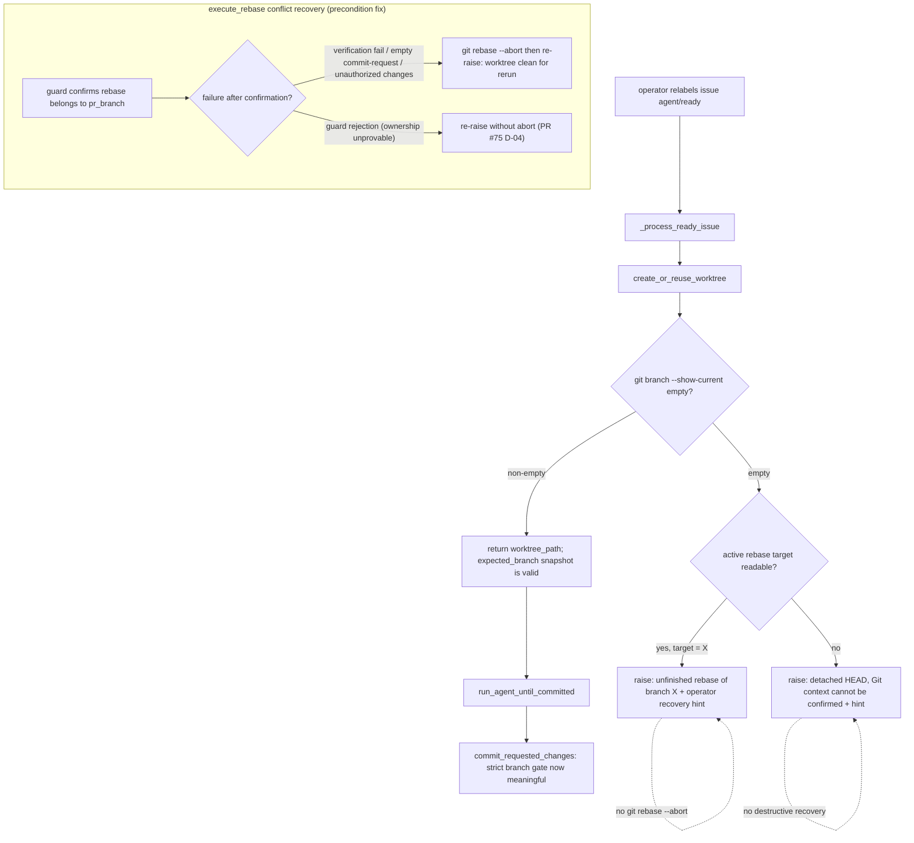

# PRD: Agent Runner Worktree Reuse Rebase-State Guard

- GitHub Issue: https://github.com/zata-zhangtao/keda/issues/73 （第二次 runner 失败的反向 bug，PR #75 范围之外，建议另开 Issue 跟踪）
- 事故记录: Issue #73 的 "Manual Takeover Recovery" 评论（2026-06-12）

## 1. Introduction & Goals

Issue #73 的重跑暴露了一个与 PR #75 所修 bug 同源但方向相反的 worktree 复用缺陷。完整失败链：

1. **前置条件**：上一次运行在 `pr_supervisor.execute_rebase(...)` 冲突恢复中抛出异常（当时是空分支 guard 误报；任何 guard 拒绝或 verification 失败路径都可能），异常路径未执行 `git rebase --abort`，worktree 被留在 rebase 中间状态（detached HEAD）。
2. **快照污染**：operator 重新打 `agent/ready` 标签后，`agent_runner_orchestrate._process_ready_issue` 调用 `create_or_reuse_worktree(...)` 复用了该 worktree，随后 `expected_branch = get_current_branch(...)`（即 `git branch --show-current`）在 detached HEAD 下快照为**空字符串**，且没有任何校验。
3. **反向误判**：agent 在恢复过程中完成或中止 rebase、回到正确的 issue 分支（`issue-73`）后写出 commit-request，`agent_runner_commit.commit_requested_changes(...)` 的分支门禁因 `"issue-73" != ""` 抛出 `Refusing to commit on unexpected branch: issue-73`，被 `classify_failure(...)` 归类为 `FailureType.UNRECOVERABLE`——**正确分支被当成不安全分支**。

PR #75 修复的是"rebase 中间态的合法 detached HEAD 被拒绝"（guard 过严）；本 PRD 修复的是"被污染的空 `expected_branch` 快照让 guard 失去意义后反咬正确分支"（基准失效），以及该状态得以产生的前置条件（`execute_rebase` 失败路径不清理 rebase 状态）。

### 目标

- ready 路径复用 worktree 时，绝不在无法确认 Git 分支上下文的状态（rebase 中间态 / detached HEAD）上启动 agent；`expected_branch` 快照保证非空。
- 拒绝时给出可操作的诊断：区分"worktree 处于 active rebase（目标分支为 X）"和"detached HEAD 且无 rebase 元数据、Git 状态无法确认"，并附带 operator 恢复指引，诊断风格与 PR #75 的 `_ensure_rebase_context_matches_pr_branch` 一致。
- runner 不对无法证明归属的 Git 状态做破坏性恢复：复用阶段不自动 `git rebase --abort`，保留现场供 operator 判断。
- 消除前置条件：`execute_rebase(...)` 在 rebase 上下文**已确认属于 PR 分支**之后的失败路径（verification 失败、无变更 commit-request、未授权变更等）执行 `git rebase --abort`，与现有 exhausted path 的 abort 行为对齐，保证 worktree 干净可重跑；guard 拒绝（归属无法证明）路径维持 PR #75 D-04 的不 abort 原则。
- 覆盖真实 Git rebase 中间态的集成测试与真实 runner/CLI 入口验证，写法对齐 PR #75 在 `tests/test_pr_supervisor.py` 新增的 real-git 测试。

### Proposed Solution Summary

把 PR #75 引入的 rebase 元数据读取 helper（`_read_active_rebase_target_branch` / `_normalize_rebase_target_name`，当前为 `pr_supervisor.py` 文件私有）提升到共享 Git helper 模块 `agent_runner_git.py`（PR #75 的 PRD 已预告"出现第二个 use case 再移动"，本 PRD 即第二个 use case）。在 `run_agent_once.create_or_reuse_worktree(...)` 返回 `worktree_path` 前新增复用状态门禁：当前分支为空时读取 rebase 元数据，无论能否确认目标分支一律拒绝并抛出含 operator 恢复指引的诊断错误（不自动 abort）。该入口同时保护 `_process_ready_issue` 与 `review_once` 两个复用方。另在 `execute_rebase(...)` 中为"rebase 归属已确认"之后的异常路径补 `git rebase --abort`，复用现有 exhausted path 的清理语义。输入全部来自真实 Git 元数据（经 `IProcessRunner` 与 `git rev-parse --git-path`），不新增配置、持久状态或服务；不做 dirty/diverged 远程对齐（属 Issue #71 pending PRD 的范围）；不放宽 `commit_requested_changes(...)` 的严格分支门禁。

### Realistic Validation

除单元测试和集成测试外，本 PRD 要求通过**真实项目入口点**验证关键行为，确保真实使用路径生效，而非仅在隔离 fixture 中通过。

- [ ] **复用 rebase 中间态 worktree 拒绝真实验证**：用真实 Git 临时仓库制造冲突 rebase 中间态（`git branch --show-current` 为空、`rebase-merge` 元数据存在），通过 `run_once()` / `_process_ready_issue` 真实用例入口（GitHub/agent 为 fake 边界）验证 runner 在启动 agent 前拒绝，错误信息包含 active rebase 目标分支与恢复指引，且未执行 `git rebase --abort`。
- [ ] **execute_rebase 失败路径清理真实验证**：用真实 Git 临时仓库制造冲突 rebase，让 verification 失败（或 agent 产出无变更 commit-request），验证 `execute_rebase(...)` 抛错后 worktree 已回到 PR 分支、无 rebase 元数据残留；并验证 guard 拒绝（归属无法证明）路径仍不执行 abort。
- [ ] **CLI 真实入口验证**：通过 `tests/test_agent_runner_cli.py` 既有的真实 CLI dispatch fixture（对齐 PR #75 的 rv-3 写法）验证 ready Issue 复用被污染 worktree 时，CLI 出口呈现可操作失败而非 `Refusing to commit on unexpected branch: issue-<n>` 误报。
- [ ] **为什么单元测试不够**：本 bug 依赖真实 Git rebase 元数据布局（`rebase-merge`/`rebase-apply`、linked worktree 的 `--git-path` 解析）、空分支快照与后续 commit 门禁的跨模块时序组合；仅 mock `git branch --show-current` 无法证明真实 rebase 中间态下的拒绝与清理行为。

### Delivery Dependencies

- Group: agent-runner-rebase-recovery
- Depends on groups:
  - none
- Depends on tasks/issues:
  - GitHub Issue #73 / PR #75（pending PRD `tasks/pending/P1-BUG-20260528-095136-agent-runner-rebase-detached-head-branch-guard.md`）
- Gate type: hard
- Notes: 本 PRD 复用并提升 PR #75 引入的 rebase 元数据 helper，且修改 PR #75 重写过的 `execute_rebase(...)` 冲突恢复路径；必须在 PR #75 合并后实施，否则会产生文本冲突与重复实现。PR #75 当前为 MERGEABLE 并已 ready for review。

## 2. Requirement Shape

**Actor**：运行 `iar run` / `iar review` / `iar review-daemon` 的本地 Agent Runner operator，特别是失败重跑场景（`agent/failed` → `agent/ready` 重新打标）。

**Trigger**：

- 上一次运行把 issue worktree 留在了 rebase 中间状态（detached HEAD、`rebase-merge` 或 `rebase-apply` 元数据存在）。
- operator 重新标记 Issue 为 ready，runner 走 `_process_ready_issue` → `create_or_reuse_worktree(...)` 复用该 worktree；或 review 路径经 `review_once` 复用。
- 或者：`execute_rebase(...)` 冲突恢复在 rebase 归属已确认后因 verification 失败等异常退出。

**Expected Behavior**：

- 复用的 worktree 处于普通分支（`git branch --show-current` 非空）时，行为与现状完全一致。
- 复用的 worktree 当前分支为空时，runner 在执行 claim 后续动作（agent 启动、commit、publish）之前失败，错误信息按可确认程度区分两类：
  - active rebase 元数据存在且目标分支可读 → 报告"worktree 处于针对分支 X 的 rebase 中间状态"，附 operator 恢复指引（人工 `git -C <worktree> rebase --abort` 或移除 worktree 后重跑）。
  - 无 rebase 元数据或目标不可读 → 报告"detached HEAD 且 Git 状态无法确认"，同样附恢复指引。
- 复用阶段的拒绝**不**自动执行 `git rebase --abort`、`git reset` 或 worktree 删除。
- `execute_rebase(...)` 冲突恢复中，guard 已确认 rebase 属于预期 PR 分支后发生的异常（verification 失败、`Agent requested a commit but produced no file changes.`、`Rebase conflict agent changed files without writing ...`）在抛出前执行 `git rebase --abort`（`check=False`），worktree 回到 PR 分支；guard 拒绝路径（分支不匹配 / 归属无法确认）维持不 abort。
- `commit_requested_changes(...)` 的严格分支门禁不变；本 PRD 通过保证 `expected_branch` 非空使其重新有意义，而不是放宽它。

**Explicit Scope Boundary**：

- 不处理 dirty worktree、local-ahead、diverged 与远程分支对齐——这是 `P1-BUG-20260527-112400-agent-runner-worktree-sync.md`（Issue #71）的范围。
- 不改变 agent prompt、workflow label 状态机、publish recovery、PR 创建逻辑。
- 不在复用阶段做任何破坏性 Git 恢复（abort/reset/删除）。
- 不修改 `commit_requested_changes(...)`、`publish` 门禁的判定逻辑本身。

## 3. Repository Context And Architecture Fit

### Current Relevant Modules And Files

| Path | Current Responsibility | Relevance |
|---|---|---|
| `src/backend/core/use_cases/run_agent_once.py`（818 非空行） | `create_or_reuse_worktree(...)`、agent 执行编排、helper 聚合导出 | 复用状态门禁的安插点，保护所有复用方 |
| `src/backend/core/use_cases/agent_runner_orchestrate.py`（969 非空行，逼近 1000 上限） | `_process_ready_issue` 等 Issue 路由 | bug 触发点：`expected_branch = get_current_branch(...)` 无校验快照；**本 PRD 应避免向该文件新增逻辑** |
| `src/backend/core/use_cases/agent_runner_git.py`（73 非空行） | `get_current_branch(...)`、`get_head_sha(...)` 等共享 Git helper | rebase 元数据 helper 的提升目标位置 |
| `src/backend/core/use_cases/pr_supervisor.py`（main 838 非空行，合并 PR #75 后约 930） | `execute_rebase(...)` 冲突恢复；PR #75 在此新增 `_ensure_rebase_context_matches_pr_branch` 等私有 helper | 前置条件修复点；helper 提升可同时缓解该文件行数压力 |
| `src/backend/core/use_cases/agent_runner_commit.py` | `commit_requested_changes(...)` 严格分支门禁 | 行为保持不变，是被空快照反咬的受害方 |
| `src/backend/core/use_cases/agent_runner_failure.py` | `classify_failure(...)` 把 `Refusing to commit on unexpected branch` 归为 UNRECOVERABLE | 新错误信息不得复用该前缀，避免误归类掩盖真实根因 |
| `src/backend/core/use_cases/review_once.py` | review 路径同样调用 `create_or_reuse_worktree(...)` | 在 `create_or_reuse_worktree` 内安插门禁可一并保护 |
| `tests/test_pr_supervisor.py` | PR #75 新增 real-git rebase 冲突测试（如 `test_execute_rebase_real_git_conflict_allows_detached_head`） | 新 real-git 测试写法的参照 |
| `tests/test_run_agent.py` / `tests/test_agent_runner_cli.py` | run 编排与 CLI dispatch 测试 | 复用门禁与真实入口验证落点 |
| `docs/guides/agent-runner.md` | operator 操作文档（含 失败重跑 一节） | 需补充 worktree 复用安全语义与恢复流程 |

### Existing Path

当前最接近的代码路径：

```text
iar run
  -> _process_ready_issue
       -> create_or_reuse_worktree(repo_path, issue, config, process_runner)
            -> create_command (check=False) / reuse_command / path_command
            -> 验证路径存在 + ensure_evidence_dir_excluded
            -> 返回 worktree_path          ← 无任何 Git 状态校验
       -> before_sha = get_head_sha(...)
       -> expected_branch = get_current_branch(...)   ← rebase 中间态下为 ""
       -> run_agent_until_committed(..., expected_branch=expected_branch)
            -> commit_requested_changes(..., expected_branch="")
                 -> current_branch ("issue-73") != ""  → UNRECOVERABLE 误报
```

前置条件路径：`execute_rebase(...)` 冲突恢复循环中，`ensure_verification_passed(...)` 抛出、`Agent requested a commit but produced no file changes.`、`Rebase conflict agent changed files without writing ...` 三处 raise 均不执行 `git rebase --abort`（只有 attempts exhausted 路径 abort），rebase 中间态因此泄漏到下一次运行。

### Reuse Candidates

- **PR #75 的 helper**（合并后位于 `pr_supervisor.py`）：`_read_active_rebase_target_branch(...)`（经 `git rev-parse --git-path rebase-merge/head-name` / `rebase-apply/head-name` 读取并规范化目标分支）与 `_normalize_rebase_target_name(...)`。本 PRD 把它们提升为 `agent_runner_git.py` 的公共 helper（建议名 `read_active_rebase_target_branch` / 规范化逻辑保持私有或合并），`pr_supervisor.py` 改为 import——这正是 PR #75 PRD Reuse Candidates 一节预留的演进路径。
- 继续复用 `IProcessRunner` 执行全部 Git 命令；读取元数据文件时显式 `encoding="utf-8"`。
- 复用 `get_current_branch(...)`；门禁 helper 建议放 `run_agent_once.py`（文件私有，如 `_ensure_reused_worktree_branch_context(...)`）或 `agent_runner_git.py`（若 review/run 之外还有调用方）。

### Architecture Constraints

- 变更全部位于 `src/backend/core/use_cases/`；core 不得导入 infrastructure，Git 命令一律走 `IProcessRunner`。
- rebase 元数据路径必须经 `git rev-parse --git-path ...` 解析——runner 的 worktree 是 linked worktree，`.git` 是指向 common git dir 的文件，直接拼 `.git/rebase-merge` 会误读。
- 单文件非空行 ≤ 1000（`just lint` 警告）：禁止向 `agent_runner_orchestrate.py`（969）新增门禁实现；helper 提升应让 `pr_supervisor.py` 净行数下降或持平。
- 不使用 line-number 定位；执行者用函数名 + `rg` 锚点。

### Potential Redundancy Risks

- 不得在 `run_agent_once.py` 复制一份 rebase 元数据解析——必须与 `pr_supervisor.py` 共用 `agent_runner_git.py` 中的单一实现。
- 不得通过"空分支时回退用 `f"issue-{issue.number}"` 推导 expected_branch"来掩盖状态问题：分支命名来自 worktree 配置模板，推导会复制配置语义，且掩盖了 worktree 仍处于 rebase 中间态的事实。
- 不得放宽 `commit_requested_changes(...)` / `validate_published_branch` 类门禁。
- 不与 Issue #71 的远程对齐逻辑合并实现；两者关注的 Git 状态维度不同（rebase 中间态 vs 远程领先/分叉）。

### Existing PRD Relationship

- **依赖（hard）** `tasks/pending/P1-BUG-20260528-095136-agent-runner-rebase-detached-head-branch-guard.md`（Issue #73 / PR #75）：本 PRD 提升其引入的 helper 并修改其重写的 `execute_rebase(...)` 冲突路径，必须在 PR #75 合并后实施。两者合称同一 bug 的正反两面：PR #75 让合法 rebase 中间态可恢复，本 PRD 防止该状态泄漏污染下一次运行。
- **相关、可独立** `tasks/pending/P1-BUG-20260527-112400-agent-runner-worktree-sync.md`（Issue #71）：同样在 `create_or_reuse_worktree(...)` 返回前加保护，但处理远程分支对齐（fetch/fast-forward/diverged 分类）。若两者都落地，本 PRD 的 rebase 状态门禁必须先于远程 reconcile 执行（rebase 中间态下做 fetch/fast-forward 不安全）；实现时在 `create_or_reuse_worktree` 内保持"状态门禁在前、对齐在后"的顺序即可，不构成阻塞依赖。
- **相关、独立** `tasks/pending/P1-BUG-20260527-093356-agent-runner-ci-rework-state-recovery.md`：同属 post-PR 恢复主题，无代码耦合。
- 未发现重复的 pending PRD；`tasks/archive/` 中 `20260526-010532-prd-agent-runner-publish-recovery-supervisor-safety.md` 确立的"禁止破坏性 reset、保留现场"原则被本 PRD 沿用。

## 4. Recommendation

### Recommended Approach

最小闭环、三处协同的目标态修复：

1. **提升共享 helper**（前提：PR #75 已合并）：把 `pr_supervisor.py` 中的 `_read_active_rebase_target_branch(...)` / `_normalize_rebase_target_name(...)` 移入 `agent_runner_git.py` 并导出（如 `read_active_rebase_target_branch`），`pr_supervisor.py` 与新门禁共用；同时补充一个能区分"有 rebase 元数据但目标不可读"与"无 rebase 元数据"的信号（返回结构或独立探测函数，执行者按最小复杂度选择）。
2. **复用状态门禁**：在 `run_agent_once.create_or_reuse_worktree(...)` 返回前调用门禁 helper：
   - `get_current_branch(...)` 非空 → 通过（现状不变）。
   - 为空 → 读取 active rebase 元数据，**一律拒绝**，错误信息区分两类并附 operator 恢复指引：
     - 目标分支可确认：`Worktree reuse refused: an unfinished rebase of branch '<target>' is in progress at <worktree_path>. Resolve it manually (e.g. 'git -C <worktree_path> rebase --abort') or remove the worktree, then relabel the issue.`
     - 目标不可确认：`Worktree reuse refused: worktree at <worktree_path> is in detached HEAD state and the Git branch context cannot be confirmed. Inspect it manually or remove the worktree, then relabel the issue.`
   - 错误信息不得以 `Refusing to commit on unexpected branch` 开头（避免 `classify_failure` 误归 UNRECOVERABLE 掩盖根因）。
   - 该门禁顺带保证 `_process_ready_issue` 的 `expected_branch` 快照永不为空，无需改动 `agent_runner_orchestrate.py`。
3. **前置条件清理**：`execute_rebase(...)` 冲突恢复循环中，在 `_ensure_rebase_context_matches_pr_branch(...)` 通过（rebase 归属已确认）之后发生的异常，在向上抛出前执行 `git rebase --abort`（`check=False`，与 exhausted path 相同写法）；guard 自身的拒绝异常维持不 abort（PR #75 D-04）。实现形态建议：小型私有 helper（如 `_abort_confirmed_rebase(...)`）+ 在确认点之后的 raise 路径调用，或 try/except 包裹确认后的处理段——执行者按可读性选择，禁止全局 catch 后无差别 abort。

### Why This Is The Best Fit

- 门禁安插在 `create_or_reuse_worktree(...)` 这一所有复用方（ready 路径、review 路径）的共同入口，一次修复覆盖全部消费方，且不向逼近行数上限的 `agent_runner_orchestrate.py` 增加任何实现。
- helper 提升执行了 PR #75 PRD 中预留的演进决定（"出现第二个 use case 再移动"），消除跨文件复制，同时缓解 `pr_supervisor.py` 的行数压力。
- "复用阶段拒绝不恢复、rebase 归属确认后失败才 abort"在安全语义上与 PR #75 的 D-04 完全一致：abort 只发生在归属已被证明的 rebase 上。
- 保持 `commit_requested_changes(...)` 严格门禁不变，修复的是门禁基准（快照），而不是门禁本身。

### Rationale For Rejecting Redundant Abstractions

- 不新增 `WorktreeStateService` / 独立 guard 模块：当前只有一个安插点和两个共享 helper，`agent_runner_git.py`（73 行）与 `run_agent_once.py`（818 行）都有充足容量。
- 不把 worktree 状态持久化到 GitHub label/marker：rebase 中间态是本地 Git 状态，持久化会产生同步漂移。
- 不新增配置开关（如 `allow_detached_reuse`）：不存在合法的"在无法确认分支的 worktree 上启动 agent"场景。

### Alternatives Considered

| Alternative | Description | Rejected Because |
|---|---|---|
| 复用阶段自动 `git rebase --abort` 后继续运行 | 元数据目标分支等于 issue 分支时自动恢复，self-healing | abort 会丢弃上次运行未提交的冲突解决成果与诊断现场；与 publish-recovery PRD 确立的"禁止破坏性恢复、保留现场"原则冲突；且自动恢复后的本地分支可能落后远程，需叠加 Issue #71 的对齐逻辑才安全。先以拒绝+指引落地，自动恢复作为未来 opt-in 演进（见 Risks） |
| 仅在 `_process_ready_issue` 中检查 `expected_branch == ""` 后立即失败 | 改动最小（一处 if） | 漏掉 `review_once` 复用路径；`agent_runner_orchestrate.py` 已 969 行；且只报"快照为空"无法给出 rebase 目标分支级别的诊断 |
| 空快照时用 `f"issue-{issue.number}"` 推导 expected_branch 兜底 | 让 commit 门禁拿到"正确"基准继续跑 | 分支名由 worktree 配置模板决定，硬编码推导复制配置语义；更重要的是掩盖了 worktree 处于 rebase 中间态这一不安全事实，agent 会在中间态上工作 |
| `execute_rebase` 全部异常路径无差别 abort | 实现最简单 | guard 拒绝意味着 rebase 归属无法证明，此时 abort 本身就是对不明状态的破坏性操作，违反 PR #75 D-04 |

## 5. Implementation Guide

This section is a living implementation guide based on current repository analysis. If implementation discovers additional affected files, hidden dependencies, edge cases, or a better path, update this PRD before proceeding.

### Core Logic

```text
create_or_reuse_worktree(...)
  ├─ create_command / reuse_command / path_command（现状）
  ├─ worktree_path 存在性校验（现状）
  ├─ [新增] 复用状态门禁:
  │    ├─ branch = get_current_branch(worktree_path)
  │    ├─ branch 非空 → 通过
  │    └─ branch 为空:
  │         ├─ target = read_active_rebase_target_branch(worktree_path)
  │         ├─ target 可确认 → raise "unfinished rebase of branch '<target>' ..."（含恢复指引）
  │         └─ target 不可确认 → raise "detached HEAD ... cannot be confirmed"（含恢复指引）
  │       （两类均不执行 git rebase --abort）
  └─ ensure_evidence_dir_excluded（现状）

execute_rebase(...) 冲突恢复循环（PR #75 合并后形态）
  ├─ _ensure_rebase_context_matches_pr_branch(...) 拒绝 → raise，不 abort（D-04，现状）
  └─ guard 通过之后的失败路径 → [新增] git rebase --abort (check=False) 后 re-raise:
       ├─ "Agent requested a commit but produced no file changes."
       ├─ validate_safe_changes / ensure_verification_passed 抛出
       └─ "Rebase conflict agent changed files without writing ..."
     （attempts exhausted 路径已有 abort，保持不变）
```

实施前定位锚点：

```bash
rg -n "def create_or_reuse_worktree|def get_current_branch|expected_branch = get_current_branch" src/backend
rg -n "_read_active_rebase_target_branch|_normalize_rebase_target_name|_ensure_rebase_context_matches_pr_branch" src/backend tests
rg -n "Rebase conflict resolution exhausted|rebase\", \"--abort|produced no file changes" src/backend
rg -n "Refusing to commit on unexpected branch" src/backend tests docs
```

### Change Impact Tree

以下文件列表是起点而非穷尽保证；隐藏引用见 Executor Drift Guard。

```text
.
├── src/backend/core/use_cases/
│   ├── agent_runner_git.py
│   │   [修改]
│   │   【总结】承接从 pr_supervisor 提升的 active rebase 元数据读取与规范化 helper，并暴露"目标可确认/不可确认"信号。
│   │
│   │   ├── 新增 read_active_rebase_target_branch(...)（经 git rev-parse --git-path 读 rebase-merge/rebase-apply head-name，encoding="utf-8"）
│   │   ├── 规范化逻辑（refs/heads/ 前缀剥离、空白处理）随迁
│   │   └── 更新 __all__ 导出
│   │
│   ├── pr_supervisor.py
│   │   [修改]
│   │   【总结】删除文件私有 rebase 元数据 helper 改为 import 共享版，并在 rebase 归属确认后的失败路径补 git rebase --abort。
│   │
│   │   ├── _read_active_rebase_target_branch / _normalize_rebase_target_name 移除，改用 agent_runner_git 导入
│   │   ├── execute_rebase 冲突循环：guard 通过后的 raise 路径在抛出前 abort（check=False）
│   │   └── guard 拒绝路径行为不变（不 abort）
│   │
│   └── run_agent_once.py
│       [修改]
│       【总结】create_or_reuse_worktree 返回前新增复用状态门禁，空分支一律拒绝并输出区分两类状态的 operator 诊断。
│
│       ├── 新增文件私有门禁 helper（如 _ensure_reused_worktree_branch_context）
│       ├── create_or_reuse_worktree 在 ensure_evidence_dir_excluded 前调用门禁
│       └── 错误信息含 worktree 路径、rebase 目标（可确认时）、恢复指引；不以 "Refusing to commit on unexpected branch" 开头
│
├── tests/
│   ├── test_run_agent.py
│   │   [修改]
│   │   【总结】覆盖复用门禁：真实 Git rebase 中间态拒绝（两类诊断）、正常分支复用不受影响、门禁不执行 abort。
│   │
│   │   ├── real-git fixture：冲突 rebase 中间态 worktree → create_or_reuse_worktree 拒绝，消息含目标分支
│   │   ├── real-git fixture：detached HEAD 无 rebase 元数据 → 拒绝，消息含 "cannot be confirmed"
│   │   ├── 断言拒绝后 rebase 元数据仍存在（未被 abort）
│   │   └── run_once()/_process_ready_issue 入口：被污染 worktree 的 ready 重跑在 agent 启动前失败
│   │
│   ├── test_pr_supervisor.py
│   │   [修改]
│   │   【总结】覆盖 execute_rebase 确认后失败路径的 abort 清理与 guard 拒绝路径的不 abort。
│   │
│   │   ├── real-git：verification 失败 → 抛错后 worktree 回到 PR 分支、无 rebase-merge/rebase-apply 残留
│   │   ├── fake runner 命令序列：确认后失败路径出现 git rebase --abort；guard 拒绝路径不出现
│   │   └── 与 PR #75 既有测试（test_execute_rebase_real_git_conflict_allows_detached_head 等）保持兼容
│   │
│   └── test_agent_runner_cli.py
│       [修改]
│       【总结】真实 CLI dispatch 入口验证被污染 worktree 的 ready 重跑产生可操作失败而非 UNRECOVERABLE 误报。
│
└── docs/guides/agent-runner.md
    [修改]
    【总结】在 失败重跑 一节补充 worktree 复用状态门禁语义、两类诊断含义与人工恢复步骤。
```

### Executor Drift Guard

- **PR #75 合并形态可能变化**：实施前先 `rg -n "_ensure_rebase_context_matches_pr_branch|_read_active_rebase_target_branch" src/backend` 确认 helper 的最终名称与位置；若 review 过程中 helper 已被移动或改名，提升动作以实际代码为准，保持单一实现即可。
- **行数上限**：实施后运行 `just lint` 确认无 >1000 非空行警告；若 `run_agent_once.py` 因门禁与既有演进逼近上限，把门禁 helper 放入 `agent_runner_git.py` 而非新建模块。
- **错误分类**：`rg -n "Refusing to commit on unexpected branch" src/backend` 确认新错误消息不会命中 `classify_failure` 的 UNRECOVERABLE 前缀匹配；若 `agent_runner_failure.py` 的分类规则已演进，确认新消息的归类结果在失败评论中仍给出可操作指引。
- **Issue #71 并行实施**：若 worktree-sync PRD 已先落地并在 `create_or_reuse_worktree` 内加入 reconcile，门禁必须置于 reconcile 之前（rebase 中间态下 fetch/fast-forward 不安全）。
- **隐藏调用方**：`rg -n "create_or_reuse_worktree" src/backend tests` 确认全部调用方（当前为 `agent_runner_orchestrate.py`、`review_once.py` 与 `run_agent_once` 自身导出）；新增调用方自动获得门禁保护，但需确认其失败处理路径能呈现诊断。

### Flow Diagram



### Realistic Validation Plan

| Behavior | Real Entry Point | Test Layer | Mock Boundary | Data/Env Needed | Command Or Procedure | Required For Acceptance |
|---|---|---|---|---|---|---|
| rebase 中间态 worktree 复用被拒绝且诊断含目标分支 | `run_once()` / `_process_ready_issue` + 真实 Git 临时仓库与 linked worktree | integration | Git 真实；GitHub/agent fake | 冲突 rebase 中间态 fixture（参照 PR #75 real-git 测试搭建方式） | `uv run pytest tests/test_run_agent.py -k "worktree_reuse_rebase" -v` | Yes |
| detached HEAD 无 rebase 元数据时拒绝且诊断为"无法确认" | `create_or_reuse_worktree(...)` + 真实 Git 仓库（`git checkout --detach`） | integration | 同上 | detached HEAD fixture | `uv run pytest tests/test_run_agent.py -k "worktree_reuse_detached" -v` | Yes |
| 复用门禁拒绝时不执行任何破坏性恢复 | 同上，断言拒绝后 rebase 元数据仍在 | integration | 同上 | 同上 | `uv run pytest tests/test_run_agent.py -k "worktree_reuse" -v` | Yes |
| execute_rebase 确认后失败路径 abort、worktree 干净可重跑 | `execute_rebase(...)` + 真实 Git 冲突 rebase | integration | Git 真实；agent 经 monkeypatch 注入 verification 失败 | 冲突 rebase fixture | `uv run pytest tests/test_pr_supervisor.py -k "abort" -v` | Yes |
| guard 拒绝路径仍不 abort（回归 PR #75 D-04） | `execute_rebase(...)` + fake runner 命令序列 | unit | process runner fake 记录命令 | 不匹配 rebase target fixture | `uv run pytest tests/test_pr_supervisor.py -k "rebase" -v` | Yes |
| ready 重跑被污染 worktree 经 CLI 出口呈现可操作失败 | `iar run` 真实 CLI dispatch（对齐 PR #75 rv-3 fixture） | smoke/integration | GitHub CLI 与 agent 在 PATH 边界 fake；Git 真实 | Issue fixture + 中间态 worktree | `uv run pytest tests/test_agent_runner_cli.py -k "worktree_reuse" -v` | Yes |
| 文档描述门禁语义与恢复步骤 | docs build | documentation | none | 本地 docs | `uv run mkdocs build --strict` | Yes |
| 全仓库回归 | `just test` | regression | 现有测试环境 | 现有配置 | `just test` | Yes |

Failure triage：

- real-git fixture 无法复现空 `git branch --show-current` 时，先确认 fixture 用的是冲突中断的 rebase（参照 `tests/test_pr_supervisor.py` 中 PR #75 的 `test_execute_rebase_real_git_conflict_allows_detached_head` 搭建序列），再检查本机 Git 版本行为。
- linked worktree 下元数据读取失败时，优先检查是否绕过了 `git rev-parse --git-path` 直接拼 `.git/` 路径。
- CLI fixture 噪声大时，先保证 `create_or_reuse_worktree` 级 integration 测试通过，再排查 `agent_runner_orchestrate.py` 的 ready 路由与失败评论组装。
- `just test` 因无关环境失败时，记录失败命令与 stderr，并确认针对性测试已通过。

### ER Diagram

No data model changes in this PRD.

### Interactive Prototype Change Log

No interactive prototype file changes in this PRD.

### External Validation

No external validation required; repository evidence was sufficient.

## 6. Definition Of Done

- 复用 worktree 当前分支为空时，runner 在 agent 启动前失败，诊断区分"unfinished rebase of branch X"与"Git 状态无法确认"，并附 operator 恢复指引；`expected_branch` 空快照不再可能进入 commit 门禁。
- 复用阶段拒绝不执行 `git rebase --abort` / `git reset` / worktree 删除。
- `execute_rebase(...)` 在 rebase 归属确认后的失败路径执行 abort，worktree 回到 PR 分支；guard 拒绝路径维持不 abort。
- rebase 元数据读取在 `agent_runner_git.py` 单一实现，`pr_supervisor.py` 与复用门禁共用。
- `commit_requested_changes(...)` 行为未变。
- 真实 Git 集成测试、真实 runner/CLI 入口测试与文档全部落地，Realistic Validation 证据已按 checklist 捕获。
- `just lint` 无 >1000 非空行警告；`just test` 通过后方可归档本 PRD。

## 7. Acceptance Checklist

### Architecture Acceptance

- [ ] rebase 元数据读取 helper 在 `src/backend/core/use_cases/agent_runner_git.py` 单一实现；`rg -n "rebase-merge|rebase-apply" src/backend` 仅命中该文件（及注释/文档）。
- [ ] `src/backend/core/use_cases/agent_runner_orchestrate.py` 未新增门禁实现逻辑（仅允许必要的注释/导入级变化）。
- [ ] core 层未新增 infrastructure 导入；所有 Git 命令经 `IProcessRunner`；元数据文件读取显式 `encoding="utf-8"`。
- [ ] 未新增服务、配置开关、持久状态或并行的 worktree 状态抽象。
- [ ] `just lint` 无单文件非空行 >1000 警告。

### Dependency Acceptance

- [ ] PR #75（Issue #73）已合并到 main，且本实现基于合并后的 `_ensure_rebase_context_matches_pr_branch` 形态构建。
- [ ] 与 `P1-BUG-20260527-112400-agent-runner-worktree-sync.md` 无实现重叠：本 PRD 未引入 fetch/fast-forward/diverged 处理。

### Behavior Acceptance

- [ ] `create_or_reuse_worktree(...)` 在 worktree 处于 active rebase（`git branch --show-current` 为空、`rebase-merge` 或 `rebase-apply` 存在）时拒绝，错误信息包含 worktree 路径、rebase 目标分支与恢复指引。
- [ ] `create_or_reuse_worktree(...)` 在 detached HEAD 且无可读 rebase 元数据时拒绝，错误信息明确"Git 分支上下文无法确认"。
- [ ] 上述两类拒绝均不执行 `git rebase --abort` / `git reset` / worktree 删除（测试断言元数据仍存在）。
- [ ] 新错误信息不以 `Refusing to commit on unexpected branch` 开头；`rg -n "Refusing to commit on unexpected branch" src/backend` 命中处与现状一致（commit 门禁与 classify_failure）。
- [ ] 正常分支 worktree 的创建与复用行为不变（既有测试不回归）。
- [ ] `execute_rebase(...)`：verification 失败、空变更 commit-request、未授权变更三类确认后失败在抛出前执行 `git rebase --abort`，real-git 测试断言 worktree 回到 PR 分支且无 rebase 元数据残留。
- [ ] `execute_rebase(...)` guard 拒绝路径（分支不匹配 / 目标无法确认）不执行 abort（命令序列断言）。
- [ ] `commit_requested_changes(...)` 严格分支门禁逻辑未被修改。

### Documentation Acceptance

- [ ] `docs/guides/agent-runner.md` 的失败重跑相关章节说明复用状态门禁、两类诊断含义与人工恢复步骤（含 `git -C <worktree> rebase --abort` 与移除 worktree 两种选项）。
- [ ] `mkdocs.yml` 如有导航变化同步更新（无新页面时无需变更）。

### Validation Acceptance

- [ ] `uv run pytest tests/test_run_agent.py -k "worktree_reuse" -v` 通过，覆盖真实 Git rebase 中间态与 detached HEAD 两类拒绝及不破坏性断言。
- [ ] `uv run pytest tests/test_pr_supervisor.py -k "rebase" -v` 通过，覆盖确认后失败 abort 与 guard 拒绝不 abort，且 PR #75 既有 real-git 测试不回归。
- [ ] `uv run pytest tests/test_agent_runner_cli.py -k "worktree_reuse" -v` 或等价真实 CLI dispatch 测试通过，证明 ready 重跑被污染 worktree 时 CLI 出口呈现可操作失败。
- [ ] Section 1 Realistic Validation checklist 各项已执行并捕获证据（终端输出）。
- [ ] `uv run mkdocs build --strict` 通过。
- [ ] `just test` 通过。

## 8. Functional Requirements

- **FR-1**: runner 复用 worktree 时 MUST 校验 Git 分支上下文；`git branch --show-current` 为空的 worktree MUST 在 agent 启动、commit、publish 之前被拒绝。
- **FR-2**: 拒绝诊断 MUST 区分"active rebase 目标分支可确认（报告目标分支名）"与"Git 状态无法确认"，并 MUST 包含 worktree 路径与 operator 恢复指引。
- **FR-3**: 复用阶段的拒绝 MUST NOT 执行 `git rebase --abort`、`git reset`、worktree 删除或其他破坏性恢复。
- **FR-4**: `_process_ready_issue` 传给 `run_agent_until_committed` / publish 流程的 `expected_branch` MUST 永不为空字符串（由 FR-1 在共同入口保证）。
- **FR-5**: rebase 元数据读取 MUST 经 `git rev-parse --git-path` 解析路径并在 `agent_runner_git.py` 单一实现，供 `pr_supervisor.py` 与复用门禁共用。
- **FR-6**: `execute_rebase(...)` 在 rebase 归属已确认后的失败路径 MUST 执行 `git rebase --abort`（`check=False`）再抛出；guard 拒绝路径 MUST NOT abort。
- **FR-7**: `commit_requested_changes(...)` 的严格分支门禁 MUST 保持不变。
- **FR-8**: 新错误信息 MUST NOT 复用 `Refusing to commit on unexpected branch` 前缀，避免 `classify_failure(...)` 误归类。
- **FR-9**: 测试 MUST 同时包含 fake runner 命令序列断言与真实 Git rebase 中间态集成测试，并 MUST 覆盖至少一个真实 runner/CLI 入口。
- **FR-10**: 文档 MUST 描述门禁语义与人工恢复流程。

## 9. Non-Goals

- 远程分支对齐（fetch / fast-forward / diverged 分类）——Issue #71 pending PRD 的范围。
- 复用阶段的自动 rebase 恢复（auto-abort self-healing）——见 Risks 中的未来演进。
- 修改 `commit_requested_changes(...)`、publish 门禁或 `classify_failure(...)` 的判定逻辑。
- 改变 workflow label 状态机、失败评论模板结构、agent prompt。
- dirty worktree（非 rebase 状态）的复用拦截。
- 要求 live GitHub 凭据的验证。

## 10. Risks And Follow-Ups

- **PR #75 合并漂移**：本 PRD 基于 PR #75 当前 diff 描述 helper 形态；若 review 后形态变化，按 Executor Drift Guard 重新锚定，实施前更新本 PRD。
- **operator 负担**：拒绝+人工恢复意味着每次 rebase 中途失败后的重跑需要一次人工处理；FR-6 的前置条件清理会让该场景大幅减少。若残余频率仍高，可另立 PRD 评估"元数据目标可确认时 opt-in 自动 abort"，需与 Issue #71 的远程对齐协同设计。
- **Git 版本差异**：不同 Git 版本在 rebase 中间态的 `branch --show-current` 与元数据布局可能有差异；real-git 测试以本仓库 CI 的 Git 版本为准，元数据读取已同时覆盖 `rebase-merge` 与 `rebase-apply` 两种后端。

## 11. Decision Log

| ID | Decision | Chosen | Rejected | Rationale |
|---|---|---|---|---|
| D-01 | 门禁安插位置 | `run_agent_once.create_or_reuse_worktree(...)` 返回前 | 仅在 `_process_ready_issue` 检查 `expected_branch == ""` | 共同入口一次覆盖 ready 与 review 两个复用方，且避免向已 969 非空行的 `agent_runner_orchestrate.py` 增加实现 |
| D-02 | 复用阶段对 rebase 中间态的处置 | 拒绝并输出含恢复指引的诊断，不自动恢复 | 元数据目标匹配时自动 `git rebase --abort` 继续运行 | abort 丢弃上次未提交的冲突解决成果与诊断现场，违反仓库"禁止破坏性恢复、保留现场"原则；且恢复后分支可能落后远程，需 Issue #71 的对齐逻辑配套才安全 |
| D-03 | 空快照的兜底策略 | 由门禁保证快照永不为空 | 空快照时用 `f"issue-{issue.number}"` 推导 expected_branch | 推导复制了 worktree 配置模板的分支命名语义，且掩盖 worktree 仍处于不安全中间态的事实 |
| D-04 | rebase 元数据 helper 归属 | 提升到 `agent_runner_git.py` 共享 | 在 `run_agent_once.py` 复制一份私有实现 | 出现第二个 use case，复制违反单一实现原则；提升同时缓解 `pr_supervisor.py` 行数压力，并兑现 PR #75 PRD 预留的演进路径 |
| D-05 | `execute_rebase` 失败路径清理范围 | 仅 rebase 归属确认后的失败路径 abort；guard 拒绝路径不 abort | 全部异常路径无差别 abort | 归属无法证明时 abort 本身就是对不明状态的破坏性操作，违反 PR #75 D-04；确认后 abort 与既有 exhausted path 语义一致 |
| D-06 | 与 PR #75 的交付顺序 | hard 依赖，PR #75 合并后实施 | 并行实施、各自独立写元数据读取 | 本 PRD 修改 PR #75 重写的同一冲突恢复路径并复用其 helper，并行实施必然产生文本冲突与双实现 |
