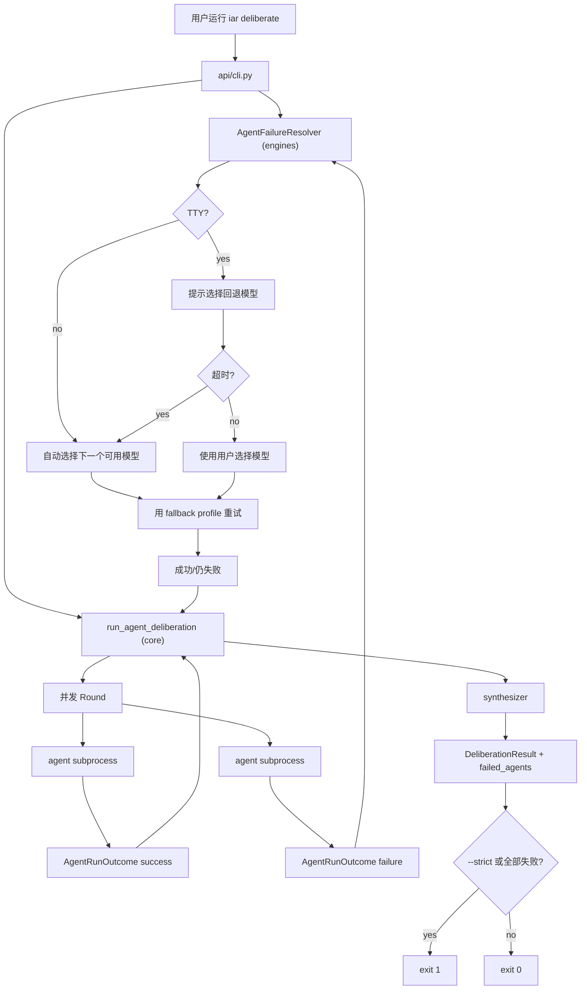

# PRD: Deliberation Agent Failure Resilience

- GitHub Issue: （待创建或留空）

## 1. Introduction & Goals

当前 `iar deliberate` 在任一参与者 agent 或 synthesizer 子进程非 0 退出时会直接抛出异常，导致整个合议会话中断，并丢弃其他 agent 已经产生的部分输出。实际运行中，`skeptic` profile 使用 `kimi` 时因为命令行传入了 `kimi` 不支持的 `--quiet` 选项而立即失败，进而拖垮整个会话。

本 PRD 的目标是让 `iar deliberate` 对单个 agent 失败具有弹性：失败 agent 的输出位置保留已生成的部分结果，会话继续完成剩余 agent 和综合阶段，同时提供交互式/自动的模型回退机制，并把失败记录写进最终产物。

### Proposed Solution Summary

在现有 `run_agent_deliberation` 编排内部引入**单 agent 失败隔离**机制：

- `_run_single_agent` 不再在子进程非 0 退出时直接抛异常，而是返回包含 `stdout`、`return_code`、`profile_id` 的 `AgentRunOutcome`。
- 每轮结束后，核心编排区分成功输出与失败记录；失败记录进入 `failed_agents` 集合。
- 对每个失败 agent，调用新增的领域服务 `AgentFailureResolver`（位于 `engines` 层）决定回退模型：
  - TTY 模式下先提示用户选择可用模型，等待 `[agent_runner.deliberation] agent_failure_timeout_seconds`（默认 300 秒），超时未确认则自动选择下一个可用模型。
  - 非 TTY 模式直接自动选择下一个可用模型。
- 回退模型使用相同的 `profile_id` / `role` / `behavior_prompt`，仅替换底层 `agent`（如 `kimi` -> `claude`），重新执行该轮任务；若回退成功，其输出替代原失败输出。
- 默认 CLI 退出码为 0（会话完成并保留部分输出），`--strict` 标志使任一 agent 失败即返回非 0。
- 配置落到 `.iar.toml` 的 `[agent_runner.deliberation]`：`continue_on_agent_error`（默认 `true`）、`agent_failure_timeout_seconds`（默认 300）。
- 顺手修复 `transcript_runner.py` 中 `kimi`  deliberation 命令仍带 `--quiet` 的 bug。

这个方案复用现有并发编排和 streaming 文件写入能力，不新增数据库存储、Web UI 或外部多 agent 框架。

### Measurable Objectives

- `uv run iar deliberate "<prompt>"` 在单个 agent 因 CLI 选项/配额/网络失败时，会话仍能完成其余 agent 并生成 `transcript.md`、`result.md`、`events.jsonl`、`session.json`。
- 失败 agent 的 `workspaces/<profile_id>/round-<n>-output.md` 保留失败前已生成的 partial 输出。
- 失败 agent 的回退模型选择过程在 TTY 下可交互、在非 TTY 下自动完成，并在 5 分钟无确认时自动回退。
- 最终 `session.json` 与 `DeliberationResult` 中包含 `failed_agents` 列表，记录失败的 `profile_id`、原 agent、最终回退 agent（如有）、失败原因。
- `--strict` 模式下任一 agent 失败导致 CLI 返回非 0。
- `kimi` 的 deliberation 命令不再包含 `--quiet`。
- `just test`、`uv run mkdocs build --strict` 通过。

### Realistic Validation

除单元测试和集成测试外，本 PRD 要求通过**真实项目入口点**验证关键行为，确保真实使用路径生效，而非仅在隔离 fixture 中通过。

- [ ] **单 agent 失败回退真实验证**：在 TTY 下执行 `uv run iar deliberate "测试" --agents architect,skeptic --rounds 1 --session-id test-resilience-001`，手动制造 `skeptic` 失败（如临时把 `kimi` 改名/配置错误），验证终端提示选择回退模型、5 分钟超时后自动切换，且 `result.md` 仍生成，`session.json` 包含 `failed_agents`。
- [ ] **非 TTY 自动回退真实验证**：通过 `echo "" | uv run iar deliberate "测试" --agents architect,skeptic --rounds 1 --session-id test-resilience-002` 或 `CI=true` 环境运行，验证不弹提示、直接回退、退出码为 0（无 `--strict`）。
- [ ] **kimi --quiet 修复真实验证**：若本机 `kimi` 可用，执行 `uv run iar deliberate "测试" --agents skeptic --rounds 1 --session-id test-kimi-quiet`，验证 `skeptic` 不再因 `unknown option '--quiet'` 立即失败。

**为什么单元测试不够**：失败隔离涉及 TTY 检测、超时线程、用户输入、子进程真实退出码和最终产物写入，这些交互在隔离的 fake runner 测试中无法完整覆盖；必须通过真实 CLI 入口验证默认退出码、`failed_agents` 记录和 `kimi` 命令实际可用性。

### Delivery Dependencies

- Group: agent-runner-deliberation
- Depends on groups:
  - none
- Depends on tasks/issues:
  - none
- Gate type: none
- Notes: 本任务与已归档的 deliberation PRDs 属于同一功能线的后续增强，无外部阻塞依赖。

## 2. Requirement Shape

| 维度 | 要求 |
|---|---|
| 执行者 | 在终端运行 `iar deliberate` 的开发者 |
| 触发条件 | 多 agent 合议过程中某个 participant 或 synthesizer 子进程非 0 退出 |
| 期望行为 | 失败被隔离到单个 agent；保留 partial 输出；提示/自动选择回退模型；会话继续完成；默认退出 0；`--strict` 退出非 0 |
| 范围边界 | 不改并发模型、不新增数据库存储、不做 Web UI、不暴露隐藏 chain-of-thought、仅修复 `kimi` `--quiet` 一个已知命令构建 bug |

## 3. Repository Context And Architecture Fit

### Current Relevant Modules And Files

- `src/backend/core/use_cases/run_agent_deliberation.py`
  - 合议编排核心。当前 `_run_single_agent` 在 `return_code != 0` 时抛出 `RuntimeError`，导致整轮失败向上冒泡。
- `src/backend/engines/agent_runner/transcript_runner.py`
  - 构建 `claude`/`kimi`/`codex` deliberation 命令。`kimi` 分支当前返回 `["kimi", "--quiet", "--input-format", "text"]`，`kimi` CLI 不支持 `--quiet`。
- `src/backend/api/cli.py`
  - `deliberate` 子命令入口。需要新增 `--strict` 标志、解析 TTY 状态，并决定最终退出码。
- `src/backend/infrastructure/config/settings.py`
  - `AgentRunnerDeliberationSettings` 与 `.iar.toml` 加载/合并逻辑需要新增 `continue_on_agent_error` 和 `agent_failure_timeout_seconds`。
- `src/backend/engines/agent_runner/factory.py`
  - `_build_deliberation_config` 和 `_merge_deliberation_config` 把 pydantic settings 映射到 core `DeliberationConfig`。
- `src/backend/core/shared/models/agent_deliberation.py`
  - `DeliberationConfig`、`DeliberationResult` 等纯数据模型需要扩展失败相关字段。
- `src/backend/core/shared/models/agent_runner.py`
  - `AppConfig` 已承载 `deliberation`，新增字段有默认值即可保持向后兼容。
- `docs/guides/agent-runner.md`
  - 需补充 `--strict`、失败回退行为、`.iar.toml` 配置项说明。
- `tests/test_run_agent_deliberation.py`、`tests/test_agent_runner_cli.py`
  - 需补充失败隔离、回退、退出码、`--strict` 的测试。

### Existing Architecture Pattern To Follow

继续遵守四层依赖方向：

```text
src/backend/api/ -> src/backend/core/ -> src/backend/engines/ -> src/backend/infrastructure/
```

- `core` 层只负责编排和纯模型，不能导入 `engines`/`infrastructure`/`api`。
- 失败回退中的用户交互、TTY 检测、超时逻辑属于运行期适配，应放在 `engines` 层（或 API 装配时注入的 resolver），不能污染 core。
- `infrastructure` 层保留配置加载与命令构建，但命令构建属于 engines? 当前 `transcript_runner.py` 位于 `engines`，符合方向。
- 文本文件 I/O 继续显式使用 `encoding="utf-8"`。

### Ownership And Dependency Boundaries

- `run_agent_deliberation.py` 决定“某个 agent 失败是否导致整轮失败”，并持有 `failed_agents` 集合。
- 模型/模型选择/超时/提示 UI 由 engines 层的 `AgentFailureResolver` 负责，core 只通过抽象端口调用。
- `cli.py` 决定最终退出码（基于 `--strict` 与 `failed_agents`）。
- `settings.py` 提供 `.iar.toml` 配置字段；`factory.py` 完成 settings -> core config 映射与合并。

### Constraints From Runtime, Docs, Tests, Or Workflows

- 实现后必须运行 `just test`。
- 新增 CLI 选项需同步更新 `src/backend/api/cli_typer.py`（项目约定：argparse 后端与 Typer 入口保持一致）。
- `.iar.toml` 新字段必须能被 `AgentRunnerDeliberationSettings` 解析并被 `load_agent_runner_local_settings` 加载。
- 默认行为必须向后兼容：未配置新字段时等于旧行为开启容错（`continue_on_agent_error=true`）。
- `kimi` 命令修复后，自动化测试应能复现并锁定“不再传 `--quiet`”。

### Matching Or Related PRDs

- `tasks/archive/20260522-101500-prd-multi-agent-debate.md`：定义了 deliberation 初始范围，其中 FR-13 要求“participant/synthesizer 非 0 退出时失败会话”。本 PRD 明确修改该决策：默认改为容错，仅在 `--strict` 或 `continue_on_agent_error=false` 时保持失败冒泡。
- `tasks/archive/20260524-005848-prd-deliberation-live-agent-output.md`：已实现 streaming per-agent 输出与 live view。本 PRD 复用其“partial 输出保留在 workspace 文件”的能力，不改动展示层。
- `tasks/pending/P1-FEAT-20260622-152049-iar-repl-interactive-entry.md`：与本 deliberation 失败容错无直接依赖关系，可独立交付。

## 4. Recommendation

### Recommended Approach

推荐在现有 `run_agent_deliberation` 编排中引入**失败隔离 + 可配置回退解析器**，并修复 `kimi` 命令 bug。

具体目标状态：

1. **核心模型扩展**
   - `DeliberationConfig` 增加 `continue_on_agent_error: bool = True` 与 `agent_failure_timeout_seconds: int = 300`。
   - `DeliberationResult` 增加 `failed_agents: tuple[DeliberationAgentFailure, ...]`，记录 `profile_id`、`attempted_agent`、`fallback_agent`（可能为 `None`）、`reason`。
   - 新增 `DeliberationAgentFailure` dataclass（或字典）保存失败上下文。

2. **编排层失败隔离**
   - `_run_single_agent` 返回 `AgentRunOutcome`（`success: bool`、`stdout: str`、`return_code: int`、`profile_id: str`）。
   - `_run_round` 汇总成功输出与失败记录；对失败记录调用回退解析器。
   - 若 `continue_on_agent_error=false`，任一失败立即结束会话（保持旧行为，可被 `--strict` 隐式开启）。
   - synthesizer 失败同样走回退解析器；若最终仍失败，则 `result.md` 的各 section 为空，`failed_agents` 记录 synthesizer。

3. **失败回退解析器（engines 层）**
   - 新增 `src/backend/engines/agent_runner/failure_resolver.py` 中的 `AgentFailureResolver`。
   - 输入：失败的 `DeliberationAgentProfile`、当前 `DeliberationConfig`、可用 agent 列表、TTY 状态。
   - 输出：回退后的 `DeliberationAgentProfile`（`profile_id` 不变，`agent` 改变）。
   - TTY 模式：打印失败原因与可用模型列表，等待用户输入；使用 `agent_failure_timeout_seconds` 超时，超时后自动选择列表中第一个可用模型。
   - 非 TTY 模式：跳过提示，直接选择第一个可用模型。
   - 若不存在其他可用模型（如只配置了一个 profile），则直接记录失败，不再重试。

4. **CLI 退出码与 `--strict`**
   - CLI 默认在会话完成后返回 0，即使存在失败 agent（只要至少一个 agent 成功或 synthesizer 成功/回退后成功）。
   - 若 `--strict` 被设置，或 `continue_on_agent_error=false` 且存在失败，CLI 返回 1。
   - 若所有 participant 均失败且 synthesizer 无法生成结果，即使非 strict 也返回 1（无有效输出）。

5. **修复 `kimi`  deliberation 命令**
   - `transcript_runner.py` 的 `_build_deliberation_command` 中 `kimi` 分支改为 `["kimi", "--input-format", "text"]`，去掉 `--quiet`。

### Why This Is The Best Fit

- 失败隔离点刚好在 `_run_single_agent` 边界，不需要新增独立编排服务。
- 回退解析器放在 engines 层，让 core 保持无 UI/无超时依赖，符合依赖方向。
- 复用现有 streaming workspace 文件机制，partial 输出天然保留。
- 通过 `.iar.toml` 暴露配置，使用户可在 CI 中关闭交互式回退或调整超时。
- 顺手修复 `--quiet` 是同一失败模式的根因，避免 PRD 与实际 bug 分离。

### Rationale For Rejecting Redundant Abstractions

- 不需要新的 deliberation orchestration service：现有 `run_agent_deliberation.py` 已拥有 round 生命周期。
- 不需要数据库/事件总线：失败记录属于单次会话产物，写入 `session.json` 即可。
- 不需要通用 agent 重试框架：当前失败回退仅发生在 deliberation 场景，范围可控；泛化到 Issue Runner 会引入不必要复杂度。

### Alternatives Considered

| 方案 | 说明 | 结论 |
|---|---|---|
| 保持失败即中断 | 继续让任一 agent 失败冒泡 | 拒绝；这正是本次要解决的问题，且实际运行已因此丢弃大量输出 |
| 失败后仅记录并跳过，不回退 | 失败 agent 该轮无输出，后续轮次也不重试 | 拒绝；会导致该 perspective 缺失，降低合议价值 |
| 在 core 层直接调用 `input()` | 把交互逻辑塞进编排 | 拒绝；破坏 core 层的无 UI/无 I/O 边界 |
| 为每个 profile 预配置 fallback agent | `.iar.toml` 中显式写 `fallback_agent` | 可选但不默认；自动选择下一个可用模型更省配置，后续可在配置中补充显式 fallback |
| 新增 `--fail-fast` 而非 `--strict` | 默认容错，提供 `--fail-fast` | 拒绝；用户明确要求 `--strict` 对应非零退出，语义与现有 CLI 工具一致 |

## 5. Implementation Guide

This section is a living implementation guide based on current repository analysis. If implementation discovers additional affected files, hidden dependencies, edge cases, or a better path, update this PRD before proceeding.

### Core Logic

目标流程：

```text
CLI 启动 deliberate 会话
└── API 层 (cli.py)
    ├── 解析 --strict
    ├── 创建 output_view / event_sink / transcript_runner
    └── 调用 run_agent_deliberation(..., resolver=AgentFailureResolver(...))

Use case (run_agent_deliberation)
├── 选择 selected_profiles
├── Round 1..N
│   ├── 并发调用 _run_single_agent 得到 AgentRunOutcome 列表
│   ├── 成功输出进入 outputs
│   ├── 失败 outcome 进入 failed_outcomes
│   ├── 若 continue_on_agent_error=false 且存在失败：直接结束/冒泡
│   ├── 对每个失败 outcome，调用 resolver.resolve(profile)
│   │   ├── TTY：提示用户选择可用模型，等待 agent_failure_timeout_seconds
│   │   ├── 非 TTY：自动选择下一个可用模型
│   │   └── 返回 fallback profile
│   ├── 用 fallback profile 重新执行该轮
│   │   └── 成功则替代原失败输出；仍失败则保留 partial 并记录
│   └── 组装本轮 transcript
├── Synthesis
│   ├── 运行 synthesizer
│   ├── 若失败且 continue_on_agent_error=true：同样走 resolver 回退
│   └── 最终 synthesizer 失败则 result section 为空
├── 写入 events、transcript、result、session
└── 返回 DeliberationResult（含 failed_agents）

CLI
├── 接收 result
├── 若 --strict 或 continue_on_agent_error=false 且 failed_agents 非空：返回 1
├── 若所有 agent 失败且 synthesizer 无输出：返回 1
└── 否则返回 0
```

关键点：

- `AgentRunOutcome` 必须在失败时仍携带 `stdout`，这样 partial 输出已存在于 workspace 文件，且可被 transcript 引用为“（失败，partial 输出）”。
- resolver 返回的 fallback profile 与原 profile 共享 `profile_id`、`role`、`behavior_prompt`，仅 `agent` 字段不同；这保证 transcript 标题和 live view 栏位不变。
- TTY 检测使用 `sys.stdin.isatty() and sys.stdout.isatty()`；交互提示使用 `input()` 并配合超时线程（可用 `threading.Thread` + `queue.Queue` 或 `select`）。
- 超时后自动选择“下一个可用模型”的算法：取 `config.profiles` 中所有 `agent` 去重，排除当前失败 agent 的 `agent`，按出现顺序取第一个。
- 非 TTY 下不阻塞，直接自动回退，避免 CI 挂起。

### Change Impact Tree

```text
.
├── Domain
│   └── src/backend/core/shared/models/agent_deliberation.py
│       [修改]
│       【总结】为 DeliberationConfig 增加容错开关与超时字段，为 DeliberationResult 增加 failed_agents 记录。
│
│       ├── DeliberationConfig 增加 continue_on_agent_error、agent_failure_timeout_seconds
│       ├── 新增 DeliberationAgentFailure dataclass
│       └── DeliberationResult 增加 failed_agents 字段
│
├── Domain
│   └── src/backend/core/use_cases/run_agent_deliberation.py
│       [修改]
│       【总结】把单 agent 失败从抛异常改为返回失败结果，调用 resolver 进行模型回退，并汇总 failed_agents。
│
│       ├── _run_single_agent 返回 AgentRunOutcome 而不是 str
│       ├── _run_round 收集成功/失败 outcome
│       ├── 失败时调用外部 resolver 获取 fallback profile 并重试
│       ├── synthesizer 失败也走回退流程
│       └── run_agent_deliberation 返回带 failed_agents 的 DeliberationResult
│
├── Infrastructure Config
│   └── src/backend/infrastructure/config/settings.py
│       [修改]
│       【总结】在 AgentRunnerDeliberationSettings 中新增 continue_on_agent_error 与 agent_failure_timeout_seconds。
│
│       ├── AgentRunnerDeliberationSettings 增加两个字段
│       └── 默认值保证向后兼容
│
├── Engines
│   └── src/backend/engines/agent_runner/factory.py
│       [修改]
│       【总结】把 settings 中的容错字段映射到 DeliberationConfig，并在合并 repo override 时保留。
│
│       ├── _build_deliberation_config 映射新增字段
│       └── _merge_deliberation_config 合并新增字段
│
├── Engines
│   └── src/backend/engines/agent_runner/transcript_runner.py
│       [修改]
│       【总结】修复 kimi  deliberation 命令中不支持的 --quiet 选项。
│
│       └── _build_deliberation_command 的 kimi 分支去掉 --quiet
│
├── Engines
│   └── src/backend/engines/agent_runner/failure_resolver.py
│       [新增]
│       【总结】实现单 agent 失败后的交互式/自动模型回退解析器。
│
│       ├── AgentFailureResolver 类
│       ├── resolve(profile, failed_agent, available_agents) -> fallback profile
│       ├── TTY 提示 + 超时自动回退
│       └── 非 TTY 直接自动回退
│
├── API
│   └── src/backend/api/cli.py
│       [修改]
│       【总结】为 deliberate 命令新增 --strict 标志，注入 failure resolver，并依据失败状态决定退出码。
│
│       ├── deliberate subparser 增加 --strict
│       ├── 实例化 AgentFailureResolver 并传入 use case
│       └── 根据 result.failed_agents 与 --strict 返回 0/1
│
├── API
│   └── src/backend/api/cli_typer.py
│       [修改]
│       【总结】Typer 入口同步增加 --strict 选项，保持与 argparse 后端一致。
│
├── Tests
│   ├── tests/test_run_agent_deliberation.py
│   │   [修改]
│   │   【总结】补充单 agent 失败隔离、回退重试、failed_agents 记录的单元测试。
│   │
│   │   ├── fake runner 返回非 0 的用例
│   │   ├── fake resolver 返回 fallback profile 的用例
│   │   └── 验证 result.failed_agents 与 transcript 产物
│   │
│   ├── tests/test_agent_runner_cli.py
│   │   [修改]
│       【总结】验证 --strict 对退出码的影响与 continue_on_agent_error 配置行为。
│   │
│   └── tests/test_process_runner.py 或新增 tests/test_transcript_runner.py
│       [修改/新增]
│       【总结】锁定 kimi deliberation 命令不再包含 --quiet。
│
└── Docs
    └── docs/guides/agent-runner.md
        [修改]
        【总结】补充 --strict、失败回退行为、.iar.toml 配置项与已知 kimi --quiet 修复说明。
```

### Executor Drift Guard

- 搜索现有 deliberation 命令构建断言：`rg -n "kimi.*--quiet|_build_deliberation_command" src/backend/engines/agent_runner/`。
- 搜索 `--quiet` 在 deliberation 相关测试中的引用：`rg -n "--quiet" tests/`。
- 搜索 `deliberate` 参数解析：`rg -n "deliberate|strict" src/backend/api/cli.py src/backend/api/cli_typer.py`。
- 搜索 `DeliberationConfig` 构造位置：`rg -n "DeliberationConfig\(" src/`。
- 如果实现发现 `_run_single_agent` 被其他模块调用（如 tests 直接调用），需要同步更新签名。
- 本 PRD 列出的文件是起点，实际实现中可能还需调整 `write_deliberation_outputs` 以写入 `failed_agents` 到 `session.json`。

### Flow Or Architecture Diagram



### Realistic Validation Plan

| Behavior | Real Entry Point | Test Layer | Mock Boundary | Data/Env Needed | Command Or Procedure | Required For Acceptance |
|---|---|---|---|---|---|---|
| 单 participant 失败隔离与自动回退 | `iar deliberate` CLI | e2e / sandbox | `transcript_runner` 用 fake 返回失败/成功；resolver 真实 | 任意 Git 仓库根目录、`.iar.toml` | `CI=true uv run iar deliberate "测试" --agents architect,skeptic --rounds 1 --session-id resilience-auto` | Yes |
| TTY 交互式模型选择 + 5 分钟超时 | `iar deliberate` CLI | manual | 真实 `input()` 与超时线程 | TTY 终端、故意让 `skeptic` 失败 | `uv run iar deliberate "测试" --agents architect,skeptic --rounds 1 --session-id resilience-tty`，不输入回车等待 300 秒 | Yes |
| `--strict` 退出码非 0 | `iar deliberate` CLI | e2e | fake runner 返回失败 | 任意仓库根目录 | `uv run iar deliberate "测试" --agents architect,skeptic --rounds 1 --strict; echo $?` | Yes |
| `kimi` 命令不再传 `--quiet` | `transcript_runner` 单元 + 真实 CLI | unit / manual | 单元测试直接断言命令列表；真实验证可选 | `kimi` CLI 可用（可选） | `uv run pytest tests/test_transcript_runner.py -q` 或 `uv run iar deliberate "测试" --agents skeptic --rounds 1` | Yes |
| 默认退出码 0 且 `session.json` 含 `failed_agents` | `iar deliberate` CLI | e2e | fake runner | 任意仓库根目录 | `uv run iar deliberate "测试" --agents architect,skeptic --rounds 1 --session-id resilience-default && cat logs/agent-runner/deliberations/resilience-default/session.json` | Yes |

**高摩擦验证排错说明**：
- 若 `--strict` 退出码仍为 0，检查 `cli.py` 中 `result.failed_agents` 是否为空、`--strict` 是否被正确解析。
- 若 TTY 提示未出现或 CI 挂起，检查 `sys.stdin.isatty()` 与超时线程实现。
- 若 `kimi` 仍失败于 `--quiet`，检查 `_build_deliberation_command` 是否仍含 `--quiet`。

### Low-Fidelity Prototype

TTY 下失败时的交互示例：

```text
[round=1 agent=skeptic status=failed] provider=kimi exit=2

The skeptical agent failed. Available fallback models:
  1) claude
  2) codex

Choose a fallback model (auto-selecting claude in 300s): _
```

5 分钟内无输入：

```text
No selection within 300s; automatically switching skeptic to claude.
[round=1 agent=skeptic status=running] provider=claude
```

非 TTY 下：

```text
[round=1 agent=skeptic status=failed] provider=kimi exit=2
[round=1 agent=skeptic status=running] provider=claude (auto-fallback)
```

### ER Diagram

No database model changes in this PRD. `DeliberationConfig`、`DeliberationResult`、`DeliberationAgentFailure` 是运行期 dataclass，只写入 `session.json`。

### Interactive Prototype Change Log

No interactive prototype file changes in this PRD.

### External Validation

No external validation required; repository evidence was sufficient.

## 6. Definition Of Done

- `run_agent_deliberation` 对单 agent 失败默认隔离并继续执行，不再整体抛异常。
- TTY 下失败时提示用户选择回退模型，5 分钟无确认自动回退。
- 非 TTY 下直接自动回退，不阻塞。
- `--strict` 模式下任一 agent 失败导致 CLI 返回非 0。
- 默认模式下会话完成返回 0，且 `session.json` 与 `DeliberationResult` 包含 `failed_agents`。
- `kimi` deliberation 命令不再包含 `--quiet`。
- `docs/guides/agent-runner.md` 更新相关说明。
- `uv run pytest tests/test_run_agent_deliberation.py tests/test_agent_runner_cli.py -q` 通过。
- `just test` 通过。
- `uv run mkdocs build --strict` 通过。

## 7. Acceptance Checklist

### Architecture Acceptance

- [ ] `src/backend/core/use_cases/run_agent_deliberation.py` 不导入 `engines`/`infrastructure`/`api`；失败回退通过注入的 resolver 完成。
- [ ] `AgentFailureResolver` 位于 `engines` 层，core 只依赖抽象端口或 callable。
- [ ] `DeliberationConfig` / `DeliberationResult` 的扩展字段有默认值，不破坏现有调用方。
- [ ] 不新增数据库表、Web UI、外部多 agent 框架或复杂 TUI。

### Behavior Acceptance

- [ ] 单个 participant 失败时，其他 participant 继续运行，不整体中断。
- [ ] 失败 participant 的 `workspaces/<profile_id>/round-<n>-output.md` 保留 partial 输出。
- [ ] TTY 下失败时提示用户选择可用模型；5 分钟未选择自动选择下一个可用模型。
- [ ] 非 TTY 下失败时直接自动选择下一个可用模型，不提示。
- [ ] synthesizer 失败时同样支持回退；若最终仍失败，`result.md` 各 section 为空但会话结束。
- [ ] `--strict` 标志存在且任一 agent 失败时 CLI 返回非 0。
- [ ] 无 `--strict` 且至少一个 agent 成功时，CLI 默认返回 0，终端输出警告失败的 agent。
- [ ] 所有 participant 与 synthesizer 均失败时，CLI 返回 1（无论是否 `--strict`）。

### Configuration Acceptance

- [ ] `.iar.toml` 的 `[agent_runner.deliberation]` 支持 `continue_on_agent_error`（默认 true）与 `agent_failure_timeout_seconds`（默认 300）。
- [ ] `config.toml` 的 `[agent_runner.deliberation]` 也支持上述字段作为全局默认值。
- [ ] `AgentRunnerDeliberationSettings` 能通过 pydantic 校验上述字段。
- [ ] `factory.py` 的 `_build_deliberation_config` 与 `_merge_deliberation_config` 正确映射/合并上述字段。

### Provider Command Acceptance

- [ ] `src/backend/engines/agent_runner/transcript_runner.py` 中 `kimi` 分支构建的命令列表不含 `--quiet`。
- [ ] 自动化测试覆盖 `_build_deliberation_command("kimi", ...)` 返回结果不含 `--quiet`。

### Documentation Acceptance

- [ ] `docs/guides/agent-runner.md` 说明默认容错行为、`--strict`、`.iar.toml` 配置项与 `failed_agents` 记录。
- [ ] 文档说明 `kimi --quiet` 修复后的命令形态。
- [ ] `mkdocs.yml` 无需新增导航（在现有页面内更新）。

### Validation Acceptance

- [ ] `uv run pytest tests/test_run_agent_deliberation.py tests/test_agent_runner_cli.py -q` 通过。
- [ ] `just test` 通过。
- [ ] `uv run mkdocs build --strict` 通过。
- [ ] 在 TTY 中真实运行 `uv run iar deliberate` 并制造单个 agent 失败，验证提示、超时自动回退、`session.json` 含 `failed_agents`。
- [ ] 在非 TTY/CI 环境下真实运行 `uv run iar deliberate` 并制造单个 agent 失败，验证无提示直接回退、退出码为 0。
- [ ] 若本机 `kimi` 可用，真实运行 `uv run iar deliberate` 使用 `skeptic` profile，验证不再因 `--quiet` 失败。

## 8. Functional Requirements

- **FR-1**: `run_agent_deliberation` 必须在单个 participant 或 synthesizer 子进程失败时继续执行，默认不把失败冒泡为会话级异常。
- **FR-2**: `DeliberationConfig` 必须支持 `continue_on_agent_error`（默认 `true`）和 `agent_failure_timeout_seconds`（默认 300）。
- **FR-3**: `DeliberationResult` 必须包含 `failed_agents` 字段，记录失败的 `profile_id`、尝试过的 `agent`、最终回退 `agent`（可能为 `None`）与失败原因。
- **FR-4**: 失败 agent 的 workspace 输出文件必须保留失败前已生成的 partial 内容。
- **FR-5**: TTY 模式下，失败时必须提示用户选择回退模型，并在 `agent_failure_timeout_seconds` 无输入后自动选择下一个可用模型。
- **FR-6**: 非 TTY 模式下，失败时必须直接自动选择下一个可用模型，不等待用户输入。
- **FR-7**: 回退模型必须使用原 `profile_id`、`role`、`behavior_prompt`，仅替换底层 `agent`。
- **FR-8**: 当不存在其他可用模型时，必须记录失败并继续，不再无限重试。
- **FR-9**: CLI `deliberate` 必须支持 `--strict` 标志；设置后任一 agent 失败导致 CLI 返回非 0。
- **FR-10**: 默认模式下，只要至少一个 agent 成功且会话完成，CLI 返回 0；全部失败时返回 1。
- **FR-11**: `transcript_runner.py` 构建 `kimi` deliberation 命令时不得传递 `--quiet`。
- **FR-12**: `.iar.toml` 与 `config.toml` 中的 `[agent_runner.deliberation]` 都必须能配置 `continue_on_agent_error` 和 `agent_failure_timeout_seconds`。
- **FR-13**: `factory.py` 必须将上述新配置字段正确映射并合并到 `DeliberationConfig`。
- **FR-14**: `cli_typer.py` 必须与 `cli.py` 同步新增 `--strict` 选项。
- **FR-15**: `docs/guides/agent-runner.md` 必须更新以描述新的失败回退行为与配置。

## 9. Non-Goals

- 不构建通用 agent 重试框架供 Issue Runner 使用。
- 不实现跨轮次 agent 替换（回退只在当前失败轮次生效，后续轮次仍使用原 profile；若后续再次失败可再次回退）。
- 不新增数据库表或长期会话历史。
- 不做 Web UI、SSE、WebSocket 或复杂全屏 TUI。
- 不暴露模型隐藏 chain-of-thought。
- 不修改 Issue Runner 的失败恢复策略。
- 不自动修复 agent CLI 的所有潜在命令行不兼容问题，仅修复已知的 `kimi --quiet`。

## 10. Risks And Follow-Ups

- TTY 超时实现依赖线程/stdin 读取，在 Windows 或某些 CI 伪终端中行为可能与 macOS/Linux 不同；需要在目标平台验证。
- 自动选择“下一个可用模型”基于配置 profiles 的顺序，若用户自定义 profiles 顺序，回退顺序可能不符合预期；后续可考虑在 `.iar.toml` 中显式配置 `fallback_agent`。
- 若所有可用模型对同一 prompt 都失败（如 prompt 超长），会话会记录多次失败；需要确保 `failed_agents` 不重复且输出文件不被覆盖为空。
- `kimi` CLI 未来版本可能支持或要求不同选项，需保持命令构建可配置。
- 默认 `continue_on_agent_error=true` 改变了旧行为（FR-13 在归档 PRD 中要求失败冒泡），已在 Decision Log 中记录。

## 11. Decision Log

| ID | 决策问题 | 选择 | 拒绝 | 理由 |
|---|---|---|---|---|
| D-01 | agent 失败时是否整体中断？ | 默认隔离单 agent 失败并继续，仅在 `--strict` 或 `continue_on_agent_error=false` 时中断 | 保持任一失败即中断（旧 FR-13 行为） | 实际运行已因单点失败丢弃其他 agent 输出，容错是本次核心目标 |
| D-02 | 回退模型选择放在哪一层？ | 新增 `AgentFailureResolver` 在 engines 层，core 通过注入调用 | 在 core 编排中直接调用 `input()` | 保持 core 层无 UI/无超时依赖，符合依赖方向 |
| D-03 | 交互式等待超时的默认值？ | 300 秒（5 分钟），可配置 | 固定值或更短时间 | 5 分钟给用户足够决策时间，又不让 CI/后台长时间挂起 |
| D-04 | 回退模型如何确定？ | 自动从配置 profiles 中按顺序选下一个不同 agent；TTY 允许用户覆盖 | 要求用户在 `.iar.toml` 中显式配置 fallback_agent | 减少配置负担，满足“自动切换”需求；显式 fallback 可作为后续增强 |
| D-05 | 默认 CLI 退出码？ | 0（会话完成且至少一个 agent 成功），`--strict` 返回 1 | 默认失败即非 0 | 用户明确要求默认记录失败但正常退出，`--strict` 用于门禁场景 |
| D-06 | 是否修复 kimi --quiet 在同一 PRD？ | 是，直接去掉 `--quiet` | 拆到独立 PRD | 该 bug 是导致本次失败模式的根因，同 PRD 修复可减少重复验证与回归风险 |
| D-07 | 是否把失败记录持久化到数据库？ | 否，写入 `session.json` 与 `DeliberationResult` | 新增数据库表 | deliberation 产物已是文件输出，数据库属于过度设计 |
