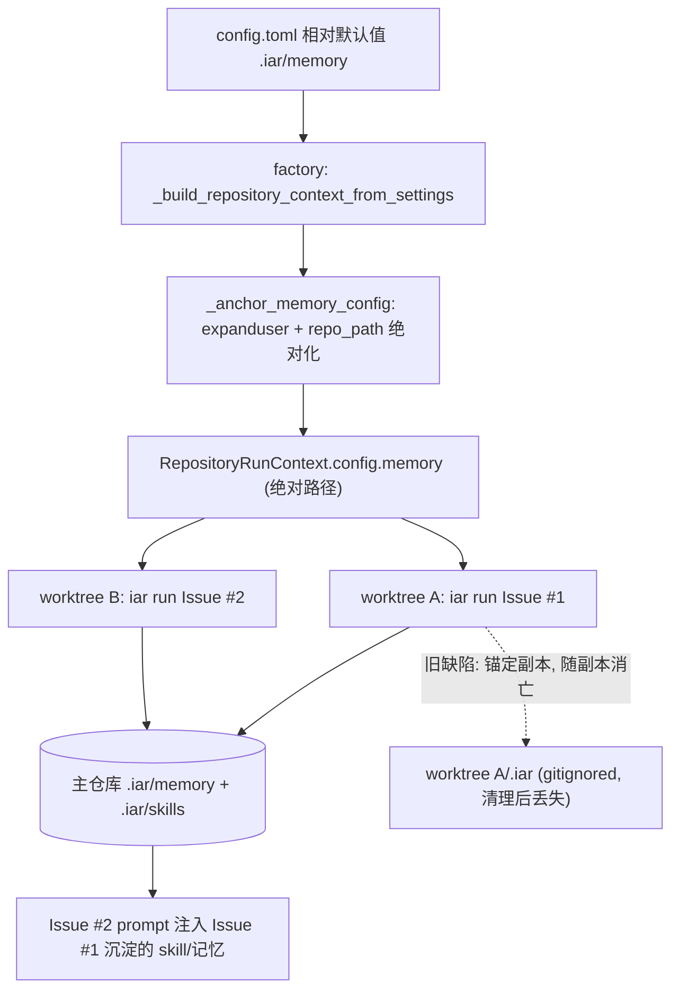

# PRD: Agent Runner 记忆锚点修复——跨 worktree 稳定持久化

- GitHub Issue: （待创建；缺陷源自 PR #125 / Issue #124 的交付）
- 缺陷来源 PRD: `tasks/archive/P1-FEAT-20260626-093933-agent-runner-memory-persistence.md`

> 本 PRD 分两个 altitude，分别服务不同读者，自上而下阅读：
>
> - **Part A · 人审层 (Review Layer)** — 需求方 / 验收人读这部分，决定"该不该做、做得对不对"，并通过风险地图知道**哪些地方必须亲自确认**。Part A 不出现实现机制、文件路径、命令。
> - **Part B · 执行器层 (Build Layer)** — 实现者（人或 Agent）读这部分动手。人只在 Part A 风险地图**点名处**下钻审查，其余默认交执行器 + 自动门禁（hook / 测试 / 架构检查）。

---

# Part A · 人审层 (Review Layer)

## 1. Introduction & Goals

### Problem Statement

PR #125 交付的"Agent Runner 记忆持久化与技能蒸馏"功能，把所有记忆数据（短期记忆、长期记忆、skill 草稿、已晋升 skill）保存在**每个 Issue 专属的临时工作副本内部**。这些工作副本按 Issue 新建、不纳入版本控制、Issue 关闭后被清理——因此 Issue A 沉淀的任何经验，Issue B 永远看不到。

直接后果是该功能的核心承诺全部落空：

1. **跨 Issue 经验复用不可能发生**：后续同类 Issue 的 prompt 里永远不会出现已蒸馏的 skill。
2. **skill 草稿的使用计数永远从 1 开始**：草稿去重、计数累积、自动晋升（默认阈值 3 次）在真实运行中永远无法触发。
3. **维护者手写的长期记忆永远不被读取**：维护者在主仓库里编写的项目约定，runner 只会去临时副本里找，而那里没有。

唯一真正生效的部分是**同一个 Issue 内部**的短期记忆（恢复循环中的历史尝试回放）。感受到疼痛的是 runner 的维护者与运营者：功能默认开启、静默空转，看起来在积累知识，实际什么都没留下。

原 PRD 的验收之所以全部通过，是因为验证被降级为"在同一个临时目录里调用内部函数"——恰好绕开了"每个 Issue 是一个新副本"这个致命场景。

### Interpretation (解读回显)

本 PRD 被解读为：**修复记忆数据的存放锚点**，让 PR #125 已交付的记忆系统真正做到跨 Issue 持久化——记忆改为锚定在**目标仓库的主检出（稳定、跨所有临时工作副本共享）**，磁盘布局、配置项名称、对外行为承诺均维持原 PRD 不变；并且验收必须包含"两个真实独立工作副本之间记忆传递"的验证，纠正原 PRD 的验证降级。

本 PRD **不是**：重做或回滚记忆系统；不是引入数据库或外部服务；不是把记忆纳入 git 版本控制；也不是修改蒸馏/检索/晋升的业务规则本身。

### What The User Gets

- 维护者在主仓库里手写的项目约定（长期记忆），后续所有相关 Issue 的 agent 都能自动引用——不管 runner 在哪个临时副本里干活。
- 同类 Issue 反复成功后，skill 草稿的使用计数真实累积，达到阈值后自动晋升，后续 Issue 的 prompt 自动带上该 skill 的目录——原 PRD 承诺的闭环第一次真正闭合。
- 运营者不需要改任何配置：默认配置语义自动升级为"存到主仓库"；想把记忆放到仓库之外（例如防 `git clean` 误删）的运营者，可把配置改为绝对路径实现。
- 崩溃后换一个新副本继续同一个 Issue 时，之前的尝试历史仍然在（原 PRD 承诺的"跨 claim 续作"这次真的成立）。

### Measurable Objectives

1. 在两个**不同的**临时工作副本中先后处理同类 Issue，第二个副本的 agent prompt 能引用第一个副本沉淀的 skill / 长期记忆。
2. 连续 3 个同类成功 Issue（各自独立副本）后，草稿计数达到 3 并自动晋升——在真实目录拓扑下可复现。
3. 维护者写入主仓库的长期记忆文件，在任意副本发起的相关 Issue 中被检索并注入 prompt。
4. 关闭记忆开关后行为与现状一致；打开时现有测试套件无回归。
5. 并发处理多个 Issue 时，共享记忆目录不出现半写损坏文件。

---

## 2. Human Review Map (介入与风险地图)

判定菜单（逐项对照本次改动是否命中）：

- 固定区域：① Core 业务逻辑 / 编排规则（`core/`）② 数据库结构 / schema / 迁移 ③ 安全 / 鉴权 / 信任边界 ④ 对外 API 契约 / breaking change
- 横切触发器（命中即升级）：⑤ 资金 / 计费 / 额度 ⑥ 不可逆 / 破坏性数据操作 ⑦ 并发 / 事务 / 幂等性

**命中的人审项**：

- ①（正确性关键度上调）**锚点解析语义**：记忆落盘位置从"每 Issue 副本"改为"主仓库根"，是本功能生死攸关的一处语义；且其前身正是一次验证失误漏过的缺陷，证据负担必须最高。
- ⑦ **共享目录并发写入**：锚点共享后，多个并发 Issue 首次真正写同一目录树；写入必须原子化，避免半写损坏。

**未命中**（默认执行器 + 自动门禁）：②③④⑤⑥。最坏自检：② 无 schema，判错最多是文件组织错误，可随时修正；③ 无鉴权/信任边界变化，记忆仍是本地文件；④ 无对外 API 变化，配置项名称不变；⑤ 无资金；⑥ 无删除/回填类操作（旧副本内遗留文件随副本自然消亡，非本次主动删除）。

| 改动点 | 架构层 | 风险 | 介入方式 | 证据 / Oracle |
|---|---|---|---|---|
| 记忆锚点解析语义（相对路径 → 主仓库根） | engines/infrastructure | 高 | 人工确认（高证据负担） | rv-1, rv-2, rv-3 |
| 共享记忆目录的并发写入原子性 | infrastructure | 中 | 人工确认（高证据负担） | rv-6 |
| 记忆开关关闭时行为不变 | core | 低 | 执行器 + 门禁 | rv-4 |
| 配置与文档语义同步 | config/docs | 低 | 执行器 + 门禁 | rv-5 + 文档搜索断言 |
| 回归无破坏 | tests | 低 | 执行器 + 门禁 | rv-5 |

**如何证明它生效（真实入口，白话）**：

- 在一个真实 git 仓库上开**两个真实的独立工作副本**：副本 A 里处理完一个 Issue 后，到副本 B 里处理同类 Issue，B 的 prompt 里必须出现 A 沉淀的 skill；记忆文件必须落在主仓库的记忆目录里，而不是任何一个副本内部。
- 反向对照：故意按旧语义（锚定副本）跑同一流程，B 必须看不到 A 的记忆——证明测试真的能红。
- 明确禁止原 PRD 的验证方式：同一个目录里调三次内部函数不算数。

**数据库结构评审**：本次无数据库结构变化。

---

## 3. Usage And Impact After Implementation

### 维护者

- 在主仓库 `.iar/memory/long_term/facts/<topic>.md` 手写项目约定（与原 PRD 承诺一致）；此后任何副本中运行的相关 Issue 都会检索并注入——这是原功能第一次真正兑现该承诺。
- 在主仓库 `.iar/skills/drafts/` 里审阅草稿、`.iar/skills/` 里管理已晋升 skill；所有 Issue 共享同一份，不再每个副本各一份幽灵拷贝。

### 运营者 / 调用方

- 默认零配置变更：`config.toml` `[agent_runner.memory]` 各目录仍是相对路径写法，语义升级为"相对**目标仓库主检出根**解析"。
- 想把记忆放在仓库外（防 `git clean -fdx` 误删、或多机共享）：把 `base_dir` 等改为绝对路径（支持 `~` 展开），例如：

```toml
[agent_runner.memory]
base_dir = "~/.iar/memory/keda-main"
skill_drafts_dir = "~/.iar/memory/keda-main/skills/drafts"
promoted_skills_dirs = ["~/.iar/memory/keda-main/skills"]
```

- `enabled = false` 完全关闭，行为与修复前一致。

### Impact On Existing Behavior

- 旧的、写在各临时副本里的记忆文件**不迁移**：它们本来就随副本消亡，属于缺陷的产物而非有效数据。
- 主仓库 `.iar/` 已是既有惯例（证据文件同样存放于此）且已被版本控制排除；本次不改变其排除状态。
- runner 状态机、恢复循环、蒸馏与检索规则、prompt 格式均不变；仅记忆的落盘/读取位置改变。

---

## 4. Requirement Shape

- **Actor**：Agent Runner（读写记忆）、维护者（手写长期记忆、审阅草稿）、运营者（配置目录与开关）。
- **Trigger**：与原 PRD 相同——runner 启动时检索、恢复循环中写短期记忆、Issue 成功后蒸馏；本 PRD 不新增触发点。
- **Expected behavior**：所有记忆读写发生在**跨副本稳定**的锚点下（默认＝目标仓库主检出根；绝对路径配置原样使用）；并发写入不产生半写文件。
- **Explicit scope boundary**：
  - 不改变记忆磁盘布局（`short_term/<repo_id>/<issue_number>/context.json` 等）与文件格式。
  - 不改变 `MemoryConfig` 字段集合与配置项名称。
  - 不引入数据库、外部服务、文件锁服务。
  - 不把记忆纳入版本控制。
  - 不修改蒸馏过滤、相似度合并、Top-K 检索、自动晋升阈值等业务规则。

---

# Part B · 执行器层 (Build Layer)

## 5. Repository Context And Architecture Fit

### 当前相关模块/文件

| 关注点 | 位置 | 说明 |
|---|---|---|
| 锚点解析 | `src/backend/infrastructure/memory/adapters.py` | `resolve_memory_paths(worktree_path, ...)` 的 `anchor()`：相对路径挂到传入路径下，绝对路径原样使用。缺陷根源。 |
| 记忆服务组装 | `src/backend/core/agent/memory/_composition.py` | `build_default_memory_services(worktree_path, memory_config)`，把传入路径透传给 `resolve_memory_paths`。 |
| per-repo 配置构建 | `src/backend/engines/agent_runner/factory.py` | `_build_repository_context_from_settings` 合并配置后构建 `RepositoryRunContext(repo_id, display_name, repo_path, config)` —— **修复的唯一注入点**：此处同时持有 `effective_repo_path` 与最终 `effective_config`。 |
| MemoryConfig 域模型 | `src/backend/core/shared/models/agent_runner.py` | `MemoryConfig` frozen dataclass；docstring 现声明 "Always written as `<worktree>/<base_dir>`"，需更正。 |
| 记忆调用点 | `src/backend/core/use_cases/run_agent_once.py` / `agent_runner_publication.py` / `agent_runner_feedback.py` | `_persist_short_term_memory`、`_try_distill_skill_after_success`、`build_prompt`→`load_relevant_memory`，均以 `worktree_path` 作锚传入组装函数——配置绝对化后该实参对路径解析不再起作用，签名不动。 |
| 存储实现 | `src/backend/infrastructure/memory/short_term_store.py` / `long_term_store.py` / `skill_draft_store.py` | 纯文件系统读写；写入需原子化（tmp + `os.replace`）。 |
| 配置默认值 | `config.toml` `[agent_runner.memory]`；`src/backend/infrastructure/config/settings.py` `AgentRunnerMemorySettings` | 相对路径默认值保持不变，仅语义注释更新。 |

### 既有架构模式（需遵循）

- 依赖方向 `api → core → engines → infrastructure`；本修复主体在 engines（factory 构建配置值）与 infrastructure（原子写），core 仅改注释/告警，不引入新的跨层依赖。
- `MemoryConfig` 是 frozen dataclass：改写字段用 `dataclasses.replace`。
- 文本 I/O 显式 `encoding="utf-8"`；公共 API Google Style Docstrings；内部注释中文。
- 单文件目标 <500 非空行。

### 所有权与依赖边界

| 关注点 | 责任归属 |
|---|---|
| 锚点绝对化（相对目录 → `repo_path` 下绝对路径，含 `~` 展开） | `src/backend/engines/agent_runner/factory.py`（`RepositoryRunContext` 构建处） |
| 相对目录抵达组装层时的防回归告警 | `src/backend/core/agent/memory/_composition.py` |
| 原子写入 | `src/backend/infrastructure/memory/` 三个 store |
| 语义文档 | `MemoryConfig` docstring、`config.toml` 注释、`docs/guides/agent-runner.md` |

### Frontend Impact

- **No frontend impact**：仅改后端 runner 的本地文件锚点与写入方式，无任何用户界面。

### Existing PRD Relationship

- `tasks/archive/P1-FEAT-20260626-093933-agent-runner-memory-persistence.md` —— 缺陷来源。本 PRD 是其修复增量；原 PRD 保持归档不动（append-only），本 PRD 记录其验收失效原因（验证降级为同目录内部函数调用）。
- `tasks/pending/P1-REFACTOR-20260703-184226-api-engines-layer-migration.md` —— 同样触碰 engines 层。**软相关**：若该重构移动 `factory.py` 中的上下文构建代码，本 PRD 的注入点跟随迁移；两者独立可交付，建议先合入者通知后合入者做一次 rebase 检查。
- 其余 pending PRD（autopilot-merge-queue、roadmap-scheduling、prd-regrounding）与本 PRD 无重叠。
- **未发现重复 PRD**。

### Potential Redundancy Risks

- 风险：在 use-case 层再穿一遍 `repo_path` 参数，与配置绝对化双轨并存。规避：只在 factory 一处绝对化，签名一律不动（见 D-02）。
- 风险：为并发再造文件锁模块。规避：只做 tmp + `os.replace` 原子替换，接受 last-write-wins（见 D-04）。

---

## 6. Recommendation

### Recommended Approach（最小改动路径）

1. **factory 构建 per-repo 配置时绝对化记忆目录**
   - 在 `_build_repository_context_from_settings` 中、`return RepositoryRunContext(...)` 之前，对 `effective_config.memory` 做一次变换：`base_dir`、`skill_drafts_dir`、`promoted_skills_dirs` 中的每个路径先 `expanduser()`，仍为相对路径者解析为 `effective_repo_path / <rel>` 的绝对路径；用 `dataclasses.replace` 写回（`AppConfig`、`MemoryConfig` 均 frozen）。
   - 该函数是仓库中 `RepositoryRunContext(` 的唯一构建点（见 Drift Guard #1），所有 CLI/daemon 消费路径都经过它。

2. **组装层防回归告警**
   - `build_default_memory_services` 在收到仍为相对路径的记忆目录时，记一条 warning（说明预期应由 factory 绝对化），行为保持现状（继续以传入路径为锚）——保证直接构造 `MemoryConfig` 的既有测试不破坏，同时让任何漏网的生产路径在日志里现形。

3. **存储写入原子化**
   - 三个 store 的落盘统一为：写入同目录临时文件（`encoding="utf-8"`）后 `os.replace` 到目标路径。并发场景 last-write-wins，不产生半写文件。

4. **语义文档同步**
   - `MemoryConfig` docstring 更正（删除 "Always written as `<worktree>/<base_dir>`" 的错误声明，改为"相对路径由 engines 层在构建 per-repo 配置时解析到目标仓库主检出根；绝对路径（含 `~`）原样使用"）。
   - `config.toml` `[agent_runner.memory]` 注释、`docs/guides/agent-runner.md` 记忆章节同步该语义，并补充绝对路径（仓库外存储）示例。

5. **验证纠偏**
   - 新增跨副本验证脚本（真实 `git worktree add` 两个副本），替代原 PRD 同目录 rv 脚本的失真场景；原 rv 脚本保留但不再作为跨 Issue 行为的证据。

### Proposed Solution Summary (实现机制)

- **核心机制**：把"锚点选择"从运行时（每次组装记忆服务时用 `worktree_path`）前移到配置构建时（factory 把相对目录绝对化到 `repo_path`）。运行时组装函数与全部 use-case 签名保持不变——绝对路径进入 `resolve_memory_paths` 后本就原样使用，`worktree_path` 实参自然失效。
- **输入来源**：`RepositoryRunContext` 已持有的 `effective_repo_path`（配置注册表/`--repo` 解析产物），无需新增任何输入。
- **入口与挂载点**：`_build_repository_context_from_settings`（engines/factory）一处注入；`build_default_memory_services`（core 组装）加告警；三个 store（infrastructure）改原子写。
- **输出与用户可见行为**：记忆文件出现在主仓库 `.iar/memory/`、`.iar/skills/` 下并跨 Issue 累积；prompt 注入、计数、自动晋升按原 PRD 承诺真实发生。
- **刻意规避的复杂度**：不改 use-case 签名（不穿线传参）；不在 core 里跑 git 子进程解析 common-dir；不做文件锁；不做旧数据迁移。

### 为什么最适合当前架构

- 单点注入：仓库里 `RepositoryRunContext(` 只有一个构建点，且该点同时拥有 `repo_path` 与最终合并配置——是天然的绝对化位置。
- 零签名扰动：十余处 `worktree_path` 传参、几百个既有测试全部不动。
- 尊重 `process_runner` 约束：不需要在 core/infrastructure 里为解析主仓库根引入子进程调用。

### Alternatives Considered

| 方案 | 说明 | 拒绝原因 |
|---|---|---|
| use-case 层穿线传 `repo_path` | `run_agent_until_committed`/`build_prompt`/publication 等签名各加一个稳定锚参数 | 十余处签名与调用点改动、测试大面积翻新；与配置绝对化效果等价但侵入性数倍 |
| 组装层跑 `git rev-parse --git-common-dir` 从副本反解主仓库根 | 无需配置改动 | core 组装层需要子进程能力，违反 `process_runner` 唯一执行抽象的约束；给记忆路径解析引入新的失败模式（git 不可用/裸仓库） |
| 用户级目录 `~/.iar/memory/<repo_id>/` 作为默认锚 | 防 `git clean -fdx` | 需要跨仓库命名空间与 `repo_id` 稳定性保证；偏离主仓库 `.iar/` 既有惯例；运营者仍可用绝对路径配置自行实现，不必改默认值 |
| 回滚 #125 重做 | 历史干净 | 已推送公共历史 + daemon 并发环境不可 force-push；revert 反向大提交后仍要重写 95% 相同代码；功能惰性无害无止损压力 |

---

## 7. Implementation Guide

> 本节是基于当前仓库分析的"活"实现指南。如实现过程中发现新增受影响文件、隐藏依赖、边界情况或更优路径，请先更新本 PRD 再继续。

### Core Logic（数据与控制流）

```text
配置加载（不变）:
  settings: base_dir=".iar/memory" 等相对默认值

per-repo 上下文构建（本次修复点, engines/factory）:
  effective_config = merge_repository_config(...)
  memory = effective_config.memory 中三类目录:
      p = expanduser(p)
      p 为相对 => p = effective_repo_path / p   # 绝对化
  effective_config = replace(effective_config, memory=replace(memory, ...))
  return RepositoryRunContext(repo_id, display_name, repo_path, effective_config)

运行时（签名与调用不变）:
  build_default_memory_services(worktree_path, config.memory)
      -> resolve_memory_paths(worktree_path, base_dir=<已是绝对路径>, ...)
      -> anchor(): 绝对路径原样使用, worktree_path 失效
      -> （若仍收到相对路径: log warning + 维持旧行为, 供直连构造的测试使用）

存储写入（infrastructure, 原子化）:
  write tmp file (utf-8) in target dir -> os.replace(tmp, target)
```

### Change Impact Tree

```text
.
├── Engines
│   └── src/backend/engines/agent_runner/factory.py
│       [修改]
│       【总结】构建 RepositoryRunContext 前将 memory 相对目录 expanduser 并绝对化到 effective_repo_path。
│       ├── 新增模块级辅助 _anchor_memory_config(memory: MemoryConfig, repo_root_path: Path) -> MemoryConfig
│       └── _build_repository_context_from_settings 在 return 前应用该辅助（dataclasses.replace 写回 config）
│
├── Core
│   ├── src/backend/core/agent/memory/_composition.py
│   │   [修改]
│   │   【总结】收到相对记忆目录时记 warning（防回归），行为维持现状。
│   │
│   └── src/backend/core/shared/models/agent_runner.py
│       [修改]
│       【总结】更正 MemoryConfig docstring 的锚点语义声明（删除 "<worktree>/<base_dir>" 说法）。
│
├── Infrastructure
│   ├── src/backend/infrastructure/memory/short_term_store.py
│   │   [修改]
│   │   【总结】save 改为 tmp 文件 + os.replace 原子落盘。
│   ├── src/backend/infrastructure/memory/long_term_store.py
│   │   [修改]
│   │   【总结】写入路径改为原子落盘（同上）。
│   ├── src/backend/infrastructure/memory/skill_draft_store.py
│   │   [修改]
│   │   【总结】草稿保存/更新/晋升写入改为原子落盘。
│   └── src/backend/infrastructure/memory/adapters.py
│       [修改]
│       【总结】resolve_memory_paths docstring 更新：参数语义为"锚点"（生产路径下配置已绝对化）。
│
├── Config
│   └── config.toml
│       [修改]
│       【总结】[agent_runner.memory] 注释更新为"相对路径相对目标仓库主检出根解析"，补充绝对路径示例。
│
├── Tests
│   ├── tests/test_agent_runner_memory_anchoring.py
│   │   [新增]
│   │   【总结】覆盖 factory 绝对化（相对/绝对/~ 三态）、组装层告警、跨两个真实 worktree 的读写传递。
│   ├── tests/test_agent_runner_memory.py
│   │   [修改]
│   │   【总结】补原子写断言（写入过程中目标路径不存在半写内容可用 os.replace 语义覆盖）。
│   └── scripts/rv_evidence/rv_anchor_cross_worktree.py
│       [新增]
│       【总结】rv-1/rv-2/rv-3 的可复跑证据脚本：临时 git 仓库 + 两个真实 git worktree，驱动公开 use-case 函数，断言记忆落在主仓库锚点并跨副本可见；提供 --legacy-anchor 反向对照模式。
│
└── Docs
    └── docs/guides/agent-runner.md
        [修改]
        【总结】记忆章节更新锚点语义、仓库外存储配置示例、并发 last-write-wins 说明。
```

本树是起点而非穷尽集；隐藏引用见 Executor Drift Guard。

### Executor Drift Guard

```bash
# 1. 确认 RepositoryRunContext 唯一构建点（若 api-engines-layer-migration 已移动代码，跟随新位置）
rg -n "RepositoryRunContext\(" src/backend --type=py

# 2. 找到全部记忆服务组装与锚点消费方
rg -n "build_default_memory_services|resolve_memory_paths" src/backend tests scripts --type=py

# 3. 清点旧语义残留声明（实现后应为 0 命中）
rg -n "worktree.*base_dir|Always written as" src/backend --type=py

# 4. 确认三个 store 的全部写入点都已原子化
rg -n "write_text|open\(" src/backend/infrastructure/memory --type=py

# 5. 确认无遗漏的相对路径默认值消费方（.memory 直接取用处）
rg -n "\.memory\b" src/backend --type=py
```

失败三角排查：若记忆仍落在副本内 → 检查 #1 的构建点是否被绕过（如 `repo_path_override` 流程未走同一函数）；若测试直连 `MemoryConfig` 出现意外告警 → 告警属预期（见 §6.2），断言时用绝对 tmp 路径；若并发测试出现半写 → 检查是否有 store 写入点漏改（#4）。

### Flow / Architecture Diagram



### ER Diagram

No data model changes in this PRD.（持久化仍为本地 JSON/Markdown 文件，布局不变。）

### Realistic Validation Plan

> 保真度纪律（对原 PRD 验证降级的直接纠正）：凡声称跨 Issue / 跨副本的行为，证据脚本**必须创建两个真实的 `git worktree`**，禁止在单一目录内多次调用内部函数充当"多个 Issue"。完整真实入口（连续两次 `iar run`）依赖 GitHub 凭据与 agent CLI，作为 opt-in 档提供，无凭据时以下脚本档为最高可行保真度并如实标注。

```yaml
- id: rv-1
  behavior: 跨两个独立 worktree 的记忆持久化——副本 A 写入的短期记忆与 skill 草稿，副本 B 可读取，且文件落在主仓库锚点下
  real_entry: "uv run --no-sync python scripts/rv_evidence/rv_anchor_cross_worktree.py"
  expected: "脚本创建临时 git 仓库与 worktree A/B；经 A 驱动公开 use-case 写入后，断言文件存在于主仓库 .iar/ 下且 A/B 内部均无 .iar 记忆文件；经 B 驱动检索能读到 A 写入的内容；exit=0"
  mock_boundary: "LLM/agent 子进程与 GitHub API 使用 stub；git worktree、文件系统、配置构建（真实调用 factory 上下文构建函数）必须真实"
  negative_control: "uv run --no-sync python scripts/rv_evidence/rv_anchor_cross_worktree.py --legacy-anchor"
  expected_fail: "--legacy-anchor 强制旧语义（相对路径锚定副本）后，B 读不到 A 的记忆，脚本以非零码退出并打印缺失路径"
  test_layer: integration
  required_for_acceptance: true

- id: rv-2
  behavior: 主仓库 .iar/skills/ 中的已晋升 skill 被任意新副本的 prompt 构建检索并以目录形式注入
  real_entry: "uv run --no-sync python scripts/rv_evidence/rv_anchor_cross_worktree.py --scenario promoted-skill"
  expected: "skill 文件仅放置于主仓库 .iar/skills/；在全新 worktree 中调用 build_prompt，输出含该 skill 的 name/description/路径目录"
  mock_boundary: "同 rv-1"
  negative_control: "删除主仓库 .iar/skills/ 下该文件后重跑同场景"
  expected_fail: "prompt 输出不含该 skill 目录，脚本断言失败"
  test_layer: integration
  required_for_acceptance: true

- id: rv-3
  behavior: 草稿计数跨副本累积并在阈值处自动晋升（原 PRD rv-7 的真实拓扑版）
  real_entry: "uv run --no-sync python scripts/rv_evidence/rv_anchor_cross_worktree.py --scenario auto-promote"
  expected: "三次成功蒸馏各自发生在独立的新建 worktree 中；主仓库草稿 usage_count 达到 3 后自动移动到 .iar/skills/ 且 draft 标记移除"
  mock_boundary: "同 rv-1；蒸馏输入用构造的 AttemptResult/diff"
  negative_control: "--scenario auto-promote --auto-promote-off"
  expected_fail: "auto_promote=false 时草稿保留在 drafts/，晋升目录无该文件"
  test_layer: integration
  required_for_acceptance: true

- id: rv-4
  behavior: memory_enabled=false 时不读写任何记忆文件（回归保障）
  real_entry: "uv run --no-sync pytest -o addopts=\"\" tests/test_agent_runner_memory_anchoring.py -k disabled"
  expected: "断言主仓库与副本内均无 .iar/memory 写入，组装函数未被调用或立即返回"
  mock_boundary: "单测边界"
  negative_control: "同用例翻转 enabled=true"
  expected_fail: "出现记忆文件（证明该用例能区分开关）"
  test_layer: unit
  required_for_acceptance: true

- id: rv-5
  behavior: 全量回归与门禁无失败
  real_entry: "uv run --no-sync pytest -o addopts=\"\" && just lint --full"
  expected: "完整套件（非 testmon 子集）全绿；pre-commit 全部 hook Passed"
  mock_boundary: "按各测试自身边界"
  negative_control: "不适用（套件级门禁）"
  expected_fail: "任何失败即红"
  test_layer: suite
  required_for_acceptance: true

- id: rv-6
  behavior: 共享锚点下并发写入不产生半写损坏文件
  real_entry: "uv run --no-sync pytest -o addopts=\"\" tests/test_agent_runner_memory_anchoring.py -k atomic"
  expected: "多线程/多进程并发 save 同一 issue 上下文与同一草稿后，目标文件始终为完整可解析 JSON/Markdown（last-write-wins）"
  mock_boundary: "文件系统真实；无外部依赖"
  negative_control: "临时用非原子直写实现跑同一用例（或 monkeypatch 掉 os.replace 路径）"
  expected_fail: "并发下出现 JSONDecodeError / 空文件断言失败"
  test_layer: integration
  required_for_acceptance: true

- id: rv-7
  behavior: 连续两次真实 iar run 的端到端记忆传递（最高保真档）
  real_entry: "IAR_RV_LIVE=1 连续对沙箱仓库两个同类 Issue 执行 iar run <n1> && iar run <n2>"
  expected: "第二次 run 的 prompt 日志含第一次沉淀的 skill 目录；主仓库 .iar/ 累积两次记录"
  mock_boundary: "无 mock；需要 GitHub 凭据、可用 agent CLI 与沙箱仓库"
  negative_control: "沙箱仓库配置 enabled=false 后重跑"
  expected_fail: "第二次 run 的 prompt 无记忆注入"
  test_layer: e2e
  required_for_acceptance: false
```

**Failure Triage Notes**

- rv-1 红且 --legacy-anchor 也"绿" → 脚本没有真正走 factory 构建路径，检查是否直连构造了 MemoryConfig（必须调用 `_build_repository_context_from_settings` 或其公开包装）。
- rv-2 红 → 先查 `promoted_skills_dirs` 绝对化是否遗漏（三类目录逐一核对），再查检索的目录扫描。
- rv-6 红 → 确认三个 store 的每个写入点（Drift Guard #4）都改为 tmp + `os.replace`，且 tmp 文件与目标同目录（跨文件系统 rename 不原子）。
- rv-7（opt-in）无凭据时：以 rv-1/rv-2/rv-3 为最高可行保真档，并在验收证据中如实标注"live 档未执行"。

### Low-Fidelity Prototype

不需要（无 UI 或多步交互）。

### Interactive Prototype Change Log

No interactive prototype file changes in this PRD.

### External Validation

No external validation required; repository evidence was sufficient.

---

## 8. Delivery Dependencies

- Group: agent-runner-memory
- Depends on groups:
  - none
- Depends on tasks/issues:
  - `tasks/archive/P1-FEAT-20260626-093933-agent-runner-memory-persistence.md`（缺陷来源，已归档，仅上下文引用）
  - `tasks/pending/P1-REFACTOR-20260703-184226-api-engines-layer-migration.md`（软相关：同触 engines 层，后合入者需 rebase 检查注入点位置）
- Gate type: soft
- Notes: 使用工具无关的依赖名。本 PRD 独立可交付，不被任何 pending PRD 硬阻塞。

---

## 9. Acceptance Checklist

### Human-Confirmed

- [x] 锚点解析语义正确：rv-1 正反向证据齐备（正向 exit=0 输出、`--legacy-anchor` 反向非零退出输出，各存 `.iar/evidence/rv-1-{positive,negative}.txt`），且 rv-2、rv-3 证据证明检索与晋升在真实双副本拓扑下成立（对应 §2 锚点解析语义行）。
- [x] 共享目录并发写入原子性：rv-6 正反向证据齐备（含"去掉原子替换后同用例变红"的反向记录），确认 last-write-wins 且无半写（对应 §2 并发写入行）。

### Architecture Acceptance

- [x] `rg -n "RepositoryRunContext\(" src/backend --type=py` 仍仅有 factory 一处构建点，且该处 return 前应用了记忆目录绝对化。
- [x] use-case 层签名未变：`rg -n "def run_agent_until_committed|def build_prompt|def _try_distill_skill_after_success" src/backend/core/use_cases` 与实现前一致（无新增锚点参数）。
- [x] 依赖方向未破坏：`hooks/shared/check_architecture.py`（经 pre-commit）通过。

### Behavior Acceptance

- [x] 默认相对配置下，记忆文件全部落在目标仓库主检出 `.iar/` 下；任何 worktree 内部无新增 `.iar/memory` 写入（rv-1 断言输出）。
- [x] 绝对路径与 `~` 前缀配置被原样/展开使用（tests/test_agent_runner_memory_anchoring.py 对应用例输出）。
- [x] `enabled=false` 无任何记忆读写（rv-4）。
- [x] 磁盘布局与文件格式与原 PRD 一致（`short_term/<repo_id>/<issue_number>/context.json`；草稿 front matter 含 usage_count/success_count）——rv-1/rv-3 输出中路径与 front matter 摘要为证。

### Documentation Acceptance

- [x] `rg -n "Always written as" src/backend` 零命中（旧语义声明已清除）。
- [x] `config.toml` `[agent_runner.memory]` 注释与 `docs/guides/agent-runner.md` 已更新锚点语义与仓库外存储示例。

### Validation Acceptance

- [x] rv-1、rv-2、rv-3 脚本通过且其实现满足保真度纪律（脚本源码中存在 `git worktree add` 双副本创建，无同目录复用；review 时以 `rg -n "worktree add" scripts/rv_evidence/rv_anchor_cross_worktree.py` 佐证）。
- [x] rv-6 并发原子性用例通过。
- [x] rv-5：`uv run --no-sync pytest -o addopts=""` 全绿 + `just lint --full` 全部 hook Passed（附计数输出）。
- [~] rv-7 live 档：执行则附两次 `iar run` 的 prompt 注入证据；未执行则在证据包中显式标注"opt-in 未执行，最高可行保真档为 rv-1/rv-2/rv-3"。

### Delivery Readiness

- [x] Change Impact Tree 所列改动全部完成且与目标态一致。
- [x] 无未解决回归或上线阻塞项；证据文件齐备后方可归档本 PRD。

---

## 10. Functional Requirements

- **FR-1**: engines 层构建 `RepositoryRunContext` 时，必须将 `MemoryConfig` 的 `base_dir`、`skill_drafts_dir`、`promoted_skills_dirs` 逐一 `expanduser()` 后，把仍为相对路径者解析为 `repo_path` 下的绝对路径。
- **FR-2**: 绝对路径配置（含 `~` 展开后为绝对者）必须原样使用，不得再挂到任何锚点下。
- **FR-3**: 记忆磁盘布局、文件格式、配置项名称与默认值字符串保持与原 PRD 一致；本修复不引入新配置项。
- **FR-4**: `build_default_memory_services` 收到相对记忆目录时必须记录 warning 日志（内容指明预期由 factory 绝对化），并维持现有锚定行为以兼容直连构造的测试。
- **FR-5**: 三个记忆 store 的全部文件写入必须通过"同目录临时文件 + `os.replace`"原子落盘，`encoding="utf-8"` 保持显式。
- **FR-6**: `memory.enabled=false` 时 runner 不得读写任何记忆文件（行为与修复前一致）。
- **FR-7**: `MemoryConfig` docstring、`resolve_memory_paths` docstring、`config.toml` 注释、`docs/guides/agent-runner.md` 必须同步新的锚点语义；仓库内不得残留 "Always written as `<worktree>/<base_dir>`" 类声明。
- **FR-8**: 旧的副本内记忆文件不做迁移；实现不得为其新增读取回退逻辑。
- **FR-9**: 跨副本行为的验收证据脚本必须创建至少两个真实 `git worktree`，禁止以单目录多次内部调用模拟多 Issue。

---

## 11. Non-Goals

- 不修改蒸馏过滤、相似度合并、Top-K 检索、自动晋升阈值等业务规则。
- 不引入向量数据库、外部服务、文件锁守护进程。
- 不把 `.iar/` 纳入版本控制，不改变 `.gitignore`。
- 不迁移历史 worktree 内的记忆文件。
- 不在本 PRD 内处理"多机共享记忆"（可由绝对路径配置指向共享盘间接实现，但不承诺其并发语义）。
- 不重构 `resolve_repository_targets` 的仓库选择逻辑（`--repo` 指向 worktree 的操作者误用场景记入风险，不在本次修复）。

---

## 12. Risks And Follow-Ups

| 风险 | 影响 | 缓解措施 | Follow-Up |
|---|---|---|---|
| 主仓库 `git clean -fdx` 会清除 `.iar/` 记忆 | 中 | 文档明示；需要防误删的运营者用绝对路径配置移出仓库 | 观察实际发生频率，必要时再评估默认值迁移 |
| 操作者用 `--repo` 直接指向某个 worktree 路径，锚点落在该 worktree | 低 | 文档说明 `--repo` 应指向主检出；Drift Guard #1 提示检查 | 可选 follow-up：仓库根探测升级为 git common-dir 解析 |
| `api-engines-layer-migration` 重构移动注入点 | 低 | §5/§8 已声明软依赖与 rebase 检查责任 | 后合入者复跑 Drift Guard #1 |
| 并发 last-write-wins 丢失一次草稿计数更新 | 低 | 原子写保证不损坏；advisory 知识库可接受偶发少计 | 若实测频发，follow-up 引入 O_EXCL 重试 |

---

## 13. Decision Log

| ID | 决策问题 | Chosen | Rejected | Rationale |
|---|---|---|---|---|
| D-01 | 稳定锚点选哪里 | 目标仓库主检出根（`repo_path` 下 `.iar/`） | 用户级 `~/.iar/memory/<repo_id>/` 作默认；记忆纳入 git 版本控制 | 主仓库 `.iar/` 已是证据文件既有惯例且天然按仓库隔离；用户级默认需解决 repo_id 稳定命名空间，而绝对路径配置已能按需实现同效 |
| D-02 | 绝对化在哪一层发生 | factory 构建 `RepositoryRunContext` 时一次性绝对化配置 | use-case 层穿线传 `repo_path`；组装层跑 `git rev-parse` 反解主仓库根 | 唯一构建点已同时持有 repo_path 与最终配置，零签名扰动；穿线需改十余处签名；rev-parse 违反 process_runner 执行抽象约束且引入 git 失败模式 |
| D-03 | 旧副本内记忆数据如何处理 | 不迁移、不回退读取 | 写迁移脚本合并旧文件 | 旧数据本随副本消亡、无稳定存量可迁；为缺陷产物写迁移是负价值 |
| D-04 | 共享目录并发语义 | tmp + `os.replace` 原子替换，last-write-wins | 文件锁（flock/lockfile 重试） | 记忆是 best-effort 附加信息层，偶发少计一次可接受；锁引入跨平台与死锁复杂度，与"蒸馏失败不得阻塞 runner"的原 PRD 约束相抵触 |
| D-05 | 跨 Issue 行为的验收保真度 | rv 脚本强制双真实 worktree + opt-in live 双 `iar run` | 沿用原 PRD 同目录内部函数调用式证据 | 原方式恰好掩盖了本缺陷（生产不存在"同目录多 Issue"场景）；无凭据环境以双 worktree 档为最高可行保真度并如实标注 |
