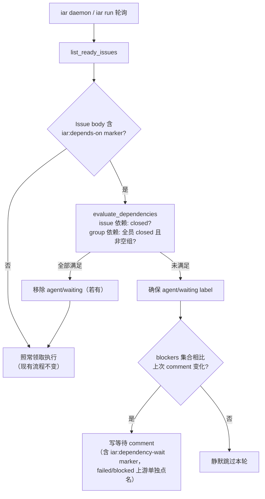

# PRD: Issue 依赖门禁（Dependency Gate）

## 1. Introduction & Goals

### Problem Statement

当前 runner 对 `agent/ready` Issue 的领取没有任务间顺序概念：`iar run` / `iar daemon` 看到 ready label 即领取。当 operator 有一批存在先后依赖的任务（例如 9 个任务分两组，B 组必须等 A 组全部合并）时，唯一的控制手段是人工盯着上游 PR 合并后再给下游 Issue 打 label。这种"人肉调度"消耗 operator 注意力，是批量委派任务的最大瓶颈。

### Measurable Objectives

- operator 可以一次性发布并标记 N 个有依赖关系的 Issue 为 ready，runner 按声明的偏序自动交付，全程无需人工干预排序。
- 依赖未满足的 Issue 不会被领取，且通过 `agent/waiting` label 和 Issue comment 可见等待原因。
- 上游 Issue 进入 `agent/failed` / `agent/blocked` 时，下游 Issue 在一次轮询周期内收到指明阻塞源的 comment。
- 现有无依赖声明的 Issue 行为完全不变（零破坏）。

### Realistic Validation

除单元测试和集成测试外，本 PRD 要求通过**真实项目入口点**验证关键行为，确保真实使用路径生效，而非仅在隔离 fixture 中通过。

- [ ] **依赖等待真实验证**：在测试仓库创建两个 Issue（下游声明 `iar:depends-on` 指向开启状态的上游），均打 `agent/ready`，运行 `uv run iar run --dry-run --max-issues 2`，确认输出仅列出上游 Issue，下游被标记为依赖等待。
- [ ] **依赖放行真实验证**：关闭上游 Issue 后再次运行 `uv run iar run --dry-run --max-issues 2`，确认下游 Issue 出现在待处理列表中。
- [ ] **发布链路真实验证**：通过 `uv run iar issue create <prd-path> --group <group-name> --depends-on-group <upstream-group>` 创建 Issue，确认 Issue body 含依赖 marker、Issue 带 group label，且 group label 不存在时被自动创建。
- [ ] **为什么单元测试不够**：依赖判定横跨 marker 解析（core）、`gh` 查询（infrastructure）、领取过滤（orchestrate）和 label/comment 副作用，单元测试无法证明 `gh` JSON 字段、label 创建时序和轮询入口的端到端协作。

## 2. Requirement Shape

- **Actor**：operator（写 PRD、发布 Issue、打 label 的人）与 runner（`iar run` / `iar daemon` 轮询进程）。
- **Trigger**：runner 轮询发现带 `agent/ready` 的 Issue 时；以及 `iar issue create` 发布 PRD 时。
- **Expected Behavior**：Issue body 中的依赖声明（单 Issue 或 group）未满足时，runner 跳过领取、打 `agent/waiting` label 并在阻塞原因变化时写 comment；依赖全部满足（引用 Issue 全部 closed）时移除 waiting label 并正常领取。
- **Scope Boundary**：仅影响 ready Issue 的领取判定与 `iar issue create` 发布链路；不改变 running/supervising/review 等已领取后的状态机；不做跨仓库依赖；不做自动重排优先级。

## 3. Repository Context And Architecture Fit

### Current Relevant Modules

| 模块 | 现状 |
|---|---|
| `src/backend/core/use_cases/agent_runner_events.py` | 已有 `<!-- iar:event ... -->` hidden marker 的正则解析与格式化惯例，本 PRD 的依赖 marker 直接复用该模式 |
| `src/backend/core/use_cases/agent_runner_orchestrate.py` | `run_polling_cycle`（搜索 `list_ready_issues` 调用处）串行收集 ready Issue 后逐个处理，是依赖过滤的唯一插入点 |
| `src/backend/infrastructure/github_client.py` | `list_ready_issues` 已返回含 `body` 与 `labels` 的 `IssueSummary`（依赖 marker 可零额外请求解析）；已有 `sync_labels` 创建 label 的能力 |
| `src/backend/core/use_cases/create_issue_from_prd.py` | `build_issue_body` / `build_issue_labels` 是 Issue body 与 label 的组装点；PRD 文件无 YAML frontmatter 惯例，声明依赖应使用 hidden marker 与现有 PRD 格式兼容 |
| `src/backend/infrastructure/config/settings.py` | `AgentRunnerLabelSettings` 集中定义队列 label，新增 `waiting` 与 group label 前缀属于既有模式的扩展 |
| `src/backend/api/cli.py` 与 `src/backend/api/cli_typer.py` | CLI 双轨并存（Typer 迁移进行中），新 CLI 参数需同时落两处或落在迁移后的唯一入口 |

### Architecture Constraints

- 依赖判定逻辑属于 `core/`，对 GitHub 的查询通过 `core` 已依赖的 client 接口注入，`core` 不得直接 import `infrastructure/`（遵守四层依赖方向）。
- GitHub Labels / Issues 仍是唯一队列状态源，不引入本地依赖状态存储。
- 不违反产品边界"项目不自动决定哪些 Issue 开始"：是否进入队列仍由 operator 打 `agent/ready` 决定，本特性只**推迟**执行直到声明的前置条件满足。

### Potential Redundancy Risks

- 不要为依赖 marker 新建第二套 marker 语法体系——格式、解析风格必须与 `agent_runner_events.py` 的 `iar:event` 一致（`<!-- iar:... -->` + 命名捕获组正则）。
- 不要新建独立的 "label 创建" 路径——group label 按需创建复用 `github_client.sync_labels` 同型的 `gh label create` 调用。

## 4. Recommendation

### Recommended Approach

最小变更路径：**hidden marker 声明 + 领取时无状态判定**。

1. 依赖在 Issue body 中以 `<!-- iar:depends-on #N group:X -->` 声明，group 成员资格以 `task-group/<name>` label 表达。
2. `run_polling_cycle` 在 `list_ready_issues` 之后增加一道纯函数过滤：解析每个 ready Issue body 中的依赖 marker，逐项判定满足状态（Issue 依赖 → 该 Issue closed；group 依赖 → 带该 group label 的 Issue 全部 closed 且至少存在一个成员）。
3. 未满足 → 跳过领取，确保 `agent/waiting` label 存在；阻塞原因相比上次 comment 发生变化时（含首次）写一条说明 comment，并嵌入 `iar:dependency-wait` marker 作为去重 cursor。
4. 满足 → 移除 `agent/waiting`（若有），照常进入现有处理流程。

判定完全无状态：每次轮询现查现算，依据 GitHub 实时状态，无本地缓存、无新存储。

### Why This Fits

- marker + label 是仓库已有的两个状态表达机制，本特性没有引入任何新概念类别。
- 插入点只有一个（领取过滤），已领取后的全部状态机（running → supervising → review）零改动。
- `agent/waiting` 是叠加的可见性 label，不是新状态机节点：`agent/ready` 保持在位，故 `list_ready_issues` 的查询逻辑无需变化。

### Alternatives Considered

- **GitHub 原生 issue 依赖关系（blocked-by relationships / sub-issues）**：语义更原生，但需要 GraphQL API（现有 client 全部基于 `gh` 子命令 + JSON），且 PRD 撰写期 Issue 尚不存在、无法预先建立关系。拒绝：API 面扩张大、与 PRD-first 工作流不匹配。
- **本地依赖图文件（如 `tasks/plan.toml`）**：违反"GitHub 是唯一队列状态源"原则，且多机/多仓库场景会漂移。拒绝。

## 5. Implementation Guide

> This section is a living implementation guide based on current repository analysis. If implementation discovers additional affected files, hidden dependencies, edge cases, or a better path, update this PRD before proceeding.

### Core Logic

1. **声明**：PRD 作者在 PRD 文件任意位置（建议紧随一级标题）写 `<!-- iar:group efficiency-a -->` 和/或 `<!-- iar:depends-on group:efficiency-x #12 -->`。`iar issue create` 解析 PRD 中的 marker，将 `depends-on` marker 原样写入 Issue body，将 group 转换为 `task-group/<name>` label（label 不存在时先创建）。CLI 同时提供 `--group`、`--depends-on`（可重复，接受 `#N` 或 `N`）、`--depends-on-group`（可重复）参数，与 PRD 内 marker 合并去重。
2. **判定**：新模块 `agent_runner_dependencies.py`（core 层）提供：
   - `parse_dependency_marker(issue_body: str) -> DependencyDeclaration | None` —— 解析 `iar:depends-on` marker，返回 issue 编号列表与 group 名列表。
   - `evaluate_dependencies(declaration, github_client) -> DependencyVerdict` —— 对每个 issue 依赖调用单 Issue 状态查询，对每个 group 依赖查询带该 label 的全部 Issue（state=all）。返回结构含：是否满足、未满足明细（每项含类型、目标、当前状态）、是否存在 failed/blocked 上游、是否存在空 group。
   - 空 group（state=all 查询结果为零）判定为**不满足**且单独标记，防止 label 拼写错误导致静默放行。
3. **过滤与副作用**：`run_polling_cycle` 对每个 ready Issue 先跑判定；未满足时调用新的 `mark_dependency_waiting`（加 `agent/waiting` label + 条件性 comment）。comment 去重：comment 内嵌 `<!-- iar:dependency-wait blockers=<canonical-hash-or-list> -->` marker，仅当本次 blockers 集合与最近一条 marker 不同（含首次）才发新 comment。dry-run 模式下打印等待原因但不写任何 GitHub 状态。
4. **基础设施扩展**：`github_client.py` 新增两个查询：按编号查单 Issue 状态与 labels（`gh issue view N --json state,labels`）、按 label 查全部状态 Issue（`gh issue list --label X --state all --json number,state,labels`）；以及 `ensure_label(name)`（`gh label create <name> --force` 或先查后建，与 `sync_labels` 实现保持同型）。对应接口同步加到 core 依赖的 client 接口定义中（搜索 `list_ready_issues` 所在的 interface/protocol 声明处）。

### Change Impact Tree

```text
.
├── src/backend/infrastructure/
│   ├── config/settings.py
│   │   [修改]
│   │   【总结】队列 label 配置新增 waiting 与 group 前缀
│   │
│   │   ├── AgentRunnerLabelSettings 新增 waiting: str = "agent/waiting"
│   │   └── AgentRunnerLabelSettings 新增 group_prefix: str = "task-group/"
│   │
│   └── github_client.py
│       [修改]
│       【总结】新增依赖判定所需的三个 gh 查询/写入能力
│
│       ├── 新增按编号查询单 Issue state+labels 的方法
│       ├── 新增按 label 查询全部状态 Issue 的方法
│       └── 新增 ensure_label 按需创建 label 的方法
│
├── src/backend/core/
│   ├── use_cases/agent_runner_dependencies.py
│   │   [新增]
│   │   【总结】依赖 marker 解析、满足性判定与等待副作用的唯一实现
│   │
│   │   ├── iar:depends-on / iar:group / iar:dependency-wait 三种 marker 的正则与格式化函数（风格对齐 agent_runner_events.py）
│   │   ├── evaluate_dependencies：issue 依赖 closed 判定、group 全 closed 判定、空 group 防护、failed/blocked 上游识别
│   │   └── mark_dependency_waiting：加 waiting label + blockers 变化时写去重 comment
│   │
│   ├── use_cases/agent_runner_orchestrate.py
│   │   [修改]
│   │   【总结】ready Issue 领取前插入依赖过滤，满足时摘除 waiting label
│   │
│   │   ├── run_polling_cycle 中 list_ready_issues 结果循环处加依赖判定分支
│   │   └── dry-run 输出依赖等待原因
│   │
│   ├── use_cases/create_issue_from_prd.py
│   │   [修改]
│   │   【总结】发布链路把 PRD 内依赖声明转换为 Issue marker 与 group label
│   │
│   │   ├── 解析 PRD 文本中的 iar:group / iar:depends-on marker
│   │   ├── build_issue_body 透传 depends-on marker
│   │   └── build_issue_labels 合入 group label，发布前 ensure_label
│   │
│   └── shared/models/agent_runner.py（或既有 models 所在文件，以 ReviewEventMarker 定义处为准）
│       [修改]
│       【总结】新增 DependencyDeclaration / DependencyVerdict 数据模型
│
├── src/backend/api/
│   ├── cli.py
│   │   [修改]
│   │   【总结】issue create 子命令新增 --group / --depends-on / --depends-on-group
│   │
│   └── cli_typer.py
│       [修改]
│       【总结】Typer 入口同步新增同名参数（双轨期间两处一致）
│
├── tests/
│   ├── test_agent_runner_dependencies.py
│   │   [新增]
│   │   【总结】marker 解析、判定矩阵（满足/未满足/空组/failed 上游）、comment 去重的单测
│   │
│   ├── test_agent_runner_cli.py
│   │   [修改]
│   │   【总结】issue create 新参数与 run --dry-run 依赖等待输出的 CLI 级测试
│   │
│   └── （现有 orchestrate 相关测试文件，rg 定位）
│       [修改]
│       【总结】run_polling_cycle 依赖过滤分支的集成测试
│
└── docs/
    ├── guides/agent-runner.md
    │   [修改]
    │   【总结】新增依赖声明语法、group 用法、waiting 状态与失败传播说明
    │
    └── roadmap.md（仓库根目录）
        [修改]
        【总结】把依赖门禁记入 Completed/能力清单与 Acceptance Checklist
```

此树为起点而非穷尽清单；隐藏引用见 Executor Drift Guard。

### Executor Drift Guard

实施前先跑以下搜索确认真实落点（文件可能因 Typer 迁移收敛为单一 CLI 入口）：

```bash
# 领取过滤插入点
rg -n "list_ready_issues" src/backend/

# label 配置与所有引用 waiting 候选位置
rg -n "AgentRunnerLabelSettings|labels\.ready|labels\.running" src/backend/

# marker 惯例参照
rg -n "iar:event" src/backend/

# issue create 命令定义处（双轨 CLI 都要查）
rg -n "issue-from-prd|issue create|add_parser|@app.command" src/backend/api/

# Issue body / labels 组装点
rg -n "def build_issue_body|def build_issue_labels" src/backend/core/use_cases/create_issue_from_prd.py

# core 依赖的 GitHub client 接口声明处
rg -n "list_ready_issues" src/backend/core/
```

若 `cli_typer.py` 已替换 `cli.py`（或反之），只改存活的入口并更新本 PRD。`labels sync` 是否需要把 `agent/waiting` 纳入同步范围，以 `rg -n "sync_labels" src/backend/` 找到的 label 定义集合为准——必须纳入，否则 waiting label 首次使用会失败。

### Flow Diagram



### Realistic Validation Plan

| Behavior | Real Entry Point | Test Layer | Mock Boundary | Data/Env Needed | Command Or Procedure | Required For Acceptance |
|---|---|---|---|---|---|---|
| 依赖未满足时跳过领取并输出原因 | `uv run iar run --dry-run --max-issues 2` | manual/sandbox | `gh` 真实调用，agent 不启动（dry-run） | 测试仓库两个 ready Issue，下游 body 含指向开启上游的 marker | 运行命令，确认仅上游进入待处理列表、下游打印等待原因 | Yes |
| 上游关闭后下游放行 | `uv run iar run --dry-run --max-issues 2` | manual/sandbox | 同上 | 关闭上游 Issue 后复跑 | 确认下游进入待处理列表 | Yes |
| 发布链路写入 marker 与 group label | `uv run iar issue create <prd> --group g-test --depends-on-group g-up` | manual/sandbox | `gh` 真实调用 | 测试仓库 + 临时 PRD 文件 | 确认 Issue body 含 `iar:depends-on group:g-up`、Issue 带 `task-group/g-test`、label 自动创建 | Yes |
| marker 解析与判定矩阵 | pytest | unit | github_client 以 fake 注入 | 无 | `just test` | Yes |
| 领取过滤分支与 comment 去重 | pytest | integration | fake github_client + fake process_runner | 无 | `just test` | Yes |

需要真实 GitHub 测试仓库与 `gh` 登录态；无凭据环境下以 pytest 全量通过 + `--dry-run` 代码路径单测为回退验证，真实验证项推迟到有凭据环境执行，但合入前必须完成（阻塞验收）。

失败排查首查点：`gh issue list --state all` 是否包含 closed Issue（group 判定依赖此行为）、`task-group/` label 是否真实创建、`IssueSummary.body` 是否截断。

### ER Diagram

No data model changes in this PRD.（GitHub Issues/Labels 即状态存储，无本地持久化。）

### Interactive Prototype Change Log

No interactive prototype file changes in this PRD.

### External Validation

No external validation required; repository evidence was sufficient.

## 6. Definition Of Done

- 全部 FR 实现并通过 `just test`（lint + 本地测试）无回归。
- Realistic Validation Plan 中三项真实入口验证在带凭据环境完成并记录结果。
- `docs/guides/agent-runner.md` 与 `roadmap.md` 同步更新；`mkdocs.yml` 如有导航变化一并更新。
- 四层依赖方向检查通过：依赖判定逻辑在 `core/`，`gh` 调用全部在 `infrastructure/`，无跨层 import。
- 无依赖声明的 Issue 在改动前后的处理行为逐字节一致（现有测试全绿即为证）。

## 7. Acceptance Checklist

### Architecture Acceptance

- [ ] 依赖解析与判定位于 `src/backend/core/use_cases/agent_runner_dependencies.py`，不直接 import `infrastructure/`：`rg -n "from backend.infrastructure" src/backend/core/use_cases/agent_runner_dependencies.py` 无结果。
- [ ] marker 格式与解析风格和 `agent_runner_events.py` 一致（HTML 注释 + 命名捕获组正则），未引入第二套 marker 体系。

### Behavior Acceptance

- [ ] Issue 依赖：marker 引用的 Issue 为 open 时不领取，closed 后下一轮即领取。
- [ ] Group 依赖：`task-group/<name>` 下存在 open Issue 时不领取，全部 closed 后放行。
- [ ] 空 group（无任何状态的成员）判定为不满足，且等待 comment 中明确提示疑似拼写错误。
- [ ] 上游带 `agent/failed` 或 `agent/blocked` 时，下游等待 comment 点名该上游 Issue 编号。
- [ ] 等待 comment 按 blockers 集合去重：连续多轮 blockers 不变时只有一条 comment。
- [ ] 依赖满足后 `agent/waiting` label 被自动移除。
- [ ] 无 marker 的 Issue 处理路径与改动前完全一致。

### Dependency Acceptance

- [ ] 未新增任何第三方依赖：`git diff pyproject.toml` 无新增包。

### Documentation Acceptance

- [ ] `docs/guides/agent-runner.md` 包含依赖声明语法、group 用法、`agent/waiting` 语义与失败传播策略。
- [ ] `roadmap.md` 已将依赖门禁纳入能力清单。

### Validation Acceptance

- [ ] `just test` 全量通过。
- [ ] 真实入口验证一：测试仓库中 `uv run iar run --dry-run --max-issues 2` 展示依赖等待与放行两种结果（对应 Plan 前两行）。
- [ ] 真实入口验证二：`uv run iar issue create` 实际产出含 marker 的 Issue 与自动创建的 group label。

## 8. Functional Requirements

- **FR-1**：Issue body 支持 `<!-- iar:depends-on #N ... group:X ... -->` marker，可混合声明多个 Issue 依赖与 group 依赖。
- **FR-2**：group 成员资格由 `task-group/<name>` label 表达，前缀可经 `AgentRunnerLabelSettings.group_prefix` 配置。
- **FR-3**：Issue 依赖满足条件为目标 Issue closed；group 依赖满足条件为该 group label 下全部 Issue closed 且成员数 ≥ 1。
- **FR-4**：`run_polling_cycle` 仅对依赖全部满足的 ready Issue 进入领取流程；未满足者保留 `agent/ready` 并叠加 `agent/waiting`。
- **FR-5**：等待 comment 含 `iar:dependency-wait` marker 并按 blockers 集合去重；上游 failed/blocked 与空 group 在 comment 中分别明确标识。
- **FR-6**：依赖满足时 runner 自动移除 `agent/waiting` label。
- **FR-7**：`iar issue create` 支持从 PRD 内 marker 与 CLI 参数 `--group` / `--depends-on` / `--depends-on-group` 两路声明，合并去重后写入 Issue；group label 不存在时自动创建。遗留别名 `issue-from-prd` / `run-once` 若在实现时仍存在，行为保持与主命令一致即可，不为其单独扩展参数文档。
- **FR-8**：`--dry-run` 模式展示每个 ready Issue 的依赖判定结果，不产生任何 GitHub 写操作。
- **FR-9**：`agent/waiting` 纳入 `iar labels sync` 同步范围。

## 9. Non-Goals

- 跨仓库依赖（marker 仅支持本仓库 Issue 编号与 group）。
- 自动优先级排序、关键路径分析或依赖环检测（环导致互相等待，由 operator 通过 waiting comment 发现并手工解开）。
- 上游失败时对下游的自动状态迁移（不自动打 `agent/blocked`，只 comment 告知，决策权留给 operator）。
- 受限并发执行（独立 PRD；本特性的判定函数设计为纯函数以兼容未来并发调用）。
- GitHub 原生 blocked-by relationships / sub-issues 集成。

## 10. Risks And Follow-Ups

- **风险**：`gh issue list --label X --state all` 默认 limit 较低（30），group 成员多时可能漏判。实现时必须显式传足够大的 `--limit` 并在测试中覆盖。
- **风险**：CLI 双轨期间参数遗漏一侧。Drift Guard 已列出双入口搜索命令；Typer 迁移合并后删除冗余侧。
- **Follow-up（已批准，不阻塞本 PRD）**：受限并发执行 PRD 落地后，依赖判定天然成为 DAG 调度的就绪条件，无需改动本模块。

## 11. Decision Log

| ID | Decision Question | Chosen | Rejected | Rationale |
|---|---|---|---|---|
| D-01 | 依赖关系存储在哪 | Issue body hidden marker + group label（GitHub 为唯一状态源） | 本地依赖图文件（tasks/plan.toml） | 本地文件会与 GitHub 状态漂移，且违反仓库"labels/issues 即队列状态"的既有架构原则 |
| D-02 | 用什么机制表达"组" | `task-group/<name>` label，全 closed 即满足 | GitHub Milestone / 原生 blocked-by relationships | label 的同步、查询、创建基础设施全部现成；Milestone 与 GraphQL relationships 需要新增 API 面且无法在 PRD 撰写期（Issue 未创建）声明 |
| D-03 | 等待状态如何表达 | 叠加 `agent/waiting` label，保留 `agent/ready` | 新增独立状态机节点（摘除 ready 换成 waiting） | 叠加方案使 `list_ready_issues` 查询零改动，状态机不新增迁移边，回滚成本最低 |
| D-04 | 上游 failed/blocked 时下游怎么办 | 仅写点名 comment，保持 waiting，由 operator 决策 | 自动将下游迁移到 `agent/blocked` | 自动迁移会放大误判（上游可能很快被修复），且违反"高风险决策交还人工"的产品边界 |
| D-05 | 空 group 如何判定 | 不满足 + comment 警告疑似拼写错误 | 空集视为 vacuously true 放行 | 静默放行使 label 拼写错误直接绕过门禁，是最危险的静默失败模式 |
| D-06 | 判定是否引入本地缓存 | 每轮无状态现查 | 缓存依赖判定结果 | 轮询间隔内状态可能变化，缓存引入一致性问题；`gh` 查询成本低，无优化必要 |
