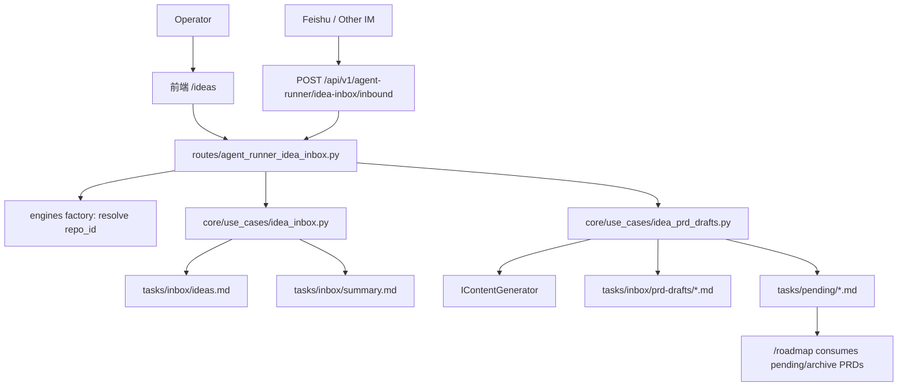
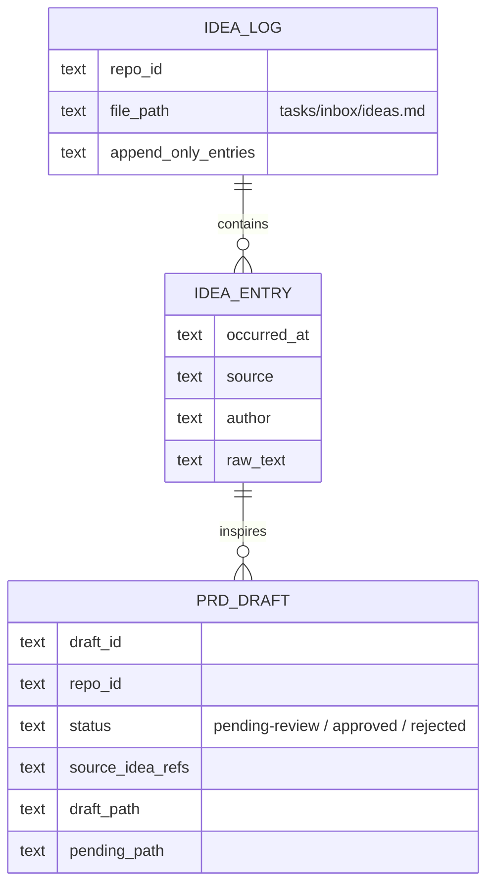

# PRD: 前端 Idea Inbox 与跨平台采集

## 1. Introduction & Goals

### Problem Statement

当前 Idea Inbox 只以 `tasks/inbox/ideas.md` 原话日志和 `tasks/inbox/summary.md` AI 总结的形式存在。它能保存想法，但没有前端入口、项目路由、草稿审阅流和跨平台采集能力。用户希望把 Idea Inbox 放进现有管理终端，作为 PRD Roadmap 的上游：想法先进入 inbox，再由 AI 生成 PRD 草稿，最后由人确认后进入 `tasks/pending/`。

### Proposed Solution Summary

在现有 Agent Runner 管理终端中新增独立的 **Idea Inbox** 模块，复用 `config.toml` / `.iar.toml` 的 repository registry 和现有 `IContentGenerator` agent 调用能力：

- **数据来源**：继续以目标仓库内 `tasks/inbox/ideas.md` 为原话事实来源，`tasks/inbox/summary.md` 为可重写派生总结；新增 `tasks/inbox/prd-drafts/` 保存待确认 PRD 草稿，不直接写入 `tasks/pending/`。
- **后端入口**：新增 `agent-runner` 命名空间下的受控 API 读取 inbox、追加原话、刷新 summary、生成 PRD 草稿、人工确认草稿落入 `tasks/pending/`；API route 只做 DTO 转换、仓库上下文解析和 composition 调用，核心文件读写与草稿状态规则在 `core/use_cases/idea_inbox*.py`。
- **前端入口**：在现有管理终端新增 `/ideas` 页面，和已归档交付的 `/roadmap` 分开；页面支持按项目查看原话、summary、草稿列表、生成草稿、确认入库。
- **AI 交互**：PRD 草稿生成复用 `IContentGenerator` / `generated_content.py` 模式，不新增 LLM SDK；系统只生成 draft，人确认后才将草稿写入 pending。
- **跨平台采集**：先实现一个签名校验的通用 inbound endpoint，以 `repo_id` 或显式 `@项目名` 路由到目标项目；飞书等 IM 通过 provider adapter 接入，不让 IM 消息直接绕过草稿确认流程。

刻意避免的复杂度：不把 ideas 迁入数据库，不让前端直接改写 `ideas.md` 历史内容，不从自然语言自动猜项目，不自动把想法直接变成 pending PRD，不把飞书自定义机器人 webhook 误用为入站消息通道。

### Measurable Objectives

- `/ideas` 页面可按 registry 项目查看 `tasks/inbox/ideas.md` 原话、`summary.md` 总结和 `prd-drafts/` 草稿。
- 在前端新增想法后，目标仓库 `tasks/inbox/ideas.md` 只追加新条目，已有内容字节级不被重写。
- 从一个或多个想法生成 PRD 草稿后，草稿落在 `tasks/inbox/prd-drafts/`，不会进入 `tasks/pending/`。
- 人在前端确认草稿后，系统按 PRD 命名规则创建 `tasks/pending/<PRIORITY>-<TYPE>-<YYYYMMDD-HHMMSS>-<slug>.md`。
- `agent-runner` 命名空间下的通用 inbound endpoint 可通过签名校验和 `repo_id` 把外部消息追加到对应项目 inbox；缺少明确项目绑定时拒绝。
- docs 记录本地前端、AI 草稿、外部 IM 接入和安全边界。

### Realistic Validation

除单元测试和集成测试外，本 PRD 要求通过**真实项目入口点**验证关键行为，确保真实使用路径生效，而非仅在隔离 fixture 中通过。

- [ ] **Idea Inbox 页面真实验证**：启动后端与前端，访问 `/ideas`，选择 `keda-main`，确认页面读取真实 `tasks/inbox/ideas.md`、`summary.md` 和草稿目录。
- [ ] **追加想法真实验证**：通过 `/ideas` 页面提交一条想法，确认 `tasks/inbox/ideas.md` 只追加新时间块，历史条目未被改写。
- [ ] **草稿确认真实验证**：用 fake `IContentGenerator` 或 sandbox agent 生成 PRD 草稿，前端确认后检查 `tasks/pending/` 出现符合命名规则的新 PRD，草稿状态同步为 approved。
- [ ] **外部入口真实验证**：用 `curl` 调用签名校验的 inbound endpoint，携带 `repo_id=keda-main`，确认消息进入该项目 inbox；缺少或非法 `repo_id` 时返回 4xx。
- [ ] **为什么单元测试不够**：该能力横跨真实文件系统追加、仓库选择、AI 草稿文件生成、前端页面状态和外部 HTTP 入口；单元测试无法证明 append-only 约束和真实路径路由在实际仓库中成立。

### Delivery Dependencies

- Group: idea-inbox
- Depends on groups:
  - none
- Depends on tasks/issues:
  - `tasks/archive/P1-FEAT-20260611-205725-agent-runner-unified-ops-console.md`（已完成；提供管理终端 shell、仓库 registry、进程/审计模式）
  - `tasks/archive/P1-FEAT-20260614-200054-frontend-prd-roadmap.md`（已完成；提供 `/roadmap` 页面、`agent-runner/roadmap` API 命名和 Playwright smoke 模式）
- Gate type: none
- Notes: 本 PRD 是 Roadmap 的上游输入模块，当前无未完成的硬依赖；实现时应复用已落地的 console / roadmap 前端与 API 命名模式。

## 2. Requirement Shape

- **Actor**：在多个本地项目间记录想法、整理想法并生成 PRD 的 operator。
- **Trigger**：
  - operator 打开 `/ideas` 查看某项目 inbox。
  - operator 在前端或外部 IM 发送一条想法。
  - operator 选择一个想法聚类生成 PRD 草稿。
  - operator 审阅草稿并确认进入 `tasks/pending/`。
- **Expected Behavior**：
  - Idea Inbox 独立于 Roadmap 展示，但两者共用项目选择和管理终端 shell。
  - 原话日志 append-only；summary 和 draft 可重写。
  - PRD 草稿必须经人确认后才进入 pending。
  - 外部消息必须显式绑定项目；无法路由时拒绝或进入待分配队列，不自动猜测。
- **Explicit Scope Boundary**：
  - 不实现自动合并 Roadmap 调度。
  - 不把想法直接发布为 GitHub Issue。
  - 不引入多用户权限体系。
  - 不把 secrets 写进 `config.toml` 或 `.iar.toml`；外部 inbound token 走环境变量或本地 secret 文件。

## 3. Repository Context And Architecture Fit

### Current Relevant Modules And Files

| 路径 | 当前职责 | 与本 PRD 的关系 |
|---|---|---|
| `tasks/inbox/ideas.md` | append-only 原话日志 | 保持事实来源；新增后端追加 API |
| `tasks/inbox/summary.md` | AI 派生总结 | 前端读取；刷新 summary 时可重写 |
| `frontend/src/main-app.tsx` | React 路由定义 | 新增 `/ideas` route |
| `frontend/src/components/app-sidebar.tsx` | 管理终端导航 | 新增 Idea Inbox 导航项 |
| `frontend/shared/api/console.ts` / `roadmap.ts` / `types.ts` | console / roadmap API wrapper 与 DTO 模式 | 新增 `ideaInbox.ts`，沿用 `BASE_PATH = "/v1/agent-runner/idea-inbox"` |
| `src/backend/api/routes/agent_runner_console.py` | 现有 console 写 API | 不继续塞入该文件；新增独立 route |
| `src/backend/api/routes/agent_runner_roadmap.py` | 已完成的 Roadmap API | 复用 route 命名、序列化、repo 解析和缓存/审计风格 |
| `src/backend/api/app.py` | FastAPI route 注册 | 注册 `agent_runner_idea_inbox` route |
| `src/backend/engines/agent_runner/factory.py` | repository registry 与 `IContentGenerator` 装配 | 复用 repository context、content generator |
| `src/backend/core/use_cases/generated_content.py` | AI 内容生成模式 | 复用 prompt/agent 调用与 fallback 约定 |
| `src/backend/infrastructure/config/settings.py` | `config.toml` / `.iar.toml` 配置 | 新增非敏感 idea inbox 配置；secrets 不进 TOML |
| `docs/guides/agent-runner.md` | runner/operator 文档 | 增加 Idea Inbox 章节或拆新指南并更新 `mkdocs.yml` |
| `tests/playwright-e2e/` | 独立 Playwright 包 | 覆盖 `/ideas` 页面 smoke |

### Existing Path

当前最接近路径是“统一管理终端 + Roadmap”：`frontend/src/pages/*`、`frontend/shared/api/console.ts`、`frontend/shared/api/roadmap.ts`、`src/backend/api/routes/agent_runner_console.py`、`src/backend/api/routes/agent_runner_roadmap.py`、`src/backend/core/use_cases/repository_registry.py`。Idea Inbox 应复用这个前端 shell、registry、route 注册和 `/api/v1/agent-runner/*` 命名模式，但后端新增独立 `agent_runner_idea_inbox` route/use case，避免继续扩大 console 或 roadmap route 的职责。

### Reuse Candidates

- `resolve_repository_targets_with_diagnostics()`：按 `repo_id` 定位目标仓库。
- `IContentGenerator` 与 `generated_content.py`：生成 PRD 草稿，不新增 agent SDK。
- `TomlRegistryEditor` / repository registry：外部消息的项目绑定来源。
- `tasks/inbox/ideas.md` 和 `summary.md`：沿用当前文件约定。
- `tests/playwright-e2e/tests/smoke/roadmap.spec.ts` 与 `roadmap-realistic.spec.ts`：复用页面 smoke、API route mocking 和 evidence 保存模式。

### Architecture Constraints

- 后端遵守 `api/ -> core/ -> engines/ -> infrastructure/`。`core` use case 可以使用标准库文件 I/O，但不能 import infrastructure。
- API route 不直接承载文件格式规则或 agent prompt；route 可像 `agent_runner_roadmap.py` 一样解析 `repo_id` 并通过 engines factory 装配 repository context / generator，然后调用 core use case。
- 所有 Python 文本 I/O 显式 `encoding="utf-8"`。
- `frontend/` 只通过 `/api/*` HTTP 调后端，不直接读本地文件。
- `tests/playwright-e2e/` 使用 npm，不套 Python 命名规范。

### Existing PRD Relationship

- `tasks/archive/P1-FEAT-20260614-200054-frontend-prd-roadmap.md`：已完成。该 PRD 提供 `/roadmap` 页面、`agent-runner/roadmap` API、Roadmap Playwright smoke 和 PRD 执行视图；本 PRD 管想法采集与草稿生成，应复用其页面/API 组织方式但不混入 Roadmap 状态模型。
- `tasks/archive/P1-FEAT-20260611-205725-agent-runner-unified-ops-console.md`：已完成，是本 PRD 的前端 shell、registry 和审计风格来源。
- `tasks/pending/P2-FEAT-20260527-190923-prd-from-issue.md`：相关但不重复。该 PRD 是 Issue → PRD，本 PRD 是 Idea → PRD draft。
- `tasks/pending/P1-FEAT-20260614-203811-structured-validation-evidence.md`：独立 pending。它增强 runner 验证证据，不阻塞 Idea Inbox。
- 当前 pending PRDs 中未发现重复 Idea Inbox 前端化或跨平台采集工作；本 PRD 当前无硬依赖。

### Potential Redundancy Risks

- 不要新建第二套项目 registry；复用现有 `repo_id`。
- 不要把 PRD 草稿直接塞进 Roadmap；只有 pending/archive PRD 才进入 Roadmap。
- 不要让 Feishu adapter 直接写 `tasks/pending/`；外部入口只能追加 inbox 或创建 draft。
- 不要新增数据库保存 ideas；Markdown 文件已有 Git 可追踪历史，足以表达当前需求。

## 4. Recommendation

### Recommended Approach

采用**文件事实源 + 独立前端入口 + 受控草稿审批**的最小变更：

1. 新增 `core/use_cases/idea_inbox.py` 处理 inbox 文件读写：读取 ideas、追加想法、读取/刷新 summary。
2. 新增 `core/use_cases/idea_prd_drafts.py` 处理草稿：调用 `IContentGenerator` 生成 PRD draft，保存到 `tasks/inbox/prd-drafts/`；确认后才创建 pending PRD。
3. 新增 `api/routes/agent_runner_idea_inbox.py` 暴露 `/api/v1/agent-runner/idea-inbox/*`，支持本地前端和外部 inbound，并沿用 `agent_runner_roadmap.py` 的 repository context 解析方式。
4. 新增 `/ideas` 页面，展示项目选择、原话流、summary、草稿列表和确认动作，前端 wrapper 使用 `frontend/shared/api/ideaInbox.ts`。
5. 外部 IM 首版只要求“明确项目绑定 + 签名校验 + append-only 入库”；飞书 provider 作为 adapter，不作为核心状态源。

### Why This Fits

- 保留 `ideas.md` 的 append-only 事实源，不破坏当前 idea-inbox skill 的工作方式。
- 草稿目录提供人工审阅缓冲区，符合“先生成 PRD 草稿，再由人确认后落入 `tasks/pending/`”的已确认要求。
- 复用现有管理终端和 repository registry，避免新增前端应用或项目配置体系。
- 复用已完成 Roadmap 的 `/api/v1/agent-runner/<module>` API 命名和 Playwright smoke 模式，减少前端 shared API 与 route 注册分歧。
- 外部入口只做采集和路由，不扩大为任意自动执行能力。

### Alternatives Considered

| 方案 | 拒绝原因 |
|---|---|
| 把 ideas / drafts 存入 SQLite | 当前事实源是 Markdown + Git，数据库会引入双写和迁移问题 |
| 直接从想法生成 pending PRD | 用户已确认需要草稿审阅；直接入 pending 会把不完整想法变成可执行 backlog |
| 飞书消息靠自然语言自动判断项目 | 项目误路由代价高，必须显式 `repo_id` 或 `@项目名` |
| 把 Idea Inbox 合并进 Roadmap 页面 | Idea 是 PRD 上游输入，Roadmap 是 PRD 执行视图，混合会导致状态模型混乱 |
| 使用飞书自定义机器人 webhook 做入站采集 | 自定义机器人 webhook 主要用于向群发送消息；入站消息应走事件订阅或通用 inbound adapter |

## 5. Implementation Guide

This section is a living implementation guide based on current repository analysis. If implementation discovers additional affected files, hidden dependencies, edge cases, or a better path, update this PRD before proceeding.

### Core Logic

#### Inbox 文件读写

新增 `src/backend/core/use_cases/idea_inbox.py`：

- `resolve_inbox_paths(repo_path) -> IdeaInboxPaths`：返回 `tasks/inbox/ideas.md`、`summary.md`、`prd-drafts/`。
- `read_idea_inbox(repo_path) -> IdeaInboxSnapshot`：读取原话、summary、draft metadata。
- `append_idea(repo_path, source, author, text, occurred_at) -> IdeaEntry`：
  - 若 `tasks/inbox/ideas.md` 不存在，创建带标题和说明的文件。
  - 只在文件末尾追加一个时间块，不重写既有内容。
  - `source` 支持 `frontend`、`inbound`、`feishu`、`manual`。
  - 所有写入显式 `encoding="utf-8"`。

#### Summary 刷新

新增 `refresh_idea_summary(repo_path, generator, language)`：

- 读取完整 `ideas.md`。
- 用 `IContentGenerator` 生成 `summary.md`，或在 generator 不可用时返回明确错误，不伪造 summary。
- `summary.md` 是可重写派生文件；重写时保留“事实以 ideas.md 为准”的标题说明。

#### PRD 草稿生成与确认

新增 `src/backend/core/use_cases/idea_prd_drafts.py`：

- `create_prd_draft(repo_path, idea_refs, generator, language, draft_type, priority)`：
  - 从 `ideas.md` 中提取选定时间块或文本范围。
  - 调用 `IContentGenerator` 生成完整 PRD 草稿，要求符合本仓库 PRD 结构。
  - 写入 `tasks/inbox/prd-drafts/<YYYYMMDD-HHMMSS>-<slug>.md`。
  - 草稿顶部包含状态元数据：`Draft Status: pending-review`、来源 idea 时间戳、目标 priority/type。
- `approve_prd_draft(repo_path, draft_path)`：
  - 校验草稿状态仍为 `pending-review`。
  - 生成 `tasks/pending/<PRIORITY>-<TYPE>-<YYYYMMDD-HHMMSS>-<slug>.md`。
  - 将 draft 状态更新为 `approved` 并记录 pending path。
  - 如目标 pending 文件已存在则 fail fast。

#### API 入口

新增 `src/backend/api/routes/agent_runner_idea_inbox.py`：

- `GET /api/v1/agent-runner/idea-inbox/repositories/{repo_id}`：读取 snapshot。
- `POST /api/v1/agent-runner/idea-inbox/repositories/{repo_id}/ideas`：前端追加想法。
- `POST /api/v1/agent-runner/idea-inbox/repositories/{repo_id}/summary/refresh`：刷新 summary。
- `POST /api/v1/agent-runner/idea-inbox/repositories/{repo_id}/drafts`：生成 PRD 草稿。
- `POST /api/v1/agent-runner/idea-inbox/repositories/{repo_id}/drafts/{draft_id}/approve`：确认入 pending。
- `POST /api/v1/agent-runner/idea-inbox/inbound`：外部入口；必须带签名和可解析 `repo_id`。

route 职责边界：

- route 负责 Pydantic request/response、`repo_id` → repository context、HTTP status、签名 header 读取。
- 文件格式、append-only 规则、draft 状态机、pending 命名和 generator prompt 均放在 core use case。
- `src/backend/api/app.py` 注册时沿用当前模式：从 `backend.api.routes` import `agent_runner_idea_inbox`，再 `app.include_router(agent_runner_idea_inbox.router, prefix="/api/v1")`。

#### 前端入口

新增 `frontend/src/pages/ideas-page.tsx` 与 `frontend/shared/api/ideaInbox.ts`：

- 顶部项目选择：复用 registry repository 列表。
- 左侧/上区：原话时间流，支持新增想法。
- 中区：summary 展示与刷新按钮。
- 右侧/下区：PRD 草稿列表，支持生成、查看、确认入库。
- 所有写操作弹确认或 toast；确认 pending 时显示目标路径。
- `ideaInbox.ts` 的 `BASE_PATH` 必须为 `"/v1/agent-runner/idea-inbox"`，由 `frontend/shared/api/client.ts` 统一拼接 `/api`。
- repository selector 复用 `fetchRegistryRepositories()` 的 DTO，不硬编码 `keda-main` 作为唯一选项；无 enabled repo 时展示空状态并禁用写操作。

#### 跨平台接入

- 首版 inbound payload 使用 provider-neutral schema：

```json
{
  "provider": "feishu",
  "repo_id": "keda-main",
  "sender": "user-or-open-id",
  "text": "想法原文",
  "occurred_at": "2026-06-14T20:15:00+08:00"
}
```

- 签名校验使用共享 secret，secret 来自环境变量，例如 `IAR_IDEA_INBOX_INBOUND_SECRET`，不写入 `config.toml` / `.iar.toml`。
- Feishu adapter 只做 provider payload 转换；如果消息没有显式 `repo_id` 或 `@项目名`，返回可操作错误或写入 `unassigned` 队列，不能猜项目。

### Change Impact Tree

```text
.
├── Domain
│   ├── src/backend/core/use_cases/idea_inbox.py
│   │   [新增]
│   │   【总结】提供文件事实源读写、append-only 想法追加和 summary 刷新入口
│   │   ├── resolve_inbox_paths 定位 tasks/inbox 文件
│   │   ├── read_idea_inbox 读取 ideas/summary/drafts
│   │   ├── append_idea 只追加原话日志
│   │   └── refresh_idea_summary 通过 IContentGenerator 重写 summary
│   │
│   ├── src/backend/core/use_cases/idea_prd_drafts.py
│   │   [新增]
│   │   【总结】把选定想法生成 PRD 草稿，并在人确认后落入 tasks/pending
│   │   ├── create_prd_draft 保存 pending-review 草稿
│   │   ├── approve_prd_draft 创建规范 pending PRD
│   │   └── parse_draft_metadata 校验状态与来源
│   │
│   └── src/backend/core/shared/models/agent_runner.py
│       [检查/可能修改]
│       【总结】如需配置 language 或 inbound 开关，保持为非敏感字段并支持 .iar.toml 覆盖
│
├── API
│   ├── src/backend/api/routes/agent_runner_idea_inbox.py
│   │   [新增]
│   │   【总结】在 agent-runner 命名空间下暴露本地前端与外部 inbound 的受控 Idea Inbox API
│   │   ├── repository snapshot / append / refresh summary / draft / approve endpoints
│   │   └── inbound endpoint 做签名校验与 repo_id 路由
│   │
│   └── src/backend/api/app.py
│       [修改]
│       【总结】注册 agent_runner_idea_inbox router
│
├── Infrastructure
│   └── src/backend/infrastructure/config/settings.py
│       [修改]
│       【总结】新增非敏感 idea inbox 配置项；secrets 继续来自环境变量
│
├── Frontend
│   ├── frontend/src/main-app.tsx
│   │   [修改]
│   │   【总结】新增 /ideas 路由
│   │
│   ├── frontend/src/components/app-sidebar.tsx
│   │   [修改]
│   │   【总结】新增 Idea Inbox 导航项
│   │
│   ├── frontend/src/pages/ideas-page.tsx
│   │   [新增]
│   │   【总结】提供想法流、summary、PRD 草稿生成与确认入库 UI
│   │
│   ├── frontend/shared/api/ideaInbox.ts
│   │   [新增]
│   │   【总结】封装 /api/v1/agent-runner/idea-inbox API 调用
│   │
│   └── frontend/shared/api/types.ts
│       [修改]
│       【总结】新增 IdeaInboxSnapshot、IdeaEntry、PrdDraft 等 DTO
│
├── Tests
│   ├── tests/test_idea_inbox.py
│   │   [新增]
│   │   【总结】覆盖 append-only、summary 刷新、草稿生成、确认入 pending 与 inbound 签名
│   │
│   ├── tests/test_agent_runner_console_api.py
│   │   [检查/可能修改]
│   │   【总结】如 app route 注册或 auth fixture 影响 API tests，补充路由 smoke
│   │
│   └── tests/playwright-e2e/tests/smoke/idea-inbox.spec.ts
│       [新增]
│       【总结】覆盖 /ideas 页面读取、追加想法和草稿确认交互；沿用 roadmap smoke 的 API mock 与证据保存方式
│
└── Docs
    ├── docs/guides/agent-runner.md
    │   [修改]
    │   【总结】新增 Idea Inbox 前端、草稿确认和 inbound 安全边界说明
    │
    └── mkdocs.yml
        [检查/可能修改]
        【总结】若拆新 Idea Inbox 指南，则加入导航；只改 agent-runner 章节则无需修改
```

文件清单是实现起点而非穷尽保证；隐藏引用见 Executor Drift Guard。

### Executor Drift Guard

实现前先运行：

```bash
rg -n "tasks/inbox|Idea Inbox|ideas.md|summary.md" .
rg -n "include_router|APIRouter" src/backend/api
rg -n "IContentGenerator|generate_issue_content|generated_content" src/backend/core src/backend/engines tests
rg -n "resolve_repository_targets|resolve_repository_targets_with_diagnostics|repo_id" src/backend/engines src/backend/core src/backend/api
rg -n "agent-runner/roadmap|BASE_PATH|startRoadmapPrd|fetchRoadmapPrds" frontend/shared src/backend/api tests
rg -n "app-sidebar|main-app|Routes|BASE_PATH" frontend/src frontend/shared
rg -n "fetchRegistryRepositories|RegistryRepositoryEntry" frontend/shared frontend/src
```

- 如果 `tasks/inbox/ideas.md` 文件格式在实现前变化，先更新 parser；不要用脆弱的行号定位。
- Roadmap 已实现；新增 API 和前端 wrapper 时优先比照 `agent_runner_roadmap.py`、`frontend/shared/api/roadmap.ts`、`tests/playwright-e2e/tests/smoke/roadmap.spec.ts`，不要新建第二种 API base path 或 Playwright fixture 风格。
- 如果 `create_issue_from_prd.py` 已进一步增长，草稿确认不要复用其中私有函数；把 PRD 命名与写入规则做成独立小 helper 或复用公开 helper。
- inbound 签名失败必须返回 401/403，不得落盘；项目无法解析必须返回 400 或进入明确的 `unassigned` 文件，不能悄悄写入默认项目。
- 修改后运行 `rg -n "/api/v1/idea-inbox|/v1/idea-inbox|routes/idea_inbox.py" frontend src tests docs tasks/pending/P1-FEAT-20260614-203810-frontend-idea-inbox-cross-platform.md`，应只剩历史讨论或无结果；目标实现应使用 `agent-runner/idea-inbox`。

### Flow Or Architecture Diagram



### Low-Fidelity Prototype

```text
┌──────────────────────────────────────────────────────────────────────────────┐
│ 总览 | 进程 | 统计 | 项目 | 路线图 | Idea Inbox                 repo: keda-main │
├──────────────────────────────────────────────────────────────────────────────┤
│ 新想法                                                                    │
│ ┌────────────────────────────────────────────────────────────────────────┐ │
│ │ 记录一条新想法...                                                     │ │
│ └────────────────────────────────────────────────────────────────────────┘ │
│ [追加到 inbox] [从选中想法生成 PRD 草稿]                                  │
├─────────────────────────────┬──────────────────────────────────────────────┤
│ 原话日志                    │ AI 总结                                      │
│ 20:15 Idea Inbox 前端化     │ 主题：Idea Inbox / 跨平台采集               │
│ 20:24 RV Evidence 改进      │ 候选 PRD：前端 Idea Inbox...                │
│ [ ] 选择                    │ [刷新 summary]                              │
├─────────────────────────────┴──────────────────────────────────────────────┤
│ PRD 草稿                                                                   │
│ pending-review  frontend-idea-inbox-cross-platform   [预览] [确认入 pending]│
│ approved        structured-validation-evidence       tasks/pending/...      │
└──────────────────────────────────────────────────────────────────────────────┘
```

### ER Diagram



No relational database changes in this PRD; the diagram documents file-backed persistent entities.

### Realistic Validation Plan

| Behavior | Real Entry Point | Test Layer | Mock Boundary | Data/Env Needed | Command Or Procedure | Required For Acceptance |
|---|---|---|---|---|---|---|
| `/ideas` 页面展示真实 inbox | Browser hitting frontend `/ideas` + backend API | e2e/manual | GitHub 可不参与；文件系统真实 | enabled registry entry，`tasks/inbox/*` | `just run`；访问 `http://127.0.0.1:5173/ideas`；或 `just e2e smoke` 跑 `tests/playwright-e2e/tests/smoke/idea-inbox.spec.ts` | Yes |
| append-only 想法追加 | `POST /api/v1/agent-runner/idea-inbox/repositories/{repo_id}/ideas` | API/integration | 无 mock；写临时 repo 文件系统 | 临时 git repo + `tasks/inbox/ideas.md` fixture | `uv run pytest tests/test_idea_inbox.py -k "append_only" -q`，并用 curl 对本地后端验证 | Yes |
| PRD 草稿生成 | `POST /api/v1/agent-runner/idea-inbox/repositories/{repo_id}/drafts` | integration | `IContentGenerator` fake；文件系统真实 | idea fixture + fake PRD markdown output | `uv run pytest tests/test_idea_inbox.py -k "create_prd_draft" -q` | Yes |
| 草稿确认入 pending | `POST /api/v1/agent-runner/idea-inbox/repositories/{repo_id}/drafts/{draft_id}/approve` | integration/API | 无 mock；文件系统真实 | pending-review 草稿 | `uv run pytest tests/test_idea_inbox.py -k "approve_prd_draft" -q`；确认文件名符合 `P*-TYPE-YYYYMMDD-HHMMSS-slug.md` | Yes |
| 外部 inbound 签名与路由 | `POST /api/v1/agent-runner/idea-inbox/inbound` | API/smoke | provider payload fake；签名逻辑真实 | `IAR_IDEA_INBOX_INBOUND_SECRET`，repo_id fixture | `curl -X POST http://127.0.0.1:8000/api/v1/agent-runner/idea-inbox/inbound -H "Content-Type: application/json" -H "X-IAR-Signature: <signature>" -d '{"provider":"manual","repo_id":"keda-main","sender":"tester","text":"idea","occurred_at":"2026-06-14T20:15:00+08:00"}'`；验证 2xx 入库、非法签名 401 | Yes |
| 前端 build 与 Playwright smoke | `just frontend build` + `just e2e smoke` | build/e2e | Playwright 可 mock API | npm deps；首次运行前 `just e2e-install` | `just frontend build && just e2e smoke` | Yes |
| 全量回归 | `just test` | test | 无 | 无 | `just test` | Yes |

失败排查提示：页面空白先查 `frontend/shared/api/client.ts` 的 `/api` 拼接、`frontend/shared/api/ideaInbox.ts` 的 `BASE_PATH` 和 `src/backend/api/app.py` 的 router 注册；append-only 失败先查是否误用了 `write_text` 覆盖 `ideas.md`；draft approve 失败先查 draft metadata 和 pending 文件名冲突；inbound 失败先查 secret 环境变量、签名 header 和 `repo_id` 是否在 registry 中 enabled。

### Interactive Prototype Change Log

No interactive prototype file changes in this PRD.

### External Validation

| Topic | Source | Checked On | Relevant Finding | Impact On Recommendation |
|---|---|---|---|---|
| Feishu custom bot webhook | `https://open.feishu.cn/document/client-docs/bot-v3/bot-overview` | 2026-06-15 | Custom bot webhook is documented as a URL that receives HTTP requests to push messages to a Feishu group. | Do not use custom bot webhook as the primary user-message ingestion path. |
| Feishu event subscriptions | `https://open.feishu.cn/document/server-docs/event-subscription-guide/overview` and `https://open.feishu.cn/document/event-subscription-guide/event-subscriptions/event-subscription-configure-/choose-a-subscription-mode/send-notifications-to-developers-server` | 2026-06-15 | Event subscription sends event JSON to a configured developer server endpoint. | Feishu inbound should be a provider adapter over the generic signed inbound endpoint. |

## 6. Definition Of Done

- `/ideas` 页面可在管理终端中访问，并与 Roadmap 分开。
- 后端 API 可读取 inbox、追加想法、刷新 summary、生成草稿、确认草稿进入 pending。
- `ideas.md` append-only 约束有测试保护。
- PRD 草稿必须人工确认后才写入 `tasks/pending/`。
- 外部 inbound 有签名校验和显式项目路由；非法或无法路由消息不落入默认项目。
- docs 记录使用方式、配置、外部接入边界和安全注意事项。
- `just test`、`just frontend build`、`just e2e smoke` 和 `uv run mkdocs build --strict` 通过。

## 7. Acceptance Checklist

### Architecture Acceptance

- [ ] Idea Inbox 后端核心逻辑位于 `src/backend/core/use_cases/idea_inbox.py` / `idea_prd_drafts.py`，不直接 import `backend.infrastructure`。
- [ ] Idea Inbox API 位于 `src/backend/api/routes/agent_runner_idea_inbox.py`，并在 `src/backend/api/app.py` 以 `/api/v1` prefix 注册。
- [ ] API route 不直接读写 `tasks/inbox` 文件，而是调用 core use case。
- [ ] 前端只通过 `/api/v1/agent-runner/idea-inbox/*` 调用后端，不直接读取本地文件。
- [ ] 未新增数据库表；ideas 和 drafts 仍由仓库 Markdown 文件承载。
- [ ] repository 选择复用现有 registry / `repo_id`，未新增第二套项目映射。

### Behavior Acceptance

- [ ] `/ideas` 页面可以选择 registry 中的 enabled repo 并展示该 repo 的 inbox。
- [ ] 追加想法只在 `tasks/inbox/ideas.md` 末尾新增条目，历史内容保持不变。
- [ ] `summary.md` 可由前端触发刷新，并明确标记为 AI 派生。
- [ ] 生成 PRD 草稿只写入 `tasks/inbox/prd-drafts/`，不会直接写入 `tasks/pending/`。
- [ ] 确认草稿后创建符合命名规范的 pending PRD，并把 draft 标为 approved。
- [ ] 重复确认同一草稿会 fail fast，不重复创建 pending PRD。
- [ ] inbound endpoint 在签名非法时拒绝，在 `repo_id` 不存在或 disabled 时拒绝。
- [ ] inbound 消息缺少明确项目绑定时不会写入默认项目。

### Documentation Acceptance

- [ ] `docs/guides/agent-runner.md` 或新指南说明 Idea Inbox 页面、草稿流程和外部 inbound 配置。
- [ ] 文档说明 `ideas.md` append-only、`summary.md` 可重写、草稿需人工确认。
- [ ] 文档说明 Feishu 接入是 provider adapter，secrets 不写入 `config.toml` / `.iar.toml`。
- [ ] 如新增文档页，`mkdocs.yml` 已更新导航。

### Validation Acceptance

- [ ] `uv run pytest tests/test_idea_inbox.py -q` 通过。
- [ ] `just frontend build` 通过。
- [ ] `just e2e smoke` 中新增 `/ideas` Playwright smoke 通过。
- [ ] `uv run mkdocs build --strict` 通过。
- [ ] `just test` 全量通过。
- [ ] 真实入口验证：本地后端 + 前端完成一次想法追加、一次草稿生成、一次草稿确认入 pending，并留存终端输出或截图。

## 8. Functional Requirements

- **FR-1**：系统必须提供 `/ideas` 前端页面，与 `/roadmap` 分开。
- **FR-2**：系统必须按 `repo_id` 读取目标仓库的 `tasks/inbox/ideas.md`、`summary.md` 和 `prd-drafts/`。
- **FR-3**：系统必须通过 `/api/v1/agent-runner/idea-inbox/*` API 读取和修改 inbox，不引入平行 `/api/v1/idea-inbox/*` 命名空间。
- **FR-4**：系统必须以 append-only 方式追加想法到 `ideas.md`，不得重写已有原话。
- **FR-5**：系统必须允许刷新 `summary.md`，且 summary 明确是 AI 派生、事实以 `ideas.md` 为准。
- **FR-6**：系统必须能从选定想法生成 PRD 草稿，并将草稿保存到 `tasks/inbox/prd-drafts/`。
- **FR-7**：系统必须要求人确认草稿后才写入 `tasks/pending/`。
- **FR-8**：确认草稿写入 pending 时，文件名必须符合 `P0/P1/P2/P3-TYPE-YYYYMMDD-HHMMSS-slug.md`。
- **FR-9**：系统必须复用 `IContentGenerator` 生成 summary / draft，不新增 LLM SDK。
- **FR-10**：系统必须提供签名校验的外部 inbound endpoint。
- **FR-11**：外部 inbound 必须显式携带或解析出 `repo_id` / 项目绑定，不能自动猜项目。
- **FR-12**：Feishu 等 provider adapter 只能把消息转换为通用 inbound payload，不能直接创建 pending PRD。
- **FR-13**：所有文本文件 I/O 必须显式 `encoding="utf-8"`。

## 9. Non-Goals

- 不自动把想法直接创建为 pending PRD。
- 不自动创建 GitHub Issue。
- 不实现多用户权限体系或公开 SaaS webhook 管理台。
- 不把 ideas / drafts 迁入 SQLite 或 PostgreSQL。
- 不在本 PRD 内实现自然语言项目自动推断。
- 不接管 Roadmap 调度或 PR 合并流程。

## 10. Risks And Follow-Ups

- **外部 IM 误路由**：消息进入错误项目会污染 inbox。缓解：必须显式 `repo_id` 或 `@项目名`，无法解析则拒绝。
- **AI 草稿质量波动**：想法原文可能不足以生成完整 PRD。缓解：草稿留在 `prd-drafts/`，人确认前不进入 pending。
- **并发追加**：多个入口同时写 `ideas.md` 可能冲突。缓解：本地单用户场景可先用原子 append；如出现并发冲突，再加文件锁。
- **Feishu live adapter 凭据**：真实 Feishu app 需要外部配置和验签。缓解：live validation 设为 opt-in；本 PRD 阻塞项只要求 provider-neutral inbound。
- **现有 idea-inbox skill 兼容**：skill 可能继续直接写 `ideas.md`。缓解：保持文件格式向后兼容，不改变标题和追加块语义。

## 11. Decision Log

| ID | 决策问题 | Chosen | Rejected | Rationale |
|---|---|---|---|---|
| D-01 | Idea 的事实来源 | 保持 `tasks/inbox/ideas.md` append-only | 迁移到 SQLite | Markdown + Git 已是当前事实源，迁移会引入双写 |
| D-02 | PRD 生成流 | 先生成 `prd-drafts/` 草稿，人确认后进入 pending | AI 直接写 `tasks/pending/` | 想法通常不完整，人审阅是必要质量门 |
| D-03 | 前端组织方式 | 同一管理终端内独立 `/ideas` 模块 | 独立前端应用或合并进 `/roadmap` | 独立模块复用 shell，同时保持“输入”和“执行”边界清晰 |
| D-04 | 项目路由 | 显式 `repo_id` / `@项目名` | 自然语言自动猜项目 | 错误路由代价高，显式绑定更可靠 |
| D-05 | 飞书接入方式 | provider adapter over signed inbound endpoint | 直接把自定义机器人 webhook 当入站通道 | 自定义机器人主要用于出站发送，入站应走事件订阅或通用 inbound |
