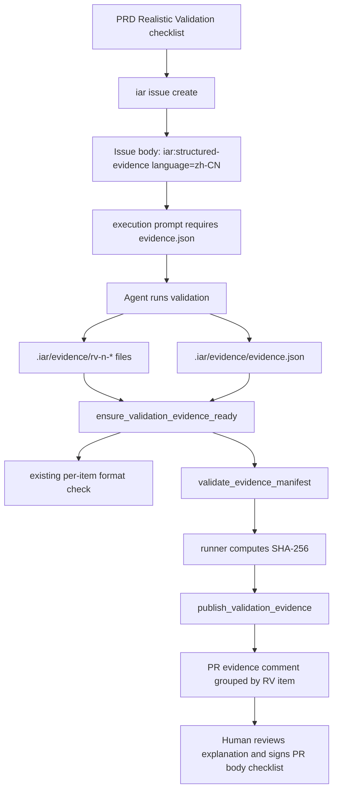
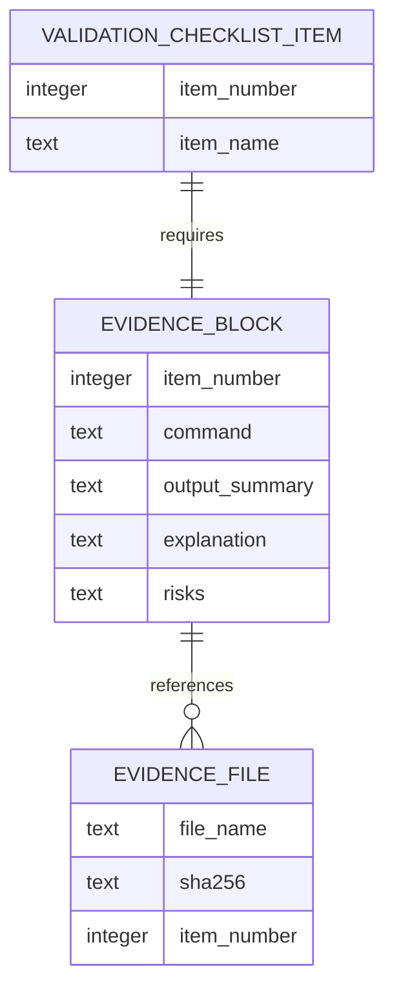

# PRD: Realistic Validation 结构化证据可信度增强

## 1. Introduction & Goals

### Problem Statement

当前 Realistic Validation Evidence Gate 已能要求 `.iar/evidence/` 非空、按 checklist item 对账证据文件、上传 orphan 证据分支并在 PR 上发布证据 comment。但 reviewer 看到的证据仍以文件名为中心，缺少三个关键可审查信息：

1. 每个证据块对应哪个 checklist 验证项不够直观。
2. 证据 comment 默认英文，与中文项目的审阅语言不一致。
3. 证据没有解释“为什么这份输出能证明该检查点成立”，虚假或无关证据的通过成本仍然偏低。

用户已确认目标：每个 checklist 验证项对应一个证据块，一个验证项可附带多个证据；证据块包含验证项编号与名称、测试/命令、关键输出摘要、解释、潜在风险/不适用说明；证据必须有完整可复现命令与输出哈希/摘要；iar 用结构化 schema 校验证据块字段完整性；人 review 重点看解释是否合理；证据语言读取项目配置，默认中文。

### Proposed Solution Summary

在现有 Validation Evidence Gate 上增加**结构化证据 manifest + 按 checklist 渲染 PR comment + 项目语言配置**：

- **证据输入**：执行 agent 除 `rv-<n>-*` 证据文件外，必须写 `.iar/evidence/evidence.json` manifest。manifest 以 checklist item 为主键，描述 item 编号、名称、可复现命令、关键输出摘要、解释、风险/不适用说明和关联证据文件。
- **门禁校验**：新增 core 模块解析并校验 manifest：每个 Realistic Validation checklist item 必须有对应证据块；必填字段非空；关联文件存在且与 item 编号一致；runner 计算证据文件 SHA-256 并渲染到 PR comment。
- **本地化**：新增 `[agent_runner.validation].language`，默认 `zh-CN`，可被目标仓库 `.iar.toml` 覆盖。执行 prompt、recovery prompt、PR evidence comment 使用该语言生成固定文案；manifest 也必须声明 language。
- **呈现**：`build_evidence_comment()` 不再只按文件名平铺，而是按 `RV-1 / RV-2` 渲染结构化证据块，展示命令、文件、哈希、关键输出摘要、解释和风险说明。
- **兼容**：只对带 `iar:structured-evidence` marker 的新 Issue 强制 manifest；没有 marker 的存量 Issue 走 legacy 文件列表渲染，避免打断已在途任务。

刻意避免的复杂度：不做 AI 判图或自动真实性判断；不把证据存入数据库；不引入 JSON Schema 第三方依赖；不新增 `.iar/config` 配置文件，而是使用现有 `config.toml` / `.iar.toml` 配置体系。

### Measurable Objectives

- 新建 Issue 的 Realistic Validation section 包含 `iar:structured-evidence version=1 language=<language>` marker。
- 要求结构化证据的 Issue 在缺少 `.iar/evidence/evidence.json`、缺少某 item 证据块、必填字段为空、关联文件不存在或编号不匹配时，runner 拒绝发布并进入 recovery。
- PR evidence comment 按 checklist item 分组展示证据块，而不是只按文件名展示。
- PR evidence comment 默认中文；配置 `language = "en-US"` 时固定文案切换为英文。
- comment 中每个证据文件展示 runner 计算的 SHA-256 摘要，reviewer 能复现命令并核对输出文件。
- 存量无 `iar:structured-evidence` marker 的 Issue 继续使用现有证据门禁，不强制 manifest。

### Realistic Validation

除单元测试和集成测试外，本 PRD 要求通过**真实项目入口点**验证关键行为，确保真实使用路径生效，而非仅在隔离 fixture 中通过。

- [ ] **结构化 manifest 真实验证**：通过包含 `iar:structured-evidence` marker 的真实 runner 路径，提交完整 `.iar/evidence/evidence.json` 与 `rv-<n>-*` 文件，确认 `ensure_validation_evidence_ready()` 通过。
- [ ] **缺失字段拒绝真实验证**：通过真实临时 worktree 文件系统构造缺少解释/命令/文件的 manifest，运行 runner commit 前门禁，确认进入 recovery 且错误信息指出具体 item。
- [ ] **中文证据 comment 真实验证**：运行 `publish_validation_evidence()` 或包含发布阶段的 fake GitHub sandbox，确认 PR comment 按 `RV-1` 分组、中文文案、包含命令、摘要、解释、风险和 SHA-256。
- [ ] **兼容路径真实验证**：对无 `iar:structured-evidence` marker 的 Issue 运行现有 evidence 文件路径，确认 legacy evidence comment 仍可生成，不要求 manifest。
- [ ] **为什么单元测试不够**：该能力横跨 Issue body marker、worktree 真实文件系统、文件哈希、agent recovery prompt、PR comment 渲染与 publish 阶段；只有纯函数测试无法证明真实证据目录和发布注入路径协同生效。

### Delivery Dependencies

- Group: agent-runner-validation-gate
- Depends on groups:
  - none
- Depends on tasks/issues:
  - none
- Gate type: none
- Notes: 现有 Validation Evidence Gate、逐项格式对账和 evidence-format marker 均已归档完成；本 PRD 是其增强，不依赖当前 pending PRD。

## 2. Requirement Shape

- **Actor**：执行 agent（产出 manifest 和证据文件）、runner（校验和渲染）、人工 reviewer（审查解释和证据）、operator（配置项目语言）。
- **Trigger**：
  - `iar issue create` 物化 Realistic Validation 清单。
  - agent 执行验证并写 `.iar/evidence/`。
  - runner commit 前证据门禁执行。
  - publish 阶段上传证据并发布 PR comment。
- **Expected Behavior**：
  - 新 Issue 要求结构化证据 manifest。
  - manifest 字段完整且覆盖所有 checklist items。
  - PR comment 按验证项分组并使用项目语言。
  - runner 计算证据文件哈希，避免完全信任 agent 填写的摘要。
- **Explicit Scope Boundary**：
  - 不自动判断解释是否真实或充分，人工 reviewer 仍需审查。
  - 不扫描证据文件中的敏感信息。
  - 不改变 orphan 证据分支、PR body checkbox、validation labels 和 branch protection 的核心机制。
  - 不新增 `.iar/config`；语言配置落在现有 `[agent_runner.validation]`。

## 3. Repository Context And Architecture Fit

### Current Relevant Modules And Files

| 路径 | 当前职责 | 与本 PRD 的关系 |
|---|---|---|
| `src/backend/core/use_cases/agent_runner_validation.py` | validation gate 主模块，当前约 1017 行 | 不继续追加大量逻辑；只接入新模块 |
| `src/backend/core/use_cases/agent_runner_evidence_format.py` | 逐项格式对账 | 继续复用 item 编号与 evidence 文件规则 |
| `src/backend/core/use_cases/create_issue_from_prd.py` | Issue body 物化 Realistic Validation | 新增 structured evidence marker 物化 |
| `src/backend/core/use_cases/agent_runner_feedback.py` | execution / recovery prompt | 增加 manifest 写入要求和本地化说明 |
| `src/backend/core/shared/models/agent_runner.py` | `ValidationConfig` | 新增 `language` 与 structured evidence 开关 |
| `src/backend/infrastructure/config/settings.py` | Pydantic settings | 新增对应配置字段 |
| `src/backend/engines/agent_runner/factory.py` | settings → AppConfig | 透传新增配置字段 |
| `src/backend/engines/agent_runner/repository_local.py` | `.iar.toml` 生成 | 同步新增配置字段注释 |
| `docs/guides/agent-runner.md` | validation evidence 文档 | 更新 manifest schema、语言配置和 reviewer 流程 |
| `tests/test_agent_runner_validation.py` | validation gate 测试 | 新增 manifest 校验和 comment 渲染测试 |
| `tests/test_create_issue_from_prd.py` | Issue body 物化测试 | 新增 structured marker 测试 |

### Existing Path

当前最接近路径是 `agent_runner_validation.py` 中的 `ensure_validation_evidence_ready()`、`build_evidence_comment()` 与 `publish_validation_evidence()`。由于该文件已超过 1000 行警戒，新逻辑应放入新模块，例如 `agent_runner_structured_evidence.py`，由现有函数少量调用。

### Reuse Candidates

- `extract_realistic_validation_items()`：获取 checklist item 顺序。
- `collect_evidence_coverage_problems()`：继续验证 `rv-<n>-*` 文件覆盖和格式。
- `list_evidence_files()` / `evidence_dir_path()`：读取证据目录。
- `build_validation_prompt_line()`：加入 manifest 写入要求。
- `format_event_marker()` 与 existing marker style：新增 hidden marker 保持 `<!-- iar:... -->` 格式。

### Architecture Constraints

- 新 manifest 解析和校验属于 core 纯逻辑；不要 import infrastructure。
- 文件 hash 使用标准库 `hashlib`。
- JSON 解析使用标准库 `json`，不新增依赖。
- 所有证据 manifest / text 文件读取显式 `encoding="utf-8"`，二进制证据用 `read_bytes()`。
- 新代码不继续扩大 `agent_runner_validation.py`；如果需要较大改动，优先把 comment rendering 或 evidence upload helper 拆出模块。

### Existing PRD Relationship

- `tasks/archive/P1-FEAT-20260610-143013-validation-evidence-gate.md`：已完成，提供证据目录、orphan 分支、PR comment、人工签收和软/硬门禁。
- `tasks/archive/20260611-143619-validation-evidence-per-item-format-check.md`：已完成，提供每 item `rv-<n>-*` 文件对账和格式后缀检查。
- `tasks/archive/P1-FEAT-20260611-151903-agent-parsed-evidence-format-markers.md`：已完成，提供 `iar:evidence-format` marker。
- 当前 pending PRDs 中未发现重复的 structured evidence manifest 工作。

### Potential Redundancy Risks

- 不要新增第二套证据文件命名；继续使用 `rv-<n>-*`。
- 不要用 agent-provided hash 作为可信数据；hash 必须由 runner 计算。
- 不要把 manifest 当作唯一证据；manifest 是索引与解释，实际证据仍是证据文件。
- 不要强迫存量无 marker Issue 立即迁移，否则会破坏在途任务。

## 4. Recommendation

### Recommended Approach

推荐新增 `agent_runner_structured_evidence.py`，以最小接入点增强现有 validation gate：

1. **Issue 创建时物化 marker**：`build_issue_validation_section()` 或调用方在 Realistic Validation section 中加入 `<!-- iar:structured-evidence version=1 language="zh-CN" -->`。
2. **Prompt 要求**：`build_validation_prompt_line()` 要求 agent 在 `.iar/evidence/evidence.json` 写结构化 manifest，并按项目语言填写摘要、解释与风险。
3. **Commit 前校验**：`ensure_validation_evidence_ready()` 在现有非空 + per-item 文件对账后，如 Issue body 带 structured marker，则调用 `ensure_structured_evidence_ready()`。
4. **PR comment 渲染**：`build_evidence_comment()` 优先读取结构化 manifest，按 item 渲染证据块；无 marker 或 manifest 不要求时走 legacy 渲染。
5. **配置贯通**：`ValidationConfig.language = "zh-CN"` 与 `structured_evidence = True` 从 `config.toml` / `.iar.toml` 透传。

### Why This Fits

- 复用现有证据门禁和文件上传机制，不改状态机。
- 用 manifest 补上“证据与 checklist 的解释关系”，让 reviewer 可逐项核查。
- marker-gated enforcement 兼容存量 Issue。
- 新模块控制文件规模，避免继续扩大已经超过 1000 行的 validation 主模块。

### Alternatives Considered

| 方案 | 拒绝原因 |
|---|---|
| 在 PR comment 中让 agent 自由写解释 | 无 schema，runner 无法校验字段完整性 |
| 用第三方 JSON Schema 包校验 | 当前字段简单，标准库足够；新增依赖不必要 |
| 对证据内容做 AI 自动审核 | 过度设计且无法可靠防伪；本 PRD 目标是结构化可审查，不替代人工判断 |
| 默认要求所有旧 Issue 也有 manifest | 会打断已创建但未带 marker 的在途任务 |
| 新增 `.iar/config` 存 language | 仓库已有 `.iar.toml` 和 `config.toml` 配置体系，新增文件会制造配置漂移 |

## 5. Implementation Guide

This section is a living implementation guide based on current repository analysis. If implementation discovers additional affected files, hidden dependencies, edge cases, or a better path, update this PRD before proceeding.

### Core Logic

#### Manifest Schema

`.iar/evidence/evidence.json` 使用 UTF-8 JSON：

```json
{
  "version": 1,
  "language": "zh-CN",
  "items": [
    {
      "item_number": 1,
      "item_name": "Run worktree preparation 真实验证",
      "command": "uv run pytest tests/test_run_agent.py -k \"worktree_reconcile\" -v",
      "evidence_files": ["rv-1-worktree-reconcile.txt"],
      "output_summary": "pytest 目标用例通过，输出显示 run_once 在 agent 执行前完成远程分支对齐。",
      "explanation": "该用例使用真实 Git 仓库与裸远程，覆盖 remote-tracking ref 与 fast-forward 判定，因此能证明工作树准备路径生效。",
      "risks": "GitHub 与 agent 边界为 fake；该证据不证明 live GitHub API 可用。"
    }
  ]
}
```

规则：

- `version` 必须为 `1`。
- `language` 必须等于 Issue marker 或 config 的语言。
- `items` 必须覆盖 Realistic Validation checklist 的所有 item。
- 每个 item 必填：`item_number`、`item_name`、`command`、`evidence_files`、`output_summary`、`explanation`、`risks`。
- `evidence_files` 可有多个文件；每个文件必须存在于 evidence dir 第一层，并且文件名必须匹配对应 `rv-<item_number>-*` 或 `rv-<item_number>.*`。
- runner 计算每个 evidence file 的 SHA-256，渲染时展示前 12 位短 hash 与完整 hash。

#### New Core Module

新增 `src/backend/core/use_cases/agent_runner_structured_evidence.py`：

- `format_structured_evidence_marker(language: str) -> str`
- `parse_structured_evidence_marker(issue_body: str) -> StructuredEvidenceMarker | None`
- `load_evidence_manifest(worktree_path, config) -> EvidenceManifest`
- `validate_evidence_manifest(issue_body, worktree_path, config) -> StructuredEvidenceReport`
- `render_structured_evidence_comment(report, upload, pr_url, head_sha, language) -> str`
- `build_structured_evidence_prompt_suffix(language) -> str`

#### Existing Function Hooks

- `create_issue_from_prd.py`
  - 在 Realistic Validation section 物化时，如 `config.validation.structured_evidence` 为 true，则加入 marker。
  - `IssueFromPrdRequest` 可能需要接收 `validation_language` / `structured_evidence`，由 CLI context config 填入。
- `agent_runner_validation.py`
  - `ensure_validation_evidence_ready()` 在现有检查后调用 `validate_evidence_manifest()`。
  - `build_evidence_comment()` 如存在 structured marker，则委托新模块渲染。
  - 只加薄调用，不放大该文件。
- `agent_runner_feedback.py`
  - execution/recovery prompt 增加 manifest schema 与项目语言要求。
- `settings.py` / `agent_runner.py` / `factory.py` / `repository_local.py`
  - 增加并透传 `language: str = "zh-CN"` 与 `structured_evidence: bool = True`。

### Change Impact Tree

```text
.
├── Domain
│   ├── src/backend/core/use_cases/agent_runner_structured_evidence.py
│   │   [新增]
│   │   【总结】解析、校验和渲染结构化 evidence.json manifest
│   │   ├── structured marker format/parse
│   │   ├── EvidenceManifest / EvidenceBlock dataclass
│   │   ├── manifest 必填字段与 item 覆盖校验
│   │   ├── evidence file 存在性、编号匹配与 sha256 计算
│   │   └── 中文/英文 evidence comment 渲染
│   │
│   ├── src/backend/core/use_cases/agent_runner_validation.py
│   │   [修改]
│   │   【总结】在现有门禁和 PR comment 中接入结构化证据模块，不继续承载大段新逻辑
│   │   ├── ensure_validation_evidence_ready 调用 structured manifest 校验
│   │   └── build_evidence_comment 优先使用 structured renderer
│   │
│   ├── src/backend/core/use_cases/create_issue_from_prd.py
│   │   [修改]
│   │   【总结】Issue body Realistic Validation section 物化 structured evidence marker
│   │
│   ├── src/backend/core/use_cases/agent_runner_feedback.py
│   │   [修改]
│   │   【总结】执行与 recovery prompt 增加 evidence.json schema、项目语言和解释字段要求
│   │
│   └── src/backend/core/shared/models/agent_runner.py
│       [修改]
│       【总结】ValidationConfig 增加 language 与 structured_evidence 字段
│
├── Infrastructure
│   ├── src/backend/infrastructure/config/settings.py
│   │   [修改]
│   │   【总结】AgentRunnerValidationSettings 增加 language 与 structured_evidence
│   │
│   └── src/backend/engines/agent_runner/repository_local.py
│       [修改]
│       【总结】.iar.toml 生成模板与注释同步新增配置字段
│
├── Engines
│   └── src/backend/engines/agent_runner/factory.py
│       [修改]
│       【总结】AppConfig 装配与 repository-local override 透传结构化证据配置
│
├── Config
│   └── config.toml
│       [修改]
│       【总结】[agent_runner.validation] 增加 language 与 structured_evidence 示例
│
├── Tests
│   ├── tests/test_agent_runner_validation.py
│   │   [修改]
│   │   【总结】覆盖 manifest 校验、缺失字段拒绝、hash 渲染、本地化和 legacy 兼容
│   │
│   ├── tests/test_create_issue_from_prd.py
│   │   [修改]
│   │   【总结】覆盖 structured evidence marker 物化与 language 配置
│   │
│   └── tests/test_agent_runner_config.py
│       [修改]
│       【总结】覆盖 config.toml 与 .iar.toml 对 language / structured_evidence 的合并
│
└── Docs
    └── docs/guides/agent-runner.md
        [修改]
        【总结】更新 Realistic Validation 证据门禁章节，加入 manifest schema、证据块示例、语言配置与 reviewer 审查重点
```

文件清单是实现起点而非穷尽保证；隐藏引用见 Executor Drift Guard。

### Executor Drift Guard

实现前先运行：

```bash
rg -n "validation-evidence|realistic-validation|evidence-format|ValidationConfig|AgentRunnerValidationSettings" src tests docs config.toml
rg -n "build_evidence_comment|ensure_validation_evidence_ready|publish_validation_evidence|build_validation_prompt_line" src/backend/core/use_cases tests
rg -n "IssueFromPrdRequest|build_issue_validation_section|extract_realistic_validation_items" src/backend/core/use_cases/create_issue_from_prd.py tests/test_create_issue_from_prd.py
rg -n "build_repository_local_config_text|validation\\." src/backend/engines/agent_runner/repository_local.py tests/test_agent_runner_init.py
wc -l src/backend/core/use_cases/agent_runner_validation.py src/backend/core/use_cases/create_issue_from_prd.py
```

- `agent_runner_validation.py` 当前已超过 1000 行；实现不得把 manifest 解析/渲染大段逻辑放回该文件。
- 如果 `create_issue_from_prd.py` 继续增长，优先抽出 validation section 物化 helper，而不是继续扩展私有函数。
- 如果 manifest 文件名与 future assets 冲突，保留 `.iar/evidence/evidence.json` 作为唯一 manifest 名，不允许多个 manifest。
- 如果配置合并失败，先查 `.iar.toml` repository-local override 是否覆盖 `config.toml`。

### Flow Or Architecture Diagram



### Realistic Validation Plan

| Behavior | Real Entry Point | Test Layer | Mock Boundary | Data/Env Needed | Command Or Procedure | Required For Acceptance |
|---|---|---|---|---|---|---|
| Issue body structured marker | `uv run iar issue create <prd>` or `create_issue_from_prd()` API path | integration | GitHub client fake; file system real | PRD with Realistic Validation | `uv run pytest tests/test_create_issue_from_prd.py -k "structured_evidence" -q` | Yes |
| Complete manifest passes commit gate | `ensure_validation_evidence_ready()` via runner use case fixture | integration | GitHub/agent fake; real temp worktree files | Issue body marker + evidence.json + rv files | `uv run pytest tests/test_agent_runner_validation.py -k "structured_manifest_passes" -q` | Yes |
| Missing manifest fields fail recovery | Runner commit-before-publish path | integration | GitHub/agent fake; real temp worktree files | Invalid manifest variants | `uv run pytest tests/test_agent_runner_validation.py -k "structured_manifest_rejects" -q` | Yes |
| Chinese grouped PR comment | `publish_validation_evidence()` | integration | GitHub client fake; git plumbing fake or temp git repo | Valid manifest + evidence files | `uv run pytest tests/test_agent_runner_validation.py -k "structured_evidence_comment" -q` | Yes |
| Legacy Issue compatibility | `publish_validation_evidence()` without structured marker | integration | GitHub client fake | Old Issue body + rv files | `uv run pytest tests/test_agent_runner_validation.py -k "legacy_evidence_comment" -q` | Yes |
| Config merge | `resolve_repository_targets` with `.iar.toml` | integration | No external services | temp repo local config | `uv run pytest tests/test_agent_runner_config.py -k "validation_language" -q` | Yes |
| Full regression | `just test` | test | 无 | 无 | `just test` | Yes |

失败排查提示：manifest 校验失败先查 Issue body 是否带 `iar:structured-evidence` marker；comment 语言不对先查 `.iar.toml` 覆盖顺序；hash 不一致先查证据文件是否在 PR comment 渲染前被修改；legacy 兼容失败先查 structured marker 解析是否过宽误命中。

### Low-Fidelity Prototype

目标 PR evidence comment（中文）：

```text
<!-- iar:validation-evidence version=1 head=abc123 branch=iar-evidence/issue-71 count=3 -->
### Realistic Validation Evidence

- 证据分支：`iar-evidence/issue-71`
- 捕获代码版本：`abc123`
- 语言：`zh-CN`

### RV-1 Run worktree preparation 真实验证

**可复现命令**
`uv run pytest tests/test_run_agent.py -k "worktree_reconcile" -v`

**证据文件**
- `rv-1-worktree-reconcile.txt`
  - SHA-256: `9cf4...`
  - [Open file](...)

**关键输出摘要**
pytest 目标用例通过，输出显示 run_once 在 agent 执行前完成远程分支对齐。

**为什么能证明该检查点成立**
该用例使用真实 Git 仓库与裸远程，覆盖 remote-tracking ref 与 fast-forward 判定。

**潜在风险 / 不适用说明**
GitHub 与 agent 边界为 fake；该证据不证明 live GitHub API 可用。
```

### ER Diagram



No database schema changes in this PRD; the diagram documents the structured manifest data model.

### Interactive Prototype Change Log

No interactive prototype file changes in this PRD.

### External Validation

No external validation required; repository evidence was sufficient.

## 6. Definition Of Done

- New Issues with Realistic Validation carry `iar:structured-evidence` marker when structured evidence is enabled.
- Agent prompts require `.iar/evidence/evidence.json` with item-level evidence blocks.
- Commit-before-publish gate validates manifest coverage, required fields, file existence, item/file numbering and language.
- PR evidence comment is grouped by checklist item and defaults to Chinese.
- Runner-computed SHA-256 is rendered for every evidence file.
- Legacy Issues without structured marker still work.
- Docs, config examples and `.iar.toml` generation are updated.
- `just test`, targeted validation tests and docs build pass.

## 7. Acceptance Checklist

### Architecture Acceptance

- [ ] Structured evidence parsing/rendering is implemented in a new core module, not by adding large blocks to `agent_runner_validation.py`.
- [ ] `core/` code does not import `backend.infrastructure`.
- [ ] Manifest validation uses standard library `json` / `hashlib`; no new runtime dependency is added.
- [ ] Config fields are represented in `ValidationConfig`, `AgentRunnerValidationSettings`, factory mapping and `.iar.toml` generation.
- [ ] Existing evidence-format module remains responsible for format suffix matching; no duplicate suffix rules are introduced.

### Behavior Acceptance

- [ ] `iar issue create` materializes `iar:structured-evidence version=1 language="<configured-language>"` for PRDs with Realistic Validation when enabled.
- [ ] Valid `evidence.json` with all checklist items and referenced files passes `ensure_validation_evidence_ready()`.
- [ ] Missing `evidence.json` for a structured Issue fails with a clear error.
- [ ] Missing required field (`command`, `output_summary`, `explanation`, `risks`, or `evidence_files`) fails and identifies the item number.
- [ ] Evidence file listed under item N must exist and match `rv-N-*` / `rv-N.*`.
- [ ] One item can list multiple evidence files, and all are rendered in the PR comment.
- [ ] PR comment renders grouped sections `RV-1`, `RV-2`, etc., not a flat file list.
- [ ] PR comment includes runner-computed SHA-256 for each evidence file.
- [ ] `language = "zh-CN"` renders Chinese fixed labels; `language = "en-US"` renders English fixed labels.
- [ ] Issue without structured marker still uses legacy rendering and is not forced to provide manifest.

### Documentation Acceptance

- [ ] `docs/guides/agent-runner.md` documents `evidence.json` schema and example.
- [ ] Docs explain `[agent_runner.validation].language` and why it lives in `.iar.toml` / `config.toml`, not `.iar/config`.
- [ ] Docs explain reviewer workflow: verify command, output summary, explanation, risks and SHA-256 before ticking PR body checklist.
- [ ] Config comments in `config.toml` and generated `.iar.toml` mention structured evidence.

### Validation Acceptance

- [ ] `uv run pytest tests/test_agent_runner_validation.py -k "structured_evidence" -q` passes.
- [ ] `uv run pytest tests/test_create_issue_from_prd.py -k "structured_evidence" -q` passes.
- [ ] `uv run pytest tests/test_agent_runner_config.py -k "validation_language" -q` passes.
- [ ] `uv run mkdocs build --strict` passes.
- [ ] `just test` passes.
- [ ] Real entry validation: run a sandbox runner path with a structured Issue and evidence manifest, then capture the generated PR evidence comment showing grouped Chinese evidence blocks and SHA-256.

## 8. Functional Requirements

- **FR-1**：`ValidationConfig` must include `language: str = "zh-CN"` and `structured_evidence: bool = True`.
- **FR-2**：`iar issue create` must add an `iar:structured-evidence` marker when Realistic Validation is present and structured evidence is enabled.
- **FR-3**：The executing agent prompt must require `.iar/evidence/evidence.json` and describe all required fields.
- **FR-4**：For structured Issues, commit-before-publish validation must require `evidence.json`.
- **FR-5**：The manifest must cover every Realistic Validation checklist item exactly once by item number.
- **FR-6**：Each evidence block must include non-empty `item_number`, `item_name`, `command`, `evidence_files`, `output_summary`, `explanation`, and `risks`.
- **FR-7**：Each listed evidence file must exist under `.iar/evidence/` and match the block's item number.
- **FR-8**：Runner must compute SHA-256 for each evidence file and render it in the PR comment.
- **FR-9**：PR evidence comment must be grouped by checklist item and include command, evidence files, output summary, explanation, and risk notes.
- **FR-10**：Fixed prompt/comment labels must use the configured language, defaulting to Chinese.
- **FR-11**：Legacy Issues without `iar:structured-evidence` marker must continue to use existing validation behavior.
- **FR-12**：No evidence files or manifest may enter the code diff; existing publish guard remains authoritative.

## 9. Non-Goals

- 不自动判断证据解释是否真实或充分。
- 不读取图片/PDF 内容做语义审核。
- 不做敏感信息扫描。
- 不改变 PR body human sign-off checkbox 机制。
- 不改变 orphan evidence branch 生命周期。
- 不新增数据库、对象存储或外部服务。
- 不新增 `.iar/config` 文件。

## 10. Risks And Follow-Ups

- **Agent 可能伪造解释**：结构化字段不能完全防伪。缓解：命令、文件哈希和解释并列展示，提高人工审查质量。
- **更多 recovery 循环**：严格 manifest 校验可能让 agent 多次修复。缓解：prompt 和错误信息必须指明具体 item 与缺失字段。
- **旧任务兼容**：强制所有 Issue 可能破坏在途任务。缓解：仅 marker-gated enforcement。
- **语言配置漂移**：用户原话提到 `.iar/config`，仓库实际为 `.iar.toml`。缓解：文档明确只使用现有 TOML 配置体系。
- **文件规模**：`agent_runner_validation.py` 已超过 1000 行。缓解：新逻辑进新模块，并考虑后续拆分 legacy evidence comment 代码。

## 11. Decision Log

| ID | 决策问题 | Chosen | Rejected | Rationale |
|---|---|---|---|---|
| D-01 | 证据结构来源 | `.iar/evidence/evidence.json` manifest | PR comment 自由文本 | JSON manifest 可被 runner 校验字段完整性 |
| D-02 | 可信 hash 来源 | runner 计算 SHA-256 | agent 在 manifest 中填写 hash | runner 计算能避免完全信任 agent 自报摘要 |
| D-03 | 兼容策略 | 只对 `iar:structured-evidence` marker Issue 强制 manifest | 所有 Issue 立即强制 manifest | marker-gated enforcement 不破坏在途任务 |
| D-04 | 本地化配置路径 | `[agent_runner.validation].language` in `config.toml` / `.iar.toml` | 新增 `.iar/config` | 仓库已有 TOML 配置体系，新增文件会制造漂移 |
| D-05 | 模块放置 | 新增 `agent_runner_structured_evidence.py` | 继续扩展 `agent_runner_validation.py` | validation 主模块已超过 1000 行警戒，新逻辑应隔离 |
| D-06 | 自动真实性判断 | 人审查解释与证据，系统只校验结构 | AI 自动审核证据真实性 | AI 审核无法可靠防伪，结构化证据的目标是提高可审查性 |
