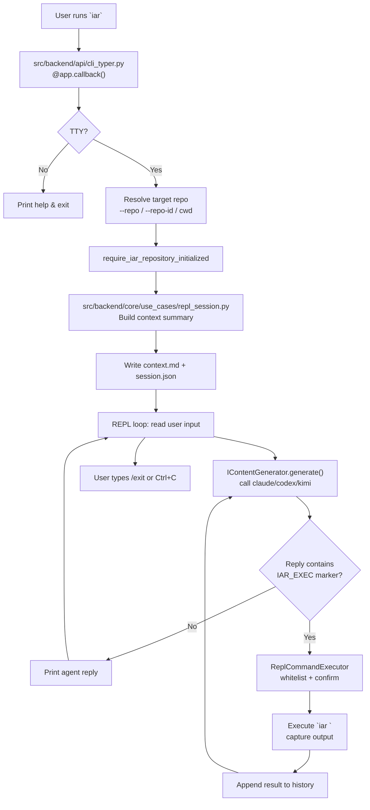

# PRD: IAR REPL 交互入口（`iar` 无参数启动 agent 对话）

> REPL（Read-Eval-Print Loop）— 在本 PRD 中特指 IAR 提供的持续多轮 agent 对话与命令执行入口。
> 用户在 TTY 中直接运行 `iar`（不带任何子命令）即进入该 REPL；非 TTY 环境与现有行为一致，
> 仍打印 `iar --help` 后退出。

## 1. Introduction & Goals

### Problem Statement

当前 `iar` 是一个命令式 CLI：用户必须记住准确的子命令、参数和状态机才能操作。直接运行 `iar` 只会打印 help 并退出。随着 `iar ask` 默认 agent 已切换为 `claude` 且允许 planner 写操作，用户期望有一个更自然的入口：直接运行 `iar` 就能进入 REPL，底层调用 `claude` / `codex` / `kimi` 等 agent，在携带 IAR 仓库上下文的前提下进行交互式对话和文件操作。

### Proposed Solution Summary

在 Typer CLI 树中把 `iar` 的无参数行为从 `--help` 改为**交互式 REPL 入口 + 自然语言命令执行器**。当用户直接运行 `iar` 时：

1. 解析目标仓库（与现有 `--repo` / `--repo-id` 选择器一致）。
2. 读取 `[agent_runner.repl]` 配置，确定默认 agent（默认 `claude`）。
3. 收集 IAR 仓库上下文（`.iar.toml`、pending PRD 摘要、Issue 状态摘要），组装成首条 system 消息。
4. 进入 REPL 循环：
   - 读取用户自然语言输入；
   - 调用 agent 生成回复；
   - 若回复中包含 `<<IAR_EXEC>> <command> <<END_IAR_EXEC>>` 标记，REPL 解析该命令，校验白名单，执行后把输出追加回对话上下文；
   - 若命令需要用户确认（写操作或高风险命令），先询问用户再执行；
   - 继续下一轮对话。
5. 用户输入 `/exit` 或 Ctrl+C 后，`iar` 正常返回。

核心复用现有 `backend.engines.agent_runner.factory._build_content_generation_command` 来构造 agent 调用命令；复用 `iar ask` 的上下文收集逻辑来生成首条上下文消息；新增 `[agent_runner.repl]` 配置段来隔离 REPL 与 `iar ask` 的权限和审计策略。

### Measurable Objectives

- 直接运行 `iar` 在 TTY 环境下进入 agent REPL，非 TTY 环境下失败并提示使用 `iar <command>`。
- 默认 agent 为 `claude`，支持 `--agent codex|claude|kimi` 覆盖。
- 首条上下文自动包含当前仓库的 `.iar.toml` 关键配置、pending PRD 列表、ready/supervising/review Issues 摘要。
- agent 可通过 `<<IAR_EXEC>> ... <<END_IAR_EXEC>>` 标记请求执行 IAR 子命令。
- REPL 对命令执行白名单校验，写操作/高风险命令需用户确认。
- REPL 会话结束后，审计日志写入 `logs/agent-runner/repl/<session_id>/`。
- `iar --help` 仍然可用（通过 `iar --help` 或 `iar -h`）。

### Realistic Validation

除单元测试和集成测试外，本 PRD 要求通过**真实项目入口点**验证关键行为，确保真实使用路径生效，而非仅在隔离 fixture 中通过。

- [ ] **REPL 入口真实验证**：通过 `uv run iar --repo <fixture-repo>` 在 PATH 注入 fake `claude`，验证 CLI 组装正确的首条上下文并进入 REPL 循环。
- [ ] **自然语言转命令执行真实验证**：在 fake `claude` 中返回 `<<IAR_EXEC>> iar labels sync --repo <fixture-repo> <<END_IAR_EXEC>>`，验证 REPL 执行该命令并把输出返回给 agent。
- [ ] **非 TTY 回退真实验证**：通过 `uv run iar | cat` 验证命令非零退出并提示使用 `iar --help`。
- [ ] **Agent 覆盖真实验证**：通过 `uv run iar --agent codex --repo <fixture-repo>` 验证调用 fake `codex` 而非 fake `claude`。

**为什么单元测试不够**：REPL 入口的核心行为是"真实 CLI 如何解析无参数状态、如何构造 agent 调用命令、如何把仓库上下文注入首条消息、如何解析命令标记并执行真实 `iar` 子命令"，这些必须通过真实子进程入口验证；单元测试无法证明 Typer 无参数分支、agent 命令构建和命令执行闭环在真实 shell 中生效。

### Delivery Dependencies

- Group: agent-runner-repl
- Depends on groups:
  - none
- Depends on tasks/issues:
  - none
- Gate type: none
- Notes: 本功能可独立交付，不阻塞也不被其他 pending 任务阻塞。与已归档的 `P2-FEAT-20260527-162000-agent-runner-unified-entry.md`（`iar ask`）共享上下文收集与 agent 命令构建逻辑，但配置段独立。

## 2. Requirement Shape

### Actor

开发者 / 运维人员，希望通过自然语言与 IAR 管理的仓库交互，而不是记忆精确子命令。

### Trigger

用户在已初始化的 IAR 仓库目录内运行：

```bash
iar
```

或在仓库外使用 `--repo` / `--repo-id` 指定目标仓库后运行：

```bash
iar --repo /path/to/repo
iar --repo-id keda
```

### Expected Behavior

1. **TTY 检测**：仅在交互式终端中启动 REPL；非 TTY 立即退出并提示。
2. **仓库选择**：复用现有 `--repo` / `--repo-id` / 当前目录解析逻辑，要求恰好一个目标仓库，且仓库必须已完成 `iar init`。
3. **Agent 选择**：
   - 默认读取 `[agent_runner.repl].default_agent`，默认值为 `claude`。
   - 支持 `--agent codex|claude|kimi` 覆盖。
4. **上下文注入**：收集并组装为初始 system 消息，包含：
   - 仓库身份（`repo_id`、路径）
   - `.iar.toml` 关键摘要（`repository.id`、`git.base_branch`、`runner.verification_commands` 等）
   - `tasks/pending/` 下的 PRD 列表与标题/状态摘要
   - ready / running / supervising / review / blocked / failed Issues 的数量与标题摘要
   - 当前工作区状态（`git status --short`）
   - 可用的 IAR 子命令列表和命令执行标记协议
5. **REPL 循环**：
   - 显示 prompt（如 `iar> `），读取用户输入。
   - 把用户输入追加到对话历史，调用 agent 生成回复。
   - agent 回复中可包含 `<<IAR_EXEC>> <command> <<END_IAR_EXEC>>` 标记。
   - REPL 解析命令，执行白名单校验：
     - 若命令在白名单且为只读/低风险，直接执行。
     - 若命令涉及写操作或高风险（如 `run`、`issue create`、`recover`、`blocked-continue` 等），先询问用户确认。
     - 若命令不在白名单，拒绝执行并告知 agent。
   - 把命令的 stdout/stderr/exit_code 封装成 tool result 追加到对话历史，继续生成回复。
6. **退出**：用户输入 `/exit` 或 Ctrl+C 后，`iar` 正常返回。
7. **审计**：把完整对话历史、执行的命令、命令输出、会话元数据写入 `logs/agent-runner/repl/<session_id>/`。

### Explicit Scope Boundary

- 做**入口 + 上下文组装 + REPL 对话循环 + IAR 命令执行代理**。
- 不替代 `iar ask`、`iar deliberate` 等已有命令；`iar` 无参数是新增可选入口，其他命令保持不变。
- 在 REPL 内实现 IAR 专用的命令白名单和确认流程，agent 不能直接绕过白名单执行任意 shell 命令。
- 不自动执行 `git push` / `git merge` / 创建 PR 等写操作；这些仍通过显式 `iar` 子命令完成（agent 可以请求执行这些 `iar` 子命令，但需用户确认）。

## 3. Repository Context And Architecture Fit

### Current Relevant Modules/Files

| 文件 | 作用 | 与本次改动关系 |
|---|---|---|
| `src/backend/api/cli_typer.py` | Typer/Rich CLI 入口树，`app = typer.Typer(no_args_is_help=True)`；已存在 `_app_callback`（行 241–249）负责注入 `repo` / `repo_id` / `config` | 把 `no_args_is_help` 改为 False；**扩展**已有 `_app_callback` 处理无子命令且 TTY 时跳 REPL（不是新增第二个 callback） |
| `src/backend/api/cli.py` | argparse parser + shared dispatch `_run_parsed_command` | 新增 `repl` dispatch 分支或复用 `ask` 的仓库解析 |
| `src/backend/api/cli_parser.py` | argparse 子命令定义 | 可选：新增无参数 fallback 处理 |
| `src/backend/engines/agent_runner/factory.py` | agent 命令构建、`create_planner_runner`、上下文解析 | 复用 `_build_content_generation_command` 构造 REPL 启动命令 |
| `src/backend/core/use_cases/interactive_decision.py` | `iar ask` 核心用例，含上下文收集 | 提取/复用上下文收集函数 |
| `src/backend/infrastructure/config/settings.py` | pydantic-settings 配置模型 | 新增 `[agent_runner.repl]` 配置段 |
| `config.toml` | 全局默认配置 | 新增 `[agent_runner.repl]` 默认值 |
| `docs/guides/agent-runner.md` | IAR 使用指南 | 新增 REPL 入口说明 |
| `docs/guides/configuration.md` | 配置说明 | 新增 `[agent_runner.repl]` 说明 |

### Existing Architecture Pattern To Follow

- 四层依赖方向：`api/` → `core/` → `engines/` → `infrastructure/`。
- CLI 只做参数解析和依赖装配，业务逻辑在 `core/use_cases/`。
- Agent 命令构建统一在 `engines/agent_runner/factory.py`。
- 配置通过 pydantic-settings 模型管理，仓库本地 `.iar.toml` 可覆盖全局默认值。

### Ownership And Dependency Boundaries

- `api/cli_typer.py` 拥有 Typer 入口形态。
- `core/use_cases/` 拥有 REPL 上下文组装与启动逻辑（可新建 `repl_session.py`）。
- `engines/agent_runner/factory.py` 拥有 agent 启动命令构建。
- `infrastructure/config/settings.py` 拥有配置模型。

### Constraints From Runtime, Docs, Tests, Workflows

- `just test` 必须全绿。
- 单文件非空行不超过 1000 行；新增文件需控制规模。
- 必须支持非交互环境（CI）的失败回退，不能 hang 住。
- 文档需同步更新 `docs/guides/agent-runner.md` 和 `docs/guides/configuration.md`。

### Matching Or Related PRDs

- `tasks/archive/P2-FEAT-20260527-162000-agent-runner-unified-entry.md`（`iar ask`）：已完成。本 PRD 与其共享上下文收集思路，且同样涉及"自然语言 → IAR 命令"的转换。区别在于：`iar ask` 是单次决策入口（生成结构化计划 + 白名单执行），本 PRD 是持续 REPL 入口（多轮对话 + 动态命令执行）。
- `tasks/archive/P2-FEAT-20260610-110442-iar-typer-rich-cli.md`（Typer CLI 迁移）：明确约定 `iar` 无参数展示 help。本 PRD 需要覆盖这一行为，需在 Decision Log 中记录。
- `tasks/pending/`：当前无相关 pending PRD，无重复或依赖。

## 4. Recommendation

### Recommended Approach

**扩展 Typer 无参数回调 + 新增 `core/use_cases/repl_session.py`（REPL 循环 + 命令代理）+ 新增 `[agent_runner.repl]` 配置段。**

1. 在 `cli_typer.py` 中把 `app = typer.Typer(no_args_is_help=True)` 改为 `no_args_is_help=False`，并注册 `@app.callback()` 在无参数且 TTY 时调用 REPL use case。
2. 在 `core/use_cases/repl_session.py` 中实现 `run_repl_session(...)`：
   - 解析仓库目标并检查初始化门禁。
   - 收集仓库上下文，组装成 system 消息。
   - 进入 REPL 循环：读取输入 → 调用 agent → 解析命令标记 → 校验并执行命令 → 追加结果 → 继续。
3. 在 `factory.py` 中给 `_build_content_generation_command` 加可选 `read_only: bool = True` 参数；新增 `_build_repl_command(agent_name, prompt, cwd)` 委托给 `_build_content_generation_command(..., read_only=False)`：
   - REPL 循环由 `iar` 自己管理，需要**非交互式**调用且**不强制 read-only**（claude 用 `-p`，codex 用 `exec` 时去掉 `--sandbox read-only --ask-for-approval never`，kimi 用 `--prompt`），因为 REPL 允许用户与 agent 正常改文件，写操作风险由命令执行器的白名单/确认机制兜底。
4. 新增命令执行器 `ReplCommandExecutor`：
   - 维护 IAR 命令白名单。
   - 对写操作/高风险命令要求用户确认。
   - 通过 subprocess 执行 `iar <command>` 并捕获输出。
5. 在 `settings.py` 新增 `AgentRunnerReplSettings`：
   - `enabled: bool = True`
   - `default_agent: str = "claude"`
   - `default_output_dir: str = "logs/agent-runner/repl"`
   - `max_context_chars: int = 24000`
   - `auto_confirm_commands: list[str]` = 可自动执行的命令列表
   - `confirm_commands: list[str]` = 需要用户确认的命令列表
6. 在 `config.toml` 新增 `[agent_runner.repl]` 默认值。

### Why This Is The Best Fit

- 满足核心需求：把自然语言转成 IAR 命令并执行，而不是只做透传聊天。
- 架构清晰：REPL 循环和命令代理是新的 use case，不污染 `iar ask` 的决策安全模型。
- 可控制：通过白名单和确认机制，agent 不能直接执行任意危险操作。
- 可扩展：新增 `[agent_runner.repl]` 配置段，未来可独立调整默认 agent、上下文策略、命令权限。

### Alternatives Considered

| 方案 | 说明 | 未采纳原因 |
|---|---|---|
| A. 让 `iar ask` 无参数进入 REPL | 把 REPL 合并进 `iar ask` | `iar ask` 的设计是单次决策入口，合并会混淆两个功能的权限模型；且用户想要的是持续对话 + 即时执行 |
| B. 新增 `iar chat` 子命令 | 不改动 `iar` 无参数行为 | 用户明确要求直接运行 `iar` 进入交互；新增子命令无法覆盖无参数入口 |
| C. 直接透传 agent REPL | agent 自己管理对话，不执行 IAR 命令 | 无法满足"自然语言转成 IAR 命令并执行"的核心需求 |
| D. 使用 function calling / MCP | 依赖 agent CLI 的 tool use 能力 | 当前 `claude`/`codex`/`kimi` CLI 的 tool use 形态不稳定或不一致；prompt 标记协议更简单可控 |

## 5. Implementation Guide

> This section is a living implementation guide based on current repository analysis. If implementation discovers additional affected files, hidden dependencies, edge cases, or a better path, update this PRD before proceeding.

### Core Logic

1. **Typer 入口调整**
   - 文件：`src/backend/api/cli_typer.py`
   - 修改 `app = typer.Typer(..., no_args_is_help=True)` 为 `no_args_is_help=False`。
   - **扩展**已有的 `_app_callback`（行 241–249），在函数体尾部增加 `ctx.invoked_subcommand is None` 分支：
     - TTY：调用 `_run_typer_command("repl", repo=ctx.obj.get("repo"), repo_id=ctx.obj.get("repo_id"), config=ctx.obj.get("config"))`，再由 `cli.py` 的 `repl` 分支组装依赖并调用 `run_repl_session`。
     - 非 TTY：复用 `no_args_is_help=False` 行为，Typer 会自动渲染 help；或者主动 `typer.echo(format_help())` 后返回 0。
   - 不要新增第二个 `@app.callback()`——Typer 会拒绝或覆盖原 callback，导致 `repo`/`repo_id`/`config` 注入丢失。
   - 保留 `iar --help` 通过 Typer 原生机制（`-h` / `--help` 走 Click 的帮助分支，不进入 callback）。

2. **REPL use case（REPL 循环 + 命令代理）**
   - 新建文件：`src/backend/core/use_cases/repl_session.py`
   - 函数签名（按 `docs/ai-standards/code-reuse.md` 参数收敛规则，参数超过 4 个时拆成对象）：
     ```python
     @dataclass(frozen=True)
     class ReplSessionInputs:
         """REPL 会话的输入边界：来自 CLI / 配置解析后的目标与策略。"""
         context: RepositoryRunContext
         agent: str
         config: "AgentRunnerReplSettings"  # 来自 infrastructure/config/settings.py
         output_dir: Path | None = None


     @dataclass(frozen=True)
     class ReplSessionDeps:
         """REPL 会话的依赖注入边界：四个端口实现，便于单测用假实现替换。"""
         process_runner: IProcessRunner
         content_generator: IContentGenerator
         github_client_factory: Callable[[Path], IGitHubClient] | None = None
         command_executor: "IReplCommandExecutor | None" = None


     def run_repl_session(inputs: ReplSessionInputs, deps: ReplSessionDeps) -> int:
         """Run the interactive REPL session and return process exit code."""
     ```
   - 逻辑：
     - `require_iar_repository_initialized(inputs.context.repo_path, deps.process_runner)`
     - `_ensure_gh_auth_or_prompt(inputs.context.repo_path, deps.process_runner)`（与 `iar ask` 保持一致；保留可关闭的开关，给非交互式 CI 留退出路径）
     - **直接调用 `build_decision_context(inputs.context, config=... , github_client=...)`** 取得 `DecisionContext`，再追加 REPL 专属字段（可用子命令列表、`IAR_EXEC` 协议说明、`.iar.toml` 全文摘要、`git status --short` 输出），组装成首条 system message。
     - 截断上下文到 `inputs.config.max_context_chars`（复用 `interactive_decision._truncate_prompt`）
     - 生成 `session_id = datetime.now(timezone.utc).strftime("repl-%Y%m%d-%H%M%S-%f")[:-3]`
     - 初始化对话历史：`[system_message]`
     - REPL 循环：
       - 打印 `iar> ` prompt，读取用户输入
       - 若输入为 `/exit` 或 EOF/Ctrl+C，退出循环
       - 把用户输入作为 user message 追加到历史
       - 调用 `deps.content_generator.generate(inputs.agent, _serialize_history(history), cwd=inputs.context.repo_path, timeout=inputs.config.agent_timeout_seconds)` 获取 agent 回复
       - 把 agent 回复作为 assistant message 追加到历史
       - 用 `parse_iar_exec_markers(agent_reply_text)` 抽取 `IarExecRequest(command: str, ...)` 列表（模块顶部定义的 `IAR_EXEC_OPEN_MARKER` / `IAR_EXEC_CLOSE_MARKER` 常量）
       - 对每个命令：
         - 用 `deps.command_executor` 校验白名单并决定是否需要确认
         - 如需确认，打印命令并提示 `Execute? [y/N]`，读取用户输入
         - 通过 `deps.process_runner.run(["iar", *command_args], cwd=inputs.context.repo_path, capture_output=True, check=False)` 执行，捕获 stdout/stderr/exit_code
         - 把结果封装为 user message 追加到历史：`f"{IAR_EXEC_RESULT_OPEN_TAG} exit_code={...}\nstdout: ...\nstderr: ...\n{IAR_EXEC_RESULT_CLOSE_TAG}"`
       - 继续循环（agent 会在下一轮基于执行结果回复）
     - 会话结束时，把完整对话历史、执行的命令列表、会话元数据写入 `inputs.output_dir / session_id /`（默认 `inputs.config.default_output_dir`）。
     - 返回 0（除非发生未处理异常）。
   - **标记常量集中化**（避免散弹枪修改）：在 `repl_session.py` 模块顶部定义
     ```python
     IAR_EXEC_OPEN_MARKER = "<<IAR_EXEC>>"
     IAR_EXEC_CLOSE_MARKER = "<<END_IAR_EXEC>>"
     IAR_EXEC_RESULT_OPEN_TAG = "[IAR_EXEC_RESULT]"
     IAR_EXEC_RESULT_CLOSE_TAG = "[/IAR_EXEC_RESULT]"
     ```
     所有 prompt 拼接与 marker 解析都引用这些常量；新增语言/翻译时只改这一处。

3. **Agent 调用命令构建**
   - 文件：`src/backend/engines/agent_runner/factory.py`
   - **不新增独立 builder**——把现有 `_build_content_generation_command(agent_name, prompt, cwd)` 改为接受可选 `read_only: bool = True`，再新增 `_build_repl_command(agent_name, prompt, cwd)` 委托给 `_build_content_generation_command(..., read_only=False)`。这样 REPL 与 content-generation / planner 共用同一份 agent 装配代码，claude / kimi 命令形态字节级一致，codex 仅去掉 `--sandbox read-only --ask-for-approval never`：
     - `claude`: `["claude", "--dangerously-skip-permissions", "-p", prompt]`（与现有 content-generation 一致）
     - `codex`: `["codex", "--cd", str(cwd), "exec", prompt]`（去掉 `--sandbox read-only --ask-for-approval never`）
     - `kimi`: `["kimi", "--prompt", prompt]`（与现有 content-generation 一致）
   - REPL 中的写操作风险由命令执行器的白名单/确认机制控制；agent 自身直接改文件的权限与直接运行该 agent CLI 一致（这是显式接受的风险，见 §10 对应条目）。

4. **命令执行器（端口 + 实现分离）**
   - **接口（core 依赖的契约）**：在 `src/backend/core/shared/interfaces/agent_runner.py` 中新增 `IReplCommandExecutor`，定义 `validate_and_run(command: IarExecCommand, *, repo_path: Path, auto_confirm: bool, prompt_fn: Callable[[str], bool]) -> ReplExecOutcome` 等方法。
   - **实现（具体类放到 engines 或 infrastructure，避免 core 反向依赖实现）**：建议放 `src/backend/engines/agent_runner/repl_command_executor.py`，类名 `ReplCommandExecutor`，实现 `IReplCommandExecutor`：
     - 默认白名单包含所有 `iar` 子命令（`init`, `labels`, `issue`, `run`, `daemon`, `review`, `review-daemon`, `recover`, `blocked-continue`, `ask`, `deliberate`, `takeover`, `worktree`, `registry`, `workflow`, `completion`）。
     - 默认自动确认：只读/低风险命令（如 `labels sync --dry-run`、`run --dry-run`、`ask --plan-only`、`status` 等）。
     - 默认需要确认：写操作/高风险命令（如 `run`、`daemon`、`issue create`、`recover`、`blocked-continue`、`worktree create/remove` 等）。
     - 拒绝执行：不在白名单中的命令、包含 shell 元字符的命令、`git push`/`git merge`/`git reset` 等直接 git 写操作。
     - 执行方式：通过 `process_runner.run(["iar", *command_args], cwd=repo_path, capture_output=True, check=False)`（必须 `check=False`，避免非零退出抛异常）。
   - **配置接入**：在 `cli.py` 的 `repl` 分支组装 `ReplCommandExecutor(process_runner=process_runner, allowlist=..., confirm_required=...)` 并注入到 `ReplSessionDeps.command_executor`。
   - **不要把 `ReplCommandExecutor` 直接放 `core/use_cases/`**——那会让 core 反向依赖实现，违反四层架构。

5. **配置模型**
   - 文件：`src/backend/infrastructure/config/settings.py`
   - 新增：
     ```python
     class AgentRunnerReplSettings(BaseModel):
         enabled: bool = True
         default_agent: str = "claude"
         default_output_dir: str = "logs/agent-runner/repl"
         max_context_chars: int = 24000
         agent_timeout_seconds: int = 120  # 与 AgentRunnerInteractiveDecisionSettings.planner_timeout_seconds 对齐
         auto_confirm_commands: list[str] = Field(default_factory=lambda: [
             "labels sync --dry-run",
             "run --dry-run",
             "review --dry-run",
             "ask --plan-only",
         ])
         confirm_commands: list[str] = Field(default_factory=lambda: [
             "run",
             "daemon",
             "review",
             "review-daemon",
             "issue create",
             "recover",
             "blocked-continue",
             "worktree create",
             "worktree remove",
         ])
     ```
   - 挂载到 `AgentRunnerSettings`：`repl: AgentRunnerReplSettings = Field(default_factory=AgentRunnerReplSettings)`。
   - **本地覆盖链路（必须改这四处，否则 `.iar.toml` 覆盖项不生效）**：
     1. `_AgentRunnerRepositoryOverrideSettings`（行 ~619）新增 `repl: AgentRunnerReplSettings | None = None`
     2. `AgentRunnerLocalSettings` 与 `AgentRunnerRepositorySettings` 已经在 `_AgentRunnerRepositoryOverrideSettings` 基类拿到 `repl` 字段，无需单独改
     3. `load_agent_runner_local_settings()`（行 ~660）末尾的 `AgentRunnerRepositorySettings(...)` 构造必须显式透传 `repl=local_settings.repl`，与现有 `interactive_decision=local_settings.interactive_decision` 一致

6. **全局配置**
   - 文件：`config.toml`
   - 新增：
     ```toml
     [agent_runner.repl]
     enabled = true
     default_agent = "claude"
     default_output_dir = "logs/agent-runner/repl"
     max_context_chars = 24000
     agent_timeout_seconds = 120
     auto_confirm_commands = [
       "labels sync --dry-run",
       "run --dry-run",
       "review --dry-run",
       "ask --plan-only",
     ]
     confirm_commands = [
       "run",
       "daemon",
       "review",
       "review-daemon",
       "issue create",
       "recover",
       "blocked-continue",
       "worktree create",
       "worktree remove",
     ]
     ```

7. **CLI dispatch**
   - 文件：`src/backend/api/cli.py`
   - 在 `_run_parsed_command` 中新增 `if parsed.command == "repl":` 分支。
   - `cli_typer.py` 的无参数 callback 直接调用 `_run_typer_command("repl", ...)`，`cli.py` 负责实际依赖装配和 use case 调用。

### Change Impact Tree

```text
.
├── src/backend/api/cli_typer.py
│   [修改]
│   【总结】把 `no_args_is_help=True` 改为 False，扩展已有 `_app_callback` 处理无参数 TTY 入口
│   ├── 修改 `no_args_is_help=True` → False
│   ├── 扩展已有 `_app_callback`（行 241–249）追加 `ctx.invoked_subcommand is None` 分支
│   └── 保持子命令 help 行为
│
├── src/backend/api/cli.py
│   [修改]
│   【总结】新增 `repl` 命令的 argparse parser 和 dispatch 分支
│   ├── 新增 repl_parser 定义
│   └── 新增 `if parsed.command == "repl"` 分支
│
├── src/backend/api/cli_parser.py
│   [修改]
│   【总结】注册 `repl` 子命令参数（与 Typer 入口保持一致）
│   └── 新增 `--agent` 选项和位置参数处理
│
├── src/backend/core/use_cases/repl_session.py
│   [新增]
│   【总结】REPL 会话核心用例：REPL 循环、上下文收集、命令标记解析、审计写入
│   ├── run_repl_session 主函数
│   ├── _build_repl_context 上下文组装
│   └── _parse_iar_exec_markers 命令标记解析
│
├── src/backend/core/shared/interfaces/agent_runner.py
│   [修改]
│   【总结】新增 `IReplCommandExecutor` 端口契约（core 仅依赖接口，不直接依赖实现）
│   └── IReplCommandExecutor
│
├── src/backend/engines/agent_runner/repl_command_executor.py
│   [新增]
│   【总结】REPL 命令执行器（实现 IReplCommandExecutor）：白名单校验、确认提示、子进程执行
│   ├── ReplCommandExecutor（实现 IReplCommandExecutor，符合 engines 实现 core 接口的依赖方向）
│   └── _is_command_allowed / _requires_confirmation
│
├── src/backend/core/shared/models/agent_runner.py 或新建 agent_repl.py
│   [新增/修改]
│   【总结】新增 ReplConfig 数据模型
│   └── ReplConfig dataclass
│
├── src/backend/engines/agent_runner/factory.py
│   [修改]
│   【总结】给 _build_content_generation_command 加 read_only 参数；新增 _build_repl_command 复用同一份 builder
│   ├── _build_content_generation_command(agent_name, prompt, cwd, *, read_only=True)
│   └── _build_repl_command(agent_name, prompt, cwd) → _build_content_generation_command(..., read_only=False)
│
├── src/backend/engines/agent_runner/transcript_runner.py
│   [无需修改]
│   【总结】复用现有 IContentGenerator / SubprocessContentGenerator 调用 agent
│
├── src/backend/infrastructure/config/settings.py
│   [修改]
│   【总结】新增 AgentRunnerReplSettings 配置段
│   ├── AgentRunnerReplSettings 模型
│   └── 挂入 AgentRunnerSettings.repl
│
├── config.toml
│   [修改]
│   【总结】新增 [agent_runner.repl] 默认配置
│
├── tests/test_agent_runner_cli.py
│   [修改]
│   【总结】新增 REPL 入口真实 CLI 测试
│   ├── test_main_repl_tty_starts_agent
│   └── test_main_repl_non_tty_shows_help
│
├── tests/test_repl_session.py
│   [新增]
│   【总结】REPL use case 单元测试
│   ├── run_repl_session 上下文注入
│   └── 审计写入
│
├── docs/guides/agent-runner.md
│   [修改]
│   【总结】新增 `iar` 无参数 REPL 使用说明
│
└── docs/guides/configuration.md
    [修改]
    【总结】新增 [agent_runner.repl] 配置说明
```

### Executor Drift Guard

- 搜索 Typer 入口属性：`rg -n "no_args_is_help" src/backend/api/cli_typer.py`
- 搜索 Typer 已有 callback（必须 EXTEND 而非新增）：`rg -n "@app.callback" src/backend/api/cli_typer.py`
- 搜索 agent 命令构建：`rg -n "_build_content_generation_command|_build_planner_command|_build_repl_command" src/backend/engines/agent_runner/factory.py`
- 搜索 `iar ask` 上下文收集：`rg -n "build_decision_context|_build_pending_prd_summary|_build_issue_summary|_truncate_prompt" src/backend/core/use_cases/interactive_decision.py`
- 搜索配置模型：`rg -n "AgentRunnerInteractiveDecisionSettings|AgentRunnerReplSettings|_AgentRunnerRepositoryOverrideSettings" src/backend/infrastructure/config/settings.py`
- 搜索 `IProcessRunner` / `IReplCommandExecutor` 端口：`rg -n "class IProcessRunner|class IReplCommandExecutor" src/backend/core/shared/interfaces/agent_runner.py`
- 如果实现时发现 `cli_typer.py` 已有其他 callback，需合并而非覆盖。

### Flow / Architecture Diagram



### Realistic Validation Plan

> CI 与本地手测需区分命令。`uv tool install` 全局安装的 `iar` 与 `uv run iar` 的 config 加载路径不同（参见仓库记忆 `[[uv-tool-config-isolation]]`），验证脚本必须用 `uv run pytest` 调 `backend.api.cli.main([...])` 走 Python 入口；手测则需要把 fake `claude` / `codex` / `kimi` 注入 `PATH` 再跑真实 shell 入口。

| Behavior | Real Entry Point | Test Layer | Mock Boundary | Data/Env Needed | Command Or Procedure | Required For Acceptance |
|---|---|---|---|---|---|---|
| `iar` 无参数在 TTY 启动 REPL | (CI) `backend.api.cli.main(["--repo", <fixture>])` / (Local) `uv run iar --repo <fixture-repo>` | CLI smoke/integration | fake `claude` in PATH | temp Git repo with `.iar.toml` and one pending PRD | (CI) `uv run pytest tests/test_agent_runner_cli.py -k "repl_tty" -q` / (Local) `PATH=tests/fixtures/fake-bin:$PATH uv run iar` | Yes |
| 自然语言转命令执行 | (CI) `main([...])` / (Local) `uv run iar --repo <fixture-repo>` 输入 "sync labels" | CLI integration | fake `claude` 返回 `<<IAR_EXEC>> iar labels sync --repo <fixture-repo> <<END_IAR_EXEC>>` | temp Git repo with `.iar.toml`; fake `iar` 或真实 `iar` in PATH | (CI) `uv run pytest tests/test_agent_runner_cli.py -k "repl_exec_command" -q` | Yes |
| 高风险命令需确认 | (CI) `main([...])` / (Local) `uv run iar --repo <fixture-repo>` 输入 "start daemon" | CLI integration | fake `claude` 返回 `<<IAR_EXEC>> iar daemon --repo <fixture-repo> <<END_IAR_EXEC>>` | temp Git repo | (CI) `uv run pytest tests/test_repl_session.py -k "confirm_required" -q` | Yes |
| `iar` 无参数在非 TTY 显示 help | (CI) `main([])`（`stdin` pipe 模拟非 TTY）/ (Local) `uv run iar --repo <fixture-repo> \| cat` | CLI smoke/integration | none | any directory | (CI) `uv run pytest tests/test_agent_runner_cli.py -k "repl_non_tty" -q` | Yes |
| `--agent` 覆盖默认 agent | (CI) `main([...])` / (Local) `uv run iar --agent codex --repo <fixture-repo>` | CLI smoke/integration | fake `codex` in PATH | temp Git repo with `.iar.toml` | (CI) `uv run pytest tests/test_agent_runner_cli.py -k "repl_agent_override" -q` | Yes |
| 上下文注入首条 prompt | `backend.api.cli.main([...])` | CLI integration | fake `claude` 捕获 stdin/argv | temp Git repo with pending PRD and ready issue | `uv run pytest tests/test_repl_session.py -q` | Yes |
| 审计文件写入 | `backend.api.cli.main([...])` | CLI integration | fake `claude` | temp Git repo | 验证 `logs/agent-runner/repl/repl-*/session.json` 存在 | Yes |

### Low-Fidelity Prototype

使用 ASCII 示意 REPL 交互流程即可，无复杂 UI 布局。命令行示例如下：

```bash
$ iar
iar> sync labels for me
I'll sync the labels for this repository.
<<IAR_EXEC>> iar labels sync <<END_IAR_EXEC>>
[Executed] iar labels sync
stdout: ✅ labels synced

Labels have been synced.

iar> start the daemon
<<IAR_EXEC>> iar daemon <<END_IAR_EXEC>>
This command starts a long-running daemon. Execute? [y/N] y
[Executed] iar daemon
stdout: Daemon started with PID 12345

The daemon is now running.

iar> /exit
```

### ER Diagram

No data model changes in this PRD.

### Interactive Prototype Change Log

No interactive prototype file changes in this PRD.

### External Validation

No external validation required; repository evidence was sufficient.

## 6. Definition Of Done

- [ ] `iar` 无参数在 TTY 中启动 REPL，非 TTY 中失败并显示帮助。
- [ ] 默认 agent 为 `claude`，支持 `--agent codex|kimi` 覆盖；`--agent auto` 被 REPL 入口拒收。
- [ ] 首条上下文包含仓库身份、`.iar.toml` 摘要、pending PRD 摘要、Issue 状态摘要。
- [ ] agent 可通过 `<<IAR_EXEC>> ... <<END_IAR_EXEC>>` 请求执行 IAR 子命令。
- [ ] 命令执行支持白名单校验和写操作确认。
- [ ] agent 调用超过 `agent_timeout_seconds` 后被终止并把非零 exit_code 写回历史。
- [ ] REPL 审计日志写入 `logs/agent-runner/repl/<session_id>/`。
- [ ] `iar --help`、所有现有子命令、现有测试无回归。
- [ ] `just test` 全绿。
- [ ] `docs/guides/agent-runner.md` 新增 `## REPL 入口` 章节，`docs/guides/configuration.md` 新增 `## Agent Runner REPL 配置` 章节。

## 7. Acceptance Checklist / 验收清单

### Architecture Acceptance

- [ ] `src/backend/api/cli_typer.py` 无参数入口通过 `@app.callback()` 实现，不破坏现有子命令树。
- [ ] REPL 业务逻辑位于 `src/backend/core/use_cases/repl_session.py`，不在 `api/` 或 `engines/` 中。
- [ ] Agent 启动命令构建复用 `src/backend/engines/agent_runner/factory.py`，不引入新的 agent 调用方式。
- [ ] 新增 `[agent_runner.repl]` 配置段，与 `[agent_runner.interactive_decision]` 隔离。

### Behavior Acceptance

- [ ] 直接运行 `iar`（TTY）进入 agent REPL。
- [ ] `iar \| cat` 非 TTY 环境下非零退出并显示帮助。
- [ ] `iar --agent codex` 调用 `codex` 作为 REPL agent。
- [ ] `iar --agent kimi` 调用 `kimi` 作为 REPL agent。
- [ ] `iar --agent auto` 在 REPL 入口被拒（auto 仅用于 `iar run`），退回 `[agent_runner.repl].default_agent`。
- [ ] `iar --help` 正常显示帮助。
- [ ] 未初始化仓库运行 `iar` 提示先执行 `iar init`。
- [ ] agent 回复包含 `<<IAR_EXEC>> iar labels sync <<END_IAR_EXEC>>` 时，REPL 执行该命令。
- [ ] agent 请求执行 `iar daemon` 时，REPL 先询问用户确认。
- [ ] agent 请求执行不在白名单中的命令时，REPL 拒绝并告知 agent。
- [ ] agent 调用超过 `agent_timeout_seconds` 后被 `process_runner` 终止，并把 `[IAR_EXEC_RESULT] exit_code=<nonzero> ...` 追加回历史。

### Configuration Acceptance

- [ ] `config.toml` 包含 `[agent_runner.repl]` 段，默认 `default_agent = "claude"`，并包含 `agent_timeout_seconds = 120`。
- [ ] `.iar.toml` 可覆盖 `[agent_runner.repl]` 子配置（实现路径：`_AgentRunnerRepositoryOverrideSettings` 新增 `repl` 字段，`load_agent_runner_local_settings()` 末尾显式透传 `repl=local_settings.repl`，与现有 `interactive_decision` 透传链一致）。

### Documentation Acceptance

- [ ] `docs/guides/agent-runner.md` 新增 `## REPL 入口` 章节（含 TTY/非 TTY 行为、可用子命令、IAR_EXEC 标记协议示例）。
- [ ] `docs/guides/configuration.md` 新增 `## Agent Runner REPL 配置` 章节（列出 `enabled / default_agent / default_output_dir / max_context_chars / agent_timeout_seconds / auto_confirm_commands / confirm_commands`）。

### Validation Acceptance

- [ ] `uv run pytest tests/test_agent_runner_cli.py -k "repl" -q` 通过。
- [ ] `uv run pytest tests/test_repl_session.py -q` 通过。
- [ ] `just test` 全绿。

## 8. Functional Requirements

- **FR-1**：`iar` 在 TTY 且无子命令时启动 REPL 会话。
- **FR-2**：`iar` 在非 TTY 且无子命令时打印帮助并以非零退出码失败。
- **FR-3**：REPL 默认 agent 来自 `[agent_runner.repl].default_agent`。
- **FR-4**：`--agent` 选项覆盖默认 REPL agent；`--agent auto` 在 REPL 入口被拒，退回 `[agent_runner.repl].default_agent`。
- **FR-5**：REPL 启动前要求目标仓库已完成 `iar init`。
- **FR-6**：REPL 首条 prompt 自动注入当前仓库的 `.iar.toml`、pending PRD、Issue 状态摘要。
- **FR-7**：REPL 维护对话历史，支持多轮自然语言交互。
- **FR-8**：agent 可通过 `<<IAR_EXEC>> <command> <<END_IAR_EXEC>>` 标记请求执行 IAR 子命令。
- **FR-9**：REPL 对命令执行白名单校验，拒绝执行不在白名单中的命令。
- **FR-10**：写操作/高风险命令在执行前需用户确认。
- **FR-11**：REPL 把命令执行结果（stdout/stderr/exit_code）追加到对话历史并返回给 agent。
- **FR-12**：REPL 会话写入审计目录 `logs/agent-runner/repl/<session_id>/`，包含完整对话历史和命令执行记录。
- **FR-13**：`iar --help` 和所有现有子命令行为保持不变。

## 9. Non-Goals

- 不实现自己的对话协议或 LLM 客户端；复用 `claude`/`codex`/`kimi` CLI。
- 不替代 `iar ask`、`iar deliberate`、`iar run` 等已有命令。
- 不允许 agent 执行任意 shell 命令；只允许执行白名单中的 `iar` 子命令。
- 不自动执行 `git push`、merge、创建 PR 等操作。
- 不支持多仓库同时 REPL。
- 不保证 agent 每次都能正确选择命令；用户保留最终确认权。

## 10. Risks And Follow-Ups

| 风险 | 影响 | 缓解 |
|---|---|---|
| `no_args_is_help=True` 改为 False 可能破坏脚本中依赖 `iar` 无参数打印 help 的行为 | 低 | 非 TTY 仍打印 help；在 Decision Log 中记录 |
| agent 在 REPL 中拥有正常文件系统写权限，可能误改仓库 | 中 | ①命令执行仅允许白名单中的 `iar` 子命令，agent 不能直接 shell 执行任意命令；②agent 直接改文件不在 REPL 拦截（这是显式接受的设计），但每轮把 `git status --short` 注入上下文，让用户与 agent 都能感知改动；用户用 `/exit` 或 Ctrl+C 终止后由 git 自行兜底 |
| agent 生成错误命令导致误操作 | 中 | 白名单 + 写操作确认；高风险命令必须用户确认 |
| 上下文注入过长导致 agent 调用失败 | 低 | 使用 `max_context_chars` 截断；复用 `iar ask` 的 `_truncate_prompt` |
| REPL 循环与 agent 输出解析的稳定性 | 中 | 使用明确的 `<<IAR_EXEC>>` / `<<END_IAR_EXEC>>` 标记；提供充分的单元测试覆盖 |
| 长期运行命令（如 `iar daemon`）阻塞 REPL | 中 | `daemon` 类命令放入 `confirm_commands`；用户确认后执行，执行完成后返回结果 |

## 11. Decision Log

| ID | Decision | Chosen | Rejected | Rationale |
|---|---|---|---|---|
| D-01 | 入口命令 | `iar` 无参数进入 REPL | `iar chat` / `iar repl` 子命令 | 用户明确要求直接运行 `iar`；覆盖 `no_args_is_help` 是最直接方式 |
| D-02 | 与 `iar ask` 的关系 | 新增独立 REPL use case 和配置段；入口按 TTY 区分（TTY 进 REPL，非 TTY 仍走 help），避免破坏脚本中依赖 `iar` 无参数打印 help 的行为 | 合并进 `iar ask` | `iar ask` 是受限决策入口，REPL 是开放交互入口，合并会混淆权限模型；脚本路径必须保持 help 行为 |
| D-03 | Agent 命令构建 | 在 `factory.py` 给 `_build_content_generation_command` 加 `read_only` 参数；新增 `_build_repl_command` 委托复用 | 每个 agent 独立写一套命令 / 跳过 sandbox 配置让 codex 默认可写 | REPL 需要非交互式调用且允许 agent 改文件，与 content generation 的 read-only 模式不同，但 claude/kimi 命令形态完全一致；通过 `read_only=False` 复用同一份 builder 避免复制粘贴 |
| D-04 | 默认 agent | `claude`（来自 `[agent_runner.repl].default_agent`） | `codex` / `auto` | 与最近一次配置变更对齐，且 claude 是当前内容生成默认 agent |
| D-05 | 上下文来源 | 复用 `iar ask` 的上下文收集逻辑 | 重新实现 | 减少重复；上下文需求高度一致 |
| D-06 | 命令执行协议 | `<<IAR_EXEC>> command <<END_IAR_EXEC>>` 标记 | Function calling / MCP / XML tag | 不依赖 agent CLI 的 tool use 能力；标记协议简单、可解析、与现有文本生成流程兼容 |
| D-07 | 命令执行权限 | 白名单 `iar` 子命令 + 写操作确认 | 允许任意 shell 命令 / 完全自动执行 | 平衡灵活性与安全；agent 不能直接执行危险 git 操作或任意 shell |
| D-08 | 默认确认策略 | 只读/低风险命令自动执行；写操作/高风险命令需确认 | 所有命令都确认 / 所有命令都自动 | 减少用户摩擦，同时保留对关键操作的把关 |
| D-09 | 无参数非 TTY 行为 | 打印 help 并退出 | 尝试启动 REPL 或静默失败 | 保持向后兼容，避免 CI/脚本 hang 住 |
