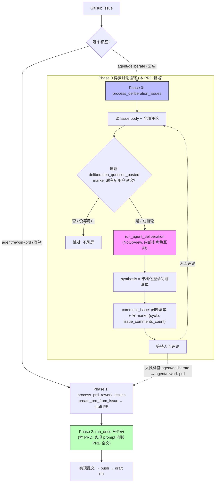

# PRD: deliberate 异步讨论接管复杂 Issue + 实现阶段上下文内联

## 1. Introduction & Goals

### Problem Statement

当前复杂需求的 PRD 生成走 `agent/rework-prd` 全自动管道(`process_prd_rework_issues` → `create_prd_from_issue`):一次性读 Issue body + 评论,直接生成/重写 PRD 并落 draft PR,**没有人在环路里澄清**。实践中对"需求模糊、需要来回讨论才能定清楚"的复杂 Issue,这种单向一次性生成质量不足——信息不够也会硬写。

用户希望按需求复杂度分流:

- **简单需求**继续走 `agent/rework-prd` 全自动(不改)。
- **复杂需求**由 `iar deliberate` 的多智能体能力,通过 **GitHub Issue 评论区异步多轮讨论**接管:AI 读 Issue → 提澄清问题 → 人异步回评论 → 下一轮继续,信息充分后由人手动换标签交回 `rework-prd` 落地。

附带一个横切痛点:`rework-prd`(产 PRD)与 `run_once`(写代码)是**两次独立 agent 调用**,写代码阶段(`run_agent_until_committed`)冷启动,实现 prompt 里 `_build_prd_line` **只给一行"去读 PRD 文件"的指针**(`agent_runner_feedback.py` 的 `_build_prd_line`),丢失了 PRD/讨论积累的上下文。用户希望写代码阶段**带着 PRD 全文上下文**继续。

> 现状澄清(代码核实):PRD **已经是"产出即 commit+push draft PR"**(`create_prd_from_issue.py` 的 `_commit_and_publish_prd` 在更新 Issue body/labels 之前就发布),并非"等代码全写完才 push"。因此本 PRD 不改提交时机,只补"实现阶段上下文内联"这一缺口。

### Proposed Solution Summary

**核心机制:在 daemon 轮询循环新增 Phase 0(排在现有 PRD rework Phase 1 之前),用 GitHub Issue 评论区作为异步对话媒介,复用现有多智能体合议引擎做"内部互辩 → 综合澄清问题清单",用现有 `iar:event` 评论 marker 驱动"轮到谁"的状态机。**

- **谁供给输入**:人创建 Issue 时打 `agent/deliberate` 标签显式声明"这是需要讨论的复杂需求"(系统不自动分诊);讨论中人通过回评论提供澄清;收敛由人手动把 `agent/deliberate` 换成 `agent/rework-prd`。
- **插入的扩展点**:`run_agent_daemon` 与 `run_agent_repositories_once` 的轮询循环新增 `process_deliberation_issues`(Phase 0);它复用 `run_agent_deliberation`(`output_view=None` 走 `NoOpOutputView`,纯后台无 TTY live view)做内部多角色互辩,并把 synthesis 从"5 段报告"参数化为"结构化澄清问题清单"。
- **系统状态变化**:带 `agent/deliberate` 的 Issue 会被 AI 周期性追加"澄清问题清单"评论(每条带隐藏 `deliberation_question_posted` marker);人回评论后下一轮 AI 续问;`agent/deliberate` 一直保留直到人手动换标签。
- **横切改动**:`agent_runner_feedback.py` 的实现/恢复/续作 prompt 把"PRD 路径指针"升级为"内联 PRD 全文(带长度上限)",让写代码阶段直接拿到完整规范。
- **有意避免的复杂度**:不新增持久化表;不新增独立对话引擎(复用 `run_agent_deliberation`);不自动判定收敛(人换标签);不改 `rework-prd` 主流程、PRD 发布时机、daemon 崩溃恢复/checkpoint 续作模型;不新增专用 `IGitHubClient` 列举方法(复用 `list_issues_by_label`);不新增 deliberate 讨论的"上下文文件"(讨论结论已经经由 Issue 评论流入 `create_prd_from_issue` 的 `build_prd_context`,再沉淀进 PRD 全文)。

### Measurable Objectives

- 给一个带 `agent/deliberate` 标签、尚无 AI 提问的开放 Issue,一次 `iar run --once` 后:Issue 上新增一条结构化"澄清问题清单"评论,且该评论含隐藏 `deliberation_question_posted` marker。
- 当最新 `deliberation_question_posted` marker 之后**没有**新的用户评论时,再次 `iar run --once` **不**追加新评论(不刷屏)。
- 当用户回了评论后,下一次 `iar run --once` 追加新一轮问题清单(marker 的 `cycle` 递增)。
- 人把标签从 `agent/deliberate` 换成 `agent/rework-prd` 后,现有 Phase 1 正常生成 PRD,Phase 0 不再处理该 Issue。
- `run_once`/`daemon` 在未注入 deliberation 依赖(transcript runner factory)时,Phase 0 安全跳过,现有行为零回归。
- 实现阶段 prompt(`build_prompt` execution 模板)内联了 PRD 文件正文(在长度上限内),而不再只有一行路径指针。
- `just test` 全绿,`uv run mkdocs build --strict` 通过,`docs/guides/agent-runner.md` 同步更新。

### Realistic Validation

除单元测试和集成测试外，本 PRD 要求通过**真实项目入口点**验证关键行为，确保真实使用路径生效，而非仅在隔离 fixture 中通过。

- [ ] **Phase 0 提问真实验证**：通过 `uv run pytest tests/test_agent_runner_cli.py -k "deliberation" -q`，以真实 `backend.api.cli.main(["run", "--once", ...])` 入口 + fake `IGitHubClient`/fake transcript runner，验证带 `agent/deliberate` 的 Issue 被追加问题清单评论且写入 `deliberation_question_posted` marker。
- [ ] **轮次状态机真实验证**：通过 `uv run pytest tests/test_agent_runner_deliberation_issues.py -q`，验证"AI 已问且用户未答 → 跳过"与"用户已答 → 续问"两条路径。
- [ ] **实现 prompt 内联 PRD 真实验证**：通过 `uv run pytest tests/test_run_agent.py -k "prompt_inlines_prd" -q`，验证 `build_prompt` 输出包含 worktree 内 PRD 文件正文。
- [ ] **无回归真实验证**：通过 `just test` 确认现有 daemon/run-once/deliberation/CLI 测试全部通过。

**为什么单元测试不够**：Phase 0 的价值在于"真实 CLI 轮询入口如何按 marker 状态决定提问/跳过、如何把合议输出落成 Issue 评论"，必须经 `iar run --once` 入口 + 真实 marker 解析/格式化往返验证；孤立的纯函数单测无法证明轮询编排、标签队列与评论 marker 状态机在真实入口闭环。

### Delivery Dependencies

- Group: deliberate-async-discussion
- Depends on groups:
  - agent-runner-deliberation
- Depends on tasks/issues:
  - `tasks/pending/P1-BUG-20260622-162748-deliberation-agent-failure-resilience.md`
- Gate type: soft
- Notes: 复用的 `run_agent_deliberation` 当前因 `transcript_runner.py` 给 `kimi` 传不支持的 `--quiet`、且任一 agent 失败即整体崩(见 resilience PRD)而实际跑不通。本 PRD 与 resilience PRD 是 **soft** 关系:resilience 落地后内部互辩才稳健;在其落地前,运维需把 `[agent_runner.deliberation.profiles.skeptic].agent` 从 `kimi` 临时改为可用模型(如 `claude`)才能让 Phase 0 互辩通过。与 `tasks/pending/P1-FEAT-20260622-152049-iar-repl-interactive-entry.md`(TTY 实时 REPL 讨论)是**互补的不同入口**(一个终端实时、一个 Issue 异步),无依赖。与 `tasks/pending/P1-FEAT-20260622-174745-agent-runner-issue-context-logs.md` 同改 `run_agent_once.py` 文件族但函数不同(它改 `run_agent` 日志锚点,本 PRD 改 `agent_runner_feedback.py` 的 prompt 构造),soft 协调,无逻辑冲突。

## 2. Requirement Shape

### Actor

- 维护 Issue 队列的开发者:创建复杂 Issue 时打 `agent/deliberate`,异步回评论参与讨论,讨论清楚后换标签。
- 常驻 `iar daemon` / 周期 `iar run`:作为"陪聊方"自动提问。

### Trigger

- daemon 轮询或 `iar run --once` 执行到 Phase 0,且存在带 `agent/deliberate` 标签的开放 Issue。

### Expected Behavior

1. Phase 0 列出带 `agent/deliberate` 的开放 Issue(节流 `max_deliberation_issues`,默认 1)。
2. 对每个 Issue,解析评论中最新 `deliberation_question_posted` marker:
   - 无该 marker → 首轮,轮到 AI。
   - 有该 marker 且当前评论总数 > marker 记录的 `issue_comments_count` → 有用户新回复,轮到 AI。
   - 有该 marker 且评论数未增加 → 仍在等用户,**跳过**(不追加评论)。
3. 轮到 AI:组装"Issue body + 完整评论历史"为合议输入,复用 `run_agent_deliberation`(无 TTY view)跑多角色互辩,synthesis 产出结构化"澄清问题清单"(范围边界/约束/验收标准/技术选型/风险五类),把清单贴成 Issue 评论,评论尾部追加 `deliberation_question_posted` marker(`cycle` 递增,`issue_comments_count` 记录贴完后的评论总数)。
4. 连续 `stale_rounds_before_hint` 轮无新增有效信息时,问题清单评论附带"讨论接近完成,可将标签改为 `agent/rework-prd` 落地"的软提示。
5. 人把 `agent/deliberate` 换成 `agent/rework-prd` → 现有 Phase 1 接管,把 Issue body + 完整讨论评论生成为 PRD。
6. 写代码阶段(现有 Phase 2)实现 prompt 内联 PRD 全文(长度上限内),带着完整规范实现。

### Explicit Scope Boundary

- 只做 Issue 评论区**异步**讨论;不做 TTY 实时对话(那是 iar-repl PRD)。
- 收敛与落地的触发是**人换标签**;AI 不自动产 PRD、不自动改标签。
- 互辩 agent 全程 read-only(沿用现有 `_READ_ONLY_RULES`);唯一对外写操作是编排层 `github_client.comment_issue` 贴评论与读取评论。
- 不改 `create_prd_from_issue`、PRD 发布时机、daemon 恢复/checkpoint 机制。
- 不在本 PRD 修复 `kimi --quiet` 或合议失败隔离(归属 resilience PRD)。

## 3. Repository Context And Architecture Fit

### Current Relevant Modules/Files

| 文件 | 作用 | 与本次改动关系 |
|---|---|---|
| `src/backend/core/use_cases/run_agent_daemon.py` | daemon 轮询循环:Phase 1 rework → Phase 2 run_once | 在 Phase 1 前插入 Phase 0 `process_deliberation_issues` |
| `src/backend/core/use_cases/run_agent_repositories_once.py` | 单次轮询(CLI `iar run`):同样 Phase 1 → Phase 2 | 同步插入 Phase 0,保持 daemon/once 一致 |
| `src/backend/core/use_cases/agent_runner_orchestrate.py` | `process_prd_rework_issues`(Phase 1 范本)、`run_once` | 作为 Phase 0 编排范本参照;`_has_rework_intent` 是 marker 状态机范本 |
| `src/backend/core/use_cases/run_agent_deliberation.py` | 多智能体合议引擎(`run_agent_deliberation`、`_build_synthesis_prompt`) | 复用;`run_agent_deliberation` 增加可选 synthesis prompt 注入参数 |
| `src/backend/core/use_cases/agent_runner_events.py` | `iar:event` 评论 marker 格式化/解析三件套 | 复用 `format_event_marker`/`parse_latest_event_marker_for_phases`;新增 deliberation phase 常量 |
| `src/backend/core/use_cases/agent_runner_feedback.py` | `build_prompt`/`build_recovery_prompt`/`build_progress_continuation_prompt`、`_build_prd_line` | 横切改动:PRD 路径指针 → 内联 PRD 全文 |
| `src/backend/core/shared/models/agent_runner.py` | `LabelConfig`(队列状态标签) | 新增 `deliberate = "agent/deliberate"` |
| `src/backend/core/shared/models/agent_deliberation.py` | 合议纯数据模型 | 不改(synthesis 参数化通过函数入参,不入模型) |
| `src/backend/core/shared/interfaces/agent_runner.py` | `IGitHubClient`、`IAgentTranscriptRunner`、`IProcessRunner` 端口 | 复用 `list_issues_by_label`/`list_issue_comments`/`comment_issue`;注入 `IAgentTranscriptRunner` |
| `src/backend/engines/agent_runner/transcript_runner.py` | 合议 agent 命令构建与执行(`create_transcript_runner`) | 由 API 层注入工厂;本 PRD 不改其内部(kimi bug 归 resilience) |
| `src/backend/api/cli.py` / `cli_typer.py` | `run`/`daemon` 装配与分发 | 装配 transcript runner factory 注入 run-once/daemon |
| `src/backend/infrastructure/config/settings.py` | pydantic-settings 配置模型 | labels 新增 `deliberate`;`AgentRunnerDeliberationSettings` 新增问题清单/软提示字段;daemon 段新增 `max_deliberation_issues` |
| `config.toml` | 全局默认配置 | `[agent_runner.labels]` 加 `deliberate`;`[agent_runner.deliberation]`/`[agent_runner.daemon]` 加新字段 |
| `docs/guides/agent-runner.md` | Agent Runner 指南 | 新增 deliberate 异步讨论流程与实现上下文内联说明 |

### Existing Architecture Pattern To Follow

- 四层依赖方向:`api/ → core/ → engines/ → infrastructure/`。`core/use_cases/` 只依赖 `core/shared/interfaces/` 端口,**不导入** `engines`/`infrastructure`。
- Phase 编排范本:`process_prd_rework_issues`(core use case,接受注入的 `github_client`/`process_runner`/`content_generator`,内部对每个 Issue try/except 隔离,失败打 `failed` 标签 + 评论)。
- marker 范本:`iar:event` 隐藏 HTML 注释,`format_event_marker(phase=..., cycle=..., issue_comments_count=...)` 写、`parse_latest_event_marker_for_phases(comments, {phase})` 读;"未消费"语义见 `parse_latest_pending_rework_marker`(completion phase 消费 request phase)。
- 合议引擎已支持无 TTY 后台运行:`run_agent_deliberation(output_view=None)` 自动使用 `NoOpOutputView`。
- 文本 I/O 显式 `encoding="utf-8"`;单文件非空行 ≤ 1000。

### Ownership And Dependency Boundaries

- `core/use_cases/agent_runner_deliberation_issues.py`(新建)拥有"Phase 0 编排 + 轮到谁状态机 + 问题清单 synthesis prompt"。
- `core/use_cases/run_agent_deliberation.py` 拥有合议轮次生命周期;synthesis prompt 由调用方注入(默认仍是报告模式)。
- `core/shared/interfaces/` 拥有端口契约;transcript runner 具体实现属 `engines`,由 `api` 装配注入。
- `agent_runner_feedback.py` 拥有"实现/恢复/续作 prompt 如何呈现 PRD 上下文"。

### Constraints From Runtime, Docs, Tests, Workflows

- `just test` 必须全绿;新增公共 API 用 Google Style Docstrings;文本 I/O 显式 utf-8。
- 不破坏现有 `iar deliberate` CLI 命令(synthesis 参数默认报告模式,行为不变)。
- 向后兼容:未注入 transcript runner factory 时 Phase 0 跳过;`build_prompt` 内联在 PRD 缺失时回退到现有指针文案。
- 文档同步 `docs/guides/agent-runner.md`;如新增导航项更新 `mkdocs.yml`。

### Matching Or Related PRDs

- `tasks/pending/P1-BUG-20260622-162748-deliberation-agent-failure-resilience.md`:**soft 依赖**。修复 `kimi --quiet` 与合议单 agent 失败隔离;落地后本 PRD 复用的内部互辩才稳健。本 PRD 不与其重复(不碰失败隔离逻辑)。
- `tasks/pending/P1-FEAT-20260622-152049-iar-repl-interactive-entry.md`:**互补**。它做 `iar` 无参数的 TTY 实时 REPL 讨论;本 PRD 做 Issue 评论异步讨论。两者是不同媒介的两个入口,不重复、无依赖。
- `tasks/pending/P1-FEAT-20260622-174745-agent-runner-issue-context-logs.md`:**soft 协调**。它给 `run_agent`/`run_agent_with_prompt` 加 Issue URL 日志锚点;本 PRD 改 `agent_runner_feedback.py` 的 prompt 内容。同文件族不同函数,实现时按 Executor Drift Guard 搜索确认无串改。
- `tasks/archive/P2-FEAT-20260527-190923-prd-from-issue.md` 与 `tasks/archive/P1-FEAT-20260618-000726-rework-prd-worktree-pr-and-skill-source.md`:已完成的 rework-prd 管道基础,本 PRD 的"收敛后落地"直接复用,不改动。
- `tasks/archive/20260522-101500-prd-multi-agent-debate.md` 与 `tasks/archive/20260524-005848-prd-deliberation-live-agent-output.md`:deliberation 引擎与 streaming 输出的原始设计,本 PRD 复用其引擎。

未发现做"Issue 评论异步 deliberate 讨论"的重复 PRD;本 PRD 是新功能。

## 4. Recommendation

### Recommended Approach

**新增一个 core use case `process_deliberation_issues` 作为 daemon/run-once 的 Phase 0,复用 `run_agent_deliberation`(无 TTY view)做内部互辩、复用 `iar:event` marker 做异步状态机、复用 `list_issues_by_label` 列队列、复用 `comment_issue` 落问题清单;收敛由人换标签接入现有 `rework-prd`。横切改动在 `agent_runner_feedback.py` 把实现 prompt 的 PRD 指针升级为内联全文。**

要点:

1. **状态机用现成 marker,不新增存储**:`format_event_marker`/`parse_latest_event_marker_for_phases` 加一个 `deliberation_question_posted` phase;用 marker 已有的 `cycle`(轮次)与 `issue_comments_count`(写 marker 时的评论总数)判断"轮到谁",无需任何数据库或外部状态。
2. **合议引擎参数化而非另起炉灶**:`run_agent_deliberation` 增加可选 `synthesis_prompt_builder: Callable[[DeliberationRequest, str], str] | None`,默认 `None` 时用现有 `_build_synthesis_prompt`(报告模式,`iar deliberate` 行为不变);Phase 0 传入"问题清单"builder。`output_view=None` 复用现有 `NoOpOutputView` 后台路径。
3. **依赖注入遵守四层架构**:`run_agent_deliberation` 已接受 `IAgentTranscriptRunner`(接口)。`run_agent_daemon`/`run_agent_repositories_once` 新增可选 `transcript_runner_factory: Callable[[Path], IAgentTranscriptRunner] | None`,由 `api/cli.py` 用 `engines` 的 `create_transcript_runner` 装配注入;未注入则 Phase 0 跳过(向后兼容)。
4. **复用列举端口**:用现有 `list_issues_by_label(config.labels.deliberate, limit=..., state="open")`(`interactive_decision._build_issue_summary` 已有先例),不新增 `IGitHubClient.list_deliberate_issues`,零接口扩散。
5. **收敛即换标签**:无收敛判定代码;人把 `agent/deliberate` 换 `agent/rework-prd` 即接入现有 Phase 1,讨论评论自然成为 `build_prd_context` 输入。
6. **上下文内联最小实现**:`agent_runner_feedback.py` 抽一个 `_build_prd_context_block(issue, worktree_path, *, max_chars)`,读 worktree 内 PRD 文件正文内联(超限尾部截断 + 提示读完整文件),`build_prompt`/`build_recovery_prompt`/`build_progress_continuation_prompt` 共用;PRD 缺失时回退现有指针文案。

### Why This Is The Best Fit

- 异步对话的"状态在哪"难题被现成 `iar:event` marker + 标签队列完整解决,零新增持久化。
- 复用合议引擎与 NoOp 后台路径,避免造第二套多 agent 编排;`iar deliberate` 行为通过默认参数保持不变。
- 人换标签的收敛点让 `deliberate`(陪聊)与 `rework-prd`(落地)边界清晰、零职责重叠,正是按复杂度分流的目标。
- 上下文内联落在已持有 `issue` 与 `worktree_path` 的 `build_prompt`,不需要新建 context 文件或新状态。

### Alternatives Considered

| 方案 | 说明 | 未采纳原因 |
|---|---|---|
| A. 新建独立异步对话引擎 | 不复用 `run_agent_deliberation`,自写多 agent 编排 | 与现有合议引擎职责重复,违反复用原则;synthesis/transcript/并发能力已存在 |
| B. AI 自动判定收敛并产 PRD | Phase 0 自评信息够了就自动改标签/产 PRD | 与"复杂需求要人把关"的初衷冲突;易过早落地;人换标签更可控且零判定代码 |
| C. 新增 `IGitHubClient.list_deliberate_issues` 专用方法 | 仿 `list_rework_prd_issues` | 接口扩散;`list_issues_by_label` 已能按标签列开放 Issue,有现成先例 |
| D. deliberate 收敛时另写"上下文文件"喂给写代码 agent | 把讨论原始记录落盘单独传递 | 讨论结论已经过 Issue 评论 → `build_prd_context` → PRD 全文沉淀,再加 context 文件信息冗余且撑爆 prompt;内联 PRD 全文已覆盖 |
| E. TTY 实时讨论 | 终端多轮实时对话 | 已由 `iar-repl-interactive-entry` PRD 覆盖;用户为常驻 daemon 场景明确选择 Issue 异步 |

## 5. Implementation Guide

> This section is a living implementation guide based on current repository analysis. If implementation discovers additional affected files, hidden dependencies, edge cases, or a better path, update this PRD before proceeding.

### Core Logic

**数据与控制流(功能 A:Phase 0 异步讨论):**

```text
iar run --once / iar daemon 轮询
└── run_agent_repositories_once / run_agent_daemon
    ├── Phase 0(新增): process_deliberation_issues(注入 transcript_runner)
    │   ├── issues = github_client.list_issues_by_label(labels.deliberate, limit=max_deliberation_issues, state="open")
    │   ├── 若 transcript_runner 未注入 → log 并跳过 Phase 0(向后兼容)
    │   └── for issue in issues:  (每个 try/except 隔离,失败打 labels.failed + 评论)
    │       ├── comments = github_client.list_issue_comments(issue.number)
    │       ├── marker = parse_latest_event_marker_for_phases(comments, {"deliberation_question_posted"})
    │       ├── 轮到谁:
    │       │     - marker is None → 首轮,继续
    │       │     - len(comments) > marker.issue_comments_count → 有用户新回复,继续
    │       │     - 否则 → 仍等用户,continue(跳过,不刷屏)
    │       ├── prompt = _build_deliberation_issue_prompt(issue, comments)  # Issue body + 完整评论历史
    │       ├── request = DeliberationRequest(prompt=prompt, agents=..., rounds=..., synthesizer=..., output_dir=临时会话目录, session_id=...)
    │       ├── result = run_agent_deliberation(request, config=deliberation_config,
    │       │             transcript_runner=transcript_runner, event_sink=收集器,
    │       │             target_repo_path=repo_path, output_view=None,
    │       │             synthesis_prompt_builder=_build_question_list_synthesis_prompt)
    │       ├── cycle = (marker.cycle + 1) if marker else 1
    │       ├── stale = 连续 N 轮无新增信息? → 追加软提示文案
    │       ├── github_client.comment_issue(issue.number, 问题清单正文 + 软提示 + marker_html)
    │       │     其中 marker_html = format_event_marker(phase="deliberation_question_posted",
    │       │             cycle=cycle, issue_comments_count=len(comments)+1)
    │       └── (不改标签;等待人回评论或换标签)
    ├── Phase 1(现有): process_prd_rework_issues   # 人换标签后在此落地 PRD
    └── Phase 2(现有): run_once                     # 写代码(受功能 B 上下文内联增强)
```

- `_build_question_list_synthesis_prompt(request, transcript)`:取代报告 synthesis,指示 synthesizer 基于互辩 transcript 产出**结构化澄清问题清单**,固定五类小标题:`## 范围边界` / `## 约束` / `## 验收标准` / `## 技术选型` / `## 风险`,每类下列具体问题;并在末尾用一句话说明"回复本评论补充信息,或将标签改为 `agent/rework-prd` 进入 PRD 生成"。
- `issue_comments_count` 语义:写 marker 时该 Issue 的评论总数(含即将贴出的这条 → `len(comments)+1`);下轮 `len(current_comments) > marker.issue_comments_count` 即"有人回复过"。
- stale 判定:可基于 `cycle` 达到 `stale_rounds_before_hint` 且最近一轮用户回复为空/极短的启发式;首版可简单实现为"cycle ≥ 阈值即附带软提示",在 Risks 标注可迭代。
- 临时会话 output_dir:复用 `DeliberationConfig.default_output_dir` 下按 `issue-<N>-<session>` 建子目录;Phase 0 不依赖该目录产物落 Issue,仅作合议引擎内部 workspace。

**数据与控制流(功能 B:实现 prompt 内联 PRD 全文):**

```text
run_once → _process_ready_issue → run_agent_until_committed → build_prompt(issue, worktree_path, config.prompts)
    └── _build_prd_context_block(issue, worktree_path, max_chars=config 上限)
        ├── prd_path = extract_prd_path(issue.body)
        ├── prd_file = worktree_path / prd_path
        ├── 若存在 → 读取正文,超过 max_chars 尾部截断 + "完整 PRD 见 `<path>`" 提示;附带现有"更新 checklist/归档"指令
        └── 若缺失 → 回退现有指针文案("If the Issue references a PRD, read it ...")
```

- `build_prompt` 当前用 `_build_prd_line(issue)`(仅 `issue`,无法读文件)。新增 `_build_prd_context_block` 接受 `worktree_path` 以读取 PRD 文件;`build_prompt` 已有 `worktree_path` 参数,直接传入。
- `build_recovery_prompt`/`build_progress_continuation_prompt` 已各自接收 `worktree_path`,改为共用 `_build_prd_context_block`,消除三处重复的 prd_line 构造。

### Change Impact Tree

```text
.
├── Domain (core/shared/models)
│   └── src/backend/core/shared/models/agent_runner.py
│       [修改]
│       【总结】LabelConfig 新增 deliberate 队列状态标签
│       └── deliberate: str = "agent/deliberate"
│
├── Domain (core/use_cases)
│   ├── src/backend/core/use_cases/agent_runner_deliberation_issues.py
│   │   [新增]
│   │   【总结】Phase 0 编排:列队列、marker 状态机、组装合议输入、问题清单 synthesis、落评论+写 marker
│   │   ├── process_deliberation_issues(repo_path, config, github_client, process_runner, transcript_runner, ...)
│   │   ├── _build_deliberation_issue_prompt(issue, comments)
│   │   ├── _build_question_list_synthesis_prompt(request, transcript)
│   │   └── _resolve_turn(comments, marker) -> 是否轮到 AI
│   │
│   ├── src/backend/core/use_cases/run_agent_deliberation.py
│   │   [修改]
│   │   【总结】synthesis prompt 可注入,默认仍是报告模式,不破坏 iar deliberate
│   │   └── run_agent_deliberation(..., synthesis_prompt_builder: Callable | None = None)
│   │
│   ├── src/backend/core/use_cases/agent_runner_events.py
│   │   [修改]
│   │   【总结】新增 deliberation 提问 phase 常量,供格式化/解析复用
│   │   └── DELIBERATION_QUESTION_PHASE = "deliberation_question_posted"
│   │
│   ├── src/backend/core/use_cases/agent_runner_feedback.py
│   │   [修改]
│   │   【总结】PRD 路径指针升级为内联 PRD 全文(带长度上限),实现/恢复/续作三处共用
│   │   ├── _build_prd_context_block(issue, worktree_path, *, max_chars)
│   │   ├── build_prompt 改用 _build_prd_context_block
│   │   ├── build_recovery_prompt 改用 _build_prd_context_block
│   │   └── build_progress_continuation_prompt 改用 _build_prd_context_block
│   │
│   ├── src/backend/core/use_cases/run_agent_daemon.py
│   │   [修改]
│   │   【总结】轮询循环在 Phase 1 前插入 Phase 0;新增 transcript_runner_factory 注入
│   │   ├── 形参新增 transcript_runner_factory: Callable[[Path], IAgentTranscriptRunner] | None
│   │   └── Phase 0: process_deliberation_issues(...)（try/except 隔离）
│   │
│   └── src/backend/core/use_cases/run_agent_repositories_once.py
│       [修改]
│       【总结】单次轮询同步插入 Phase 0,保持 daemon/once 行为一致
│       ├── 形参新增 transcript_runner_factory 与 max_deliberation_issues
│       └── Phase 0: process_deliberation_issues(...)（try/except 隔离）
│
├── API
│   ├── src/backend/api/cli.py
│   │   [修改]
│   │   【总结】run/daemon 分支装配 transcript_runner_factory（复用 create_transcript_runner）并下传
│   │
│   └── src/backend/api/cli_typer.py
│       [修改/确认]
│       【总结】确认 run/daemon Typer 入口透传新参数（如经由 _run_typer_command 默认装配则无需改）
│
├── Infrastructure
│   ├── src/backend/infrastructure/config/settings.py
│   │   [修改]
│   │   【总结】labels 配置新增 deliberate；deliberation 设置新增问题清单/软提示字段；daemon 段新增 max_deliberation_issues
│   │   ├── labels 模型新增 deliberate（搜索现有 rework_prd 字段所在模型）
│   │   ├── AgentRunnerDeliberationSettings 新增 stale_rounds_before_hint（默认 3）
│   │   └── daemon 设置新增 max_deliberation_issues（默认 1）
│   │
│   └── config.toml
│       [修改]
│       【总结】落地上述默认值
│       ├── [agent_runner.labels] 增 deliberate = "agent/deliberate"
│       ├── [agent_runner.deliberation] 增 stale_rounds_before_hint
│       └── [agent_runner.daemon] 增 max_deliberation_issues
│
├── Tests
│   ├── tests/test_agent_runner_deliberation_issues.py
│   │   [新增]
│   │   【总结】Phase 0 状态机:首轮提问、等待跳过、用户回复后续问、失败隔离
│   │
│   ├── tests/test_run_agent_deliberation.py
│   │   [修改]
│   │   【总结】synthesis_prompt_builder 注入路径与默认报告模式向后兼容
│   │
│   ├── tests/test_run_agent.py
│   │   [修改]
│   │   【总结】build_prompt/recovery/continuation 内联 PRD 全文与缺失回退断言
│   │
│   └── tests/test_agent_runner_cli.py
│       [修改]
│       【总结】iar run --once 真实入口触发 Phase 0 贴问题评论 + 写 marker
│
└── Docs
    └── docs/guides/agent-runner.md
        [修改]
        【总结】新增 deliberate 异步讨论流程、标签流转、实现 prompt 上下文内联说明
```

### Executor Drift Guard

- 确认 labels 配置模型位置(`rework_prd` 同模型加 `deliberate`):`rg -n "rework_prd" src/backend/infrastructure/config/settings.py src/backend/core/shared/models/agent_runner.py`
- 确认 daemon/run-once 调用链与现有参数:`rg -n "process_prd_rework_issues|run_agent_daemon|run_agent_repositories_once|max_prd_issues" src/backend/core/use_cases/ src/backend/api/`
- 确认 transcript runner 工厂:`rg -n "create_transcript_runner|IAgentTranscriptRunner" src/backend/engines/agent_runner/transcript_runner.py src/backend/core/shared/interfaces/agent_runner.py src/backend/api/cli.py`
- 确认 marker 三件套签名:`rg -n "def format_event_marker|def parse_latest_event_marker_for_phases|issue_comments_count" src/backend/core/use_cases/agent_runner_events.py`
- 确认列举/评论端口:`rg -n "def list_issues_by_label|def list_issue_comments|def comment_issue" src/backend/core/shared/interfaces/agent_runner.py src/backend/infrastructure/github_client.py`
- 确认 synthesis 注入点不破坏 CLI:`rg -n "run_agent_deliberation\(|_build_synthesis_prompt" src/backend/core src/backend/api`
- 确认与 issue-context-logs 改动不串(它改 run_agent/run_agent_with_prompt 签名,本 PRD 改 agent_runner_feedback):`rg -n "def run_agent_with_prompt|def build_prompt|_build_prd_line" src/backend/core/use_cases/run_agent_once.py src/backend/core/use_cases/agent_runner_feedback.py`
- 列出的文件是起点,非穷尽;若发现其他 `run_agent_deliberation(` 调用方或 `build_prompt(` 调用方,需同步评估。

### Flow / Architecture Diagram



### Realistic Validation Plan

| Behavior | Real Entry Point | Test Layer | Mock Boundary | Data/Env Needed | Command Or Procedure | Required For Acceptance |
|---|---|---|---|---|---|---|
| 首轮提问:deliberate Issue 被贴问题清单 + marker | `backend.api.cli.main(["run", "--once", ...])` | CLI integration | fake `IGitHubClient`(返回带 `agent/deliberate` 的 Issue、空评论)+ fake `IAgentTranscriptRunner`(返回 fake 互辩/问题输出) | 临时 Git 仓库 + `.iar.toml` | `uv run pytest tests/test_agent_runner_cli.py -k "deliberation_first_round" -q` | Yes |
| 等待跳过:AI 已问、用户未答 → 不追加评论 | `process_deliberation_issues` | unit/integration | fake github 评论序列(末条为 AI marker 评论) | 无 | `uv run pytest tests/test_agent_runner_deliberation_issues.py -k "waiting_skips" -q` | Yes |
| 续问:用户回评论后 → 追加新一轮(cycle 递增) | `process_deliberation_issues` | unit/integration | fake github(marker 后新增用户评论) | 无 | `uv run pytest tests/test_agent_runner_deliberation_issues.py -k "user_reply_continues" -q` | Yes |
| synthesis 默认报告模式不变(iar deliberate 回归) | `backend.api.cli.main(["deliberate", ...])` | integration | fake transcript runner | 临时仓库 | `uv run pytest tests/test_run_agent_deliberation.py -q` | Yes |
| 实现 prompt 内联 PRD 全文 | `backend.core.use_cases.agent_runner_feedback.build_prompt` | unit | none | worktree 内含 PRD 文件 + Issue body 带 `PRD path:` | `uv run pytest tests/test_run_agent.py -k "prompt_inlines_prd" -q` | Yes |
| 未注入 transcript factory → Phase 0 跳过(零回归) | `backend.api.cli.main(["run", "--once", ...])` | CLI integration | fake github(有 deliberate Issue),不注入 transcript factory | 临时仓库 | `uv run pytest tests/test_agent_runner_cli.py -k "deliberation_skipped_without_runner" -q` | Yes |
| 全量无回归 | `just test` | full suite | none | 开发环境 | `just test` | Yes |
| 文档构建 | `mkdocs` | docs | none | mkdocs | `uv run mkdocs build --strict` | Yes |
| (opt-in)真机互辩 | `uv run iar run --once` 对真实 deliberate Issue | manual/sandbox | 真实 `claude`/`codex`;`skeptic` 临时改非 kimi 或待 resilience 落地 | 真实仓库 + GitHub 凭证 + 可用 agent CLI | `uv run iar run --once --repo <repo>`(需 resilience PRD 或临时改 skeptic profile) | No |

**高摩擦验证排错说明**:
- Phase 0 不提问:检查 Issue 是否真带 `config.labels.deliberate`、`list_issues_by_label` 的 `state="open"` 过滤、transcript factory 是否注入。
- 重复刷屏:检查 `format_event_marker` 是否写入 `issue_comments_count`,以及 `_resolve_turn` 的比较是否用"当前评论数 > marker 记录数"。
- 真机互辩失败:大概率是 `kimi --quiet`(见 resilience PRD)或 skeptic profile 不可用——临时把 `[agent_runner.deliberation.profiles.skeptic].agent` 改为 `claude`。
- 实现 prompt 未内联:检查 `build_prompt` 是否把 `worktree_path` 传入 `_build_prd_context_block`、`extract_prd_path` 是否命中 Issue body 的 `PRD path:` 锚点。

### Low-Fidelity Prototype

deliberate Issue 上一轮 AI 评论示意(尾部 marker 为 HTML 注释,对用户不可见):

```markdown
### 澄清问题(第 1 轮)

**范围边界**
- 该功能是否需要支持批量导入,还是仅单条?

**约束**
- 是否有响应时延上限?

**验收标准**
- "成功"的可观测信号是什么(返回码/日志/落库)?

**技术选型**
- 复用现有 X 模块,还是新增 Y?

**风险**
- 是否触及鉴权边界?

> 回复本评论补充信息;讨论清楚后,把标签从 `agent/deliberate` 改为 `agent/rework-prd` 即进入 PRD 生成。

<!-- iar:event version=1 phase=deliberation_question_posted cycle=1 issue_comments_count=1 -->
```

### ER Diagram

No data model changes in this PRD. 状态全部承载在 GitHub 标签与 `iar:event` 评论 marker 上,不新增持久化结构。

### Interactive Prototype Change Log

No interactive prototype file changes in this PRD.

### External Validation

No external validation required; repository evidence was sufficient.

## 6. Definition Of Done

- [ ] Phase 0 `process_deliberation_issues` 接入 daemon 与 run-once,排在 PRD rework 之前。
- [ ] `agent/deliberate` 标签存在于 `LabelConfig` 与 `config.toml`,并可被 `.iar.toml` 覆盖链路加载。
- [ ] marker 状态机正确区分"等待用户"与"轮到 AI",等待时不追加评论。
- [ ] 轮到 AI 时复用 `run_agent_deliberation` 内部互辩并以问题清单 synthesis 落评论 + 写 marker。
- [ ] `run_agent_deliberation` 的 `synthesis_prompt_builder` 默认 `None` 时行为与现状一致(`iar deliberate` 回归)。
- [ ] 未注入 transcript runner factory 时 Phase 0 安全跳过,现有 run-once/daemon 零回归。
- [ ] 实现/恢复/续作 prompt 内联 PRD 全文(长度上限内),PRD 缺失时回退指针文案。
- [ ] `just test` 全绿;`uv run mkdocs build --strict` 通过。
- [ ] `docs/guides/agent-runner.md` 同步 deliberate 异步讨论与上下文内联说明。

## 7. Acceptance Checklist

### Architecture Acceptance

- [ ] `src/backend/core/use_cases/agent_runner_deliberation_issues.py` 不导入 `engines`/`infrastructure`/`api`,合议执行经注入的 `IAgentTranscriptRunner` 完成。
- [ ] transcript runner 具体实现仍在 `engines`,由 `api/cli.py` 装配注入;`core` 仅依赖 `IAgentTranscriptRunner` 端口。
- [ ] 复用 `list_issues_by_label`,未新增 `IGitHubClient` 列举方法(`rg -n "list_deliberate_issues" src/backend` 无结果)。
- [ ] `LabelConfig.deliberate` 与现有 `rework_prd` 同模型定义,`config.toml` `[agent_runner.labels]` 含 `deliberate`。

### Dependency Acceptance

- [ ] Section 1 `Delivery Dependencies` 记录对 resilience PRD 的 soft 依赖,且实现说明里给出 kimi 未修时的临时 skeptic profile 替换方案。
- [ ] 与 `iar-repl-interactive-entry`、`agent-runner-issue-context-logs` 的关系在 Section 3 说明,且 `agent_runner_feedback.py` 改动不串改 `run_agent_once.py` 的 `run_agent_with_prompt` 签名(`rg -n "def run_agent_with_prompt" src/backend/core/use_cases/run_agent_once.py` 与预期一致)。

### Behavior Acceptance

- [ ] 带 `agent/deliberate`、无 AI 提问的 Issue,经一次 `iar run --once` 新增一条问题清单评论且含 `deliberation_question_posted` marker。
- [ ] 最新 marker 后无新用户评论时,再次 `iar run --once` 不新增评论。
- [ ] 用户回评论后,下一次轮询追加新一轮问题清单,marker `cycle` 递增、`issue_comments_count` 更新。
- [ ] 问题清单包含范围边界/约束/验收标准/技术选型/风险五类小标题。
- [ ] 连续达到 `stale_rounds_before_hint` 轮时评论附带"可换 `agent/rework-prd` 落地"软提示。
- [ ] 单个 deliberate Issue 处理失败被隔离:打 `labels.failed` + 评论,不影响 Phase 1/Phase 2。
- [ ] `build_prompt` 在 worktree 含 PRD 时,输出包含 PRD 文件正文(上限内);PRD 缺失时输出回退指针文案。

### Documentation Acceptance

- [ ] `docs/guides/agent-runner.md` 新增 deliberate 异步讨论章节(标签流转、轮次、收敛换标签、实现 prompt 内联)。
- [ ] 若新增导航项则 `mkdocs.yml` 同步。

### Validation Acceptance

- [ ] `uv run pytest tests/test_agent_runner_cli.py -k "deliberation" -q` 通过(真实 `iar run --once` 入口触发 Phase 0)。
- [ ] `uv run pytest tests/test_agent_runner_deliberation_issues.py -q` 通过(状态机三路径)。
- [ ] `uv run pytest tests/test_run_agent.py -k "prompt_inlines_prd" -q` 通过(实现 prompt 内联)。
- [ ] `uv run pytest tests/test_run_agent_deliberation.py -q` 通过(synthesis 默认模式回归)。
- [ ] `just test` 全绿;`uv run mkdocs build --strict` 成功。

## 8. Functional Requirements

- **FR-1**:`LabelConfig` 新增 `deliberate = "agent/deliberate"`,并在 `config.toml` `[agent_runner.labels]` 提供默认值。
- **FR-2**:`run_agent_daemon` 与 `run_agent_repositories_once` 在 PRD rework(Phase 1)之前新增 Phase 0 `process_deliberation_issues`。
- **FR-3**:Phase 0 用 `github_client.list_issues_by_label(config.labels.deliberate, limit=max_deliberation_issues, state="open")` 列队列,`max_deliberation_issues` 默认 1。
- **FR-4**:Phase 0 用 `parse_latest_event_marker_for_phases(comments, {"deliberation_question_posted"})` 解析状态;marker 不存在或当前评论数 > `marker.issue_comments_count` 时轮到 AI,否则跳过且不追加评论。
- **FR-5**:轮到 AI 时,以 Issue body + 完整评论历史为输入,复用 `run_agent_deliberation`(`output_view=None`)做多角色内部互辩。
- **FR-6**:`run_agent_deliberation` 新增可选 `synthesis_prompt_builder`,默认 `None` 时沿用现有报告 synthesis;Phase 0 传入"结构化澄清问题清单"builder(范围边界/约束/验收标准/技术选型/风险五类)。
- **FR-7**:Phase 0 把问题清单贴成 Issue 评论,并在评论尾部用 `format_event_marker(phase="deliberation_question_posted", cycle=<递增>, issue_comments_count=<贴后总数>)` 写入隐藏 marker。
- **FR-8**:连续达到 `stale_rounds_before_hint`(默认 3)轮时,问题清单评论附带"可将标签改为 `agent/rework-prd` 落地"的软提示。
- **FR-9**:收敛由人手动把 `agent/deliberate` 换成 `agent/rework-prd` 触发现有 Phase 1;Phase 0 不自动改标签、不自动产 PRD。
- **FR-10**:Phase 0 的合议 agent 全程 read-only;唯一对外写是编排层 `comment_issue`/读取评论。
- **FR-11**:`run_agent_daemon`/`run_agent_repositories_once` 新增可选 `transcript_runner_factory`;由 `api/cli.py` 用 `create_transcript_runner` 注入;未注入时 Phase 0 跳过且不影响 Phase 1/Phase 2。
- **FR-12**:`agent_runner_feedback.py` 的 `build_prompt`/`build_recovery_prompt`/`build_progress_continuation_prompt` 共用 `_build_prd_context_block`,把 PRD 路径指针升级为内联 PRD 全文。
- **FR-13**:内联受可配置长度上限约束,超限尾部截断并提示读完整 PRD 文件路径。
- **FR-14**:内联保留现有"先更新 Acceptance Checklist、完成则把 PRD 从 `tasks/pending/` 移到 `tasks/archive/`"指令;PRD 缺失时回退现有指针文案。

## 9. Non-Goals

- 不做 TTY 实时讨论入口(归 `iar-repl-interactive-entry` PRD)。
- 不让 AI 自动判定收敛、自动产 PRD 或自动改标签。
- 不改 `create_prd_from_issue`、PRD 已先 push 的发布时机、daemon 崩溃恢复/checkpoint 续作模型。
- 不修复 `kimi --quiet` 或合议单 agent 失败隔离(归 resilience PRD)。
- 不新增持久化表、Web UI、外部多 agent 框架。
- 不新增 deliberate 讨论的"上下文文件"(讨论结论经 Issue 评论 → PRD 全文沉淀)。
- 不新增 `IGitHubClient` 专用列举方法。

## 10. Risks And Follow-Ups

| 风险 | 影响 | 缓解 |
|---|---|---|
| `run_agent_deliberation` 当前因 `kimi --quiet` + 无失败隔离而跑不通 | 高 | soft 依赖 resilience PRD;其落地前临时把 `skeptic` profile 的 agent 改为 `claude`;在文档与 Risks 标注 |
| 每个 Phase 0 轮次跑一整次多 agent×多轮合议,开销较大 | 中 | `max_deliberation_issues` 默认 1 节流;互辩 rounds 可经 `[agent_runner.deliberation].default_rounds` 调小 |
| stale(无新进展)判定首版为启发式,可能过早/过晚提示 | 低 | 首版基于 `cycle` 阈值;后续可迭代为"用户回复信息增量"判定,已在此标注为 follow-up |
| `issue_comments_count` 在并发(daemon 与人工同时操作)下可能错位 | 低 | 沿用现有 marker 并发模型;每轮重新拉取评论;比较为"严格大于",最坏情况是多问一轮而非漏问 |
| 内联 PRD 全文可能撑大实现 prompt | 低 | 长度上限 + 尾部截断 + 指向完整文件;上限可配置 |
| 与 `agent-runner-issue-context-logs` 同改 `run_agent_once.py` 文件族 | 低 | 改动函数不同(本 PRD 在 `agent_runner_feedback.py`);Executor Drift Guard 提供搜索确认 |

## 11. Decision Log

| ID | Decision | Chosen | Rejected | Rationale |
|---|---|---|---|---|
| D-01 | 复杂需求讨论的媒介 | GitHub Issue 评论区异步多轮 | TTY 实时 REPL(iar-repl PRD) | 用户为常驻 daemon 场景明确选择异步;与 REPL 是互补入口 |
| D-02 | 异步对话状态如何承载 | 复用 `iar:event` marker 的 `cycle`+`issue_comments_count` | 新增数据库/状态文件 | 现成 marker 已能表达"轮到谁",零新增持久化,与 rework marker 同范式 |
| D-03 | 是否复用合议引擎 | 复用 `run_agent_deliberation` + 可注入 synthesis builder | 新建独立异步对话引擎 | 多 agent 互辩/transcript/NoOp 后台路径已存在;参数化 synthesis 即可,避免重复编排 |
| D-04 | synthesis 产物形态 | 结构化澄清问题清单(五类) | 沿用 5 段报告 / 自由文本 | 问题清单可直接驱动人回评论,结构化比自由文本更易回答;报告模式留给 `iar deliberate` |
| D-05 | 收敛与落地的边界 | 人手动换标签 `deliberate`→`rework-prd` | AI 自动判定收敛并产 PRD | 符合"复杂需求人把关"初衷;零判定代码,职责零重叠 |
| D-06 | 列队列的方式 | 复用 `list_issues_by_label` | 新增 `list_deliberate_issues` 端口 | `interactive_decision` 已有先例;避免 `IGitHubClient` 接口扩散 |
| D-07 | transcript runner 如何到达 core Phase 0 | daemon/once 新增 `transcript_runner_factory`,api 注入,未注入则跳过 | core 直接 import engines 的 `create_transcript_runner` | core 不得依赖 engines;注入保持四层架构且向后兼容 |
| D-08 | 写代码阶段"带上下文"的实现 | `build_prompt` 内联 PRD 全文(带上限) | 新建 deliberate 上下文文件单独传递 | 讨论结论已经 Issue 评论 → `build_prd_context` → PRD 沉淀,内联 PRD 全文即覆盖,额外文件冗余 |
| D-09 | kimi 不可用如何处理 | soft 依赖 resilience PRD + 临时改 skeptic profile | 在本 PRD 直接修 kimi/失败隔离 | resilience PRD 已专门覆盖该 bug,重复修复会分裂验证;soft 依赖避免硬阻塞 |
| D-10 | 功能 A 与功能 B 是否拆成两个 PRD | 合并为一个 PRD,FR/依赖分组清晰 | 拆成两个独立 PRD | 用户作为同一工作流愿景一起认可;功能 B 是"复杂 Issue → 讨论 → PRD → 带上下文写代码"价值链的收尾环 |
