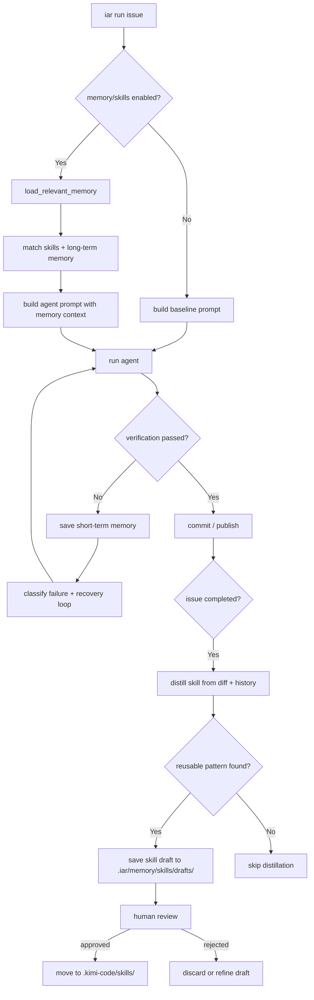

# PRD: Agent Runner Memory Persistence & Skill Distillation

- GitHub Issue: （待创建，关联 runner 跨 Issue 学习与项目知识沉淀）


## 1. Introduction & Goals

### 问题陈述

当前 keda Agent Runner 处理每个 GitHub Issue 时都是**从零开始**：新的 worktree、新的 agent 上下文、新的 prompt，上一轮的成功修复经验、失败教训、项目专属约定都不会被继承。这导致三类可避免的损耗：

1. **重复犯同样错误**：某个 Issue 中 agent 因漏写 `encoding="utf-8"` 导致 pre-commit 失败，下一轮类似 Issue 仍可能再犯。
2. **成功恢复模式丢失**：Recovery Agent 花多轮才定位并修复的复杂问题，其诊断路径和修复模式随 Issue 关闭而被丢弃。
3. **项目约定无法积累**：仓库特有的依赖方向、命名规范、测试命令、禁止项等，无法自动沉淀为 agent 可调用的长期知识。

本 PRD 为 runner 引入**记忆持久化**与**技能蒸馏**能力，让 agent 在后续 Issue 中能够复用历史经验，同时保持人工审查与最小架构增量。

### Proposed Solution Summary

**推荐机制**：在 runner 本地建立两层记忆存储，并在 Issue 成功关闭后自动蒸馏可复用技能草稿。

1. **短期记忆（Short-term Memory）**
   - 以本地文件形式保存在 `.iar/memory/short_term/` 下，按 Issue 与 claim 组织。
   - 记录当前 Issue 的关键上下文：任务摘要、已尝试的修复轮次、最终成功路径、重要中间产物路径。
   - 在单次 runner 执行的 recovery loop 中可读，也用于跨 claim 续作时快速恢复上下文。

2. **长期记忆（Long-term Memory）**
   - 以本地文件形式保存在 `.iar/memory/long_term/` 下，按主题或失败类型组织。
   - 记录已验证的事实、模式、修复方案、项目约定（如“所有文件 I/O 必须显式 encoding="utf-8"”）。
   - 作为后续 Issue 的 prompt 增强来源，按标签、仓库、失败类型匹配。

3. **技能蒸馏（Skill Distillation）**
   - Issue 成功完成后，runner 分析本次 diff、原始 prompt、recovery history 与验证结果。
   - 提取可复用的指令、约束或操作步骤，生成 skill 草稿（markdown + YAML front matter）。
   - 草稿默认写入 `.iar/memory/skills/drafts/`，由人工审查后可晋升为 `.kimi-code/skills/` 或项目级 skills 目录的正式 skill。

4. **Skill 使用**
   - runner 在构建 agent prompt 前，根据 Issue 标题、标签、失败类型、仓库上下文检索相关 skills。
   - 匹配到的 skills 以 system prompt 片段或上下文附件形式注入，提升后续 Issue 的成功率。

**刻意规避的复杂度**：不引入向量数据库或外部服务；不自动发布 skill 而不经过人工审查；不修改外部 agent 二进制或 prompt 协议；不将记忆存储与业务状态持久化耦合。

### 测量目标

1. 在 3 个及以上同类失败（如 `F821` import 错误、lint 逻辑错误）的连续 Issue 中，runner 能在第二次及以后 Issue 自动引用已蒸馏的 skill，减少 recovery 轮次。
2. 蒸馏生成的 skill 草稿格式与现有 `.kimi-code/skills/` 格式一致，可被现有 skill 加载机制识别。
3. 人工审查后的 skill 晋升流程不超过 1 步（移动文件并可选编辑描述）。
4. 记忆存储仅依赖本地文件系统，不引入新进程、新服务或网络依赖。
5. 现有成功路径（无 recovery、无 skill 触发）的性能与稳定性无回归。

### Realistic Validation

除单元测试和集成测试外，本 PRD 要求通过**真实 runner 流程**验证关键行为：

- [ ] **短期记忆真实验证**：通过 `iar run <issue>` 处理一个会触发 recovery 的 Issue，验证 `.iar/memory/short_term/` 下生成了包含 Issue 摘要、尝试轮次、成功修复路径的记忆文件。
- [ ] **技能蒸馏真实验证**：在 Issue 成功关闭后，验证 `.iar/memory/skills/drafts/` 下生成了 skill 草稿，且 front matter 包含 `name`、`description`、`tags`，正文为可执行指令。
- [ ] **Skill 使用真实验证**：构造第二个与第一个失败类型高度相似的 Issue，验证 runner 在构建 agent prompt 时引用了已晋升的 skill，且 recovery 轮次显著减少。
- [ ] **长期记忆沉淀真实验证**：手动或通过 runner 将一条项目约定写入 `.iar/memory/long_term/`，验证后续 Issue 的 prompt 中自动包含该约定。

**为什么单元测试不够**：记忆持久化与 skill 蒸馏涉及真实文件 I/O、prompt 上下文组装、git diff 分析、以及 agent 对 skill 内容的实际响应；这些在单测中会被大量 mock，无法证明真实 runner 流程中的知识复用效果。

### Delivery Dependencies

- Group: agent-runner-memory
- Depends on groups:
  - none
- Depends on tasks/issues:
  - 与 Session Persistence PRD 为软相关（soft）：记忆持久化可从会话持久化中受益，但两者独立可交付。
- Gate type: soft
- Notes: 本 PRD 只修改 runner 内部逻辑与本地文件存储，不依赖外部 IAR 工具发版。


## 2. Requirement Shape

### Actor

- **AI agent**：执行 Issue 任务，可能重复历史错误；在后续 Issue 中读取并遵循已注入的 skills。
- **Agent Runner**：在运行前后管理短期/长期记忆；在 Issue 成功后触发 skill 蒸馏；在构建 prompt 时检索并注入相关 skills。
- **开发者/维护者**：审查并决定是否将 skill 草稿晋升为正式 skill；手动维护项目约定等长期记忆。

### Trigger

1. `iar run <issue>` 启动时，runner 检测到存在相关长期记忆或已晋升 skills。
2. `run_agent_until_committed` 进入 recovery loop 时，runner 写入/更新短期记忆。
3. Issue 成功关闭（commit 并推送/标记完成）后，触发 skill 蒸馏流程。
4. 开发者手动将 `.iar/memory/skills/drafts/` 中的 skill 草稿移动到 `.kimi-code/skills/` 或项目 skills 目录。

### Expected Behavior

1. 每次 runner 启动时，根据 Issue 标签、标题、仓库上下文检索长期记忆与已晋升 skills，并注入 agent prompt。
2. Recovery loop 中，runner 持续更新短期记忆，记录当前失败摘要、尝试方案、验证结果。
3. Issue 成功完成后，runner 分析本次执行轨迹（diff、prompts、recovery history），生成 skill 草稿并保存到草稿目录。
4. Skill 草稿默认处于 **draft** 状态，不自动进入正式 skills 目录；需要人工审查后手动移动/重命名。
5. 长期记忆支持人工编辑，也支持 runner 从高频成功恢复模式中自动提炼追加。

### Explicit Scope Boundary

- 不引入向量数据库、外部搜索服务或嵌入式数据库。
- 不自动将 skill 草稿发布到 `.kimi-code/skills/` 或任何外部 registry。
- 不修改外部 agent 二进制、CLI 协议或 agent 内部实现。
- 不将记忆存储作为 runner 状态机或任务队列的替代品。
- 不收集用户代码或 diff 到外部服务；所有数据保存在本地仓库内。


## 3. Repository Context And Architecture Fit

### 当前相关模块/文件

| 关注点 | 位置 | 说明 |
|---|---|---|
| Runner 核心编排 | `src/backend/core/use_cases/run_agent_once.py` | 含 `run_agent_until_committed` recovery loop，是记忆读写的核心挂载点。 |
| Commit proxy / publish | `src/backend/core/use_cases/agent_runner_commit.py` / `agent_runner_publish.py` | Issue 成功完成后的触发点。 |
| 失败分类与 recovery | `src/backend/core/use_cases/agent_runner_failure.py` / `agent_runner_feedback.py` | 提供 failure summary 与 recovery history，供蒸馏使用。 |
| Prompt 构建 | `src/backend/core/use_cases/agent_runner_feedback.py` | 可扩展为注入长期记忆与 skill 上下文。 |
| 领域模型 | `src/backend/core/shared/models/agent_runner.py` | 含 `AppConfig`、`AttemptResult` 等，可扩展记忆配置。 |
| 配置模型 | `src/backend/infrastructure/config/settings.py` | `AgentRunnerRunnerSettings`，可加入记忆路径与开关。 |
| 配置映射 | `src/backend/engines/agent_runner/factory.py` | Settings → AppConfig 映射。 |
| CLI 入口 | `src/backend/engines/agent_runner/transcript_runner.py` / `repl_command_executor.py` | `iar run` 的真实入口。 |

### 既有架构模式（需遵循）

- 依赖方向保持 `api → core → engines/infra`；记忆存储属于基础设施能力，定义在 `core/shared/interfaces/` 或 `infrastructure/`。
- 业务规则（何时记忆、如何蒸馏）放在 `core` 层；文件系统操作放在 `infrastructure` 层。
- `process_runner` 是唯一的命令执行抽象；runner 逻辑不直接 `subprocess.run`。
- 单文件非空行 ≤ 1000；新增函数优先复用现有模块。
- 文本文件 I/O 必须显式 `encoding="utf-8"`。

### 所有权与依赖边界

| 关注点 | 责任归属 |
|---|---|
| 短期记忆读写 | `src/backend/core/use_cases/run_agent_once.py` + 新增 `src/backend/infrastructure/memory/short_term_store.py` |
| 长期记忆读写 | 新增 `src/backend/core/use_cases/agent_runner_memory.py` + 新增 `src/backend/infrastructure/memory/long_term_store.py` |
| Skill 蒸馏 | 新增 `src/backend/core/use_cases/agent_runner_skill_distillation.py` |
| Skill 检索与注入 | `src/backend/core/use_cases/agent_runner_feedback.py` + 新增 `src/backend/core/use_cases/agent_runner_skill_retrieval.py` |
| 记忆配置 | `src/backend/core/shared/models/agent_runner.py` + `src/backend/infrastructure/config/settings.py` |

### 运行时/测试/工作流约束

- Python ≥ 3.11，`uv` + `just`；测试命令 `just test`。
- 文本 I/O 必须显式 `encoding="utf-8"`。
- 公共 API 使用 Google Style Docstrings。
- 变更代码同步更新 `docs/` 与 `mkdocs.yml`。

### Existing PRD Relationship（必填）

检索 `tasks/pending/` 与 `tasks/archive/`：

- **未发现重复 PRD**：没有 pending/archive PRD 以“记忆持久化”或“技能蒸馏”为目标。
- **密切相关（进行中/已归档）**：
  - `tasks/archive/20260521-143000-prd-surgical-failure-recovery.md` —— 已落地 failure classification + recovery loop，本 PRD 在其基础上沉淀 recovery 经验。
  - `tasks/archive/P1-FEAT-20260618-000726-rework-prd-worktree-pr-and-skill-source.md` —— 已落地 worktree 与 checkpoint 机制，短期记忆可复用其状态快照。
  - `tasks/pending/P1-FEAT-20260626-015233-agent-runner-recovery-friction-reduction.md` —— 降低 recovery 摩擦，本 PRD 可与 Fix Agent 协同：Fix Agent 修复成功后可作为 skill 蒸馏的优质输入。
  - Session Persistence PRD（待创建/软相关）—— 会话持久化可帮助 runner 在崩溃后续作，但本 PRD 的记忆持久化即使无会话持久化也可独立运行。
- **结论**：本 PRD 是独立增量，与 recovery 相关 PRD 互补，无硬门禁。

### Potential Redundancy Risks

- 风险：短期记忆与现有 checkpoint/WIP commit 机制重叠。规避：短期记忆只保存“上下文摘要”而非文件快照；文件状态仍由 git 与 checkpoint 机制负责。
- 风险：长期记忆与 skills 概念重叠。规避：长期记忆保存原子事实/约定，skills 保存可执行指令；skill 可引用长期记忆中的约定。
- 风险：skill 蒸馏与现有 hooks（如 `check_guidelines_consistency.py`）重叠。规避：hooks 负责静态检查，skill 蒸馏负责从 agent 执行历史中提取可复用知识；两者输入不同。


## 4. Recommendation

### Recommended Approach（最小改动路径）

1. **新增本地记忆存储抽象**
   - 在 `src/backend/infrastructure/memory/` 下新增 `short_term_store.py` 与 `long_term_store.py`。
   - 短期记忆按 `<issue_number>/<claim_id>/context.json` 组织，内容包含：任务摘要、尝试轮次、最终成功方案、关键文件路径。
   - 长期记忆按 `facts/<topic>.md` 或 `patterns/<pattern>.md` 组织，支持 YAML front matter 标签。
   - 所有文件写入显式 `encoding="utf-8"`。

2. **新增记忆 use case 层**
   - `src/backend/core/use_cases/agent_runner_memory.py`：定义 `load_relevant_memory()`、`save_short_term_memory()`、`append_long_term_memory()` 等业务规则。
   - `src/backend/core/use_cases/agent_runner_skill_retrieval.py`：根据 Issue 标签/标题/仓库/失败类型匹配已晋升 skills 与长期记忆。

3. **在 prompt 构建中注入记忆上下文**
   - 在 `agent_runner_feedback.py` 的 prompt 构建流程中，先调用 `load_relevant_memory()`。
   - 将匹配到的 skills 与长期记忆以“约定/经验”段落形式注入 system prompt，放在任务描述之后、具体指令之前。

4. **在 recovery loop 中维护短期记忆**
   - 在 `run_agent_until_committed` 每轮尝试结束后，调用 `save_short_term_memory()` 更新当前 Issue 的执行轨迹。
   - 短期记忆不替代现有 recovery 状态机，只作为附加上下文层。

5. **新增 skill 蒸馏流程**
   - `src/backend/core/use_cases/agent_runner_skill_distillation.py`：
     - 输入：Issue 对象、diff、原始 prompts、recovery history、验证结果。
     - 输出：skill 草稿 markdown 文件，保存到 `.iar/memory/skills/drafts/`。
   - 触发点：在 `publish_changes` 成功之后，或 Issue 被标记为完成时。
   - 蒸馏策略默认保守：只有明确可复用、无项目特定硬编码路径、且验证成功的模式才生成草稿。

6. **Skill 格式与晋升路径**
   - 草稿使用与现有 skill 一致的格式：YAML front matter（`name`、`description`、`tags`、`version`）+ Markdown 正文。
   - 默认状态 `draft: true`；人工审查后移动到 `.kimi-code/skills/` 或项目 skills 目录并移除 `draft` 标记。

### 为什么最适合当前架构

- 完全依赖本地文件系统，符合“不引入外部服务”的约束。
- 复用现有 recovery loop、commit proxy、prompt 构建路径，只新增记忆读写与蒸馏两个辅助能力。
- Skill 蒸馏作为 `core` 层业务规则，与 failure classification 同层；文件存储下沉到 `infrastructure` 层，不破坏依赖方向。
- 人工审查门保证 skill 质量，避免自动发布导致的 prompt 污染。

### Alternatives Considered

| 方案 | 说明 | 拒绝原因 |
|---|---|---|
| 引入向量数据库存储记忆 | 使用 sqlite-vss 或 chromadb | 违反“不引入外部 DB/服务”的边界；当前基于标签/类型的文件检索已能满足大部分需求 |
| 自动发布 skill 到 `.kimi-code/skills/` | Issue 成功后直接覆盖正式 skill | 风险过高，未经审查的 skill 可能污染所有后续 agent 的 prompt |
| 修改外部 agent 二进制支持记忆 | 在 agent CLI 中增加记忆参数 | 违反“不修改外部 agent 二进制”的边界；runner 侧注入 prompt 更可控 |
| 只保存短期记忆，不蒸馏 skill | 仅记录上下文 | 无法解决“跨 Issue 积累经验”的核心问题 |
| 每次运行都加载全部历史 | 将所有历史记忆注入 prompt | 会导致 prompt 过长、成本上升、上下文稀释；需要检索与匹配机制 |


## 5. Implementation Guide

> 本节是基于当前仓库分析的“活”实现指南。如实现过程中发现新增受影响文件、隐藏依赖、边界情况或更优路径，请先更新本 PRD 再继续。

### Core Logic（数据与控制流）

```
iar run <issue>:
  relevant_memory = load_relevant_memory(issue, repo_context)
  prompt = build_agent_prompt(issue, relevant_memory)
  for attempt in range(max_attempts):
      run agent with prompt
      run verification
      save_short_term_memory(issue, attempt, failure/success summary)
      if failed:
          classify failure and continue recovery loop
      else:
          commit / publish
  if issue completed successfully:
      draft_skill = distill_skill(issue, diff, prompts, recovery_history)
      if draft_skill:
          save_skill_draft(draft_skill)
```

### Change Impact Tree

```text
.
├── src/backend/infrastructure/memory/
│   ├── short_term_store.py
│   │   [新增]
│   │   【总结】本地文件系统短期记忆读写，按 Issue/claim 组织 JSON 上下文。
│   │   ├── save(issue_number, claim_id, memory_context)
│   │   └── load(issue_number, claim_id) -> MemoryContext
│   │
│   └── long_term_store.py
│       [新增]
│       【总结】本地文件系统长期记忆读写，按主题组织 markdown 文件。
│       ├── append_fact(topic, content, tags)
│       └── load_by_tags(tags) -> list[MemoryFact]
│
├── src/backend/core/use_cases/
│   ├── agent_runner_memory.py
│   │   [新增]
│   │   【总结】定义记忆加载、短期记忆保存、长期记忆追加的业务规则。
│   │   ├── load_relevant_memory(issue, repo_context)
│   │   ├── save_short_term_memory(issue, attempt_result)
│   │   └── append_long_term_memory(fact)
│   │
│   ├── agent_runner_skill_retrieval.py
│   │   [新增]
│   │   【总结】根据 Issue 标签/标题/失败类型检索已晋升 skills 与长期记忆。
│   │   └── match_skills_and_memory(issue, failure_type) -> SkillContext
│   │
│   ├── agent_runner_skill_distillation.py
│   │   [新增]
│   │   【总结】Issue 成功后分析执行轨迹并生成 skill 草稿。
│   │   ├── distill_skill(issue, diff, prompts, recovery_history) -> SkillDraft | None
│   │   └── save_skill_draft(draft, drafts_dir)
│   │
│   ├── agent_runner_feedback.py
│   │   [修改]
│   │   【总结】在 prompt 构建中注入检索到的 skills 与长期记忆。
│   │   └── build_agent_prompt(...) 增加 relevant_memory 参数
│   │
│   └── run_agent_once.py
│       [修改]
│   │   【总结】在 recovery loop 中更新短期记忆；Issue 成功后触发 skill 蒸馏。
│   │   ├── run_agent_until_committed() 中调用 save_short_term_memory
│   │   └── publish 成功后调用 distill_skill + save_skill_draft
│
├── src/backend/core/shared/models/agent_runner.py
│   [修改]
│   【总结】新增记忆与技能相关配置字段。
│   └── RunnerSettings
│       ├── memory_enabled: bool = True
│       ├── memory_base_dir: str = ".iar/memory"
│       └── skill_drafts_dir: str = ".iar/memory/skills/drafts"
│
├── src/backend/infrastructure/config/settings.py
│   [修改]
│   【总结】Pydantic Settings 新增记忆与技能开关/路径配置。
│   └── AgentRunnerRunnerSettings
│       ├── memory_enabled: bool = True
│       ├── memory_base_dir: str | None = None
│       └── skill_drafts_dir: str | None = None
│
├── src/backend/engines/agent_runner/factory.py
│   [修改]
│   【总结】将 settings 的记忆/技能配置映射到 AppConfig。
│
├── tests/
│   ├── test_agent_runner_memory.py
│   │   [新增]
│   │   【总结】覆盖短期/长期记忆读写与检索。
│   │
│   ├── test_agent_runner_skill_distillation.py
│   │   [新增]
│   │   【总结】覆盖 skill 蒸馏触发、格式、过滤条件。
│   │
│   ├── test_agent_runner_skill_retrieval.py
│   │   [新增]
│   │   【总结】覆盖 skill 与长期记忆匹配逻辑。
│   │
│   ├── test_run_agent.py
│   │   [修改]
│   │   【总结】覆盖 recovery loop 中短期记忆更新与成功后的蒸馏触发。
│   │
│   └── test_agent_runner_feedback.py
│       [修改]
│       【总结】覆盖 prompt 中记忆注入的格式与边界。
│
└── docs/guides/agent-runner.md
    [修改]
    【总结】补充记忆持久化、skill 蒸馏、skill 晋升流程说明。
```

### Executor Drift Guard

实现前/后用以下 `rg` 命令定位锚点与校验最终状态：

```bash
# 1. 定位 prompt 构建入口
rg -n "build_agent_prompt|build_recovery_prompt" src/backend/core/use_cases/agent_runner_feedback.py

# 2. 定位 recovery loop 与 publish 触发点
rg -n "run_agent_until_committed|publish_changes|distill_skill" src/backend/core/use_cases/run_agent_once.py src/backend/core/use_cases/agent_runner_publish.py

# 3. 定位 RunnerSettings 配置
rg -n "class RunnerSettings|memory_enabled|memory_base_dir|skill_drafts_dir" src/backend/core/shared/models/agent_runner.py src/backend/infrastructure/config/settings.py

# 4. 确认记忆存储目录存在
rg -n "\.iar/memory|short_term|long_term|skills/drafts" src/backend/infrastructure/memory/ src/backend/core/use_cases/agent_runner_memory.py

# 5. 确认 skill 注入点
rg -n "load_relevant_memory|match_skills_and_memory" src/backend/core/use_cases/agent_runner_feedback.py

# 6. 确认技能蒸馏触发
rg -n "distill_skill|save_skill_draft" src/backend/core/use_cases/run_agent_once.py src/backend/core/use_cases/agent_runner_publish.py
```

校验失败三角排查：若 prompt 未注入 skill → 检查 `build_agent_prompt` 是否调用 `load_relevant_memory`；若 skill 草稿未生成 → 检查 `publish_changes` 成功后是否调用 `distill_skill`；若长期记忆未被后续 Issue 使用 → 检查 `match_skills_and_memory` 的标签匹配逻辑。

### Flow / Architecture Diagram



### Realistic Validation Plan

| Behavior | Real Entry Point | Test Layer | Mock Boundary | Data/Env Needed | Command Or Procedure | Required For Acceptance |
|---|---|---|---|---|---|---|
| 短期记忆写入 | `iar run <issue>` 在临时 worktree 中调用 | integration | LLM 用 stub 或 recording | 临时 git 仓库 + 会触发 recovery 的 Issue | `python -m pytest tests/test_run_agent.py -k short_term_memory` + 手动检查 `.iar/memory/short_term/` | Yes |
| 长期记忆注入 prompt | `iar run <issue>` 或 `build_agent_prompt` | integration | LLM 用 stub | 预置 `.iar/memory/long_term/facts/encoding.md` | `python -m pytest tests/test_agent_runner_feedback.py -k memory_injection` + 手动检查 prompt 内容 | Yes |
| Skill 蒸馏生成草稿 | `iar run <issue>` 成功关闭后 | integration | LLM 蒸馏步骤用 stub 或 recording | 临时 git 仓库 + 含 recovery history 的成功 Issue | `python -m pytest tests/test_agent_runner_skill_distillation.py -k distill` + 手动检查 `.iar/memory/skills/drafts/` | Yes |
| Skill 复用降低 recovery 轮次 | `iar run <issue2>` 在同类 Issue 上 | integration/e2e | GitHub API mock | 两个高度相似的 Issue（如都触发 `F821`） | 先跑 Issue1 生成/晋升 skill，再跑 Issue2 对比 recovery 轮次 | Yes |
| 回归 | — | suite | — | — | `just test` | Yes |

**Failure Triage Notes**

- 若 prompt 未包含记忆上下文 → 检查 `memory_enabled` 配置与 `load_relevant_memory` 调用。
- 若 skill 草稿未生成 → 检查 `publish_changes` 成功后是否调用蒸馏，以及蒸馏过滤条件是否过严。
- 若 skill 草稿格式错误 → 检查 `distill_skill` 输出是否包含 YAML front matter 与 Markdown 正文。
- 若后续 Issue 未引用已晋升 skill → 检查 `match_skills_and_memory` 的标签/标题匹配逻辑与 skills 目录扫描路径。

### Low-Fidelity Prototype

不需要（无 UI 或多步交互）。

### ER Diagram

No relational data model changes in this PRD. Persistent state is stored as local files (JSON and Markdown).

### Interactive Prototype Change Log

No interactive prototype file changes in this PRD.

### External Validation

No external validation required; repository evidence was sufficient.


## 6. Definition Of Done

- `short_term_store.py` 与 `long_term_store.py` 实现，并通过本地文件系统持久化记忆。
- `agent_runner_memory.py`、`agent_runner_skill_retrieval.py`、`agent_runner_skill_distillation.py` 实现，位于 `core` 层且不破坏依赖方向。
- `agent_runner_feedback.py` 在 prompt 构建中注入检索到的 skills 与长期记忆。
- `run_agent_once.py` 在 recovery loop 中更新短期记忆，并在 Issue 成功后触发 skill 蒸馏。
- `RunnerSettings` 与 `AgentRunnerRunnerSettings` 新增记忆与技能配置字段。
- `docs/guides/agent-runner.md` 同步更新。
- `just test` 全绿。
- `just lint --full` 通过。


## 7. Acceptance Checklist

### Architecture Acceptance
- [ ] `src/backend/infrastructure/memory/short_term_store.py` 存在，且仅依赖文件系统与标准库。
- [ ] `src/backend/infrastructure/memory/long_term_store.py` 存在，且仅依赖文件系统与标准库。
- [ ] `src/backend/core/use_cases/agent_runner_memory.py` 存在，且不直接导入 `infrastructure/` 具体实现（通过接口或工厂）。
- [ ] `src/backend/core/use_cases/agent_runner_skill_retrieval.py` 存在，且匹配逻辑可配置。
- [ ] `src/backend/core/use_cases/agent_runner_skill_distillation.py` 存在，且不依赖 API 层。
- [ ] 依赖方向未被破坏：`core/use_cases/` 不直接导入 `infrastructure/memory/` 具体类。

### Behavior Acceptance
- [ ] runner 启动时根据 Issue 标签/标题/仓库上下文加载相关长期记忆与已晋升 skills。
- [ ] agent prompt 中包含匹配到的 skills 与长期记忆（以约定/经验段落形式）。
- [ ] recovery loop 中每轮尝试后更新短期记忆。
- [ ] Issue 成功完成后，`.iar/memory/skills/drafts/` 下生成符合格式的 skill 草稿。
- [ ] skill 草稿默认 `draft: true`，不自动进入 `.kimi-code/skills/`。
- [ ] 人工将 skill 草稿移动到 `.kimi-code/skills/` 后，后续 Issue 的 prompt 能自动引用。
- [ ] 记忆功能可通过配置 `memory_enabled = false` 完全关闭，且不影响现有路径。

### Documentation Acceptance
- [ ] `docs/guides/agent-runner.md` 含记忆持久化、skill 蒸馏、skill 晋升流程说明。
- [ ] `mkdocs.yml` 无需改导航（已有 agent-runner 页面）。

### Validation Acceptance
- [ ] `uv run pytest tests/test_agent_runner_memory.py -v` 通过。
- [ ] `uv run pytest tests/test_agent_runner_skill_distillation.py -v` 通过。
- [ ] `uv run pytest tests/test_agent_runner_skill_retrieval.py -v` 通过。
- [ ] `uv run pytest tests/test_run_agent.py -v` 覆盖短期记忆与蒸馏触发路径。
- [ ] `uv run pytest tests/test_agent_runner_feedback.py -v` 覆盖记忆注入 prompt。
- [ ] `just test` 全绿。
- [ ] `just lint --full` 通过。
- [ ] 通过真实 `iar run <issue>` 验证 skill 草稿生成与后续 Issue 的复用效果。


## 8. Functional Requirements

- **FR-1**: `load_relevant_memory` 必须根据 Issue 标签、标题、仓库上下文检索长期记忆与已晋升 skills。
- **FR-2**: `build_agent_prompt` 必须将检索到的 skills 与长期记忆以结构化段落注入 prompt，不得破坏现有指令格式。
- **FR-3**: `save_short_term_memory` 必须在 recovery loop 每轮尝试后记录当前失败摘要、尝试方案、验证结果。
- **FR-4**: 短期记忆必须按 `<memory_base_dir>/short_term/<issue_number>/<claim_id>/context.json` 路径存储。
- **FR-5**: 长期记忆必须按 `<memory_base_dir>/long_term/<category>/<topic>.md` 路径存储，并支持 YAML front matter 标签。
- **FR-6**: `distill_skill` 必须在 Issue 成功完成后被触发，输入包含 diff、原始 prompts、recovery history、验证结果。
- **FR-7**: `distill_skill` 必须过滤掉不可复用、含项目特定硬编码路径、或验证失败的模式，仅生成可复用 skill 草稿。
- **FR-8**: skill 草稿必须保存到 `<skill_drafts_dir>/` 下，文件名格式为 `<name>.md`，并包含标准 YAML front matter（`name`、`description`、`tags`、`version`、`draft`）。
- **FR-9**: skill 草稿正文必须为 Markdown 格式的可执行指令，与现有 `.kimi-code/skills/` 格式兼容。
- **FR-10**: 已晋升 skill 的检索必须扫描 `.kimi-code/skills/` 与项目级 skills 目录（可配置），并解析其 front matter。
- **FR-11**: `memory_enabled` 配置为 `false` 时，runner 不得读写记忆文件，也不得触发 skill 蒸馏。
- **FR-12**: 所有文本文件 I/O 必须显式使用 `encoding="utf-8"`。


## 9. Non-Goals

- 不引入向量数据库、嵌入式数据库或外部搜索服务。
- 不自动将 skill 草稿发布到 `.kimi-code/skills/` 或任何外部 registry。
- 不修改外部 agent 二进制、CLI 协议或 agent 内部实现。
- 不将记忆存储作为 runner 状态机、任务队列或认证/授权数据的替代品。
- 不收集或上传用户代码、diff 或执行历史到外部服务。
- 不简单地将全部历史记忆注入 prompt，导致上下文过长。


## 10. Risks And Follow-Ups

| 风险 | 影响 | 缓解措施 | Follow-Up |
|---|---|---|---|
| Skill 草稿质量低，污染后续 prompt | 高 | 保守过滤；默认 draft 状态；必须人工审查后晋升 | 监控已晋升 skill 的采纳率与后续 Issue 成功率 |
| Prompt 过长导致 LLM 成本上升 | 中 | 限制注入 skills 数量（如 Top-K=3）；支持按相关度排序 | 测量 token 增量与成功率关系 |
| 长期记忆条目过多导致检索噪声 | 中 | 按标签/类型分层；定期人工整理 | 提供记忆整理 CLI 或 hook |
| Skill 蒸馏误将项目特定路径泛化 | 中 | 过滤含绝对路径、commit SHA、Issue 编号的内容 | 根据实际 draft 质量调整过滤规则 |
| 记忆文件与 git 工作流冲突 | 低 | `.iar/memory/` 默认加入 `.gitignore` | 文档明确说明记忆文件不进入版本控制 |


## 11. Decision Log

| ID | 决策问题 | Chosen | Rejected | Rationale |
|---|---|---|---|
| D-01 | 记忆存储介质 | 本地文件系统（`.iar/memory/`） | 向量数据库、外部 KV、SQLite | 满足需求的最小增量，无外部依赖，与现有项目文件驱动风格一致 |
| D-02 | Skill 发布流程 | 草稿目录 + 人工审查晋升 | 自动发布到 `.kimi-code/skills/` | 防止低质量 skill 污染所有后续 agent 的 prompt，保留人工安全门 |
| D-03 | 蒸馏触发时机 | Issue 成功完成后 | 每次 recovery 后都蒸馏 | 成功路径的 recovery history 才包含可验证的有效模式，避免从失败路径学习错误经验 |
| D-04 | 记忆注入位置 | prompt 构建阶段（system prompt 段落） | 修改 agent CLI 参数 | 不修改外部 agent 二进制，runner 侧控制更灵活 |
| D-05 | 长期记忆与 skill 边界 | 长期记忆存原子事实/约定，skill 存可执行指令 | 合并为单一概念 | 事实可被多个 skill 引用，降低重复蒸馏；skill 更贴近现有 agent 调用方式 |
| D-06 | 短期记忆与 checkpoint 边界 | 短期记忆只存上下文摘要，文件状态仍由 git/checkpoint 负责 | 短期记忆也存文件快照 | 避免与现有 checkpoint 机制重叠，减少存储冗余 |
| D-07 | 记忆功能开关 | 配置 `memory_enabled` 默认开启 | 默认关闭 | 功能安全且可回退，开启后可立即沉淀项目约定 |
