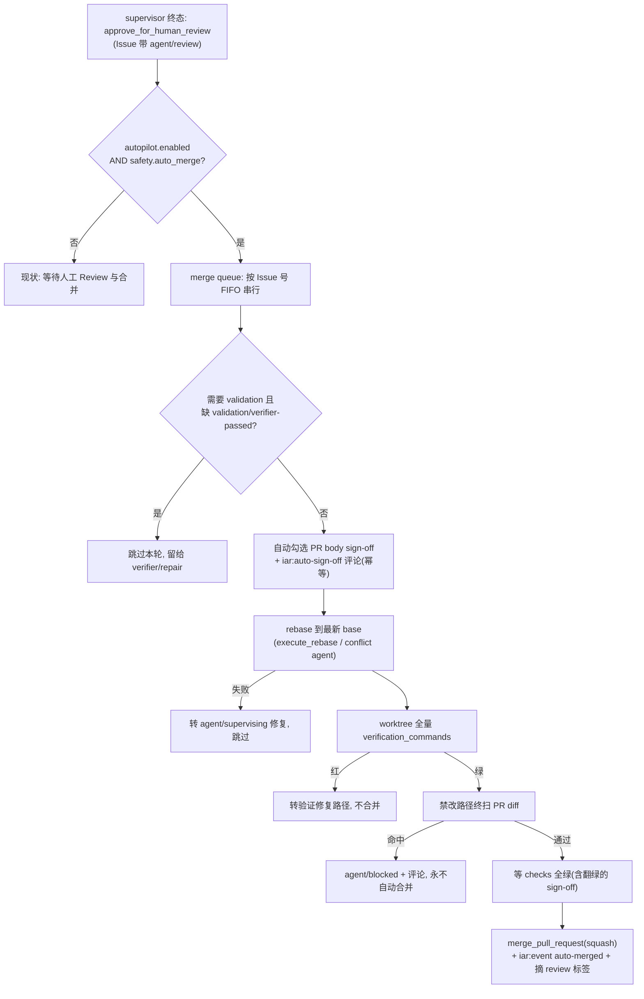

# PRD: Autopilot 快速档：合并队列消费 auto_merge 与签核自动化

- GitHub Issue: https://github.com/zata-zhangtao/keda/issues/126

> 本 PRD 分两个阅读高度：Part A 供人审（判断要不要做、哪里必须人工确认），Part B 供执行器（怎么做）。人审只需读 Part A，按 Human Review Map 指到的点再下钻 Part B。

# Part A · 人审层 (Review Layer)

## 1. Introduction & Goals

### Problem Statement

runner 流水线（Issue → worktree → 构建 → 验证 → draft PR → supervisor）末端永远停在"等人"：supervisor 的终态动作是 `approve_for_human_review`，Realistic Validation sign-off 需要人工在 PR body 勾选清单后才转绿。对 bug 容忍度高、追求迭代速度的产品仓（如 freshai / fsense 这类快速开发项目），人工合并成为唯一吞吐瓶颈——agent 可以并行开发多个 PRD，但每个 PR 都要等操作者逐个看、逐个勾、逐个合并。同时配置里的 `safety.auto_merge` 开关自诞生起从未被任何代码消费，是一个"看起来存在的能力"。

### Interpretation (解读回显)

我把需求读成：**新增一种按仓库开启的无人值守"快速档"（autopilot）：supervisor approve 之后不再停在人工 Review，而是进入一条串行合并队列——独立 verifier 的绿灯（`validation/verifier-passed`）替代人工勾选 sign-off、rebase 到最新 base、在 worktree 里全量重跑验证、禁改路径终扫，然后 squash 合并；`safety.auto_merge` 从死开关变成该行为的硬同意位。** 这不是取消门禁，而是把"人工确认"替换为"交叉 agent 证据评估 + 机器门禁"；快速档默认关闭，严格档（现状）行为零变化。签核评估用的"别的 agent"由已交付的 independent-verifier-gate PRD 提供（verifier 默认换 agent/model、干净 worktree），本 PRD 不重造评估器。合并方式锁定 squash。PRD 归档仍由执行 agent 在分支内完成（现状），合并队列不接管归档。——若你想要的是"绕过 verifier 和验证直接合并"或"keda 主仓也默认开快速档"，这条解读就偏了，请纠正（第一次人类触点）。

### What The User Gets

- 操作者在某个产品仓的配置里打开快速档后，该仓的 PRD → Issue → PR → **合并进主干** 全程无人值守；每个 PR 合并前仍然经过 verifier 绿灯、rebase 到最新主干、全量验证重跑、禁改路径扫描四道机器门禁。
- 合并完成后 Issue 上留下可追溯的事件评论（谁签的核、verifier verdict 是什么、什么时候合并的），出问题可以按图索骥回退。
- 不开快速档的仓库（默认所有仓库）看不到任何行为变化，仍然停在人工 Review。

### Measurable Objectives

- 快速档仓库中，一条已被 supervisor approve 且 verifier 绿灯的 PR，在一个 review pass 内无人工操作被 squash 合并进 base 分支。
- 严格档（`autopilot.enabled=false` 或 `safety.auto_merge=false` 任一）下现有测试全绿，无任何行为差异。
- 同一仓库内合并严格串行：每个 PR 合并前必然先 rebase 到当时最新的 base 并全量重跑验证；验证红则该 PR 不合并且不阻塞队列中其余 PR。
- sign-off 自动勾选只发生在 `validation/verifier-passed` 标签存在（或该 Issue 本就无需 validation）之后，且留下可审计的 marker 评论。

## 2. Human Review Map (介入与风险地图)

**参考菜单**：① core 业务逻辑/编排（`core/`）② 数据库结构/schema/迁移 ③ 安全/鉴权/信任边界 ④ 对外 API 契约/破坏性变更 ⑤ 钱/计费/配额 ⑥ 不可逆或破坏性数据操作 ⑦ 并发/事务/幂等。

**命中的人审项**：

- ①（core 编排）：合并队列是新的核心编排路径，决定"什么代码在什么条件下进主干"。
- ③（信任边界）：用"verifier 绿灯 + 自动勾选"替代人工签核，是明确的信任边界移动——这是本 PRD 的本质，必须人工确认这个交换是否可接受。
- ⑦（并发/幂等）：串行队列、daemon 崩溃后重入不得重复合并/重复勾选/重复评论。

**未命中**：②④⑤⑥ 全部走执行器 + 自动化门禁。逐条 worst-case-if-wrong：

- ②：本 PRD 无任何 schema/新存储，队列状态完全复用 GitHub 标签与 PR 状态——若错，最坏是标签状态混乱，人工可改标签恢复，不可能损坏数据。
- ④：`gh pr merge` 是出站调用，不改变任何对外契约——若 gh CLI 行为变化导致合并失败，失败显式可见（标签 + 评论），不会"错合"。
- ⑤：不涉钱。
- ⑥：squash 合并本身可用 `git revert` 单提交回退，且合并前有禁改路径终扫防止敏感文件入主干——最坏是"一段有 bug 的代码进了主干"，这正是快速档用户显式接受的风险，可回退、不破坏数据。

**分类表**：

| 改动点 | 架构层 | 风险 | 介入方式 | 证据 / Oracle |
|---|---|---|---|---|
| 合并队列编排（review pass 新阶段 + 新 use case） | core | 高 | 人工确认（高证据负担） | rv-1, rv-2 |
| 自动签核替代人工勾选（verifier 绿灯 → tick sign-off） | core | 高 | 人工确认（高证据负担） | rv-3 |
| 双同意开关 + 串行/崩溃重入幂等 | core | 高 | 人工确认（高证据负担） | rv-4, rv-1 负控 |
| `IGitHubClient.merge_pull_request` 抽象 + gh 实现 | infrastructure | 中 | 执行器 + fake 契约测试 | rv-1 |
| autopilot 配置三处映射 + repo override + `.iar.toml` 键 | infrastructure/engines | 中 | 执行器 + 配置往返测试 | rv-5 |
| 合并前禁改路径终扫 | core | 中 | 执行器 + 门禁测试 | rv-6 |

**如何证明它生效（真实入口，白话）**：在沙箱产品仓打开快速档，用正常流水线做出一条带证据、verifier 绿灯的 PR，然后跑一次真实的 `iar review`——看到 PR 在无人操作下被自动勾选签核、rebase、验证、squash 合并，Issue 上留下 auto-merged 事件评论。反向证明：人为让验证命令必红，同一入口下 PR 必须不被合并且转入修复流程；关掉 `safety.auto_merge`，一切回到"等人"。

**数据库结构评审**：本次无数据库结构变化。

## 3. Usage And Impact After Implementation

**操作者（repo operator）**：

1. 在目标产品仓的 `.iar.toml`（或全局 `config.toml` 的对应 `[agent_runner.repositories.<id>]` 覆盖）写入：

```toml
[autopilot]
enabled = true

[safety]
auto_merge = true
```

2. 照常运行守护进程或单趟命令（在 keda 仓根目录）：

```bash
# 单趟：处理一遍所有 supervisor 通过的 PR（含新合并队列阶段）
uv run iar review

# 常驻：review 守护进程按 review_interval_seconds 轮询
uv run iar review-daemon
```

3. 之后该仓库中 supervisor approve + verifier 绿灯的 PR 会自动合并；Issue 上可看到 `iar:auto-sign-off` 与 `iar:event`（auto-merged）两条可审计评论。

**对现有行为的影响（向后兼容）**：

- 两个开关默认均为 `false`，所有现存仓库行为不变；严格档路径零代码差异。
- `safety.auto_merge` 语义从"从未消费"变为"真正生效"：若有环境此前误设为 `true`，升级后将真的开始自动合并——发布说明必须显式提示；当前 `config.toml` 中该值为 `false`，本机无此风险。
- PRD 归档、worktree 清理、Issue 关闭（PR body 的 Closes 关联）等既有职责不变。

## 4. Requirement Shape

- **actor**：开启了快速档的仓库的 review pass（`iar review` / `iar review-daemon`）。
- **trigger**：Issue 带 `agent/review` 标签（supervisor 已 approve）且仓库配置 `autopilot.enabled` 与 `safety.auto_merge` 同时为真。
- **expected behavior**：按 Issue 号 FIFO 串行处理：verifier 门禁 → 自动勾选 sign-off → rebase 最新 base → worktree 全量验证 → 禁改路径终扫 → 等 checks 全绿 → squash 合并 → 事件评论与标签收尾；任一步失败则该 PR 转入既有失败/修复路径且不阻塞其余 PR。
- **scope boundary**：不改严格档行为；不做 PRD 归档（执行 agent 已做）；不引入新存储；merge 方式仅 squash；不做 GitHub 原生 merge queue / 分支保护配置。

# Part B · 执行器层 (Build Layer)

## 5. Repository Context And Architecture Fit

**现有相关模块**：

- `src/backend/core/use_cases/review_once.py`：review pass 编排（supervisor 循环入口），合并队列阶段挂在这里。
- `src/backend/core/use_cases/pr_supervisor.py`：`approve_for_human_review` 终态、`execute_rebase`、conflict-resolution、`is_sign_off_gate_only_failure`（sign-off check 名常量 `REALISTIC_VALIDATION_SIGN_OFF_CHECK`）。
- `src/backend/core/use_cases/agent_runner_validation.py`：`ValidationChecklistState` 解析、`validation_required`、sign-off 清单的构造来源；head 漂移时会清除 `validation/verifier-passed` label，防止 autopilot 误判。
- `src/backend/core/use_cases/agent_runner_events.py`：`iar:event` 事件评论惯例。
- `src/backend/core/use_cases/agent_runner_publish.py`：`is_forbidden_path(...)` 可直接用于禁改路径终扫。
- `src/backend/core/use_cases/agent_runner_git.py`：`run_verification(...)` 可直接用于 worktree 全量验证重跑。
- `src/backend/core/shared/interfaces/agent_runner.py`：`IGitHubClient`（现有 `find_open_pr_by_head` / `get_pull_request_context` / `update_pull_request_body` / `comment_pr` 等，**无 merge 方法**）。
- `src/backend/infrastructure/github_client.py`：gh CLI 实现。
- 配置三件套：`src/backend/infrastructure/config/settings.py`（pydantic）、`src/backend/core/shared/models/agent_runner.py`（domain dataclass，含从未被消费的 `auto_merge: bool = False`）、`src/backend/engines/agent_runner/factory.py`（映射 + `_merge_optional_model` 仓库级覆盖）、`src/backend/engines/agent_runner/repository_local.py`（`.iar.toml` 键描述，已有 `"safety.auto_merge"` 条目）。

**架构约束**：四层依赖方向不变——merge queue 逻辑在 `core/use_cases/`，通过 `IGitHubClient` / `IProcessRunner` 端口触达外界；gh 细节只进 `infrastructure/`；配置映射在 `engines/factory.py`。

**Frontend impact**：No frontend impact——合并发生在 GitHub 侧，console 前端消费的 API 契约与 roadmap 状态枚举不变（`merged` 状态已存在并已渲染）。

**相关 PRD（已检查 `tasks/pending/` 与 `tasks/archive/`）**：

- **依赖（archive · 已交付）**：`P1-FEAT-20260628-041733-realistic-validation-independent-verifier-gate`——它已归档并交付 T3 独立 verifier（默认换 agent、干净 worktree、对抗性验证）与 `validation/verifier-passed` 标签。本 PRD 的"交叉 agent 评估"**直接复用该门禁**而不重造评估器；快速档把"verifier + 人工双门禁"中的人工一侧替换为自动勾选。依赖状态：已可用。
- **相关（archive，机制复用）**：`20260523-...-rebase-conflict-agent-resolution-...`（rebase/冲突机器）、`20260527-234531-...-pr-context-approval-gate`（approve 语义）、`20260522-143103-...-two-stage-agent-review-pr-supervisor`（supervisor 结构）。
- **无重复**：pending 中的 nightly-cleanup-loop / memory-persistence / session-persistence / frontend-template-migration 与本 PRD 正交。
- **被依赖**：同组 PRD `roadmap-continuous-scheduling`（20260703-105330）依赖本 PRD 的 autopilot 配置段。

## 6. Recommendation

### Recommended Approach

在 `review_once` pass 的 supervisor 循环之后追加一个 **merge queue 阶段**（新 use case `agent_runner_merge_queue.py`），双开关（`autopilot.enabled` AND `safety.auto_merge`）同时为真才激活；签核评估完全复用 independent-verifier-gate 的 `validation/verifier-passed` 标签，不新建评估 agent；合并动作通过 `IGitHubClient` 新增的一个抽象方法落到 gh CLI。

**为什么贴合现有架构**：PR 生命周期（supervisor、rebase、conflict、checks 轮询）全部已在 review 侧，merge queue 是这条链的自然末端；复用 verifier 标签避免第二个"评估 agent"抽象；队列状态用 GitHub 标签/PR 状态表达，与 runner 现有"GitHub 即状态机"的设计一致，不新增存储。

**拒绝的冗余抽象**：不建独立 merge-daemon 进程（review daemon 已有轮询壳）；不建合并队列表（标签即队列）；不在 merge 时新建交叉评估 agent（verifier PRD 已是"换一个 agent 的对抗性评估"，正好满足"必须用别的 agent 评"的要求）。

**复用已有 helper**：禁改路径终扫直接调用 `backend.core.use_cases.agent_runner_publish.is_forbidden_path(...)`；全量验证直接调用 `backend.core.use_cases.agent_runner_git.run_verification(...)`。二者分别是 commit 阶段与 run/recovery 阶段已在使用的稳定 helper。

### Proposed Solution Summary (实现机制)

- **核心机制**：`process_merge_queue(...)`（新 use case）在每个 review pass 末尾执行：列出 `labels.review` 标签的 open Issue，按 Issue 号升序（FIFO）**串行**处理每条：
  1. **verifier 门禁**：该 Issue 需要 validation（`validation_required`）且 `autopilot.require_verifier_pass=true` 时，检查 Issue 标签含 `validation/verifier-passed`；缺失则本轮跳过（留给 verifier/repair 流程），记 log。
  2. **自动签核**：解析 PR body 的 sign-off 清单（复用 `ValidationChecklistState` 解析），有未勾项则把 Realistic Validation sign-off 区块内的 `- [ ]` 全部置为 `- [x]`（`update_pull_request_body`），并发一条含 `<!-- iar:auto-sign-off ... -->` marker 的评论（记录 verifier verdict 来源）；已全勾则幂等跳过。
  3. **rebase**：复用 `pr_supervisor.execute_rebase` 把 PR 分支 rebase 到最新 remote base；冲突走既有 conflict-resolution agent 路径；rebase 失败→交回 supervisor 修复（`agent/supervising`），本 PR 跳过。
  4. **全量验证**：在该 Issue 的 worktree 内调用 `backend.core.use_cases.agent_runner_git.run_verification(...)` 重跑 `runner.verification_commands`；红→转既有验证修复路径，本 PR 跳过不合并。注意：这不包含 2026-07-04 引入的 `runner.pre_commit_verification_command`，后者只在 commit 阶段经 `agent_runner_commit` 执行。
  5. **禁改路径终扫**：取 PR diff 文件清单，对 `safety.forbidden_path_patterns` 做最终匹配（直接调用 `backend.core.use_cases.agent_runner_publish.is_forbidden_path(...)`）；命中→打 `agent/blocked` + 评论，永不自动合并。
  6. **等 checks**：轮询 `get_pull_request_context` 直到 checks 全绿（自动签核后 sign-off check 应翻绿），超时上限 `autopilot.merge_check_timeout_seconds`。
  7. **合并**：调用新增的 `IGitHubClient.merge_pull_request(pr_number, method="squash")`（gh 实现 `gh pr merge <n> --squash`；对"已被合并"返回幂等成功）；成功后发 `iar:event`（auto-merged）评论、摘除 `agent/review` 标签。
- **谁供给配置**：操作者在 `.iar.toml` / `config.toml` 显式声明 `[autopilot]`；系统只消费显式配置，不做推断。
- **插入点**：`review_once` supervisor 循环之后；`iar review` 与 `iar review-daemon` 共享。
- **主要状态变化**：`agent/review` 的 Issue 在快速档下由"等人合并"变为"被串行自动合并"；`safety.auto_merge` 从死配置变为硬同意位。
- **刻意避免的复杂度**：无新表/新进程/新评估 agent/无状态机改造——严格档路径一行不动。

### Alternatives Considered

- **GitHub 原生 auto-merge / merge queue（`gh pr merge --auto` + 分支保护）**：拒绝——无法在合并前于本地 worktree 执行全量 `verification_commands` 与禁改终扫，且要求每个产品仓配置分支保护，超出 runner 的控制面；本地串行队列把"最后一道验证"握在 runner 手里。
- **merge queue 放 `run_agent_daemon`（构建 daemon）而非 review pass**：拒绝——PR 上下文、rebase、checks 轮询、supervisor 修复回路都在 review 侧，放构建侧要重复拉取 PR 状态。

## 7. Implementation Guide

> This section is a living implementation guide based on current repository analysis. If implementation discovers additional affected files, hidden dependencies, edge cases, or a better path, update this PRD before proceeding.

### Core Logic

数据/控制流：review pass（`iar review` / review daemon 每轮）→ supervisor 循环维持现状 → 新阶段 `process_merge_queue`：`list_issues_by_label(labels.review)` → 逐条（FIFO）执行 7 步门禁链（见上）→ 每步失败走既有修复/失败路径并 `continue` 下一条 → 全部成功者 squash 合并。串行保证：单 pass 内逐条处理，天然使后一条的 rebase 基于前一条合并后的 base；跨 pass 由标签幂等（已合并的 Issue 不再带 open PR，`find_open_pr_by_head` 返回空即跳过收尾）。

崩溃重入幂等：勾选前先读 body（全勾则跳过）；评论前查 marker（`list_issue_comment_entries` 找 `iar:auto-sign-off`）；merge 对已合并 PR 幂等成功；事件评论查重后再发。

### Change Impact Tree

```text
.
├── Infrastructure
│   ├── src/backend/infrastructure/config/settings.py
│   │   [修改]【总结】新增 AgentRunnerAutopilotSettings（enabled/merge_method/require_verifier_pass/auto_sign_off/merge_check_timeout_seconds）
│   │       并加入 _AgentRunnerRepositoryOverrideSettings 覆盖集合与 AgentRunnerSettings 顶层字段
│   └── src/backend/infrastructure/github_client.py
│       [修改]【总结】实现 merge_pull_request：gh pr merge --squash，"already merged" 归一为幂等成功
├── Domain (core)
│   ├── src/backend/core/shared/models/agent_runner.py
│   │   [修改]【总结】新增 AutopilotConfig dataclass 挂入 AppConfig；merge_method 仅接受 "squash"
│   ├── src/backend/core/shared/interfaces/agent_runner.py
│   │   [修改]【总结】IGitHubClient 新增抽象方法 merge_pull_request(pr_number, *, method) -> None
│   ├── src/backend/core/use_cases/agent_runner_merge_queue.py
│   │   [新增]【总结】串行合并队列 use case：7 步门禁链 + 幂等 + 每步失败的路由（supervising/blocked/skip）
│   └── src/backend/core/use_cases/review_once.py
│       [修改]【总结】supervisor 循环后追加双开关判定的 process_merge_queue 调用
├── Engines
│   ├── src/backend/engines/agent_runner/factory.py
│   │   [修改]【总结】autopilot settings→domain 映射、repo override merge、repo_config_summary 字典曝光 autopilot 键
│   └── src/backend/engines/agent_runner/repository_local.py
│       [修改]【总结】.iar.toml 新增 autopilot.* 键描述（enabled 等）
├── Config
│   └── config.toml
│       [修改]【总结】文档化 [agent_runner.autopilot] 默认段（全默认关闭）
├── Tests
│   ├── tests/test_agent_runner_merge_queue.py
│   │   [新增]【总结】fake IGitHubClient/IProcessRunner 下：FIFO 串行、verifier 缺失跳过、自动勾选幂等、
│   │       验证红不合并、禁改命中转 blocked、双开关任一关则整段 no-op、崩溃重入不重复评论/合并
│   └── tests/（现有 agent_runner 配置往返测试文件，rg 定位）
│       [修改]【总结】autopilot 非默认值 settings→factory→domain 往返断言（防双类陷阱）
└── Docs
    └── docs/（agent-runner 使用/配置章节，rg 定位）+ mkdocs.yml（如新增页面）
        [修改]【总结】快速档配置说明、合并队列 7 步门禁行为、auto_merge 语义激活的迁移提示
```

以上文件清单是起点而非穷尽集合，见 Executor Drift Guard。

### Executor Drift Guard

```bash
# 1. supervisor 终态与 sign-off check 常量（merge queue 的上游信号）
rg -n "approve_for_human_review|REALISTIC_VALIDATION_SIGN_OFF_CHECK" src/backend/core/use_cases/

# 2. 验证命令执行 helper（run/recovery 复用的那个；merge queue 直接调用）
rg -n "def run_verification" src/backend/core/use_cases/agent_runner_git.py

# 3. 禁改路径判定 helper（commit staging 侧；merge queue 直接调用）
rg -n "def is_forbidden_path" src/backend/core/use_cases/agent_runner_publish.py

# 4. 配置双类陷阱：三处映射站点 + 覆盖集合（漏一处会被相同默认值掩盖）
rg -n "auto_merge|SafetySettings|_merge_optional_model" src/backend/engines/agent_runner/factory.py src/backend/infrastructure/config/settings.py

# 5. 事件评论惯例（iar:event marker 的现有写法）
rg -n "iar:event" src/backend/core/use_cases/agent_runner_events.py

# 6. review pass 的装配（process_runner / github_client 可用性）
rg -n "def review_once" -A 20 src/backend/core/use_cases/review_once.py
```

> **2026-07-04 刷新提示**：本 PRD 写就后，仓库有两次相关提交——memory persistence & skill distillation (#125) 与 pre-commit verification command 支持。执行前请用上方 `rg` 重新确认 `review_once` 签名、`run_verification` 位置、以及 `is_forbidden_path` 实现未发生破坏性变更；`review_once` 若新增依赖（如 worktree 路径解析）请沿既有参数注入模式扩展，不要在 core 内直接构造 infrastructure 对象。

### Flow Diagram



### ER Diagram

No data model changes in this PRD.（队列状态复用 GitHub 标签与 PR 状态，无新存储。）

### Realistic Validation Plan

```yaml
- id: rv-1
  behavior: 快速档下 supervisor 通过且 verifier 绿灯的 PR 被串行 squash 合并；验证红的 PR 不被合并且转入修复
  real_entry: "uv run pytest -o addopts=\"\" tests/test_agent_runner_merge_queue.py"
  expected: "全部用例绿：FIFO 顺序断言、merge_pull_request 以 squash 调用一次、验证红分支断言 merge 未被调用且 Issue 转 agent/supervising"
  mock_boundary: "IGitHubClient/IProcessRunner 用 fake（仓库既有 fake 惯例）；merge queue 的门禁链逻辑本体不得 mock"
  negative_control: "临时把 fake 验证命令返回码改为 0（本应 1）后跑同一命令，或在实现里注释掉验证红的 skip 分支"
  expected_fail: "『验证红不合并』用例转红，报 merge_pull_request 被意外调用"
  test_layer: integration
  required_for_acceptance: true

- id: rv-2
  behavior: 真实入口端到端——沙箱产品仓开启快速档后，一条完整流水线产出的 PR 无人值守被合并并留下事件评论
  real_entry: "uv run iar review   # 于 keda 仓根目录，事先在沙箱仓 .iar.toml 打开 autopilot.enabled 与 safety.auto_merge，并准备好一条 agent/review + validation/verifier-passed 的 PR"
  expected: "命令结束后该 PR 在 GitHub 上状态为 merged(squash)，Issue 有 iar:auto-sign-off 与 iar:event(auto-merged) 评论，agent/review 标签被摘除"
  mock_boundary: "全真实（真 gh、真沙箱仓）；opt-in——依赖 gh 登录态与沙箱仓，无凭据环境跳过，以 rv-1 为回退"
  negative_control: "同一沙箱 PR 上先把 .iar.toml 的 safety.auto_merge 改回 false 再跑 uv run iar review"
  expected_fail: "PR 保持未合并、无新评论（整段 merge queue no-op）"
  test_layer: e2e
  required_for_acceptance: false

- id: rv-3
  behavior: 自动签核只在 verifier 绿灯后发生，且勾选/评论幂等
  real_entry: "uv run pytest -o addopts=\"\" tests/test_agent_runner_merge_queue.py -k sign_off"
  expected: "缺 validation/verifier-passed 时 body 未被修改；绿灯时 body 的 sign-off 区块全部置勾且第二次执行不再改 body/不再发评论"
  mock_boundary: "fake IGitHubClient 记录 update_pull_request_body/comment_pr 调用；ValidationChecklistState 解析用真实实现"
  negative_control: "在 fake 的 Issue 标签集中移除 validation/verifier-passed 且临时删除实现里的 verifier 门禁判定"
  expected_fail: "『缺绿灯不得勾选』用例转红，报 body 被意外修改"
  test_layer: integration
  required_for_acceptance: true

- id: rv-4
  behavior: 双同意开关——任一为 false 时 merge queue 整段 no-op（严格档零回归）
  real_entry: "uv run pytest -o addopts=\"\" tests/test_agent_runner_merge_queue.py -k kill_switch"
  expected: "autopilot.enabled=false 或 safety.auto_merge=false 时 fake 客户端零调用；现有 review 测试全绿"
  mock_boundary: "同 rv-1"
  negative_control: "临时把 review_once 中的双开关判定改成恒真"
  expected_fail: "kill_switch 用例转红，报 fake 客户端出现 merge/评论调用"
  test_layer: integration
  required_for_acceptance: true

- id: rv-5
  behavior: autopilot 配置在 settings→factory→domain 全链路生效（含仓库级覆盖），防双类默认值掩盖
  real_entry: "uv run pytest -o addopts=\"\" -k autopilot_config"
  expected: "非默认值（如 merge_check_timeout_seconds=123）经 factory 落到 AppConfig.autopilot 同值；.iar.toml 覆盖优先生效"
  mock_boundary: "无 mock，纯配置对象往返"
  negative_control: "临时删除 factory.py 中 autopilot 的映射行"
  expected_fail: "往返断言转红，domain 侧读到默认值而非 123"
  test_layer: unit
  required_for_acceptance: true

- id: rv-6
  behavior: 禁改路径终扫——PR diff 命中 forbidden_path_patterns 时永不合并并转 blocked
  real_entry: "uv run pytest -o addopts=\"\" tests/test_agent_runner_merge_queue.py -k forbidden"
  expected: "diff 含 .env 的用例断言 merge 未调用、Issue 打 agent/blocked、有解释评论"
  mock_boundary: "fake 客户端返回构造的 diff 文件清单；匹配逻辑用真实实现"
  negative_control: "临时把终扫步骤从门禁链中移除"
  expected_fail: "forbidden 用例转红，报 merge 被调用"
  test_layer: integration
  required_for_acceptance: true
```

**失败排查提示**：rv-1/3/4/6 红先看 fake 客户端的调用记录顺序与门禁链 early-return 路由；rv-2 红先查沙箱仓 `.iar.toml` 是否被 `repository_local` 正确加载（`uv run iar init` 诊断输出）、gh 登录态（`gh auth status`）、以及 sign-off check 所在 workflow 是否在沙箱仓存在；rv-5 红直接对照 factory.py 的映射行是否遗漏字段。注意 keda 本仓 pytest 默认 `--testmon` 增量，验收一律用 `-o addopts=""` 全量跑。

### Interactive Prototype Change Log

No interactive prototype file changes in this PRD.

### External Validation

No external validation required; repository evidence was sufficient.

## 8. Delivery Dependencies

- Group: autopilot-fast-lane
- Depends on groups:
  - none
- Depends on tasks/issues:
  - P1-FEAT-20260628-041733-realistic-validation-independent-verifier-gate（已归档交付）
- Gate type: hard
- Notes: 自动签核以 verifier PRD 交付的 `validation/verifier-passed` 标签为唯一绿灯来源（用户要求"必须用别的 agent 评"由 verifier 的换 agent 设计满足）。该依赖 PRD 已归档并代码落地，签名可用。

## 9. Acceptance Checklist

### Human-Confirmed

- [ ] 【对应 Review Map ①】合并队列编排评审通过：rv-1 全绿输出粘贴在案，含"验证红不合并"负控的红→绿记录
- [ ] 【对应 Review Map ③】信任边界替换评审通过：rv-3 全绿输出在案，确认自动签核仅在 verifier 绿灯后发生且留 marker 评论；操作者知悉"人工签核在快速档被替换"并接受
- [ ] 【对应 Review Map ⑦】双同意与幂等评审通过：rv-4 全绿输出在案；崩溃重入用例（重复执行不重复勾选/评论/合并）绿

### Architecture Acceptance

- [ ] merge queue 逻辑全部位于 `src/backend/core/use_cases/agent_runner_merge_queue.py`，通过端口触达外界：`rg -n "import" src/backend/core/use_cases/agent_runner_merge_queue.py` 无 `infrastructure` 导入
- [ ] `gh pr merge` 字样只出现在 infrastructure 层：`rg -n "pr merge" src/backend/ --type py` 仅命中 `infrastructure/github_client.py`
- [ ] `safety.auto_merge` 不再是死配置：`rg -n "auto_merge" src/backend/core/use_cases/` 至少命中 merge queue 的开关判定

### Dependency Acceptance

- [x] verifier PRD 已交付且 `validation/verifier-passed` 标签语义可用（`rg -n "verifier-passed" src/backend/` 命中非测试代码，如 `run_verifier_agent.py`、`agent_runner_validation.py`）
- [ ] 本 PRD 未引入新存储/新表/新 daemon 进程（`rg -n "CREATE TABLE|IRoadmapStore" src/backend/core/use_cases/agent_runner_merge_queue.py` 零命中）

### Behavior Acceptance

- [ ] rv-1 / rv-3 / rv-4 / rv-6 对应 pytest 用例存在且全绿（命令输出在案）
- [ ] 合并串行且 FIFO：队列测试断言处理顺序为 Issue 号升序，且后一条的 rebase 发生在前一条 merge 之后
- [ ] 每步失败路由正确：rebase 失败→`agent/supervising`；验证红→验证修复路径；禁改命中→`agent/blocked`；均不阻塞其余 PR

### Documentation Acceptance

- [ ] runner 配置文档新增 `[agent_runner.autopilot]` 段说明与 `auto_merge` 语义激活的迁移提示（`rg -n "autopilot" docs/` 命中）；若新增文档页则 `mkdocs.yml` 同步，`uv run mkdocs build --strict` 绿
- [ ] `config.toml` 含带注释的默认关闭 `[agent_runner.autopilot]` 段

### Validation Acceptance

- [ ] rv-5 配置往返测试绿（输出在案）
- [ ] 真实入口 rv-2 在沙箱仓执行通过（PR merged + 两条 marker 评论截图/链接在案）；无凭据环境显式记录跳过理由并以 rv-1 全绿替代
- [ ] 全量回归：`uv run pytest -o addopts=\"\" tests/` 与 `just test all` 均绿（注意 testmon 增量陷阱）

### Delivery Readiness

- [ ] 推荐方案完整落地（无 Phase 2 残留）；严格档零行为变化已由现有测试全绿证明；无未解决回归或发布阻塞项

## 10. Functional Requirements

- **FR-1**：新增 `[agent_runner.autopilot]` 配置段（`enabled=false`、`merge_method="squash"`、`require_verifier_pass=true`、`auto_sign_off=true`、`merge_check_timeout_seconds=1800`），完成 settings/domain/factory 三处映射、仓库级覆盖与 `.iar.toml` 键描述。
- **FR-2**：合并行为仅在 `autopilot.enabled` 与 `safety.auto_merge` 同时为真时激活（双同意）；任一为假整段 no-op。
- **FR-3**：merge queue 按 Issue 号 FIFO 串行执行 7 步门禁链：verifier 门禁 → 自动签核 → rebase → 全量验证 → 禁改终扫 → checks 等待 → squash 合并。
- **FR-4**：自动签核仅在 Issue 无需 validation 或带 `validation/verifier-passed` 时发生；勾选与 marker 评论均幂等。
- **FR-5**：`IGitHubClient` 新增 `merge_pull_request(pr_number, *, method)`；gh 实现对"已合并"幂等成功；`method` 仅接受 `"squash"`，其他值配置校验期拒绝。
- **FR-6**：任一步失败走既有失败/修复路径（supervising / 验证修复 / blocked）并继续处理队列中下一条，不中断 pass。
- **FR-7**：合并成功后发 `iar:event`（auto-merged）评论并摘除 `agent/review` 标签；崩溃重入不重复合并/勾选/评论。
- **FR-8**：严格档（默认配置）下所有现有测试与行为零变化。

## 11. Non-Goals

- 不做 GitHub 原生 auto-merge / merge queue / 分支保护配置。
- 不支持 squash 以外的合并方式。
- 不做合并后的 worktree/分支自动清理（既有 `iar worktree cleanup` 与 nightly-cleanup-loop 负责）。
- 不改变 PRD 归档职责（执行 agent 在分支内归档，`require_prd_archived` 门禁不变）。
- 不新建交叉评估 agent（复用 verifier PRD）；不新增任何前端界面。
- 不做跨仓库的全局合并编排（每仓独立串行）。

## 12. Risks And Follow-Ups

- **`auto_merge` 语义激活**：历史上该开关无效，若有环境已误设 `true`，升级后将真实合并。缓解：发布说明显式提示 + 双同意要求 `autopilot.enabled` 同时为真（新键，不可能已存在）。
- **sign-off check 依赖目标仓 workflow**：无该 workflow 的仓库 checks 集合不同。缓解：`is_sign_off_gate_only_failure` 已兼容缺失场景；本地全量验证与禁改终扫独立于 GitHub checks 兜底。
- **gh CLI 版本行为漂移**（merge 子命令输出/退出码）：实现层归一化处理并在 fake 契约测试中固化预期。

## 13. Decision Log

| ID | 决策问题 | Chosen | Rejected | Rationale |
|---|---|---|---|---|
| D-01 | 合并队列挂载点 | `review_once` pass 末尾 | `run_agent_daemon` 新阶段 | PR 上下文/rebase/checks/supervisor 修复回路全在 review 侧，构建侧挂载需重复拉取 PR 状态 |
| D-02 | 交叉 agent 评估来源 | 复用已交付的 verifier PRD 的 `validation/verifier-passed` | merge 时新建评估 agent | 避免第二个评估抽象；verifier 默认换 agent 恰好满足"必须别的 agent 评"的用户要求 |
| D-03 | 合并方式 | squash（唯一支持） | merge commit / rebase merge | 用户锁定 squash；单提交便于 revert |
| D-04 | 开关设计 | 双同意（autopilot.enabled AND safety.auto_merge） | 单开关直接消费 auto_merge | 激活遗留死开关有误开风险，新键 + 旧键同时为真才生效，防呆 |
| D-05 | 队列状态存储 | GitHub 标签/PR 状态（无新存储） | 新增合并队列表 | 与 runner"GitHub 即状态机"一致；崩溃重入靠标签幂等即可 |
