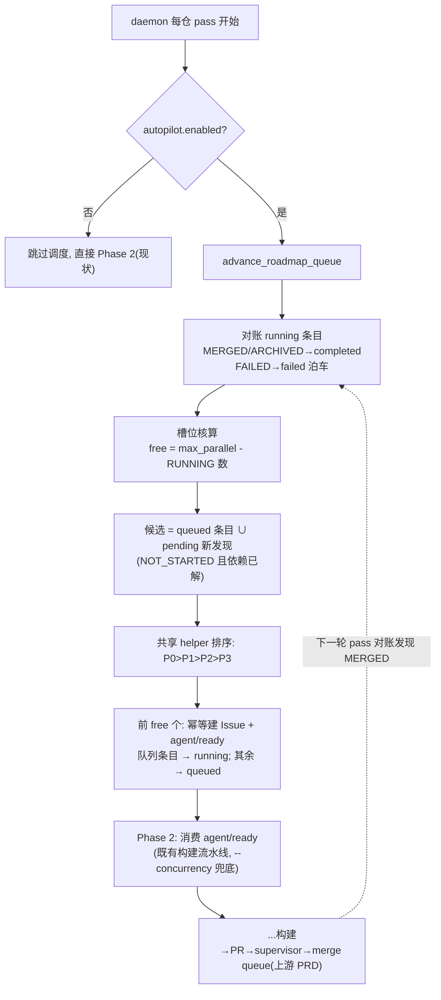

# PRD: Roadmap 持续调度：完成检测、队列自动晋升与失败泊车

> 本 PRD 分两个阅读高度：Part A 供人审（判断要不要做、哪里必须人工确认），Part B 供执行器（怎么做）。人审只需读 Part A，按 Human Review Map 指到的点再下钻 Part B。

# Part A · 人审层 (Review Layer)

## 1. Introduction & Goals

### Problem Statement

roadmap 的"全局开始"是一次性动作：它扫描 pending PRD、按依赖与优先级启动 `max_parallel` 个、把超额的标记为 queued——然后就结束了。queued 条目**没有任何消费者**：某个 PRD 合并归档后释放的槽位不会被自动补上，操作者必须回到 console 再点一次"全局开始"；执行失败的 PRD 也没有被对账收尾，队列记录永远停在 running。对想要"把 pending 里所有 PRD 自动做完、做完一个补一个、期间新写的 PRD 也自动排进去"的快速开发仓库，现状等于每消化一批就要人工踩一脚油门。

### Interpretation (解读回显)

我把需求读成：**把一次性的"全局开始"升级为 daemon 内的持续调度循环：每个轮询 pass 先对账（已合并/已归档的 PRD → 队列条目收尾为 completed；执行失败的 → 收尾为 failed 并泊车，不自动重试、不阻塞队列），再按 `max_parallel` 补位晋升——既晋升 queued 条目，也自动发现并入队 `tasks/pending/` 里新出现的合格 PRD；依赖每轮重算，上游合并后下游自动解锁。daemon 内晋升 = 建 Issue + 打 `agent/ready` 标签，交给 daemon 既有的构建阶段消费，不在调度循环里再 spawn 独立 runner 进程。** 不读成：改变 console"手动开始/停止"的行为、做跨仓库全局排程（仍按仓库独立调度）、或给失败 PRD 加自动重试。带 `agent/waiting` 的 Issue 本 PRD 不碰（重晋升语义属于 re-grounding PRD）。——若你想要的是"失败自动重试"或"跨仓库统一排队"，这条解读就偏了，请纠正（第一次人类触点）。

### What The User Gets

- 操作者在快速档仓库把 daemon 跑起来后，`tasks/pending/` 里的 PRD 会被**持续消化**：做完一个自动补一个，始终保持最多 `max_parallel` 个在途；期间新提交的 PRD 下一轮自动入队，被依赖挡住的 PRD 在上游合并后自动解锁启动。
- 某个 PRD 失败不再卡住整条队列：它被泊车（队列标记 failed + 原因），其余 PRD 继续流动；操作者随时可在 console 或 GitHub 上单独处理泊车的 PRD。
- 新增一条一次性 CLI 命令可手动/dry-run 触发同样的调度逻辑，便于观察"下一轮会发生什么"。

### Measurable Objectives

- 沙箱仓放入 N 个无相互依赖的 PRD，开启持续调度后**只启动一次 daemon**、零人工干预，N 个 PRD 全部走完（合并归档），全程在途数始终 ≤ `max_parallel`。
- 人为让其中 1 个 PRD 执行失败：其队列条目变为 failed（含原因），其余 N-1 个照常完成；失败者不占槽位。
- daemon 运行期间向 `tasks/pending/` 新增 1 个 PRD：下一个 pass 内它被自动入队并在有空槽时启动。
- 持续调度关闭（非快速档）时，roadmap 相关现有行为与测试零变化。

## 2. Human Review Map (介入与风险地图)

**参考菜单**：① core 业务逻辑/编排（`core/`）② 数据库结构/schema/迁移 ③ 安全/鉴权/信任边界 ④ 对外 API 契约/破坏性变更 ⑤ 钱/计费/配额 ⑥ 不可逆或破坏性数据操作 ⑦ 并发/事务/幂等。

**命中的人审项**：

- ①（core 编排）：持续调度循环是新的核心编排——槽位核算口径、晋升顺序、对账状态映射决定"哪些 PRD 何时被启动"。
- ⑦（并发/幂等）：daemon 每轮重入 + 可能与 console 手动 start 并发——重复建 Issue、重复晋升、重复收尾都必须被幂等防护挡住。

**未命中**：②③④⑤⑥ 全部走执行器 + 自动化门禁。逐条 worst-case-if-wrong：

- ②：无 schema 变化，队列复用既有 `RoadmapQueueEntry`（状态词表 queued/running/completed/failed 本就存在）——若错，最坏是队列记录状态不准，不损坏数据，console 可 clear 重来。
- ③：不触碰任何信任边界（调度只操作标签与队列记录；合并权限归 merge-queue PRD 管）。
- ④：新增 CLI 子命令是纯增量，现有 API 路由契约不变——若错，最坏是新命令不可用，不影响存量。
- ⑤：不涉钱（并行上限由既有 `max_parallel` 与 daemon `--concurrency` 约束，token 成本是快速档用户显式接受的）。
- ⑥：无破坏性操作——最坏错误是"误把未合并的 PRD 对账成 completed 而提前放行下一个"，后果是同时在途多跑一个 agent（成本问题），不可逆损害不存在。

**分类表**：

| 改动点 | 架构层 | 风险 | 介入方式 | 证据 / Oracle |
|---|---|---|---|---|
| 持续调度循环（对账→槽位→晋升）与选择顺序 | core | 高 | 人工确认（高证据负担） | rv-1, rv-2 |
| 幂等与竞态防护（重复 pass / 与手动 start 并发不双开） | core | 高 | 人工确认（高证据负担） | rv-3 |
| 从 start_global_roadmap 提取共享选择 helper（重构不改行为） | core | 中 | 执行器 + 现有 roadmap 测试回归 | rv-4 |
| daemon pass 接线（快速档门控） | api/core | 中 | 执行器 + 门禁测试 | rv-5 |
| 新 CLI `iar roadmap advance --dry-run` | api | 低 | 执行器 + CLI 冒烟测试 | rv-2 |

**如何证明它生效（真实入口，白话）**：在沙箱仓摆好几个小 PRD，跑真实的 daemon，不碰键盘，看它一个接一个做完、槽位从不超额、中途塞进去的新 PRD 也被捡起来；再用 `iar roadmap advance --dry-run` 在 keda 本仓演练一遍"下一轮调度计划"，输出与 pending 目录/依赖关系人肉核对一致。反向证明：把持续调度开关关掉，daemon 跑多少轮 queued 条目都纹丝不动。

**数据库结构评审**：本次无数据库结构变化。

## 3. Usage And Impact After Implementation

**操作者（repo operator）**：

1. 前提：目标仓已按 merge-queue PRD 开启快速档（`autopilot.enabled=true`）。持续调度随快速档自动生效，无需新开关。
2. 常驻运行（keda 仓根目录）：

```bash
# 构建 daemon：每轮 pass 自动对账 + 补位晋升 + 消费 agent/ready
uv run iar daemon run

# 观察下一轮调度会做什么（不落任何变更，任何仓库可安全执行）
uv run iar roadmap advance --dry-run

# 手动触发一轮真实调度（不想等 daemon 轮询间隔时）
uv run iar roadmap advance
```

3. console 前端 roadmap 页照常轮询展示：queued → running → merged 的流转现在会"自己动"；无新页面、无新按钮。

**对现有行为的影响（向后兼容）**：

- 非快速档仓库零变化：daemon 不执行调度阶段，console 手动"全局开始/停止/单个启动"行为不变。
- 队列语义收紧为"会被持续消费"：此前 queued 是死状态，现在会被自动晋升——只影响开了快速档的仓库。
- `stop_global_roadmap`（清空 queued）仍是刹车：清空后持续调度只会重新发现 pending 目录里的合格 PRD，不会复活已清除的队列条目——发现式入队即"pending 目录 = 队列真相源"。

## 4. Requirement Shape

- **actor**：快速档仓库的构建 daemon（`iar daemon run`）每轮 pass；或操作者手动 `iar roadmap advance`。
- **trigger**：pass 开始时队列存在 running/queued 条目，或 `tasks/pending/` 存在未入队的合格 PRD。
- **expected behavior**：对账（merged/archived→completed、failed→failed 泊车）→ 重算依赖 → 按优先级+入队顺序晋升至 `max_parallel` 满额（晋升 = 建 Issue/复用既有 Issue + 打 `agent/ready`）→ 新发现的合格 PRD 入队。
- **scope boundary**：不重试失败 PRD；不碰 `agent/waiting`；不跨仓库调度；不改 console 手动路径与前端。

# Part B · 执行器层 (Build Layer)

## 5. Repository Context And Architecture Fit

**现有相关模块**：

- `src/backend/core/use_cases/roadmap_actions.py`：`start_prd`（建 Issue + ready 标签 + spawn runner）、`start_global_roadmap`（一次性批量启动：扫描→依赖→优先级排序→启动/入队，本 PRD 的选择逻辑提取源）、`stop_global_roadmap`、`_create_issue_for_prd` / `_ensure_ready_label`。
- `src/backend/core/use_cases/roadmap_prd_scanner.py`：`scan_roadmap_prds`（PRD 文件为真相源）；`roadmap_dependencies.py`：`evaluate_roadmap_dependencies`（依赖对 GitHub 状态归一 + 环检测）；`roadmap_state_resolver.py`：`resolve_roadmap_states`（含 MERGED/ARCHIVED/FAILED/WAITING 全枚举）。
- `src/backend/core/shared/interfaces/runner_console.py`：`IRoadmapStore`（`enqueue_roadmap` / `list_roadmap_queue(status=...)` / `update_roadmap_queue_status(entry_id, status, finished_at, error_detail)`）、`RoadmapQueueEntry`（status 词表注释即 `queued / running / completed / failed`）。
- `src/backend/core/use_cases/run_agent_daemon.py`：daemon 轮询壳（Phase -1 reclaim → Phase 0 deliberation → Phase 1 rework-prd → Phase 2 构建，调度阶段插在这里）。
- `src/backend/api/cli.py`（daemon 装配，`run_agent_daemon(` 调用点）与 `src/backend/api/cli_typer.py`（typer 子命令组惯例：`daemon_app` / `worktree_app` / `loop_app`，roadmap 组尚不存在）。
- `src/backend/engines/agent_runner/factory.py`：`create_roadmap_store` / `create_github_client`（API 层已从 engines 工厂取 store，daemon 装配沿用同一工厂，api→engines 合法）。
- 前端 `frontend/src/components/roadmap/roadmap-list.tsx`：状态映射已含 `waiting` 等全枚举，轮询展示，无需改动。

**架构约束**：调度逻辑在 `core/use_cases/`，只依赖 `IRoadmapStore` / `IGitHubClient` 端口；store 构造在 engines 工厂；CLI 装配在 `api/`。

**Frontend impact**：No frontend impact——roadmap 页已轮询 resolve/queue 端点，状态流转自动反映；无新契约、无新组件。

**相关 PRD（已检查 `tasks/pending/` 与 `tasks/archive/`）**：

- **依赖（pending，同组）**：`P1-FEAT-20260703-105322-autopilot-merge-queue-fast-profile`——持续调度以它交付的 `autopilot.enabled` 为门控开关，且"做完自动补位"只有在合并也自动化时才闭环；两者还共享 daemon pass 结构，串行交付避免冲突。硬依赖。
- **被依赖（pending，同组）**：`P1-FEAT-20260703-105340-prd-regrounding-touch-map-avoidance` 将在本 PRD 的调度循环上挂 waiting 重晋升。
- **相关（archive）**：`20260521-104408-...-multi-repository-agent-runner`（多仓 contexts 结构）；roadmap 相关归档 PRD 定义了现有 scanner/resolver/actions 分层，本 PRD 沿用不改。
- **无重复**：pending 其余 PRD（nightly-cleanup-loop、memory/session-persistence、verifier-gate、frontend-template-migration）与本 PRD 正交。

## 6. Recommendation

### Recommended Approach

在 `roadmap_actions.py` 内新增 `advance_roadmap_queue(...)` use case（对账 + 补位晋升 + 发现式入队），从 `start_global_roadmap` 提取共享的"合格 PRD 选择与排序" helper 供两者复用；daemon pass 在 Phase 2 之前插入调度阶段（`autopilot.enabled` 门控）；新增 `iar roadmap advance [--dry-run]` typer 子命令组作为一次性入口。**daemon 路径的晋升只做"建 Issue + 打 ready 标签"，不 spawn 独立 runner 进程**——daemon 自己的 Phase 2 就是 ready 标签的消费者。

**为什么贴合现有架构**：调度所需的全部原语（扫描、依赖归一、状态解析、入队、启动）都已存在，本 PRD 只是给它们加一个"循环 + 对账"的壳；标签驱动（ready→Phase 2 消费）与 runner"GitHub 即状态机"的设计一致，避免调度器直接管理进程生命周期。

**拒绝的冗余抽象**：不新建 scheduler 模块/进程（daemon 轮询壳已在）；不新建队列表或状态字段（既有 `RoadmapQueueEntry` 词表已含 completed/failed）；不复制 `start_global_roadmap` 的选择逻辑（提取 helper，遵守"禁止复制粘贴后微调"）。

### Proposed Solution Summary (实现机制)

- **核心机制**：`advance_roadmap_queue(context, github_client, store, *, dry_run=False) -> RoadmapAdvanceReport`，每次调用执行三步：
  1. **对账**：`list_roadmap_queue(repo_id, status="running")` 逐条对照 `resolve_roadmap_states` 结果——PRD 状态为 `MERGED` 或 `ARCHIVED` → `update_roadmap_queue_status(status="completed", finished_at=now)`；`FAILED` → `status="failed"` + `error_detail`（泊车，不重试）；`BLOCKED` 保持 running 记录但**不计入槽位**（等人工 `blocked-continue`）；`WAITING` 本 PRD 不碰。
  2. **槽位核算**：`free = max_parallel(来自 RoadmapSettingsEntry，无则默认 1) - resolve 结果中 state==RUNNING 的数量`（沿用 `start_global_roadmap` 的口径：supervising/review/blocked 不占槽，槽位约束的是"执行中 agent"，agent 进程总量另由 daemon `--concurrency` 兜底）。
  3. **晋升与发现**：候选 = queued 条目对应的 PRD ∪ pending 目录新发现的合格 PRD（NOT_STARTED、无 block_reason、未在队列中）；用共享 helper 按 P0>P1>P2>P3 + 时间排序；取前 `free` 个——daemon 路径调用 `_create_issue_for_prd` 幂等建 Issue（复用其既有"已存在 Issue 则复用"判定）+ `_ensure_ready_label`，队列条目置 running（新发现者先 enqueue 再置 running）；超额候选 enqueue 为 queued。`dry_run=True` 时只产出报告不落任何变更。
- **谁供给配置**：`max_parallel` 来自 console 已持久化的 roadmap 设置（`get_or_create_roadmap_settings` 缺省 1）；是否启用持续调度由 merge-queue PRD 的 `autopilot.enabled` 决定，本 PRD 不新增配置键。
- **插入点**：`run_agent_daemon` 每仓 pass 中 Phase 2 之前（先补位再消费 ready，同一 pass 内即可启动新 PRD）；CLI 一次性入口 `iar roadmap advance`。
- **主要状态变化**：queued 从死状态变为被持续消费；failed PRD 队列条目获得终态与原因。
- **刻意避免的复杂度**：无新进程、无新表、无新配置键、无重试状态机。

### Alternatives Considered

- **调度器 spawn 独立 runner 进程（复用 console 的 `_spawn_runner` 路径）**：拒绝——daemon 内会出现"Phase 2 消费 ready"与"spawn 进程"双轨并行同一 Issue 的竞态；标签驱动让 daemon 的并发上限（`--concurrency`）统一约束所有执行。console 手动路径保留 spawn 行为不变。
- **新增独立 `[agent_runner.roadmap] continuous` 开关**：拒绝——快速档（autopilot）之外单独开持续调度意味着"自动启动但人工合并"，槽位会被等人合并的 PRD 占满失去意义；减少一个配置键，语义更整。

## 7. Implementation Guide

> This section is a living implementation guide based on current repository analysis. If implementation discovers additional affected files, hidden dependencies, edge cases, or a better path, update this PRD before proceeding.

### Core Logic

数据/控制流：daemon 每仓 pass → `advance_roadmap_queue`：`scan_roadmap_prds`（pending+archive）→ `evaluate_roadmap_dependencies` → `resolve_roadmap_states` → 对账 running 条目 → 槽位核算 → 共享 helper 选择候选 → 幂等晋升（建/复用 Issue + ready 标签 + 队列状态推进）→ 报告（started/queued/completed/failed/skipped）写 log。随后 daemon Phase 2 照常 `list_ready_issues` 消费，被晋升的 PRD 进入既有构建流水线。

幂等要点：候选过滤排除"已在队列中（任意状态）且对应 Issue 仍 open"的 PRD；`_create_issue_for_prd` 的既有"同名 Issue 已存在则复用"判定挡住重复建 Issue；对账只对 running 条目做单向推进（running→completed/failed），重复 pass 无副作用；与 console 手动 `start_prd` 并发时，标签与 Issue 复用判定保证最坏情况是"同一 PRD 的队列里出现一条手动 + 一条自动记录"，不会双开执行（Issue 唯一，ready 标签唯一）。

### Change Impact Tree

```text
.
├── Domain (core)
│   ├── src/backend/core/use_cases/roadmap_actions.py
│   │   [修改]【总结】新增 advance_roadmap_queue（对账/槽位/晋升/发现/dry-run 报告）；
│   │       从 start_global_roadmap 提取 _select_eligible_prds 共享排序选择 helper 并让两处复用；
│   │       晋升的 daemon 路径不调用 _spawn_runner
│   └── src/backend/core/use_cases/run_agent_daemon.py
│       [修改]【总结】每仓 pass 在 Phase 2 前插入调度阶段（context.config.autopilot.enabled 门控，
│           异常吞掉记 log 保证 daemon 存活，模式同既有 reclaim 阶段）
├── API
│   ├── src/backend/api/cli.py
│   │   [修改]【总结】daemon 装配注入 roadmap store（经 engines 工厂 create_roadmap_store），传入 run_agent_daemon
│   └── src/backend/api/cli_typer.py
│       [修改]【总结】新增 roadmap_app 子命令组与 advance 命令（--dry-run / --repo 过滤），装配模式仿 daemon_app
├── Tests
│   ├── tests/test_roadmap_advance.py
│   │   [新增]【总结】fake store + fake GitHub：对账映射、槽位口径、晋升顺序、发现式入队、
│   │       failed 泊车不占槽、blocked 占位不晋升、幂等重入、dry-run 零副作用、门控关闭零调用
│   └── tests/（现有 roadmap actions 测试文件，rg 定位）
│       [修改]【总结】start_global_roadmap 在 helper 提取后行为不变的回归断言
└── Docs
    └── docs/（agent-runner / roadmap 章节，rg 定位）+ mkdocs.yml（如新增页面）
        [修改]【总结】持续调度行为、槽位口径、失败泊车语义、iar roadmap advance 用法
```

以上文件清单是起点而非穷尽集合，见 Executor Drift Guard。

### Executor Drift Guard

```bash
# 1. start_global_roadmap 的选择/排序/入队逻辑（helper 提取源，注意别改变行为）
rg -n "def start_global_roadmap|priority_order|eligible" src/backend/core/use_cases/roadmap_actions.py

# 2. daemon pass 阶段结构与"阶段异常不杀 daemon"的既有模式
rg -n "Phase|except Exception" src/backend/core/use_cases/run_agent_daemon.py

# 3. daemon 装配点与现有注入参数（store 注入仿此）
rg -n "run_agent_daemon\(" src/backend/api/cli.py

# 4. typer 子命令组惯例（roadmap_app 仿 daemon_app / worktree_app）
rg -n "daemon_app = |worktree_app = |add_typer" src/backend/api/cli_typer.py

# 5. Issue 幂等建立判定（发现式入队依赖它防重复）
rg -n "_issue_already_exists|already" src/backend/core/use_cases/create_issue_from_prd.py

# 6. 队列状态词表与 update 接口（completed/failed 已在词表内，勿新造状态）
rg -n "queued / running|update_roadmap_queue_status" src/backend/core/shared/interfaces/runner_console.py
```

若 `run_agent_daemon` 的参数注入方式与预期不符（例如 store 需经 factory 回调），沿既有 `github_client_factory` 回调模式加 `roadmap_store_factory`，保持 core 不构造 infrastructure 对象。

### Flow Diagram



### ER Diagram

No data model changes in this PRD.（复用 `RoadmapQueueEntry` 既有字段与状态词表，无新表/新列。）

### Realistic Validation Plan

```yaml
- id: rv-1
  behavior: 对账+补位闭环——running 条目合并后收尾为 completed 并在同轮晋升下一个 queued
  real_entry: "uv run pytest -o addopts=\"\" tests/test_roadmap_advance.py"
  expected: "全部用例绿：merged→completed 映射、failed→failed 泊车含 error_detail、槽位≤max_parallel、晋升顺序 P0 优先"
  mock_boundary: "IRoadmapStore/IGitHubClient 用 fake；scan/dependencies/resolver/选择 helper 全用真实实现"
  negative_control: "临时把对账里 MERGED→completed 的映射注释掉后跑同一命令"
  expected_fail: "补位用例转红：槽位始终被已合并 PRD 占满，queued 永不晋升"
  test_layer: integration
  required_for_acceptance: true

- id: rv-2
  behavior: 真实入口 dry-run——在 keda 本仓演练下一轮调度计划，与 pending 目录人肉核对一致
  real_entry: "uv run iar roadmap advance --dry-run"
  expected: "输出报告列出：将对账的条目、空槽数、将晋升/入队的 PRD（按优先级），且命令零副作用（无 Issue/标签/队列变更）"
  mock_boundary: "全真实（真 gh 读、真 store 读）；只读安全，任何环境可跑"
  negative_control: "对比执行 uv run iar roadmap advance --dry-run 前后 gh issue list 与队列内容"
  expected_fail: "若 dry-run 落了变更（出现新 Issue/标签/队列条目），即红"
  test_layer: smoke
  required_for_acceptance: true

- id: rv-3
  behavior: 幂等与竞态——重复 pass 不重复建 Issue/不重复晋升；与手动 start_prd 并发不双开
  real_entry: "uv run pytest -o addopts=\"\" tests/test_roadmap_advance.py -k idempotent"
  expected: "同一状态下连续调用两次 advance，第二次零新建 Issue、零标签变更；先手动 start 再 advance 的用例中该 PRD 不被二次启动"
  mock_boundary: "同 rv-1；fake GitHub 记录 create_issue 调用次数"
  negative_control: "临时移除候选过滤中『已在队列中』的排除条件"
  expected_fail: "idempotent 用例转红，报 create_issue 被调用两次"
  test_layer: integration
  required_for_acceptance: true

- id: rv-4
  behavior: helper 提取后 start_global_roadmap 行为不变（重构零回归）
  real_entry: "uv run pytest -o addopts=\"\" -k \"global_roadmap or roadmap_actions\""
  expected: "现有 roadmap actions 全部测试保持绿，选择顺序与入队行为与提取前一致"
  mock_boundary: "沿用现有测试的 fake 边界"
  negative_control: "临时在共享 helper 中反转排序方向"
  expected_fail: "优先级排序断言转红（P2 排到 P0 之前）"
  test_layer: integration
  required_for_acceptance: true

- id: rv-5
  behavior: 门控——非快速档 daemon pass 完全不执行调度阶段
  real_entry: "uv run pytest -o addopts=\"\" tests/test_roadmap_advance.py -k gate"
  expected: "autopilot.enabled=false 的 context 下，daemon 单轮 pass 对 fake store 零调用"
  mock_boundary: "daemon 单轮以注入的 fake 依赖驱动（沿用现有 daemon 测试模式）"
  negative_control: "临时把 daemon 中的门控判定改为恒真"
  expected_fail: "gate 用例转红，报 store 出现读写调用"
  test_layer: integration
  required_for_acceptance: true

- id: rv-6
  behavior: 沙箱端到端——N 个小 PRD 零人工全部消化，途中新增 PRD 被自动捡起
  real_entry: "uv run iar daemon run   # 沙箱仓开启 autopilot, max_parallel=2, 预置 3 个微型 PRD, 运行中再放入第 4 个"
  expected: "4 个 PRD 全部 completed(合并归档)，任意时刻 RUNNING ≤ 2，全程无人工操作；人为弄失败的第 5 个 PRD 泊车为 failed 且不阻塞"
  mock_boundary: "全真实；opt-in——依赖 gh 登录态、沙箱仓与上游 merge-queue PRD 已交付，无条件环境以 rv-1+rv-3 为回退"
  negative_control: "沙箱仓关闭 autopilot.enabled 后重跑, 观察 queued 条目静止"
  expected_fail: "queued 条目在多轮 pass 后仍无任何晋升(现状行为)"
  test_layer: e2e
  required_for_acceptance: false
```

**失败排查提示**：rv-1/3 红先看 `resolve_roadmap_states` 对该 fake 场景给出的状态是否符合预期（fake 的 PR/标签摆放最容易错），再看对账映射的单向推进条件；rv-2 红先确认命令在 keda 仓根目录执行且 `config.toml` 的 repositories 段 enabled；rv-6 红先查沙箱仓 `.iar.toml` 的 autopilot 与 `max_parallel` 持久化值（console 设置过的旧值会覆盖预期）。keda 本仓 pytest 默认 `--testmon` 增量，验收一律 `-o addopts=""` 全量。

### Interactive Prototype Change Log

No interactive prototype file changes in this PRD.

### External Validation

No external validation required; repository evidence was sufficient.

## 8. Delivery Dependencies

- Group: autopilot-fast-lane
- Depends on groups:
  - none
- Depends on tasks/issues:
  - P1-FEAT-20260703-105322-autopilot-merge-queue-fast-profile
- Gate type: hard
- Notes: 门控开关 `autopilot.enabled` 由上游 PRD 交付；且"补位"只有在合并自动化后才闭环（否则槽位被等人合并的 PRD 永久占满）。两 PRD 均改 `run_agent_daemon` pass 结构，串行交付避免文本冲突。

## 9. Acceptance Checklist

### Human-Confirmed

- [ ] 【对应 Review Map ①】调度循环评审通过：rv-1 全绿输出在案（含"移除 merged→completed 映射则补位停摆"的负控红→绿记录）；槽位口径（RUNNING-only，blocked 不占槽不晋升）经人工确认
- [ ] 【对应 Review Map ⑦】幂等/竞态评审通过：rv-3 全绿输出在案；"手动 start 与 advance 并发不双开"用例绿

### Architecture Acceptance

- [ ] `advance_roadmap_queue` 位于 `core/use_cases/roadmap_actions.py`，无 infrastructure 导入：`rg -n "from backend.infrastructure" src/backend/core/use_cases/roadmap_actions.py` 零命中
- [ ] 选择逻辑单一来源：`rg -n "priority_order" src/backend/core/use_cases/roadmap_actions.py` 仅命中共享 helper 一处
- [ ] daemon 路径晋升不 spawn 进程：`rg -n "_spawn_runner" src/backend/core/use_cases/roadmap_actions.py` 的调用方仅 console/手动路径

### Dependency Acceptance

- [ ] 上游 merge-queue PRD 已交付（`rg -n "autopilot" src/backend/core/shared/models/agent_runner.py` 命中 AutopilotConfig）
- [ ] 未新增配置键/表/进程：`rg -n "continuous" src/backend/infrastructure/config/settings.py` 零命中

### Behavior Acceptance

- [ ] rv-1 / rv-3 / rv-4 / rv-5 对应 pytest 用例存在且全绿（输出在案）
- [ ] failed 泊车语义：失败 PRD 的队列条目 status="failed" 且带 error_detail，槽位立即释放给下一候选
- [ ] 发现式入队：daemon 运行中新增 pending PRD 在下一 pass 被入队（测试断言）

### Documentation Acceptance

- [ ] roadmap/daemon 文档新增持续调度说明（槽位口径、泊车、发现式入队、`iar roadmap advance` 用法）：`rg -n "roadmap advance" docs/` 命中；`uv run mkdocs build --strict` 绿

### Validation Acceptance

- [ ] 真实入口 rv-2（`uv run iar roadmap advance --dry-run`）在 keda 本仓执行，输出与 pending 目录人工核对一致且零副作用（输出在案）
- [ ] 沙箱端到端 rv-6 执行通过（时间线记录在案）；无条件环境显式记录跳过理由并以 rv-1+rv-3 全绿替代
- [ ] 全量回归：`uv run pytest -o addopts=\"\" tests/` 与 `just test all` 均绿

### Delivery Readiness

- [ ] 推荐方案完整落地（对账/晋升/发现/CLI/门控无一缺失，无 Phase 2 残留）；非快速档零行为变化；无未解决回归或发布阻塞项

## 10. Functional Requirements

- **FR-1**：`advance_roadmap_queue` 对账 running 队列条目：PRD 状态 MERGED/ARCHIVED → completed（记 finished_at）；FAILED → failed（记 error_detail，泊车不重试）；BLOCKED 保留 running 记录但不计槽位；WAITING 不处理。
- **FR-2**：槽位核算 `free = max_parallel - RUNNING 数`（口径与 `start_global_roadmap` 一致）；晋升数严格 ≤ free。
- **FR-3**：候选集 = queued 条目 ∪ pending 目录新发现的合格 PRD（NOT_STARTED、无 block_reason、未在队列）；依赖每轮重算，上游合并后下游自动出现在候选集。
- **FR-4**：排序复用从 `start_global_roadmap` 提取的共享 helper（P0>P1>P2>P3 + 时间），两调用方行为一致。
- **FR-5**：daemon 路径晋升 = 幂等建 Issue（复用既有存在性判定）+ `agent/ready` 标签 + 队列条目置 running；不 spawn 独立进程。
- **FR-6**：daemon 每仓 pass 在 Phase 2 前执行调度阶段，仅当 `autopilot.enabled`；阶段内异常记 log 不杀 daemon。
- **FR-7**：新增 `iar roadmap advance [--dry-run]`：dry-run 输出完整调度计划且零副作用；非 dry-run 执行一轮真实调度。
- **FR-8**：重复调用幂等：零新状态时第二次调用无任何写操作；与 console 手动 start 并发不导致同一 PRD 双开。

## 11. Non-Goals

- 不做失败 PRD 的自动重试/退避（泊车后归人工或未来 PRD）。
- 不处理 `agent/waiting` 的重晋升（re-grounding PRD 的职责）。
- 不做跨仓库统一排程（每仓独立调度，多仓由 daemon 外层 contexts 循环天然覆盖）。
- 不改 console 手动路径（start/stop/单个启动）与任何前端界面。
- 不新增配置键、存储结构或独立调度进程。

## 12. Risks And Follow-Ups

- **状态解析依赖 GitHub 可达性**：gh 调用失败时 resolver 会保守返回（依赖判定不通过），本轮少晋升——自愈于下一轮 pass，无错误晋升风险；daemon 阶段异常吞掉记 log。
- **`max_parallel` 旧值意外**：console 曾持久化的设置会被沿用（缺省 1）——文档明确"持续调度沿用 console 的 max_parallel"，dry-run 可预检。
- **发现式入队把手工实验 PRD 卷进来**：快速档仓库的 `tasks/pending/` 语义收紧为"放入即会被执行"——文档显式提示；不想执行的草稿放 `tasks/inbox/`（既有惯例）。

## 13. Decision Log

| ID | 决策问题 | Chosen | Rejected | Rationale |
|---|---|---|---|---|
| D-01 | daemon 内晋升方式 | 建 Issue + `agent/ready` 标签，交 Phase 2 消费 | 复用 console 的 `_spawn_runner` spawn 进程 | 避免同一 Issue 被 Phase 2 与 spawn 双轨执行的竞态；并发统一由 `--concurrency` 约束 |
| D-02 | 持续调度开关 | 复用 `autopilot.enabled` | 新增独立 `roadmap.continuous` 键 | "自动启动但人工合并"会让槽位被待合并 PRD 占满而失去意义；少一个配置键 |
| D-03 | 代码组织 | 扩展 `roadmap_actions.py` + 提取共享选择 helper | 新建 scheduler 模块 | 全部原语已在该模块；新模块是平行抽象，且复制选择逻辑违反仓库反复制规则 |
| D-04 | 槽位口径 | RUNNING-only（沿用 start_global_roadmap） | 计入 supervising/review/blocked | 槽位约束"执行中 agent"的资源；后置状态不耗执行资源，计入会造成假性满载 |
| D-05 | 失败处理 | 泊车（failed + 原因，不重试） | 自动重试 N 次 | 快速档失败多为需求/环境问题，盲目重试烧 token 且可能反复污染分支；泊车保持队列流动 |
