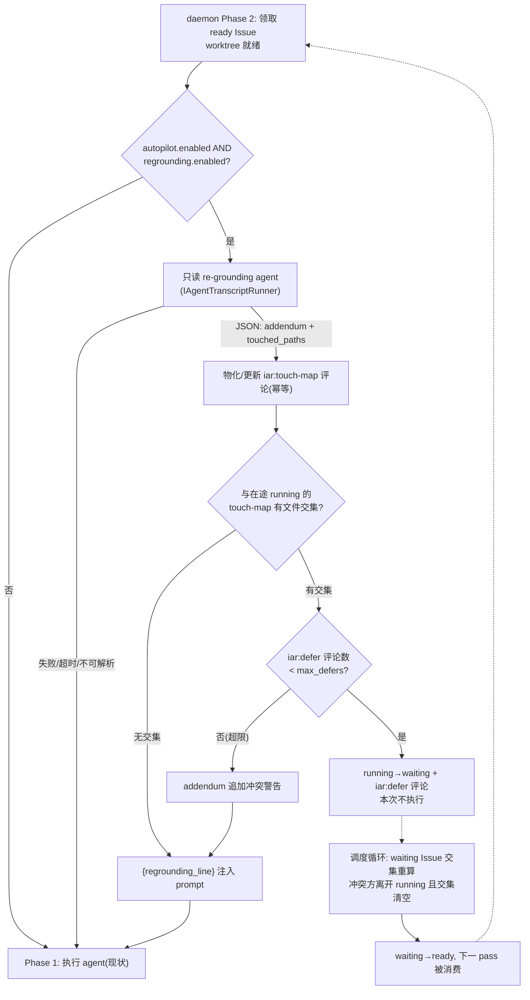

# PRD: PRD Re-grounding 阶段与触碰面重叠避让

> 本 PRD 分两个阅读高度：Part A 供人审（判断要不要做、哪里必须人工确认），Part B 供执行器（怎么做）。人审只需读 Part A，按 Human Review Map 指到的点再下钻 Part B。

# Part A · 人审层 (Review Layer)

## 1. Introduction & Goals

### Problem Statement

PRD 写下的时刻和被执行的时刻之间存在时间差——快速档下多个 PRD 并行推进、持续合并，这个差距被放大：等某个 PRD 排到执行时，它引用的文件可能已被重命名、它假设的接口可能已被前序 PRD 改掉。执行 agent 拿着过期地图开工，轻则浪费 token 自行摸索，重则按旧结构实现出与主干冲突的代码。另一个并行副作用是"隐式撞车"：两个没有声明依赖关系的 PRD 恰好改同一批文件，并行执行后在合并队列里才发现冲突，靠 rebase/conflict agent 硬解，代价高且成功率不稳。现有依赖机制只认 PRD 里显式声明的 `Delivery Dependencies`，对这种隐式文件级重叠是盲的。

### Interpretation (解读回显)

我把需求读成：**在 worktree 建好之后、执行 agent 启动之前，插入一个只读的 re-grounding 步骤：一个不改任何文件的 agent 对照当前代码结构检查 PRD，产出两样东西——(a) 偏差 addendum（PRD 引用的哪些文件/接口已经变了、计划哪几步需要相应调整），以 prompt 附录形式注入执行 agent，绝不改写 PRD 文件本身（PRD 的 acceptance checklist 是归档验收基准，基准不可变）；(b) 预计触碰路径清单，以隐藏 marker 评论物化到 Issue 上。若本 Issue 的预计触碰面与任何在途（`agent/running`）Issue 已发布的触碰面有文件级交集，则本次不执行——Issue 转 `agent/waiting` 并留 defer 评论，由持续调度在冲突方离开 running 后自动转回 ready；同一 Issue 最多 defer N 次，超限则带警告照常执行，交给合并队列的 rebase+全量验证兜底。** 不读成：改写 PRD 正文或验收清单、做语义级冲突预测（只做文件路径集合交集）、或在派发前就跑预测 agent。——若你想要的是"PRD 文件本身被自动更新"或"语义级影响分析"，这条解读就偏了，请纠正（第一次人类触点）。

### What The User Gets

- 执行 agent 开工时拿到一份"地图勘误"：PRD 里哪些引用已经过期、按当前代码该怎么调整路线——不再按旧地图施工，也不再花 token 自行发现"文件不在了"。
- 两个会改同一批文件的 PRD 不再同时开工：后到的自动让路排队，冲突方合并后它自动恢复执行——合并队列里的硬冲突显著减少。
- 每个在途 Issue 上有一份可见的"预计触碰面"评论，操作者随时能看到哪些 PRD 在动哪些文件、谁在等谁。
- 该步骤失败（agent 不可用、输出不可解析、超时）时静默跳过，执行照旧——它只增益，不新增失败模式。

### Measurable Objectives

- 快速档下每次执行启动前，Issue 上出现（或更新）一条 `iar:touch-map` 评论；执行 prompt 中包含 re-grounding addendum 段（可在运行日志/transcript 中检出）。
- PRD 文件在 re-grounding 前后逐字节不变（worktree 内 `git status` 干净）。
- 构造两个触碰面相交的 PRD 并行派发：后到者被转 `agent/waiting` 且不启动执行 agent；先到者合并后，下一轮调度内后到者自动回到 `agent/ready` 并完成。
- defer 次数达到上限的 Issue 照常执行且 addendum 中含冲突警告；re-grounding 关闭或失败时，执行行为与现状完全一致（零回归）。

## 2. Human Review Map (介入与风险地图)

**参考菜单**：① core 业务逻辑/编排（`core/`）② 数据库结构/schema/迁移 ③ 安全/鉴权/信任边界 ④ 对外 API 契约/破坏性变更 ⑤ 钱/计费/配额 ⑥ 不可逆或破坏性数据操作 ⑦ 并发/事务/幂等。

**命中的人审项**：

- ①（core 编排）：在执行流水线的入口段插入新阶段，决定"agent 带着什么上下文开工、这次到底开不开工"。
- ③（信任边界）：agent 生成的 addendum 被注入另一个 agent 的执行 prompt——生成内容成为指令的一部分；必须人工确认约束（addendum 只能改"怎么做"，验收基准即 PRD 文件不可变）成立。
- ⑦（并发/幂等）：defer/re-ready 的标签流转发生在调度与执行的竞态窗口里；防活锁上限必须真实生效。

**未命中**：②④⑤⑥ 全部走执行器 + 自动化门禁。逐条 worst-case-if-wrong：

- ②：无 schema/新存储（触碰面存 Issue 评论 marker）——若错，最坏是评论格式坏导致交集判定失效，退化为现状（无避让），合并队列兜底。
- ④：无对外契约变化（新增的是 Issue 评论与标签流转，均为既有原语）——若错，最坏是评论冗余。
- ⑤：不涉钱（每次执行多一次只读 agent 调用，成本随快速档显式接受；失败静默跳过不重试）。
- ⑥：无破坏性操作——defer 只是标签换位 + 评论，最坏是"不该让路的让了路"，表现为延迟执行，可人工改标签立即恢复。

**分类表**：

| 改动点 | 架构层 | 风险 | 介入方式 | 证据 / Oracle |
|---|---|---|---|---|
| 执行前插入 re-grounding 阶段（含失败静默跳过语义） | core | 高 | 人工确认（高证据负担） | rv-1, rv-4 |
| addendum 注入 prompt 且 PRD 基准不可变 | core | 高 | 人工确认（高证据负担） | rv-2 |
| defer/re-ready 标签流转 + max_defers 防活锁 | core | 高 | 人工确认（高证据负担） | rv-3 |
| touch-map/defer marker 评论的解析与幂等更新 | core | 中 | 执行器 + 解析单测 | rv-5 |
| regrounding 配置段映射（settings/domain/factory/.iar.toml） | infrastructure/engines | 中 | 执行器 + 配置往返测试 | rv-6 |
| 持续调度的 waiting 重晋升挂钩 | core | 中 | 执行器 + 集成测试 | rv-3 |

**如何证明它生效（真实入口，白话）**：在沙箱仓放两个明知会改同一个文件的小 PRD，开快速档跑起来：亲眼看到第二个让路（Issue 转 waiting、留下解释评论），第一个合并后第二个自动复活并做完；点开任一在途 Issue 能看到"预计触碰面"评论；抽查执行日志能看到 prompt 里的勘误附录；全程 PRD 文件一个字节没被改。反向证明：把 re-grounding 关掉重跑，两个 PRD 同时开工（现状行为），且执行照常成功——证明该功能只增益、不添堵。

**数据库结构评审**：本次无数据库结构变化。

## 3. Usage And Impact After Implementation

**操作者（repo operator）**：

1. 快速档仓库默认随 autopilot 生效，无需额外操作；可在 `.iar.toml` 按仓关闭或调参：

```toml
[autopilot.regrounding]
enabled = true          # 随 autopilot 默认开启；false 则完全跳过该阶段
agent = "auto"          # 只读 re-grounding agent 选择，惯例同 review_agent
timeout_seconds = 600
max_defers = 3          # 同一 Issue 最多让路次数，超限带警告继续
```

2. 照常运行 `uv run iar daemon run`（或单发 `uv run iar run`）。之后：
   - 每个开工的 Issue 上多一条隐藏 marker 的"预计触碰面"评论（含人类可读的文件列表）；
   - 撞车的 Issue 自动转 `agent/waiting` 并留 defer 评论（写明与哪个 Issue、哪些文件相撞）；冲突方离开 running 后自动恢复；
   - 执行 agent 的 prompt 末尾多出 re-grounding 勘误段（运行日志可见）。

**对现有行为的影响（向后兼容）**：

- 非快速档仓库零变化；快速档下 re-grounding 失败/超时/不可解析时静默跳过，执行流程与现状一致。
- `agent/waiting` 标签与 roadmap `waiting` 状态均为既有定义，console 前端已渲染，无新状态。
- PRD 文件、验收清单、归档流程完全不动。

## 4. Requirement Shape

- **actor**：快速档仓库的执行流水线（`iar run` / daemon Phase 2），以及持续调度循环（waiting 重晋升）。
- **trigger**：worktree 就绪、执行 agent 即将启动之时。
- **expected behavior**：只读 agent 产出 addendum + 触碰面 → 评论物化 → 与在途触碰面求交集 → 无交集（或 defer 超限）则注入 addendum 照常执行；有交集则转 waiting 让路，冲突消除后由调度自动恢复。
- **scope boundary**：不改 PRD 文件；不做语义冲突分析；不在派发前预测；不引入新存储；非快速档零变化。

# Part B · 执行器层 (Build Layer)

## 5. Repository Context And Architecture Fit

**现有相关模块**：

- `src/backend/core/use_cases/run_agent_once.py`：执行流水线（Phase 1 运行 agent → Phase 2 验证 → Phase 3 PRD 交付检查 → …）；re-grounding 插在 worktree 就绪之后、Phase 1 的 prompt 构建之前；prompt 模板变量（`{prd_line}` / `{validation_line}`）的解析点在此（`phase="execution"`）。
- `src/backend/core/shared/interfaces/agent_runner.py`：`IAgentTranscriptRunner`（只读 agent 执行端口，deliberation/生成内容已用）；`IGitHubClient.comment_issue` / `list_issue_comment_entries` / `edit_issue_comment`（marker 评论的写-查-改原语齐全）。
- `src/backend/core/use_cases/agent_runner_evidence_format.py`：`iar:evidence-format` 隐藏 marker 的正则解析惯例（touch-map/defer marker 仿此）。
- `src/backend/core/use_cases/generated_content.py` 与 `[agent_runner.generated_content]`：agent 生成 + 解析失败回退模板/静默的既有模式（re-grounding 的失败语义仿此）。
- 标签与状态：`LabelConfig.waiting = "agent/waiting"`（domain 与 settings 均已存在）；`roadmap_state_resolver.py` 已映射 `labels_config.waiting → RoadmapPrdState.WAITING`；前端 `roadmap-list.tsx` 状态表已含 `waiting`。
- `src/backend/core/use_cases/roadmap_actions.py`：上游 PRD 交付的 `advance_roadmap_queue`（waiting 重晋升挂在这里）。
- 配置三件套：`settings.py` / `models/agent_runner.py` / `factory.py` / `repository_local.py`（autopilot 段由 merge-queue PRD 建立，本 PRD 加其子段）。

**架构约束**：re-grounding 逻辑在 `core/use_cases/`，agent 调用走 `IAgentTranscriptRunner` 端口；无 infrastructure 直连；标签常量走 `LabelConfig`，不得硬编码字符串。

**Frontend impact**：No frontend impact——`waiting` 状态已在 roadmap 前端状态表中渲染（已核实 `roadmap-list.tsx` 含 `waiting` 映射），评论展示在 GitHub 侧，无新契约。

**相关 PRD（已检查 `tasks/pending/` 与 `tasks/archive/`）**：

- **依赖（pending，同组）**：`P1-FEAT-20260703-105330-roadmap-continuous-scheduling`——waiting 重晋升需要挂在其 `advance_roadmap_queue` 循环上；autopilot 配置段由更上游的 `P1-FEAT-20260703-105322-autopilot-merge-queue-fast-profile` 建立（经由调度 PRD 传递依赖，不重复声明）。硬依赖。
- **相关（archive，机制复用）**：`20260521-140600-...-agent-prompt-template-phase`（prompt 模板 phase 结构）、`20260523-...-rebase-conflict-agent-resolution-...`（冲突兜底的下游机制）、`20260522-101500-...-multi-agent-debate` 与 deliberation 相关 PRD（`IAgentTranscriptRunner` 只读 agent 模式的先例）。
- **无重复**：pending 其余 PRD 与本 PRD 正交；`rework-prd`（Issue→PRD 再生成）解决的是"PRD 内容质量"，本 PRD 解决"执行时刻的地图时效"，不同层。

## 6. Recommendation

### Recommended Approach

新增 use case `agent_runner_regrounding.py`：用 `IAgentTranscriptRunner` 跑一个只读 agent，产出结构化 JSON（addendum 行 + 预计触碰路径），addendum 经新模板变量 `{regrounding_line}` 注入既有执行 prompt，触碰面经 `iar:touch-map` marker 评论物化；避让判定为纯集合运算（本 Issue 触碰面 ∩ 在途 running Issue 触碰面），命中则标签 running→waiting + `iar:defer` 评论；重晋升作为一个小挂钩加入上游 PRD 的调度循环（waiting Issue 的冲突集清空 → waiting→ready）。防活锁：defer 评论计数 ≥ `max_defers` 时带警告继续执行。

**为什么贴合现有架构**：只读 agent、marker 评论、失败回退、标签驱动状态机、prompt 模板变量——五个机制全部是仓库既有惯例的复用；`waiting` 标签和状态解析甚至已经存在（只缺生产者），本 PRD 恰好补上生产者与消费者。

**拒绝的冗余抽象**：不建触碰面数据库表（评论即存储，与证据评论同模式）；不做派发前预测 agent（多一次 agent 调用、预测又比执行时刻旧）；不做语义级冲突分析（文件交集便宜且确定，语义冲突由合并队列 rebase+全量验证兜底）；不新建独立 daemon/进程。

### Proposed Solution Summary (实现机制)

- **核心机制**：`run_prd_regrounding(issue, worktree_path, config, transcript_runner, github_client) -> RegroundingOutcome`，在 `run_agent_once` 的 worktree 就绪之后、执行 prompt 构建之前调用：
  1. **只读 agent**：以配置模板构建 prompt（输入：Issue body、worktree 内 PRD 文件内容、`git ls-files` 顶层结构摘要、各在途 Issue 的 touch-map 摘要），要求输出 fenced JSON：`{"addendum": ["…"], "touched_paths": ["src/…", …]}`；解析失败/超时/agent 不可用 → 返回空 outcome，流程照旧（模式同 generated_content 回退）。
  2. **物化**：`comment_issue` 发（或 `edit_issue_comment` 更新）带 `<!-- iar:touch-map … -->` 隐藏 marker 的评论，附人类可读文件列表；幂等——已有 marker 评论则原地更新。
  3. **避让判定**：`list_issues_by_label(labels.running)` 取各在途 Issue 最新 touch-map，求文件路径交集；交集非空且本 Issue 的 `iar:defer` 评论数 < `max_defers` → 摘 running 换 waiting、发 defer 评论（含冲突 Issue 号与文件清单）、本次运行终止（不启动执行 agent）；交集为空或 defer 超限 → 继续，超限时在 addendum 里追加冲突警告行。
  4. **注入**：非空 addendum 渲染为 `{regrounding_line}`（新模板变量，默认 execution 模板在 `{validation_line}` 之后加一行；变量为空时渲染为空串，模板向后兼容）。
  5. **重晋升挂钩**（上游调度循环内）：对 `labels.waiting` 的 Issue 重算其 touch-map 与当前 running 集的交集，为空 → waiting→ready（下一 pass 被 Phase 2 消费）。
- **谁供给配置**：`[agent_runner.autopilot.regrounding]`（enabled/agent/timeout_seconds/max_defers），操作者显式声明，系统不推断；默认随 autopilot 开启。
- **插入点**：`run_agent_once` 执行入口段（生产者）+ `advance_roadmap_queue`（重晋升消费者）+ prompt 模板变量表。
- **主要状态变化**：新增 Issue 评论两类 marker；`agent/waiting` 获得自动生产者与消费者；执行 prompt 多一段勘误附录。
- **刻意避免的复杂度**：无新存储、无新进程、无语义分析、无 PRD 文件写操作。

### Alternatives Considered

- **派发时预测（调度循环里对每个候选 PRD 先跑预测 agent）**：拒绝——每个候选多一次 agent 调用，且预测时刻早于执行时刻、更容易过期；worktree 创建成本低，"开工前让路"浪费可忽略。
- **改写 PRD 文件使其与现实同步**：拒绝——PRD 的 acceptance checklist 是归档验收基准，执行侧自改基准等于运动员兼裁判；快速档无人盯梢，基准漂移无法被发现。addendum 只影响"怎么做"，不动"做成什么样"。

## 7. Implementation Guide

> This section is a living implementation guide based on current repository analysis. If implementation discovers additional affected files, hidden dependencies, edge cases, or a better path, update this PRD before proceeding.

### Core Logic

数据/控制流：daemon Phase 2 领取 ready Issue → 建/复用 worktree →（新）`run_prd_regrounding`：只读 agent → JSON 解析 → touch-map 评论物化 → 与 running 集交集判定 → defer（waiting + 评论 + 终止本次）或继续 → `{regrounding_line}` 注入 prompt → Phase 1 执行 agent 照旧。调度循环侧：`advance_roadmap_queue` 尾部对 waiting Issue 做交集重算 → 清空则 re-ready。

幂等与竞态要点：touch-map 评论以 marker 查找后原地更新（不叠加新评论）；defer 计数取自该 Issue 的 `iar:defer` marker 评论数（无新存储）；waiting→ready 与 running→waiting 都是单向条件流转，重复执行无副作用；两个 Issue 同一瞬间互相看不到对方 touch-map 的窗口期存在（都尚未发评论），后到者在下一轮对账/重晋升中仍会被交集判定拦住吗——不会，因为两者都已 running 且已发评论后不再互查；这个窗口的漏网由合并队列 rebase+全量验证兜底，属于显式接受的残余风险（见 Risks）。

### Change Impact Tree

```text
.
├── Infrastructure
│   └── src/backend/infrastructure/config/settings.py
│       [修改]【总结】AgentRunnerAutopilotSettings 内新增 regrounding 子模型
│           （enabled/agent/timeout_seconds/max_defers）
├── Domain (core)
│   ├── src/backend/core/shared/models/agent_runner.py
│   │   [修改]【总结】AutopilotConfig 内新增 RegroundingConfig dataclass
│   ├── src/backend/core/use_cases/agent_runner_regrounding.py
│   │   [新增]【总结】re-grounding use case：只读 agent 调用、JSON 解析与静默回退、
│   │       touch-map/defer marker 评论物化与幂等更新、交集避让判定、defer 计数与上限
│   ├── src/backend/core/use_cases/run_agent_once.py
│   │   [修改]【总结】worktree 就绪后调用 re-grounding（快速档门控）；defer 结果则终止本次执行；
│   │       prompt 变量表新增 {regrounding_line}（空值渲染为空串）
│   └── src/backend/core/use_cases/roadmap_actions.py
│       [修改]【总结】advance_roadmap_queue 尾部新增 waiting 重晋升挂钩（交集清空 → ready）
├── Engines
│   ├── src/backend/engines/agent_runner/factory.py
│   │   [修改]【总结】regrounding settings→domain 映射（并入 autopilot 映射处）
│   └── src/backend/engines/agent_runner/repository_local.py
│       [修改]【总结】.iar.toml 新增 autopilot.regrounding.* 键描述
├── Config
│   └── config.toml
│       [修改]【总结】文档化 [agent_runner.autopilot.regrounding] 默认段；
│           默认 execution prompt 模板加 {regrounding_line} 行
├── Tests
│   ├── tests/test_agent_runner_regrounding.py
│   │   [新增]【总结】fake transcript runner/GitHub：JSON 解析与回退、评论幂等、交集判定、
│   │       defer 流转与计数上限、PRD 文件不可变断言、关闭态零行为
│   └── tests/（run_agent_once 与 roadmap advance 的现有测试文件，rg 定位）
│       [修改]【总结】执行入口的 re-grounding 门控/终止分支断言；waiting 重晋升集成断言
└── Docs
    └── docs/（agent-runner 章节，rg 定位）+ mkdocs.yml（如新增页面）
        [修改]【总结】re-grounding 行为、touch-map/defer 评论示例、避让与防活锁语义、配置说明
```

以上文件清单是起点而非穷尽集合，见 Executor Drift Guard。

### Executor Drift Guard

```bash
# 1. 执行 prompt 的变量解析点与 phase 模板（{regrounding_line} 挂载处）
rg -n "prd_line|validation_line|phase=\"execution\"" src/backend/core/use_cases/run_agent_once.py config.toml

# 2. 只读 agent 端口与既有调用先例（deliberation / transcript runner）
rg -n "IAgentTranscriptRunner" src/backend/core/ --type py

# 3. 隐藏 marker 评论惯例（正则、物化、更新）
rg -n "iar:evidence-format|list_issue_comment_entries|edit_issue_comment" src/backend/core/use_cases/ --type py

# 4. waiting 标签的三处站点（domain/settings 已有；确认 labels sync 的 spec 表也含 waiting，
#    memory 教训：labels 是三站点映射，漏一处会被默认值掩盖）
rg -n "waiting" src/backend/core/shared/models/agent_runner.py src/backend/infrastructure/config/settings.py src/backend/core/use_cases/sync_labels.py src/backend/infrastructure/github_client.py

# 5. 生成内容的失败回退模式（re-grounding 静默跳过语义仿此）
rg -n "fallback|template" src/backend/core/use_cases/generated_content.py | head -20

# 6. 上游调度循环的挂钩点（本 PRD 依赖其已交付）
rg -n "def advance_roadmap_queue" src/backend/core/use_cases/roadmap_actions.py
```

若第 4 条发现 `sync_labels` 的 spec 表缺 `waiting`，必须一并补上（否则 `iar labels sync` 不会在 GitHub 创建该标签，defer 流转在新仓库首次触发时失败）。

### Flow Diagram



### ER Diagram

No data model changes in this PRD.（触碰面与 defer 计数均存于 Issue 评论 marker，无新表。）

### Realistic Validation Plan

```yaml
- id: rv-1
  behavior: re-grounding 阶段端到端——agent 产出被物化为评论、addendum 进入 prompt、失败时静默跳过
  real_entry: "uv run pytest -o addopts=\"\" tests/test_agent_runner_regrounding.py"
  expected: "全部用例绿：fixture JSON → touch-map 评论内容断言 + prompt 含 addendum 行；runner 抛错/超时/坏 JSON 三个用例中执行照常进行且无评论"
  mock_boundary: "IAgentTranscriptRunner/IGitHubClient 用 fake；JSON 解析、marker 物化、交集判定用真实实现"
  negative_control: "临时让失败回退分支 re-raise 而非静默"
  expected_fail: "静默跳过用例转红，报异常冒出执行入口"
  test_layer: integration
  required_for_acceptance: true

- id: rv-2
  behavior: PRD 基准不可变——re-grounding 前后 worktree 内 PRD 文件逐字节不变
  real_entry: "uv run pytest -o addopts=\"\" tests/test_agent_runner_regrounding.py -k immutable"
  expected: "用例对比 re-grounding 调用前后 PRD 文件哈希一致，且 use case 无任何文件写路径（addendum 仅存在于返回值/prompt）"
  mock_boundary: "真实临时 worktree 目录 + 真实 PRD fixture 文件"
  negative_control: "临时在实现中加一行把 addendum 追加写入 PRD 文件"
  expected_fail: "immutable 用例转红，哈希不一致"
  test_layer: integration
  required_for_acceptance: true

- id: rv-3
  behavior: 避让闭环——触碰面相交则 defer(waiting+评论)，冲突消除后重晋升，超限则带警告继续
  real_entry: "uv run pytest -o addopts=\"\" tests/test_agent_runner_regrounding.py -k defer"
  expected: "相交用例断言标签换位 running→waiting、defer 评论含冲突 Issue 号与文件；调度挂钩用例断言冲突清空后 waiting→ready；defer 评论数=max_defers 的用例断言照常执行且 addendum 含警告行"
  mock_boundary: "fake GitHub 承载标签/评论状态；交集与计数逻辑用真实实现"
  negative_control: "临时把交集判定改为恒空集"
  expected_fail: "defer 用例转红：相交场景未让路、执行 agent 被启动"
  test_layer: integration
  required_for_acceptance: true

- id: rv-4
  behavior: 关闭态零回归——regrounding.enabled=false 或非快速档时执行流程与现状一致
  real_entry: "uv run pytest -o addopts=\"\" tests/test_agent_runner_regrounding.py -k disabled"
  expected: "关闭态下 fake transcript runner 零调用、无评论、prompt 无 {regrounding_line} 内容；现有 run_agent_once 测试全绿"
  mock_boundary: "同 rv-1"
  negative_control: "临时把门控判定改为恒真"
  expected_fail: "disabled 用例转红，报 transcript runner 被调用"
  test_layer: integration
  required_for_acceptance: true

- id: rv-5
  behavior: marker 评论幂等——重复执行更新同一条 touch-map 评论而非叠加
  real_entry: "uv run pytest -o addopts=\"\" tests/test_agent_runner_regrounding.py -k marker"
  expected: "连续两次 re-grounding 后 fake GitHub 中 touch-map 评论仍为一条且内容为最新；defer 计数只数 iar:defer marker"
  mock_boundary: "fake GitHub 记录 comment/edit 调用"
  negative_control: "临时移除『已有 marker 则 edit』的分支，永远新发评论"
  expected_fail: "marker 用例转红，评论数为 2"
  test_layer: unit
  required_for_acceptance: true

- id: rv-6
  behavior: regrounding 配置全链路生效（settings→factory→domain + .iar.toml 覆盖）
  real_entry: "uv run pytest -o addopts=\"\" -k regrounding_config"
  expected: "非默认值（max_defers=7）经 factory 落到 domain 同值；.iar.toml 覆盖优先"
  mock_boundary: "无 mock，纯配置往返"
  negative_control: "临时删除 factory 中 regrounding 映射行"
  expected_fail: "往返断言转红，domain 读到默认值 3"
  test_layer: unit
  required_for_acceptance: true

- id: rv-7
  behavior: 沙箱真实入口——两个触碰同一文件的 PRD，一让一行，先者合并后让者自动复活完成
  real_entry: "uv run iar daemon run   # 沙箱仓开快速档, 预置两个都改 README.md 的微型 PRD"
  expected: "GitHub 时间线：Issue A 带 touch-map 评论正常执行；Issue B 转 agent/waiting 且 defer 评论点名 A 与 README.md；A 合并后 B 自动回 ready 并完成；两个 PRD 文件全程未被 re-grounding 修改"
  mock_boundary: "全真实；opt-in——依赖 gh 登录态、沙箱仓与上游两个 PRD 已交付，无条件环境以 rv-1+rv-3 为回退"
  negative_control: "沙箱仓 .iar.toml 置 autopilot.regrounding.enabled=false 重跑同一场景"
  expected_fail: "A、B 同时进入执行(现状行为)，无 touch-map/defer 评论"
  test_layer: e2e
  required_for_acceptance: false
```

**失败排查提示**：rv-1 红先看 fenced JSON 的提取正则与 fixture 输出格式是否一致（transcript 里 agent 可能包了额外文字，提取要宽容）；rv-3 红先检查 fake 的 running Issue 是否真的挂了 touch-map 评论（marker 正则大小写/空白容错）；rv-7 红先跑 `uv run iar labels sync` 确认沙箱仓存在 `agent/waiting` 标签，再查 `.iar.toml` 的 regrounding 段加载（`uv run iar init` 诊断）。keda 本仓 pytest 默认 `--testmon` 增量，验收一律 `-o addopts=""` 全量。

### Interactive Prototype Change Log

No interactive prototype file changes in this PRD.

### External Validation

No external validation required; repository evidence was sufficient.

## 8. Delivery Dependencies

- Group: autopilot-fast-lane
- Depends on groups:
  - none
- Depends on tasks/issues:
  - P1-FEAT-20260703-105330-roadmap-continuous-scheduling
- Gate type: hard
- Notes: waiting 重晋升挂在调度 PRD 的 `advance_roadmap_queue` 上；autopilot 配置段由链条最上游的 merge-queue PRD 建立（传递依赖，不重复声明）。三个 PRD 同属 autopilot-fast-lane 组，交付顺序：merge-queue → continuous-scheduling → 本 PRD。

## 9. Acceptance Checklist

### Human-Confirmed

- [ ] 【对应 Review Map ①】执行前插入阶段评审通过：rv-1 全绿输出在案（含三种失败静默跳过的负控红→绿记录）；rv-4 关闭态零回归输出在案
- [ ] 【对应 Review Map ③】注入约束评审通过：rv-2 全绿输出在案，确认 PRD 文件逐字节不可变、addendum 仅存在于 prompt；操作者知悉"agent 生成内容进入执行 prompt"并接受该边界
- [ ] 【对应 Review Map ⑦】defer 流转与防活锁评审通过：rv-3 全绿输出在案（含"恒空集则不让路"负控与 max_defers 超限继续的用例）

### Architecture Acceptance

- [ ] re-grounding 逻辑位于 `core/use_cases/agent_runner_regrounding.py`，零 infrastructure 导入：`rg -n "from backend.infrastructure" src/backend/core/use_cases/agent_runner_regrounding.py` 零命中
- [ ] 标签引用全部经 `LabelConfig`：`rg -n '"agent/waiting"' src/backend/core/use_cases/` 零命中（字符串仅存在于配置默认值）
- [ ] 无新存储：`rg -n "IRoadmapStore|CREATE TABLE" src/backend/core/use_cases/agent_runner_regrounding.py` 零命中

### Dependency Acceptance

- [ ] 上游调度 PRD 已交付（`rg -n "def advance_roadmap_queue" src/backend/core/use_cases/roadmap_actions.py` 命中）
- [ ] `sync_labels` 的标签 spec 覆盖 `waiting`（`rg -n "waiting" src/backend/core/use_cases/sync_labels.py src/backend/infrastructure/github_client.py` 命中，或执行器记录已确认既有覆盖）

### Behavior Acceptance

- [ ] rv-1 / rv-2 / rv-3 / rv-4 / rv-5 对应 pytest 用例存在且全绿（输出在案）
- [ ] prompt 模板向后兼容：未配置 `{regrounding_line}` 的仓库自定义模板不受影响（空变量渲染为空串的用例绿）
- [ ] defer 评论包含冲突 Issue 号与文件清单（人类可读），touch-map 评论含隐藏 marker + 可读列表

### Documentation Acceptance

- [ ] agent-runner 文档新增 re-grounding 章节（行为、两类评论示例、避让与防活锁、配置键）：`rg -n "regrounding|touch-map" docs/` 命中；`uv run mkdocs build --strict` 绿

### Validation Acceptance

- [ ] rv-6 配置往返测试绿（输出在案）
- [ ] 沙箱真实入口 rv-7 执行通过（GitHub 时间线截图/链接在案：defer 评论、waiting 流转、自动复活、PRD 文件未变）；无条件环境显式记录跳过理由并以 rv-1+rv-3 全绿替代
- [ ] 全量回归：`uv run pytest -o addopts=\"\" tests/` 与 `just test all` 均绿

### Delivery Readiness

- [ ] 推荐方案完整落地（生产者/消费者/注入/防活锁/配置无一缺失，无 Phase 2 残留）；非快速档与关闭态零行为变化；无未解决回归或发布阻塞项

## 10. Functional Requirements

- **FR-1**：worktree 就绪后、执行 agent 启动前运行只读 re-grounding agent（`IAgentTranscriptRunner`），产出 `{"addendum": [...], "touched_paths": [...]}`；agent 失败/超时/输出不可解析时静默跳过，执行流程不受影响。
- **FR-2**：addendum 经新模板变量 `{regrounding_line}` 注入执行 prompt；空值渲染为空串；PRD 文件与验收清单在整个阶段中不被写入（不可变断言入测试）。
- **FR-3**：预计触碰面以 `<!-- iar:touch-map -->` marker 评论物化到 Issue，重复执行原地更新（幂等，单条）。
- **FR-4**：避让判定 = 本 Issue 触碰路径集合 ∩ 各在途（`labels.running`）Issue 最新触碰面集合；交集非空且 defer 次数未达上限 → 标签 running→waiting + `iar:defer` 评论（含冲突 Issue 号与文件清单），本次不执行。
- **FR-5**：defer 计数 = 该 Issue 上 `iar:defer` marker 评论数；达到 `max_defers`（默认 3）后不再让路，照常执行且 addendum 追加冲突警告行。
- **FR-6**：调度循环对 waiting Issue 重算交集，清空则 waiting→ready，由既有 Phase 2 消费；流转单向且重复执行无副作用。
- **FR-7**：新增 `[agent_runner.autopilot.regrounding]` 配置段（enabled/agent/timeout_seconds/max_defers），完成 settings/domain/factory 映射与 `.iar.toml` 键描述；仅快速档且 enabled 时生效。
- **FR-8**：非快速档、关闭态、以及 re-grounding 任意失败路径下，执行行为与现状完全一致（零回归）。

## 11. Non-Goals

- 不改写 PRD 文件或其验收清单（勘误只进 prompt）。
- 不做语义级冲突预测/影响分析（文件路径交集是唯一判定；语义冲突由合并队列 rebase+全量验证兜底）。
- 不做派发前预测（预测只发生在 worktree 就绪的执行时刻）。
- 不引入触碰面的持久化存储（Issue 评论即存储）。
- 不处理非快速档仓库；不新增前端界面。
- 不保证消除全部并行冲突（见 Risks 的竞态窗口残余风险）。

## 12. Risks And Follow-Ups

- **同时开工的竞态窗口**：两个 Issue 在彼此 touch-map 评论发布前同时通过避让判定的窗口期存在，此时互相看不见——漏网冲突由合并队列 rebase+全量验证兜底，属显式接受的残余风险（快速档语义内）。
- **预测质量依赖 agent**：touched_paths 漏报会放走真冲突（兜底同上）、误报会造成不必要让路（max_defers 上限 + 人工可随时改标签解锁）；addendum 误导执行 agent 的风险由"PRD 基准不可变 + 验证门禁"约束在"怎么做"层面。
- **在途 Issue 无 touch-map 评论**（历史 Issue、re-grounding 曾失败）：交集判定按空集处理（放行），行为退化为现状——记录为已知限制，不做补偿机制。

## 13. Decision Log

| ID | 决策问题 | Chosen | Rejected | Rationale |
|---|---|---|---|---|
| D-01 | 勘误落点 | prompt 附录（addendum），PRD 文件不可变 | 自动改写 PRD 正文 | PRD 验收清单是归档门禁基准，执行侧自改基准=运动员兼裁判，快速档下无人能发现漂移 |
| D-02 | 预测时机 | worktree 就绪的执行时刻 | 派发时对候选逐个预测 | 少一次 agent 调用；执行时刻预测最新鲜；worktree 创建成本低，让路浪费可忽略 |
| D-03 | 冲突判定粒度 | 文件路径集合交集 | 语义级影响分析 | 便宜、确定、可测试；语义冲突已有合并队列 rebase+全量验证兜底，重复投入不划算 |
| D-04 | 触碰面存储 | Issue 隐藏 marker 评论（仿 evidence-format） | 新增数据库表 | 复用既有 marker 惯例与评论原语；GitHub 即状态机，人可直接看 |
| D-05 | 防活锁 | defer 评论计数 ≥ max_defers 则带警告继续 | 无上限让路 / 定时强制放行 | 计数免新存储且可审计；上限后交合并队列兜底，避免互相让路的饿死 |
