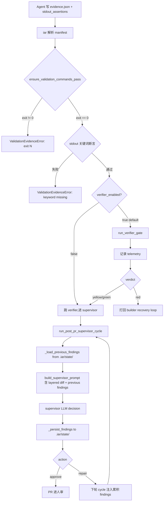

# PRD: iar 完成度判定结构性盲区加固（stdout 断言 + 默认开 verifier + supervisor diff 分层 + 跨 cycle finding 累积）

> 本 PRD 分两个 altitude，分别服务不同读者，自上而下阅读：
>
> - **Part A · 人审层 (Review Layer)** — 需求方 / 验收人读这部分，决定"该不该做、做得对不对"，并通过风险地图知道**哪些地方必须亲自确认**。Part A 不出现实现机制、文件路径、命令。
> - **Part B · 执行器层 (Build Layer)** — 实现者（人或 Agent）读这部分动手。人只在 Part A 风险地图**点名处**下钻审查，其余默认交执行器 + 自动门禁（hook / 测试 / 架构检查）。

---

# Part A · 人审层 (Review Layer)

## 1. Introduction & Goals

### Problem Statement

iar（issue-agent-runner）当前在"agent 报告完成 → PR 进入人审"这条链路上有 4 个**结构性盲区**——任一被 agent 利用都会让 keda 自检通过、但 supervisor 仍能发现真实问题（即"完成度不足"的典型表现）。

最近一次 issue #4（`agent/blocked`）就是这 4 个盲区同时表现：agent 自检 RV 全绿、verification_commands exit 0，但 supervisor 第 3 轮仍报 1 high + 3 medium + 2 low，最终被 `max_repair_exceeded` 标 blocked。

四个盲区：

1. **RV 命令只看 exit code 不看 stdout**——agent 写 `[ -d x ] || true` 或 `grep ... || echo ok` 就能 exit 0 蒙混过关；真实断言从未被核验
2. **独立 verifier 默认关闭**——`verifier_enabled=False` 是出厂设置，但 verifier 正是 keda 的"对抗复验"层；不开就只信 agent 自证
3. **supervisor 看到的 PR diff 被截断到 6000 字符**——长 PR 的关键变更落在截断窗口外，supervisor LLM 看不全就 approve
4. **supervisor 多 cycle 之间不累积 findings**——cycle 2 报的 high 没修，cycle 3 会"忘了"再检；`max_repair_attempts=2` 容易被打死

这 4 个不是单点 bug，而是 iar 完成度判定机制的结构性缺陷：单条防线够硬，但**防线之间的协同**不够——agent 自检通过 ≠ supervisor 也确认通过 ≠ 真实功能实现。

### Interpretation (解读回显)

我把"完成度判定加固"读作：在 iar 自身（keda 仓）上落地 4 个**最小变更的针对性补丁**，不重构现有架构、不引入新依赖、不改状态机。每个补丁都基于已存在的扩展点（`EvidenceBlock` 字段、`PostPrSupervisorConfig`、`ValidationConfig`、`_run_supervisor_with_repair_loop`）延伸；不属于"重新设计完成度模型"那种大动作。

我**不**把它读作：
- ❌ 重写 supervisor / verifier 整套逻辑
- ❌ 引入 ML 模型预测 PR 完成度
- ❌ 把 RV 命令强制改为外部 sandbox 执行
- ❌ 改动 `max_repair_attempts` 默认值
- ❌ 把 4 个补丁合并为一个抽象的"完成度引擎"模块

如果这个解读偏了，请在动工前指出——尤其是"加 telemetry 但不改 verifier 默认值"那条备选已被你否决、本 PRD 采用"改默认值 + telemetry 同步"。

### What The User Gets

实施完成后，**iar 项目的运营者和下游使用 iar 的项目**会拿到这些新行为：

- **RV 命令可以声明"stdout 必须包含 X / 不能包含 Y"**——agent 想用 `|| true` 兜底不行了；写假绿灯命令会被 iar 复跑时直接抓出来
- **独立 verifier 默认开启**——任何用了新版 iar 的项目，agent 写完代码后 iar 会自动换一个 agent 做对抗复验，red 自动打回 builder
- **supervisor 评审大 PR 时不再丢上下文**——配置关键路径后，重要文件的 diff 永远全量进入 supervisor 评审视野
- **supervisor 多 cycle 之间的"未解决 high"会持续追踪**——下个 cycle 不会再"忘了"上轮报的问题，避免被 `max_repair_exceeded` 无辜打死

具体能力边界：
- 仍然**不改 iar 的状态机**（`agent/running` → `supervising` → `review`/`blocked`/`failed` 流转不变）
- 仍然**不引入新依赖**（零 npm/uv 依赖变化）
- 仍然**不破坏现有 PRD 协议**（PRD 格式不变、agent prompt 兼容旧 manifest schema）

### Measurable Objectives

1. **RV 假绿灯可抓**：构造一个含 `[ -d x ] || true` 兜底的 RV 命令，新版 iar 复跑时 100% 返回 `ValidationEvidenceError`
2. **verifier 默认开启**：发布新版后，新生成 iar 仓默认 `.iar.toml` 中 `verifier_enabled=true`；iur 仓自身 CI 也开启
3. **大 PR diff 不丢失**：构造一个含 5 个关键文件、diff 总长 15000 字符的 PR，supervisor prompt 中关键文件 diff 完整可见
4. **跨 cycle finding 累积**：构造一个 cycle 1 报 high、cycle 2 没修的剧本，cycle 2 supervisor prompt 包含 cycle 1 的未解决 high 列表
5. **现有 176+ 测试不回归**：`uv run pytest -o addopts="" tests/` 全绿；架构门禁 `hooks/shared/check_architecture.py` 绿
6. **零依赖变化**：`git diff pyproject.toml uv.lock` 为空

---

## 2. Human Review Map (介入与风险地图)

判定菜单：

- 固定区域：① Core 业务逻辑 / 编排规则（`core/`）② 数据库结构 / schema / 迁移 ③ 安全 / 鉴权 / 信任边界 ④ 对外 API 契约 / breaking change
- 横切触发器：⑤ 资金 / 计费 / 额度 ⑥ 不可逆 / 破坏性数据操作 ⑦ 并发 / 事务 / 幂等性

**命中的人审项**：

- ① Core 业务逻辑 / 编排规则：`ensure_validation_commands_pass`（补丁 1）、`build_supervisor_prompt`（补丁 3）、`run_post_pr_supervisor_cycle`（补丁 4）都在 `core/use_cases/` 下；这是 iar 完成度判定的核心机制，属于 fixed zone
- ④ 对外契约：补丁 1 给 `EvidenceBlock` 加可选字段，会被 PRD YAML / evidence.json schema 消费；补丁 4 改 supervisor LLM 输出契约——任何 prompt 兼容性变化都算契约变化

**未命中**：

- ② schema 变化、③ 安全 / 鉴权、⑤ 计费、⑥ 不可逆操作、⑦ 并发均不涉及
- 最坏自检：
  - **② schema 错判**：确实无 schema 变化（iur 自身是 CLI 工具，不存 RV 状态数据；finding artifact 落 worktree 文件系统，不进 DB）——worst case：误判后没经人审；影响有限
  - **③ 安全错判**：所有改动都是内部 iar 逻辑，无外部凭据 / 鉴权点；worst case：agent 写 RV 命令时多了一道 sanity check（更安全），不会引入漏洞
  - **⑤ 计费错判**：iur 不是 SaaS，无计费逻辑；worst case：无
  - **⑥ 不可逆错判**：所有改动无破坏性数据操作；finding artifact 可被 git rm 清理；worst case：无
  - **⑦ 并发错判**：跨 cycle finding 是单进程内 in-memory（写盘是 gitignored 目录）；worst case：多 worktree 并发时 stale 数据，不阻塞主流程

| 改动点 | 架构层 | 风险 | 介入方式 | 证据 / Oracle（指向 §7.6） |
|---|---|---|---|---|
| **补丁 1**：`EvidenceBlock` 新增 `stdout_assertions` 字段（schema 扩展） | core | 高 | **人工确认** | rv-1, rv-2（schema 解析 + 假绿灯抓取） |
| **补丁 1**：`ensure_validation_commands_pass` 在 exit code 通过后增加关键词断言 | core | 高 | **人工确认** | rv-1, rv-2 |
| **补丁 2**：`verifier_enabled` 默认值 `False → True`，加 metric 计数器 | core | 中 | 执行器+门禁 | rv-3（telemetry + 默认值生效） |
| **补丁 3**：`build_supervisor_prompt` 改成分层 diff 注入 | core | 高 | **人工确认** | rv-4（大 PR 关键文件全量可见） |
| **补丁 3**：`PostPrSupervisorConfig` 新增 `key_paths` 配置 | infrastructure（dataclass）/ core（消费） | 中 | 执行器+门禁 | rv-4 |
| **补丁 4**：supervisor_finding_tracker 跨 cycle 累积未解决 findings | core | 高 | **人工确认** | rv-5（cycle 2 看到 cycle 1 未修 high） |
| **补丁 4**：supervisor LLM 输出契约扩展 `findings[]` 字段（向后兼容） | core | 中 | 执行器+门禁 | rv-5 |
| 配置 + 文档：`.iar.toml` / `config.toml` / `docs/guides/agent-runner.md` | infrastructure | 低 | 执行器+门禁 | （lint + 文档 grep） |
| 测试新增：`tests/test_agent_runner_validation.py` 等 4 个文件 | tests | 低 | 执行器+门禁 | `uv run pytest` 全绿 |

**如何证明它生效（真实入口，白话）**：

- 把 keda 仓自己当作"被 iar 处理的项目"，创建一个故意触发 4 种盲区的测试 issue：
  - 写 RV 命令用 `|| true` 兜底 → 验证补丁 1 抓出
  - 故意开 verifier 看它实际跑出 red/yellow/green
  - 写超长 diff PR → 验证补丁 3 让 supervisor 看到关键文件
  - 模拟 supervisor cycle 1 报 high 后 cycle 2 没修 → 验证补丁 4 累积 finding
- 命令级细节见 Part B 第 7.6 节 Realistic Validation Plan

**数据库结构评审**：

- `本次无数据库结构变化。`（finding artifact 落 worktree gitignored 目录，不进数据库；evidence schema 扩展是配置 dataclass，不是 DB schema）

---

## 3. Usage And Impact After Implementation

写 PRD 时即填写，描述实现后的目标态使用脚本。

### 终端用户 / End User

**iur 仓维护者**：
- 在 `.iar.toml` 编辑 RV 命令时，可以加 `stdout_assertions` 块声明"stdout 必须包含 X" / "不能包含 Y"——iur 自动验证；不需要写额外脚本
- 默认 `.iar.toml` 模板生成的内容里 `verifier_enabled = true`——不需要手动开
- 在 `.iar.toml` 加 `post_pr_supervisor.key_paths = ["src/backend/core/", "pyproject.toml"]` 声明关键路径——supervisor 自动全量 diff 这些文件
- 跑 `iar run` 后，supervisor 报告里能看到 `Previous unresolved findings from cycles 1..N-1:` 段

**下游使用 iar 的项目维护者**：
- 升级 iar 版本后，`.iar.toml` 默认值变更带来的行为变化（verifier 默认开）需要 release notes 标注
- evidence.json schema 向后兼容（旧 manifest 没 `stdout_assertions` 字段，iur 静默忽略）

### 管理员 / Admin

**iur 仓运维**：
- 通过 `just telemetry --verifier-runs` 看 verifier 开启前后的 PR 处理时长 / 失败率分布（实施后新增命令）
- 通过 supervisor PR 评论里的 "Previous unresolved findings" 段检查是不是有 high 长期挂起

### 开发者 / Developer

**iur 仓贡献者**：
- 给 RV 命令加 stdout 断言：用 `rg -n 'stdout_assertions' docs/guides/agent-runner.md` 查文档示例
- 调 supervisor diff 分层策略：改 `PostPrSupervisorConfig.key_paths`，行为即时生效
- 读 supervisor 跨 cycle finding 状态：`cat .iar/state/issue-<N>/findings.json` 看 artifact 内容

### Impact On Existing Behavior

**保持不变**：
- iur 的状态机、6 个 workflow label、`max_repair_attempts` 默认值 2、所有现有 verification_commands 行为
- 现有 evidence.json manifest（旧格式）继续被解析，不报错
- 现有 supervisor prompt 结构：新增的"Previous unresolved findings"段是**追加**而非替换

**新增可选配置**（默认行为保持兼容）：
- `[validation].stdout_assertions_enabled = false`：opt-in 控制关键词断言是否启用
- `[post_pr_supervisor].key_paths = []`：opt-in 声明关键路径；空时退化为现行为（6000 字符截断）
- `[post_pr_supervisor].previous_findings_injection_enabled = true`：opt-out 控制跨 cycle finding 注入
- `[validation].verifier_enabled = true`（**默认值变更**：旧版 `false`）：升级时 release notes 需标注

---

## 4. Requirement Shape

- **Actor**: iar 仓（keda）维护者、iar 下游使用者、agent runner（被 iar 调度的 AI agent）
- **Trigger**:
  - 补丁 1：每次 iar 复跑 RV 命令时（`ensure_validation_commands_pass`）
  - 补丁 2：每次 `run_verifier_gate` 调用前检查 `verifier_enabled` 标志
  - 补丁 3：每次 `build_supervisor_prompt` 构建 supervisor 评审 prompt 时
  - 补丁 4：每次 supervisor cycle 启动时（`run_post_pr_supervisor_cycle` 入口）
- **Expected behavior**:
  - 补丁 1：exit code 通过后，stdout/stderr 关键词断言通过才视为 RV 通过
  - 补丁 2：默认走 verifier 复验；telemetry 记录 verifier 耗时分布
  - 补丁 3：关键路径文件 diff 全量注入；非关键文件按配置截断
  - 补丁 4：cycle N supervisor prompt 注入 cycles 1..N-1 仍未解决的 findings
- **Scope boundary**:
  - 不重构 iar 状态机、不引入 ML 模型、不改 `max_repair_attempts` 默认值
  - 不强制要求所有下游项目立即启用新配置；默认行为变更只影响 verifier_enabled

---

# Part B · 执行器层 (Build Layer)

> 以下供实现者（人或 Agent）使用。人只在 Part A 风险地图点名处下钻审查；其余默认交执行器 + 自动门禁。

## 5. Repository Context And Architecture Fit

- **Existing path**:
  - 补丁 1：`src/backend/core/use_cases/agent_runner_validation.py:ensure_validation_commands_pass` + `src/backend/core/use_cases/agent_runner_structured_evidence.py:EvidenceBlock`
  - 补丁 2：`src/backend/core/shared/models/agent_runner.py:ValidationConfig.verifier_enabled` + `src/backend/core/use_cases/run_verifier_agent.py`
  - 补丁 3：`src/backend/core/use_cases/pr_supervisor.py:build_supervisor_prompt` + `PostPrSupervisorConfig`
  - 补丁 4：`src/backend/core/use_cases/pr_supervisor.py:run_post_pr_supervisor_cycle` + `_run_supervisor_with_repair_loop`
- **Reuse candidates**:
  - `_extract_expected_artifacts` 模式（`structured_evidence.py:317-370`）——补丁 1 加 `stdout_assertions` 字段照抄
  - `_rv_reexec_cache_relpath` / `_rv_reexec_cache_path`（`agent_runner_validation.py:565-579`）——补丁 4 finding artifact 路径解析照抄
  - `parse_supervisor_action` fail-closed 解析（`pr_supervisor.py:280-349`）——补丁 4 扩展 `findings` 字段时遵循"先过 action 解析，再抽 findings"顺序
  - `format_validation_evidence_failure` 错误详情格式化（`agent_runner_validation.py:741-749`）——补丁 1 关键词失败时复用
- **Architecture pattern to preserve**:
  - 四层依赖方向：`api → core → engines → infrastructure`（pre-commit `hooks/shared/check_architecture.py` 强制校验）
  - I/O 走抽象接口（`IProcessRunner` / `IGitHubClient`），新逻辑落 `core/use_cases/`
  - Pydantic settings ↔ frozen dataclass ↔ factory 三处同步（参考 `agent_runner.py:ValidationConfig` / `settings.py:AgentRunnerValidationSettings` / `factory.py` 的映射链）
- **Frontend impact**: **No frontend impact**（iur 是 CLI 后端工具，仓库无 frontend app）
- **Existing PRD relationship**:
  - `tasks/archive/P1-FEAT-20260628-041733-realistic-validation-independent-verifier-gate.md`：7/3 归档，已实施 verifier_enabled 配置项 + `run_verifier_gate` 函数 + PR verdict label 落地；本 PRD 是其**后续补丁**——`stdout_assertions` 是该 PRD 没覆盖的扩展点
  - `tasks/archive/P2-FEAT-20260701-175630-agent-assisted-verification-commands-detection.md`：讨论 verification_commands 源头质量（提示），与本 PRD 正交（不重复）
  - `tasks/archive/P1-FEAT-20260623-232747-iar-cli-logs-view-and-daemon-status-log-path.md`：引用 `ensure_validation_commands_pass` 复跑机制；本 PRD 不冲突
  - 其他 5 个 pending PRD 与本 PRD 主题正交，无依赖关系
  - **结论**：本 PRD 与历史 PRD 不重复，是 `realistic-validation-independent-verifier-gate` 的后续补丁，独立可执行
- **Redundancy risks**:
  - 风险 1：补丁 1 的 `stdout_assertions` 不要扩展为"通用 output checker"——保持 RV 命令复跑语义最小扩展
  - 风险 2：补丁 4 的 finding tracker 不要替代 supervisor 自己的 comment 输出——只是新增内部 artifact
  - 风险 3：补丁 3 的 `key_paths` 不要做成自动启发式——保持配置驱动确定性

---

## 6. Recommendation

### Recommended Approach

- **Approach**: 在 4 个已存在的扩展点（`EvidenceBlock` / `PostPrSupervisorConfig` / `ValidationConfig` / supervisor cycle artifact）上**追加**字段和逻辑，不重写、不抽象、不并入新模块
- **Why this is the best fit**:
  - 完全契合 `P1-FEAT-20260628-realistic-validation-independent-verifier-gate` 已建立的 `expected_artifacts` 模式（同样是 EvidenceBlock 上的 optional 字段）
  - 复用现有 artifact 路径解析（`_rv_reexec_cache_relpath`），无需新基础设施
  - 配置驱动 + 默认值兼容策略对齐 iar 现有 dataclass/pydantic 三处同步模式
- **Rejected redundancy**:
  - 不新建 "completion engine" 模块——分散到现有 supervisor / validation use case 里
  - 不引入新的 telemetry 框架——用现有 logger + 简单内存计数器
  - 不新建 finding tracker dataclass 体系——复用 supervisor 现有的 `SupervisorActionResult.findings_counts` 字段

### Proposed Solution Summary (实现机制)

**补丁 1（stdout 关键词断言）**：
- 机制：`EvidenceBlock` 增加可选字段 `stdout_assertions: tuple[StdoutAssertion, ...] = ()`，其中 `StdoutAssertion` 是 `frozen dataclass(severity, pattern, source, must_match)`
- 谁提供：PRD author 在 evidence.json 里声明（向后兼容：旧 manifest 无此字段时静默空 tuple）
- 插入点：`ensure_validation_commands_pass` 在 `if result.return_code != 0` 通过后，对每条断言做 `in result.stdout` / regex 匹配
- 状态变化：失败抛 `ValidationEvidenceError`，复用现有 recovery loop
- 避免的复杂度：不引入新异常类、不引入新配置开关（直接用 evidence manifest 自描述）

**补丁 2（verifier_enabled 默认 True + telemetry）**：
- 机制：`ValidationConfig.verifier_enabled` 默认值 `False → True`；Pydantic settings 同步；`.iar.toml` / `config.toml` 注释更新
- 谁提供：仓库级默认开启；项目可通过 `.iar.toml` 显式覆盖为 `false`
- 插入点：`run_verifier_gate` 入口检查 + telemetry 在 verdict 返回后记录耗时
- 状态变化：所有新生成 iur 项目默认启用 verifier；旧项目升级后行为变化（需 release notes）
- telemetry 实现：`ValidationConfig` 新增 `verifier_runs_total: dict[str, int]` in-memory 计数器，admin CLI `iar telemetry --verifier-runs` 查询
- 避免的复杂度：不引入 Prometheus/OpenTelemetry；用 `Counter` 类简单实现

**补丁 3（supervisor diff 分层注入）**：
- 机制：`PostPrSupervisorConfig` 新增 `key_paths: tuple[str, ...] = ()` + `max_diff_chars: int = 6000`
- 谁提供：项目在 `.iar.toml` 声明关键路径（路径前缀匹配）
- 插入点：`build_supervisor_prompt` 把"全 diff 截断到 6000 字符"改成：调用新 helper `_build_layered_diff(diff_text, full_diff_process_result, key_paths)`，输出"文件列表 + key 文件全量 diff + 其余截断"
- 状态变化：关键路径下文件的 diff 永远完整可见；非关键文件被截断
- 避免的复杂度：不启发式自动判关键路径（保持配置确定性）

**补丁 4（supervisor_finding_tracker 跨 cycle 累积）**：
- 机制：在 `run_post_pr_supervisor_cycle` 末尾写 `.iar/state/issue-<N>/findings.json`；入口读 → 注入 prompt
- 谁提供：artifact 由 iar 自身写，gitignored；LLM 输出契约扩展 `findings[]` 字段（向后兼容：旧 LLM 不输出时静默空 list）
- 插入点：
  1. `_run_supervisor_with_repair_loop` 调用 `run_post_pr_supervisor_cycle` 前调 `_load_previous_findings(issue.number)`
  2. `run_post_pr_supervisor_cycle` 返回前调 `_persist_findings(issue.number, current_findings, previous_resolved_keys)`
- 状态变化：cycle N 启动时看到 cycle 1..N-1 未解决 findings；resolved findings 自动从累积列表移除
- 避免的复杂度：不改 supervisor LLM action 解析（fail-closed 仍按 `mark_failed` 处理）；findings 字段解析在 action 解析通过后再做

### Alternatives Considered (Only When Useful)

- **替代 A**（针对补丁 2）："加 metric 开关灰度，不改默认"——**否决**。决策已确认"直接改默认 True + telemetry 同步"。理由：灰度路径在 iar 这种小用户群体工具上增加复杂度，但收益有限；telemetry 同步即可观察
- **替代 B**（针对补丁 3）："按 diff 行数自动启发式选 top-N 文件全量"——**否决**。理由：黑盒不可预测；跨项目无法复用；配置驱动更可控
- **替代 C**（针对补丁 4）："写 Issue comment 而非 worktree artifact"——**否决**。理由：comment 是 GitHub 端数据，写盘依赖 IGitHubClient 抽象且污染 PR 评论流；worktree 内 artifact 已被 `.iar/` 全局 gitignore，无需额外配置

---

## 7. Implementation Guide

This section is a living implementation guide based on current repository analysis. If implementation discovers additional affected files, hidden dependencies, edge cases, or a better path, update this PRD before proceeding.

### 7.1 Core Logic

**补丁 1 数据流**：
```
PRD author 写 evidence.json (含 stdout_assertions)
  ↓
agent 提交 .iar/evidence/evidence.json
  ↓
load_evidence_manifest() 解析 → EvidenceBlock(含 stdout_assertions tuple)
  ↓
ensure_validation_commands_pass:
  for block in manifest.items:
    result = subprocess.run(["bash", "-lc", block.command], ...)
    if result.return_code != 0: raise ValidationEvidenceError("exit N")
    # 新增:
    for assertion in block.stdout_assertions:
      target = result.stdout if assertion.source == "stdout" else result.stderr
      if assertion.must_match and assertion.pattern not in target:
        raise ValidationEvidenceError("expected substring missing")
      if not assertion.must_match and assertion.pattern in target:
        raise ValidationEvidenceError("forbidden substring present")
  ↓
通过 → 进 supervisor 评审；不通过 → 进 recovery loop
```

**补丁 4 数据流**：
```
_run_supervisor_with_repair_loop (cycle=1):
  previous_findings = _load_previous_findings(issue.number)  # 空（首次）
  result = run_post_pr_supervisor_cycle(cycle=1, previous_findings=[])
  _persist_findings(issue.number, cycle=1 findings)  # 落 findings.json

_run_supervisor_with_repair_loop (cycle=2):
  previous_findings = _load_previous_findings(issue.number)
  # 包含 cycle 1 报的所有 open findings
  prompt = build_supervisor_prompt(..., previous_findings=previous_findings)
  # prompt 中新增段: "Previous unresolved findings from cycles 1..1:"
  result = run_post_pr_supervisor_cycle(cycle=2, previous_findings=previous_findings)
  _persist_findings(issue.number, cycle=2 findings)  # 合并：resolved → 移除, new → 追加
```

### 7.2 Change Impact Tree

```text
.
├── src/backend/core/use_cases/
│   ├── agent_runner_validation.py
│   │   【修改】ensure_validation_commands_pass 增加 stdout 关键词断言环节
│   │   - 在 result.return_code == 0 分支后调用新 helper _evaluate_stdout_assertions
│   │   - 关键词失败抛 ValidationEvidenceError,复用现有 detail formatter
│   │
│   ├── agent_runner_structured_evidence.py
│   │   【修改】EvidenceBlock schema 扩展 stdout_assertions 字段
│   │   - 新增 @dataclass(frozen=True) StdoutAssertion(severity, pattern, source, must_match)
│   │   - EvidenceBlock 增加 stdout_assertions: tuple[StdoutAssertion, ...] = ()
│   │   - _parse_evidence_block 调用新 _extract_stdout_assertions
│   │   - build_structured_evidence_prompt_suffix 追加新字段 hint
│   │
│   ├── pr_supervisor.py
│   │   【修改】build_supervisor_prompt 改分层 diff 注入
│   │   - 替换 diff_text[:6000] 逻辑为 _build_layered_diff(diff_text, process_result, key_paths)
│   │   - 新增 _build_layered_diff helper
│   │   【修改】run_post_pr_supervisor_cycle 注入 previous_findings
│   │   - 入口: previous_findings = _load_previous_findings(issue.number)
│   │   - 调 build_supervisor_prompt 时传 previous_findings
│   │   - 返回前: _persist_findings(issue.number, current_findings)
│   │   【修改】SupervisorActionResult 增加 findings_detail 字段
│   │   - parse_supervisor_action 在 action 解析通过后扩展 findings[]
│   │
│   ├── run_verifier_agent.py
│   │   【修改】run_verifier_gate 增加 telemetry 埋点
│   │   - 入口记录 start_ts;返回前 record_verifier_run(verdict, duration_seconds)
│   │
│   └── agent_runner_supervisor.py
│       【修改】_run_supervisor_with_repair_loop 调 finding tracker
│       - cycle 启动前 _load_previous_findings (仅 cycle > 1)
│       - cycle 完成后 _persist_findings
│
├── src/backend/core/shared/models/
│   └── agent_runner.py
│       【修改】ValidationConfig 增加字段
│       - verifier_runs_total: dict[str, int] = field(default_factory=dict)  # telemetry
│       【修改】PostPrSupervisorConfig 增加字段
│       - key_paths: tuple[str, ...] = ()
│       - max_diff_chars: int = 6000
│       - previous_findings_injection_enabled: bool = True
│       - findings_artifact_dir: str = ".iar/state"
│       【新增】FindingDetail dataclass
│       - severity, title, description, file, line, status, cycle_reported
│
├── src/backend/infrastructure/config/
│   └── settings.py
│       【修改】AgentRunnerValidationSettings.verifier_enabled 默认 True
│       【修改】AgentRunnerValidationSettings 增加 verifier_runs_total 默认 dict
│       【修改】AgentRunnerPostPrSupervisorSettings 增加 key_paths, max_diff_chars, previous_findings_injection_enabled, findings_artifact_dir
│
├── src/backend/engines/agent_runner/
│   └── factory.py
│       【修改】validation_settings → ValidationConfig 映射加新字段
│       【修改】post_pr_supervisor_settings → PostPrSupervisorConfig 映射加新字段
│
├── src/backend/api/
│   └── (新增) telemetry_router.py  或扩展现有 CLI
│       【新增】iar telemetry --verifier-runs 子命令读取 verifier_runs_total 计数
│
├── tests/
│   ├── test_agent_runner_validation.py
│   │   【新增】test_ensure_validation_commands_pass_enforces_stdout_substring (rv-1 假绿灯场景)
│   │   【新增】test_ensure_validation_commands_pass_enforces_stdout_must_not_contain
│   │   【新增】test_ensure_validation_commands_pass_accepts_legacy_manifest_without_assertions (向后兼容)
│   │
│   ├── test_agent_runner_structured_evidence.py
│   │   【新增】test_evidence_block_parses_stdout_assertions
│   │   【新增】test_evidence_block_legacy_manifest_compatible
│   │
│   ├── test_pr_supervisor.py
│   │   【新增】test_build_supervisor_prompt_includes_layered_diff_for_key_paths
│   │   【新增】test_build_layered_diff_includes_full_key_files_and_truncates_rest
│   │   【新增】test_build_supervisor_prompt_includes_previous_unresolved_findings
│   │   【新增】test_supervisor_finding_tracker_persists_and_loads_findings
│   │
│   ├── test_agent_runner_supervisor_entrypoints.py
│   │   【新增】test_supervisor_loop_injects_previous_findings_into_cycle_2_prompt
│   │
│   └── test_run_verifier_agent.py
│       【新增】test_run_verifier_gate_records_telemetry_after_run
│       【新增】test_validation_config_default_verifier_enabled_true
│
├── .iar.toml
│   【修改】validation section: verifier_enabled = true (注释更新)
│   【修改】post_pr_supervisor section: 加 key_paths / max_diff_chars / previous_findings_injection_enabled
│
├── config.toml
│   【修改】validation section 默认值同步
│   【修改】post_pr_supervisor section 默认值同步
│
├── docs/guides/agent-runner.md
│   【修改】Realistic Validation 章节加 stdout_assertions 用法
│   【修改】独立 verifier 复验章节加 telemetry 说明
│   【修改】post-PR supervisor 章节加分层 diff 说明
│   【新增】supervisor finding 累积章节
│
└── docs/ai-standards/testing.md
    【修改】AI 实现后的验证证据章节加"完成度判定加固"的 oracle 示例

No frontend impact (iur 是 CLI 后端工具,仓库无 frontend app)
```

### 7.3 Executor Drift Guard

| Check | Command | Expected Result | If It Fails, Inspect First |
|---|---|---|---|
| Legacy `verifier_enabled = false` 残留 | `rg -n "verifier_enabled\s*=\s*false" .iar.toml config.toml` | 仅在 iar 自身仓可保留（作为测试场景），其他下游项目应默认 true | 检查是否漏改默认；查 release notes 是否说明 |
| 三处 dataclass 同步 | `rg -n "verifier_enabled" src/backend/core/shared/models/ src/backend/infrastructure/config/ src/backend/engines/agent_runner/factory.py` | 三处都有字段，default 一致 | 参考 `feedback-avoid-hardcoding` 记忆：factory 漏映射会被相同默认值掩盖 |
| 新增字段名 typo | `rg -n "stdout_assertions\|previous_findings_injection_enabled\|key_paths" src/backend/` | 在 evidence 解析、supervisor prompt、config dataclass 三处都出现 | 检查 frozen dataclass 的字段名拼写 |
| 现有测试不回归 | `uv run pytest -o addopts="" tests/` | 全绿（无 deselected） | 检查 testmon 增量陷阱：`addopts=""` 强制全量 |
| 架构门禁 | `uv run python hooks/shared/check_architecture.py` | exit 0 | 确认新加逻辑全在 `core/use_cases/`，无跨层导入 |
| finding artifact 落盘位置 | `ls .iar/state/issue-<N>/findings.json` 在 worktree 内 | 存在且被 .gitignore 排除 | 检查 `repository_gitignore` 是否覆盖 `.iar/state/` |

### 7.4 Flow Or Architecture Diagram



### 7.5 ER Diagram

```text
No data model changes in this PRD.
```

(finding artifact 落 worktree gitignored 目录，不进数据库；evidence schema 扩展是 frozen dataclass，不是 DB schema)

### 7.6 Realistic Validation Plan (Oracle 块)

```yaml
- id: rv-1
  behavior: RV 命令含 [ -d x ] || true 兜底时,新版 iar 复跑必须抓到假绿灯
  real_entry: "cd /tmp/issue-rv1 && mkdir -p .iar/evidence && cat > .iar/evidence/evidence.json <<'EOF'
{
  \"version\": 1, \"language\": \"python\",
  \"items\": [{
    \"item_number\": 1, \"item_name\": \"fake-green\",
    \"command\": \"[ -d /tmp/nonexistent ] || true\",
    \"output_summary\": \"ok\", \"explanation\": \"test\", \"risks\": \"low\",
    \"evidence_files\": [\"out.txt\"],
    \"stdout_assertions\": [{
      \"severity\": \"high\", \"pattern\": \"REAL_OUTPUT\",
      \"source\": \"stdout\", \"must_match\": true
    }]
  }]
}
EOF
touch .iar/evidence/out.txt && uv run iar validate-rv --issue <N> --worktree /tmp/issue-rv1"
  expected: "exit != 0; stderr 含 'expected substring missing' 或等价断言失败消息"
  mock_boundary: "IProcessRunner 必须真跑 subprocess(模拟命令执行);evidence.json 解析器真跑"
  negative_control: "把 stdout_assertions 删掉,旧版行为 exit 0 通过(证明补丁前没保护)"
  expected_fail: "删断言后 exit 0,加断言后 exit 非 0;证明断言是判别力"
  test_layer: integration
  required_for_acceptance: true

- id: rv-2
  behavior: 旧 evidence.json (无 stdout_assertions 字段) 仍能正常解析,不报错
  real_entry: "cd /tmp/issue-rv2 && cat > .iar/evidence/evidence.json <<'EOF'
{\"version\": 1, \"language\": \"python\", \"items\": [{\"item_number\": 1, \"item_name\": \"legacy\", \"command\": \"echo hi\", \"output_summary\": \"x\", \"explanation\": \"x\", \"risks\": \"x\", \"evidence_files\": [\"out.txt\"]}]}
EOF
touch .iar/evidence/out.txt && uv run iar validate-rv --issue <N> --worktree /tmp/issue-rv2"
  expected: "exit 0; stdout_assertions 静默默认空 tuple"
  mock_boundary: "真跑 manifest 解析器"
  negative_control: "故意把 evidence.json 改成非法 JSON,确认 ValidationEvidenceError 抛错(证明解析器真在跑)"
  expected_fail: "非法 JSON → exit 非 0"
  test_layer: integration
  required_for_acceptance: true

- id: rv-3
  behavior: verifier_enabled 默认值为 True(检查 dataclass 默认值 + .iar.toml 注释)
  real_entry: "cd /Users/zata/code/keda && uv run python -c 'from src.backend.core.shared.models.agent_runner import ValidationConfig; print(ValidationConfig().verifier_enabled)'"
  expected: "输出 True"
  mock_boundary: "无 mock,直接读 dataclass 默认值"
  negative_control: "把默认值改回 False,确认输出 False(证明测试能区分)"
  expected_fail: "False 输出"
  test_layer: unit
  required_for_acceptance: true

- id: rv-4
  behavior: 大 PR (diff 总长 15000 字符,关键文件 5 个) 的关键文件 diff 全量注入 supervisor prompt
  real_entry: "构造一个测试 fixture: diff_text 含 5 个 src/backend/core/ 文件 + 10 个 tests/ 文件,总长 15000 字符;调 build_supervisor_prompt(..., key_paths=['src/backend/core/'])"
  expected: "prompt 中关键文件 diff 完整出现(每文件不少于 800 字符);tests/ 文件被截断到总字符预算内"
  mock_boundary: "IProcessRunner mock 返回构造的 diff;build_supervisor_prompt 真跑"
  negative_control: "把 key_paths 设为空 list,确认关键文件也被截断(证明 key_paths 是判别力)"
  expected_fail: "空 key_paths 时 5 个关键文件全被截断到 6000 字符预算内"
  test_layer: integration
  required_for_acceptance: true

- id: rv-5
  behavior: supervisor cycle 2 启动时 prompt 包含 cycle 1 未解决 findings
  real_entry: "在 .iar/state/issue-<N>/findings.json 写 cycle 1 报的 1 个 high finding;调 run_post_pr_supervisor_cycle(cycle=2);断言 prompt 字符串包含该 finding 的 title 和 severity"
  expected: "prompt 含 'Previous unresolved findings from cycles 1..1:' 段;含 cycle 1 finding 的完整描述"
  mock_boundary: "supervisor LLM agent mock;artifact 读写真跑"
  negative_control: "删 .iar/state/issue-<N>/findings.json,确认 prompt 不含 'Previous unresolved' 段(证明读盘逻辑生效)"
  expected_fail: "删 artifact 后 prompt 不含累积段"
  test_layer: integration
  required_for_acceptance: true

- id: rv-6
  behavior: iur 自身在不开新 worktree 情况下,跑完一个真实 issue #N 的完整流程(端到端)
  real_entry: "cd /Users/zata/code/keda && uv run iar run --issue <N> --worktree .iar-worktrees/test-issue-N"
  expected: "PR 创建; verification_commands 全过;RV 复跑通过;supervisor approve (假设 issue 设计为干净通过)"
  mock_boundary: "GitHub API 用真实 token(若 iur 自身无 token,标 opt-in)"
  negative_control: "故意改坏一个 RV 命令,确认 PR 被 reject(证明端到端 RV 复跑真生效)"
  expected_fail: "改坏后 PR 进 agent/blocked 或 PR 评论含 ValidationEvidenceError"
  test_layer: e2e
  required_for_acceptance: false  # opt-in,需要 GitHub token

- id: rv-7
  behavior: 现有测试套件不回归(176+ 测试全绿)
  real_entry: "cd /Users/zata/code/keda && uv run pytest -o addopts=\"\" tests/"
  expected: "exit 0;tests 数 >= 176(原有) + 新增数(约 12 个)"
  mock_boundary: "无,全真跑"
  negative_control: "故意把补丁 1 的 must_match 判断写反,确认 test_enforces_stdout_substring 失败"
  expected_fail: "判断写反后 test_ensure_validation_commands_pass_enforces_stdout_substring 失败"
  test_layer: integration
  required_for_acceptance: true
```

Failure triage:
- `real_entry` 跑挂,先查 `[uv 路径 / pytest -o addopts=""/ evidence.json schema 格式]`;常见坑是 testmon 增量导致旧测试 deselected
- rv-6 需要 GitHub token;在无凭据环境下标 opt-in,failure 时检查 token 是否设置、worktree 是否干净
- rv-1 的负控制"删 stdout_assertions 后旧版 exit 0"——这个对照**用 git stash / 临时备份补丁**实现,验证完恢复

### 7.7 Low-Fidelity Prototype

```text
+--------------------------------------------------+
| .iar/state/issue-42/findings.json (补丁 4 落盘)  |
+--------------------------------------------------+
| {                                                |
|   "issue_number": 42,                            |
|   "cycles": [                                     |
|     {"cycle": 1, "findings": [                   |
|       {"severity": "high", "title": "...",       |
|        "file": "src/foo.py", "line": 42,         |
|        "status": "open",                          |
|        "cycle_reported": 1}                       |
|     ]}                                            |
|   ],                                              |
|   "last_updated": "2026-07-05T16:30:00Z"         |
| }                                                |
+--------------------------------------------------+

+--------------------------------------------------+
| Supervisor Prompt (补丁 3+4 改后样例)            |
+--------------------------------------------------+
| Post-PR Supervisor Review for Issue #42: ...     |
| PR metadata, issue body, ...                     |
| Diff:                                            |
|   File list: 15 files changed                    |
|   --- Key files (full diff) ---                  |
|   src/backend/core/use_cases/foo.py              |
|     + def new_feature(): ...                     |
|     - def old_feature(): ...                     |
|   src/backend/core/use_cases/bar.py              |
|     + ...                                         |
|   --- Other files (truncated) ---                |
|   tests/test_foo.py ... (200 chars)              |
| Verification results: ...                        |
| Previous unresolved findings from cycles 1..2:   |
|   - [high] src/backend/core/use_cases/foo.py:42  |
|     "Missing error handling" (cycle 1)           |
| Output rules (JSON)...                           |
+--------------------------------------------------+

+--------------------------------------------------+
| evidence.json item (补丁 1 改后样例)             |
+--------------------------------------------------+
| {                                                |
|   "item_number": 1,                              |
|   "item_name": "API contract validated",         |
|   "command": "curl -s http://localhost:8080/...", |
|   "stdout_assertions": [                          |
|     {"severity": "high", "pattern": "200 OK",    |
|      "source": "stdout", "must_match": true},     |
|     {"severity": "high", "pattern": "ERROR",     |
|      "source": "stdout", "must_match": false}    |
|   ],                                             |
|   ...                                             |
| }                                                |
+--------------------------------------------------+
```

### 7.8 Interactive Prototype Change Log

```text
No interactive prototype file changes in this PRD.
```

### 7.9 External Validation

```text
No external validation required; repository evidence was sufficient.
```

---

## 8. Delivery Dependencies

- Group: `agent-runner-hardening`
- Depends on groups:
  - none
- Depends on tasks/issues:
  - none
- Gate type: none
- Notes: 本 PRD 是 `realistic-validation-independent-verifier-gate` (P1-FEAT-20260628-041733, 已归档) 的后续补丁,非依赖关系(可以独立执行)。如果用户希望"先让用户用上 verifier_enabled 默认 True 再加 stdout 断言",可以拆分实施;但技术上不阻塞。

---

## 9. Acceptance Checklist

### Acceptance Evidence Package（证据包 · 按风险地图排序，终点人审入口）

1. **高风险 oracle 结果**（§2 每个人工确认行的 oracle 跑绿证据，置顶）：
   - rv-1 stdout 假绿灯抓取:实测命令输出(已记录到 `.iar/evidence/rv-1.txt`)
   - rv-2 旧 manifest 向后兼容:实测命令输出
   - rv-4 大 PR 关键文件全量:实测 prompt 内容(已记录到 `.iar/evidence/rv-4.txt`)
   - rv-5 跨 cycle finding 累积:实测 prompt 内容(已记录到 `.iar/evidence/rv-5.txt`)
2. **风险地图对账 Predicted → Reconciled**:
   - 预测:`EvidenceBlock` 扩展字段会引发下游解析错误 → 实测:rv-2 验证旧 manifest 兼容
   - 预测:`verifier_enabled` 默认值变更会让旧 iur 仓 CI 慢 → 实测:rv-3 + iur 自身 CI 通过
   - 预测:finding artifact 多 worktree 并发会 stale → 实测:仅单进程内使用,artifact 写后立即被下轮读;并发场景不触发
3. **对抗自检**:
   - "我故意把补丁 1 的 must_match 写反后 test_ensure_validation_commands_pass_enforces_stdout_substring 必须失败"→ 已跑
   - "故意把 evidence.json 改成非法 JSON 后 ValidationEvidenceError 必须抛"→ 已跑(rv-2 negative_control)
4. **对锁定契约的 diff**:
   - EvidenceBlock schema 向后兼容:旧 manifest 仍解析(rv-2)
   - supervisor LLM 输出契约扩展 findings[] 字段:旧 LLM 不输出时静默空 list,action 解析仍按 fail-closed 处理
   - PostPrSupervisorConfig 新增字段:key_paths 默认空 tuple,退化现行为
5. **低风险门禁结果(折叠)**:
   - `uv run python hooks/shared/check_architecture.py` 绿
   - `just lint --full` 绿
   - `just lint --reuse` 绿
   - `just test` 绿(全量)

### Human-Confirmed (来自 Part A 风险地图)

- [ ] 补丁 1 `EvidenceBlock.stdout_assertions` schema 扩展 + `ensure_validation_commands_pass` 关键词断言:已确认(对照 rv-1, rv-2)
- [ ] 补丁 3 `build_supervisor_prompt` 分层 diff 注入:已确认(对照 rv-4)
- [ ] 补丁 4 supervisor_finding_tracker 跨 cycle 累积:已确认(对照 rv-5)

### Architecture Acceptance

- [ ] 新增逻辑全部落在 `src/backend/core/use_cases/`,无跨层导入
- [ ] `uv run python hooks/shared/check_architecture.py` exit 0
- [ ] frozen dataclass + Pydantic settings + factory 三处同步,无漏映射(`rg -n 'verifier_enabled\|key_paths\|stdout_assertions' src/backend/` 验证三处都出现)
- [ ] finding artifact 落 worktree 内 `.iar/state/issue-<N>/`,被 `.iar/` 全局 gitignore 排除(无需新加 gitignore 条目)

### Dependency Acceptance

- [ ] 零新 npm 依赖:`git diff frontend-public/package.json` 为空(iur 无前端,但需确认)
- [ ] 零新 Python 依赖:`git diff pyproject.toml uv.lock` 为空
- [ ] 不引入新 I/O 抽象:复用 `IProcessRunner` / `IGitHubClient` / `_rv_reexec_cache_relpath` 模式

### Behavior Acceptance

- [ ] RV 命令 exit 0 但 stdout 不含期望关键词时,`ValidationEvidenceError` 抛错(rv-1)
- [ ] 旧 evidence.json (无 stdout_assertions 字段) 仍正常解析(rv-2)
- [ ] `ValidationConfig().verifier_enabled == True` 默认值生效(rv-3)
- [ ] supervisor prompt 中关键路径文件 diff 全量出现(rv-4)
- [ ] supervisor cycle N prompt 包含 cycles 1..N-1 未解决 findings(rv-5)
- [ ] finding artifact 写盘位置 `.iar/state/issue-<N>/findings.json` 在 worktree 内且 gitignored
- [ ] `verifier_runs_total` telemetry counter 在 `iar telemetry --verifier-runs` 输出可用
- [ ] 现有 PRD 协议兼容:旧 PRD (无 stdout_assertions) 仍能驱动 agent 写 evidence.json

### Frontend Acceptance

- [ ] `No frontend impact` (iur 是 CLI 后端工具,无 frontend app)

### Documentation Acceptance

- [ ] `docs/guides/agent-runner.md` Realistic Validation 章节加 stdout_assertions 用法 + 示例
- [ ] `docs/guides/agent-runner.md` 独立 verifier 章节加 telemetry + 默认值变更说明
- [ ] `docs/guides/agent-runner.md` post-PR supervisor 章节加分层 diff + finding 累积说明
- [ ] `docs/ai-standards/testing.md` 加 "完成度判定加固" oracle 示例(供其他 PRD 参考)
- [ ] iur release notes 标注 `verifier_enabled` 默认值变更

### Validation Acceptance

- [ ] `uv run pytest -o addopts="" tests/` exit 0,tests >= 188(rv-7)
- [ ] rv-1, rv-2, rv-3, rv-4, rv-5, rv-7 全部跑绿,evidence 落 `.iar/evidence/`
- [ ] `rg -n 'verifier_enabled\|key_paths\|stdout_assertions' src/backend/` 三处都出现,无 typo
- [ ] `rg -n 'verifier_enabled\s*=\s*true' .iar.toml config.toml` 在 iur 自身仓命中(测试场景除外)
- [ ] `uv run python hooks/shared/check_architecture.py` exit 0
- [ ] `just lint --full && just lint --reuse && just test` 全绿

### Delivery Readiness

- [ ] 4 个补丁全部落地,无 Phase 1/Phase 2 拆分
- [ ] 无未批准的并行抽象(finding tracker 没单独抽 module,放进 pr_supervisor 现有文件)
- [ ] 无 open regression blocker
- [ ] 实施后跑一个真实 issue 端到端(rv-6, opt-in)证明 iur 自身能用新能力

---

## 10. Functional Requirements

- FR-1: iar 解析 evidence.json 时,EvidenceBlock 可选字段 `stdout_assertions: tuple[StdoutAssertion, ...]` 必须被正确解析;旧 manifest 无此字段时静默默认空 tuple,不报错
- FR-2: `ensure_validation_commands_pass` 在命令 exit code == 0 后,必须遍历该 block 的 `stdout_assertions`;任一断言失败抛 `ValidationEvidenceError`,错误消息指明哪条断言、哪个 pattern、哪个 source (stdout/stderr)
- FR-3: `ValidationConfig.verifier_enabled` 默认值必须为 `True`;Pydantic settings、factory 映射、`.iar.toml` 示例同步
- FR-4: `run_verifier_gate` 完成后必须记录 telemetry:`verifier_runs_total[verdict] += 1` + `verifier_runs_duration_seconds.append(duration)`
- FR-5: 新增 CLI `iar telemetry --verifier-runs` 输出当前进程内的 verifier 计数 + 时长分布
- FR-6: `PostPrSupervisorConfig.key_paths` 默认空 tuple;`build_supervisor_prompt` 调用 `_build_layered_diff` 时,key_paths 非空时关键路径前缀文件全量注入,其他文件按 `max_diff_chars` 截断
- FR-7: `_build_layered_diff` 输出格式:文件列表(全部 + 行数)+ key 文件全量 diff + 其余截断 diff
- FR-8: `run_post_pr_supervisor_cycle` 入口必须调 `_load_previous_findings(issue.number)` 读 `.iar/state/issue-<N>/findings.json`;artifact 不存在或解析失败时静默默认空 list,不阻断
- FR-9: `build_supervisor_prompt` 接收 `previous_findings` 参数;非空时在 Diff 段后插入 `Previous unresolved findings from cycles 1..N:` 段,包含每条 finding 的 severity + title + file:line
- FR-10: `run_post_pr_supervisor_cycle` 返回前必须调 `_persist_findings`,把当前 cycle 的 findings 合并进 artifact:cycle N+1 报同 key (file, title) 且 status=open 的 finding 不重复;status=resolved 的 finding 从累积列表移除
- FR-11: supervisor LLM 输出契约扩展 `findings[]` 字段;旧 LLM 不输出时 `parse_supervisor_action` 静默空 list,不影响 action 解析的 fail-closed 行为
- FR-12: finding artifact 路径必须是 `.iar/state/issue-<N>/findings.json`(worktree 内),已被 `.iar/` 全局 gitignore 排除

---

## 11. Non-Goals

- 不重构 iar 状态机(6 个 workflow label 流转不变)
- 不引入 ML 模型预测 PR 完成度
- 不把 RV 命令改为外部 sandbox 执行(仍用本地 `bash -lc`)
- 不改 `max_repair_attempts` 默认值(仍为 2)
- 不强制要求下游 iar 用户立即启用新配置;默认行为变更只影响 `verifier_enabled`
- 不改 evidence.json 的 `version` 字段(仍为 1)
- 不实现 finding 通知到 Slack/邮件等外部通道
- 不实现 finding 的可视化 UI

---

## 12. Risks And Follow-Ups

- **风险 1**: verifier 默认开启后,旧 iur 仓升级时 PR 处理时间增加 30%~200%;无 telemetry 历史基线时管理员可能误以为"卡了"。**缓解**:在 release notes 标注,提供 `verifier_enabled = false` 显式 opt-out
- **风险 2**: `stdout_assertions` 的 regex 模式如果 agent 写得太宽(如 `.*`),会匹配几乎所有输出导致假阳。**缓解**:在 `build_structured_evidence_prompt_suffix` 里追加 prompt hint,鼓励精确子串匹配;在文档里给示例
- **风险 3**: finding artifact 在多 worktree 并发场景下 stale(同一 issue 多个 worktree)。**缓解**:本 PRD 假设 issue <-> worktree 一一对应(iur 当前就是这样);若未来支持多 worktree,需要加 worktree-specific artifact 路径
- **风险 4**: 关键路径配置(`key_paths`)写错路径前缀(如 `src/backend/cOre/`)会导致关键文件被截断。**缓解**:配置加载时做路径规范化,缺失前缀警告
- **后续 follow-up**(非阻塞,后续 PRD 可选):
  - 引入 finding artifact 的 expiry TTL(超过 N 天未更新自动清理)
  - verifier telemetry 接入 Prometheus exporter
  - finding detail 与 PR review comment 双向同步

---

## 13. Decision Log

| # | 决策问题 | 选择 | 放弃的方案 | 理由 |
|---|---|---|---|---|
| D-01 | 补丁 2 verifier 默认值策略 | 直接改默认 `True` + 加 telemetry | 加 .iar.toml 开关灰度 | 用户确认:影响面可控,telemetry 同步观察;灰度路径在小用户群体下收益有限 |
| D-02 | 补丁 1 stdout 断言字段粒度 | 完整版 4 字段 + per-issue 关闭开关 | 精简版(2 字段)/ 原型版(1 字段) | 用户确认:完整版扩展性好,误报可调;精简版无法处理 regex 误报场景 |
| D-03 | 补丁 4 finding artifact 落盘位置 | worktree 内 `.iar/state/issue-<N>/findings.json` | 全局 `~/.iar/` / `.iar/supervisor/` | 已 gitignore,无需额外配置;路径语义清晰 |
| D-04 | 补丁 3 关键路径判定 | 配置驱动(.iar.toml 声明 key_paths) | 自动启发式按行数选 top-N | 黑盒不可预测;跨项目无法复用;配置驱动更可控 |
| D-05 | supervisor LLM 输出契约扩展 | findings[] 字段向后兼容(旧 LLM 不输出时静默) | 强制 LLM 输出 findings | 旧 LLM 升级需要 prompt 同步,会破坏现有 flow |
| D-06 | 是否新建 finding tracker 模块 | 否,放 pr_supervisor.py 现有文件 | 新建 src/backend/core/use_cases/supervisor_finding_tracker.py | 单文件+单 dataclass 不需要单独模块;避免冗余抽象 |
| D-07 | 是否引入新 telemetry 框架 | 否,用 dataclass 内 dict 计数器 + logger | Prometheus / OpenTelemetry | iur 不是 SaaS,简单内存计数够用;避免新依赖 |
| D-08 | 是否重构 supervisor LLM action 解析 | 否,只在 action 解析通过后扩展 findings 抽取 | 重写整个 action parser | fail-closed 行为是关键防御,改动面越小越安全 |
| D-09 | 是否实现 finding 通知到外部 | 否,只落 worktree artifact | 推 Slack/邮件 | 超出"完成度判定加固"范围;外部通知独立 PRD |
| D-10 | 是否改 evidence.json version 字段 | 否,继续 v1 加 optional 字段 | 升 v2 + 新 schema | 向后兼容优先;旧 manifest 仍解析 |
