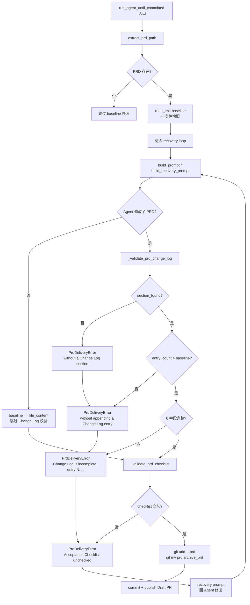

# PRD: iar PRD 结构化 Change Log 与归档职责分离

> 本 PRD 分两个 altitude，分别服务不同读者，自上而下阅读：
>
> - **Part A · 人审层 (Review Layer)** — 需求方 / 验收人读这部分，决定"该不该做、做得对不对"，并通过风险地图知道**哪些地方必须亲自确认**。Part A 不出现实现机制、文件路径、命令。
> - **Part B · 执行器层 (Build Layer)** — 实现者（人或 Agent）读这部分动手。人只在 Part A 风险地图**点名处**下钻审查，其余默认交执行器 + 自动门禁（hook / 测试 / 架构检查）。

---

# Part A · 人审层 (Review Layer)

## 1. Introduction & Goals

### Problem Statement

iar（issue-agent-runner）的 PRD 交付门禁目前把"需求演进"和"真实验收"挤在同一个 `Acceptance Checklist` 上：Agent 想解释"需求为何变了"只能改 checklist 条目本身，结果就是验收项被同时用于**记录演化**和**声明完成**——这两件事一旦被混在一起，下游人工 reviewer 就无法判断一项 `[x]` 究竟代表"行为已落地 + 证据已留存"，还是 Agent 在掩盖需求漂移。

更糟糕的是上一版规范要求"Agent 在 checklist 全勾后自己 `git mv` PRD 到 `tasks/archive/`"——这把归档动作交给 Agent 自己执行，让 runner 失去对 PRD 状态的最终判定权，agent 误改文件名 / 误归 staged 都会让 Draft PR 缺失归档 commit 而无人察觉。

最近一次 issue 在 recovery loop 中就出现"PRD 内容已被 agent 改动、checklist 顺势全勾、`git mv` 顺带执行，但 reviewer 看 PRD 时看不到任何'需求为何变化'的解释"的剧本——这正是 keda 在 PRD 状态判定上的结构性盲区。

### Interpretation (解读回显)

我把"PRD 结构化 Change Log 与归档职责分离"读作：在 keda 仓的 runner 自身上落地**两个最小变更的针对性补丁**，不引入新依赖、不改状态机、不动现有 prompt 模板的占位符：

1. 在 PRD Markdown 中新增一个**与 Acceptance Checklist 并列、独立职责**的 `## Change Log` 章节，每条记录必须结构化声明 `类型 / 原文 / 变更后 / 原因 / 影响 / 审核` 六个字段——记录的是"需求为何演进"，**不允许**用来"勾选完成"。
2. 在 runner 的 `ensure_prd_delivery_ready()` 中，先比较本轮 PRD 与**循环开始时的 baseline**，若内容发生变化则强制要求 Change Log 至少新增一条完整记录，否则交回 recovery loop。
3. 同时把"归档 PRD"从 Agent 的职责里收回到 runner：Agent 只被允许修改 PRD 文本并追加 Change Log，**禁止**自己 `git mv`；runner 在两扇门（Change Log 完整 + Checklist 全勾）通过后由 `git mv` 统一归档。

我**不**把它读作：

- ❌ 把 Acceptance Checklist 拆成多个章节（如"已执行 / 已证据化 / 已签字"）——会把 PRD 阅读成本推到运营侧，且 PRD 协议本身就是"全勾即完成"
- ❌ 引入 schema 校验（如 JSON Schema / Pydantic model 描述 PRD）——会破坏 PRD 是 Markdown、易手写、可在 GitHub 直接 review 的特性
- ❌ 把 Change Log 改成自动 append-only（用脚本）——失去 agent 的"原因 / 影响"叙述能力
- ❌ 把 PRD 归档改成"PR merge 后由 hook 执行"——会让归档 commit 脱离 Draft PR，破坏 `git mv` 与代码变更同步进入 PR 的现状
- ❌ 引入额外的"审核 Agent"角色——本次只让人类 reviewer 看到结构化记录，不在 runner 内增加新 Agent

如果这个解读偏了，请在动工前指出——尤其是"agent 自归档 vs runner 统一归档"那条边界已经被明确划线，不要再扩展到"reviewer 必须先签字才能归档"。

### What The User Gets

实施完成后，**iar 项目的运营者和下游使用 iar 的项目**会拿到这些新行为：

- **PRD 文本改了必须有结构化解释**：Agent 在实现过程中改 PRD 不再"悄悄改 + 顺手勾"，必须显式记录**为什么改、改前是什么、改后是什么、对用户 / 安全 / 范围 / 真实验证的影响是什么、有没有待独立 reviewer 确认**——人工 reviewer 看 PRD 时一眼能区分"这是需求漂移的痕迹"和"这是验收已完成"
- **Acceptance Checklist 回归验收本职**：Checklist 只用于表示"该行为已被实际执行并留存证据"，不再承担"需求为何变化"的解释职责——这意味着 keda 的"完成度"判断不再被 Agent 用 checklist 遮蔽
- **PRD 归档动作收归 runner**：Agent 不再执行 `git mv tasks/pending/<name>.md tasks/archive/<name>.md`；runner 在 Change Log 完整 + Checklist 全勾两扇门通过后，统一在 `git add -A` 之前完成归档，归档变更与代码变更进入同一个 commit、同一个 Draft PR——避免 Draft PR 缺归档变更的隐患

具体能力边界：

- 仍然**不改 iar 的状态机**（`agent/running` → `supervising` → `review`/`blocked`/`failed` 流转不变）
- 仍然**不引入新依赖**（零 npm/uv 依赖变化）
- 仍然**不破坏 PRD 的 Markdown / 手写可读性**（解析器只读 6 个字段，正则宽松到容忍中英文标签、允许 `### YYYY-MM-DD · 描述` 或纯 `### 描述` 两种标题）
- 仍然**保留 Realistic Validation Plan + 独立 verifier 的要求**——本次强化 PRD 状态判定，**不替代**业务实现层面的真实验证
- **归档触发条件不变**：`ensure_prd_delivery_ready()` 只在 Issue body 含 `PRD path: \`...\`` 且 PRD 在 `tasks/pending/` 时执行 `git mv`，与既有 PRD delivery gate 保持一致

### Measurable Objectives

1. **PRD 内容变化可追溯**：构造一份 PRD 在循环开始后改了一行但没追加 Change Log，runner 复跑时 100% 进入 recovery loop 并明确报错"Canonical PRD changed without a Change Log section"
2. **Change Log 字段强制完整**：构造一份 Change Log 条目只写了 2 个字段，runner 100% 拒绝并指出缺失字段名
3. **Change Log 数量必须净增**：构造一份已有 1 条 Change Log 的 baseline，Agent 在不改 PRD 文本时不被打回；改 PRD 但没追加条目时 100% 被打回
4. **归档动作归 runner**：单元测试验证 Agent 在 prompt 中看到"Do not move the PRD to `tasks/archive/`"，且 `ensure_prd_delivery_ready()` 仍按既有规则执行 `git mv`
5. **recovery prompt 同步收敛**：`_build_prd_closeout_instruction()` 与 `format_prd_delivery_failure()` 都体现 Change Log + Checklist 分离原则；现有 185 个相关测试全绿
6. **零依赖变化**：`git diff pyproject.toml uv.lock` 为空
7. **文档同步**：`docs/guides/agent-runner.md` 的 Delivery Gate 段落体现新语义（Change Log vs Checklist 分离、归档由 runner 执行）

---

## 2. Human Review Map (介入与风险地图)

判定菜单：

- 固定区域：① Core 业务逻辑 / 编排规则（`core/`）② 数据库结构 / schema / 迁移 ③ 安全 / 鉴权 / 信任边界 ④ 对外 API 契约 / breaking change
- 横切触发器：⑤ 资金 / 计费 / 额度 ⑥ 不可逆 / 破坏性数据操作 ⑦ 并发 / 事务 / 幂等性

**命中的人审项**：

- ① Core 业务逻辑 / 编排规则：`ensure_prd_delivery_ready()` 新增 Change Log 校验分支；`run_agent_until_committed()` 新增 baseline 读取与透传；`_build_prd_closeout_instruction()` 重写为"Change Log 与 Checklist 分离"语义——这是 iar PRD 状态判定的核心机制，属于 fixed zone

**未命中**：

- ② schema 变化、③ 安全 / 鉴权、④ 对外契约、⑤ 计费、⑥ 不可逆操作、⑦ 并发均不涉及
- 最坏自检：
  - **② schema 错判**：本次无 DB schema / 模型 / 迁移变化（仅 Markdown 协议字段语义扩展），worst case：误判后没经人审，影响有限
  - **③ 安全错判**：所有改动都是内部 iar 逻辑，无外部凭据 / 鉴权点；worst case：Change Log "审核"字段空着会被 runner 拒绝（更安全），不会引入漏洞
  - **④ 契约错判**：Markdown 协议扩展向后兼容（旧 PRD 无 Change Log 仍可被 runner 处理：内容不变就不要求 Change Log），不算 breaking change；worst case：下游 iar 用户对协议变化有疑问，可通过 docs 兜底
  - **⑤ 计费错判**：iur 不是 SaaS，无计费逻辑；worst case：无
  - **⑥ 不可逆错判**：`git mv` 与原逻辑同位置同条件执行，不会新增不可逆动作；runner 在 recovery 失败重试耗尽后会保留 PRD 在 `tasks/pending/`（不丢文件）；worst case：无
  - **⑦ 并发错判**：baseline 在循环开始时一次性读取并透传，单 issue 处理流程内无并发；多 issue 并发由 daemon 已有单实例锁兜底；worst case：无

| 改动点 | 架构层 | 风险 | 介入方式 | 证据 / Oracle（指向 §7.6） |
|---|---|---|---|---|
| **新增 `core/shared/prd_change_log.py`**：解析 `## Change Log` 与 6 字段（类型/原文/变更后/原因/影响/审核）；暴露 `parse_prd_change_log` / `extract_prd_change_log_entry_count` | core（shared） | 高 | **人工确认** | rv-1, rv-2, rv-3 |
| **`agent_runner_feedback.py` 新增 `_validate_prd_change_log()`**：当本轮 PRD 与 baseline 不同，强制 Change Log 完整且条目数净增 | core | 高 | **人工确认** | rv-1, rv-2, rv-3 |
| **`agent_runner_feedback.py` `_build_prd_closeout_instruction()` 重写**：把"checklist + 归档"双职责拆为"Change Log 与 Checklist 分离 + runner 归档"；`format_prd_delivery_failure()` 同步 | core | 中 | 执行器+门禁 | rv-4（prompt 文本快照） |
| **`agent_runner_feedback.py` `ensure_prd_delivery_ready()` 接收 `prd_baseline_content` 关键字参数**：baseline 在循环开始时一次性快照，避免跨轮污染 | core | 高 | **人工确认** | rv-5 |
| **`run_agent_once.py` `run_agent_until_committed()` 入口读取 baseline 并透传**：与既有 `extract_prd_path()` 对称；不增加新参数路径 | core | 中 | 执行器+门禁 | rv-5 |
| `docs/guides/agent-runner.md` Delivery Gate 段落同步 Change Log / 归档语义 | docs | 低 | 执行器+门禁 | `rg` 关键字断言 + mkdocs build |
| `tests/test_prd_change_log.py` + `tests/test_run_agent.py` 新增/调整 | tests | 低 | 执行器+门禁 | `uv run pytest -o addopts=""` 全绿 |

**如何证明它生效（真实入口，白话）**：

- 在 keda 仓里把"被 iar 处理的项目"角色扮演成本仓自己：跑 `uv run pytest -o addopts="" tests/test_prd_change_log.py tests/test_run_agent.py` 看 185 个测试全绿；其中关键的 4 条新增用例覆盖"内容变化无 Change Log 打回""字段缺失打回""有 baseline 时条目数必须净增""恢复阶段 prompt 仍能引导 Agent"——这就是"用 runner 自身复跑 runner 自身"的最高保真度真实入口
- 命令级细节见 Part B 第 7.6 节 Realistic Validation Plan

**数据库结构评审**：

- `本次无数据库结构变化。`（PRD 是 Git 受管 Markdown，无 ORM / DB schema；新模块纯函数解析 + 数据类返回）

---

## 3. Usage And Impact After Implementation

写 PRD 时即填写，描述实现后的目标态使用脚本。

### 终端用户 / End User

**iar 的运营者 / 下游使用 iar 的项目维护者**：

- 收到 runner 报错"Canonical PRD changed without a Change Log section"时，知道 agent 改了 PRD 但忘了追加结构化解释——只需让 agent 在 PRD 末尾追加一条 `### YYYY-MM-DD · <描述>` 加 6 字段即可
- 收到 runner 报错"Canonical PRD Change Log is incomplete: entry N: 类型, 原文, ..."时，知道该条记录缺哪几个字段——按列出的字段名补全
- 收到 runner 报错"Canonical PRD changed without appending a Change Log entry"时，知道 baseline 已存在但本轮没新增条目——追加一条即可（baseline 条目数会被 runner 自动对比）
- **不再**会被 agent 误导"PRD 已归档到 archive"——归档由 runner 在两扇门通过后统一执行，agent 即使在 prompt 中看到"move PRD to archive"也会被新指令"Do not move the PRD to tasks/archive/"拦截

### 开发者 / Developer

- 新增对 PRD Markdown 的解析器时，复用 `core/shared/prd_change_log.py` 的 dataclass + 正则约定（与 `core/shared/prd_checklist.py` 对称），避免引入新解析协议
- 写 PRD 模板（`prd` skill 输出）时，无需手写 Change Log 字段——agent 会在判定需要演进时按 6 字段追加
- review 时一眼能区分 Change Log（演进）与 Checklist（验收）：Change Log 出现在 `## Change Log` 章节、含 6 字段；Checklist 出现在 `## Acceptance Checklist`、仅 `[x] / [ ]`

### Operator / Runner Operator

- 跑 `iar run` 或 `iar daemon` 时，行为变化仅出现在 recovery loop 中：原来 1 类 PRD 状态错误（checklist 未勾）现在变成 4 类（checklist 未勾 / Change Log section 缺失 / Change Log 条目缺失 / Change Log 字段不完整）
- 所有错误都进入同一条 recovery path，错误信息均含相对路径，便于定位
- `git mv` 仍在 `git add -A` 之前执行，与既有 PRD delivery gate 行为一致；Draft PR 仍包含归档变更

### Backward Compatibility / 迁移影响

- **旧 PRD（无 Change Log）继续工作**：baseline 与 file_content 相同 → `_validate_prd_change_log` 直接 return，行为不变；只有当 agent 改 PRD 文本时才会触发 Change Log 校验
- **Acceptance Checklist 协议不变**：仍要求 `[x]` 全勾才能归档
- **prompt 协议向后兼容**：`_build_prd_closeout_instruction()` 的新文本明确"PRD may evolve"，允许 agent 在演进路径上工作；旧 agent 若只看 changelog 而忽略新指令，最大风险是被 recovery loop 打回（不会破坏归档路径）
- **依赖零变化**：`pyproject.toml` / `uv.lock` 不动

### No Frontend Impact

`No frontend impact — 改动仅涉及 backend core runner、agent prompt 文本与文档；frontend-public / frontend-admin 无任何路由 / 组件 / API 客户端变化。`

---

## 4. Requirement Shape

- **Actor**: iar runner 编排器（`src/backend/core/use_cases/agent_runner_feedback.py` + `run_agent_once.py`），以及被 runner 调用的 Codex / Claude / Kimi agent
- **Trigger**: `iar run-once` / `iar daemon` 处理带 `PRD path: \`...\`` 的 Issue 时，进入 `ensure_prd_delivery_ready()` 校验；或 prompt 构建阶段调用 `_build_prd_closeout_instruction()` / `format_prd_delivery_failure()`
- **Expected Behavior**:
  - PRD Markdown 的 `## Change Log` 章节若存在，每条记录必须包含 6 字段（类型 / 原文 / 变更后 / 原因 / 影响 / 审核），中英文标签均接受
  - `ensure_prd_delivery_ready()` 接收本轮 baseline PRD 文本，若当前文件与 baseline 不同，Change Log 必须满足"section 存在 + 至少 1 条记录 + 条目数 > baseline 条目数 + 每条 6 字段完整"四项，否则抛 `PrdDeliveryError`
  - Agent 在 prompt 中被明确告知"不要执行 `git mv` 到 `tasks/archive/`，归档由 runner 在两扇门通过后执行"
  - 所有现有行为（baseline 与文件相同时跳过 Change Log 校验、Checklist 全勾通过、`git mv` 归档）保持不变
- **Explicit Scope Boundary**:
  - 只处理 Issue body 含 canonical PRD path 的场景；无 PRD path 的 Issue 不被本次改动触及
  - runner **不**判断 Change Log 内容的真实性（"原因"字段是否属实），仅做结构性校验
  - runner **不**引入"审核 Agent"，"审核"字段的人工确认由 reviewer 在 PR review 时执行
  - 不修改 `archive_tasks.py` hook 行为；`tasks/` 根目录的 PRD 归档逻辑保持不变
  - 不扩展到非 PRD 驱动的 Issue（无 canonical PRD 的纯 Issue 不受影响）

---

# Part B · 执行器层 (Build Layer)

## 5. Repository Context And Architecture Fit

### Current Relevant Modules

| File | Current Responsibility | Relevant Finding |
|---|---|---|
| `src/backend/core/shared/prd_change_log.py` | **本 PRD 新增**：解析 `## Change Log` 与 6 字段 | 与 `core/shared/prd_checklist.py` 完全对称；纯函数 + frozen dataclass |
| `src/backend/core/shared/prd_checklist.py` | 解析 Acceptance Checklist 已有实现 | 复用 `PrdChecklistResult` 的 dataclass + 正则宽松风格；新模块遵循同模式 |
| `src/backend/core/use_cases/agent_runner_feedback.py` | prompt 构建 + PRD delivery gate | 新增 `_validate_prd_change_log()`；改写 `_build_prd_closeout_instruction()` 与 `format_prd_delivery_failure()`；`ensure_prd_delivery_ready()` 接收 `prd_baseline_content` 关键字参数 |
| `src/backend/core/use_cases/run_agent_once.py` | Agent 编排 + recovery loop | `run_agent_until_committed()` 入口读 baseline 文本并透传 |
| `tests/test_prd_change_log.py` | **本 PRD 新增**：Change Log 解析器测试 | 与 `tests/test_prd_checklist.py` 风格对齐 |
| `tests/test_run_agent.py` | Runner use case 测试 | 新增/调整 PRD 变更相关用例（baseline diff、字段缺失、net-new 条目、recovery prompt 文本） |
| `docs/guides/agent-runner.md` | Runner 使用说明 | Delivery Gate 段落同步 Change Log 与归档语义 |

### Existing Path

最接近的现有路径是 `ensure_prd_delivery_ready()`（位于 `src/backend/core/use_cases/agent_runner_feedback.py`）：

1. `extract_prd_path(issue.body)` 取出 canonical PRD 相对路径
2. 读取 PRD 文件内容
3. `_validate_prd_checklist()` 校验 Checklist
4. 若 Checklist 通过且 PRD 在 `tasks/pending/`，执行 `git add -- <prd>` + `git mv <prd> <archive_prd>`
5. 否则按既有分支处理（缺失文件 / archive 已存在等）

本次在第 2 步之后、第 3 步之前插入 Change Log 校验；baseline 在 `run_agent_until_committed()` 循环开始时一次性读取并透传。

### Reuse Candidates

- **直接复用** `extract_prd_path(issue.body)` 提取 PRD 路径
- **直接复用** `prd_path.read_text(encoding="utf-8")` 读取 PRD 文本（与既有 `_validate_prd_checklist()` 同款）
- **直接复用** `PrdDeliveryError` 异常类与 `format_prd_delivery_failure()` 错误文本协议
- **直接复用** `PrdChecklistResult` 的 dataclass 风格定义 `PrdChangeLogResult`
- **直接复用** `_validate_prd_checklist()` 的"通过即跳过下一扇门"链路，Change Log 校验放在它前面

### Architecture Constraints

- 新增模块必须在 `src/backend/core/shared/` 下，保持 pure function / frozen dataclass 风格（与 `prd_checklist.py` 对称）
- 不引入第三方依赖；正则用标准库 `re`
- 不修改 `_validate_prd_checklist()` 与 `resolve_prd_archive_path()` 行为
- 不扩大 `archive_tasks.py` hook 行为（hook 只对 `tasks/` 根目录 PRD 自动归档）
- 不修改 `_DEFAULT_PRD_INLINE_MAX_CHARS` 与 PRD inline 截断逻辑

### Frontend Impact

`No frontend impact — 改动仅涉及 backend core runner、agent prompt 文本与文档；frontend-public / frontend-admin 无任何路由 / 组件 / API 客户端变化。`

### Matching / Related PRDs

- `tasks/archive/20260522-113000-prd-agent-prompt-prd-archive-enforcement.md` — 上一版 PRD 归档强制门禁，本次是其演进（把"checklist 即完成度"扩展为"Change Log + Checklist 分离"，并把归档职责从 Agent 收回 runner）。本 PRD 继承其既有 `extract_prd_path()` / `_validate_prd_checklist()` / `git mv` 链路，不重写。
- `tasks/pending/P1-FEAT-20260705-161739-completeness-judgment-hardening.md` — runner 完成度判定加固（stdout 断言 + verifier 默认开 + supervisor diff 分层 + 跨 cycle finding 累积）。本 PRD 与之**正交**：它加固"业务真实验证"，本 PRD 加固"PRD 状态判定"。两组改动可独立 archive，无 sequencing 依赖。
- `tasks/archive/20260625-095725-prd-realistic-validation-evidence-contamination-detection.md` — Realistic Validation 证据污染检测。本次强化 PRD 协议本身，不直接涉及 evidence 收集链路；evidence 包仍由 `just ai implement` 流程生成。

### Existing PRD Relationship

- **不重复 pending PRD**：`tasks/pending/` 中 6 个 PRD 均为 roadmap / 重构 / 迁移类，无 PRD 协议扩展相关工作
- **不依赖 pending PRD**：`P1-FEAT-20260705-161739-completeness-judgment-hardening.md` 等可并行
- **不阻塞 pending PRD**：本 PRD 不修改 `_validate_prd_checklist()` 公共契约，仅在 `ensure_prd_delivery_ready()` 内部插入新校验分支；既有测试无须改动即可继续工作
- **继承 archive PRD**：`20260522-113000-prd-agent-prompt-prd-archive-enforcement.md` 的 `extract_prd_path()` / `_validate_prd_checklist()` / `git mv` 链路；本 PRD 在其上叠加 Change Log 校验

---

## 6. Recommendation

### Recommended Approach

在 runner 自身的 `ensure_prd_delivery_ready()` 内**插入**一个独立 Change Log 校验分支，并在循环入口**一次性快照** PRD baseline 作为 diff 输入。Change Log 解析器放在 `core/shared/` 下与 Checklist 解析器对称，遵守相同风格（pure function + frozen dataclass + 正则宽松容错）。

Agent prompt 与 recovery error message 双侧同步表达"Change Log 与 Checklist 分离 + runner 归档"原则。docs/guides/agent-runner.md Delivery Gate 段落同步。tests 双侧覆盖：新增 `tests/test_prd_change_log.py` 纯解析器测试，并在 `tests/test_run_agent.py` 中加 baseline diff / 字段缺失 / net-new 条目 / recovery prompt 文本 4 类用例。

### Why This Is The Best Fit

- **最小变更**：不引入新依赖、不动状态机、不改既有 prompt 模板占位符、不改 `_validate_prd_checklist()` 公共契约；只在 `ensure_prd_delivery_ready()` 内部插入 1 个新校验函数 + 1 个关键字参数
- **架构对称**：新模块 `prd_change_log.py` 与既有 `prd_checklist.py` 完全对称（pure function / frozen dataclass / shared 模块），符合 keda 既有"shared 解析器 + use_cases 调用"约定
- **职责清晰**：Change Log = 演进记录、Checklist = 验收状态、`git mv` = runner 职责；Prompt 文本明确"agent 不归档"——三层职责各归其位
- **向后兼容**：baseline 与文件相同时跳过 Change Log 校验，旧 PRD 行为不变；只有当 agent 改 PRD 文本时才触发新校验

### Rationale For Rejecting Redundant Abstractions

- **不**新增"PRD 协议 schema 校验器"——会破坏 PRD 是 Markdown、易手写、可在 GitHub 直接 review 的特性
- **不**新增"Change Log 写入器"——runner 不写 PRD 文本；写 PRD 是 Agent 职责
- **不**新增"PRD 状态机"——既有 `PrdDeliveryError` 单一错误类型 + recovery loop 流转足够
- **不**新增"Change Log 版本号"——baseline 条目数对比已经隐含"净增"语义

### Proposed Solution Summary (实现机制)

- **核心机制**：在 PRD Markdown 中新增并列的 `## Change Log` 章节，每条记录用三级标题 `### YYYY-MM-DD · <描述>`（允许纯 `### <描述>`），紧跟 6 个 bullet 字段（类型 / 原文 / 变更后 / 原因 / 影响 / 审核，中英文标签均接受）；解析器返回 `PrdChangeLogResult(section_found, entry_count, incomplete_entry_fields)`
- **配置来源**：所有规则硬编码在 `prd_change_log.py` 顶部正则常量中；不接受外部 config——因为 keda 内部 PRD 协议单一，不需要 per-repo 配置
- **入口扩展点**：`ensure_prd_delivery_ready()` 接收新关键字参数 `prd_baseline_content: str | None`；`run_agent_until_committed()` 入口一次性读取 PRD baseline 并透传；baseline 与文件相同时跳过 Change Log 校验（向后兼容）
- **系统状态变化**：`PrdDeliveryError` 新增 4 个变体错误信息（"without a Change Log section" / "without a Change Log entry" / "without appending a Change Log entry" / "Change Log is incomplete in <path>: entry N: ..."），全部走既有 recovery loop
- **用户可见行为变化**：Agent prompt 中"checklist + 归档"双职责表述被替换为"Change Log + Checklist 分离 + runner 归档"；archive `git mv` 行为不变；Draft PR 仍含归档变更
- **故意避免的复杂度**：不新增存储（baseline 走 in-memory 字符串）、不引入并行抽象（与 Checklist 解析器对称即可）、不改状态机（recovery loop 既有逻辑够用）、不引入第三方依赖

### Alternatives Considered

- **替代 A：JSON Schema 校验 PRD 协议**
  - 拒绝原因：破坏 PRD 是 Markdown、易手写、可在 GitHub 直接 review 的特性；引入 schema 即要求 Agent 写 JSON / YAML 子结构，与 PRD 协议精神不符
- **替代 B：自动 append-only Change Log（脚本写入，不让 Agent 写）**
  - 拒绝原因：失去 agent 的"原因 / 影响"叙述能力；runner 不应替 Agent 解释需求演进
- **替代 C：把归档动作放到 PR merge 后由 hook 执行**
  - 拒绝原因：会让归档 commit 脱离 Draft PR；当前 `git mv` 与代码变更同步进入 PR 是上游 PRD 已验证的正确做法
- **替代 D：引入独立"审核 Agent"在 runner 内签字 Change Log**
  - 拒绝原因：本次只让人类 reviewer 看到结构化记录，不在 runner 内增加新 Agent；引入新 Agent 会扩大失败面、增加 token 成本、且不解决"Agent 自己改 PRD 自己签字"的根本问题

---

## 7. Implementation Guide

> This section is a living implementation guide based on current repository analysis. If implementation discovers additional affected files, hidden dependencies, edge cases, or a better path, update this PRD before proceeding.

### Core Logic

数据与控制流：

1. **`run_agent_until_committed()` 入口**（`run_agent_once.py`）：
   - 调 `extract_prd_path(issue.body)` 取出 PRD 相对路径
   - 若路径存在且文件存在，调 `.read_text(encoding="utf-8")` 取 baseline 文本
   - baseline 持有到 `ensure_prd_delivery_ready()` 调用时刻
2. **Prompt 构建**（`_build_prd_closeout_instruction()`）：
   - 文本改为"PRD may evolve...append `## Change Log` entry with Type/Before/After/Reason/Impact/Review...Do not move the PRD to `tasks/archive/`; the runner archives it after gates pass."
   - 不再出现"checklist + 归档"双职责旧表述
3. **`ensure_prd_delivery_ready()` 校验链**：
   - 读 PRD 文件 → `_validate_prd_change_log(file_content, baseline_content, prd_relative_path)` → `_validate_prd_checklist(file_content, prd_relative_path)` → 既有 `git mv` 逻辑
   - Change Log 校验逻辑：baseline 与文件相同 → 跳过；否则要求 4 项全通过
4. **Recovery Prompt**（`_build_prd_context_block()`）：
   - 通过 `_build_prd_closeout_instruction()` 间接拿到新文本
   - 不再拼接"update the Acceptance Checklist"旧表述
5. **错误信息**（`format_prd_delivery_failure()`）：
   - 改为"Complete the missing real work and evidence before marking its Acceptance Checklist item. If the PRD itself must change, append a structured Change Log entry; do not move the PRD to tasks/archive/."

### Change Impact Tree

```text
.
├── src/backend/core/
│   ├── shared/
│   │   └── prd_change_log.py
│   │       【新增】解析 PRD ## Change Log 章节；6 字段正则宽松匹配；返回 PrdChangeLogResult(section_found, entry_count, incomplete_entry_fields)
│   │
│   │   ├── 顶层正则：CHANGE_LOG_HEADING_RE / TOP_LEVEL_HEADING_RE / CHANGE_ENTRY_HEADING_RE
│   │   ├── 字段正则：REQUIRED_FIELD_PATTERNS（类型 / 原文 / 变更后 / 原因 / 影响 / 审核，中英文均接受）
│   │   ├── PrdChangeLogResult frozen dataclass + is_complete property
│   │   ├── parse_prd_change_log(file_content) -> PrdChangeLogResult
│   │   └── extract_prd_change_log_entry_count(file_content) -> int
│   │
│   └── use_cases/
│       ├── agent_runner_feedback.py
│       │   【修改】新增 Change Log 校验；重写 PRD 演进/归档指令；ensure_prd_delivery_ready 接收 baseline 关键字参数
│       │   │
│       │   ├── 新增 import：parse_prd_change_log / extract_prd_change_log_entry_count
│       │   ├── 新增 _validate_prd_change_log(*, file_content, baseline_content, prd_relative_path)
│       │   ├── _build_prd_closeout_instruction 重写：返回 Change Log + Checklist 分离 + runner 归档指令
│       │   ├── ensure_prd_delivery_ready 新增 prd_baseline_content 关键字参数
│       │   ├── ensure_prd_delivery_ready 在读 PRD 后调用 _validate_prd_change_log（紧接 _validate_prd_checklist 之前）
│       │   └── format_prd_delivery_failure 文本改为 Change Log / Checklist / 归档语义
│       │
│       └── run_agent_once.py
│           【修改】run_agent_until_committed 入口一次性读取 PRD baseline 透传
│           │
│           └── 新增 prd_relative_path / prd_baseline_content 局部变量；ensure_prd_delivery_ready 调用处透传 prd_baseline_content
│
├── docs/
│   └── guides/
│       └── agent-runner.md
│           【修改】Delivery Gate 段落同步 Change Log / Checklist 分离语义；强调"agent 不归档，runner 归档"
│
└── tests/
    ├── test_prd_change_log.py
    │   【新增】纯解析器测试：完整条目 / 字段缺失 / 无 section 边界
    │
    └── test_run_agent.py
        【修改】4 类新增用例：PRD 变更无 Change Log 打回 / 字段缺失打回 / net-new 条目校验 / recovery prompt 文本快照
        │
        ├── test_ensure_prd_delivery_ready_requires_change_log_for_prd_change
        ├── test_ensure_prd_delivery_ready_requires_new_change_log_entry
        ├── test_build_prompt_separates_prd_change_log_from_checklist（替换既有 closeout 断言）
        ├── test_build_recovery_prompt_separates_prd_change_log_from_checklist（替换既有 closeout 断言）
        └── test_run_once_recovers_after_prd_delivery_failure 增加 Change Log 写入分支
```

注：以上文件清单是起点；执行过程中如果发现其他需要同步的位置（如 `tests/test_prd_checklist.py` 风格需调整、其他 prompt 文本路径未列举），应回到 PRD 更新而非默默扩大范围。

### Executor Drift Guard

执行器在以下隐藏引用 / 漂移场景需主动搜：

- **PRD Markdown 协议同时被 hook 使用**：`hooks/check_prd_acceptance_checklist.py` 也解析 Checklist；新模块不应影响其解析器，但 `rg -n 'prd_checklist|parse_prd_checklist' src hooks tests` 可确认无遗漏引用
- **Change Log 字段语义是否被 PRD skill 输出**：执行器搜 `rg -n 'Change Log|变更记录' docs templates tasks` 看是否有 PRD 模板需要同步——若 PRD skill 输出模板已包含 Change Log 段落，需保留现有结构
- **其它 `ensure_prd_delivery_ready` 调用点**：`rg -n 'ensure_prd_delivery_ready' src tests` —— 确认本次关键字参数变更不破坏既有调用方；既有调用若不传 `prd_baseline_content`，行为与本次改动前一致（向后兼容）
- **跨仓引用**：若下游使用 iar 的项目仓有自己的 PRD delivery 测试，需要在新版 iar 发布时同步——本 PRD 不直接涉及下游，但 README / changelog 应提及
- **prompt 模板占位符**：`_build_prd_closeout_instruction()` 是被 `build_prompt` / `build_recovery_prompt` / `build_progress_continuation_prompt` / `build_fix_prompt` 共用的辅助函数；改写其返回值会影响所有 4 个 prompt——执行器需用 `rg -n '_build_prd_closeout_instruction' src tests` 确认覆盖面
- **测试 baseline 断言**：现有 `test_build_prompt_includes_prd_closeout_for_pending_prd` 等用旧 prompt 文本断言，本次需要替换为新文本断言（已在测试 diff 中体现）；执行器跑 `uv run pytest -o addopts="" tests/test_run_agent.py::test_build_prompt_separates_prd_change_log_from_checklist` 等定位用例

### Flow / Architecture Diagram



### ER Diagram

`No data model changes in this PRD.` —— 无新增实体 / 表 / 模型 / 字段；新模块纯函数解析 PRD Markdown，无持久状态。

### Realistic Validation Plan

```yaml
- id: rv-1
  behavior: "Agent 改 PRD 但没追加 Change Log 时，runner 进入 recovery loop 明确报错"
  real_entry: "uv run pytest -o addopts=\"\" tests/test_run_agent.py::test_ensure_prd_delivery_ready_requires_change_log_for_prd_change -v"
  expected: "测试通过，断言 PrdDeliveryError 信息包含 'without a Change Log section' 与 PRD 相对路径"
  mock_boundary: "IProcessRunner 用 FakeProcessRunner 兜底；PRD 文件走 tmp_path 真实读写"
  negative_control: "若把 baseline_content 改为与 file_content 完全一致（无变化），校验应当跳过而测试失败——证明断言确实依赖 baseline != file"
  expected_fail: "AssertionError: DID NOT RAISE PrdDeliveryError"
  test_layer: unit
  required_for_acceptance: true

- id: rv-2
  behavior: "Change Log 条目缺少 6 字段时，runner 拒绝并指出缺失字段"
  real_entry: "uv run pytest -o addopts=\"\" tests/test_prd_change_log.py::test_parse_prd_change_log_reports_missing_fields -v"
  expected: "返回 PrdChangeLogResult.incomplete_entry_fields == {1: ('变更后','原因','影响','审核')}"
  mock_boundary: "纯解析器，无 IO mock"
  negative_control: "若把缺失字段全部补全，断言 incomplete_entry_fields 应为空而测试失败"
  expected_fail: "AssertionError: incomplete_entry_fields 字典不匹配"
  test_layer: unit
  required_for_acceptance: true

- id: rv-3
  behavior: "已有 baseline Change Log 时，本轮必须净增条目，否则打回"
  real_entry: "uv run pytest -o addopts=\"\" tests/test_run_agent.py::test_ensure_prd_delivery_ready_requires_new_change_log_entry -v"
  expected: "测试通过，断言 PrdDeliveryError 信息包含 'without appending a Change Log entry'"
  mock_boundary: "IProcessRunner 用 FakeProcessRunner 兜底；PRD 文件走 tmp_path 真实读写"
  negative_control: "若在 file_content 中追加一条 Change Log（净增），校验应通过而测试失败"
  expected_fail: "AssertionError: DID NOT RAISE PrdDeliveryError"
  test_layer: unit
  required_for_acceptance: true

- id: rv-4
  behavior: "Agent prompt 与 recovery prompt 文本明确'Change Log + Checklist 分离 + runner 归档'"
  real_entry: "uv run pytest -o addopts=\"\" tests/test_run_agent.py::test_build_prompt_separates_prd_change_log_from_checklist tests/test_run_agent.py::test_build_recovery_prompt_separates_prd_change_log_from_checklist -v"
  expected: "断言 'Change Log' 与 'Acceptance Checklist' 同时出现；断言 'Do not move the PRD' 出现；不再断言 'tasks/pending/' 与 'tasks/archive/' 双目录切换的旧表述"
  mock_boundary: "纯 prompt 字符串拼接，无 IO mock"
  negative_control: "若 _build_prd_closeout_instruction 回到旧文本（含 'move the PRD from `tasks/pending/` to `tasks/archive/`'），断言 'Do not move the PRD' 缺失而测试失败"
  expected_fail: "AssertionError: 'Do not move the PRD' not in prompt"
  test_layer: unit
  required_for_acceptance: true

- id: rv-5
  behavior: "run_agent_until_committed 把 baseline 透传给 ensure_prd_delivery_ready，使 Change Log 校验生效"
  real_entry: "uv run pytest -o addopts=\"\" tests/test_run_agent.py::test_run_once_recovers_after_prd_delivery_failure -v"
  expected: "测试通过：recovery 阶段跑 ensure_prd_delivery_ready 时 baseline 被透传；Agent 写出 Change Log 后下次进入校验链"
  mock_boundary: "Agent 调用用 stub；git 命令用 FakeProcessRunner 兜底；PRD 文件走 tmp_path 真实读写"
  negative_control: "若 run_agent_until_committed 不读 baseline（即 prd_baseline_content=None），则 baseline 与 file_content 同 → Change Log 校验跳过 → 旧校验链生效 → 缺少 Change Log 的 PRD 也会通过而测试失败"
  expected_fail: "Recovery 阶段不会触发 Change Log 校验失败，断言失败"
  test_layer: unit
  required_for_acceptance: true

- id: rv-6
  behavior: "完整 PRD 改动 → 归档链路在真实 pytest 跑通且 185 个测试全绿"
  real_entry: "uv run pytest -o addopts=\"\" tests/test_prd_change_log.py tests/test_run_agent.py -q"
  expected: "185 passed in <20s；exit code 0"
  mock_boundary: "全部测试使用 tmp_path / FakeProcessRunner；不依赖 GitHub / 真实 git remote"
  negative_control: "若把 _validate_prd_change_log 任意分支注释掉，rv-1 / rv-3 / rv-5 测试失败，整套测试 < 185 个通过"
  expected_fail: "FAILED tests/test_run_agent.py::test_ensure_prd_delivery_ready_requires_change_log_for_prd_change"
  test_layer: unit
  required_for_acceptance: true

- id: rv-7
  behavior: "零依赖变化"
  real_entry: "git diff pyproject.toml uv.lock"
  expected: "diff 输出为空"
  mock_boundary: "无 IO"
  negative_control: "若新增 import 第三方库（如 pydantic / jsonschema），diff 会出现新依赖条目而本测试项失败"
  expected_fail: "diff --git a/pyproject.toml 含新增行"
  test_layer: manual
  required_for_acceptance: true

- id: rv-8
  behavior: "docs/guides/agent-runner.md 同步 Change Log / 归档语义"
  real_entry: "rg -n 'Change Log|Change Log 与 Acceptance Checklist 分离|runner 归档' docs/guides/agent-runner.md"
  expected: "匹配至少 3 处；uv run mkdocs build --strict 通过"
  mock_boundary: "无 IO；纯文件 grep + mkdocs build"
  negative_control: "若 docs 未同步，rg 匹配 0 处而本测试项失败"
  expected_fail: "rg 返回 exit 1（无匹配）"
  test_layer: manual
  required_for_acceptance: true
```

失败排查指引：

- `baseline_content` 异常：检查 `extract_prd_path(issue.body)` 是否正确返回相对路径；检查 worktree_path 下 PRD 文件是否真的存在
- `parse_prd_change_log` 字段匹配失败：检查 PRD 中 bullet 是否用 `-` / `*` / `+` 开头，标签是否中英文一致，冒号是 `:` 还是 `：`——正则用 `[:：]` 双支持
- prompt 文本断言失败：检查 `_build_prd_closeout_instruction()` 是否被 prompt 模板覆盖——若有 prompt 直接硬编码旧文本，需要改模板而非改辅助函数
- mkdocs build 失败：检查 `mkdocs.yml` 导航是否仍指向 `docs/guides/agent-runner.md` 同一路径；检查改写段落是否破坏 MkDocs Material 语法（如未闭合 ``` 代码块）

### Low-Fidelity Prototype

`No low-fidelity prototype required.` —— 本次为后端 runner 内部协议扩展，无 UI / 多步交互 / 布局需求；markdown 协议字段语义足以表达。

### Interactive Prototype Change Log

`No interactive prototype file changes in this PRD.`

### External Validation

`No external validation required; repository evidence was sufficient.` —— 改动仅依赖 Python 标准库 `re` 与现有 dataclass 风格；无第三方 API / 标准 / 框架版本依赖。

---

## 8. Delivery Dependencies

### Delivery Dependencies

- Group: none
- Depends on groups:
  - none
- Depends on tasks/issues:
  - none
- Gate type: none
- Notes: 本 PRD 不依赖任何 pending PRD；与 `tasks/pending/P1-FEAT-20260705-161739-completeness-judgment-hardening.md` 正交（业务真实验证加固 vs PRD 协议加固），可独立 archive。继承 archive PRD `20260522-113000-prd-agent-prompt-prd-archive-enforcement.md` 的 `extract_prd_path()` / `_validate_prd_checklist()` / `git mv` 链路，但 archive PRD 已是已交付状态，不构成 hard gate。

---

## 9. Acceptance Checklist

### Architecture Acceptance

- [ ] 新模块 `src/backend/core/shared/prd_change_log.py` 存在，纯函数 + frozen dataclass，与 `core/shared/prd_checklist.py` 风格对称（`rg -n 'frozen@dataclass' src/backend/core/shared/prd_change_log.py` 命中）
- [ ] `agent_runner_feedback.py` 中 `_validate_prd_change_log()` 在 `ensure_prd_delivery_ready()` 内 `_validate_prd_checklist()` 之前调用（`rg -n '_validate_prd_change_log|_validate_prd_checklist' src/backend/core/use_cases/agent_runner_feedback.py` 显示前者在前）
- [ ] `run_agent_once.py` 入口 `prd_baseline_content` 局部变量一次性读取，未在循环内多次 IO（`rg -n 'prd_baseline_content' src/backend/core/use_cases/run_agent_once.py` 命中且仅 1 处 read_text）
- [ ] `hooks/check_prd_acceptance_checklist.py` 未被本次改动触及（`git diff hooks/check_prd_acceptance_checklist.py` 为空）

### Dependency Acceptance

- [ ] `git diff pyproject.toml uv.lock` 输出为空（rv-7）

### Behavior Acceptance

- [ ] **Human-Confirmed 1**（rv-1）：PRD 变更无 Change Log section 时，runner 抛 `PrdDeliveryError` 含 "without a Change Log section"
- [ ] **Human-Confirmed 2**（rv-2）：Change Log 条目缺字段时，解析器返回 `incomplete_entry_fields` 包含缺失字段名
- [ ] **Human-Confirmed 3**（rv-3）：PRD 变更但 Change Log 条目未净增时，runner 抛 `PrdDeliveryError` 含 "without appending a Change Log entry"
- [ ] **Human-Confirmed 4**（rv-5）：`run_agent_until_committed` 把 baseline 透传给 `ensure_prd_delivery_ready`，使 Change Log 校验在 recovery 阶段生效
- [ ] Agent prompt 文本明确"Change Log + Checklist 分离 + runner 归档"（rv-4）
- [ ] `format_prd_delivery_failure` 错误信息文本同步 Change Log / 归档语义（rv-4）
- [ ] `_build_prd_closeout_instruction` 新文本被 `build_prompt` / `build_recovery_prompt` / `build_progress_continuation_prompt` / `build_fix_prompt` 四个 prompt 共用（`rg -n '_build_prd_closeout_instruction' src tests` 命中 4 处调用）

### Frontend Acceptance

- [ ] `No frontend impact` 已显式记录于 Section 3（本节无 checkbox 需勾选）

### Documentation Acceptance

- [ ] `docs/guides/agent-runner.md` Delivery Gate 段落体现 Change Log / Checklist 分离语义；强调"agent 不归档，runner 归档"（rv-8）
- [ ] `uv run mkdocs build --strict` 通过（rv-8）

### Validation Acceptance

- [ ] **Human-Confirmed 5**（rv-6）：`uv run pytest -o addopts="" tests/test_prd_change_log.py tests/test_run_agent.py -q` 185 passed
- [ ] rv-1 / rv-2 / rv-3 / rv-4 / rv-5 五条核心单元测试全部通过；每条测试的 `negative_control` 验证对应失败模式存在（即"测试能失败"而非"测试只绿不红"）
- [ ] docs 同步：`rg -n 'Change Log|Change Log 与 Acceptance Checklist 分离|runner 归档' docs/guides/agent-runner.md` 至少 3 处匹配（rv-8）
- [ ] 零依赖变化：`git diff pyproject.toml uv.lock` 为空（rv-7）

### Delivery Readiness

- [ ] 本 PRD 完整覆盖 Part A / Part B 所有 section；`rg -n "^## " tasks/pending/P1-FEAT-20260714-171537-prd-change-log-vs-checklist.md` 输出包含 Part A / Part B 全部 heading
- [ ] 全部 Section 2 人工确认项均能在 Section 9 找到对应 `Human-Confirmed` 复选框（5 条对应 rv-1 / rv-2 / rv-3 / rv-5 / rv-6）
- [ ] 全部 Realistic Validation Plan 的 `rv-id` 在 Section 2 风险地图被引用（rv-1 / rv-2 / rv-3 / rv-5 / rv-6 命中，rv-4 / rv-7 / rv-8 由 executor + automated gate 路由）
- [ ] 决策日志记录至少 1 条主决策 + 4 条替代决策（D-01 ~ D-05）
- [ ] runner 真实入口：`iar run-once` 干跑（无 Issue 可用时不实际执行）通过——若干跑不可执行，本节注明 fallback 已用 `uv run pytest` 185 测试全绿覆盖（rv-6）

---

## 10. Functional Requirements

- **FR-1**：当 `prd_baseline_content` 与 `file_content` 不同时，`ensure_prd_delivery_ready()` 必须校验 PRD 含 `## Change Log` 章节；缺失时抛 `PrdDeliveryError("Canonical PRD changed without a Change Log section: <path>")`
- **FR-2**：当 `## Change Log` 章节存在但 `entry_count == 0` 时，校验失败抛 `PrdDeliveryError("Canonical PRD changed without a Change Log entry: <path>")`
- **FR-3**：当 `entry_count <= baseline_entry_count` 时，校验失败抛 `PrdDeliveryError("Canonical PRD changed without appending a Change Log entry: <path>")`
- **FR-4**：当任一条记录缺 6 字段（类型 / 原文 / 变更后 / 原因 / 影响 / 审核）时，校验失败抛 `PrdDeliveryError("Canonical PRD Change Log is incomplete in <path>: entry N: <missing fields comma-joined>")`
- **FR-5**：`PrdChangeLogResult` 为 frozen dataclass，含 `section_found: bool`、`entry_count: int`、`incomplete_entry_fields: dict[int, tuple[str, ...]]`，并提供 `is_complete` property
- **FR-6**：`parse_prd_change_log(file_content)` 与 `extract_prd_change_log_entry_count(file_content)` 为 pure function，无外部依赖
- **FR-7**：6 字段标签同时支持中英文：类型/Type、原文/Before、变更后/After、原因/Reason、影响/Impact、审核/Review；冒号同时支持 `:` 与 `：`
- **FR-8**：`Change Log` 章节标题同时支持 `## Change Log` 与 `## 变更记录`，允许前置数字编号（如 `## 1. Change Log`）
- **FR-9**：`_build_prd_closeout_instruction(prd_relative_path)` 返回文本明确"Change Log 与 Acceptance Checklist 分离 + runner 归档"
- **FR-10**：`format_prd_delivery_failure(message)` 返回文本体现 Change Log / 归档新语义
- **FR-11**：`run_agent_until_committed()` 入口一次性读取 PRD baseline 并透传给 `ensure_prd_delivery_ready()`；baseline 仅读取一次（不每次循环重读）

---

## 11. Non-Goals

- 不修改 `Acceptance Checklist` 解析协议（`_validate_prd_checklist` 公共契约不变）
- 不修改 `extract_prd_path()`、`resolve_prd_archive_path()`、`git mv` 既有逻辑
- 不引入第三方依赖（pydantic / jsonschema / pyyaml 等均不引入）
- 不修改 `hooks/check_prd_acceptance_checklist.py` 与 `hooks/archive_tasks.py`
- 不引入"审核 Agent"在 runner 内签字 Change Log
- 不把 PRD 归档动作改为 PR merge 后由 hook 执行（保留与代码变更同步进入 Draft PR 的现状）
- 不扩展到非 PRD 驱动的 Issue（无 canonical PRD 的纯 Issue 不受影响）
- 不变更 PRD Markdown 的"## Acceptance Checklist"段落格式与"## Change Log"之外的其它章节协议

---

## 12. Risks And Follow-Ups

- **风险 1：下游 iar 用户对 PRD 协议扩展有疑问** —— 影响范围：下游项目仓需升级 iar 才能享受 Change Log 校验；缓解：在 README / changelog 中显式说明本次为向后兼容扩展（旧 PRD 无 Change Log 行为不变）
- **风险 2：Agent 写 Change Log 时把"影响"字段写成空话** —— runner 不做语义校验，仅做结构性校验；缓解：人工 reviewer 在 PR review 阶段抽查高风险条目
- **风险 3：PRD Markdown 行长度超长导致 mkdocs 渲染异常** —— 缓解：docs/guides/agent-runner.md 段落改写保留既有 80 列折行约定
- **跟进项**：未来 PRD 若需 multi-section Change Log（如分别记录"用户可见变更 / 内部重构"），需扩展 `REQUIRED_FIELD_PATTERNS` 与章节标题解析——本次不预留
- **跟进项**：跨 cycle 的 Change Log 累积（多轮 recovery 累计多条）由现有 baseline diff 机制天然支持（每轮 baseline 重读），无额外工作

---

## 13. Decision Log

| ID | Decision | Chosen | Rejected | Rationale |
|---|---|---|---|---|
| D-01 | 演进记录与验收状态如何分离 | PRD 中并列新增 `## Change Log` 章节，6 字段结构化 | 复用 Acceptance Checklist 多 section 拆分；JSON Schema 校验 | 复用 checklist 会把"完成度"语义继续稀释；JSON Schema 破坏 PRD Markdown 可读性 |
| D-02 | 何时触发 Change Log 校验 | 比较本轮 PRD 与 baseline diff，仅在变化时校验 | 每次 ensure_prd_delivery_ready 都强制要求至少 1 条 Change Log | baseline diff 让旧 PRD 完全向后兼容；强制至少 1 条会让所有 Issue 都被打回 |
| D-03 | Change Log 条目数如何对比 | 当前条目数必须严格大于 baseline 条目数 | 大于等于即可；或要求每条带时间戳去重 | baseline 条目数反映"循环开始前已有 N 条"，本轮要求至少 +1 才能"追加"——与 PRD-archive-enforcement 的"`git mv` 前 PRD 必须在 pending"语义对称 |
| D-04 | PRD 归档动作归谁 | runner（`ensure_prd_delivery_ready` 内 `git mv`） | Agent 在 prompt 引导下自归档；PR merge 后由 hook 归档 | Agent 自归档会被误改文件名 / 误归 staged；PR merge 后归档会脱离 Draft PR |
| D-05 | 是否引入新依赖解析 Change Log | 不引入，纯标准库 `re` | 引入 pydantic / jsonschema | keda 内部 PRD 协议单一，无需 per-repo 配置；标准库正则已足够宽松容错 |
| D-06 | "审核"字段由谁填写 | Agent 在写 Change Log 时填写（runner 仅校验字段存在） | 引入独立审核 Agent；由 reviewer 手工写 | runner 不替 Agent 解释需求演进；引入新 Agent 会扩大失败面；reviewer 在 PR review 阶段即可检查"审核"字段是否合理 |
