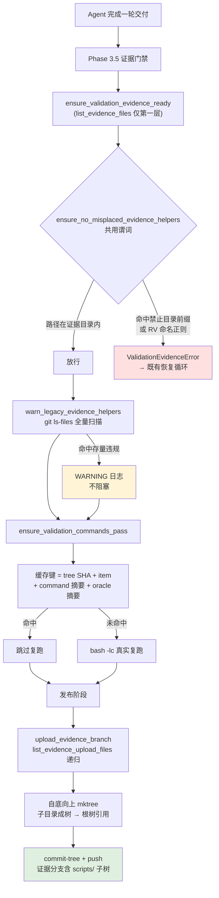

# PRD: RV Oracle 统一收敛到证据目录（取消 scripts/rv_evidence 豁免口）

> 本 PRD 分两个高度阅读：
> **Part A · 人审层**（第 1–4 节）给人看——问题、交付价值、人工介入地图、需求形状，不含实现机制、文件路径与命令。
> **Part B · 执行器层**（第 5–13 节）给执行器看——机制、改动树、验证命令、依赖元数据。人只在 Part A 的 Human Review Map 指到的地方下钻。

---

# Part A · 人审层 (Review Layer)

## 1. Introduction & Goals

### Problem Statement

keda 的 Realistic Validation 证据门禁要求 agent 把「仅用于取证的脚本」留在证据目录、不进代码 diff，但同时开了一个豁免口：PRD 明确需要复跑的 RV oracle 可以提交到代码树的一个固定目录下。

这条规则有条件（"PRD 要求的可复跑命令才行"），但门禁没有任何一处校验这个条件——它只比对路径形状。结果是：只要 agent 把一次性脚本起成合规名字放进合规目录，就自动获得进入产品代码树的许可。

2026-07-30 的 freshai issue-113 是实证：agent 生成了 9 个故障注入脚本放进该目录，而该任务的 PRD 全文没提过这个目录，evidence 清单里 8 条复跑命令没有一条引用这些脚本。按规则它们本该留在证据目录，门禁却全部放行。这些脚本最终既没被提交（对复跑毫无价值），也没留在证据目录（不会被清理，长期滞留在 worktree 里）。

受影响的三方都在承担成本：

- **被 runner 开发的下游仓库**：产品代码树里堆积与产品功能无关的取证脚本；已有 6 个这类文件被历史交付提交进 freshai 主干，门禁看不见它们（它只检查本次变更路径）。
- **人类审阅者**：证据分支上只有产出物，没有产出这些产出物的 oracle。看到"注入故障后错误码返回 200"的证据文件，却看不到故障是怎么注入的——而这恰恰是最需要被审的部分。
- **门禁自身的可信度**：复跑缓存按已提交代码树的指纹判断"这条命令在这份代码上已通过"。证据目录被 git 排除，所以放在证据目录里的 oracle 不参与指纹计算。这意味着 oracle 的断言可以被改空，缓存键却不变，门禁会继续报告"已通过、跳过复跑"。

根因不在模型判断力：规则要求 agent 判断"这个脚本算不算 PRD 要求的可复跑 oracle"，而做这个判断所需的信息（证据清单里的命令列表）从未出现在给它的指令中；同时形状匹配的门禁对判断错误零反馈。**把一个无法执行的判断交给执行器，再用一个无法识别该判断的门禁兜底，必然漏。**

### Interpretation (解读回显)

我把这个需求读成：**取消"RV oracle 可以进代码树"这个选项本身，让规则退化为一条执行器能可靠遵守的无判断规则——RV 脚本一律放证据目录**；并且在取消之前，先补齐证据目录当前缺失的三项能力，否则取消就是功能倒退。

- 读作"消除判断点"，**不是**"把判断规则写得更详细"。让执行器不再需要区分两类脚本，而不是教它区分得更准。
- 读作"证据目录升为一等公民"，**不是**"简单禁止 + 不管 oracle 去哪"。取消豁免口的前提是证据目录能同时做到持久、可审、参与缓存指纹。
- 读作"前瞻硬失败 + 存量只告警"，**不是**"回溯扫描直接判红"。已提交在树里的历史违规不阻塞任何交付，只在日志里可见。
- 读作"keda 自己先合规"，**不是**"只改规则不动源码仓"。keda 主干当前有 12 个该目录下的已跟踪文件，全部删除；其中一个是某待办 PRD 的 oracle，该 PRD 的验证计划同步改写。
- 读作"降低对模型判断力的依赖"，**不是**"提高对模型判断力的要求"。任何要求执行器做语义判断的方案都不算完成本需求。

### What The User Gets

**对被 runner 开发的下游仓库**：交付出来的代码 diff 里不再混入取证脚本。规则从"看情况——PRD 要求的可以放代码树，其余放证据目录"变成一句没有例外的话："RV 脚本一律放证据目录"。执行器不再需要做判断，也就不会判断错。

**对人类审阅者**：证据分支从"只有产出物"变成"产出物 + 产出它们的 oracle 源码"。审阅一条 RV 结论时可以直接读到断言是怎么写的、故障是怎么注入的、负向对照是怎么构造的，而不必相信一份无法追溯来源的文本输出。

**对门禁自身**：oracle 内容变化会让复跑缓存失效。改动 oracle 的断言之后，门禁必然重新真实执行一次，不会再用旧结论放行。

**对既有历史包袱**：门禁会在日志里点名仓库里已经提交的历史违规文件，但不阻塞交付——存量清理是可以另行安排的工作，不是下一次交付的前置条件。

### Measurable Objectives

| 目标 | 当前 | 交付后 |
|---|---|---|
| 执行器需要做的语义判断数 | 1（"这脚本算不算 PRD 要求的可复跑 oracle"） | 0 |
| 给执行器的 prompt 中合法的代码树脚本目的地 | 1 个 | 0 个 |
| 证据分支上可见的 oracle 源码 | 0 | 全部 |
| oracle 内容变更后复跑缓存的行为 | 继续命中旧结论 | 必然失效并真实重跑 |
| 门禁能识别的错放形态 | 3 个硬编码目录名 | 4 个目录名 + 一条与目录名无关的 RV 命名规则 |
| keda 主干中该目录下的已跟踪文件 | 12 | 0 |
| 存量历史违规对交付的阻塞 | 不可见 | 可见且不阻塞 |

## 2. Human Review Map (介入与风险地图)

### 参考菜单

固定人审区：① core 业务逻辑 / 编排（`core/`）；② 数据库结构 / schema / migration；③ 安全 / 认证 / 信任边界；④ 对外 API 契约 / 破坏性变更。
跨切触发器：⑤ 金额 / 计费 / 配额；⑥ 不可逆或破坏性数据操作；⑦ 并发 / 事务 / 幂等。

### 命中的人审项

- **①** 门禁判定逻辑与复跑缓存键都在 `core/` 的交付阻塞路径上——判错会让不该过的交付通过，或让该过的交付卡死在恢复循环里。
- **③** 证据分支从只承载产出物变为同时承载 oracle 源码，出网内容的面扩大；仓库当前没有任何自动化密钥扫描 hook 兜底。
- **④** 给 agent 的 prompt 是 keda 对所有下游仓库的对外契约，本次是破坏性收缩（删除一个此前合法的目的地）；证据分支的树形也从扁平变为嵌套，改变了下游读取者看到的结构。

### 未命中

② / ⑤ / ⑥ / ⑦ 均不涉及，一并走执行器 + 自动门禁：无 schema 变化；无金额与配额；无不可逆数据操作（删除 12 个已跟踪文件是 git 可回溯的源码删除，且经用户明确决定）；无新并发或事务路径。

### 分类表

| 改动点 | 架构层 | 风险 | 介入方式 | 证据 / Oracle |
|---|---|---|---|---|
| 门禁规则从「形状白名单」改为「目录黑名单 + RV 命名正则」，删除豁免分支 | core | 高（交付阻塞路径，判错双向致命） | 人工确认（高证据负担） | rv-1, rv-2, rv-5 |
| 证据分支新增上传 oracle 源码（出网面扩大，无密钥扫描兜底） | core → infrastructure（git push） | 高（信任边界） | 人工确认（高证据负担） | rv-3, rv-6 |
| Agent prompt 契约收缩 + 证据分支树形由扁平改嵌套（对下游破坏性） | core（对外契约） | 高（所有下游仓库同时受影响） | 人工确认（高证据负担） | rv-6, rv-3 |
| 复跑缓存键并入 oracle 内容摘要 | core | 中（错则缓存过度失效或继续漏放） | 执行器 + 门禁：rv-4 双向断言（改脚本必重跑 / 不改脚本必命中） | rv-4 |
| `list_evidence_files` 保持仅第一层，新增独立的递归上传清单函数 | core | 中（复用同一个函数会污染证据覆盖率匹配与视觉证据判定） | 执行器 + 门禁：rv-7 断言 oracle 源码不被当作某条清单项的证据文件 | rv-7 |
| 存量违规全仓扫描（只告警不阻塞） | core | 低 | 执行器 + 门禁：rv-5 断言存量文件存在时门禁仍通过且 WARNING 出现 | rv-5 |
| 删除 keda 自身 12 个已跟踪文件 | 源码树 | 低（git 可回溯） | 执行器 + 门禁：`git ls-files` 搜索断言为空 | rv-8 |
| 改写待办锚定 PRD 的验证计划 | 文档 | 低 | 执行器 + 门禁：`rg` 断言旧路径归零 | rv-8 |
| 文档三处同步 | 文档 | 低 | 执行器 + 门禁：`rg` 断言旧措辞归零 | rv-8 |

**未命中项的最坏情况**：缓存摘要算错 → 最坏是每次都重跑（浪费时间，不会放过错误结论），方向安全；递归函数复用错 → oracle 源码被误判为某条清单项的证据，让缺证据的清单项蒙混过关，rv-7 专门拦这个；存量扫描误报 → 只是日志噪音；删文件与改文档出错 → 搜索断言直接暴露。均不严重也不可逆，可留在未命中。

### 如何证明它生效（真实入口，白话）

在一个真实的临时 git 仓库里建真实的 worktree，把脚本按各种方式摆放，然后直接调用 keda 的门禁函数，看它该拒的拒、该放的放；再真实地把证据推到一个本地 git 远端上，从推出去的提交里独立读回内容，确认 oracle 源码确实随证据一起到达了；最后真实跑两遍复跑门禁，中间只改 oracle 脚本的内容，确认第二遍真的重新执行了命令而不是报"已通过"。

本 PRD 自身的 oracle 脚本必须放在证据目录下——**如果它们能被本 PRD 交付的门禁放行，说明新规则自洽**。

### 数据库结构评审

本次无数据库结构变化。

## 3. Usage And Impact After Implementation

### 角色 A：被 runner 开发的下游仓库里的执行 Agent

拿到的指令从"取证脚本放证据目录，但 PRD 要求的可复跑 oracle 可以提交到代码树某个固定目录"，变成一句无条件的话："所有 RV 脚本——取证的、临时 setup 的、可复跑 oracle——一律放证据目录下的 `scripts/` 子目录，代码 diff 里不许出现任何 RV 脚本。"

写 evidence 清单时，需要复跑的命令直接指向证据目录里的脚本即可，不需要再判断这个脚本"算不算 PRD 要求的"。

如果它仍然往代码树里放 RV 脚本，门禁会拒绝并进入既有的恢复循环，错误信息直接给出正确目的地。

### 角色 B：审阅交付的人

打开证据分支时，除了原有的证据产出物，还能看到一个 `scripts/` 目录，里面是产生这些产出物的 oracle 源码。审一条"注入故障后返回 200"的结论时，可以直接读到故障注入的实现，判断这个负向对照是否真的有判别力。

PR 上的证据评论会列出带路径前缀的条目，`scripts/` 下的条目一眼可辨。

### 角色 C：keda 的运维者

门禁在跑的时候，如果发现仓库里已经提交了历史遗留的取证脚本，会在日志里点名这些文件，但不会让交付失败。这些提示可以攒着，另行安排清理。

如果某个仓库的复跑缓存此前一直命中，本次上线后第一次运行会因为摘要口径变化而全部重跑一遍，属于一次性成本。

### 对既有行为的影响

- **向后兼容**：evidence 清单格式、命令写法、证据文件命名规则、证据格式核对规则全部不变。
- **破坏性**：任何仍在引用旧目录的待办 PRD 需要改写验证计划——本仓库内只有一份，随本次交付一并改。
- **不需要新配置**：本次不新增任何配置项，不改 `config.toml` / `.env.example`。
- **一次性成本**：上线后各仓库首次运行会失去复跑缓存命中，重跑一轮。

## 4. Requirement Shape

- **Actor**：keda 的 Realistic Validation 证据门禁；被它驱动的执行 Agent；读证据分支的人类审阅者。
- **Trigger**：执行 Agent 完成一轮交付、门禁在发布前检查证据与变更路径时；以及发布阶段上传证据到证据分支时。
- **Expected behavior**：
  1. 给 Agent 的指令中不存在任何"RV 脚本可进代码树"的选项。
  2. 新增的 RV 脚本若落在代码树中，门禁拒绝并给出正确目的地。
  3. 证据目录下的 oracle 源码随证据一起进入证据分支。
  4. oracle 内容变化必然使复跑缓存失效。
  5. 已提交在树里的历史违规被点名但不阻塞交付。
- **Scope boundary**：只改 keda 的证据门禁、证据上传、复跑缓存与相应 prompt/文档，以及 keda 自身的存量清理。不改 evidence 清单格式，不改验证流程编排，不改下游仓库的任何文件。

---

# Part B · 执行器层 (Build Layer)

## 5. Repository Context And Architecture Fit

### 当前相关模块

| 路径 | 职责 |
|---|---|
| `src/backend/core/use_cases/agent_runner_validation.py` | 证据门禁主模块：prompt 构造、证据目录排除与枚举、错放守卫、复跑与缓存。868 非空行 |
| `src/backend/core/use_cases/agent_runner_validation_publication.py` | 证据分支上传与 PR 评论。266 非空行 |
| `src/backend/core/use_cases/agent_runner_evidence_format.py` | `collect_evidence_coverage_problems`：按 `rv-<n>-*` 文件名核对清单覆盖 |
| `src/backend/core/use_cases/agent_runner_structured_evidence.py` | `evidence.json` manifest 模型与校验；`EvidenceBlock.command` / `negative_control` |
| `src/backend/core/use_cases/run_agent_execution_loop.py` | Phase 3.5 依次调用证据就绪、错放守卫、复跑门禁 |
| `src/backend/core/shared/models/agent_runner.py` | `ValidationConfig` 领域配置 |
| `tests/test_agent_runner_validation.py` | 门禁单测，含断言旧豁免口合法的用例 |

### 现有架构模式

四层依赖方向 `api → core → engines → infrastructure` 不变；本次全部改动落在 `core/use_cases/`，通过 `IProcessRunner` 接口执行 git 命令，不直接触碰 infrastructure 实现。

`IProcessRunner.run` 的签名为 `(command, *, cwd, check, timeout, inactivity_timeout, capture_output, input_text, label)`——**没有 `env` 参数**。这直接约束了嵌套 tree 的构造方式（见 6.3）。

### 现有关键约束

- 证据目录经 `git rev-parse --git-path info/exclude` 写入本地排除规则，不进版本库；复跑缓存文件放在证据目录**同级**（`.iar/rv_reexec_cache.json`），不在证据目录内，因此递归遍历证据目录不会误收缓存。
- `list_evidence_files` 当前被三处调用，语义各不相同：视觉证据判定（按后缀找截图/录屏）、证据就绪与覆盖率核对（按 `rv-<n>-*` 文件名对账）、证据分支上传（要全部文件）。前两者必须保持只看第一层。
- `git mktree` 是扁平的，只接受单层条目；嵌套目录需要自底向上先构造子树。

### 前端影响

`No frontend impact` —— 本次改动全部位于 runner 的证据门禁路径，`frontend-admin/` 无任何用户可见界面变化。

### 与既有 PRD 的关系

| PRD | 关系 | 处理 |
|---|---|---|
| `tasks/pending/P1-BUG-20260704-153640-agent-runner-memory-stable-anchoring.md` | **本 PRD 阻塞它**。它的 rv-1/rv-2/rv-3 的 `real_entry` 与 `negative_control` 共 5 处指向 `scripts/rv_evidence/rv_anchor_cross_worktree.py`，Change Impact Tree 里也有一行新增该文件 | 本次交付一并改写其验证计划到证据目录，并删除该改动树条目 |
| `tasks/pending/P1-REFACTOR-20260705-210702-file-line-split-seven-files.md` | 软冲突。其第 ⑦ 批计划把 `agent_runner_validation.py` 按 validators / evidence / gate 三块拆到 ≤800 行 | 本次新增代码全部归入"evidence"块，不打乱该切分边界；两者谁先落地另一方 rebase |
| `tasks/archive/P1-FEAT-20260626-093933-agent-runner-memory-persistence.md` | 历史来源。豁免口正是它的交付笔记提出的——当时 evidence 清单的 `command` 全是多行内联 `python -c`，无法独立复跑 | 归档 PRD 是历史记录，**不改写**；本 PRD 在决策记录中说明它提出的问题由证据目录方案继续解决 |

其余 5 份待办 PRD 与本需求无排期依赖。

### 潜在冗余风险

- 递归遍历若直接改在 `list_evidence_files` 上，会同时污染覆盖率匹配与视觉证据判定 —— 必须新增独立函数而非改造现有函数。
- 存量扫描与前瞻守卫的判定规则若各写一份，会漂移 —— 必须共用同一个判定谓词。

## 6. Recommendation

### Recommended Approach

**取消代码树豁免口，并在取消的同一次交付中补齐证据目录缺失的三项能力，使证据目录成为 RV oracle 的唯一合法归宿。**

方案由"补齐能力"和"关闭入口"两半构成，缺任一半都不成立：只关入口是功能倒退（oracle 失去持久性、可审性，并制造缓存漏洞），只补能力则问题依旧（豁免口还在，执行器仍要做那个做不了的判断）。

### 为什么这是当前架构下的最佳选择

现有架构已经把"证据"和"代码"分成两条通道：证据走 `info/exclude` + 证据分支，代码走 PR。豁免口是唯一一处让证据类产物横跨到代码通道的例外，而它存在的三个理由都是证据通道的能力缺口，不是设计上的必然。补上缺口后例外自然消失，通道回到二分，不需要引入任何新概念。

### 为什么拒绝更重的替代方案

- **拒绝"给豁免口加语义校验"**（即让门禁反查 oracle 是否真被清单命令引用）：仍保留判断点，只是把判断从执行器搬到门禁。而门禁做这个判断会误伤真实场景——一个 PRD 完全可能既新增一个产品脚本，又用它作为 RV 的真实入口，此时"新增文件被 RV 命令引用"是完全正确的交付形态，反查会错误拒绝它。这条规则无法在不误伤的前提下写对。
- **拒绝新增配置开关**：新增 agent runner 配置字段需要同步领域 dataclass、pydantic settings 与 factory 映射三处，漏一处会被相同默认值掩盖；而本次规则不需要按仓库差异化。
- **拒绝引入自动化重构或密钥扫描依赖**：前者改动量小到不需要工具，后者是仓库既有的空白，扩大到本 PRD 会失焦（见第 12 节跟进项）。

### Proposed Solution Summary (实现机制)

**核心机制**：把"RV oracle 的归宿"从一条需要判断的条件规则，改成一条无条件的路径规则，并让证据目录承担起 oracle 所需的全部生命周期能力。

**谁提供声明**：无。本方案刻意不引入任何需要执行器或人类声明的输入——不新增配置、不新增 manifest 字段、不新增 PRD 标记。规则是纯路径的，系统不做推断，执行器也不需要提供判断依据。

**接入的既有边界**：

1. **门禁判定**（`agent_runner_validation.ensure_no_misplaced_evidence_helpers`，由 `run_agent_execution_loop` 的 Phase 3.5 调用）——删除路径形状白名单分支，判定收敛为一个共用谓词：变更路径落在四个禁止目录前缀下，或其文件名以 RV 条目命名开头（`rv-1-` / `rv_1_` 形式）且不在证据目录内，即判错放。命名规则与目录名无关，因此换一个新目录名规避不掉。
2. **存量可见性**（同模块新增 `warn_legacy_evidence_helpers`，紧邻上述调用点）——用同一个谓词对 `git ls-files` 全量结果扫描一遍，命中只写 WARNING 日志，不抛异常。
3. **证据上传**（`agent_runner_validation_publication.upload_evidence_branch`）——改用新增的递归清单函数取文件，并自底向上构造嵌套 tree：先对每个子目录 `git mktree` 得到子树 SHA，再在根 `mktree` 中以 `040000 tree <sha>` 条目引用。因为 `IProcessRunner.run` 没有 `env` 参数，无法走 `GIT_INDEX_FILE` 临时索引路线，自底向上是唯一能在现有接口内完成的方式。
4. **复跑缓存**（`agent_runner_validation._rv_reexec_cache_key`）——键中并入一个对证据目录 `scripts/` 子目录内容求出的总摘要。改动任一 oracle 即改变摘要，缓存必然失效。摘要是目录级而非按命令解析脚本路径，代价是改 A 脚本也会让 B 条目失效，换来的是不需要解析命令行、不会漏。方向上宁可过度失效也不放过。
5. **对外指令**（`build_validation_prompt_line` 与 `format_validation_evidence_failure`）——删除豁免口措辞，改为无例外的单一目的地表述，并把"不得含密钥"的约束从证据文件扩展到 oracle 脚本。

**系统状态与可见行为的变化**：证据分支的树从扁平变为可含 `scripts/` 子树；PR 证据评论中的条目名带上相对路径前缀；上线后各仓库首次运行复跑缓存全部失效一次。

**刻意避免的复杂度**：不新增存储、不新增配置项、不改 evidence 清单格式、不引入解析命令行以定位脚本的逻辑、不改动 `list_evidence_files` 现有语义（新增独立函数而非改造）。

### Alternatives Considered

| 方案 | 为何不选 |
|---|---|
| 给豁免口加"必须被清单命令引用"的语义校验 | 会误拒"新增产品脚本并以其为 RV 真实入口"这一完全正确的形态；判断点仍在，只是换了个承担者 |
| 保留豁免口，仅补齐缓存摘要漏洞 | 只堵了三个缺口中的一个；执行器仍要做那个做不了的判断，issue-113 会原样重演 |
| 全面禁止 `scripts/` 下新增任何文件 | 误伤面过大，正常产品脚本交付会被拦死 |

## 7. Implementation Guide

This section is a living implementation guide based on current repository analysis. If implementation discovers additional affected files, hidden dependencies, edge cases, or a better path, update this PRD before proceeding.

### 7.1 Core Logic

**判定谓词（单一真相源）**

新增一个内部谓词函数，供前瞻守卫与存量扫描共用，避免两处规则漂移：

- 输入：一个仓库相对路径（POSIX 形式）。
- 落在证据目录前缀下 → 一律合法（证据目录是唯一归宿，其内部结构不受限）。
- 路径以四个禁止目录前缀之一开头 → 错放。四个前缀为既有三个（见 `_MISPLACED_EVIDENCE_HELPER_PREFIXES`）加上本次新增的 `scripts/rv_evidence/`。
- 路径的文件名匹配 RV 条目命名（`rv` + `-` 或 `_` + 数字 + `-` 或 `_`，忽略大小写）→ 错放。这条与目录名无关，是抵抗"换个目录名规避"的主力规则。
- 其余 → 合法。

**前瞻守卫**：对 `list_changed_paths` 的结果逐个过谓词。注意既有实现里未跟踪目录会以带尾斜杠的目录条目出现（`?? scripts/rv_evidence/`），需要展开目录再逐文件判定——现有代码已有这段展开逻辑，保留并改为调用新谓词。命中即抛 `ValidationEvidenceError`，错误信息给出唯一正确目的地。

**存量扫描**：对 `git ls-files` 的全量结果过同一个谓词，命中只 `_logger.warning` 列出路径与建议，不抛异常。git 命令失败时静默跳过（这是告警路径，不应因此中断交付）。

**递归上传清单**：新增函数遍历证据目录全部层级，跳过以 `.` 开头的文件与目录，返回相对证据目录的路径列表并排序。`list_evidence_files` 保持原样只看第一层——它服务于 `rv-<n>-*` 覆盖率对账与视觉证据后缀判定，把 oracle 源码纳入会让缺证据的清单项被 `scripts/rv-1-foo.py` 蒙混过关。

**嵌套 tree 构造**：按相对路径的目录部分分组；先为每个子目录构造 `100644 blob <sha>\t<basename>` 条目集合并 `git mktree` 得到子树 SHA；再在根条目集合中加入 `040000 tree <sha>\t<dirname>`；最后根 `mktree`。递归实现以支持任意深度，实际只会用到一层。

**oracle 摘要**：对证据目录下 `scripts/` 子目录内所有文件，按相对路径排序，逐个求内容 SHA-256，把 `(relpath, sha256)` 序列拼接后再求一次 SHA-256 取前若干位。目录不存在时摘要为固定空值（保证既有仓库行为稳定）。该摘要作为参数并入复跑缓存键。

### 7.2 Change Impact Tree

```text
.
├── src/backend/core/use_cases/agent_runner_validation.py
│   [修改]
│   【总结】删除路径形状白名单，判定收敛为共用谓词（四目录前缀 + RV 命名正则）；新增存量告警扫描、递归上传清单与 oracle 内容摘要，并把摘要并入复跑缓存键；prompt 删除豁免口措辞。
│   │
│   ├── 删除模块级 `_REUSABLE_RV_SCRIPT_PREFIX` 与 `_REUSABLE_RV_SCRIPT_PATH_PATTERN`
│   ├── `_MISPLACED_EVIDENCE_HELPER_PREFIXES` 增加 "scripts/rv_evidence/"
│   ├── 新增模块级 RV 命名正则常量（匹配 basename，`rv` + 分隔符 + 数字 + 分隔符，忽略大小写）
│   ├── 新增内部谓词函数：判定单个仓库相对路径是否为错放的 RV 辅助脚本（证据目录内一律豁免）
│   ├── `ensure_no_misplaced_evidence_helpers`：删除白名单放行分支，改为对展开后的每个路径调用谓词；错误信息只给证据目录一个目的地
│   ├── 新增 `warn_legacy_evidence_helpers(worktree_path, process_runner)`：`git ls-files` 全量过同一谓词，命中只 WARNING；git 失败静默跳过
│   ├── 新增 `list_evidence_upload_files(worktree_path, config)`：递归遍历证据目录，跳过点开头项，返回相对证据目录的排序路径
│   ├── `list_evidence_files` 保持仅第一层不变（补充 docstring 说明为何不能改为递归）
│   ├── 新增 `_evidence_oracle_digest(worktree_path, config)`：对证据目录 `scripts/` 下文件按相对路径排序求内容摘要；目录缺失返回固定空值
│   ├── `_rv_reexec_cache_key`：新增 oracle 摘要参数并并入键
│   ├── `ensure_validation_commands_pass`：计算一次 oracle 摘要并透传给每次键计算
│   ├── `build_validation_prompt_line`：删除"可提交的可复跑脚本"整段，改为单一目的地表述；"不得含密钥"扩展到脚本
│   └── `format_validation_evidence_failure`：同步删除豁免口措辞
│
├── src/backend/core/use_cases/agent_runner_validation_publication.py
│   [修改]
│   【总结】上传改用递归清单并自底向上构造嵌套 tree，使 oracle 源码随证据进入证据分支。
│   │
│   ├── `upload_evidence_branch`：取文件改用 `list_evidence_upload_files`
│   ├── 新增内部函数按目录分组自底向上 `git mktree`（子目录先成树，根条目以 `040000 tree <sha>` 引用）
│   ├── `hash-object` 仍逐文件写 blob，条目名改用相对证据目录的路径
│   └── `EvidenceUpload.file_names` 承载相对路径（含 `scripts/` 前缀），PR 评论随之显示前缀
│
├── src/backend/core/use_cases/run_agent_execution_loop.py
│   [修改]
│   【总结】在既有 Phase 3.5 门禁调用点旁挂上非阻塞的存量违规告警。
│   │
│   ├── 从 validation 模块补导入 `warn_legacy_evidence_helpers`
│   └── 紧接 `ensure_no_misplaced_evidence_helpers` 之后调用（同 try 块内，但该函数自身不抛）
│
├── scripts/rv_evidence/
│   [删除]
│   【总结】keda 自身 12 个历史 RV 脚本随豁免口一并移除，源码仓不再保留反例供后续 agent 模仿。
│   │
│   ├── 删除 `rv_1_positive.py` / `rv_1_negative.py` … `rv_7_positive.py` / `rv_7_negative.py` 共 11 个
│   └── 删除 `rv_anchor_cross_worktree.py`（内容可从 git history 取回，供锚定 PRD 执行时在证据目录重建）
│
├── tests/test_agent_runner_validation.py
│   [修改]
│   【总结】把断言旧目录合法的用例翻转为拒绝，并补齐泛化命名规则、递归上传、嵌套树、缓存失效、存量告警五组用例。
│   │
│   ├── 翻转 prompt 断言：原断言 prompt 含旧目录字符串的两处，改为断言不含且含证据目录 `scripts/`
│   ├── 翻转守卫用例：原断言旧目录下合规命名放行的用例，改为断言抛 `ValidationEvidenceError`
│   ├── 新增：`scripts/rv_helpers/rv-2-probe.py` 被拒（证明规则与目录名无关）
│   ├── 新增：证据目录下 `scripts/rv-1-foo.py` 放行
│   ├── 新增：`list_evidence_upload_files` 递归取到子目录文件，`list_evidence_files` 仍只取第一层
│   ├── 新增：oracle 内容变化使缓存键改变、内容不变则键稳定
│   └── 新增：存量已跟踪违规触发 WARNING 但不抛异常
│
├── tasks/pending/P1-BUG-20260704-153640-agent-runner-memory-stable-anchoring.md
│   [修改]
│   【总结】把 5 处指向旧目录的 oracle 路径改到证据目录，并从改动树中删除该文件的新增条目。
│   │
│   ├── rv-1 / rv-2 / rv-3 的 `real_entry` 与 `negative_control` 共 5 处路径改写
│   ├── Change Impact Tree 删除新增该脚本的整个条目块
│   └── Validation Acceptance 中引用该路径的 `rg` 断言同步改写
│
├── docs/guides/agent-runner.md
│   [修改]
│   【总结】两处 RV 脚本落位说明删除豁免口，改为单一目的地。
│   │
│   ├── prompt 说明段（`rg -n "rv_evidence" docs/guides/agent-runner.md` 定位）
│   └── `command` 可复现性说明段
│
├── docs/guides/prd-standard.md
│   [修改]
│   【总结】复跑与脚本落位规则改为无例外表述，并说明证据分支现在承载 oracle 源码。
│
└── scripts/README.md
    [修改]
    【总结】目录清单移除 rv_evidence 条目。
```

`mkdocs.yml` 无需改动：本次不新增文档页，只改既有页正文。

上述文件清单以当前仓库分析为准，不保证穷尽——按 7.3 的搜索命令复核。

### 7.3 Executor Drift Guard

改动落地后逐条执行，全部应满足右列期望：

| 检查 | 命令（仓库根目录执行） | 期望 |
|---|---|---|
| 文档中旧目录不再作为目的地出现 | `rg -n "rv_evidence" docs/ scripts/ mkdocs.yml` | 无输出 |
| 锚定 PRD 中旧目录引用归零 | `rg -n "rv_evidence" tasks/pending/P1-BUG-20260704-153640-agent-runner-memory-stable-anchoring.md` | 无输出 |
| 源码中仅剩「被封禁前缀」与「拒绝断言」两类提及 | `rg -n "rv_evidence" src/ tests/` | 恰 5 处：`_MISPLACED_EVIDENCE_HELPER_PREFIXES` 常量 1 处、解释豁免口为何被移除的 docstring 1 处、测试中构造被拒路径 3 处。**不能为 0**——黑名单必须写出目录名才能封禁它 |
| 旧常量彻底移除 | `rg -n "_REUSABLE_RV_SCRIPT" src/ tests/` | 无输出 |
| keda 自身已合规 | `git ls-files scripts/rv_evidence` | 无输出 |
| 第一层语义未被误改为递归 | `rg -n "def list_evidence_files" -A 14 src/backend/core/use_cases/agent_runner_validation.py` | 仍为 `iterdir` 单层实现 |
| 上传路径已切换 | `rg -n "list_evidence_upload_files" src/` | 定义 1 处 + `upload_evidence_branch` 调用 1 处 |
| 谓词未被复制两份 | `rg -n "_MISPLACED_EVIDENCE_HELPER_PREFIXES" src/` | 仅常量定义处与谓词函数内各 1 处 |
| 存量扫描已挂载 | `rg -n "warn_legacy_evidence_helpers" src/` | 定义 1 处 + 导入 1 处 + 调用 1 处 |
| 锚定 PRD 的新 oracle 路径已就位 | `rg -n "rv_anchor_cross_worktree" tasks/pending/P1-BUG-20260704-153640-agent-runner-memory-stable-anchoring.md` | 有输出，且所有路径均位于 `.iar/evidence/scripts/` 下 |

**失败排查提示**：

- 守卫对未跟踪目录漏判 → 检查目录展开分支是否保留：`git status --porcelain` 对未跟踪目录只输出 `?? dir/` 一行，不展开就只会拿到目录本身。
- 嵌套 tree 报 `invalid mode` 或 `not a tree object` → 子树条目模式必须是 `040000`（不是 `40000`，也不是 `100644`），且 `mktree` 每行以真实制表符分隔。
- 缓存看起来永不命中 → 确认 `_evidence_oracle_digest` 在证据目录 `scripts/` 不存在时返回固定值而非随每次调用变化的值。
- 上传后证据分支看不到子目录 → 确认 `list_evidence_upload_files` 返回的是相对证据目录的路径而非绝对路径，且根 `mktree` 收到了 tree 条目。

### 7.4 Flow Diagram



### 7.5 ER Diagram

`No data model changes in this PRD.`

### 7.6 Realistic Validation Plan

本 PRD 的 oracle 脚本一律放在 `.iar/evidence/scripts/` 下——**它们能被本次交付的门禁放行，本身就是新规则自洽的第一手证据**。沿用本仓库既有的最高可行保真度模式（真实临时 git 仓库 + 真实 worktree + 真实 `IProcessRunner` 子进程，驱动公开 use-case 函数；LLM 与 GitHub API 打桩）。

```yaml
- id: rv-1
  behavior: 新增 RV 脚本落在原豁免目录时被门禁拒绝，且错误信息只给出证据目录一个目的地
  real_entry: "uv run --no-sync python .iar/evidence/scripts/rv-1-gate-rejects-legacy-dir.py"
  expected: "脚本建真实临时 git 仓库与 worktree，写入 scripts/rv_evidence/rv-1-login.py（分别测未跟踪与已 git add 两种状态），调用 ensure_no_misplaced_evidence_helpers 必抛 ValidationEvidenceError；异常文本含 .iar/evidence/scripts 且不含 scripts/rv_evidence 作为合法去处；exit=0"
  mock_boundary: "LLM 子进程与 GitHub API 打桩；git 命令、文件系统、IProcessRunner 真实子进程必须真实"
  critical_value_source: "路径判定的输入来自 list_changed_paths 对真实 git status --porcelain -z 输出的解析，不由脚本手工构造路径列表"
  must_cross: "真实文件写入 -> git 索引/工作区状态 -> git status 子进程 -> list_changed_paths 解析 -> 谓词判定 -> 异常抛出"
  forbidden_bypasses: "不得直接调用内部谓词函数替代 ensure_no_misplaced_evidence_helpers；不得用假的 ProcessRunner 伪造 git status 输出；不得只测已跟踪状态而跳过未跟踪目录展开分支"
  fresh_state_probe: "捕获异常后，另起一个进程执行 git status --porcelain 确认文件确实处于被判定的那个跟踪状态，而非脚本内存中的假设"
  final_tree_evidence: "脚本首行打印 git rev-parse HEAD 与 git status --porcelain 摘要，写入 .iar/evidence/rv-1-gate-rejects-legacy-dir.txt；门禁判定逻辑或谓词常量任一改动后必须重跑"
  negative_control: "uv run --no-sync python .iar/evidence/scripts/rv-1-gate-rejects-legacy-dir.py --place-in-evidence-dir"
  expected_fail: "同一个文件改放到 .iar/evidence/scripts/ 下时，门禁不抛异常、脚本以非零码退出并打印「预期拒绝但被放行」——证明该用例的绿不是恒真"
  test_layer: integration
  required_for_acceptance: true

- id: rv-2
  behavior: 换一个门禁从未硬编码过的新目录名同样被拒——规则与目录名无关
  real_entry: "uv run --no-sync python .iar/evidence/scripts/rv-2-gate-name-rule.py"
  expected: "在真实 worktree 写入 scripts/rv_helpers/rv-2-probe.py 与 tools/probes/rv_3_check.py 两个从未出现在任何禁止目录清单里的路径，均必抛 ValidationEvidenceError；同时写入 scripts/migrate_users.py（正常产品脚本）必须放行；exit=0"
  mock_boundary: "同 rv-1"
  critical_value_source: "同 rv-1，路径来自真实 git status 解析"
  must_cross: "真实文件写入 -> git status 子进程 -> list_changed_paths -> 谓词命名规则分支 -> 异常抛出"
  forbidden_bypasses: "不得把待测路径加进禁止目录常量后再测（那样测的是黑名单不是命名规则）；不得省略产品脚本放行的对照断言"
  fresh_state_probe: "对放行的 scripts/migrate_users.py，另起进程重跑一次完整门禁确认稳定放行，排除偶然顺序依赖"
  final_tree_evidence: "输出写入 .iar/evidence/rv-2-gate-name-rule.txt，含判定的三条路径与各自结论；RV 命名正则常量改动后必须重跑"
  negative_control: "uv run --no-sync python .iar/evidence/scripts/rv-2-gate-name-rule.py --neutral-names"
  expected_fail: "把两个待测文件改名为 scripts/rv_helpers/probe.py 与 tools/probes/check.py（去掉 rv-<数字> 命名）后，门禁放行，脚本以非零码退出——诚实暴露命名规则的覆盖边界，证明它靠的是命名而非目录"
  test_layer: integration
  required_for_acceptance: true

- id: rv-3
  behavior: oracle 源码随证据进入证据分支，审阅者能从推送出去的提交里读到它
  real_entry: "uv run --no-sync python .iar/evidence/scripts/rv-3-evidence-branch-carries-oracle.py"
  expected: "脚本建真实临时 git 仓库并以本地裸仓库作为 remote，在证据目录放 rv-1-x.txt 与 scripts/rv-1-oracle.py，调用 upload_evidence_branch 后从裸仓库 git ls-tree -r <branch> 能看到 scripts/rv-1-oracle.py；exit=0"
  mock_boundary: "GitHub API 打桩；git hash-object / mktree / commit-tree / push 与本地裸远端必须真实"
  critical_value_source: "断言比对的脚本内容来自裸远端 git cat-file -p <blob> 的输出，不复用本地文件内容变量"
  must_cross: "本地文件 -> hash-object 写 blob -> 子目录 mktree -> 根 mktree -> commit-tree -> push 到裸远端 -> 从远端 ls-tree/cat-file 读回"
  forbidden_bypasses: "不得断言本地 mktree 的返回值即通过；不得跳过 push 直接查本地对象库；不得用本地文件内容做比对基准"
  fresh_state_probe: "在一个全新的 git clone 出来的目录中 checkout 证据分支，从工作区文件系统读取 scripts/rv-1-oracle.py 并与原始内容逐字节比对"
  final_tree_evidence: "把裸远端的 git ls-tree -r 输出与 clone 后的文件 sha256 写入 .iar/evidence/rv-3-evidence-branch-carries-oracle.txt；upload_evidence_branch 或树构造函数改动后必须重跑"
  negative_control: "uv run --no-sync python .iar/evidence/scripts/rv-3-evidence-branch-carries-oracle.py --flat-upload"
  expected_fail: "强制走旧的扁平上传路径时，ls-tree 结果中没有 scripts/ 条目，clone 后文件不存在，脚本以非零码退出"
  test_layer: integration
  required_for_acceptance: true

- id: rv-4
  behavior: 改动 oracle 内容后复跑缓存必然失效并真实重新执行；不改动则仍命中缓存
  real_entry: "uv run --no-sync python .iar/evidence/scripts/rv-4-cache-invalidates-on-oracle-change.py"
  expected: "在干净的真实 worktree 中两次调用 ensure_validation_commands_pass：第一次真实执行命令并写缓存；不改任何东西的第二次跳过执行；随后仅改写 .iar/evidence/scripts/ 下 oracle 的一行内容（不改 HEAD、不改 evidence.json 命令），第三次必须真实重新执行；exit=0"
  mock_boundary: "LLM 与 GitHub 打桩；被复跑的命令是真实自终止 shell 命令，通过真实 IProcessRunner 经 bash -lc 执行"
  critical_value_source: "「是否真的执行了」的判据来自被复跑命令在磁盘上追加的一行带序号的执行痕迹文件，不来自函数返回值或缓存文件内容"
  must_cross: "oracle 文件写入 -> 摘要计算 -> 缓存键构造 -> 缓存查表 -> bash -lc 子进程 -> 磁盘痕迹追加 -> 独立读回计数"
  forbidden_bypasses: "不得直接断言 _rv_reexec_cache_key 的返回值不同即通过（键不同不等于真的重跑）；不得手工删除缓存文件制造未命中；不得改动 evidence.json 的 command 字符串（那条路径旧实现本来就会失效）"
  fresh_state_probe: "每一轮结束后另起进程读取痕迹文件行数，断言执行次数序列为 1 -> 1 -> 2"
  final_tree_evidence: "三轮的痕迹文件内容与每轮缓存键写入 .iar/evidence/rv-4-cache-invalidates-on-oracle-change.txt；_evidence_oracle_digest 或 _rv_reexec_cache_key 改动后必须重跑"
  negative_control: "uv run --no-sync python .iar/evidence/scripts/rv-4-cache-invalidates-on-oracle-change.py --legacy-cache-key"
  expected_fail: "强制使用不含 oracle 摘要的旧缓存键时，第三轮仍命中缓存、痕迹计数停留在 1，脚本以非零码退出——精确复现本 PRD 要修的缓存漏洞"
  test_layer: integration
  required_for_acceptance: true

- id: rv-5
  behavior: 仓库里已提交的历史违规被点名，但不阻塞本次交付
  real_entry: "uv run --no-sync python .iar/evidence/scripts/rv-5-legacy-warn-not-block.py"
  expected: "在真实 worktree 里 git add + commit 一个 scripts_evidence/capture.py（模拟存量），本次变更不含任何违规路径；ensure_no_misplaced_evidence_helpers 正常返回不抛异常，warn_legacy_evidence_helpers 产生含该路径的 WARNING 级日志记录；exit=0"
  mock_boundary: "同 rv-1；日志通过标准 logging capture 采集，不打桩 logger 实现"
  critical_value_source: "被点名的路径取自真实 git ls-files 子进程输出，不由脚本硬编码"
  must_cross: "真实 commit -> git ls-files 子进程 -> 谓词判定 -> logging WARNING 记录 -> capture 读取"
  forbidden_bypasses: "不得用未跟踪文件冒充存量（存量的定义是已跟踪）；不得断言函数返回值代替断言日志内容"
  fresh_state_probe: "另起进程执行 git ls-files scripts_evidence 确认该文件确实处于已跟踪状态"
  final_tree_evidence: "捕获的日志记录与 git ls-files 输出写入 .iar/evidence/rv-5-legacy-warn-not-block.txt；谓词或扫描函数改动后必须重跑"
  negative_control: "uv run --no-sync python .iar/evidence/scripts/rv-5-legacy-warn-not-block.py --also-stage-new"
  expected_fail: "同一个违规路径改为本次新增（git add 到索引）时，门禁必须抛 ValidationEvidenceError——证明「告警」只对存量生效，没有把前瞻拦截一起放水"
  test_layer: integration
  required_for_acceptance: true

- id: rv-6
  behavior: 给 Agent 的执行指令与恢复指令中不再存在任何代码树目的地，且密钥约束覆盖脚本
  real_entry: "uv run --no-sync python .iar/evidence/scripts/rv-6-prompt-single-destination.py"
  expected: "用真实 AppConfig 与带 Realistic Validation 清单的真实 Issue body 调用 build_validation_prompt_line 与 format_validation_evidence_failure；两者输出均不含 scripts/rv_evidence、scripts_evidence、scripts/evidence_helpers 任一字符串，均含 .iar/evidence/scripts，且执行指令含针对脚本的密钥约束措辞；exit=0"
  mock_boundary: "无外部依赖；AppConfig 由真实配置构建函数产出，不手工拼装 dataclass"
  critical_value_source: "断言对象是两个 prompt 构造函数的真实返回字符串，不是源码文件的文本搜索"
  must_cross: "真实配置构建 -> prompt 构造函数 -> 返回字符串断言"
  forbidden_bypasses: "不得用 rg 搜源码代替调用函数（源码里可能残留在注释或 docstring 中而不进 prompt，反之亦然）；不得只测执行指令而漏掉恢复指令"
  fresh_state_probe: "对同一份配置重新构建一次 AppConfig 并重新生成 prompt，断言两次输出一致，排除全局状态污染"
  final_tree_evidence: "两个 prompt 的完整文本写入 .iar/evidence/rv-6-prompt-single-destination.txt；任一 prompt 构造函数改动后必须重跑"
  negative_control: "uv run --no-sync python .iar/evidence/scripts/rv-6-prompt-single-destination.py --assert-legacy-wording"
  expected_fail: "断言反转为「必须含旧目录措辞」时脚本以非零码退出，证明断言真的在读 prompt 内容而非恒真通过"
  test_layer: integration
  required_for_acceptance: true

- id: rv-7
  behavior: oracle 源码不会被误当作某条清单项的证据文件，也不会冒充视觉证据
  real_entry: "uv run --no-sync python .iar/evidence/scripts/rv-7-oracle-not-counted-as-evidence.py"
  expected: "证据目录下只放 scripts/rv-1-oracle.py 与 scripts/rv-1-shot.png、第一层不放任何证据文件时，ensure_validation_evidence_ready 对一条 rv-1 清单项必须判失败（证据缺失）；前端改动场景下 scripts/ 里的 png 不得满足视觉证据要求；把真正的 rv-1-x.txt 放到第一层后才通过；exit=0"
  mock_boundary: "同 rv-1；证据目录与 git 状态真实"
  critical_value_source: "判定输入来自真实文件系统上的证据目录布局，不由测试替身构造文件列表"
  must_cross: "真实文件布局 -> list_evidence_files 单层枚举 -> 覆盖率对账 / 视觉证据后缀判定 -> 异常"
  forbidden_bypasses: "不得跳过前端视觉证据分支只测覆盖率分支；不得用 list_evidence_upload_files 的结果做断言输入"
  fresh_state_probe: "补齐第一层证据文件后另起进程重跑一次完整就绪检查，确认由失败转为通过"
  final_tree_evidence: "三种布局各自的判定结果写入 .iar/evidence/rv-7-oracle-not-counted-as-evidence.txt；list_evidence_files 或覆盖率对账改动后必须重跑"
  negative_control: "uv run --no-sync python .iar/evidence/scripts/rv-7-oracle-not-counted-as-evidence.py --recursive-listing"
  expected_fail: "强制让就绪检查改用递归清单时，缺证据的 rv-1 被 scripts/rv-1-oracle.py 蒙混通过、png 冒充视觉证据成功，脚本以非零码退出——精确复现「图省事复用同一个函数」会造成的退化"
  test_layer: integration
  required_for_acceptance: true

- id: rv-8
  behavior: 全仓无残留旧路径引用，keda 自身合规，且既有测试与静态检查全绿
  real_entry: "bash -c \"uv run --no-sync pytest -o addopts=\\\"\\\" -q && uv run pre-commit run --all-files && git ls-files scripts/rv_evidence | wc -l | grep -qx '[[:space:]]*0'\""
  expected: "pytest 全量全绿（非 testmon 子集）；pre-commit 全部 hook Passed/Skipped 无 Failed；git ls-files scripts/rv_evidence 为空。另核对 docs/ 与 scripts/ 无 rv_evidence 提及、锚定 PRD 无残留。注意 src/ 与 tests/ 中必然保留 5 处提及（黑名单常量 + 说明性 docstring + 测试构造的被拒路径）——要求它们归零是错的，黑名单必须写出目录名才能封禁它"
  mock_boundary: "无；全部为仓库本地真实命令"
  critical_value_source: "断言依据是命令自身的退出码与标准输出，不是人工摘要"
  must_cross: "真实 pytest 收集与执行 -> 真实 pre-commit hook 链 -> 真实 rg / git ls-files 子进程"
  forbidden_bypasses: "不得使用默认 addopts 的 testmon 增量子集充当全量；不得用 just lint 不带 --full 代替；不得把搜索范围继续放宽以掩盖残留（放宽到本 PRD 与 tasks/archive 之外的任何目录都是绕过）"
  fresh_state_probe: "在 git add -A 归一工作区后重跑 just lint --full，避免 staged 与 working 树差异导致的过期判定"
  final_tree_evidence: "完整输出（含 pytest 计数行与 hook Passed 计数）写入 .iar/evidence/rv-8-repo-wide-clean.txt；任何源码或文档改动后必须重跑"
  negative_control: "在任意源码文件中临时写回一处 scripts/rv_evidence 字符串后重跑搜索命令"
  expected_fail: "搜索命令输出该行且非零匹配，证明搜索断言真的在扫描而非空跑"
  test_layer: smoke
  required_for_acceptance: true
```

**失败排查提示**：rv-1/rv-2 红先看 `list_changed_paths` 对未跟踪目录的展开分支是否保留；rv-3 红先看 `mktree` 子树条目的模式位是否为 `040000` 且分隔符为真实制表符；rv-4 红先看 `_evidence_oracle_digest` 在目录缺失时是否返回了固定值；rv-7 红先确认 `list_evidence_files` 没有被顺手改成递归；rv-8 报"刚测完仍报过期"时先 `git add -A` 归一工作区再重跑。

### 7.7 Low-Fidelity Prototype

不适用：本次无用户界面改动。

### 7.8 Interactive Prototype Change Log

`No interactive prototype file changes in this PRD.`

### 7.9 External Validation

`No external validation required; repository evidence was sufficient.`

判定依据全部来自本仓库源码与 freshai issue-113 worktree 的实际状态，不依赖任何可能变化的外部事实。

## 8. Delivery Dependencies

### Delivery Dependencies

- Group: agent-runner-validation-gate
- Depends on tasks/issues:
  - none
- Gate type: soft
- Notes: 本 PRD 阻塞 `P1-BUG-20260704-153640-agent-runner-memory-stable-anchoring`——后者的验证计划有 5 处引用本次删除的目录，改写工作包含在本 PRD 交付范围内，因此锚定 PRD 应在本 PRD 之后执行。与 `P1-REFACTOR-20260705-210702-file-line-split-seven-files` 第 ⑦ 批为软冲突：两者都改 `agent_runner_validation.py`，本 PRD 新增代码全部归入该拆分计划的 "evidence" 块以保持切分边界可用，谁先落地另一方 rebase。

## 9. Acceptance Checklist

按 Human Review Map 的风险顺序组织，供一次性终审阅读。

### Human-Confirmed

- [x] **门禁判定改写（对应 ① core，rv-1 / rv-2 / rv-5）**：`.iar/evidence/rv-1-gate-rejects-legacy-dir.txt`、`rv-2-gate-name-rule.txt`、`rv-5-legacy-warn-not-block.txt` 三份证据齐备，且各自的 negative control 均已实际执行并按 `expected_fail` 变红——特别是 rv-2 的 `--neutral-names` 必须诚实记录"改中性名后放行"这一覆盖边界，不得省略。
- [x] **证据分支承载 oracle 源码（对应 ③ 信任边界，rv-3 / rv-6）**：`.iar/evidence/rv-3-evidence-branch-carries-oracle.txt` 显示从**独立 clone** 出的工作区读到的脚本内容与原文逐字节一致；`rv-6-prompt-single-destination.txt` 中的执行指令含针对脚本的密钥约束措辞。人工确认：本次上传到证据分支的 oracle 源码不含任何真实凭据（仓库无自动密钥扫描 hook，此项只能人工把关，见第 12 节跟进项）。
- [x] **对外契约破坏性变更（对应 ④，rv-6 / rv-3）**：`rv-6-prompt-single-destination.txt` 中两个 prompt 均不含三个旧目录字符串且均含 `.iar/evidence/scripts`；证据分支树形由扁平改为可含子树一事已在 `docs/guides/agent-runner.md` 中写明，下游读取者有据可查。

### Architecture Acceptance

- [x] 全部改动位于 `src/backend/core/use_cases/`，未新增跨层依赖：`rg -n "from backend.infrastructure" src/backend/core/use_cases/agent_runner_validation.py src/backend/core/use_cases/agent_runner_validation_publication.py` 无输出。
- [x] 判定规则只有一份实现：`rg -n "_MISPLACED_EVIDENCE_HELPER_PREFIXES" src/` 仅命中常量定义与谓词函数各一处，前瞻守卫与存量扫描共用该谓词。
- [x] `list_evidence_files` 仍为单层实现（`rg -n "def list_evidence_files" -A 14` 可见 `iterdir`），递归遍历由独立的 `list_evidence_upload_files` 承担，rv-7 证据证明二者语义未混。
- [x] 未新增任何配置项：`git diff --name-only` 不含 `config.toml` / `.env.example`；`rg -n "evidence_helper_allowlist|rv_oracle" src/backend/core/shared/models/agent_runner.py src/backend/infrastructure/config/settings.py` 无输出。
- [x] `agent_runner_validation.py` 非空行数记录在案且未越过 1000 行警告线：**997**（`grep -cv '^[[:space:]]*$'`），`Check max file lines (non-empty)` hook Passed。**余量仅 3 行**——下一次改动该文件前应先完成 file-line-split PRD 第 ⑦ 批拆分，见第 12 节。

### Behavior Acceptance

- [x] 新增 RV 脚本落在原豁免目录被拒（rv-1，含未跟踪与已 staged 两种状态）。
- [x] 换任意新目录名、只要文件名是 RV 条目命名同样被拒；正常产品脚本 `scripts/migrate_users.py` 正常放行（rv-2）。
- [x] 证据目录内的脚本一律放行（rv-1 的 `--place-in-evidence-dir` 分支）。
- [x] oracle 内容变化使复跑真实重新执行，执行痕迹计数序列为 `1 → 1 → 2`（rv-4）。
- [x] 存量已跟踪违规产生 WARNING 但不抛异常；同一路径若为本次新增则必须抛异常（rv-5 正反两支）。

### Dependency Acceptance

- [x] `tasks/pending/P1-BUG-20260704-153640-agent-runner-memory-stable-anchoring.md` 中 5 处 oracle 路径已改写到证据目录，Change Impact Tree 中新增该脚本的条目块已删除：`rg -n "rv_evidence" tasks/pending/P1-BUG-20260704-153640-agent-runner-memory-stable-anchoring.md` 无输出，`rg -n "rv_anchor_cross_worktree" tasks/pending/P1-BUG-20260704-153640-agent-runner-memory-stable-anchoring.md` 的全部命中均位于 `.iar/evidence/scripts/` 下。
- [x] 与 file-line-split PRD 的软冲突已在第 8 节记录，新增函数全部归属 "evidence" 职责块，未打乱其 validators / evidence / gate 切分边界。

### Documentation Acceptance

- [x] `docs/guides/agent-runner.md` 两处、`docs/guides/prd-standard.md` 一处、`scripts/README.md` 一处均已改为单一目的地表述；`docs/guides/agent-runner.md` 额外写明证据分支现在承载 oracle 源码且树形可含子目录。
- [x] `rg -n "rv_evidence" docs/ scripts/ mkdocs.yml` 无输出；归档 PRD 作为历史记录未被改写（`git diff --name-only` 不含 `tasks/archive/`）。本 PRD 文档自身作为该目录的存废记录会继续提及它，不在断言范围内。`src/`+`tests/` 保留 5 处提及（黑名单常量、说明 docstring、测试构造的被拒路径），见 `rv-8-repo-wide-clean.txt`。
- [x] `mkdocs.yml` 未改动（本次无新增文档页）。

### Validation Acceptance

- [x] rv-1 至 rv-8 全部执行完毕，`.iar/evidence/` 下八份对应证据文件齐备，`evidence.json` 中每条 `command` 均指向 `.iar/evidence/scripts/` 下的可复跑脚本。
- [x] **本 PRD 的 oracle 脚本全部位于 `.iar/evidence/scripts/`，且通过了本次交付的门禁自身检查**——`git status --porcelain` 中不存在任何 RV 脚本条目，代码 diff 里一个 RV 脚本都没有。这是新规则自洽的直接证据。
- [x] 每条 required 条目的 `negative_control` 均已实际执行并按 `expected_fail` 变红，红态输出留档；rv-4 的 `--legacy-cache-key` 必须真实复现"第三轮仍命中缓存"这一旧漏洞。
- [x] 关键值来源合规：rv-3 的比对基准取自独立 clone 后的工作区文件，rv-4 的执行判据取自磁盘痕迹文件行数，均非函数返回值或本地内存变量。
- [x] 全量测试与静态检查（rv-8）：`uv run --no-sync pytest -o addopts=""` 全绿（非 testmon 增量子集），`just lint --full` 全部 hook Passed，计数输出留档。
- [x] 证据在最终实现树上重采：`.iar/evidence/rv-8-repo-wide-clean.txt` 记录的 HEAD 与交付时的 HEAD 一致；任一源码改动后受影响条目已重跑。

### Delivery Readiness

- [x] 推荐方案完整落地，无遗留的 Phase 2 / 临时兼容层：豁免口常量、白名单分支、旧目录 12 个文件全部消失，不存在"暂时保留待后续清理"的条目。
- [x] keda 自身在新规则下合规：`git ls-files scripts/rv_evidence` 无输出。
- [x] 上线一次性成本已知悉并记录：各下游仓库首次运行复跑缓存全部失效重跑一轮。
- [x] 无未决回归或发布阻塞项。

## 10. Functional Requirements

- **FR-1**：给执行 Agent 的执行指令与恢复指令中，不得存在任何位于代码树的 RV 脚本目的地；唯一目的地为证据目录下的 `scripts/` 子目录。
- **FR-2**：门禁必须拒绝落在四个禁止目录前缀（原三个 + 原豁免目录）下的变更路径。
- **FR-3**：门禁必须拒绝文件名匹配 RV 条目命名（`rv` + 分隔符 + 数字 + 分隔符，忽略大小写）且不位于证据目录内的新增路径，判定不依赖目录名。
- **FR-4**：位于证据目录内的任何路径一律放行，不受 FR-2 / FR-3 约束。
- **FR-5**：前瞻守卫与存量扫描必须共用同一个判定谓词，不得各自实现。
- **FR-6**：门禁必须对 `git ls-files` 全量结果执行一次存量违规扫描，命中时输出 WARNING 级日志并列出路径，且不得抛出异常或以任何方式阻塞交付；git 命令失败时静默跳过。
- **FR-7**：证据上传必须递归收集证据目录全部层级的文件（跳过点开头项），并以嵌套 git tree 形式推送到证据分支，使子目录在 `git ls-tree -r` 中可见。
- **FR-8**：`list_evidence_files` 必须保持仅枚举证据目录第一层，证据覆盖率对账与视觉证据判定的输入不得包含子目录内容。
- **FR-9**：复跑缓存键必须并入一个对证据目录 `scripts/` 子目录内容求出的摘要；该子目录不存在时摘要取固定值。
- **FR-10**：keda 仓库中 `scripts/rv_evidence/` 下的 12 个已跟踪文件全部删除。
- **FR-11**：`tasks/pending/P1-BUG-20260704-153640-agent-runner-memory-stable-anchoring.md` 的验证计划与改动树中所有指向被删目录的引用改写到证据目录。
- **FR-12**：`docs/guides/agent-runner.md`、`docs/guides/prd-standard.md`、`scripts/README.md` 同步改为单一目的地表述，其中 agent-runner 指南额外说明证据分支现承载 oracle 源码。
- **FR-13**：不新增任何配置项、manifest 字段或 PRD 标记。

## 11. Non-Goals

- 不清理下游仓库（含 freshai）已提交的历史违规文件——本次只让它们在日志里可见。
- 不做回溯硬失败：存量违规永不阻塞交付。
- 不改 `evidence.json` 清单格式、字段或校验规则。
- 不引入自动化密钥扫描（见第 12 节跟进项）。
- 不改写 `tasks/archive/` 下的归档 PRD——它们是历史记录。
- 不承担 `agent_runner_validation.py` 的文件拆分——那是 file-line-split PRD 的范围。
- 不新增任何"按仓库开关本规则"的配置能力。
- 不试图识别被中性命名的 RV 辅助脚本（如 `scripts/fault_inject_login.py`）——命名规则的覆盖边界由 rv-2 的 negative control 显式记录。

## 12. Risks And Follow-Ups

| 项 | 类型 | 说明与处置 |
|---|---|---|
| 证据分支现在承载 oracle 源码，而仓库没有任何密钥扫描 hook | 风险（信任边界） | 暴露面在**程度**上扩大（此前证据分支已可承载任意 txt 内容，同样可能含密钥），不是新增**种类**。本次通过 prompt 措辞与人工确认项兜底。**跟进项**：为证据分支上传路径增加轻量密钥模式扫描，单独立项——扫描规则选型与误报处置本身足够独立，塞进本 PRD 会失焦。 |
| 命名规则拦不住中性命名的辅助脚本 | 已知覆盖边界 | 主要防线是 prompt 不再提供代码树目的地；门禁是backstop 而非唯一防线。rv-2 的 negative control 强制把这个边界写进证据，不允许被粉饰。 |
| oracle 摘要为目录级，改 A 脚本会让 B 条目缓存一并失效 | 已接受的取舍 | 方向安全（过度失效不会放过错误结论），且避免了解析命令行定位脚本这一脆弱逻辑。若未来复跑成本显著上升再按命令解析细化。 |
| 上线后各仓库首次运行缓存全失效 | 一次性成本 | 缓存键口径变化的必然结果，无需迁移动作，重跑一轮后恢复。 |
| 锚定 PRD 的 19KB oracle 被删除 | 迁移风险 | 内容可从 git history 完整取回（`git show <sha>:scripts/rv_evidence/rv_anchor_cross_worktree.py`），改写后的验证计划中已注明这一取回方式，执行时在证据目录重建。 |
| 与 file-line-split PRD 第 ⑦ 批改同一文件 | 排期风险 | 软冲突，新增代码归入 "evidence" 职责块保持切分边界可用，谁先落地另一方 rebase。 |
| `agent_runner_validation.py` 交付后为 997 非空行，距 1000 行警告线仅 3 行 | 已实测 | 本次 hook Passed，但余量已耗尽。**下一次改该文件前应先执行 file-line-split PRD 第 ⑦ 批**（validators / evidence / gate 三段拆，目标 ≤800）。本次新增的 `is_misplaced_evidence_helper` / `_expand_changed_path` / `warn_legacy_evidence_helpers` / `list_evidence_upload_files` / `evidence_oracle_digest` 全部内聚于 "evidence" 块，可整体搬迁。 |
| 交付过程中发现 7 个根级 `scripts/rv_*.py|sh` 历史取证脚本 | 已知存量，本次未处理 | `rv_capture.sh`（自述"RV capture script for Issue #115"）、`rv_follow.py`、`rv_kill_live_pid.py`、`rv_render_png.py`、`rv_setup_fixture.py`、`rv_spawn_live_pid.py`、`roadmap_realistic_validation.py`。命名为 `rv_<单词>` 而非 `rv_<数字>`，因此不触发本次的 RV 条目命名规则；且无任何 `just`/docs/tests/src 引用它们。它们属于用户已决策的"存量只告警"类别，但当前连告警都不会触发。**跟进项**：单独评估这 7 个文件是删除、迁入证据目录，还是把命名规则从 `rv[-_]\d+[-_]` 放宽到 `rv[-_]`——放宽会提高对下游产品仓库误报的风险，需独立权衡。 |

## 13. Decision Log

| ID | 决策问题 | Chosen | Rejected | Rationale |
|---|---|---|---|---|
| D-01 | 如何根治"取证脚本进代码树" | 取消豁免口，让规则退化为无判断的单一路径规则 | 给豁免口加"必须被清单命令引用"的语义校验 | 语义校验会误拒"新增产品脚本并以其为 RV 真实入口"这一正确形态，无法在不误伤的前提下写对；而取消豁免口后执行器不再需要做任何判断 |
| D-02 | 取消豁免口前是否需要补齐证据目录能力 | 补齐持久性、可审性、缓存指纹三项后同批取消 | 先禁止、能力缺口另行排期 | 只关入口会让 oracle 失去持久性与可审性，并保留缓存可被静默绕过的漏洞，属功能倒退 |
| D-03 | 递归遍历如何接入 | 新增独立的 `list_evidence_upload_files`，`list_evidence_files` 保持单层 | 直接把 `list_evidence_files` 改为递归 | 该函数同时服务 `rv-<n>-*` 覆盖率对账与视觉证据后缀判定，改递归会让 `scripts/rv-1-oracle.py` 冒充清单项证据、`scripts/x.png` 冒充视觉证据（rv-7 的 negative control 精确复现此退化） |
| D-04 | 嵌套 git tree 如何构造 | 自底向上 `git mktree`，子树以 `040000 tree <sha>` 引用 | `GIT_INDEX_FILE` 临时索引 + `write-tree` | `IProcessRunner.run` 签名无 `env` 参数，走临时索引需要改动跨层接口，代价远大于自底向上递归 mktree |
| D-05 | 缓存摘要的粒度 | 对证据目录 `scripts/` 整个子目录求目录级摘要 | 解析每条命令定位其引用的脚本，按条目精确失效 | 解析 shell 命令行定位脚本路径脆弱且易漏；目录级摘要的代价只是过度失效，方向安全 |
| D-06 | 是否为误报留配置逃生口 | 不加配置，规则写死 | 新增 `evidence_helper_allowlist` 配置项 | 新增 agent runner 配置字段需同步领域 dataclass、pydantic settings、factory 映射三处，漏一处会被相同默认值掩盖；而命名规则足够窄（产品交付物不会叫 `rv-1-*`），误报概率不足以支付这个代价 |
| D-07 | 存量违规是否回溯硬失败 | 仅前瞻硬失败，存量全仓扫描只 WARNING | 回溯硬失败（可选附带清理 freshai 6 个文件） | 回溯硬失败会让 freshai 下一个 PR 立刻被挡，且其中 `seed_hacker.py` 可能仍被引用，清理需要独立评估；告警已让存量可见，清理可另行安排 |
| D-08 | keda 自身 12 个已跟踪文件如何处理 | 全部删除，并同步改写锚定 PRD 的验证计划 | 只删已归档的 11 个 / 全部 grandfather | 源码仓保留反例会被后续 agent 读到并当作合法先例模仿；`rv_anchor_cross_worktree.py` 内容可从 git history 取回，执行锚定 PRD 时在证据目录重建 |
| D-09 | 是否本批引入密钥扫描 | 不引入，列为独立跟进项 | 在上传路径加密钥模式扫描 | 暴露面是程度扩大而非种类新增（证据分支本就可承载任意文本）；扫描规则选型与误报处置足够独立，并入会失焦 |
| D-10 | 归档 PRD 中的旧路径引用是否改写 | 不改写，搜索断言显式排除 `tasks/archive/` | 一并改写保持全仓一致 | 归档 PRD 是交付历史记录，改写会破坏其作为审计凭证的价值；豁免口的来龙去脉正记录在其中，保留反而有据可查 |
