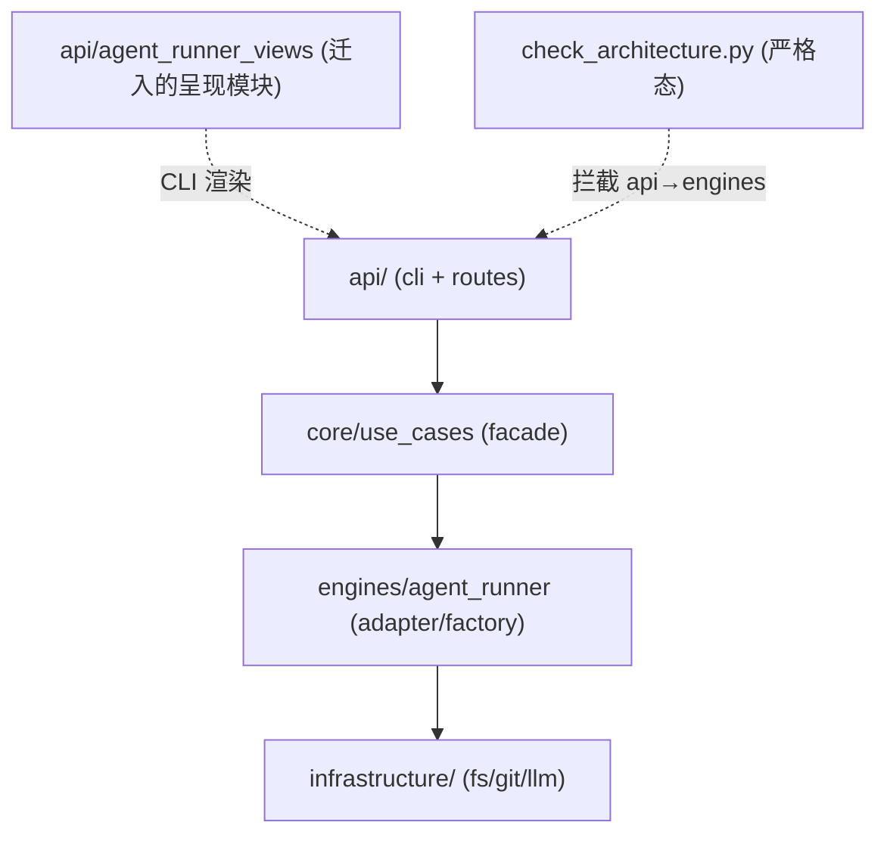

# PRD: api → engines 直连迁移至 core 编排层并恢复架构门禁

> 本 PRD 分两个 altitude，分别服务不同读者，自上而下阅读：
>
> - **Part A · 人审层 (Review Layer)** — 需求方 / 验收人读这部分，决定"该不该做、做得对不对"，并通过风险地图知道**哪些地方必须亲自确认**。Part A 不出现实现机制、文件路径、命令。
> - **Part B · 执行器层 (Build Layer)** — 实现者（人或 Agent）读这部分动手。人只在 Part A 风险地图**点名处**下钻审查，其余默认交执行器 + 自动门禁（hook / 测试 / 架构检查）。

---

# Part A · 人审层 (Review Layer)

## 1. Introduction & Goals

### Problem Statement

仓库的权威架构文档规定后端四层依赖方向为 `api/ → core/ → engines/ → infrastructure/`，且 `api/` 只能调用 `core/` 暴露的用例和 DTO（`docs/architecture/system-design.md`、`docs/ai-standards/architecture.md`）。但实际上 `api/` 层（CLI 与路由）有 26 处 `import` 直接打到 `engines/agent_runner/`，绕过了 `core/` 编排层。最近一次 hooks 整合（`hooks/` → `hooks/shared/`）把架构检查器从"宽松版"（`api` 仅禁 `infrastructure`）切到"严格版"（`api` 禁 `infrastructure` + `engines`），这 26 处直连立刻变成违规，挡住了 `just lint --full` 与提交。为了让 lint 通过，检查器被临时放宽回宽松版——但这让"文档写的严格规则"与"实际执行的宽松规则"持续漂移，架构债越欠越深。现状的问题不是"检查器太严"，而是"代码没按文档要求的层次走"。

### Interpretation (解读回显)

我把需求读成：**为 `api/` 目前直接 `import` 的每一个 `engines/agent_runner/` 能力，在 `core/` 层补上（或复用已有的）用例 / 端口作为编排入口，把 `api/` 的 `import` 全部改打到 `core/`，再把 `hooks/shared/check_architecture.py` 的 `FORBIDDEN_IMPORTS["api"]` 重新收紧为 `["infrastructure", "engines"]`，并同步修正 `CLAUDE.md` 中"api 可导入 engines"的表述与权威文档一致。迁移以"CLI / 路由的可观测行为逐字节不变"为硬约束——只改 import 路径与编排层落点，不改对外契约、不改命令输出、不改状态机。** 不读成：把 `engines/agent_runner/` 的实现搬进 `core/`（那会破坏 engines 层作为适配 / 工厂的本职）；或永久接受 `api → engines` 直连（那等于放弃文档定的层次）；或借机重构 agent runner 业务逻辑（超出本 PRD 范围）。——若你想要的是"把 engines 代码整体挪进 core"或"永久放宽文档去迁就代码"，这条解读就偏了，请纠正（第一次人类触点）。

### What The User Gets

- 维护者拿到的代码库与其文档声称的四层架构一致：`api/` 只调 `core/`，`core/` 编排 `engines/`，`engines/` 适配 `infrastructure/`；新增 `api/` 代码天然走 `core/`，不会再产生直连 `engines/` 的违规。
- `just lint --full` 的架构检查恢复严格态并稳定通过——不再需要靠临时放宽才能过门禁。
- agent runner 的 CLI 与 HTTP 路由行为与迁移前完全一致：同样的命令、同样的输出、同样的状态流转；用户与 runner 感知不到变化。

### Measurable Objectives

- `rg -n "from backend\.engines" src/backend/api/` 返回 0 行（`api/` 对 `engines/` 的直接 import 清零）。
- `hooks/shared/check_architecture.py` 的 `FORBIDDEN_IMPORTS["api"]` 恢复为 `["infrastructure", "engines"]`，`just lint --full` 全绿（含架构检查）。
- `CLAUDE.md` 的 Critical Summary 与 `docs/ai-standards/architecture.md`、`docs/architecture/system-design.md` 关于 `api/` 依赖方向的表述三处一致，无"api 可导入 engines"的残留。
- `just test` 全绿；agent runner CLI 烟雾测试（`iar --help`、`iar run --help`、`iar daemon --help`）输出与迁移前 diff 为空。

## 2. Human Review Map (介入与风险地图)

本节决定注意力如何分配：哪些改动**必须人工确认**，哪些交给**执行器 + 自动门禁**（hook / 测试 / 架构检查）。
默认按架构层定介入档（`api`/`infrastructure` 偏自动，`core` 偏人工），再用风险因子 —— **不可逆性、影响面、安全·资金、正确性关键度** —— 上调或下调。
**两次人类触点**模型：前置一次（批准 §1 解读 + 本表 oracle）、终点一次（读 §9 证据包）；中间 Agent 自治自验、不打断人。所以"人工确认" = **高证据负担**（置顶进 §9 证据包、必须有可执行 oracle），不是中途拦你。

判定菜单（逐项对照本次改动是否命中）：

- 固定区域：① Core 业务逻辑 / 编排规则（`core/`）② 数据库结构 / schema / 迁移（即使在 `infrastructure/`）③ 安全 / 鉴权 / 信任边界 ④ 对外 API 契约 / breaking change
- 横切触发器（命中即升级，无视所在层）：⑤ 资金 / 计费 / 额度 ⑥ 不可逆 / 破坏性数据操作（批量删除、回填、降级迁移）⑦ 并发 / 事务 / 幂等性

**命中的人审项**（逐条进下方分级表，需人工确认）：

- ① Core 编排：新增 / 扩展 `core/` 用例作为 `api/` 与 `engines/` 之间的编排入口——决定这些用例的边界与"薄 facade vs. 深度迁移"取舍。
- ④ 对外契约（CLI / HTTP）：迁移必须保证 `iar` CLI 子命令与 `routes/agent_runner*` 路由的输入输出逐字节不变——人工确认"行为零变化"的判定基准与证据。
- ⑦ 并发 / 幂等：agent runner 常驻 daemon 对 worktree / 标签 / push 有并发操作（见记忆 `iar-daemon-concurrent-operations`），import 路径迁移不得引入新的调用顺序或共享状态读取时序——人工确认迁移不触碰调用顺序。

**未命中**（默认执行器 + 自动门禁，无需逐行人审）：

- ②⑤⑥ 不涉及：无 schema、无钱、无破坏性数据操作。
- 最坏自检：② 误判→最坏是 facade 落点错层，架构检查会抓（rv-1）；⑤ 误判→不涉钱，最坏空跑；⑥ 误判→无破坏性操作，最坏是 import 改错导致启动失败，烟测会抓（rv-3）。

> **清单要保持短**——只把真正命中的列为人审；本次仅 3 项。

| 改动点 | 架构层 | 风险 | 介入方式 | 证据 / Oracle（指向 §7.6 oracle 块的 rv-id） |
|---|---|---|---|---|
| `core/` 用例边界与 facade 取舍（11 个 engines 能力的编排入口） | core | 高 | 人工确认（高证据负担） | rv-1, rv-2 |
| CLI / HTTP 路由行为零变化 | api | 高 | 人工确认（高证据负担） | rv-3, rv-4 |
| 迁移不改变 daemon 并发调用顺序 | core/engines | 中 | 人工确认（高证据负担） | rv-5 |
| 重新收紧检查器 + 同步 CLAUDE.md | infrastructure/docs | 低 | 执行器+门禁 | rv-1（架构检查即门禁） |

**如何证明它生效（真实入口，白话）**：

- 跑一遍 `just lint --full`，架构检查以严格态通过；再 `rg` 搜 `api/` 里对 `engines` 的 import，一条都没有。然后实跑 `iar --help` 与一个真实 `iar run` 烟雾路径，输出跟迁移前逐字节一致；把某一条 `api → engines` import 故意加回去，架构检查立刻变红——证明门禁真的在把关。命令级细节见 Part B 第 7.6 节。

**数据库结构评审（schema 变化时必填）**：

- `本次无数据库结构变化。`

---

## 3. Usage And Impact After Implementation

### 维护者 / Maintainer
- 新增 `api/`（CLI 子命令或 HTTP 路由）时，需要的能力一律从 `src/backend/core/use_cases/` 或 `src/backend/core/shared/interfaces/` 取；`api/` 直接 `import backend.engines.*` 会被 `just lint --full` 的架构检查拦截。
- 11 个 agent runner 能力的编排入口集中在 `core/use_cases/`（部分为本次新增的薄 facade，部分复用已有用例），命名沿用既有 `agent_runner_*` / `run_agent_*` 惯例。

### 操作者 / Operator（repo operator）
- `uv run iar daemon run`、`uv run iar run`、`uv run iar takeover`、`uv run iar init` 等入口命令、参数、输出均与迁移前一致；`.iar.toml` 配置项不变。
- `just lint --full` / `just test` 不再因架构违规中断。

### Impact On Existing Behavior
- 所有既有 `iar` CLI 子命令与 `/api/agent_runner*` 路由的输入输出、退出码、状态流转保持不变。
- daemon 单实例锁、worktree 并发、标签流转等既有并发语义不变（迁移只改 import 落点，不改调用顺序）。
- 无新增配置项、无迁移步骤、无破坏性变更。

---

## 4. Requirement Shape

- Actor: 维护本仓库的开发者 / agent runner 的执行流水线（`iar run` / daemon）。
- Trigger: `just lint --full` 运行架构检查时；新增 `api/` 代码尝试 `import engines` 时。
- Expected behavior: `api/` 层只 `import core/`；`core/` 用例编排 `engines/`；架构检查以严格态执行且全绿；CLI / 路由可观测行为不变。
- Scope boundary: 不搬移 `engines/agent_runner/` 实现到 `core/`；不重构 agent runner 业务逻辑；不改对外 CLI / HTTP 契约；不改 `.iar.toml` 配置 schema；不引入新存储。

---

# Part B · 执行器层 (Build Layer)

> 以下供实现者（人或 Agent）使用。人只在 Part A 风险地图点名处下钻审查；其余默认交执行器 + 自动门禁。

## 5. Repository Context And Architecture Fit

- Existing path: `api/`（`cli*.py` 与 `routes/agent_runner*.py`）当前直接 `import backend.engines.agent_runner.*`；`core/use_cases/` 已有大量 `agent_runner_*` / `run_agent_*` 用例（如 `run_agent_once.py`、`agent_runner_publication.py`、`agent_runner_orchestrate.py` 等），部分能力已被包裹。
- Reuse candidates: 凡 `engines/agent_runner/` 能力在 `core/use_cases/` 已有对应用例的，优先改 `api/` import 指向既有用例；无对应用例的，新增薄 facade 用例（命名 `agent_runner_<capability>.py` 或并入相近用例）。
- Architecture pattern to preserve: `api/ → core/ → engines/ → infrastructure/` 单向依赖（`docs/ai-standards/architecture.md`、`docs/architecture/system-design.md`）；`core/` 通过 `core/shared/interfaces/` 的抽象端口调用 `engines/`，`engines/` 提供适配与工厂。
- Frontend impact: No frontend impact——本 PRD 只动后端 import 路径与 `core/` 编排落点；`tests/playwright-e2e/` 与前端 app 不受影响，HTTP 路由契约不变。
- Existing PRD relationship: 检查 `tasks/pending/` 与 `tasks/archive/` 后无重复或依赖——本 PRD 是对当前 hooks 整合（`24b05b8c` 起的 `hooks/` → `hooks/shared/` 重构）引入的架构检查收紧的善后；与 `P1-FEAT-20260703-105*` 系列（autopilot / roadmap / prd-regrounding）正交。
- Redundancy risks: 薄 facade 用例可能与 `engines/agent_runner/` 原函数形成"透传壳"——需逐个判断是该走薄 facade（满足层次边界即可），还是该把实现上移到 `core/`（当原 engines 函数本质是 domain 编排时）。见 §6 与 D-02。

**当前 26 处违规的 engines 能力归类**（实现起点，非穷尽）：

| engines 模块 | 性质 | api/ 引用方 |
|---|---|---|
| `factory`（`get_agent_runner_settings` 等） | 配置装配 / 工厂 | cli, cli_helpers, cli_init, cli_loop, cli_registry, cli_takeover, routes/agent_runner*, agent_runner_roadmap, agent_runner_idea_inbox |
| `repository_local`（`discover_iar_repositories` 等） | 仓库注册表（本地 FS） | cli, cli_helpers, cli_init, cli_registry, agent_runner_console |
| `takeover` / `takeover_interactive` | 接管流程 | cli_init, cli_takeover |
| `init_flow` | 初始化流程 | cli_init |
| `failure_resolver`（`AgentFailureResolver`） | 失败恢复编排 | cli |
| `persistence/loop_state_json` | loop 状态持久化 | cli_loop |
| `worktree_cli` | worktree 管理 | cli |
| `workflow_install` | workflow 文件安装 | cli |
| `live_terminal`（`create_output_view`） | CLI 终端渲染（呈现） | cli |
| `runner_live_view`（`create_runner_live_view`） | runner 实时视图渲染（呈现） | cli |

## 6. Recommendation

### Recommended Approach
- Approach: **逐能力在 `core/` 落编排入口，`api/` 改打 `core/`，最后收紧检查器并同步文档。** 业务逻辑类能力（factory / repository_local / takeover / init_flow / failure_resolver / worktree_cli / workflow_install / persistence）在 `core/use_cases/` 建薄 facade 用例（复用已有则直接指）；呈现适配类（`live_terminal` / `runner_live_view`）移入 `api/`（CLI 渲染本属接入层，不该住 engines）。
- Why this is the best fit: 复用既有 `core/use_cases/` 体系与命名惯例，最小新增；呈现适配归位 `api/` 消除"core 编排终端渲染"的别扭；检查器恢复严格态后架构债真正清零，而非靠放宽遮盖。
- Rejected redundancy: 不为每条 import 盲建一对一透传壳——能并入相近用例的并入；不把 `engines/agent_runner/` 实现整体搬进 `core/`（保留 engines 作为适配 / 工厂层的本职）。

### Proposed Solution Summary (实现机制)

核心机制是**层次归位**：`api/`（cli + routes）所有对 agent runner 能力的调用经 `core/use_cases/` 编排入口进入，`core/` 再经 `core/shared/interfaces/` 端口或直接调 `engines/agent_runner/` 适配实现。系统只消费既有配置与输入，不新增声明。落点：业务类能力在 `core/use_cases/agent_runner_<capability>.py` 建 facade（或并入既有用例）；`live_terminal` / `runner_live_view` 从 `engines/agent_runner/` 迁到 `api/`（如 `api/agent_runner_views/` 或并入既有 cli 模块）。主要状态 / 输出变化：**无**——这是 import 路径与编排落点的迁移，可观测行为逐字节不变。刻意避免的复杂度：不新增存储、不新增并行抽象、不改状态机、不改配置 schema。

### Alternatives Considered (Only When Useful)
- Alternative A: 永久放宽检查器与文档，接受 `api → engines` 直连。
- Why not chosen: 让权威文档迁就代码，放弃四层分层，架构债固化；与 `system-design.md` / `ai-standards/architecture.md` 冲突，且 `engines/` 边界一旦对 `api/` 敞开，后续难以收口。
- Alternative B: 把 `engines/agent_runner/` 整体搬进 `core/`。
- Why not chosen: engines 层承担适配 / 工厂 / 持久化实现，搬到 core 破坏四层职责；工作量与风险远超"补 facade"。

---

## 7. Implementation Guide

This section is a living implementation guide based on current repository analysis. If implementation discovers additional affected files, hidden dependencies, edge cases, or a better path, update this PRD before proceeding.

### 7.1 Core Logic

`api/`（CLI typer 命令与 FastAPI 路由）当前直接调 `engines/agent_runner/<mod>` 的函数 / 类。迁移后调用链变为 `api/ → core/use_cases/<facade> → engines/agent_runner/<mod>`（业务类）或 `api/ → api/<view-module>`（呈现类，原 engines 模块迁入 api）。数据与控制流不变，仅插入 `core/` 编排节点或将呈现模块移层。`core/` facade 对 engines 的调用遵循既有 `core/shared/interfaces/` 端口惯例（如 `IAgentTranscriptRunner`、`IGitHubClient`、`IProcessRunner`），避免在 facade 里硬编码 infrastructure 直连。

### 7.2 Change Impact Tree

```text
.
├── src/backend/core/use_cases/
│   └── agent_runner_<capability>.py（若干，按需新增 / 扩展）
│       [新增] / [修改]
│       【总结】为 api 直连的 engines 能力补 core 编排入口（薄 facade 或并入既有用例）
│
│       ├── factory 能力：build_agent_runner_settings 等（或并入既有 settings 用例）
│       ├── repository_local 能力：discover_repositories 等
│       ├── takeover / takeover_interactive / init_flow / failure_resolver 能力
│       ├── worktree_cli / workflow_install / persistence(loop_state_json) 能力
│       └── 每个 facade 经 core/shared/interfaces 端口或直接调 engines 实现
│
├── src/backend/api/
│   ├── cli.py / cli_loop.py / cli_takeover.py / cli_helpers.py / cli_init.py / cli_registry.py
│   │   [修改]
│   │   【总结】把 from backend.engines.agent_runner.* 改为 from backend.core.use_cases.*（呈现类改指 api 内迁模块）
│   │
│   ├── routes/agent_runner.py / agent_runner_console.py / agent_runner_roadmap.py / agent_runner_idea_inbox.py
│   │   [修改]
│   │   【总结】同上，路由层 import 改打 core 用例
│   │
│   └── agent_runner_views/（或并入既有 cli 模块）
│       [新增]（接收 engines 迁入的呈现模块）
│       【总结】live_terminal / runner_live_view 从 engines 迁入 api，CLI 渲染归接入层
│
├── src/backend/engines/agent_runner/
│   └── live_terminal.py / runner_live_view.py
│       [删除] / [修改]
│       【总结】呈现模块迁出 engines；其余 engines 模块保持原位（被 core facade 调用）
│
├── hooks/shared/check_architecture.py
│   [修改]
│   【总结】FORBIDDEN_IMPORTS["api"] 收回为 ["infrastructure", "engines"]；docstring 去掉"过渡期放宽"注
│
├── CLAUDE.md
│   [修改]
│   【总结】Critical Summary 中"api 可导入 engines"改为"api 只可导入 core"，与权威文档一致
│
└── tests/
    └── （既有 agent_runner / cli 测试）
        [修改]
        【总结】跟随 import 路径调整测试 mock 落点；不新增断言（行为不变）
```

> 文件清单为当前分析的预期面，非穷尽。实现时以 §7.3 的 `rg` 搜索为准，发现额外引用先更新本 PRD 再继续。

### 7.3 Executor Drift Guard

The file list above is the expected implementation surface from current repository analysis. During implementation, treat it as a starting point and use these repository searches to catch hidden references or drift before marking the PRD complete.

| Check | Command | Expected Result | If It Fails, Inspect First |
|---|---|---|---|
| api → engines 残留 | `rg -n "from backend\.engines" src/backend/api/` | 0 行 | 遗漏的 cli / routes 子模块、动态 import、`__init__` 重导出 |
| 呈现模块旧引用 | `rg -n "engines.agent_runner.(live_terminal\|runner_live_view)" src/` | 仅 `engines/` 内或已迁出后无引用 | api 内迁后的重导出、tests mock 路径 |
| core facade 命名冲突 | `rg -n "agent_runner_(factory\|repository\|takeover\|init\|failure\|worktree\|workflow)" src/backend/core/use_cases/` | 新 facade 与既有用例不重名 / 不重复职责 | 既有用例是否已包裹同一能力（应直接复用） |
| 架构检查严格态 | `rg -n '"api":' hooks/shared/check_architecture.py` | `["infrastructure", "engines"]` | 是否回退成宽松版、docstring 是否同步 |
| CLAUDE.md 残留 | `rg -n "可导入.*engines\|api/.*engines" CLAUDE.md` | 0 行 | Critical Summary 段是否同步 |
| 隐藏入口 | `rg -n "importlib\|__import__\|getattr.*engines" src/backend/api/` | 无动态绕过 | 动态加载、插件注册 |

### 7.4 Flow Or Architecture Diagram



迁移前：`api/` 直连 `engines/`（虚线为违规边）。迁移后：`api/` 经 `core/` 编排；呈现模块归位 `api/`；架构检查严格态守边。

### 7.5 ER Diagram (Only When Data Model Changes)

- `No data model changes in this PRD.`

### 7.6 Realistic Validation Plan (Oracle 块)

机读 + 人读的**单一 oracle 源**：§2 的证据列、§9 证据包、以及任何确定性抽取器都引用 / 解析这里的 `id`。不要在别处再用散文表格重述 oracle。

```yaml
- id: rv-1
  behavior: 架构检查以严格态通过，且 api→engines 直连清零
  real_entry: "rg -n 'from backend\\.engines' src/backend/api/ && just lint --full"
  expected: "rg 返回 0 行；just lint --full 的 check-architecture 以 FORBIDDEN_IMPORTS[api]=[infrastructure,engines] 通过"
  mock_boundary: "不 mock；真实扫描 src/backend/api 与真实跑 pre-commit"
  negative_control: "在 src/backend/api/cli.py 临时加一行 from backend.engines.agent_runner.factory import get_agent_runner_settings 后跑 just lint --full"
  expected_fail: "check-architecture 报 [backend/api] → [engines] 违规，exit 1"
  test_layer: smoke
  required_for_acceptance: true

- id: rv-2
  behavior: core facade 覆盖全部 11 个 engines 能力且无重复职责
  real_entry: "rg -n 'from backend\\.engines' src/backend/core/use_cases/ 与 rg -n 'def ' src/backend/core/use_cases/agent_runner_*.py"
  expected: "所有原 api 直连的 engines 能力都有 core/use_cases 入口；无一对一冗余透传壳（除非该能力本就是 domain 编排）"
  mock_boundary: "不 mock；静态扫描"
  negative_control: "删掉某个 core facade 让 api 重新直连 engines 对应模块"
  expected_fail: "rv-1 的 rg 重新命中 api→engines，架构检查变红"
  test_layer: integration
  required_for_acceptance: true

- id: rv-3
  behavior: iar CLI 行为零变化（输出 diff 为空）
  real_entry: "uv run iar --help && uv run iar run --help && uv run iar daemon --help"
  expected: "三命令 stdout/stderr 与迁移前基准 diff 为空，退出码 0"
  mock_boundary: "不 mock；真实跑 CLI（不连外部 LLM / GitHub，仅 --help 级）"
  negative_control: "在某个 facade 里故意改一行输出文本（如加前缀）后重跑"
  expected_fail: "diff 非空，rv-3 失败"
  test_layer: smoke
  required_for_acceptance: true

- id: rv-4
  behavior: HTTP 路由契约零变化
  real_entry: "uv run pytest tests/ -k 'agent_runner' -v -o addopts='' && rg -n 'router\\.' src/backend/api/routes/agent_runner*.py"
  expected: "agent_runner 路由测试全绿；路由签名 / 响应 schema 与迁移前一致"
  mock_boundary: "路由 handler 真实；GitHub/LLM 在测试边界 mock"
  negative_control: "改某个路由的响应字段名后跑测试"
  expected_fail: "契约测试失败"
  test_layer: integration
  required_for_acceptance: true

- id: rv-5
  behavior: 迁移不改变 daemon 并发调用顺序
  real_entry: "uv run pytest tests/ -k 'daemon or loop or concurrent' -v -o addopts=''"
  expected: "daemon / loop / 并发相关测试全绿；调用顺序与迁移前一致"
  mock_boundary: "GitHub/LLM/process 在边界 mock；worktree/标签流转真实"
  negative_control: "在 facade 里调整调用顺序（如先调 engines 再读状态改为先读状态）"
  expected_fail: "daemon 单实例锁 / 并发测试失败"
  test_layer: integration
  required_for_acceptance: true
```

Failure triage:
- `rv-1` 跑挂先查 `hooks/shared/check_architecture.py` 是否真收紧、`api/` 是否有动态 import 绕过（见 §7.3）。
- `rv-3` diff 非空先查 facade 是否改了输出文本 / 退出码 / 参数顺序，而非业务逻辑。
- 生产 / 供应商 / 需凭据的项（真实 `iar run` 连 LLM/GitHub）标 `opt-in / post-merge`；无凭据时用 `--help` + 路由测试 + 架构检查作 fallback。

### 7.7 Low-Fidelity Prototype (Only When Required)

- `No low-fidelity prototype required for this PRD.`

### 7.8 Interactive Prototype Change Log (Only When Files Actually Changed)

- `No interactive prototype file changes in this PRD.`

### 7.9 External Validation (Only When Web Research Was Used)

- `No external validation required; repository evidence was sufficient.`

---

## 8. Delivery Dependencies

- Group: api-engines-layer-migration
- Depends on groups:
  - none
- Depends on tasks/issues:
  - none（当前 hooks 整合重构已落地，本 PRD 是其善后；无未完成的硬上游）
- Gate type: none
- Notes: 本 PRD 不阻塞当前 staged 重构的提交（检查器已临时放宽）；可在 hooks 整合合入后独立排期。

---

## 9. Acceptance Checklist

这是「人只看一次」的交付物。按 Part A 风险地图排序组织成**验收证据包**，每项必须带证据（命令输出 / 观察 / 工件引用），不是裸勾。

### Acceptance Evidence Package（证据包 · 按风险地图排序，终点人审入口）

1. **高风险 oracle 结果**（§2 每个人工确认行的 oracle 跑绿证据，置顶）：rv-1 架构严格态通过 + api→engines 清零；rv-2 core facade 覆盖完整无冗余；rv-3 CLI 行为 diff 为空；rv-5 daemon 并发顺序不变。
2. **风险地图对账 Predicted → Reconciled**：实现中若发现某 engines 能力本质是 domain 编排（应上移 core 而非薄 facade），记录于 Decision Log 并更新 §7.2。
3. **对抗自检**：rv-1 的 negative_control（故意加回 api→engines import）确实让检查变红；rv-3 的 negative_control（改输出文本）确实让 diff 非空。
4. **对锁定契约的 diff**：rv-4 路由签名 / 响应 schema 与迁移前一致；CLI `--help` 输出 diff 为空。
5. **低风险门禁结果（折叠）**：`just lint --full` 全绿（ruff / 架构 / 行数 / PRD checklist）；`just test` 全绿。

### Human-Confirmed (来自 Part A 风险地图)

> Part A 第 2 节每个"必须人工确认"的改动点，这里都要有对应的已确认验收项。

- [ ] core facade 边界与"薄 facade vs. 深度迁移"取舍已逐能力确认（11 个 engines 能力的落点）
- [ ] CLI / HTTP 路由行为零变化的判定基准与 rv-3/rv-4 证据已确认
- [ ] 迁移不触碰 daemon 并发调用顺序已确认（rv-5）

### Architecture Acceptance

- [ ] `FORBIDDEN_IMPORTS["api"]` 恢复为 `["infrastructure", "engines"]`，`hooks/shared/check_architecture.py` docstring 去掉"过渡期放宽"
- [ ] `rg -n "from backend\.engines" src/backend/api/` 返回 0 行
- [ ] 呈现模块 `live_terminal` / `runner_live_view` 迁入 `api/`，`engines/` 不再持有 CLI 渲染

### Dependency Acceptance

- [ ] `api/` 对 agent runner 能力的 import 全部指向 `core/use_cases/` 或 `api/` 内迁模块
- [ ] `core/` facade 经 `core/shared/interfaces/` 端口或直接调 `engines/`，不直连 `infrastructure/`
- [ ] 无新增 `api → engines` 动态 import 绕过（§7.3 隐藏入口检查 0 命中）

### Behavior Acceptance

- [ ] `uv run iar --help` / `iar run --help` / `iar daemon --help` 输出与迁移前 diff 为空
- [ ] agent runner 路由测试全绿，路由签名 / 响应 schema 不变
- [ ] daemon / loop / 并发相关测试全绿（rv-5）

### Documentation Acceptance

- [ ] `CLAUDE.md` Critical Summary 中"api 可导入 engines"已改为"api 只可导入 core"，与 `docs/ai-standards/architecture.md`、`docs/architecture/system-design.md` 三处一致
- [ ] `hooks/shared/check_architecture.py` docstring 与 `FORBIDDEN_IMPORTS` 一致，无"过渡期"残留
- [ ] PRD 与仓库 docs 对四层依赖方向表述一致

### Validation Acceptance

- [ ] `just lint --full` 全绿（含 check-architecture 严格态）
- [ ] `just test` 全绿
- [ ] `rg -n "from backend\.engines" src/backend/api/` 返回 0 行（rv-1）
- [ ] rv-1 negative_control：临时加回一条 `api → engines` import 后 `just lint --full` 变红
- [ ] rv-3 negative_control：改 facade 输出后 CLI diff 非空

### Delivery Readiness

- [ ] 推荐方案完整实现：11 个 engines 能力均有 core 编排入口或已迁入 api；无未批准的并行抽象
- [ ] 无遗留回归或 rollout 阻塞；CLI / 路由 / daemon 行为零变化

---

## 10. Functional Requirements

- FR-1: `src/backend/api/` 下所有 `.py` 文件不得出现 `from backend.engines` 直接 import。
- FR-2: `hooks/shared/check_architecture.py` 的 `FORBIDDEN_IMPORTS["api"]` 必须为 `["infrastructure", "engines"]`，且 `just lint --full` 以此配置通过。
- FR-3: 原 `api/` 直连的 11 个 `engines/agent_runner/` 能力必须在 `core/use_cases/` 有编排入口（新增 facade 或复用既有用例），或在呈现类情况下迁入 `api/`。
- FR-4: `live_terminal` 与 `runner_live_view` 迁出 `engines/agent_runner/`，落入 `api/` 层。
- FR-5: `CLAUDE.md` 的 `api/` 依赖规则表述与 `docs/ai-standards/architecture.md`、`docs/architecture/system-design.md` 一致。
- FR-6: `iar` CLI 子命令集合、参数、输出、退出码与迁移前逐字节一致。
- FR-7: `routes/agent_runner*` 路由签名与响应 schema 与迁移前一致。
- FR-8: daemon 单实例锁、worktree 并发、标签流转的调用顺序与迁移前一致。

## 11. Non-Goals

- 不把 `engines/agent_runner/` 的业务实现整体搬进 `core/`。
- 不重构 agent runner 的业务逻辑（恢复循环、verifier、deliberation 等）。
- 不改 `.iar.toml` 配置 schema 或新增配置项。
- 不改对外 CLI / HTTP 契约。
- 不引入新存储或新抽象（除满足层次边界所必需的薄 facade）。
- 不处理 `worker/` 等其他分层模块（本 PRD 仅针对 `backend/`）。

## 12. Risks And Follow-Ups

- 风险：薄 facade 沦为无意义透传壳。缓解：逐能力判断——本质是 domain 编排的上移到 `core/`，仅适配 / 工厂类保留薄 facade；以 rv-2 守。
- 风险：呈现模块迁入 `api/` 后被 `engines/` 内部其他模块反向引用。缓解：§7.3 `rg` 搜 `engines.agent_runner.(live_terminal|runner_live_view)` 确认无残留；若有则先解耦再迁。
- 风险：迁移面大（26 处 import、11 模块），单 PR 评审负担重。缓解：按 engines 能力分批提交（factory → repository_local → takeover/init → 其余 → 呈现迁移 → 收紧检查器），每批独立可过 lint/test。

## 13. Decision Log

| # | 决策问题 | 选择 | 放弃的方案 | 理由 |
|---|---|---|---|---|
| D-01 | 检查器当前如何处置 | 临时放宽到 `["infrastructure"]` 并写本 PRD 跟踪 | 立即收紧卡住 staged 重构 / 永久放宽 | 放宽让重构可提交，PRD 锁定善后，避免架构债被静默遗忘 |
| D-02 | 业务类 engines 能力如何落 core | 薄 facade 用例（复用既有则直接指） | 一对一透传壳 / 把 engines 实现搬进 core | 满足层次边界且最小新增；本质是 domain 编排的才上移 |
| D-03 | 呈现类（live_terminal / runner_live_view）归属 | 迁入 `api/` | 在 core 建呈现端口 / 留 engines 永久豁免 | CLI 终端渲染本属接入层，core 不该编排渲染；迁入 api 消除别扭 |
| D-04 | 迁移节奏 | 按 engines 能力分批提交 | 一次性大 PR | 26 处 / 11 模块分批降低评审与回归风险，每批可独立过门禁 |
