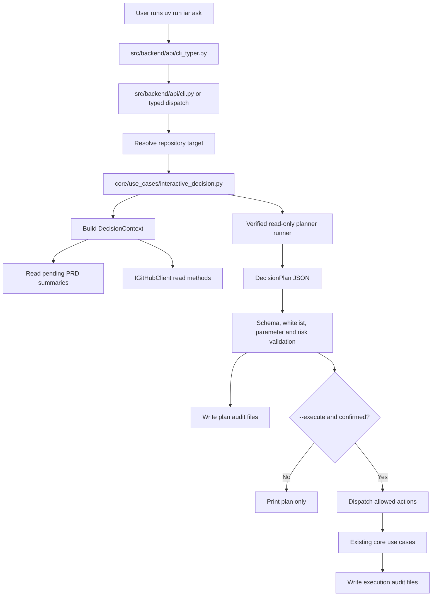
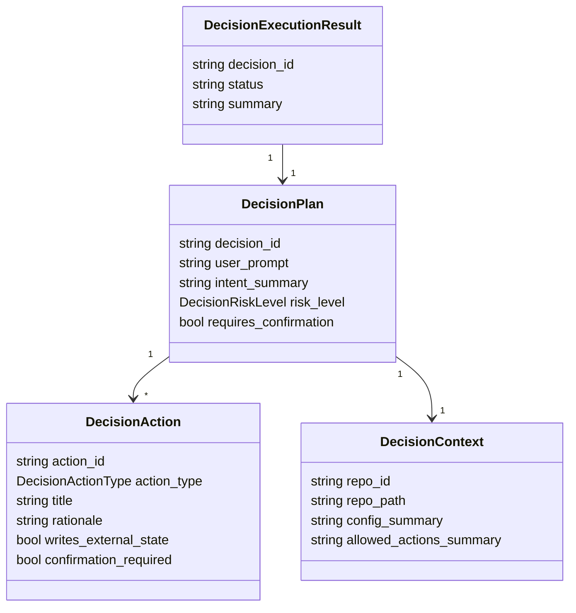

# PRD: Agent Runner 受限自然语言决策入口 (`iar ask`)

- GitHub Issue: https://github.com/zata-zhangtao/keda/issues/53

- GitHub Issue: https://github.com/zata-zhangtao/keda/issues/53
- Supersedes: 本文件旧版 `Agent Runner 自然语言总入口 (iar ask) -- 1 个月内不实现` 暂缓结论

## 1. Introduction & Goals

### Problem Statement

当前 `iar` 已经具备 `iar issue create`、`iar run`、`iar review`、`iar daemon`、`iar review-daemon`、`iar recover`、`iar deliberate` 等能力。

这些能力仍要求 operator 理解精确子命令、仓库选择器、Issue label 状态机、PRD 与 Issue 的关系，以及何时应该创建 Issue、标记 ready、执行 runner 或先做只读分析。旧版同主题 PRD 曾选择暂缓自然语言入口，原因是担心 LLM 误路由、写操作不可控、默认值策略不清晰以及 CLI chat 形态不稳。

本次重新打开需求的实现边界不是通用 ChatOps，也不是让模型直接执行命令，而是新增一个**受限、可审计、默认只生成计划、确认后才执行白名单动作**的单轮决策入口。

### Proposed Solution Summary

在当前 Typer CLI 树中新增 `iar ask` 命令，并由新的 core use case `interactive_decision` 负责构建受限 `DecisionContext`、调用可验证只读的 planner agent、解析严格 JSON `DecisionPlan`、执行硬编码白名单校验、写入本地审计文件，并且只在用户显式确认后调用现有 use case 完成允许动作。执行路径必须复用 `create_issue_from_prd`、`run_agent_repositories_once`、`review_once`、`run_agent_deliberation` 等现有边界，不新增平行 GitHub/runner 状态机。

### Measurable Objectives

- `uv run iar ask "<prompt>"` 默认只输出计划和风险，不产生 GitHub label、Issue、PR、branch、commit、worktree 或生产副作用。
- `iar ask` 能读取目标仓库配置、pending PRD 摘要、ready/supervising/review Issue 摘要和允许动作清单，生成结构化 `DecisionPlan`。
- planner 输出必须经过 core 层 schema、白名单、参数、路径、风险和确认策略校验；未知动作或未知参数直接失败。
- 所有写操作必须显式确认；高风险动作不支持 `--yes` 静默执行。
- 每次计划和执行结果落盘到 `logs/agent-runner/decisions/<decision_id>/`，包含 `plan.json`、`plan.md`、`context-summary.json`，执行时还包含 `execution.json` 和 `execution.md`。
- 文档同步更新 `README.md`、`docs/guides/agent-runner.md`、`docs/guides/configuration.md`，说明 `iar ask` 的权限边界、禁止动作和推荐用法。

### Realistic Validation

除单元测试和集成测试外，本 PRD 要求通过**真实项目入口点**验证关键行为。没有确认的 Validation Waiver，因此执行者必须实际运行并保存证据摘要。

- [ ] **计划生成真实验证**：通过 subprocess 或真实终端执行 `uv run iar ask "判断下一步应该做什么" --repo <fixture-repo> --agent codex --plan-only`，在 PATH 注入 fake `codex`，验证 CLI 输出结构化计划并写入 `logs/agent-runner/decisions/`。
- [ ] **确认执行真实验证**：通过 `uv run iar ask "从 PRD 创建 issue" --repo <fixture-repo> --agent codex --execute`，在 PATH 注入 fake `codex` 和 fake `gh`，验证未确认时不执行，确认后只调用白名单 use case。
- [ ] **写操作防护真实验证**：通过 fake planner 返回未允许动作，例如 `git_push`、`daemon` 或任意 shell 命令，验证真实 CLI 返回非零，并且 fake `gh` 没有写调用。
- [ ] **planner 只读防护真实验证**：当所选 agent 没有可验证只读 command builder 时，`iar ask` 必须 fail fast，而不是复用可能写仓库的内容生成命令。
- [ ] **为什么单元测试不够**：本功能横跨 Typer CLI、shared dispatcher、agent 子进程、仓库目标解析、GitHub client 适配、use case 调度、TTY/非 TTY 确认和本地审计文件；真实入口验证才能证明这些边界按生产路径连接。

### Delivery Dependencies

- Group: agent-runner-interactive-decision
- Depends on groups:
- Depends on tasks/issues:
- Gate type: none
- Notes: 当前没有硬性交付顺序依赖。`tasks/pending/P2-FEAT-20260527-190923-prd-from-issue.md`、`tasks/pending/P3-CHORE-20260610-110443-remove-legacy-iar-commands.md`、`tasks/pending/P1-FEAT-20260610-143013-validation-evidence-gate.md` 和 `tasks/pending/P2-FEAT-20260528-110730-prd-deliberation-review.md` 是相关或软协调任务，但不阻塞本 PRD；实现时应使用现代 CLI 名称并避免假设旧命令长期存在。

## 2. Requirement Shape

- **Actor**：本地运行 `iar` 的开发者或 Agent Runner operator。
- **Trigger**：用户执行 `iar ask "<自然语言需求>"`，希望系统判断是否应创建 Issue、标记 ready、启动单次 runner、运行 review、执行 deliberation，或先做只读分析。
- **Expected Behavior**：
  1. CLI 解析用户 prompt、目标仓库和执行模式。
  2. 系统解析到唯一目标仓库，合并 `config.toml` 与目标仓库 `.iar.toml`。
  3. core 用例收集受限上下文，包括仓库身份、有效配置摘要、pending PRD 摘要、相关 Issue 摘要、允许动作、禁止动作和确认策略。
  4. planner agent 只输出严格 JSON `DecisionPlan`，不得输出 shell command 作为执行依据。
  5. core 独立校验 plan schema、action whitelist、参数、风险级别和确认策略。
  6. 默认打印计划并落盘，不执行副作用。
  7. 用户显式确认后，系统按顺序调用现有 use case 执行允许动作，并写入执行结果。
- **Explicit Scope Boundary**：
  - 仅做单轮意图决策，不做多轮 chat、长期 memory 或用户偏好学习。
  - 不允许模型执行任意 shell 命令。
  - 不允许自动 merge、直接 push main、创建非 draft PR、启动 daemon、修改生产系统或访问真实业务数据。
  - 不替代 `iar deliberate`；复杂方案讨论仍由 `iar deliberate` 负责。
  - 不替代 pending 的 `prd-from-issue` 工作流；自由文本需求若缺少 PRD，`iar ask` 只能建议先创建或补齐 PRD，除非该功能已由对应 PRD 实现。
  - 不要求默认连接真实 GitHub 做验收；fake `gh` 的真实 CLI 边界验证是默认路径，live GitHub 仅作为显式 opt-in。

## 3. Repository Context And Architecture Fit

### Existing Path

| Path | Current Role | Relationship To This PRD |
|---|---|---|
| `src/backend/api/cli_typer.py` | 当前 `iar` Typer command tree，注册现代命令和兼容命令 | 新增 `iar ask` 的用户入口；只做参数解析和 DTO 转换 |
| `src/backend/api/cli.py` | 保留 argparse parser、shared dispatcher `_run_parsed_command(...)` 和 CLI 诊断 | 若继续沿用当前模式，新增 `ask` dispatch 分支；业务规则不能写在这里 |
| `src/backend/core/use_cases/create_issue_from_prd.py` | PRD -> GitHub Issue 工作流 | `create_issue_from_prd` 白名单动作必须调用该 use case |
| `src/backend/core/use_cases/run_agent_repositories_once.py` | 多仓库单次 runner 聚合入口 | `run_once` / `run_once_dry_run` 应通过该入口或其单仓库等价路径调度 |
| `src/backend/core/use_cases/run_agent_once.py` | 单仓库 ready Issue 执行入口 | 不复制 runner 状态机，只复用现有实现 |
| `src/backend/core/use_cases/review_once.py` | supervising/review Issue 的 supervisor 检查 | `review_once` 白名单动作必须调用该 use case |
| `src/backend/core/use_cases/run_agent_deliberation.py` | 只读多 agent 合议，带事件和输出落盘 | `run_deliberation` 白名单动作复用该 use case；不把所有 ask 默认升级为 deliberation |
| `src/backend/core/use_cases/generated_content.py` | 通过 `IContentGenerator` 生成 Issue/PR 文本 | planner prompt 与 JSON 解析可复用内容生成思路，但不能绕过 planner 安全要求 |
| `src/backend/core/shared/interfaces/agent_runner.py` | `IContentGenerator`、`IGitHubClient`、`IProcessRunner` 等端口 | 新 core 用例只能依赖这些端口或新增 core interface |
| `src/backend/core/shared/models/agent_runner.py` | runner 配置、label、Git、生成内容模型 | 可新增 interactive decision config；决策 plan 模型建议拆到专门文件 |
| `src/backend/engines/agent_runner/factory.py` | settings -> core config 映射，创建 process/content/GitHub/transcript runner | 新增 decision config 映射和 planner runner 装配 |
| `src/backend/infrastructure/config/settings.py` | pydantic-settings 配置 | 新增 `[agent_runner.interactive_decision]` 配置段 |
| `docs/guides/agent-runner.md` | `iar` 使用指南 | 补充 `iar ask` 权限边界、白名单动作、示例和故障排查 |
| `docs/guides/configuration.md` | 配置说明 | 补充 interactive decision 配置 |
| `README.md` | 快速开始 | 加入最小用法示例和默认 plan-only 说明 |

### Reuse Candidates

- 复用 `resolve_repository_targets(...)` / `resolve_issue_from_prd_target(...)` 的仓库选择规则，`--repo` 与 `--repo-id` 必须互斥。
- 复用 `RepositoryRunContext` 承载合并后的仓库配置。
- 复用 `IGitHubClient` 查询 ready/review/supervising Issue 与执行 label/Issue 写操作。
- 复用 `IContentGenerator` 的端口形状，但 planner agent 必须使用可验证只读的命令装配；当前 `SubprocessContentGenerator` 中某些 agent command 可能无法强制只读，不能无条件复用。
- 复用 `run_agent_deliberation(...)` 的审计输出理念，但不要复制其多 agent 编排。
- 复用 `tests/test_agent_runner_cli.py` 的 CLI dispatch 测试风格和 fake boundary。
- 复用 `tests/test_agent_config_consistency.py` 校验 agent command builder 和默认配置一致性。

### Architecture Constraints

- 后端必须保持 `api/ -> core/ -> engines/ -> infrastructure/` 依赖方向。
- `src/backend/api/cli_typer.py` 和 `src/backend/api/cli.py` 不能承载 plan 校验、动作授权或状态机规则。
- `core/use_cases/interactive_decision.py` 不得导入 `backend.engines.*`、`backend.infrastructure.*` 或 `backend.api.*`。
- GitHub 操作统一通过 `IGitHubClient` 或现有 use case，不能在 planner、CLI 或 core 中直接拼接 `gh issue` 命令。
- planner 输出不能扩展权限；允许动作必须由 core 硬编码枚举控制，不能由配置或模型动态添加任意 action。
- Python 文本文件 I/O 必须显式 `encoding="utf-8"`。
- 单代码文件非空行不得超过 1000 行；不要把所有决策逻辑塞进 `cli.py`、`cli_typer.py` 或既有大型 use case。

### Existing PRD Relationship

| PRD | Relationship | Notes |
|---|---|---|
| This file | Same work item | 本次更新现有 pending PRD，避免新增重复 `iar ask` backlog |
| `tasks/pending/P2-FEAT-20260527-190923-prd-from-issue.md` | Related, not blocking | `iar ask` 可以建议用户走 PRD 生成/补齐流程，但不能实现该 pending PRD 的反向 PRD 生成能力 |
| `tasks/pending/P3-CHORE-20260610-110443-remove-legacy-iar-commands.md` | Soft coordination | 本 PRD 使用现代命令名；实现不应依赖旧命令长期存在 |
| `tasks/pending/P1-FEAT-20260610-143013-validation-evidence-gate.md` | Soft coordination | 本 PRD 的真实入口验证应记录证据；是否由 runner gate 强制不阻塞本功能 |
| `tasks/pending/P2-FEAT-20260528-110730-prd-deliberation-review.md` | Related, not blocking | 两者都复用 deliberation，但 `iar ask` 是单轮决策入口，不是 PRD review deliberation |
| `tasks/archive/P2-FEAT-20260610-110442-iar-typer-rich-cli.md` | Prior decision | 当前 CLI 已迁移到 Typer/Rich；`iar ask` 应注册在 Typer command tree |

### Potential Redundancy Risks

- 新增通用 tool executor 会重复现有 use case 调度边界，并扩大安全面。
- 把 `iar ask` 写成 `iar deliberate` 包装会混淆“机器可校验执行计划”和“人类阅读的方案讨论报告”。
- 让 planner 输出 shell 命令会绕开 core 状态机、GitHub client、确认策略和测试覆盖。
- 为审计新增数据库或会话服务会过度设计；本地 `logs/agent-runner/decisions/` 与现有 logs 模式一致。
- 无条件复用现有 `create_content_generator()` 可能让 planner agent 获得非只读能力；必须补一个可验证的 planner command path 或 fail fast。

## 4. Recommendation

### Recommended Approach

新增 `iar ask` Typer 命令和一个核心用例 `interactive_decision`，实现“只读 planner -> 严格校验 -> 审计落盘 -> 显式确认 -> 白名单 use case 调度”的闭环。

#### CLI Shape

```bash
# 默认只生成计划，不执行副作用
uv run iar ask "帮我判断现在应该创建 issue 还是启动任务"

# 显式选择 planner agent
uv run iar ask "从 pending PRD 中挑一个最适合创建 issue 的任务" --agent codex

# 只打印计划，适合 CI 或脚本验证
uv run iar ask "现在可以跑一个 ready issue 吗" --plan-only

# 进入确认执行；TTY 中要求输入 decision_id 或 action_id
uv run iar ask "从 tasks/pending/example.md 创建 issue，但不要直接 ready" --execute

# 非交互执行只允许 low/medium 且允许 yes 的动作
uv run iar ask "运行一次 dry-run 看看 ready 队列" --execute --yes
```

`--plan-only` 与默认行为等价；保留该 flag 是为了脚本和测试表达意图。`--execute` 只表示允许进入确认流程，不代表绕过白名单或风险策略。

#### Whitelisted Actions

| Action Type | Writes External State | Risk Default | Confirmation | Dispatch Path |
|---|---:|---|---|---|
| `show_status` | No | low | No | Read `DecisionContext` only |
| `run_deliberation` | Local logs only | low | No | `run_agent_deliberation(...)` |
| `create_issue_from_prd` | Yes | medium | Yes | `create_issue_from_prd(...)` |
| `mark_issue_ready` | Yes | medium | Yes | Existing `IGitHubClient.edit_issue_labels(...)` with configured ready label |
| `run_once_dry_run` | No | low | No | `run_agent_repositories_once(..., dry_run=True)` |
| `run_once` | Yes | high | TTY only | `run_agent_repositories_once(..., dry_run=False, max_issues=1 default)` |
| `review_once_dry_run` | No | low | No | `review_once(..., dry_run=True)` |
| `review_once` | Yes | medium | Yes | `review_once(..., dry_run=False)` |
| `needs_clarification` | No | low | No | Print required questions |
| `no_op` | No | low | No | Print reason |

Forbidden actions include but are not limited to arbitrary shell, `git push`, `git merge`, `git reset`, `daemon`, `review-daemon`, direct PR merge, direct Issue close, branch deletion, secret file changes and production-system access.

#### Planner Agent Safety

- Planner output is advisory only; core validation determines authorization.
- Planner stdout must be a JSON object matching the `DecisionPlan` schema. Human prose mixed with JSON is not executable input.
- Planner command building must be dedicated to read-only planning. If an agent cannot be run in a verified read-only mode for `iar ask`, the command must fail with a clear message instead of silently downgrading safety.
- `codex` can use `--sandbox read-only --ask-for-approval never`; `claude` and `kimi` require an explicit safe command builder or isolated non-writable planner workspace before being accepted for `iar ask`.
- The planner prompt must include allowed actions, forbidden actions, risk semantics and a hard instruction that shell commands are invalid.

#### Decision Models

建议新增 `src/backend/core/shared/models/agent_decision.py`，避免继续膨胀 `agent_runner.py`：

```python
@dataclass(frozen=True)
class DecisionPlan:
    decision_id: str
    user_prompt: str
    intent_summary: str
    risk_level: DecisionRiskLevel
    actions: tuple[DecisionAction, ...]
    assumptions: tuple[str, ...]
    warnings: tuple[str, ...]
    requires_confirmation: bool
```

```python
@dataclass(frozen=True)
class DecisionAction:
    action_id: str
    action_type: DecisionActionType
    title: str
    rationale: str
    parameters: Mapping[str, str | int | bool]
    writes_external_state: bool
    confirmation_required: bool
```

`DecisionActionType` 和 `DecisionRiskLevel` 应使用 `Enum` 或等价封闭集合。JSON parsing 后必须转换为这些封闭类型，不能在业务逻辑中传播任意字符串。

### Why This Is The Best Fit

- 复用现有 `iar` CLI、repository target resolver、GitHub client 和 runner use case，避免平行状态机。
- 默认 plan-only 保留自然语言决策价值，同时避免旧 PRD 指出的误路由真实副作用。
- 白名单和 schema 校验让模型只负责建议，不负责授权。
- 本地 JSON/Markdown 审计文件足够满足追踪需求，不需要数据库、会话存储或 WebSocket。
- 在当前 Typer/Rich CLI 改造后直接注册现代入口，减少未来 legacy command 删除带来的迁移负担。

### Alternatives Considered

| Alternative | Rejected Reason |
|---|---|
| 继续暂缓实现 | 当前需求已明确收敛到受限、默认只读、确认后执行白名单动作，核心风险可被控制 |
| 让 LLM 直接生成并执行 CLI 命令 | 无法稳定限制副作用，且会绕开现有 use case 状态机 |
| 所有请求都走 `iar deliberate` | 成本高、速度慢，且 deliberation 输出不是机器可校验执行计划 |
| 做 Ops Console 自然语言入口优先 | Web UI 有价值，但当前仓库 CLI 是主入口；core use case 可后续被 UI 复用 |
| 引入会话 Memory 或数据库 | 制造隐式默认值和长期状态责任；V1 单轮决策更容易审计和测试 |

## 5. Implementation Guide

This section is a living implementation guide based on current repository analysis. If implementation discovers additional affected files, hidden dependencies, edge cases, or a better path, update this PRD before proceeding.

### Core Steps

1. 在 `src/backend/api/cli_typer.py` 注册 `@app.command("ask")`，解析：
   - positional `prompt`
   - `--agent codex|claude|kimi|auto`
   - `--plan-only`
   - `--execute`
   - `--yes`
   - `--repo`
   - `--repo-id`
   - `--output`
2. 通过 shared dispatch 或等价 typed request 进入 core。若沿用当前架构，可在 `src/backend/api/cli.py::_run_parsed_command(...)` 增加 `ask` 分支；该分支只负责装配依赖和调用 use case。
3. 新增 `src/backend/core/shared/models/agent_decision.py`：
   - `DecisionPlan`
   - `DecisionAction`
   - `DecisionContext`
   - `DecisionExecutionResult`
   - `DecisionActionType`
   - `DecisionRiskLevel`
   - `InteractiveDecisionConfig`
4. 新增 `src/backend/core/use_cases/interactive_decision.py`：
   - `build_decision_context(...)`
   - `build_planner_prompt(...)`
   - `parse_decision_plan(...)`
   - `validate_decision_plan(...)`
   - `write_decision_audit(...)`
   - `execute_decision_plan(...)`
5. 在 `src/backend/infrastructure/config/settings.py` 新增 `AgentRunnerInteractiveDecisionSettings`，并挂到 `AgentRunnerSettings.interactive_decision`：
   - `enabled: bool = True`
   - `default_agent: str = "codex"`
   - `default_output_dir: str = "logs/agent-runner/decisions"`
   - `planner_timeout_seconds: int = 120`
   - `max_context_chars: int = 24000`
   - `allow_execute_yes: bool = True`
6. 在 `src/backend/core/shared/models/agent_runner.py` 或新模型文件中增加对应 frozen config，并在 `src/backend/engines/agent_runner/factory.py` 增加 settings -> core config 映射。
7. 在 `src/backend/engines/agent_runner/factory.py` 新增 planner runner 装配或扩展 content generator command builder：
   - 不要让 `iar ask` 复用会给 agent workspace-write 或 skipped permissions 的命令。
   - 对无法保证只读的 agent 返回明确错误。
   - `tests/test_agent_config_consistency.py` 必须覆盖默认 planner agent 有安全 command builder。
8. `build_decision_context(...)` 收集并截断：
   - repo id、display name、repo path
   - `.iar.toml` 生效配置摘要
   - `tasks/pending/` PRD 文件摘要和 checklist 状态摘要
   - ready / waiting / supervising / review Issue 摘要
   - safety config、allowed actions、forbidden actions
9. `validate_decision_plan(...)` 必须校验：
   - action type 在硬编码白名单内
   - 未知参数直接失败
   - PRD 路径位于目标仓库内，通常位于 `tasks/pending/`
   - Issue number 是正整数
   - `run_once` 默认 `max_issues=1`
   - `ready=true` 只有在用户明确表达 ready/start/run 且确认执行时才允许
   - 高风险动作不允许 `--yes`
10. 默认输出计划并写入：
    - `logs/agent-runner/decisions/<decision_id>/plan.json`
    - `logs/agent-runner/decisions/<decision_id>/plan.md`
    - `logs/agent-runner/decisions/<decision_id>/context-summary.json`
11. 如果传入 `--execute`：
    - 非 TTY：除非 `--yes` 且所有 action 风险不高于 medium 且允许非交互确认，否则失败。
    - TTY：要求用户输入 `decision_id` 或逐个输入 `action_id` 确认写操作。
    - 执行动作逐个调用现有 use case，不直接拼 shell。
    - 写入 `execution.json` 和 `execution.md`。

### Change Impact Tree

```text
.
├── src/backend/api/
│   ├── cli_typer.py
│   │   [modify]
│   │   Summary: register the modern `iar ask` Typer command and map arguments to dispatch/request DTOs
│   └── cli.py
│       [modify if current shared-dispatch pattern remains]
│       Summary: add ask dispatch dependency assembly without business rules
│
├── src/backend/core/shared/models/
│   └── agent_decision.py
│       [add]
│       Summary: define immutable decision plan, action, context, execution result, action enum, risk enum and config
│
├── src/backend/core/use_cases/
│   └── interactive_decision.py
│       [add]
│       Summary: orchestrate context collection, planner call, strict JSON parsing, whitelist validation, audit writing and allowed action dispatch
│
├── src/backend/engines/agent_runner/
│   └── factory.py
│       [modify]
│       Summary: map settings to decision config and create a verified read-only planner runner
│
├── src/backend/infrastructure/config/
│   └── settings.py
│       [modify]
│       Summary: add [agent_runner.interactive_decision] settings and local override support
│
├── config.toml
│   [modify]
│   Summary: document interactive decision defaults
│
├── tests/
│   ├── test_interactive_decision.py
│   │   [add]
│   │   Summary: cover plan parsing, whitelist validation, confirmation policy and action dispatch
│   ├── test_agent_runner_cli.py
│   │   [modify]
│   │   Summary: cover `iar ask` Typer registration and subprocess/fake-boundary real CLI behavior
│   └── test_agent_config_consistency.py
│       [modify]
│       Summary: ensure default planner agent has a safe read-only command builder
│
└── docs
    ├── README.md
    │   [modify]
    │   Summary: add minimal `iar ask` example and default plan-only note
    ├── docs/guides/agent-runner.md
    │   [modify]
    │   Summary: document ask flow, whitelist actions, confirmation strategy and forbidden actions
    └── docs/guides/configuration.md
        [modify]
        Summary: document [agent_runner.interactive_decision]
```

### Flow Diagram



### Decision Model Diagram



No database, migration, ORM, or relational ER changes are required. The only persistent structured state is local audit JSON/Markdown under `logs/agent-runner/decisions/`.

### Executor Drift Guard

Implementation should start from the listed files, but must verify hidden references before editing:

```bash
rg -n "ask|deliberate|issue create|run\\(|review\\(|recover|AgentRunnerSettings|GeneratedContentConfig|IContentGenerator|IGitHubClient" src tests docs README.md config.toml
```

Confirm current Typer command registration and legacy compatibility shape:

```bash
rg -n "@app.command|@issue_app.command|_run_parsed_command|build_parser|main\\(" src/backend/api tests/test_agent_runner_cli.py
```

Confirm planner safety before reusing content generation:

```bash
rg -n "SubprocessContentGenerator|_build_content_generation_command|--sandbox|dangerously-skip-permissions|ask-for-approval|kimi|claude|codex" src/backend/engines src/backend/infrastructure tests
```

Confirm old pending PRD text does not leave the obsolete "do not implement" conclusion as an active decision:

```bash
rg -n "1 个月内不实现|暂缓实现|三个月|3 个月|自然语言总入口|iar ask" tasks/pending docs README.md
```

Confirm no new core/API code bypasses use cases with shell writes:

```bash
rg -n "shell=True|subprocess|gh issue|gh pr|git push|git merge|git reset|daemon" src/backend/core src/backend/api tests
```

If real CLI validation fails, triage in this order:

- `src/backend/api/cli_typer.py` registered `ask` with the expected options and returns the dispatch exit code.
- `--repo` / `--repo-id` still flow into the same repository target resolver as `iar run` and `iar issue create`.
- The fake planner binary is first on PATH and emits a JSON object with no banner.
- The fake `gh` covers every subcommand used by the selected action.
- The planner runner rejected unsafe agents instead of silently falling back to a broad-permission command.
- Audit files are written under the target repository with explicit `encoding="utf-8"`.

### Low-Fidelity Prototype

```text
$ uv run iar ask "帮我看看要不要从 pending PRD 创建 issue"

Decision: dec-20260610-153012-a1b2
Intent: Evaluate pending PRDs and recommend the next safe runner action.
Risk: medium

Recommended actions:
  [A1] create_issue_from_prd
       PRD: tasks/pending/example.md
       agent: codex
       ready: false
       Rationale: PRD has unchecked acceptance items but is specific enough for backlog issue.

Warnings:
  - This will create a GitHub Issue.
  - The issue will not be marked ready unless you confirm ready=true.

No changes were made.

To execute in this terminal:
  uv run iar ask "帮我看看要不要从 pending PRD 创建 issue" --execute
```

```text
$ uv run iar ask "从 tasks/pending/example.md 创建 issue" --execute

Decision: dec-20260610-153412-c9d0
Action A1 writes external state: create_issue_from_prd
Type decision id to execute: dec-20260610-153412-c9d0
> dec-20260610-153412-c9d0

Executing A1...
Created Issue: https://github.com/example/repo/issues/42
Audit: logs/agent-runner/decisions/dec-20260610-153412-c9d0/execution.md
```

### Interactive Prototype Change Log

No interactive prototype files are required. Static CLI prototypes above are sufficient because this is a command-line workflow, not a UI layout problem.

### External Validation

No web research was required for this PRD update. Repository code, pending PRDs and archived Typer/Rich CLI decisions were sufficient.

### Realistic Validation Plan

| Behavior | Real Entry Point | Test Layer | Mock Boundary | Data/Env Needed | Command Or Procedure | Required For Acceptance |
|---|---|---|---|---|---|---|
| Plan-only `iar ask` writes audit files and no external state | subprocess invoking `uv run iar ask ... --plan-only` | CLI smoke/integration | fake `codex` in PATH; real filesystem and real CLI parser | temp Git repo with `.iar.toml` and one pending PRD | `uv run pytest tests/test_agent_runner_cli.py -k "ask_plan_only" -q` | Yes |
| Unknown planner action is rejected | subprocess invoking `uv run iar ask ... --plan-only` | CLI smoke/integration | fake planner returns `git_push`; fake `gh` records calls | temp Git repo; fake planner and fake `gh` | `uv run pytest tests/test_agent_runner_cli.py -k "ask_rejects_unknown_action" -q` | Yes |
| Unsafe planner command is rejected | `uv run iar ask ... --agent <unsafe>` | CLI/config integration | fake command registry marks agent unsafe | test config selecting unsafe agent | `uv run pytest tests/test_agent_config_consistency.py -k "interactive_decision" -q` | Yes |
| Create Issue from PRD requires confirmation | subprocess invoking `uv run iar ask ... --execute` | CLI integration | fake planner returns `create_issue_from_prd`; fake `gh` records calls | temp Git repo with `tasks/pending/example.md`; stdin fixture | `uv run pytest tests/test_agent_runner_cli.py -k "ask_execute_confirmation" -q` | Yes |
| `run_once_dry_run` through ask dispatches existing use case | subprocess invoking `uv run iar ask ... --execute --yes` | CLI integration | fake planner returns `run_once_dry_run`; fake `gh` returns no ready issues | temp Git repo with `.iar.toml`; fake `gh` | `uv run pytest tests/test_agent_runner_cli.py -k "ask_run_once_dry_run" -q` | Yes |
| Core plan validation and execution dispatch | Direct pytest of `interactive_decision.py` | unit | fake `IContentGenerator`, fake `IGitHubClient`, fake process runner | in-memory plans and temp paths | `uv run pytest tests/test_interactive_decision.py -q` | Yes |
| Documentation builds with new command docs | MkDocs build | docs | no external services | repo docs | `uv run mkdocs build --strict` | Yes |
| Full repository regression | repository test entry | repo validation | normal repository fakes | local dev env | `just test` | Yes |

Live GitHub validation is optional and must be gated by an explicit environment variable such as `IAR_LIVE_GITHUB_ASK_TEST=1`, using a disposable repository or disposable Issue. Skipping live validation does not block acceptance when fake `gh` CLI integration proves the command boundaries.

## 6. Definition Of Done

- `iar ask` CLI 子命令可用，默认只生成计划并写入 audit 文件。
- planner agent 输出必须经过 strict schema parse 和白名单校验，未知动作不得执行。
- 写操作必须经过确认；无确认时没有 GitHub、Git、Issue、PR、branch、commit 或 worktree 副作用。
- planner agent 只能通过可验证只读命令运行；不安全 agent selection 必须 fail fast。
- `create_issue_from_prd`、`run_once`、`review_once`、`run_deliberation` 等动作复用现有 use case。
- 新配置项可从 `config.toml` 和目标仓库 `.iar.toml` 合并进入 core config。
- 文档同步更新 `README.md`、`docs/guides/agent-runner.md` 和 `docs/guides/configuration.md`。
- 通过 targeted tests、真实 CLI fake-boundary smoke tests、`uv run mkdocs build --strict` 和 `just test`。
- 本 PRD 的 Acceptance Checklist 在实现完成后全部勾选，并按仓库规则归档到 `tasks/archive/`。

## 7. Acceptance Checklist

### Architecture Acceptance

- [ ] `iar ask` 的用户入口注册在 `src/backend/api/cli_typer.py`，并遵循当前 Typer/Rich CLI 结构。
- [ ] `iar ask` 的业务规则位于 `src/backend/core/use_cases/interactive_decision.py` 或等价 core use case，不写在 `src/backend/api/cli.py` 或 `src/backend/api/cli_typer.py`。
- [ ] core 层不导入 `src/backend/engines/`、`src/backend/infrastructure/` 或 `src/backend/api/`。
- [ ] 所有 GitHub 写操作通过 `IGitHubClient` 或现有 use case 完成，不在 planner、CLI 或 core 中直接拼接 `gh` shell 命令。
- [ ] 计划模型使用 frozen dataclass 或等价不可变值对象，并与 runner 执行模型保持职责分离。
- [ ] 没有新增数据库、常驻服务、WebSocket 或通用 tool executor。

### Behavior Acceptance

- [ ] `uv run iar ask "<prompt>"` 默认只输出计划并写入 `logs/agent-runner/decisions/<decision_id>/plan.json` 和 `plan.md`。
- [ ] planner 输出未知 action type 时，CLI 非零退出，输出清晰错误，并且不执行任何写操作。
- [ ] planner 输出未知参数或目标仓库外路径时，CLI 非零退出，且不执行任何写操作。
- [ ] `create_issue_from_prd` 动作默认 `ready=false`，除非用户明确要求 ready/start/run 且确认执行。
- [ ] `run_once` 动作默认 `max_issues=1`，并且不允许通过自然语言隐式启动 `daemon`。
- [ ] `--execute` 在 TTY 中要求输入 `decision_id` 或 `action_id`；输入不匹配时不执行。
- [ ] `--execute --yes` 只允许 low/medium 且允许非交互确认的动作；高风险动作必须失败并要求交互确认。
- [ ] 所有执行动作写入 `execution.json` 和 `execution.md`，包含 action id、调用结果和错误摘要。

### Safety Acceptance

- [ ] `iar ask` 不允许 planner 输出 shell 命令作为可执行动作。
- [ ] `daemon`、`review-daemon`、`git_push`、`git_merge`、`git_reset`、自动 merge、直接关闭 Issue、删除分支等动作被明确拒绝。
- [ ] 默认 planner agent 来自 `[agent_runner.interactive_decision].default_agent`。
- [ ] 默认 planner agent 有可验证只读 command builder；没有只读能力的 agent 不能用于 `iar ask` 执行。
- [ ] planner prompt 明确列出 allowed actions、forbidden actions、risk levels 和输出 JSON schema。

### Dependency Acceptance

- [ ] `AgentRunnerSettings` 到 core config 的映射覆盖 interactive decision 新配置。
- [ ] 目标仓库 `.iar.toml` 可以覆盖 interactive decision 配置，且覆盖行为与现有 repository local config 一致。
- [ ] `tests/test_agent_config_consistency.py` 覆盖默认 planner agent 有安全 command builder。
- [ ] `iar ask --repo` 与 `iar ask --repo-id` 互斥，且 repository target resolution 与 `iar run` / `iar issue create` 保持一致。
- [ ] 没有新增外部 Python 依赖、Node 依赖、数据库或常驻服务。

### Documentation Acceptance

- [ ] `README.md` 包含 `iar ask` 的最小示例，并明确默认 plan-only。
- [ ] `docs/guides/agent-runner.md` 包含白名单动作、确认策略、禁止动作、只读 planner 限制和 fake-boundary 验证说明。
- [ ] `docs/guides/configuration.md` 包含 `[agent_runner.interactive_decision]` 示例。
- [ ] 如新增独立文档页，则同步更新 `mkdocs.yml`；若只修改现有页面，则不新增 nav。
- [ ] 旧的“1 个月内不实现 / 暂缓实现 / 3 个月只读数据”结论不再作为当前 pending PRD 的执行结论保留。
- [ ] 文档示例优先使用现代命令名，例如 `iar issue create`、`iar run`、`iar review`，不新增对旧命令的推荐。

### Validation Acceptance

- [ ] `uv run pytest tests/test_interactive_decision.py -q` 通过。
- [ ] `uv run pytest tests/test_agent_runner_cli.py tests/test_agent_config_consistency.py -q` 通过。
- [ ] 使用 fake planner 和 fake `gh` 通过真实 CLI 验证 `uv run iar ask ... --plan-only`。
- [ ] 使用 fake planner 和 fake `gh` 通过真实 CLI 验证 `uv run iar ask ... --execute` 的确认防护。
- [ ] 使用 fake planner 验证未知 action、未知参数和高风险 `--yes` 均 fail fast。
- [ ] `uv run mkdocs build --strict` 通过。
- [ ] `just test` 通过。

## 8. Functional Requirements

- **FR-1**：系统必须提供 `iar ask "<prompt>"` CLI 子命令。
- **FR-2**：`iar ask` 默认不得执行任何写操作，只能生成、展示并审计 `DecisionPlan`。
- **FR-3**：`DecisionPlan` 必须由 core 层解析为严格 schema；解析失败、未知字段或未知动作必须失败。
- **FR-4**：所有可执行动作必须属于硬编码白名单，不能由配置或 planner 动态扩展为任意 shell。
- **FR-5**：写操作必须显式确认；确认失败或缺失时不得产生副作用。
- **FR-6**：`--yes` 只能用于 low/medium 且允许非交互确认的动作，高风险动作必须要求 TTY 交互确认。
- **FR-7**：`create_issue_from_prd` 动作必须复用现有 `create_issue_from_prd(...)` use case。
- **FR-8**：`run_once` 和 `run_once_dry_run` 动作必须复用现有 runner use case，默认 `max_issues=1`。
- **FR-9**：`review_once` 和 `review_once_dry_run` 动作必须复用现有 review use case。
- **FR-10**：`run_deliberation` 动作必须复用现有 `run_agent_deliberation(...)` use case。
- **FR-11**：planner agent 必须以可验证只读方式运行；无法验证只读能力时必须 fail fast。
- **FR-12**：每次计划必须写入 `logs/agent-runner/decisions/<decision_id>/plan.json`、`plan.md` 和 `context-summary.json`。
- **FR-13**：每次执行必须写入 `execution.json` 和 `execution.md`，包括成功、失败和跳过动作。
- **FR-14**：CLI 输出必须明确标注哪些动作会写 GitHub 或本地状态。
- **FR-15**：系统必须支持 `--repo` 和 `--repo-id`，并复用现有 repository target resolution 行为。
- **FR-16**：系统必须支持选择 planner agent：`--agent codex|claude|kimi|auto`，但实际可用性受只读 command builder 限制。
- **FR-17**：文档必须说明禁止动作和安全边界，避免用户把 `iar ask` 当成通用 shell agent。
- **FR-18**：实现完成时必须更新本 PRD 的 Acceptance Checklist；全部完成后按仓库规则归档。

## 9. Non-Goals

- 不实现多轮 chat memory、长期偏好存储或会话数据库。
- 不实现 Web UI、WebSocket 或 Ops Console 集成。
- 不允许模型直接执行 shell 命令。
- 不支持自动 merge、关闭 Issue、删除分支、直接 push main 或启动 daemon。
- 不自动从自由文本需求生成完整 PRD；该能力属于 `prd-from-issue` 或后续独立 PRD。
- 不替代 `iar deliberate` 的多 agent 方案讨论能力。
- 不要求默认连接真实 GitHub 进行验收；fake `gh` 真实入口测试是默认验收路径。
- 不删除旧 CLI 兼容命令；该工作属于 `P3-CHORE-20260610-110443-remove-legacy-iar-commands.md`。

## 10. Risks And Follow-Ups

- **R-1 (medium)**：planner 可能输出合理但不完整的计划。缓解：默认 plan-only、展示 assumptions/warnings，并要求确认。
- **R-2 (medium)**：白名单动作随 `iar` 能力增加而漂移。缓解：新增 action 必须补测试、文档和 Decision Log，不允许配置动态扩展。
- **R-3 (high)**：某些 agent CLI 无法强制只读。缓解：为 `iar ask` 增加专用 planner runner 或 fail fast，不复用 unsafe command builder。
- **R-4 (low)**：fake planner 的真实入口测试可能无法覆盖真实模型输出格式漂移。缓解：schema parser 对真实模型输出保持严格，失败时退回 plan error，不执行。
- **R-5 (low)**：`logs/agent-runner/decisions/` 可能积累大量文件。后续可单独增加清理策略；本 PRD 不实现自动清理。
- **R-6 (low)**：pending legacy command 删除任务可能在本 PRD 实现前后改变 CLI 文档。缓解：所有新示例使用现代命令名，内部 use case 命名不随 CLI 别名变化。

## 11. Decision Log

| ID | Decision Question | Chosen | Rejected | Rationale |
|---|---|---|---|---|
| D-01 | 是否新建 PRD 还是更新现有 PRD | 更新 `tasks/pending/P2-FEAT-20260527-162000-agent-runner-unified-entry.md` | 新建另一个 `iar ask` / interactive decision PRD | 现有 pending PRD 已覆盖同一自然语言入口主题，新建会造成重复 backlog 和冲突决策。 |
| D-02 | 第一版入口默认行为 | 默认 plan-only | 默认直接执行 planner 建议 | plan-only 保留 AI 决策价值，同时避免旧 PRD 指出的误路由真实副作用。 |
| D-03 | 执行动作边界 | 硬编码白名单并调用现有 use case | 让 planner 输出 CLI/shell 命令执行 | 白名单 use case 复用已有状态机、测试和安全边界，shell 命令无法可靠约束副作用。 |
| D-04 | Planner 调用路径 | 使用可验证只读的 planner runner，必要时扩展 `IContentGenerator` 装配 | 无条件复用当前 `create_content_generator()` | 当前内容生成命令并不保证所有 agent 都只读，`iar ask` 的安全边界需要强制验证。 |
| D-05 | CLI 注册位置 | 在 `src/backend/api/cli_typer.py` 注册现代 `iar ask` | 只在 legacy argparse parser 中注册 | 当前真实 `iar` 入口已委托 Typer/Rich command tree，新增命令应跟随现代入口。 |
| D-06 | 审计存储 | 本地 `logs/agent-runner/decisions/` JSON/Markdown 文件 | 新增数据库或会话 Memory | 文件审计与现有 logs 模式一致，避免引入持久化服务和隐式状态。 |
| D-07 | `--yes` 策略 | 仅允许 low/medium 且允许非交互确认的动作，高风险动作 TTY only | 所有确认动作都允许 `--yes` | 高风险动作必须保留人工确认，避免自然语言误判扩大副作用。 |
| D-08 | Related pending PRD handling | 记录软协调，不设 hard dependency | 因 `prd-from-issue` 或 legacy command 删除任务阻塞本 PRD | 本 PRD 可以独立交付；相关任务只影响文档措辞和后续扩展，不影响 `iar ask` 核心闭环。 |
