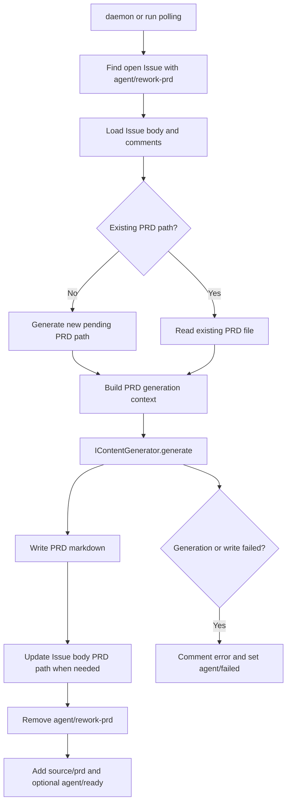

# PRD: Issue 驱动 PRD 自动生成与重写

- GitHub Issue: https://github.com/zata-zhangtao/keda/issues/87


## 1. Introduction & Goals

### 问题说明

当前 `iar` 工具链支持 `issue create`（PRD → Issue），但不支持反向流程：用户在 GitHub 上直接创建 Issue 后，keda 无法自动根据 Issue 内容生成 PRD；当已有 PRD 的 Issue 收到新 comment（需求补充、修正或讨论）后，也无法自动重写 PRD。

这导致两个低效场景：
1. **新 Issue 无 PRD**：用户在 GitHub 页面快速创建 Issue 描述需求后，需要手动复制到本地、按 PRD 格式编写、再运行 `iar issue create` 创建关联 Issue。
2. **需求迭代不同步**：Issue 评论中达成了新共识或修正了需求，但 PRD 文件仍是旧版本，Agent 执行时依据的是过时的 PRD。

### 目标

- 让 daemon 自动监听带有 `agent/rework-prd` label 的 open Issue，根据 Issue 标题、正文和所有评论生成或重写 PRD。
- 支持两种场景：
  - **新建 PRD**：Issue 没有关联 PRD → 生成新 PRD 文件，将 PRD 路径写回 Issue body。
  - **重写 PRD**：Issue 已有关联 PRD → 读取现有 PRD，结合 Issue 全部历史消息重写，覆盖原文件。
- 生成完成后自动更新 Issue label：移除 `agent/rework-prd`，添加 `source/prd`，可选添加 `agent/ready`。
- 复用现有 `GeneratedContentConfig` 和 `IContentGenerator` 架构，不引入新的 AI 调用抽象。

### Proposed Solution Summary

Add a core `create_prd_from_issue` workflow that runs before normal ready-Issue execution and consumes explicit GitHub Issue content, comments, labels, and an optional existing `PRD path:` anchor. The daemon or `run` path detects `agent/rework-prd`, calls the existing generated-content abstraction to create or rewrite a PRD under `tasks/pending/`, updates the Issue body and labels, and reports failure through the existing Issue comment/label workflow. This plugs into current Agent Runner polling and configuration surfaces while intentionally avoiding a new AI abstraction, a new daemon, direct code execution, or a parallel PRD/Issue lifecycle.

### 可衡量目标

- 在 GitHub 上创建 Issue 并打 `agent/rework-prd` 后，daemon 能在下一轮轮询中自动生成 PRD。
- 已有 PRD 的 Issue 新增 comment 后，人工添加 `agent/rework-prd`，daemon 能重写 PRD 并保留原有文件路径。
- PRD 生成失败时，Issue 上保留可操作的错误评论，并进入 `agent/failed` 状态。

### Realistic Validation

除单元测试和集成测试外，本 PRD 要求通过**真实项目入口点**验证关键行为，确保真实使用路径生效，而非仅在隔离 helper 中通过。

- [ ] **新 Issue 生成 PRD 真实验证**：通过 `uv run iar run --max-issues 1` 处理带 `agent/rework-prd` 的测试 Issue，验证本地生成 PRD、Issue body 写入 `PRD path:`、label 切换为 `source/prd`/可选 `agent/ready`。
- [ ] **已有 PRD 重写真实验证**：通过同一入口处理已有 `PRD path:` 的 Issue，验证原路径文件被重写且新 comment 需求进入 PRD。
- [ ] **失败回退真实验证**：通过只读 `tasks/pending/` 或 fake write failure 验证 Issue 进入 `agent/failed` 并写入可操作错误评论。
- [ ] **为什么单元测试不够**：该功能连接 CLI/daemon polling、GitHub Issue labels/body/comments、AI content generation、文件写入和 label 回写；必须通过真实入口证明组合路径收敛。

### Delivery Dependencies

- Group: prd-from-issue-generation
- Depends on groups:
  - none
- Depends on tasks/issues:
  - none
- Gate type: none
- Notes: This PRD is the upstream base workflow for `P2-FEAT-20260528-110730-prd-deliberation-review`. It does not depend on that review enhancement.

---

## 2. Requirement Shape

| 方面 | 值 |
|------|-----|
| **执行者** | `iar daemon` 轮询进程 |
| **触发条件** | open Issue 带有 `agent/rework-prd` label |
| **前置条件** | `gh` CLI 认证有效；仓库本地可写；`tasks/pending/` 目录存在 |
| **预期行为** | 读取 Issue 标题、body、所有 comments → 调用 AI agent 生成 PRD → 写入/覆盖文件 → 更新 Issue body 和 labels |
| **范围边界** | 仅处理 PRD 生成；不执行代码、不创建 branch、不创建 PR；不处理已 closed Issue |

---

## 3. Repository Context And Architecture Fit

### 当前相关模块

| 文件 | 角色 |
|------|------|
| `src/backend/core/use_cases/create_issue_from_prd.py` | PRD → Issue 流程；包含 PRD 路径解析、issue body 模板、label 管理 |
| `src/backend/core/use_cases/run_agent_daemon.py` | Daemon 轮询循环；调用 `run_once()` 处理 `agent/ready` issues |
| `src/backend/core/use_cases/agent_runner_orchestrate.py` | Issue 生命周期编排；ready/running/review 状态流转 |
| `src/backend/core/use_cases/generated_content.py` | AI 内容生成；`generate_issue_content`、`generate_pr_content` |
| `src/backend/infrastructure/github_client.py` | `gh` CLI 封装；`list_ready_issues`、`list_issue_comments`、`edit_issue_labels` 等 |
| `src/backend/core/shared/models/agent_runner.py` | `LabelConfig`、`GeneratedContentConfig`、`GeneratedContentTargetConfig` |
| `src/backend/infrastructure/config/settings.py` | pydantic-settings 配置；`AgentRunnerLabelSettings`、`AgentRunnerGeneratedContentSettings` |
| `src/backend/api/cli.py` | CLI 入口；`daemon`、`run` 子命令 |

### 需遵循的现有架构模式

1. **四层依赖方向**：新增 use case 放在 `core/use_cases/`，不直接导入 `infrastructure/`；GitHub 操作通过 `IGitHubClient` 接口。
2. **配置层级**：新增配置字段放在 `AgentRunnerLabelSettings` 和 `AgentRunnerGeneratedContentSettings`，通过 `factory.py` 转换为 frozen dataclass。
3. **内容生成**：复用 `IContentGenerator.generate()` 接口和 `GeneratedContentTargetConfig` 配置结构。
4. **Daemon 轮询**：在现有 `run_agent_daemon` 的 pass 循环中集成，先处理 `rework-prd`，再处理 `ready`。

### 所有权与依赖边界

```
run_agent_daemon (api/cli.py 间接调用)
  ├─ process_prd_rework_issues (新增 core use case)
  │   ├─ github_client.list_rework_prd_issues (infrastructure 扩展)
  │   ├─ github_client.list_issue_comments (infrastructure 已有)
  │   ├─ generate_prd_content (core/generated_content.py 扩展)
  │   └─ github_client.edit_issue / edit_issue_labels (infrastructure 已有)
  └─ run_once (现有 core use case)
```

### 约束条件

- 必须遵循 `api/ → core/ → engines/ → infrastructure/` 依赖方向。
- PRD 文件命名必须遵循最新 PRD skill 规范：`P<priority>-<TYPE>-YYYYMMDD-HHMMSS-<slug>.md`。
- 不能添加新的外部依赖；复用现有 `gh` CLI 和 AI agent 调用机制。
- PRD 生成失败时，必须在 Issue 上 comment 错误详情，并将 label 切到 `agent/failed`。
- 重写 PRD 时，必须保留原文件路径（不创建新文件）。
- 生成完成后，Issue body 必须包含 `PRD path: <path>` 锚点（与 `iar issue create` 正向流程一致）。

### Existing PRD Relationship

- Blocks `tasks/pending/P2-FEAT-20260528-110730-prd-deliberation-review.md`, which depends on the base PRD generation/rewrite workflow defined here.
- Related to `tasks/pending/P2-FEAT-20260527-162000-agent-runner-unified-entry.md`; `iar ask` may recommend PRD creation, but this PRD owns automated issue-to-PRD generation.
- Does not duplicate any pending PRD; this is the upstream generation workflow.

### Potential Redundancy Risks

- Do not add a second AI content generator abstraction; extend `GeneratedContentConfig` and `IContentGenerator`.
- Do not create a separate daemon loop; integrate into the existing Agent Runner polling pass before ready-Issue execution.
- Do not create new PRD files when rewriting an Issue that already has a `PRD path:` anchor.

---

## 4. Recommendation

### Recommended Approach

**在现有 daemon 轮询中增加 PRD rework 阶段。**

1. **配置扩展**：
   - `LabelConfig` 新增 `rework_prd: str = "agent/rework-prd"`
   - `GeneratedContentConfig` 新增 `prd_from_issue: GeneratedContentTargetConfig`
   - `AgentRunnerLabelSettings` 和 `AgentRunnerGeneratedContentSettings` 同步扩展

2. **GitHub Client 扩展**：
   - `GitHubCliClient.list_rework_prd_issues(rework_prd_label: str, limit: int) -> list[IssueSummary]`：与 `list_ready_issues` 实现模式相同，筛选 `agent/rework-prd`。

3. **内容生成扩展**：
   - `generated_content.py` 新增 `build_prd_context()` 和 `generate_prd_content()`：
     - 输入：issue 标题、body、所有 comments、现有 PRD 文本（如有）
     - 输出：PRD 完整 markdown 文本
     - 支持 `template` 和 `agent` 两种 mode
   - `agent` mode 的 prompt 必须包含：
     - Issue 完整上下文（title + body + comments 拼接）
     - 现有 PRD 文本（如果有）
     - 明确指令：生成符合本项目 PRD 格式的 markdown，包含 Introduction、Requirement Shape、Architecture Fit、Implementation Guide、Acceptance Checklist
     - 如果提供了现有 PRD，指令为 "rewrite the PRD based on the full issue history"

4. **新增 use case**：`src/backend/core/use_cases/create_prd_from_issue.py`
   - `CreatePrdFromIssueRequest`：输入参数（repo_path、issue、config、agent 等）
   - `create_prd_from_issue()` 主函数：
     1. 从 issue body 提取现有 PRD 路径（`extract_prd_path` 复用已有函数）
     2. 收集 issue body + 所有 comments 作为上下文
     3. 调用 `generate_prd_content()` 生成 PRD 文本
     4. 确定 PRD 文件路径：
        - 已有 PRD → 复用原路径
        - 新建 PRD → `tasks/pending/P<priority>-<TYPE>-YYYYMMDD-HHMMSS-<slug>.md`
     5. 写入文件（覆盖或新建）
     6. 如果是新建 PRD，更新 issue body 添加 `PRD path` 锚点
     7. 更新 labels：移除 `agent/rework-prd`，添加 `source/prd`，可选添加 `agent/ready`
     8. 在 issue 上 comment 成功通知（包含 PRD 路径和生成模式）

5. **Daemon 集成**：
   - `run_agent_daemon.py` 每个 repository pass：
     1. 先调用 `process_prd_rework_issues()`（最多 `max_prd_issues`，默认 1）
     2. 再调用 `run_once()`（处理 `agent/ready` issues）
   - 失败隔离：PRD rework 失败不影响 ready issues 的处理。

6. **PRD slug 生成**：
   - 从 issue title 提取：小写、替换空格和特殊字符为 `-`、限制长度。
   - 如果已有 PRD，复用原文件路径；新建 PRD 时按最新 PRD skill 的 priority/type/timestamp slug 命名。

### Why This Is The Best Fit

- **最小改动**：复用现有 `IssueSummary`、`LabelConfig`、`GeneratedContentTargetConfig`、`IGitHubClient`、`IContentGenerator` 全部既有抽象。
- **架构一致**：与 `create_issue_from_prd.py` 形成对称的反向流程，命名和结构保持一致。
- **向后兼容**：新增 label 和配置字段都有默认值，不影响现有行为。
- **失败安全**：PRD 生成失败时 label 进入 `agent/failed`，不丢失 Issue 状态。

### Rationale For Rejecting Redundant Abstractions

- 不新增 PRD generation service；现有 `generated_content.py` 已拥有 agent/template/fallback 生成路径。
- 不新增 Issue polling daemon；现有 daemon pass 已经是 Agent Runner 的 durable workflow loop。
- 不新增 PRD storage index；Issue body 的 `PRD path:` anchor and repository files are the source of truth.

### Alternatives Considered

| 替代方案 | 拒绝原因 |
|----------|----------|
| 新增独立 `prd-daemon` 子命令 | 增加运维复杂度；用户需要维护两个 daemon；现有 daemon 的空闲轮询资源可以复用 |
| 在 `run_once` 内部穿插处理 | 污染 `run_once` 职责；PRD 生成和代码执行是独立阶段，应分层 |
| 使用 webhook 替代轮询 | 需要公开可访问的 HTTP endpoint，与现有本地 runner 架构不符 |
| 每次 comment 变更自动触发（不依赖 label） | 过于灵敏；可能因机器人评论或格式修正而误触发；label 作为显式意图更安全 |

---

## 5. Implementation Guide

This section is a living implementation guide based on current repository analysis. If implementation discovers additional affected files, hidden dependencies, edge cases, or a better path, update this PRD before proceeding.

### Change Impact Tree

```text
.
├── Domain
│   ├── src/backend/core/shared/models/agent_runner.py
│   │   [修改]
│   │   【总结】扩展 label 和 generated-content 配置以描述 Issue-to-PRD 生成目标。
│   │
│   │   ├── LabelConfig 增加 rework_prd
│   │   └── GeneratedContentConfig 增加 prd_from_issue target
│   │
│   ├── src/backend/core/use_cases/generated_content.py
│   │   [修改]
│   │   【总结】构建 Issue/comment/现有 PRD 上下文并生成完整 PRD markdown。
│   │
│   ├── src/backend/core/use_cases/create_prd_from_issue.py
│   │   [新增]
│   │   【总结】实现新建 PRD、重写 PRD、Issue body 回写和 label 收口的核心流程。
│   │
│   └── src/backend/core/use_cases/agent_runner_orchestrate.py
│       [修改]
│       【总结】在 ready Issue 执行前处理 agent/rework-prd 队列并隔离失败。
│
├── Infrastructure
│   ├── src/backend/infrastructure/github_client.py
│   │   [修改]
│   │   【总结】补齐查询 rework-prd Issue、读取 comments 和更新 Issue body 的 GitHub CLI 适配。
│   │
│   └── src/backend/infrastructure/config/settings.py
│       [修改]
│       【总结】为 labels 和 generated content 增加可配置默认值。
│
├── Tests
│   └── tests/
│       [修改]
│       【总结】覆盖新建、重写、slug、Issue body anchor、失败 label/comment 和 daemon 集成。
│
└── Docs
    └── docs/guides/agent-runner.md
        [修改]
        【总结】记录 agent/rework-prd 工作流、PRD path anchor 和失败恢复方式。
```

### Executor Drift Guard

Run repository searches before editing because issue/PRD path handling is spread across runner publication and generated-content code:

```bash
rg -n "PRD path|extract_prd_path|create_issue_from_prd|Acceptance Checklist" src tests docs tasks/pending
rg -n "GeneratedContentConfig|GeneratedContentTargetConfig|IContentGenerator|agent/rework-prd|source/prd" src tests docs
rg -n "list_ready_issues|list_issue_comments|edit_issue_labels|edit_issue_body|run_agent_daemon|run_once" src/backend tests
```

The files listed here are starting points, not an exhaustive guarantee. If generated PRD validation fails, inspect the prompt template and generated-content fallback path before changing orchestration. If Issue body updates fail, inspect the `PRD path:` anchor parser and GitHub CLI adapter before adding another body update helper.

### Flow Diagram



### 5.1 配置变更

**`src/backend/infrastructure/config/settings.py`**：

```python
class AgentRunnerLabelSettings(BaseModel):
    ready: str = "agent/ready"
    running: str = "agent/running"
    supervising: str = "agent/supervising"
    review: str = "agent/review"
    failed: str = "agent/failed"
    blocked: str = "agent/blocked"
    rework_prd: str = "agent/rework-prd"  # 新增
    codex: str = "agent/codex"
    claude: str = "agent/claude"
    kimi: str = "agent/kimi"
```

```python
class AgentRunnerGeneratedContentSettings(BaseModel):
    enabled: bool = False
    fallback: str = "template"
    max_input_chars: int = 20000
    default_agent: str = "auto"
    issue_from_prd: AgentRunnerGeneratedContentTargetSettings = Field(...)
    draft_pr: AgentRunnerGeneratedContentTargetSettings = Field(...)
    prd_from_issue: AgentRunnerGeneratedContentTargetSettings = Field(  # 新增
        default_factory=AgentRunnerGeneratedContentTargetSettings
    )
```

**`src/backend/core/shared/models/agent_runner.py`**：

```python
@dataclass(frozen=True)
class LabelConfig:
    ready: str = "agent/ready"
    running: str = "agent/running"
    supervising: str = "agent/supervising"
    review: str = "agent/review"
    failed: str = "agent/failed"
    blocked: str = "agent/blocked"
    rework_prd: str = "agent/rework-prd"  # 新增
    agent_labels: dict[str, str] = field(...)
```

```python
@dataclass(frozen=True)
class GeneratedContentConfig:
    enabled: bool = False
    fallback: str = "template"
    max_input_chars: int = 20000
    default_agent: str = "auto"
    issue_from_prd: GeneratedContentTargetConfig = field(...)
    draft_pr: GeneratedContentTargetConfig = field(...)
    prd_from_issue: GeneratedContentTargetConfig = field(  # 新增
        default_factory=GeneratedContentTargetConfig
    )
```

### 5.2 GitHub Client 扩展

**`src/backend/infrastructure/github_client.py`** 新增：

```python
def list_rework_prd_issues(self, rework_prd_label: str, limit: int) -> list[IssueSummary]:
    """List open Issues with the rework-prd label."""
    result = self._runner.run(
        [
            "gh", "issue", "list",
            "--state", "open",
            "--label", rework_prd_label,
            "--limit", str(limit),
            "--json", "number,title,url,labels,body",
        ],
        cwd=self.repo_path,
    )
    raw_issues = json.loads(result.stdout or "[]")
    return [
        IssueSummary(
            number=int(raw_issue["number"]),
            title=str(raw_issue.get("title", "")),
            url=str(raw_issue.get("url", "")),
            body=str(raw_issue.get("body", "") or ""),
            labels=tuple(
                raw_label.get("name", "")
                for raw_label in raw_issue.get("labels", [])
                if raw_label.get("name")
            ),
        )
        for raw_issue in raw_issues
    ]
```

同时扩展 `edit_issue_labels` 以支持 **编辑 issue body**（`gh issue edit <number> --body-file`），或复用 `comment_issue` 的模式新增 `edit_issue_body` 方法。

### 5.3 内容生成扩展

**`src/backend/core/use_cases/generated_content.py`** 新增：

```python
@dataclass(frozen=True)
class PrdContext:
    """Context variables for PRD generation."""
    issue_number: int
    issue_title: str
    issue_body: str
    issue_comments: str
    existing_prd_text: str
    repo_structure_summary: str


def build_prd_context(
    *,
    issue: IssueSummary,
    comments: list[str],
    existing_prd_text: str,
    repo_path: Path,
) -> PrdContext:
    """Build context for PRD generation from issue and comments."""
    return PrdContext(
        issue_number=issue.number,
        issue_title=issue.title,
        issue_body=issue.body,
        issue_comments="\n\n".join(f"Comment:\n{c}" for c in comments),
        existing_prd_text=existing_prd_text,
        repo_structure_summary=_build_repo_structure_summary(repo_path),
    )


def generate_prd_content(
    *,
    config: GeneratedContentConfig,
    context: PrdContext,
    fallback_prd_text: str,
    generator: IContentGenerator | None = None,
    cwd: Path | None = None,
) -> GeneratedPrdContent:
    """Generate PRD markdown with fallback."""
    target = config.prd_from_issue
    if not config.enabled or not target.enabled:
        return GeneratedPrdContent(text=fallback_prd_text, source="fallback")

    generated_text = ""
    if target.mode == "template" and target.body_template:
        try:
            generated_text = _render_template(target.body_template, context)
        except (KeyError, ValueError):
            pass
    elif target.mode == "agent" and generator is not None and cwd is not None:
        agent_name = target.agent if target.agent != "auto" else config.default_agent
        prompt = _render_template(target.prompt, context)
        prompt = _truncate_text(prompt, config.max_input_chars)
        generated_text = _run_content_generator(
            generator, agent_name, prompt, cwd, target.timeout_seconds
        )

    if generated_text and _validate_prd_output(generated_text):
        return GeneratedPrdContent(text=generated_text, source=target.mode)

    return GeneratedPrdContent(text=fallback_prd_text, source="fallback")
```

**新增 `GeneratedPrdContent` 模型**：

```python
@dataclass(frozen=True)
class GeneratedPrdContent:
    """Result of generated PRD content."""
    text: str
    source: str = "fallback"
```

### 5.4 核心 Use Case

**`src/backend/core/use_cases/create_prd_from_issue.py`**（新增文件）：

```python
"""Generate or rewrite a PRD from a GitHub Issue."""

from __future__ import annotations

import logging
import re
from dataclasses import dataclass
from datetime import datetime, timezone
from pathlib import Path

from backend.core.shared.interfaces.agent_runner import (
    IContentGenerator,
    IGitHubClient,
)
from backend.core.shared.models.agent_runner import (
    AppConfig,
    GeneratedContentConfig,
    IssueSummary,
    LabelConfig,
)
from backend.core.use_cases.agent_runner_feedback import extract_prd_path
from backend.core.use_cases.generated_content import (
    GeneratedPrdContent,
    build_prd_context,
    generate_prd_content,
)

_logger = logging.getLogger(__name__)

PRD_FILENAME_RE = re.compile(r"^\d{8}-\d{6}-prd-(.+)\.md$")


@dataclass(frozen=True)
class CreatePrdFromIssueRequest:
    """Input for creating a PRD from a GitHub Issue."""
    repo_path: Path
    issue: IssueSummary
    config: AppConfig
    generated_content_config: GeneratedContentConfig | None = None
    content_generator: IContentGenerator | None = None
    queue_ready: bool = False


def _generate_slug(issue_title: str) -> str:
    """Convert issue title to a URL-safe slug."""
    slug = issue_title.lower()
    slug = re.sub(r"[^\w\s-]", "", slug)
    slug = re.sub(r"[\s_]+", "-", slug)
    slug = slug.strip("-")
    return slug[:60]


def _resolve_prd_path(
    *,
    repo_path: Path,
    issue: IssueSummary,
    pending_dir: Path = Path("tasks/pending"),
) -> Path:
    """Resolve the target PRD path.

    If the issue already references a PRD, reuse that path.
    Otherwise, generate a new filename following the PRD naming convention.
    """
    existing_prd_path = extract_prd_path(issue.body)
    if existing_prd_path:
        return repo_path / existing_prd_path

    slug = _generate_slug(issue.title)
    timestamp = datetime.now(timezone.utc).strftime("%Y%m%d-%H%M%S")
    filename = f"{timestamp}-prd-{slug}.md"
    return repo_path / pending_dir / filename


def _build_fallback_prd(issue: IssueSummary) -> str:
    """Build a minimal fallback PRD when generation is disabled or fails."""
    return "\n".join([
        f"# PRD: {issue.title}",
        "",
        "- GitHub Issue: " + issue.url,
        "",
        "## 1. Introduction & Goals",
        "",
        f"{issue.body}",
        "",
        "## 2. Requirement Shape",
        "",
        "- **Actor**: User",
        "- **Trigger**: TBD",
        "- **Expected Behavior**: TBD",
        "- **Scope Boundary**: TBD",
        "",
        "## 3. Acceptance Checklist",
        "",
        "- [ ] Define requirements",
        "- [ ] Implement the feature",
        "- [ ] Run verification",
        "",
    ])


def _update_issue_body_with_prd_path(issue_body: str, prd_relative_path: str) -> str:
    """Insert or update the PRD path anchor in the issue body."""
    prd_line = f"- PRD path: `{prd_relative_path}`"
    lines = issue_body.splitlines()
    updated_lines: list[str] = []
    path_written = False
    for line in lines:
        if re.search(r"PRD path:\s*`[^`]+`", line):
            updated_lines.append(prd_line)
            path_written = True
        else:
            updated_lines.append(line)
    if not path_written:
        updated_lines.insert(0, prd_line)
        updated_lines.insert(1, "")
    return "\n".join(updated_lines)


def _extract_existing_prd_text(prd_path: Path) -> str:
    """Read existing PRD text if the file exists."""
    if prd_path.exists():
        return prd_path.read_text(encoding="utf-8")
    return ""


def create_prd_from_issue(
    *,
    request: CreatePrdFromIssueRequest,
    github_client: IGitHubClient,
) -> Path:
    """Generate or rewrite a PRD from a GitHub Issue.

    Returns:
        The absolute path to the written PRD file.

    Raises:
        RuntimeError: If PRD generation fails critically.
    """
    issue = request.issue
    repo_path = request.repo_path
    labels_config = request.config.labels

    prd_path = _resolve_prd_path(repo_path=repo_path, issue=issue)
    existing_prd_text = _extract_existing_prd_text(prd_path)
    is_rewrite = bool(existing_prd_text)

    comments = github_client.list_issue_comments(issue.number)
    gc_config = request.generated_content_config

    if gc_config is not None and gc_config.enabled:
        gc_context = build_prd_context(
            issue=issue,
            comments=comments,
            existing_prd_text=existing_prd_text,
            repo_path=repo_path,
        )
        gc_cwd = repo_path if request.content_generator is not None else None
        generated = generate_prd_content(
            config=gc_config,
            context=gc_context,
            fallback_prd_text=_build_fallback_prd(issue),
            generator=request.content_generator,
            cwd=gc_cwd,
        )
        prd_text = generated.text
    else:
        prd_text = _build_fallback_prd(issue)

    prd_path.write_text(prd_text, encoding="utf-8")
    _logger.info("%s PRD at %s", "Rewrote" if is_rewrite else "Created", prd_path)

    relative_prd_path = prd_path.relative_to(repo_path.resolve()).as_posix()

    updated_body = _update_issue_body_with_prd_path(issue.body, relative_prd_path)
    if updated_body != issue.body:
        github_client.edit_issue_body(issue.number, updated_body)

    labels_to_remove = [labels_config.rework_prd]
    labels_to_add = ["source/prd"]
    if request.queue_ready:
        labels_to_add.append(labels_config.ready)

    github_client.edit_issue_labels(
        issue.number,
        add=labels_to_add,
        remove=labels_to_remove,
    )

    action = "rewrote" if is_rewrite else "generated"
    github_client.comment_issue(
        issue.number,
        f"PRD {action} successfully.\n\n"
        f"- PRD path: `{relative_prd_path}`\n"
        f"- Source: {'AI agent' if gc_config and gc_config.enabled else 'fallback template'}\n"
    )

    return prd_path
```

### 5.5 Daemon 集成

**`src/backend/core/use_cases/agent_runner_orchestrate.py`** 新增：

```python
def process_prd_rework_issues(
    *,
    repo_path: Path,
    config: AppConfig,
    github_client: IGitHubClient,
    content_generator: IContentGenerator | None,
    max_issues: int = 1,
) -> None:
    """Process Issues labeled for PRD rework.

    Finds open Issues with the configured rework-prd label, generates or
    rewrites their canonical PRD, and updates labels.
    """
    issues = github_client.list_rework_prd_issues(
        config.labels.rework_prd, limit=max_issues
    )
    for issue in issues:
        _logger.info(
            "Processing PRD rework for Issue #%d: %s", issue.number, issue.title
        )
        try:
            create_prd_from_issue(
                request=CreatePrdFromIssueRequest(
                    repo_path=repo_path,
                    issue=issue,
                    config=config,
                    generated_content_config=config.generated_content,
                    content_generator=content_generator,
                    queue_ready=True,
                ),
                github_client=github_client,
            )
        except Exception as exc:
            _logger.exception("PRD rework failed for Issue #%d", issue.number)
            github_client.edit_issue_labels(
                issue.number,
                add=[config.labels.failed],
                remove=[config.labels.rework_prd],
            )
            github_client.comment_issue(
                issue.number,
                f"PRD generation failed: {exc}\n\n"
                "Please review the error and re-add the "
                f"`{config.labels.rework_prd}` label to retry.",
            )
```

**`src/backend/core/use_cases/run_agent_daemon.py`** 修改 pass 循环：

```python
def run_agent_daemon(...):
    while True:
        for context in contexts:
            github_client = github_client_factory(context.repo_path)
            try:
                # Phase 1: PRD rework
                process_prd_rework_issues(
                    repo_path=context.repo_path,
                    config=context.config,
                    github_client=github_client,
                    content_generator=content_generator_factory(context.repo_path)
                        if content_generator_factory else None,
                    max_issues=max_prd_issues,
                )
            except Exception as exc:
                _logger.error("PRD rework phase failed: %s", exc)

            try:
                # Phase 2: Ready issue execution
                run_once(...)
            except Exception as exc:
                _logger.error("Daemon pass failed: %s", exc)
        time.sleep(interval)
```

> **注意**：`content_generator_factory` 需要通过现有 `factory.py` 的 `create_content_generator` 注入。如果工厂签名的变更范围过大，可以先在 `run_agent_daemon` 的签名中新增可选的 `content_generator_factory` 参数。

### 5.6 PRD 生成 Prompt 模板（agent mode）

默认 prompt 应放在 `AgentRunnerGeneratedContentTargetSettings` 的 `prompt` 字段中：

```
You are a technical product manager. Write a comprehensive PRD (Product Requirements Document) in Markdown format.

Prompt Section: Input Context

GitHub Issue #{issue_number}: {issue_title}

Issue Body:
{issue_body}

Issue Comments (chronological):
{issue_comments}

{existing_prd_section}

Prompt Section: Repository Structure Summary
{repo_structure_summary}

Prompt Section: Output Requirements

1. Write the PRD in the same language as the Issue title (Chinese if title is Chinese, English otherwise).
2. Follow this exact structure:
   - `# PRD: <title>`
   - `- GitHub Issue: <url>` (preserve existing if present)
   - `## 1. Introduction & Goals`
   - `## 2. Requirement Shape`
   - `## 3. Repository Context And Architecture Fit`
   - `## 4. Recommendation`
   - `## 5. Implementation Guide`
   - `## 6. Definition Of Done`
   - `## 7. Acceptance Checklist`
   - `## 8. Functional Requirements`
   - `## 9. Non-Goals`
   - `## 10. Risks And Follow-Ups`
   - `## 11. Decision Log`
3. If `existing_prd_text` is provided, rewrite it based on the full issue history. Preserve sections that are still valid, update changed requirements, and add new ones from comments.
4. The PRD must be specific enough for an AI coding agent to implement.
5. Output only the PRD markdown, no extra commentary.
```

其中 `{existing_prd_section}` 在有现有 PRD 时展开为：

```
Prompt Section: Existing PRD (to be rewritten)

{existing_prd_text}
```

无现有 PRD 时为空字符串。

---

### Realistic Validation Plan

| Behavior | Real Entry Point | Test Layer | Mock Boundary | Data/Env Needed | Command Or Procedure | Required For Acceptance |
|---|---|---|---|---|---|---|
| New Issue creates PRD | `uv run iar run --max-issues 1` | smoke/sandbox | Fake `gh` and fake content generator allowed; file write real | Test Issue fixture with `agent/rework-prd`, writable `tasks/pending/` | Run entry point and assert PRD file exists, Issue body contains `PRD path:`, labels move to `source/prd` and optional `agent/ready` | Yes |
| Existing PRD rewrite | same runner entry point | smoke/sandbox | Fake `gh`; file write real | Issue fixture with existing `PRD path:` and new comments | Run entry point and assert same file path is overwritten with comment-derived requirement updates | Yes |
| Failure rollback | same runner entry point | smoke/sandbox | Fake write failure or read-only temp `tasks/pending/` | Test Issue with `agent/rework-prd` | Run entry point and assert Issue receives actionable failure comment and `agent/failed` label | Yes |
| Live GitHub optional validation | `gh issue create` + runner entry point | manual/sandbox | None | Disposable GitHub Issue, authenticated `gh`, cleanup plan | Create test Issue, add `agent/rework-prd`, run one pass, inspect `gh issue view <n> --json labels,comments,body` | No unless credentials are explicitly available |
| Full regression | `just test` | integration | Repository defaults | None | `just test` | Yes |

Live GitHub validation is opt-in and should not block acceptance when credentials are unavailable; fake `gh` smoke coverage plus real local file output remains required. If runner entry validation fails, inspect label filtering in `github_client.py`, `PRD path:` body update logic, and the generated-content prompt before changing daemon orchestration.

### Low-Fidelity Prototype

No low-fidelity prototype required for this PRD; behavior is a CLI/GitHub workflow.

### ER Diagram

No database ER diagram required. The only persisted structured state is the PRD markdown file path in GitHub Issue body and the repository file under `tasks/pending/`.

### Interactive Prototype Change Log

No interactive prototype file changes in this PRD.

### External Validation

No external validation required; repository evidence and optional sandbox GitHub validation are sufficient.

## 6. Definition Of Done

- `agent/rework-prd` Issues are processed before normal ready-Issue execution in the existing runner pass.
- New Issue input produces one PRD file under `tasks/pending/` using latest priority/type PRD naming.
- Existing `PRD path:` input rewrites the same PRD path rather than creating duplicates.
- Issue body, labels, and comments are updated through `IGitHubClient` and remain recoverable on failure.
- Generated PRDs follow the latest required PRD structure, including Delivery Dependencies and Realistic Validation.
- Unit, integration, realistic entry validation, docs update, and `just test` complete before archival.

## 7. Acceptance Checklist

### Configuration Acceptance

- [ ] `LabelConfig` 和 `AgentRunnerLabelSettings` 新增 `rework_prd` 字段，默认值为 `"agent/rework-prd"`。
- [ ] `GeneratedContentConfig` 和 `AgentRunnerGeneratedContentSettings` 新增 `prd_from_issue` 字段。

### GitHub Integration Acceptance

- [ ] `GitHubCliClient` 新增 `list_rework_prd_issues()` 方法，返回类型与 `list_ready_issues` 一致。
- [ ] `GitHubCliClient` 新增 `edit_issue_body()` 方法（或复用现有能力更新 issue body）。

### Generation Acceptance

- [ ] `generated_content.py` 新增 `PrdContext`、`build_prd_context()`、`generate_prd_content()` 和 `GeneratedPrdContent`。
- [ ] 新增 `src/backend/core/use_cases/create_prd_from_issue.py`，包含完整的 "新建 PRD" 和 "重写 PRD" 逻辑。

### Workflow Acceptance

- [ ] `agent_runner_orchestrate.py` 新增 `process_prd_rework_issues()` 函数，失败时切 label 到 `agent/failed` 并 comment 错误详情。
- [ ] `run_agent_daemon.py` 每个 repository pass 先执行 PRD rework 阶段，再执行 ready issue 阶段；两个阶段错误隔离。
- [ ] `factory.py` 更新配置转换逻辑，把 `rework_prd` 和 `prd_from_issue` 纳入 `AppConfig` 构建。

### Validation Acceptance

- [ ] `tests/` 覆盖：
  - `list_rework_prd_issues` 正确筛选 label
  - `create_prd_from_issue` 新建场景（无现有 PRD）
  - `create_prd_from_issue` 重写场景（有现有 PRD，复用原路径）
  - `_generate_slug` 边界情况（特殊字符、超长标题）
  - `_update_issue_body_with_prd_path` 插入和更新逻辑
  - `process_prd_rework_issues` 失败时的 label 和 comment 回退
- [ ] `uv run iar run --max-issues 1` 通过 fake `gh` / fake content generator fixture 证明新建、重写和失败回退真实入口路径。
- [ ] `just test` 全量通过。

### Documentation Acceptance

- [ ] `docs/` 中同步更新相关文档（如 `docs/architecture/system-design.md` 中涉及 Agent Runner 流程的章节）。

## 8. Functional Requirements

- **FR-1**: The runner MUST detect open Issues labeled `agent/rework-prd` before processing normal ready Issues.
- **FR-2**: For an Issue without a `PRD path:` anchor, the workflow MUST generate a new PRD file under `tasks/pending/` using latest priority/type/timestamp naming.
- **FR-3**: For an Issue with an existing `PRD path:` anchor, the workflow MUST rewrite that same file path and MUST NOT create a duplicate PRD.
- **FR-4**: PRD generation MUST use `IContentGenerator` and existing generated-content configuration rather than direct infrastructure calls from core.
- **FR-5**: The generated PRD MUST include the latest required PRD structure, including Delivery Dependencies and Realistic Validation.
- **FR-6**: On success, the workflow MUST update Issue body/comment/labels to remove `agent/rework-prd`, add `source/prd`, and optionally add `agent/ready`.
- **FR-7**: On failure, the workflow MUST leave an actionable Issue comment and transition labels to `agent/failed` without corrupting the PRD file.
- **FR-8**: The daemon pass MUST isolate PRD rework failures from normal ready-Issue execution.
- **FR-9**: Tests MUST cover new PRD, rewrite, slug, body-anchor update, label update, and failure rollback behavior.

## 9. Non-Goals

- No code implementation, branch creation, PR creation, or agent execution from `agent/rework-prd` itself.
- No GitHub webhook, GitHub Action, public HTTP endpoint, or second daemon.
- No new AI provider abstraction; use the existing content generation boundary.
- No automatic trigger on every Issue comment without the explicit `agent/rework-prd` label.
- No duplicate PRD versioning scheme for rewritten PRDs.

## 10. Risks And Follow-Ups

- PRD generation can produce non-compliant markdown; mitigate by strengthening the prompt and testing generated structure through repository parsing.
- Live GitHub validation depends on credentials; fake `gh` smoke validation remains required and live sandbox validation is opt-in.
- Rewriting an existing PRD can discard useful manual context if the prompt omits it; always include the previous PRD text in rewrite context.
- Slug generation for multilingual or punctuation-heavy titles can collide; add deterministic suffixing or fallback timestamp behavior during implementation.

## 11. Decision Log

| ID | Decision | Chosen | Rejected | Rationale |
|---|---|---|---|---|
| D-01 | Trigger mechanism | Explicit `agent/rework-prd` label | Automatic comment-driven regeneration | A label records human intent and avoids accidental rewrites from bot comments or minor edits. |
| D-02 | Entry point | Existing daemon/runner pass before ready Issues | New `prd-daemon` process | The current polling loop already owns Issue lifecycle work and can isolate PRD generation before code execution. |
| D-03 | Content generation boundary | Reuse `IContentGenerator` / `GeneratedContentConfig` | New PRD-specific AI client | The existing boundary already supports agent/template/fallback generation and preserves architecture direction. |
| D-04 | Rewrite behavior | Preserve existing PRD path | Create a new file for every rewrite | Stable Issue-to-PRD references are required for runner closeout and human review. |
