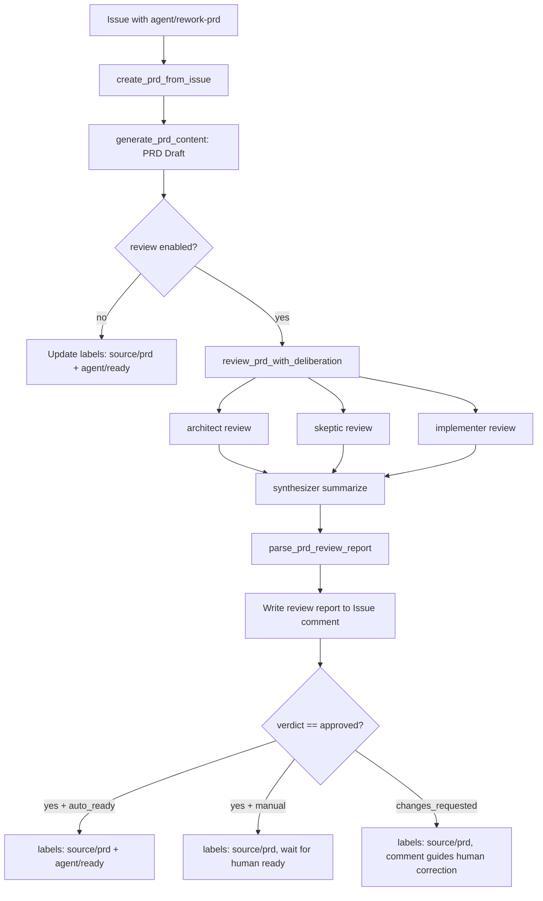

# PRD: PRD Review Multi-Agent Deliberation Enhancement

## 1. Introduction & Goals

### Problem Statement

当前 `prd-from-issue` 工作流（定义在 `tasks/pending/20260527-190923-prd-prd-from-issue.md`）使用单 agent 一次生成 PRD 初稿。这引入了固有风险：

1. **架构幻觉**：agent 可能编造不存在的模块、接口或架构模式。
2. **需求遗漏**：忽略 issue 评论中的关键共识、边界条件或修正意见。
3. **格式漂移**：PRD 结构可能偏离项目标准，导致下游执行 agent 理解困难。
4. **与现有代码冲突**：生成的 PRD 可能未充分考虑仓库的真实架构约束和既有实现路径。

### Measurable Objectives

- `agent/rework-prd` 工作流在生成 PRD 初稿后自动触发多 agent review。
- Review report 包含结构化 verdict（`approved` / `changes_requested`）、发现列表、风险列表和下一步操作指引。
- Review report 写入 Issue comment，人类可通过重新打 `agent/rework-prd` 或打 `agent/ready` 决定后续动作。
- Review 阶段保持只读，不修改仓库代码。

### Realistic Validation

除单元测试和集成测试外，本 PRD 要求通过**真实项目入口点**验证关键行为，确保真实使用路径生效，而非仅在隔离 fixture 中通过。

- [ ] **PRD Review Deliberation 真实验证**：通过 `uv run iar run-once --max-issues 1` 处理一个带有 `agent/rework-prd` 的测试 Issue，确认 Issue comment 中出现结构化 review report。
- [ ] **Review 报告人类确认流程真实验证**：在 review report comment 中确认 verdict 和后续操作指引清晰，人类可以通过重新打 `agent/rework-prd` 触发重写，或直接打 `agent/ready` 跳过。
- [ ] **为什么单元测试不够**：deliberation 涉及多 agent 并发编排、prompt 构建、report 解析和 Issue comment 写入，这些跨层交互需要真实 entry point 验证端到端行为。

---

## 2. Requirement Shape

- **Actor**: `iar daemon` 轮询进程 / `iar run-once`
- **Trigger**: 打开带有 `agent/rework-prd` 标签的 Issue，且配置中 `prd_from_issue.review_enabled = true`
- **Expected Behavior**: 生成 PRD 初稿 → 多 agent review → 写 review report 到 Issue comment → 根据 verdict 更新标签
- **Scope Boundary**: Review 阶段只读，不修改仓库代码。不替代人类最终审核。不引入新 agent 框架。不影响现有 `iar deliberate` CLI。

---

## 3. Repository Context And Architecture Fit

### Existing Relevant Modules

| 文件 | 角色 |
|------|------|
| `src/backend/core/use_cases/run_agent_deliberation.py` | 多 agent deliberation 编排器（成熟且已归档） |
| `src/backend/core/shared/models/agent_deliberation.py` | `DeliberationConfig`、`DeliberationRequest`、`DeliberationResult` 纯模型 |
| `src/backend/core/use_cases/generated_content.py` | AI 内容生成，三级级联（agent / template / fallback） |
| `src/backend/engines/agent_runner/factory.py` | Settings → core config 映射；deliberation config 和 transcript runner 创建 |
| `src/backend/infrastructure/config/settings.py` | Pydantic-settings 配置定义 |
| `src/backend/core/shared/models/agent_runner.py` | `AppConfig`、`GeneratedContentConfig`、`GeneratedContentTargetConfig` |
| `config.toml` | 已有 `[agent_runner.deliberation]` 配置段和默认 profiles |
| `tasks/pending/20260527-190923-prd-prd-from-issue.md` | `prd-from-issue` pending PRD，定义 `create_prd_from_issue` 基础流程 |

### Architecture Patterns To Preserve

1. **四层依赖方向**：新增 use case 放在 `core/use_cases/`，GitHub 操作通过 `IGitHubClient` 接口完成。
2. **配置层级**：新增配置放在 `AgentRunnerGeneratedContentTargetSettings` 中（作为 `prd_from_issue` 子配置的扩展），通过 `factory.py` 转换为 frozen dataclass。
3. **Deliberation 复用**：直接调用 `run_agent_deliberation()`，不复制其并发编排、event sink 或 transcript runner 逻辑。
4. **只读安全**：Review 阶段使用 deliberation 的只读规则，agent cwd 放在 `logs/` 下的 session workspace，与目标仓库隔离。
5. **Python 文本 I/O**：所有文件读写必须显式使用 `encoding="utf-8"`。

### Ownership And Dependency Boundaries

```
create_prd_from_issue (core use case)
  ├─ generate_prd_content (generated_content.py 已有/待实现)
  ├─ review_prd_with_deliberation (新增 core use case)
  │   ├─ build_prd_review_prompt (构建 review 专用 prompt)
  │   ├─ run_agent_deliberation (复用现有 deliberation 编排)
  │   └─ parse_prd_review_report (解析 synthesizer 输出)
  └─ github_client.comment_issue / edit_issue_labels
```

---

## 4. Recommendation

### Recommended Approach

**在 `create_prd_from_issue` 流程中嵌入可选的 PRD Review Deliberation 阶段。**

#### 1. Configuration Extension

在 `AgentRunnerGeneratedContentTargetSettings`（settings 层）和 `GeneratedContentTargetConfig`（core 层）中扩展 review 字段：

```python
# settings.py
class AgentRunnerGeneratedContentTargetSettings(BaseModel):
    # 已有字段...
    review_enabled: bool = False
    review_mode: str = "deliberation"   # "none" | "single" | "deliberation"
    review_auto_ready: bool = False     # review 通过时自动添加 agent/ready
    review_max_input_chars: int = 30000
```

```python
# agent_runner.py (core models)
@dataclass(frozen=True)
class GeneratedContentTargetConfig:
    # 已有字段...
    review_enabled: bool = False
    review_mode: str = "deliberation"
    review_auto_ready: bool = False
    review_max_input_chars: int = 30000
```

#### 2. PRD Review Deliberation Use Case

新增文件：`src/backend/core/use_cases/review_prd_with_deliberation.py`：

- **`build_prd_review_prompt`**：构建 PRD review 专用 prompt，包含：
  - 原始 Issue 标题、body、comments（需求基准）
  - PRD 初稿全文（审查对象）
  - 仓库结构摘要（架构适配性依据）
  - 明确审查指令和输出格式要求

- **`parse_prd_review_report`**：从 `DeliberationResult` synthesizer 输出中解析结构化 verdict。

- **`PrdReviewReport` dataclass**：包含 `verdict`、`findings`、`risks`、`recommendation`、`source`。

#### 3. Prompt Design

PRD review 专用 prompt 的核心结构：

```
You are a panel of technical reviewers evaluating a Product Requirements Document.

## Original Requirement Context
[Issue title, body, comments]

## PRD Under Review
[prd_draft_text]

## Repository Structure Summary
[repo_structure_summary]

## Review Dimensions
1. Architecture Fit: Does the PRD align with existing module boundaries and dependency directions?
2. Requirement Completeness: Are all requirements from the Issue and comments captured? Any omissions or contradictions?
3. Format Compliance: Does the PRD follow the project's standard structure (Introduction, Requirement Shape, Architecture Fit, Implementation Guide, Acceptance Checklist)?
4. Implementation Feasibility: Are the recommended solutions realistic given the current codebase?

## Output Requirements
Finish with a single JSON object in a markdown code block:
{
  "verdict": "approved" | "changes_requested",
  "findings": [
    {"severity": "high" | "medium" | "low", "category": "architecture" | "requirements" | "format" | "feasibility", "description": "...", "evidence": "..."}
  ],
  "risks": ["..."],
  "recommendation": "..."
}
```

#### 4. Integration With `create_prd_from_issue`

生成 PRD 初稿并写入文件后，如果 review 启用：

1. 调用 `review_prd_with_deliberation()` 生成 `PrdReviewReport`。
2. 将 report 格式化为人类可读的 Issue comment（含 verdict、findings count、关键发现、风险、下一步操作指引）。
3. 更新标签：
   - 移除 `agent/rework-prd`
   - 添加 `source/prd`
   - 如果 `review_auto_ready == true` 且 `verdict == "approved"`，添加 `agent/ready`
   - 否则不添加 `agent/ready`，等待人类确认
4. 如果 `verdict != "approved"`，在 comment 中明确指引：
   - "若同意 review 意见，编辑 PRD 文件后重新添加 `agent/rework-prd` 触发重写"
   - "若认为 review 有误，添加 `agent/ready` 继续执行"

#### 5. Review Report Comment Format

```markdown
<!-- iar:event version=1 phase=prd_review verdict=changes_requested -->

## PRD Review Report

- **Verdict**: changes_requested
- **Reviewers**: architect, skeptic, implementer
- **Findings**: 2 high, 1 medium, 0 low

### Key Findings

1. **[high] [architecture]** The PRD proposes a new use case in `core/use_cases/` that directly imports from `infrastructure/`, violating the four-layer dependency rule.
2. **[high] [requirements]** Issue comment #3 requested idempotent label updates, but the PRD Acceptance Checklist does not include this.
3. **[medium] [format]** Section 5 (Implementation Guide) is missing the required `Executor Drift Guard` subsection.

### Risks

- Direct infrastructure import may pass unit tests but fail architecture checks in CI.

### Next Actions

- If you agree with this review, edit the PRD file and re-add the `agent/rework-prd` label to regenerate.
- If you disagree, add the `agent/ready` label to proceed with the current PRD.
```

### Why This Is The Best Fit

- **复用成熟框架**：`run_agent_deliberation` 已实现并发编排、event sink、transcript runner、Claude stream-json 过滤，无需重新造轮子。
- **成本可控**：`review_mode` 三级分级（`none` / `single` / `deliberation`），简单 PRD 可跳过 review，控制 token 消耗。
- **人类把关**：默认 `review_auto_ready = false`，review report 作为辅助决策，不自动强制阻塞或放行。
- **向后兼容**：新增配置字段都有默认值，`review_enabled = false` 时行为与原有 `prd-from-issue` 完全一致。

### Alternatives Considered

| 替代方案 | 拒绝原因 |
|----------|----------|
| 让 synthesizer 输出修正后的完整 PRD | PRD 格式严格，synthesizer 容易破坏格式；修正应由擅长遵循格式的单 agent 在下一轮完成 |
| 新增独立 `prd-review` CLI 命令 | 增加用户操作负担；review 应作为 daemon 自动流程的一部分，与人类 workflow 无缝衔接 |
| 全自动修正（不经过人类确认） | review agent 本身也可能出错，PRD 是"核心中的核心"，需要人类最终把关 |
| 在 deliberation 中允许 agent 直接修改 PRD 文件 | 违反 deliberation 的只读安全边界；多个 agent 并发写同一文件不可控 |

---

## 5. Implementation Guide

This section is a living implementation guide based on current repository analysis. If implementation discovers additional affected files, hidden dependencies, edge cases, or a better path, update this PRD before proceeding.

### 5.1 Core Logic

```
create_prd_from_issue:
  1. 解析现有 PRD 路径，收集 Issue + comments 上下文
  2. 调用 generate_prd_content() 生成 PRD 初稿
  3. 写入 PRD 初稿到文件

  4. 如果 review_enabled:
       review_report = review_prd_with_deliberation(
           prd_draft=prd_draft,
           issue=issue,
           comments=comments,
           repo_path=repo_path,
           config=config,
           transcript_runner=transcript_runner,
       )

       comment_body = format_prd_review_comment(review_report)
       github_client.comment_issue(issue.number, comment_body)

       labels_to_remove = [agent/rework-prd]
       labels_to_add = [source/prd]
       if review_report.verdict == "approved" and review_auto_ready:
           labels_to_add.append(agent/ready)

       github_client.edit_issue_labels(
           issue.number,
           add=labels_to_add,
           remove=labels_to_remove,
       )

       if review_report.verdict != "approved" or not review_auto_ready:
           附加操作指引到 comment

       return prd_path

  5. 如果 review 禁用:
       按原有逻辑更新标签（source/prd + agent/ready）
```

### 5.2 Change Impact Tree

```text
.
├── src/backend/core/use_cases/
│   └── review_prd_with_deliberation.py
│       [新增]
│       【总结】PRD 多 agent 审查专用 use case，封装 prompt 构建、deliberation 调用、report 解析
│
│       ├── build_prd_review_prompt(): 构建包含 PRD 初稿、Issue 上下文、仓库结构的 review prompt
│       ├── parse_prd_review_report(): 从 DeliberationResult 解析 verdict 和 findings
│       └── PrdReviewReport dataclass
│
├── src/backend/core/use_cases/
│   └── create_prd_from_issue.py
│       [修改]
│       【总结】在生成 PRD 初稿后插入 review 阶段，根据 review 结果决定 label 流转
│
│       ├── 生成初稿后调用 review_prd_with_deliberation()
│       ├── 根据 review verdict 和 auto_ready 决定是否添加 agent/ready
│       └── 新增 review report comment 格式化
│
├── src/backend/core/shared/models/
│   └── agent_runner.py
│       [修改]
│       【总结】扩展 GeneratedContentTargetConfig 支持 review 子配置
│
│       ├── GeneratedContentTargetConfig 新增 review_enabled, review_mode, review_auto_ready, review_max_input_chars
│       └── 新增 PrdReviewReport dataclass（或放在 review_prd_with_deliberation.py 中）
│
├── src/backend/infrastructure/config/
│   └── settings.py
│       [修改]
│       【总结】在 AgentRunnerGeneratedContentTargetSettings 中新增 review 配置字段
│
│       ├── review_enabled: bool = False
│       ├── review_mode: str = "deliberation"
│       ├── review_auto_ready: bool = False
│       └── review_max_input_chars: int = 30000
│
├── src/backend/engines/agent_runner/
│   └── factory.py
│       [修改]
│       【总结】映射新增的 review 配置到 core GeneratedContentTargetConfig
│
│       ├── _build_generated_content_target_config() 映射 review 字段
│       └── _merge_generated_content_target_config() 合并 review 字段
│
├── config.toml
│   [修改]
│   【总结】在 [agent_runner.generated_content.prd_from_issue] 下新增 review 默认值
│
│       ├── review_enabled = false
│       ├── review_mode = "deliberation"
│       ├── review_auto_ready = false
│       └── review_max_input_chars = 30000
│
├── tests/
│   ├── test_review_prd_with_deliberation.py
│   │   [新增]
│   │   【总结】覆盖 review prompt 构建、report 解析、verdict 分支逻辑
│   │
│   └── test_create_prd_from_issue.py
│       [修改/新增]
│       【总结】覆盖 review 启用/禁用路径、label 流转、comment 输出
│
└── docs/guides/
    └── agent-runner.md
        [修改]
        【总结】补充 PRD review 流程、配置说明、人类确认指引
```

### 5.3 Executor Drift Guard

The file list above is the expected implementation surface from current repository analysis. During implementation, treat it as a starting point and use these repository searches to catch hidden references or drift before marking the PRD complete.

| Check | Command | Expected Result | If It Fails, Inspect First |
|-------|---------|----------------|----------------------------|
| Legacy config reference | `rg -n "class GeneratedContentTargetConfig" src/backend/core/shared/models/agent_runner.py` | Config class exists with expected fields | Config parsing in factory.py, settings pydantic models |
| Deliberation reuse | `rg -n "def run_agent_deliberation" src/backend/core/use_cases/run_agent_deliberation.py` | Function exists with expected signature | Deliberation request/result models in agent_deliberation.py |
| Issue comment interface | `rg -n "def comment_issue" src/backend/core/shared/interfaces/` | IGitHubClient interface defines comment_issue | GitHub client implementation in engines/ |

Search verification commands:
```bash
rg -n "class GeneratedContentTargetConfig" src/backend/core/shared/models/agent_runner.py
rg -n "def _build_generated_content_target_config" src/backend/engines/agent_runner/factory.py
rg -n "def run_agent_deliberation" src/backend/core/use_cases/run_agent_deliberation.py
rg -n "class DeliberationResult" src/backend/core/shared/models/agent_deliberation.py
```

### 5.4 Flow Or Architecture Diagram



### 5.5 Realistic Validation Plan

| Behavior | Real Entry Point | Test Layer | Mock Boundary | Data/Env Needed | Command Or Procedure | Required For Acceptance |
|----------|------------------|------------|---------------|-----------------|---------------------|--------------------------|
| PRD review deliberation generates report | `uv run iar run-once --max-issues 1` | integration-style unit | Mock GitHub CLI and agent CLI | Fake Issue with `agent/rework-prd`, fake PRD draft | `uv run pytest tests/test_review_prd_with_deliberation.py tests/test_create_prd_from_issue.py -q` | Yes |
| Review passes, auto-ready | `create_prd_from_issue(...)` | unit | Fake GitHub client records label calls | Fake review report with `approved` verdict | `uv run pytest tests/test_create_prd_from_issue.py -q` | Yes |
| Review finds issues, human gate preserved | `create_prd_from_issue(...)` | unit | Fake GitHub client records label calls | Fake review report with `changes_requested` verdict | `uv run pytest tests/test_create_prd_from_issue.py -q` | Yes |
| Deliberation output written to review workspace | CLI / use case | unit | Fake transcript runner | Fake DeliberationResult | `uv run pytest tests/test_review_prd_with_deliberation.py -q` | Yes |
| Config change backward compatible | `config.toml` parsing | unit | None | Default/missing review config | `uv run pytest tests/test_agent_config_consistency.py -q` | Yes |
| Documentation sync | docs build | docs validation | None | Updated `docs/guides/agent-runner.md` | `uv run mkdocs build --strict` | Yes |
| Full regression | repository command | regression | Normal project mocks | Local dev environment | `just test` | Yes |

Failure triage:
- If `uv run pytest tests/test_review_prd_with_deliberation.py -q` fails, inspect prompt construction in `build_prd_review_prompt()` and synthesizer output parsing in `parse_prd_review_report()`.
- If `uv run pytest tests/test_create_prd_from_issue.py -q` fails, inspect label update logic and comment formatting in `create_prd_from_issue()`.

### 5.6 External Validation

- No external validation required; repository evidence was sufficient.

---

## 6. Definition Of Done

- [ ] `review_prd_with_deliberation.py` 实现完成，可独立调用 `run_agent_deliberation` 生成 PRD review report。
- [ ] `create_prd_from_issue` 在生成初稿后正确插入 review 阶段。
- [ ] Review report 以人类可读的格式写入 Issue comment，包含 verdict、findings、risks 和操作指引。
- [ ] 标签流转符合配置：`review_auto_ready` 控制是否自动进入 `agent/ready`。
- [ ] `config.toml` 支持 `[agent_runner.generated_content.prd_from_issue]` 下的 review 配置。
- [ ] `just test` 全量通过。
- [ ] `docs/guides/agent-runner.md` 已更新 PRD review 流程说明。

---

## 7. Acceptance Checklist

### Architecture Acceptance

- [ ] `src/backend/core/use_cases/review_prd_with_deliberation.py` 只依赖 core models、interfaces 和 `run_agent_deliberation`，不直接导入 `backend.engines.*` 或 `backend.infrastructure.*`。
- [ ] `create_prd_from_issue` 的 review 阶段通过 `run_agent_deliberation` 复用现有 deliberation 编排，不复制并发逻辑、event sink 或 transcript runner 实现。
- [ ] Review prompt 构建在 core 层完成，agent CLI 命令构建仍由 factory/infrastructure 负责。
- [ ] Python 文本 I/O 均显式使用 `encoding="utf-8"`。

### Behavior Acceptance

- [ ] 当 `review_enabled = false` 时，`create_prd_from_issue` 行为与原有 `prd-from-issue` 完全一致。
- [ ] 当 `review_mode = "deliberation"` 时，生成 PRD 初稿后自动启动 multi-agent review。
- [ ] 当 `review_mode = "single"` 时，只启动一个 reviewer agent（如 `claude`），不跑 deliberation 的完整多轮讨论。
- [ ] Review report 包含 verdict（`approved` / `changes_requested`）、findings 列表、风险列表。
- [ ] Review report 写入 Issue comment，格式人类可读，并包含隐藏的 `iar:event` marker。
- [ ] 当 `review_auto_ready = true` 且 verdict == `approved` 时，Issue 同时获得 `source/prd` 和 `agent/ready`。
- [ ] 当 `review_auto_ready = false` 或 verdict != `approved` 时，Issue 只获得 `source/prd`，不自动获得 `agent/ready`。
- [ ] 当 review 失败（deliberation 异常或 parser 失败）时，PRD 初稿仍保留在文件系统中，Issue 进入 `agent/failed` 并 comment 错误详情。

### Configuration Acceptance

- [ ] `config.toml` 支持 `[agent_runner.generated_content.prd_from_issue]` 下的 `review_enabled`、`review_mode`、`review_auto_ready`、`review_max_input_chars`。
- [ ] `AgentRunnerGeneratedContentTargetSettings` 包含上述字段。
- [ ] `GeneratedContentTargetConfig` 包含上述字段。
- [ ] `factory.py` 正确映射和合并 review 配置。

### Documentation Acceptance

- [ ] `docs/guides/agent-runner.md` 说明 PRD review 流程、配置项含义和人类确认指引。
- [ ] 如新增文档页面，`mkdocs.yml` 已同步导航。

### Validation Acceptance

- [ ] `uv run pytest tests/test_review_prd_with_deliberation.py -q` 通过。
- [ ] `uv run pytest tests/test_create_prd_from_issue.py -q` 通过。
- [ ] `uv run pytest tests/test_agent_config_consistency.py -q` 通过。
- [ ] `uv run mkdocs build --strict` 通过。
- [ ] `just test` 通过。

---

## 8. Functional Requirements

- **FR-1**: `create_prd_from_issue` 在生成 PRD 初稿后，必须根据 `review_enabled` 决定是否启动 review 阶段。
- **FR-2**: `review_prd_with_deliberation` 必须构建包含 PRD 初稿、Issue 上下文、仓库结构的 review prompt。
- **FR-3**: Review deliberation 必须复用 `run_agent_deliberation` 的并发编排能力，使用现有 profiles（architect, skeptic, implementer）。
- **FR-4**: Synthesizer 输出必须包含结构化的 verdict（`approved` / `changes_requested`）和 findings 列表。
- **FR-5**: `parse_prd_review_report` 必须能从 `DeliberationResult` 中提取 verdict、findings、risks。
- **FR-6**: Review report 必须写入 Issue comment，包含 verdict、findings count、关键发现、风险、下一步操作指引。
- **FR-7**: 标签更新必须遵循：`agent/rework-prd` 移除，`source/prd` 添加；`agent/ready` 仅在 `review_auto_ready == true` 且 verdict == `approved` 时添加。
- **FR-8**: Review 阶段必须保持只读，deliberation workspace 位于 `logs/` 下，不修改目标仓库文件。
- **FR-9**: Review deliberation 失败时，`create_prd_from_issue` 必须捕获异常，将 Issue 标签切到 `agent/failed`，并 comment 错误详情。
- **FR-10**: 配置必须支持分级 review：`mode = "none"`（跳过）、`"single"`（单 reviewer）、`"deliberation"`（多 agent 合议）。
- **FR-11**: Review report comment 必须包含隐藏的 `iar:event` marker，支持后续幂等识别。

---

## 9. Non-Goals

- 不替代人类对 PRD 的最终审核。
- review agent 不直接修改 PRD 文件。
- 不引入新的 AI agent 框架或外部依赖。
- 不为 review 的每个子步骤新增 GitHub 标签。
- 不自动根据 review 意见修正 PRD（修正由人类触发或后续单 agent 在 `agent/rework-prd` 重跑时完成）。
- 不修改 `iar deliberate` CLI 的行为、输出格式或命令行参数。
- 不将 review 逻辑嵌入 `run_agent_once` 的代码执行路径中。

---

## 10. Risks And Follow-Ups

| 风险 | 影响 | 缓解 |
|------|--------|------------|
| deliberation token 消耗高 | 每个 PRD 生成成本倍增 | `review_mode` 三级分级，简单 PRD 用 `"none"` 或 `"single"`；`review_max_input_chars` 限制 prompt 长度 |
| review agent 本身产生幻觉 | review report 中的发现可能不准确 | 明确 synthesizer 输出必须基于 PRD 文本证据；人类保留最终决定权；`auto_ready` 默认 false |
| prompt 过长导致 agent 上下文溢出 | 大型 PRD + Issue 历史可能超过模型上下文窗口 | `review_max_input_chars` 截断；超长 PRD 可摘要化 |
| `prd-from-issue` 尚未实现 | 本 PRD 依赖 `create_prd_from_issue.py` 作为集成点 | 两个 PRD 可合并实现，或先实现 `prd-from-issue` 基础流程再插入 review 阶段 |
| `run_agent_deliberation` 的 synthesizer 输出格式漂移 | `parse_prd_review_report` 可能解析失败 | 使用与 `agent_review.py` 类似的健壮解析策略（JSON 提取 + fallback 文本解析）；parser 失败时视为 `changes_requested` |

---

## 11. Decision Log

| # | Decision Question | Chosen | Rejected | Rationale |
|---|------------------|--------|----------|-----------|
| D-01 | Review correction strategy | 人类确认后手动修正或重触发 `agent/rework-prd` | 全自动修正 | PRD 是"核心中的核心"，review agent 本身也可能出错，人类必须保留最终决定权 |
| D-02 | Review framework selection | 复用现有 `run_agent_deliberation` | 新建独立 review 编排器 | 现有 deliberation 已成熟，复用可避免重复实现并发、event sink、transcript runner、Claude stream-json 过滤 |
| D-03 | Review output form | 结构化 report 写入 Issue comment | 直接修改 PRD 文件或新增 Draft PR | Issue comment 是人类审计的天然载体；修改文件违反 deliberation 只读边界 |
| D-04 | Ready strategy after review passes | 可配置 `auto_ready`，默认 `false` | 一律自动 ready 或一律人工确认 | 默认 false 最安全；团队成熟、review 质量稳定后可开启 auto_ready 提速 |
| D-05 | Should synthesizer directly output corrected full PRD | 只输出 review report，不输出完整 PRD | 让 synthesizer 输出修正后的 PRD | PRD 格式严格，synthesizer 容易破坏格式；修正应由擅长遵循格式的单 agent 在 `agent/rework-prd` 重跑时完成 |
| D-06 | Review mode tiering | `none` / `single` / `deliberation` 三级 | 只有开/关两种 | `single` 模式在成本和覆盖之间取得平衡，适合中等复杂度 PRD 的快速审查 |
