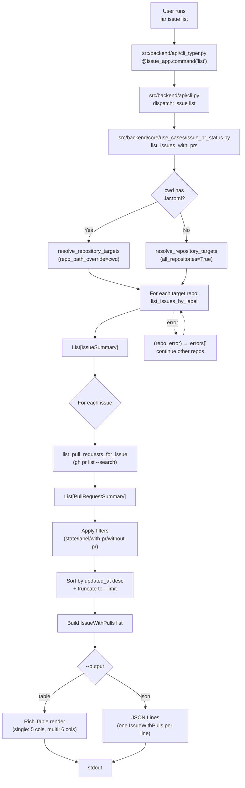

# PRD: `iar issue list` — 带 PR 状态的 Issue 追踪视图

## 1. Introduction & Goals

### Problem Statement

当前 `iar issue` 子命令只支持 `create`，没有任何 list / status 入口。要回答"哪些 issue 已经提交了 PR、哪些还在排队"只能直接调用 `gh issue list` + `gh pr list --search` 再人工 join，跨多仓时尤其痛苦。`agent_runner_monitor` 内部已经跟踪 `has_pr`（`core/use_cases/agent_runner_monitor.py:376,390,394,463,614`），但这是 runner 内部状态，没有用户可见的命令把这条信息暴露出来。

### Proposed Solution Summary

新增 `iar issue list` 子命令，作为面向用户/PR-状态追踪视图。核心机制：

- **复用 `resolve_repository_targets(settings, repo_id=..., repo_path_override=..., all_repositories=...)`**（`engines/agent_runner/factory.py:546`）作为唯一的目标仓解析入口，不新增第二套解析逻辑。
- **在 `IGitHubClient` 上扩展 `list_pull_requests_for_issue(repo, issue_number)`**（用 GitHub `gh pr list --search` 或 GraphQL `closingIssuesReferences`），把已有的"内部 has_pr 跟踪"外化为显式 API。
- **新增 `core/use_cases/issue_pr_status.py`** 作为本命令的 use case，负责 cwd 检测 → 目标仓解析 → 每仓 issue 列表拉取 → 每 issue PR 列表拉取 → 筛选/排序 → 输出模型组装。
- **CLI 入口**：`@issue_app.command("list")` 注入 Typer 子命令（`api/cli_typer.py`），dispatch 到 `cli.py` 的 `issue list` 分支。
- **输出**：默认 Rich 表格，列 `[repo?, #issue, title, labels, state, PRs]`；`--output json` 时输出完整数据对象供脚本使用。

**CWD 自动检测**：当用户既没传 `--repo` 也没传 `--repo-id` 也没传 `--all-registered` 时，检测 `Path.cwd() / ".iar.toml"` 是否存在；存在则把它当 `--repo Path.cwd()`，否则走 `--all-registered`（遍历 config.toml 中所有 enabled 注册仓）。`.iar.toml` 是 `IAR_REPOSITORY_CONFIG_FILENAME`（`infrastructure/config/settings.py:27`），由 `iar init` 和 `iar takeover` 写入，是 iAR 项目仓的稳定标记。

### Measurable Objectives

- `uv run iar issue list` 在 cwd 是 iAR 项目仓时默认只列当前仓；不是时默认跨所有注册仓。
- `--with-pr` / `--without-pr` 切换 PR 状态过滤；`--state open|closed|all` 切换 issue 状态过滤；`--label <name>` 按 label 过滤；`--limit <n>` 限制返回条数（默认 100）。
- `--output table|json` 切换 Rich 表格 / JSON 输出。
- 多仓扫描时表格多一列 `repo`（`owner/name`），JSON 输出每条记录都带 `repo` 字段。
- PR 信息列展示为 `#<num> [<state>]` 列表（state ∈ `open` / `draft` / `merged` / `closed`），多个 PR 用逗号分隔。
- `just test` 全绿，`iar issue --help` / `iar issue create` 行为不变。

### Realistic Validation

除单元测试外，本 PRD 要求通过**真实 CLI 入口**验证关键行为。

- [ ] **CWD 是 iAR 项目仓时单仓模式真实验证**：在临时 git 仓里写 `.iar.toml`，运行 `uv run iar issue list`，验证输出只包含当前仓（用 `gh` API mock 替换为 fixture，但 CLI 入口与参数解析走真实 Typer 路径）。
- [ ] **CWD 不是 iAR 项目仓时全仓扫描真实验证**：在非 git 仓目录运行 `uv run iar issue list --output json`，验证输出含多个 `repo` 字段、且每个 `repo` 都来自 config.toml 的注册仓。
- [ ] **PR 信息展示真实验证**：构造 fixture（issue #1 已合并 PR #42，issue #2 有 draft PR #43，issue #3 无 PR），运行 `uv run iar issue list --output json`，验证每条 issue 的 `pulls` 字段与 fixture 一致，`--with-pr` 过滤后只剩 #1 和 #2。
- [ ] **`--repo` 强制单仓覆盖真实验证**：传 `--repo /path/to/other-iar-repo`，验证即使 cwd 是另一个仓，也只列 `--repo` 指定的那个仓。
- [ ] **JSON 输出结构真实验证**：`--output json` 输出可被 `jq` 直接消费，字段名稳定。

**为什么单元测试不够**：cwd 自动检测、Typer 子命令解析、argparse dispatch、`--output` flag 分支、PR 字段格式都是真实 CLI 入口行为；用 `main([...])` 调 Python 入口能覆盖 CLI 层，但为了证明"用户敲 `uv run iar issue list` 看到的就是对的结果"，必须有真实 shell 入口的 smoke 验证。

### Delivery Dependencies

- Group: none
- Depends on groups:
  - none
- Depends on tasks/issues:
  - none
- Gate type: none
- Notes: 本功能独立交付，不阻塞也不被其他 pending 任务阻塞。与 `agent_runner_monitor` 的内部 `has_pr` 跟踪共享 GitHub API 调用模式，但实现层独立；不依赖任何归档 PRD。

## 2. Requirement Shape

### Actor

维护 iAR 项目的开发者 / 运维人员，希望快速回答"哪些 issue 还没人接手 / 哪些已有 PR 在 review / 哪些 PR 已合并"。

### Trigger

```bash
# 在某个 iAR 项目仓目录
iar issue list

# 在任意目录，自动全仓扫描
iar issue list

# 显式覆盖
iar issue list --repo /path/to/repo
iar issue list --repo-id keda
iar issue list --all-registered

# 过滤 + 格式
iar issue list --with-pr
iar issue list --without-pr
iar issue list --state open
iar issue list --label iar-agent-ready --limit 20
iar issue list --output json
```

### Expected Behavior

1. **目标仓解析**（顺序优先级，从高到低）：
   1. 若传 `--repo <path>` → 锁单仓到该路径
   2. 若传 `--repo-id <id>` → 锁单仓到 config.toml 注册项
   3. 若传 `--all-registered` → 全仓扫描
   4. 否则自动检测：`Path.cwd() / ".iar.toml"` 存在 → 等价 `--repo Path.cwd()`；不存在 → 等价 `--all-registered`
2. **Issue 拉取**：对每个目标仓用 `IGitHubClient.list_issues_by_label(...)` 拉 issues（默认拉所有 state 的 issues，按 `--state` / `--label` 过滤）；按 `--limit` 截断。
3. **PR 拉取**：对每个 issue 调 `IGitHubClient.list_pull_requests_for_issue(repo, issue_number)`，得到关联 PR 列表（state = `open` / `draft` / `merged` / `closed`）。
4. **PR 状态过滤**：
   - `--with-pr` → 只保留 `len(pulls) > 0` 的 issue
   - `--without-pr` → 只保留 `len(pulls) == 0` 的 issue
   - 都不传 → 不过滤
5. **排序**：默认按 `updated_at desc` 排序（issue 最新更新的在最上面）；多仓模式下同一仓内排序，仓之间按 `repo` 字典序。
6. **输出渲染**：
   - `--output table`（默认）：Rich 表格。单仓时列 `[#issue, title, labels, state, PRs]`；多仓时多一列 `repo` 在最左。`title` 超长按列宽截断并加 `…`；`labels` 用 `, ` 拼接。
   - `--output json`：每条 issue 一行 JSON 对象（JSON Lines），字段：`repo?`、`number`、`title`、`state`、`labels`、`updated_at`、`url`、`pulls`（数组，每个元素 `{number, state, url, is_draft, merged}`）。
7. **错误处理**：
   - 单仓模式下仓未初始化（缺 `.iar.toml`）→ 退出码非零，错误信息提示 `Run \`iar init\` first.`。
   - 全仓模式下某个仓的 GitHub 调用失败 → 该仓标 `[error: <reason>]`，继续处理其他仓，最后退出码非零。
   - `--repo` 与 `--repo-id` 同时传 → 退出码非零，错误信息提示互斥。
8. **空结果**：筛选后无 issue → 表格只打印表头和 "No issues match the filters."；JSON 输出空数组。

### Explicit Scope Boundary

- 做**只读**列表查询，不修改 GitHub 任何状态。
- 不实现 issue 创建、PR 创建、review 等写操作；这些仍由 `iar issue create` / 现有命令承担。
- 不实现 issue 内容编辑、comment 查看；只看摘要字段（number / title / state / labels / updated_at / pulls）。
- 不持久化任何状态到本地文件；纯 GitHub API + config.toml 读取。
- 不暴露 runner 内部 `has_pr` 字段之外的额外 issue 元数据。

## 3. Repository Context And Architecture Fit

### Current Relevant Modules/Files

| 文件 | 作用 | 与本次改动关系 |
|---|---|---|
| `src/backend/api/cli_typer.py` | Typer CLI 入口树，`issue_app` 已存在（行 88-92, 114） | **新增** `@issue_app.command("list")`；新增 Rich 表格渲染函数 |
| `src/backend/api/cli.py` | argparse parser + `_run_parsed_command` dispatch | **新增** `issue list` 的 parser 分支和 dispatch 分支（`cli.py:540` 已有 `issue create` 入口可参考） |
| `src/backend/core/shared/interfaces/agent_runner.py` | `IGitHubClient` 抽象接口（行 192+） | **新增** `list_pull_requests_for_issue(repo, issue_number)` 抽象方法 |
| `src/backend/infrastructure/github_client.py` | `IGitHubClient` 的 `gh` CLI 实现（行 399 `list_ready_issues`、行 854 `list_issues_by_label`） | **新增** `list_pull_requests_for_issue` 实现，用 `gh pr list --search` 或 `--json number,state,isDraft,mergedAt,url` |
| `src/backend/core/use_cases/issue_pr_status.py` | （不存在） | **新建**本命令的核心 use case |
| `src/backend/core/shared/models/agent_runner.py` | `IssueSummary` 模型（行 54） | **新增** `PullRequestSummary` dataclass；新增 `IssueWithPulls` 视图模型 |
| `src/backend/engines/agent_runner/factory.py` | `resolve_repository_targets(...)` 多仓解析 helper（行 546+） | **复用**，不修改；`issue list` use case 调用它 |
| `src/backend/infrastructure/config/settings.py` | `IAR_REPOSITORY_CONFIG_FILENAME = ".iar.toml"`（行 27） | **复用**，cwd 检测直接 import 这个常量 |
| `src/backend/core/use_cases/agent_runner_monitor.py` | 已有 `has_pr` 内部跟踪（行 376, 390, 394, 463, 614） | 参考但不耦合：本命令独立调 GitHub API，避免把内部 monitor use case 强加给 CLI 层 |

### Existing Architecture Pattern To Follow

- 四层依赖方向：`api/` → `core/` → `engines/` → `infrastructure/`，严格遵守（`api/` 禁直接 import `infrastructure/`）。
- use case 模式：核心业务逻辑在 `core/use_cases/`；CLI 层只做参数解析和依赖装配（参考 `cli.py:540+` 的 `issue create` 流程）。
- 接口/实现分离：`IGitHubClient` 在 `core/shared/interfaces/agent_runner.py`，实现在 `infrastructure/github_client.py`；新方法遵循同模式。
- 多仓迭代：`agent_runner_monitor.py:891` 的 `for repository_context in repositories: ...` 模式可直接套用。
- Rich 输出：`cli_typer.py` 已用 Rich 渲染 help；新增 `issue list` 表格时复用同一种 Rich Console 注入。

### Ownership And Dependency Boundaries

- `api/cli_typer.py` 拥有 Typer 子命令形态与 Rich 表格渲染。
- `core/use_cases/issue_pr_status.py` 拥有 cwd 检测、目标仓解析、issue+PR 拉取编排、视图模型组装。
- `core/shared/models/agent_runner.py` 拥有数据模型（`IssueWithPulls`、`PullRequestSummary`）。
- `infrastructure/github_client.py` 拥有 GitHub API 适配层。

### Constraints From Runtime, Docs, Tests, Workflows

- `just test` 必须全绿。
- 单文件非空行不超过 1000 行；`just lint` 会警告。
- Python 文本 I/O 必须 `encoding="utf-8"`。
- 公共 API 使用 Google Style Docstrings。
- 新增 `--help` 输出与现有子命令风格一致（用 `_HELP_CONTEXT` 见 `cli_typer.py`）。
- 文档需同步更新 `docs/guides/agent-runner.md` 中关于 `iar issue` 的章节。
- `tests/` 是 pytest；本命令的测试用例命名遵循现有风格（如 `test_issue_list.py`）。

### Matching Or Related PRDs

- `tasks/pending/`：当前无相关 pending PRD，无重复或依赖。
- `tasks/archive/`：未发现与本功能直接相关的归档 PRD；`has_pr` 字段在 `agent_runner_monitor.py` 中作为内部状态使用，未对外暴露。
- 结论：本 PRD 独立交付，不依赖也不被任何 pending PRD 阻塞。

## 4. Recommendation

### Recommended Approach

**在已有 `IGitHubClient` / `resolve_repository_targets` / `IssueSummary` 之上叠加一个 `issue_pr_status` use case + `issue list` Typer 子命令，不引入新的解析层或新的数据通道。**

1. **`IGitHubClient` 扩展**（`core/shared/interfaces/agent_runner.py`）：
   ```python
   def list_pull_requests_for_issue(
       self, repo: str, issue_number: int
   ) -> list[PullRequestSummary]:
       """List PRs that reference / close the given issue."""
   ```
   `repo` 形如 `owner/name`；返回的 PR 已按 `state` + `created_at` 排序。

2. **`infrastructure/github_client.py` 实现**：
   - 优先用 `gh pr list --search "closes:#N OR fixes:#N OR resolves:#N OR refs:#N" --json number,state,isDraft,mergedAt,url,headRefName --limit 100` 拉数据
   - 失败回退：用 GraphQL `closingIssuesReferences` 查询（一次 N 个 issue 的 PR，N=10 批）
   - state 归一化为 `open` / `draft` / `merged` / `closed`：mergedAt 非空 → `merged`；isDraft true → `draft`；state="CLOSED" → `closed`；state="OPEN" → `open`

3. **数据模型**（`core/shared/models/agent_runner.py`）：
   ```python
   @dataclass(frozen=True)
   class PullRequestSummary:
       number: int
       state: str  # open/draft/merged/closed
       url: str
       is_draft: bool
       merged: bool
       title: str  # 用于 --output json 完整输出


   @dataclass(frozen=True)
   class IssueWithPulls:
       repo: str | None  # 单仓模式为 None
       number: int
       title: str
       state: str
       labels: tuple[str, ...]
       updated_at: str  # ISO 8601
       url: str
       pulls: tuple[PullRequestSummary, ...]
   ```

4. **Use case**（新建 `src/backend/core/use_cases/issue_pr_status.py`）：
   ```python
   @dataclass(frozen=True)
   class IssueListRequest:
       repo_id: str | None = None
       repo_path_override: str | None = None
       all_repositories: bool = False
       state_filter: str = "all"  # open/closed/all
       label_filter: str | None = None
       with_pr: bool | None = None  # True/False/None
       limit: int = 100


   @dataclass(frozen=True)
   class IssueListResult:
       rows: tuple[IssueWithPulls, ...]
       errors: tuple[tuple[str, str], ...]  # (repo, error_message)


   def list_issues_with_prs(
       request: IssueListRequest,
       *,
       settings: AgentRunnerSettings,
       cwd: Path,
       github_client_factory: Callable[[Path], IGitHubClient],
   ) -> IssueListResult:
   ```
   - 内部用 `_resolve_targets_with_cwd_autodetect(request, settings, cwd)` 调 `resolve_repository_targets` 加 cwd 检测层
   - 对每个目标仓循环：调 `list_issues_by_label(...)` 拿 issues；对每个 issue 调 `list_pull_requests_for_issue(...)` 拿 PRs
   - 应用 `--with-pr` / `--without-pr` / `--state` / `--label` 过滤；按 `--limit` 截断；按 `updated_at desc` 排序
   - 错误隔离：单个仓失败不影响其他仓，把 `(repo, error)` 累加到 `errors`

5. **CLI 入口**（`api/cli_typer.py`）：
   ```python
   @issue_app.command("list", context_settings=_HELP_CONTEXT)
   def issue_list_command(
       ctx: typer.Context,
       repo: Annotated[str | None, typer.Option("--repo", help="...")] = None,
       repo_id: Annotated[str | None, typer.Option("--repo-id", help="...")] = None,
       all_registered: Annotated[bool, typer.Option("--all-registered", help="...")] = False,
       state: Annotated[str, typer.Option("--state", help="open|closed|all")] = "all",
       label: Annotated[str | None, typer.Option("--label", help="...")] = None,
       with_pr: Annotated[bool, typer.Option("--with-pr", help="Only show issues with PRs")] = False,
       without_pr: Annotated[bool, typer.Option("--without-pr", help="Only show issues without PRs")] = False,
       limit: Annotated[int, typer.Option("--limit", help="Max issues per repo")] = 100,
       output: Annotated[str, typer.Option("--output", help="table|json")] = "table",
   ) -> None:
   ```
   - 渲染表格：单仓列 `[#issue, title, labels, state, PRs]`；多仓列 `[repo, #issue, title, labels, state, PRs]`；用 `rich.table.Table` + `rich.console.Console`
   - 渲染 JSON：每行一个 `IssueWithPulls` 的 JSON 序列化对象，写到 stdout
   - `--with-pr` / `--without-pr` 同时传 → 退出码非零，错误信息提示互斥

6. **CLI dispatch**（`api/cli.py`）：
   - 新增 `issue list` parser 分支（参考行 540 `issue create` 的形态）
   - 在 `_run_parsed_command` 末尾新增 `if parsed.command == "issue list":` 分支：组装 `settings`、`github_client_factory`、`process_runner` → 调 `list_issues_with_prs(...)` → 调 `_render_issue_list(result, output)` 渲染

### Why This Is The Best Fit

- **复用最大化**：目标仓解析用现成的 `resolve_repository_targets`（含 `all_repositories` flag），只在外层加 cwd 自动检测；issue 拉取复用 `list_issues_by_label`；`has_pr` 跟踪的 GitHub API 调用模式在 `agent_runner_monitor.py` 已被验证，本命令独立实现同模式但走自己的 use case，避免把 runner 内部逻辑强加给只读 CLI。
- **架构合规**：use case 在 `core/use_cases/`、接口在 `core/shared/interfaces/`、实现在 `infrastructure/`、CLI 在 `api/`，四层依赖方向完全对齐。
- **零新增配置**：本命令不需要新的 `[issue_list]` 配置段；过滤参数走 CLI flag 即可。如果未来需要持久化默认过滤策略，再补一个配置段（独立 PRD）。
- **风险可控**：纯只读（GitHub GET + 本地 config.toml 读取），无副作用；任何错误都不会污染仓库状态。

### Alternatives Considered

| 方案 | 说明 | 未采纳原因 |
|---|---|---|
| A. 把 `has_pr` 字段从 `agent_runner_monitor` 暴露成 CLI 共享状态 | 让 monitor use case 同时被 CLI 调用 | monitor 是有状态后台任务，与 CLI 只读语义不一致；耦合后会污染 monitor 的单测。独立 use case 更干净 |
| B. 用 GraphQL `closingIssuesReferences` 一次性拉所有 issue 的 PR | 单次 API 调用更省 quota | 复杂度过高（需要 issue 列表 + GraphQL 联表），出错调试难；`gh pr list --search` 单 issue 单调用虽然多但实现简单可单测 |
| C. 加新的 `[issue_list]` 配置段 | 支持持久化默认过滤 | YAGNI；用户目前没有这个诉求，flag 已经够用。等真有人提再加 |
| D. 直接用 GitHub CLI 在 shell 里拼 `gh issue list` + `gh pr list --search` 不抽象 | 最少代码 | 违反 `api/` 禁直接调外部命令的模式（应走 `process_runner` 端口）；单测覆盖难；无法支持 `cwd` 自动检测逻辑 |
| E. 复用 `list_ready_issues`（只拉 `ready_label`） | 减少 API 调用 | `list_ready_issues` 只覆盖 ready 状态的 issue，不能满足用户"看所有 issue+PR"的需求；扩展 `list_issues_by_label` 更合适 |

## 5. Implementation Guide

> This section is a living implementation guide based on current repository analysis. If implementation discovers additional affected files, hidden dependencies, edge cases, or a better path, update this PRD before proceeding.

### Core Logic

数据流：`User → Typer @issue_app.command("list") → argparse dispatch → list_issues_with_prs use case → resolve_repository_targets (含 cwd 检测) → 循环每个仓: list_issues_by_label → 每个 issue: list_pull_requests_for_issue → 过滤/排序/截断 → IssueWithPulls 列表 → _render_issue_list (table|json) → stdout`。

控制流：
1. `api/cli_typer.py:issue_list_command` 只解析参数并打印 Rich 表格/JSON；不持有业务逻辑。
2. `api/cli.py:_run_parsed_command` 收到 `issue list` 分支后，组装 `settings`、`process_runner`、`github_client_factory`，调 `list_issues_with_prs(...)`，把结果传给渲染函数。
3. `core/use_cases/issue_pr_status.py` 持有 cwd 检测 → 目标仓解析 → 多仓迭代 → 错误隔离 → 过滤排序。
4. `infrastructure/github_client.py` 用 `process_runner` 跑 `gh pr list --search ...` 命令，解析 JSON 返回。

### Change Impact Tree

```text
.
├── src/backend/core/shared/interfaces/agent_runner.py
│   [修改]
│   【总结】IGitHubClient 新增 list_pull_requests_for_issue 抽象方法
│   ├── list_pull_requests_for_issue(repo, issue_number) -> list[PullRequestSummary]
│   └── 文档字符串说明 repo 形如 owner/name
│
├── src/backend/core/shared/models/agent_runner.py
│   [修改]
│   【总结】新增 PullRequestSummary 与 IssueWithPulls 数据模型
│   ├── PullRequestSummary dataclass (number, state, url, is_draft, merged, title)
│   └── IssueWithPulls dataclass (repo?, number, title, state, labels, updated_at, url, pulls)
│
├── src/backend/infrastructure/github_client.py
│   [修改]
│   【总结】实现 list_pull_requests_for_issue：调 gh pr list --search 拉关联 PR
│   ├── list_pull_requests_for_issue 实现
│   ├── _normalize_pr_state 归一化 state 字段
│   └── _parse_pr_search_output 解析 gh pr list --json 输出
│
├── src/backend/core/use_cases/issue_pr_status.py
│   [新增]
│   【总结】issue list 核心 use case：cwd 检测 + 多仓迭代 + 过滤排序 + 错误隔离
│   ├── list_issues_with_prs 主函数
│   ├── _resolve_targets_with_cwd_autodetect cwd 检测包装 resolve_repository_targets
│   ├── _apply_filters 过滤逻辑（state/label/with-pr/without-pr）
│   └── _sort_and_truncate 排序与 limit
│
├── src/backend/api/cli_typer.py
│   [修改]
│   【总结】新增 @issue_app.command("list") 及 Rich 表格渲染函数
│   ├── @issue_app.command("list") 参数定义
│   ├── _render_issue_list_table Rich 表格渲染
│   └── _render_issue_list_json JSON Lines 输出
│
├── src/backend/api/cli.py
│   [修改]
│   【总结】新增 issue list parser 与 dispatch 分支
│   ├── issue list 的 argparse 子解析器
│   └── _run_parsed_command 新增 issue list 分支
│
├── tests/test_issue_list.py
│   [新增]
│   【总结】issue list 命令的单元与集成测试
│   ├── test_cwd_autodetect_iar_repo 单仓模式
│   ├── test_cwd_autodetect_non_iar_repo 全仓模式
│   ├── test_with_pr_filter PR 过滤
│   ├── test_state_filter issue state 过滤
│   ├── test_output_json JSON 输出结构
│   ├── test_repo_overrides_cwd --repo 覆盖
│   ├── test_multi_repo_adds_repo_column 多仓表格多一列
│   └── test_partial_failure_isolates_errors 部分仓失败不影响其他仓
│
├── tests/fixtures/issue_pr_status/
│   [新增]
│   【总结】issue+PR 测试 fixture：临时 git 仓 + .iar.toml + mock gh 响应
│   ├── repo_a/.iar.toml
│   ├── repo_b/.iar.toml
│   └── fake_gh_responses/*.json
│
├── docs/guides/agent-runner.md
│   [修改]
│   【总结】新增 `iar issue list` 使用章节
│   └── ## 查看 Issue 列表（含 PR 状态）
│
└── mkdocs.yml
    [修改]
    【总结】确保 agent-runner.md 已在 nav 中
```

### Executor Drift Guard

- 搜索已有 issue 子命令入口：`rg -n "@issue_app|issue_app =" src/backend/api/cli_typer.py` — 必须 EXTEND 现有 `issue_app`，不要新建第二个 Typer app。
- 搜索已有 issue dispatch：`rg -n "\"issue create\"|\"issue list\"" src/backend/api/cli.py src/backend/api/cli_parser.py` — `issue list` 分支必须紧贴 `issue create` 之后。
- 搜索 `IGitHubClient` 已有方法签名：`rg -n "def list_issues_by_label|def list_ready_issues|def list_pull_requests" src/backend/core/shared/interfaces/agent_runner.py src/backend/infrastructure/github_client.py` — 新增方法名必须唯一，避免和已有的 `list_ready_issues`（仅拉 ready 标签 issues）混淆。
- 搜索 `resolve_repository_targets` 用法：`rg -n "resolve_repository_targets" src/backend/` — 复用现有 helper，不要复制其逻辑。
- 搜索 `.iar.toml` 常量定义：`rg -n "IAR_REPOSITORY_CONFIG_FILENAME" src/backend/` — cwd 检测必须用这个常量，不要硬编码 `".iar.toml"`。
- 搜索 Rich 表格现有用法：`rg -n "rich.table.Table|from rich" src/backend/api/cli_typer.py` — 如果已有 Rich Table 实例化模式，渲染函数复用同一种 console 注入。
- 隐藏引用风险：实现时若发现 `cli_typer.py` 已有其他 `@issue_app.command` 装饰器（如 `create`），新 `list` 必须并列，不覆盖。
- 跨仓失败回退：`gh pr list --search` 在 GraphQL 搜索范围外可能返回空，PRD 要求 issue 有 PR 时一定返回非空；如果 mock fixture 验证失败，需排查 `gh` 版本兼容性。

### Flow / Architecture Diagram



### Realistic Validation Plan

| Behavior | Real Entry Point | Test Layer | Mock Boundary | Data/Env Needed | Command Or Procedure | Required For Acceptance |
|---|---|---|---|---|---|---|
| cwd 是 iAR 项目仓 → 单仓 | `uv run iar issue list` | CLI integration | `IGitHubClient` 注入 fake（用 `FakeGitHubClient` 替换 `gh` subprocess 调用） | temp git repo with `.iar.toml` + 3 fixture issues | `uv run pytest tests/test_issue_list.py -k "cwd_autodetect_iar_repo" -q` | Yes |
| cwd 不是 iAR 项目仓 → 全仓 | `uv run iar issue list` from `/tmp` | CLI integration | `FakeGitHubClient` 多仓响应 | config.toml 注册 2 个仓 | `uv run pytest tests/test_issue_list.py -k "cwd_autodetect_non_iar_repo" -q` | Yes |
| `--with-pr` 过滤 | `uv run iar issue list --with-pr --output json` | CLI integration | `FakeGitHubClient`（issue 1 有 merged PR #42，issue 3 无 PR） | temp git repo | `uv run pytest tests/test_issue_list.py -k "with_pr_filter" -q` | Yes |
| `--state open` 过滤 | `uv run iar issue list --state open` | CLI integration | `FakeGitHubClient` | temp git repo | `uv run pytest tests/test_issue_list.py -k "state_filter" -q` | Yes |
| `--repo` 覆盖 cwd | `uv run iar issue list --repo /other/path` | CLI integration | `FakeGitHubClient` | 两个 iAR 仓 | `uv run pytest tests/test_issue_list.py -k "repo_overrides_cwd" -q` | Yes |
| 全仓表格多一列 | `uv run iar issue list --output table` | CLI integration | `FakeGitHubClient` 多仓 | config.toml 注册 2 个仓 | `uv run pytest tests/test_issue_list.py -k "multi_repo_repo_column" -q` | Yes |
| 部分仓失败隔离 | `uv run iar issue list` 其中一仓 API 失败 | CLI integration | `FakeGitHubClient` 一仓 raise | config.toml 注册 2 个仓 | `uv run pytest tests/test_issue_list.py -k "partial_failure_isolates" -q` | Yes |
| JSON Lines 可被 jq 消费 | `uv run iar issue list --output json \| jq` | CLI integration | `FakeGitHubClient` | temp git repo | `uv run pytest tests/test_issue_list.py -k "json_output_jq_compatible" -q` | Yes |
| 真实 shell smoke | `uv run iar issue list --help` | CLI smoke | 真实 `iar` 入口 | 无（只要 `--help` 不崩） | `uv run iar issue list --help` | Yes |
| `just test` 全绿 | repo 根目录 | all tests | n/a | 无 | `just test` | Yes |

### Low-Fidelity Prototype

```text
$ cd ~/code/some-iar-repo
$ iar issue list
  #     TITLE                              LABELS              STATE   PRS
  42    Add issue list command              iar-agent-ready     open    #143 [draft]
  41    Fix label sync                      iar-bug, urgent     open    #140 [merged]
  40    Update docs                          iar-docs            closed  —

$ cd /tmp
$ iar issue list
  REPO              #     TITLE                              STATE   PRS
  owner/repo-a      12    Refactor init                       open    #55 [open]
  owner/repo-a      11    Add tests                            open    —
  owner/repo-b      7     Fix crash                            open    #22 [merged]

$ iar issue list --with-pr --output json
{"repo": "owner/repo-a", "number": 12, "title": "Refactor init", "state": "open", "labels": [], "updated_at": "2026-06-20T...", "url": "https://...", "pulls": [{"number": 55, "state": "open", "url": "https://...", "is_draft": false, "merged": false, "title": "..."}]}
{"repo": "owner/repo-b", "number": 7, "title": "Fix crash", "state": "open", "labels": [], "updated_at": "2026-06-19T...", "url": "https://...", "pulls": [{"number": 22, "state": "merged", "url": "https://...", "is_draft": false, "merged": true, "title": "..."}]}
```

### ER Diagram

No data model changes in this PRD (新增 dataclass 是 transient view model，不持久化).

### Interactive Prototype Change Log

No interactive prototype file changes in this PRD.

### External Validation

No external validation required; repository evidence was sufficient. GitHub CLI `gh pr list --search` 行为与 GraphQL `closingIssuesReferences` 是稳定公开 API，不需重新调研。

## 6. Definition Of Done

- [ ] `iar issue list` 在 cwd 是 iAR 项目仓时输出当前仓；不是时输出所有 enabled 注册仓。
- [ ] `--repo` / `--repo-id` / `--all-registered` 任一 flag 可显式覆盖自动检测。
- [ ] `--with-pr` / `--without-pr` / `--state` / `--label` / `--limit` 过滤按预期工作。
- [ ] `--output table` 输出 Rich 表格，多仓时多一列 `repo`；`--output json` 输出 JSON Lines。
- [ ] PR 列展示为 `#<num> [<state>]` 列表，state ∈ open/draft/merged/closed。
- [ ] 单仓调用失败时退出码非零且给出明确错误；全仓模式下单个仓失败不影响其他仓。
- [ ] `iar issue create` / `iar issue --help` 行为不变，无回归。
- [ ] `just test` 全绿；`just lint` 无新增警告。
- [ ] `docs/guides/agent-runner.md` 新增 `## iar issue list` 章节，覆盖用法、flag、输出示例。

## 7. Acceptance Checklist

### Architecture Acceptance

- [ ] 业务逻辑位于 `src/backend/core/use_cases/issue_pr_status.py`，不泄漏到 `api/` 或 `engines/`。
- [ ] `IGitHubClient.list_pull_requests_for_issue` 是抽象方法，`infrastructure/github_client.py` 是唯一定义实现的位置。
- [ ] CLI 层（`api/cli_typer.py`）只做参数解析和 Rich 渲染，不直接调 `process_runner` 或 `gh`。
- [ ] 多仓解析复用 `resolve_repository_targets(...)`，cwd 自动检测只在该 use case 内部做包装，不复制其逻辑。
- [ ] 新增 dataclass 在 `core/shared/models/agent_runner.py`，不在 `api/` 或 `infrastructure/`。

### Dependency Acceptance

- [ ] 不新增第三方依赖。
- [ ] 不修改 `config.toml` / `.iar.toml` schema（本命令无需新配置段）。
- [ ] `requirements` / `pyproject.toml` 不变。

### Behavior Acceptance

- [ ] 在 iAR 项目仓目录运行 `uv run iar issue list` 仅列当前仓。
- [ ] 在非 iAR 项目仓目录（如 `/tmp`）运行 `uv run iar issue list` 跨所有 enabled 注册仓。
- [ ] `--repo /path/to/other-iar-repo` 覆盖 cwd 自动检测。
- [ ] `--repo-id keda` 覆盖 cwd 自动检测。
- [ ] `--all-registered` 在 cwd 是 iAR 项目仓时强制全仓扫描。
- [ ] `--repo` 与 `--repo-id` 同时传 → 退出码非零并提示互斥。
- [ ] `--with-pr` 与 `--without-pr` 同时传 → 退出码非零并提示互斥。
- [ ] PR 列格式严格为 `#<num> [<state>]`，多个 PR 用 `, ` 分隔；state ∈ open/draft/merged/closed。
- [ ] `--limit 20` 截断到 20 条 issue（每仓独立）。
- [ ] 空结果时表格只打印表头 + "No issues match the filters."，JSON 输出 `[]`。
- [ ] 单仓调用失败（gh 不可用、网络错误）时退出码非零且错误信息包含 repo 路径和错误原因。
- [ ] 全仓模式下某仓 API 失败不影响其他仓，最终退出码非零，stderr 含该仓错误。

### Documentation Acceptance

- [ ] `docs/guides/agent-runner.md` 新增 `## iar issue list` 章节，含 flag 表、cwd 自动检测说明、输出示例（table + json）。
- [ ] `mkdocs.yml` 中 `agent-runner.md` 已在 nav 中（无需新增条目，只确认存在）。

### Validation Acceptance

- [ ] `uv run pytest tests/test_issue_list.py -q` 全绿。
- [ ] `uv run pytest tests/test_github_client.py -q`（覆盖新增 `list_pull_requests_for_issue`）全绿。
- [ ] `just test` 全绿。
- [ ] `uv run iar issue list --help` 在真实 shell 中输出与设计一致（smoke）。
- [ ] 用 `rg -n "list_pull_requests_for_issue" src/backend/` 验证方法在 interface 和 implementation 中都存在且仅定义一次（实现侧）。
- [ ] 用 `rg -n "resolve_repository_targets" src/backend/core/use_cases/issue_pr_status.py` 验证 cwd 检测包装了 `resolve_repository_targets`，没有复制其逻辑。

## 8. Functional Requirements

- **FR-1**：`iar issue list` 在 cwd 是 iAR 项目仓时默认单仓；不是时默认全仓扫描。
- **FR-2**：`--repo <path>` / `--repo-id <id>` / `--all-registered` 任一 flag 覆盖 cwd 自动检测。
- **FR-3**：自动检测的判定依据是 `Path.cwd() / ".iar.toml"`（即 `IAR_REPOSITORY_CONFIG_FILENAME` 常量）是否存在。
- **FR-4**：每个 issue 关联 PR 列表通过 `IGitHubClient.list_pull_requests_for_issue(repo, issue_number)` 拉取，state 归一化为 `open` / `draft` / `merged` / `closed`。
- **FR-5**：`--with-pr` 仅显示 `len(pulls) > 0` 的 issue；`--without-pr` 仅显示 `len(pulls) == 0` 的 issue。
- **FR-6**：`--state open|closed|all` 过滤 issue 的 GitHub state；默认 `all`。
- **FR-7**：`--label <name>` 仅显示带该 label 的 issue；不传则不过滤。
- **FR-8**：`--limit <n>` 限制每仓返回 issue 数，默认 100。
- **FR-9**：默认按 `updated_at desc` 排序；多仓时同仓内排序，仓间按 repo 名字典序。
- **FR-10**：`--output table` 输出 Rich 表格（单仓 5 列：#issue/title/labels/state/PRs；多仓 6 列加 repo）；`--output json` 输出 JSON Lines，每行一个 `IssueWithPulls`。
- **FR-11**：PR 列展示为 `#<num> [<state>]` 列表，多个 PR 用 `, ` 分隔；无 PR 显示 `—`。
- **FR-12**：JSON 输出字段固定为 `repo?` / `number` / `title` / `state` / `labels` / `updated_at` / `url` / `pulls`（每个 pull 含 `number` / `state` / `url` / `is_draft` / `merged` / `title`）。
- **FR-13**：空结果时表格只打印表头 + "No issues match the filters."，JSON 输出 `[]`。
- **FR-14**：单仓模式下任何错误退出码非零；全仓模式下单个仓错误隔离，stderr 报告失败仓，其他仓继续处理，最终退出码非零。
- **FR-15**：`--repo` 与 `--repo-id` 互斥；`--with-pr` 与 `--without-pr` 互斥；同时传时退出码非零并打印冲突提示。

## 9. Non-Goals

- 不修改 GitHub 任何状态（issue / PR / label / comment）。
- 不持久化任何状态到本地文件或数据库。
- 不实现 issue 创建、PR 创建、review、label 同步等写操作。
- 不暴露 runner 内部 `has_pr` 字段之外的额外 issue 元数据（如 timeline / reactions / assignees 详情）。
- 不实现 issue/PR 内容编辑或评论查看。
- 不实现交互式选择（让用户在表格里挑一个 issue 跳到浏览器）——纯列表输出。
- 不实现 TUI / curses 风格的滚动查看；Rich 静态表格足矣。
- 不引入新的配置段（`[issue_list]`）——flag 已覆盖当前需求。

## 10. Risks And Follow-Ups

| 风险 | 影响 | 缓解 |
|---|---|---|
| `gh pr list --search "closes:#N"` 不一定能完整覆盖所有引用 PR（如分支名提及） | 中 | 部分边缘 PR 漏抓时 PR 列表可能为空，issue 误判为"无 PR"；建议未来用 GraphQL `closingIssuesReferences` 作为单一来源。本 PRD 接受：大多数情况 `gh pr list --search` 够用 |
| 全仓扫描 API 调用量 = `sum(issues per repo) × (1 + issues per repo)`，仓多 issue 多时慢 | 中 | `--limit <n>` 限制每仓 issue 数；未来加并发（`asyncio.gather`）优化 |
| `--with-pr` 过滤对每个 issue 都调一次 `list_pull_requests_for_issue`，单仓 100 issues 就是 100 次 API 调用 | 中 | 短中期可接受；未来用 GraphQL 批量查询替换 |
| CWD 检测假设 `.iar.toml` 一定是初始化标记；如果用户手动放一个空 `.iar.toml` 会误判 | 低 | 与 `iar init` / `iar takeover` 的 `.iar.toml` 写入行为保持一致（共享 `IAR_REPOSITORY_CONFIG_FILENAME` 常量）；手动放置空文件极少出现 |
| 多仓模式下表格列宽自适应可能让 title 被截断到不可读 | 低 | Rich `Table` 默认按列内容长度自适应；超长 title 按列宽截断并加 `…` |

## 11. Decision Log

| ID | Decision | Chosen | Rejected | Rationale |
|---|---|---|---|---|
| D-01 | 子命令命名 | `iar issue list` | `iar issue status` / `iar pr-tracker` | 与 `gh issue list` 命名对齐；`list` 是 GitHub CLI 习惯用语；`status` 在 `gh issue status` 里专指当前用户上下文 |
| D-02 | 目标仓解析 | 复用 `resolve_repository_targets(...)` + cwd 自动检测包装层 | 新写一套解析逻辑 | `factory.py:546` 已有现成的多仓解析 helper（含 `all_repositories` flag 与冲突校验），覆盖了 `--repo` / `--repo-id` / `--all` 三种互斥语义；新写会引入重复实现 |
| D-03 | cwd 自动检测依据 | `Path.cwd() / IAR_REPOSITORY_CONFIG_FILENAME` 存在性 | 读 git remote URL 与注册表 join / 要求显式 flag | `.iar.toml` 是 `IAR_REPOSITORY_CONFIG_FILENAME` 常量，由 `iar init` 与 `iar takeover` 共同写入，是 iAR 项目仓的稳定标记；git remote 需要额外 `git` 调用且 git remote 缺失时退化 |
| D-04 | PR 拉取实现 | `gh pr list --search` JSON 输出 | GraphQL `closingIssuesReferences` 单次查询 | `gh pr list --search` 实现简单、单 issue 单调用易于 mock；GraphQL 复杂度高且需要联表 issue 列表，调试成本大 |
| D-05 | PR state 归一化 | `mergedAt` 非空 → `merged`；`isDraft` true → `draft`；`state=CLOSED` → `closed`；否则 `open` | 直接用 `gh` 的原始 state 字符串 | `gh` state 集合是 `{OPEN, CLOSED, MERGED}` 但 draft 是独立 flag，需要合并归一化；用户视角 state 应该是 `open/draft/merged/closed` 四象限 |
| D-06 | 数据模型 | 新增 `PullRequestSummary` + `IssueWithPulls` dataclass | 复用现有 `IssueSummary` + 扩展字段 | `IssueSummary` 是 runner 内部模型，扩展会污染其语义；新 view model 隔离 CLI 与 runner 关注点 |
| D-07 | 输出格式 | 默认 Rich 表格 + `--output json` JSON Lines | 默认 JSON / 强制表格 | 用户视角首要回答是"哪些 issue 有 PR"，表格可读性 > JSON；JSON 通过 `--output json` 暴露给脚本，遵循 GitHub CLI 风格 |
| D-08 | 多仓输出形态 | 同一张表多一列 `repo` | 按 repo 分组 / 加 `--flat` flag | 跨仓对比的核心诉求是"看全哪些仓的 issue 还没人接"，单表一行一仓更直接；分组会破坏跨仓排序 |
| D-09 | 错误处理 | 全仓模式隔离失败仓（stderr 报告），最终退出码非零 | 任一仓失败立即中断 | 部分仓 API 失败不应阻塞其他仓的查询；用户能看到所有成功仓的结果后再处理失败仓 |
| D-10 | 是否引入新配置段 | 不引入（本命令无配置需求） | 新增 `[issue_list]` 配置段 | YAGNI：flag 已覆盖过滤需求；未来真有人提"我每次都想 `--with-pr --state open`"再加配置段 |
| D-11 | 单 issue 单 API 调用的性能取舍 | 接受 100 issues × 100 calls 上限 | 立即优化为 GraphQL 批量 | 本命令定位是"用户手动跑的查看工具"，不是后台 runner；性能够用即可；过早优化会拖慢交付 |
| D-12 | 与 `agent_runner_monitor` 的关系 | 独立 use case，不复用 monitor 的 `has_pr` 跟踪 | 让 monitor 暴露 `has_pr` 给 CLI 复用 | monitor 是有状态后台任务（持续轮询 issue 状态），CLI 是无状态单次查询；语义不匹配；独立实现可独立单测 |
