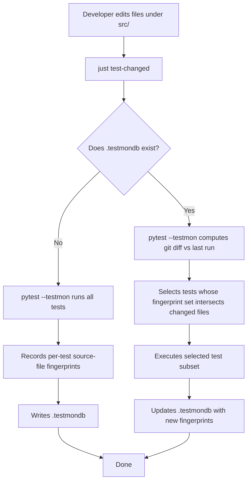

# P2-FEAT-20260622-221605 — pytest-testmon Change-Aware Test Selection

## 1. Introduction & Goals

### Problem Statement

`just test` is the only developer-facing test entry point in keda today. It inherits a tree-hash skip from `justfile.shared` (`scripts/shared/hooks/quality_flag.sh`) — either the entire working tree is unchanged (skip everything) or the entire suite runs. There is no per-test selection: editing a single backend module re-runs all 65 test files (~15–25s of collection plus execution), even when only one module was touched.

This is wasteful for the inner loop where developers typically modify one or two files at a time. The team needs a finer-grained opt-in path that re-runs only the tests whose execution path actually touches a modified source file, while leaving the existing `just test` (local/all/real) semantics and the shared tree-hash skip untouched.

### Proposed Solution Summary

- Add `pytest-testmon` as a dev dependency in `pyproject.toml`. It records each test's dependency fingerprint (which source files it imports/executes) into a `.testmondb` SQLite file on every run.
- Add a new project-local recipe `test-changed` in `justfile` that invokes `uv run pytest tests/ -v --testmon`. Recipe name uses kebab-case (`just test-changed`) rather than `just test changed` because the existing `just test` is a parameterized `@test type="local"` recipe owned by `justfile.shared` (synced from the upstream template). Introducing a new parameter value would either modify upstream-synced code or duplicate ~50 lines of shared recipe logic into keda.
- Do **not** add `--testmon` to `[tool.pytest.ini_options].addopts`. That would silently change `just test` semantics. Testmon is opt-in via the new recipe only.
- Add `.testmondb` to `.gitignore`. Rebuild from scratch on demand by deleting the file (a one-line gitignore entry, no risk).
- Update `docs/ai-standards/testing.md` and `README.md` to document the new entry point and its trade-offs.

The mechanism is supplied by the developer (they run the new recipe); the system infers the test set from `.testmondb` plus the working/staged git diff (testmon does this internally). The existing entry point that this plugs into is the keda `justfile` recipe surface, not the test framework.

Complexity intentionally avoided: no new script, no source-to-test static reverse-mapping, no CI config, no parallel test runner rewrite, no changes to `tests/conftest.py`, no override of the shared `just test` recipe.

### Measurable Objectives

- `just test-changed` exists, is documented, and runs in the project root.
- First run on a clean checkout (no `.testmondb`) executes the full test suite and produces `.testmondb`.
- Subsequent runs after editing exactly one file under `src/backend/` execute a strict subset of tests whose `-v` output lists fewer than the full 65 test files; selection is reproducible (same edit → same selected tests).
- `just test` (local / all / real) continues to invoke `uv run pytest tests/ -v` (no `--testmon`, no behavioral change). The shared tree-hash skip mechanism in `quality_flag.sh` continues to govern `just test` only.
- `.testmondb` is excluded from version control via `.gitignore`.
- `docs/ai-standards/testing.md` and `README.md` describe the new recipe and the `just test` vs `just test-changed` split.

### Realistic Validation

- [ ] **Cold-start full-run validation**: From a clean checkout (no `.testmondb`), `just test-changed` runs the entire suite and exits 0; `.testmondb` exists afterward.
- [ ] **Hot-run subset validation**: After editing one file under `src/backend/` and saving, `just test-changed` runs strictly fewer test files than the cold start (verified by counting the number of `tests/test_*.py` lines in `-v` output) and exits 0.
- [ ] **`just test` regression validation**: `just test` continues to run the full suite with no `--testmon` flag in the pytest command line (verified by adding `--co -q` introspection or by checking shared recipe remains untouched).
- [ ] **`.testmondb` git-ignored validation**: `git check-ignore .testmondb` exits 0 from the repo root.

**Why unit tests are insufficient**: The behavior under test is end-to-end pytest invocation, including testmon's import-tracing, db persistence, and selection algorithm. None of these can be exercised by isolated unit tests inside `tests/` without simulating pytest itself. Real entry-point runs are required.

### Delivery Dependencies

- Group: none
- Depends on groups:
  - none
- Depends on tasks/issues:
  - none
- Gate type: none
- Notes: This PRD is independent of all current pending PRDs. It touches only dev tooling (justfile recipe, dev dependency, .gitignore, two docs files) and the test framework invocation surface — none of which are claimed by other pending PRDs (verified via `rg -n "testmon|picked|change-aware" tasks/`).

## 2. Requirement Shape

- **Actor:** Keda developer (human or AI agent) running local tests during iterative development.
- **Trigger:** Developer edits one or more files under `src/` (or anywhere else in the repo) and wants fast feedback without waiting for the full 65-test suite.
- **Expected behavior:** Running `just test-changed` from the repo root executes `pytest --testmon`, which selects and runs only the tests whose dependency fingerprint intersects with the current working-tree and staged-area git diff against the last testmon run. If `.testmondb` is missing, the first run executes all tests to populate it; subsequent runs are incremental.
- **Explicit scope boundary:** Only affects `pytest tests/` invocation via the new `test-changed` recipe. Does not change `just test`, `just test all`, `just test real`, `just e2e`, the Playwright package, the CI pipeline, or any test code under `tests/`.

## 3. Repository Context And Architecture Fit

### Current Relevant Modules/Files

- `pyproject.toml` — Python project metadata + dev dependency group (`[dependency-groups].dev`). Currently has `pytest>=8.3.0` but no testmon.
- `justfile` — Project-local recipes. Currently imports `justfile.shared` and defines only `reinstall-iar` and `run`. New recipe `test-changed` will be added here.
- `justfile.shared:908` — Defines `@test type="local"` recipe (inherited as `just test`). Handles tree-hash skip via `quality_flag.sh`. **Not modified by this PRD.**
- `tests/conftest.py` — Currently only sets up `sys.path` and defines three `Fake*` classes for tests to import. No fixtures, no hooks that would interfere with testmon's import tracking.
- `tests/` — 65 test files. No test uses `pytest.skip` or `pytest.mark.slow` markers today; selection will be entirely based on import-graph fingerprinting.
- `.gitignore` — Currently covers Python, Node, build artifacts, env files, `.iar`, `.agent-runner/`. No `.testmondb` entry.
- `docs/ai-standards/testing.md` — Lists `just test`, `just test all`, `uv run pytest ...` as the canonical test entry points. Needs the new recipe added.
- `README.md` (lines 277–294) — Documents `uv run pytest tests/ -v` and Playwright. Needs the new recipe noted alongside the existing `just test` references.

### Existing Architecture Pattern To Follow

- The keda project follows a four-layer backend dependency rule (`api → core → engines → infrastructure`) enforced by `hooks/check_architecture.py`. This PRD does not add backend code, so the rule is unaffected.
- Recipes in `justfile` (project-local) override recipes with the same name in `justfile.shared`. To avoid duplicating shared logic, this PRD adds a **new** recipe rather than overriding `test`.

### Ownership And Dependency Boundaries

- `justfile` is project-local and freely editable.
- `justfile.shared` is synced from upstream template — must NOT be modified by keda.
- `pyproject.toml` `[dependency-groups].dev` is the canonical place for test-time dev dependencies in this repo.
- `.gitignore` is project-local.
- `tests/conftest.py` is project-local; left untouched to minimize blast radius.

### Constraints From Runtime, Docs, Tests, Or Workflows

- `uv` is the canonical Python package manager; all new dev deps must be added with `uv add --dev` to keep `uv.lock` in sync. Adding via raw `pyproject.toml` edit requires running `uv lock` afterward.
- Pre-commit runs `hooks/check_max_file_lines.py` with a 1000-line soft limit. No file in this PRD's change list is near that limit.
- Pre-commit excludes `^docs/|/migrations/` — so changes to `docs/` will not trigger pre-commit lint hooks, but the new recipe's documentation still needs `mkdocs build --strict` validation (per `docs/ai-standards/testing.md`).

### Matching Or Related PRDs

- **Searched:** `tasks/pending/` and `tasks/archive/` via `rg -n "testmon|picked|change-aware|incremental test|test selection" tasks/`.
- **Result:** No pending or archived PRD addresses test selection, testmon, pytest-picked, or change-aware testing. Closest adjacent work is the shared `quality_flag.sh` tree-hash skip mechanism (which lives in `scripts/shared/hooks/quality_flag.sh` and is owned by the upstream template), but that is a coarse-grained all-or-nothing skip, not per-test selection.
- **Relationship:** Independent. This PRD does not duplicate, depend on, or block any pending PRD.

## 4. Recommendation

### Recommended Approach

Add `pytest-testmon>=2.1.0` to the `[dependency-groups].dev` list in `pyproject.toml`. Add a project-local `test-changed` recipe to `justfile` that runs `uv run pytest tests/ -v --testmon`. Add `.testmondb` to `.gitignore`. Update `docs/ai-standards/testing.md` and `README.md` to document the new recipe. No other files are modified.

**Why this is the best fit for the current architecture:**

1. **Minimal change.** Three file edits (pyproject, justfile, .gitignore) plus two doc edits. No backend code touched, no shared template touched, no test code touched, no conftest touched.
2. **No shared-recipe override.** Keeps `just test` semantics owned by `justfile.shared` (synced from upstream), avoiding merge friction with template updates.
3. **Opt-in, not default.** Adding `--testmon` to global `addopts` would silently change `just test` (CI runs would build `.testmondb`, future `just test` runs would do change selection, breaking the shared tree-hash skip invariant that says "same tree-hash → skip everything"). Opt-in via a separate recipe preserves the shared contract.
4. **Dynamic analysis over static reverse-mapping.** Testmon traces actual imports during test execution; keda's `test_*` files are not 1:1-named with their target modules (e.g. `test_agent_runner_workflow.py` exercises ~10 backend modules), so a static `test_<feature>.py` ↔ `<feature>/*.py` reverse mapping would miss most test dependencies. Testmon's runtime tracing captures them naturally.
5. **Self-healing on file move.** When source files move or get refactored, testmon auto-detects the change on the next run and re-runs the affected tests; no manual mapping maintenance needed.
6. **Idempotent cache.** The `.testmondb` file is incremental and rebuildable. `rm .testmondb` is the documented escape hatch if it becomes stale.

### Alternatives Considered

- **`pytest-picked`** — Rejected. Uses `git diff --name-only` heuristics with no import-graph awareness. Keda test files are wide (one test exercises many modules), so picking tests by filename only would routinely miss tests that exercise changed modules. Maintenance burden is low but accuracy is poor.
- **Custom `--collect-only` + import-graph script** — Rejected as heavier alternative. Would require maintaining a Python script that parses pytest's collection output, builds an import graph, and intersects with `git diff`. Higher complexity, no real accuracy advantage over testmon's runtime tracing, more failure modes (collection must succeed, fixtures may not be exercised during collection, etc.). Worth considering only if testmon itself became unmaintained.
- **Override shared `@test` to add a `changed` type** — Rejected. Would require either editing `justfile.shared` (breaks upstream sync) or duplicating ~50 lines of shared recipe logic into keda `justfile`. Both options violate the minimal-change principle. The kebab-case `test-changed` recipe achieves the same UX with zero shared-recipe churn.

## 5. Implementation Guide

This section is a living implementation guide based on current repository analysis. If implementation discovers additional affected files, hidden dependencies, edge cases, or a better path, update this PRD before proceeding.

### Core Logic

1. **Dependency install.** `uv add --dev pytest-testmon` adds the package to `pyproject.toml` `[dependency-groups].dev` and updates `uv.lock`. The install is reproducible on any developer machine via `uv sync`.
2. **Cold-start behavior.** On the first run (no `.testmondb`), `pytest --testmon` runs the full suite once, recording per-test source-file fingerprints into `.testmondb`. Subsequent runs only re-execute tests whose fingerprint set intersects with files changed since the last run.
3. **Change detection.** Testmon computes the changed-file set from `git diff` (working tree + staged) against the last-recorded state in `.testmondb`. It then selects tests whose dependency fingerprint intersects that set.
4. **Recipe invocation.** `just test-changed` invokes `uv run pytest tests/ -v --testmon` from the repo root. No environment variables, no flags beyond `-v` and `--testmon`.
5. **`.testmondb` lifecycle.** Lives at `<repo-root>/.testmondb`. Persists across runs; auto-updated after each run. Excluded from git via `.gitignore`. Rebuildable via `rm .testmondb` (safe one-liner; cold start next run).
6. **No interaction with `just test`.** The shared `@test type="local"` recipe at `justfile.shared` continues to run `uv run pytest tests/ -v` (no `--testmon`) and continues to honor the tree-hash skip in `quality_flag.sh`. The new recipe is fully independent.

### Change Impact Tree

```
.
├── pyproject.toml
│   [修改] 【总结】在 dev dependency group 里追加 pytest-testmon>=2.1.0，与现有 pytest>=8.3.0 同段。
│
│   └── [dependency-groups].dev 段新增一行：
│       "pytest-testmon>=2.1.0",
│
├── justfile
│   [新增] 【总结】新增项目级 recipe test-changed，调用 uv run pytest tests/ -v --testmon；不覆盖共享 @test，不动现有 reinstall-iar/run。
│
│   └── 新增 recipe 段：
│       # Run only tests touching modified source files (uses pytest-testmon).
│       # First run populates .testmondb; later runs are incremental.
│       # Usage: just test-changed
│       test-changed:
│           uv run pytest tests/ -v --testmon
│
├── .gitignore
│   [修改] 【总结】追加一行 .testmondb 排除 testmon 的 SQLite 缓存文件。
│
│   └── 新增一行：
│       .testmondb
│
├── docs/ai-standards/testing.md
│   [修改] 【总结】在 Python Test Workflow 段落补一行 just test-changed，并说明 .testmondb 缓存语义。
│
│   └── 在 `just test` / `just test all` 列表后追加：
│       - `just test-changed`
│
├── README.md
│   [修改] 【总结】在「测试」小节补一行 just test-changed 的简短描述，与现有 just test 引用并列。
│
│   └── 在 line 280-294 区间新增 1-2 行说明。
│
└── uv.lock
    [修改 - 副作用] 【总结】uv add --dev pytest-testmon 自动更新，无需手改；如果手改 pyproject.toml 必须跑 uv lock。
```

**Starting-point note:** This list reflects files explicitly identified during repository analysis. The Executor Drift Guard below covers the possibility that other files (e.g. additional docs referencing `just test`, `.pre-commit-config.yaml` if testmon needs special handling) surface during implementation.

### Executor Drift Guard

Repository-wide references that may need follow-up checks after this change lands:

- `rg -n "just test" docs/` — confirm no doc still implies `just test` is the only Python test entry point. Update any other doc that lists test commands.
- `rg -n "uv run pytest" .` — confirm no Makefile, script, or CI config invokes bare `pytest` and would surprise users by not picking up `.testmondb`. (Bare pytest invocations are unaffected — `--testmon` is opt-in.)
- `rg -n "testmon" .` — confirm no other file claims testmon ownership; there should be exactly one definition (the dev dep) after this change.
- `.pre-commit-config.yaml` — does NOT need changes (no pre-commit hook exercises pytest).
- `justfile.shared` — MUST NOT be modified. Any deviation from this is a regression of the upstream-sync contract.
- `hooks/` — none of the architecture/lint hooks depend on testmon; no changes expected.

If implementation finds that keda has any file listing test commands outside of `docs/ai-standards/testing.md` and `README.md`, update that file as part of this PRD before completion.

### Flow Diagram



### Realistic Validation Plan

| Behavior | Real Entry Point | Test Layer | Mock Boundary | Data/Env Needed | Command Or Procedure | Required For Acceptance |
|---|---|---|---|---|---|---|
| Cold-start full run + `.testmondb` created | `just test-changed` from repo root | end-to-end (real pytest + real testmon + real SQLite) | none — all real | clean checkout (no `.testmondb`), Python 3.11+, `uv` installed | `rm -f .testmondb && just test-changed` then `test -f .testmondb && echo OK` | Yes |
| Hot-run subset selection | `just test-changed` after editing one backend file | end-to-end | none | any source file under `src/backend/` edited and saved | `touch src/backend/core/shared/models/agent_runner.py && just test-changed 2>&1 \| tee /tmp/run.log` then count `tests/test_*.py` paths in `/tmp/run.log`; must be < 65 and > 0 | Yes |
| `just test` unchanged (no `--testmon`) | `just test` from repo root | end-to-end | none | clean checkout | `just test 2>&1 \| head -50` — verify command line in shell trace does not include `--testmon` | Yes |
| `.testmondb` is git-ignored | `git check-ignore` | smoke | none | repo at git HEAD | `git check-ignore .testmondb && echo OK` | Yes |
| Docs build still passes | `mkdocs build --strict` | docs validation | none | existing mkdocs config | `uv run mkdocs build --strict` | Yes |

**Triage notes:**

- If the hot-run subset is unexpectedly empty (0 tests selected), inspect `.testmondb` content with `sqlite3 .testmondb ".tables"` and verify the edited file's path matches the recorded fingerprints. Empty selection typically means the `.testmondb` is stale relative to the working tree; `rm .testmondb && just test-changed` recovers.
- If `just test-changed` fails with `pytest: error: unrecognized arguments: --testmon`, the dev dep was added to `pyproject.toml` but `uv sync` was not run; run `uv sync` and retry.
- If `git check-ignore .testmondb` exits 1, verify the new line is exactly `.testmondb` (no leading whitespace, no comment on the same line) in `.gitignore`.

### Low-Fidelity Prototype

Not required. The change is purely CLI plumbing; no UI surface, no multi-step user interaction, no layout decision. The flow diagram above is sufficient.

### ER Diagram

No data model changes in this PRD. `.testmondb` is an opaque SQLite cache owned by `pytest-testmon`; its schema is the library's internal concern, not keda's.

### Interactive Prototype Change Log

No interactive prototype file changes in this PRD.

### External Validation

No external validation required; repository evidence was sufficient. `pytest-testmon` is a stable, widely used package whose `--testmon` CLI flag has been stable for years; no vendor-API research, security guidance, or ecosystem-best-practice lookup is needed for this change.

## 6. Definition Of Done

- `uv add --dev pytest-testmon` has been run (or `pyproject.toml` + `uv.lock` updated equivalently); `uv sync` succeeds on a clean checkout.
- `just test-changed` recipe exists in `justfile` and is callable from the repo root.
- `.testmondb` appears in `.gitignore`.
- `docs/ai-standards/testing.md` and `README.md` document `just test-changed` alongside `just test`.
- Cold-start `just test-changed` runs the full suite and creates `.testmondb`.
- Hot-run `just test-changed` after editing one source file runs a strict subset of tests.
- `just test` (local) continues to run the full suite with no `--testmon` in the invocation.
- `just test all` and `just test real` continue to work unchanged (inherited from `justfile.shared`).
- `uv run mkdocs build --strict` passes.
- No regression in existing tests (`just test` exits 0 on a clean tree).

## 7. Acceptance Checklist

### Architecture Acceptance

- [ ] No file under `src/backend/{api,core,engines,infrastructure}/` is modified by this PRD.
- [ ] `justfile.shared` is byte-identical before and after this PRD (verified via `git diff justfile.shared` empty).
- [ ] `tests/conftest.py` is byte-identical before and after this PRD.

### Dependency Acceptance

- [ ] `pyproject.toml` `[dependency-groups].dev` contains `pytest-testmon>=2.1.0` (or newer compatible version) on a line by itself.
- [ ] `uv.lock` contains a `pytest-testmon` entry resolved against the version pin (verified via `rg -n "pytest-testmon" uv.lock`).
- [ ] `uv sync` succeeds from a clean checkout with no errors.

### Behavior Acceptance

- [ ] `just test-changed` recipe exists and is documented in the justfile header comment.
- [ ] Cold-start run (no `.testmondb`) executes the full suite and creates `.testmondb` at the repo root.
- [ ] Hot-run after editing exactly one file under `src/backend/` selects a strict subset (fewer than 65 test files touched in `-v` output, more than 0).
- [ ] `just test` invocation does not include `--testmon` (verified by inspecting the actual command line via shell trace or by confirming `justfile.shared` is unchanged).
- [ ] `just test all` and `just test real` continue to work (verified by running each).
- [ ] Removing `.testmondb` and re-running `just test-changed` performs a fresh cold start (recovers gracefully from cache loss).

### Documentation Acceptance

- [ ] `docs/ai-standards/testing.md` mentions `just test-changed` in the "Python Test Workflow" section.
- [ ] `README.md` "测试" section (around line 277) mentions `just test-changed` with a one-line description.
- [ ] `uv run mkdocs build --strict` succeeds with no warnings.

### Validation Acceptance

- [ ] **Real entry-point validation — cold start**: `rm -f .testmondb && just test-changed` exits 0; `test -f .testmondb` succeeds.
- [ ] **Real entry-point validation — hot run**: After `touch src/backend/core/shared/models/agent_runner.py`, `just test-changed` exits 0 and runs a strict subset of tests.
- [ ] **Real entry-point validation — `just test` regression**: `just test` exits 0 and the pytest invocation does not include `--testmon`.
- [ ] **Real entry-point validation — gitignore**: `git check-ignore .testmondb` exits 0.
- [ ] **Real entry-point validation — docs build**: `uv run mkdocs build --strict` exits 0.

## 8. Functional Requirements

- **FR-1** The keda repository must expose a `test-changed` recipe in `justfile` that runs `uv run pytest tests/ -v --testmon` from the repo root.
- **FR-2** The `pytest-testmon` package must be declared as a dev dependency in `pyproject.toml` and resolvable via `uv sync`.
- **FR-3** The `.testmondb` file produced by testmon must be excluded from version control via `.gitignore`.
- **FR-4** The first invocation of `just test-changed` on a checkout without `.testmondb` must execute the full test suite and create the cache file.
- **FR-5** A subsequent invocation of `just test-changed` after editing one source file must execute a strict subset of tests (count of distinct `tests/test_*.py` paths in `-v` output is less than the total file count under `tests/`).
- **FR-6** The existing `just test`, `just test all`, `just test real` recipes must continue to invoke pytest without `--testmon` and must not be modified by this PRD.
- **FR-7** `docs/ai-standards/testing.md` and `README.md` must document the `just test-changed` recipe and its trade-off (opt-in, requires cache).
- **FR-8** No backend source file under `src/backend/` is allowed to be modified by this PRD.

## 9. Non-Goals

- Setting `--testmon` as a global pytest default in `[tool.pytest.ini_options].addopts`. The shared `just test` semantics must stay unchanged.
- Modifying `justfile.shared` or any shared scripts in `scripts/shared/`.
- Adding `slow` / `real_api` pytest markers (separate concern; the template uses them, keda does not currently need them).
- Migrating to `pytest-picked` or building a custom `--collect-only` + import-graph script.
- Changing `tests/conftest.py` to wire testmon-specific hooks.
- Adding testmon-aware CI configuration (CI continues to run `just test` unchanged).
- Modifying Playwright E2E test invocation in `tests/playwright-e2e/`.

## 10. Risks And Follow-Ups

- **Risk: testmon becomes unmaintained.** Mitigation: the `.testmondb` file format is opaque to keda; switching to an alternative (`pytest-picked`, custom script, or wait for `pytest --collect-only`-based tooling) requires only changing the one-line `just test-changed` recipe. No test code changes.
- **Risk: hot-run subset is empty when it shouldn't be.** This typically means `.testmondb` is stale. Documented escape hatch (`rm .testmondb && just test-changed`) is part of the docs update.
- **Risk: upstream `justfile.shared` later adds a `changed` type of its own.** If/when that happens, keda can drop the project-local `test-changed` recipe and migrate to `just test changed`. Until then, the local recipe avoids upstream-sync friction.
- **Follow-up (not in this PRD):** Evaluate whether testmon selection is accurate enough on keda's e2e-heavy test suite to default-on in CI. Out of scope; will require measurement after adoption.

## 11. Decision Log

| ID | Decision | Chosen | Rejected | Rationale |
|---|---|---|---|---|
| D-01 | Mechanism for change-aware test selection | `pytest-testmon` (runtime import tracing + SQLite cache) | `pytest-picked` (filename heuristic) | keda tests are wide (one test exercises many modules); testmon's runtime tracing captures actual dependencies while picked would miss most. Picked also has worse maintenance trajectory. |
| D-02 | Recipe name surface | Project-local `test-changed` in `justfile` (invoked as `just test-changed`) | Override shared `@test` to add a `changed` type (`just test changed`) | Overriding the shared `@test` recipe requires either modifying upstream-synced `justfile.shared` or duplicating ~50 lines of shared logic into keda. A kebab-case project-local recipe avoids both and is callable as `just test-changed` (or `just test-changed <args>` if extended later). |
| D-03 | Where to enable `--testmon` | Only via the new `just test-changed` recipe (CLI flag, no addopts change) | Add `--testmon` to global `[tool.pytest.ini_options].addopts` | Global addopts would silently change `just test` semantics and conflict with the shared tree-hash skip in `quality_flag.sh`. The user requirement explicitly preserves `just test` (local/all/real) behavior. |
| D-04 | `.testmondb` storage location | Repo root (`<repo-root>/.testmondb`, testmon default) | Move under `tests/.testmondb` | Testmon's documented default is repo root; relocating requires `--testmon-chdir` or similar flag and is unnecessary. Repo-root placement matches the testmon contract. |
| D-05 | Documentation update scope | `docs/ai-standards/testing.md` + `README.md` only | Comprehensive docs sweep including AGENTS.md, hooks/README, etc. | Repository search shows only those two files reference test commands prominently; other files either don't list commands or list them in non-normative prose. Executor Drift Guard covers discovery of additional files during implementation. |
