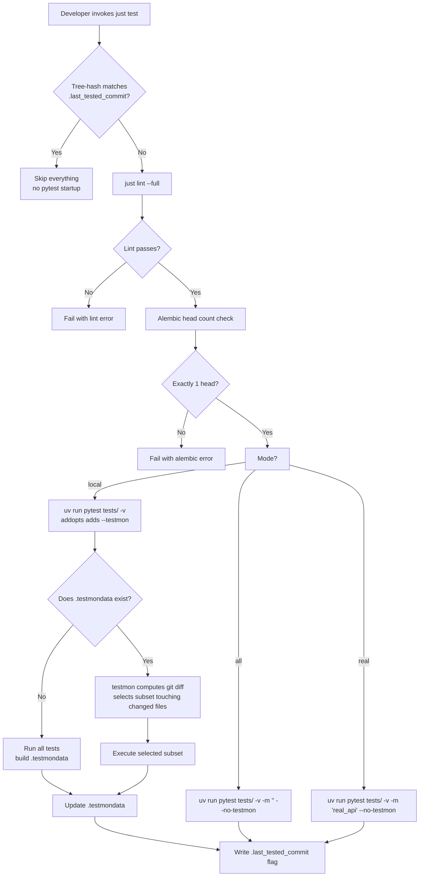

# P2-FEAT-20260622-221605 — pytest-testmon Change-Aware Test Selection

- GitHub Issue: https://github.com/zata-zhangtao/keda/issues/101

## 1. Introduction & Goals

### Problem Statement

`just test` is the only developer-facing Python test entry point in keda today. It inherits a tree-hash skip from `justfile.shared` (`scripts/shared/hooks/quality_flag.sh`) — either the entire working tree is unchanged (skip everything) or the entire suite runs. There is no per-test selection: editing a single backend module re-runs all 62 test files, even when only one module was touched.

This is wasteful for the inner loop where developers typically modify one or two files at a time. The team needs `just test` itself to re-run only the tests whose execution path actually touches a modified source file, while keeping `just test all` / `just test real` (which carry the explicit "run everything" intent) still able to force a full run.

### Proposed Solution Summary

- Add `pytest-testmon` as a dev dependency in `pyproject.toml`. It records each test's dependency fingerprint (which source files it imports/executes) into a `.testmondata` SQLite file on every run.
- Add `[tool.pytest.ini_options]` with `addopts = "--testmon"`. This makes every `pytest` invocation in the project testmon-aware by default — first run builds `.testmondata`; subsequent runs only re-execute tests whose fingerprint intersects files changed since the last run.
- **Override `@test type="local"` in `justfile`** to make `just test` the single change-aware entry point, while keeping the existing `all` / `real` modes as explicit "force full run" overrides. The keda-local override copies the shared recipe with two surgical deviations:
  - Drop the `-n auto` flag from `all` / `real` invocations (keda does not have `pytest-xdist` installed; the flag would error out).
  - Add `--no-testmon` to `all` / `real` invocations so those modes force a full run regardless of `.testmondata` state. Local mode picks up `--testmon` implicitly via addopts.
- Add `.testmondata` to `.gitignore`. Rebuild from scratch on demand by deleting the file (a one-line gitignore entry, no risk).
- Update `docs/ai-standards/testing.md` and `README.md` to document the new behavior and the `local` (testmon-selected) vs `all`/`real` (force-full) split.

The mechanism is supplied by pytest-testmon transparently to the developer — they continue to invoke `just test` exactly as before; the system infers which tests to run from `.testmondata` plus the working-tree / staged-area git diff (testmon does this internally).

Complexity intentionally avoided: no new recipe, no new CLI command, no source-to-test static reverse-mapping, no CI config change, no `tests/conftest.py` change, no upstream `justfile.shared` edit (keda-local override keeps the shared file untouched and the upstream-sync contract intact at the source level).

### Measurable Objectives

- `pytest-testmon>=2.1.0` is installed via `uv sync` and listed in `pyproject.toml` `[dependency-groups].dev`.
- `[tool.pytest.ini_options]` exists in `pyproject.toml` with `addopts = "--testmon"`.
- `just test` (local mode) invokes `uv run pytest tests/ -v` (no explicit `--testmon` flag; effective command picks it up from addopts) and runs a strict subset of tests when the working tree is partially modified.
- `just test all` invokes `uv run pytest tests/ -v -m '' --no-testmon` and always runs every test in `tests/` regardless of change state.
- `just test real` invokes `uv run pytest tests/ -v -m 'real_api' --no-testmon` and always runs every real_api-tagged test regardless of change state.
- `.testmondata` is excluded from version control via `.gitignore`.
- `docs/ai-standards/testing.md` and `README.md` describe the change-aware `just test` behavior and the `all`/`real` escape hatches.

### Realistic Validation

- [ ] **Real entry-point validation — cold start**: From a clean checkout (no `.testmondata`), `just test` runs the entire suite and exits 0; `.testmondata` exists afterward.
- [ ] **Real entry-point validation — hot run**: After editing exactly one file under `src/backend/` and saving, `just test` runs strictly fewer test files than the cold start (verified by counting the number of `tests/test_*.py` paths in `-v` output) and exits 0.
- [ ] **Real entry-point validation — `just test all` force-full**: After editing one source file, `just test all` runs the entire suite (no testmon filtering) and exits 0.
- [ ] **Real entry-point validation — `just test real` force-full**: `just test real` exits 0 (or 5 with the "no real_api tests" notice if none exist) and ignores `.testmondata` selection.
- [ ] **Real entry-point validation — gitignore**: `git check-ignore .testmondata` exits 0 from the repo root.
- [ ] **Real entry-point validation — docs build**: `uv run mkdocs build --strict` exits 0 with no warnings after the documentation updates.

**Why unit tests are insufficient**: The behavior under test is end-to-end pytest invocation, including testmon's import-tracing, db persistence, and selection algorithm. None of these can be exercised by isolated unit tests inside `tests/` without simulating pytest itself. Real entry-point runs are required.

### Delivery Dependencies

- Group: none
- Depends on groups:
  - none
- Depends on tasks/issues:
  - none
- Gate type: none
- Notes: This PRD is independent of all current pending PRDs. It touches only the justfile (project-local, freely editable), `pyproject.toml` dev dependency + new `[tool.pytest.ini_options]` block, `.gitignore`, and two docs files — none of which are claimed by other pending PRDs (verified via `rg -n "testmon|picked|change-aware" tasks/`).

## 2. Requirement Shape

- **Actor:** Keda developer (human or AI agent) running local tests during iterative development.
- **Trigger:** Developer invokes `just test` from the repo root. Edits one or more files under `src/` (or anywhere tracked by testmon) between invocations.
- **Expected behavior:** `just test` (local mode) runs `pytest` with `--testmon` enabled via addopts. The first invocation on a checkout without `.testmondata` executes the full suite to populate the cache. Subsequent invocations execute only tests whose dependency fingerprint intersects with the current working-tree and staged-area git diff against the last testmon run. `just test all` and `just test real` continue to force full runs via explicit `--no-testmon`.
- **Explicit scope boundary:** Only affects Python `pytest tests/` invocation through the `just test` recipe and its variants. Does not change `just e2e`, the Playwright package, the CI pipeline, the shared `justfile.shared` source file, or any test code under `tests/`.

## 3. Repository Context And Architecture Fit

### Current Relevant Modules/Files

- `pyproject.toml` — Python project metadata + dev dependency group (`[dependency-groups].dev`, lines 61-72). Currently has `pytest>=8.3.0` but no testmon. No `[tool.pytest.ini_options]` block exists today.
- `justfile` — Project-local recipes. Currently imports `justfile.shared` (line 11) and defines only `reinstall-iar` and `run`. Will gain a new `@test type="local"` recipe that overrides the shared one.
- `justfile.shared:908-975` — Defines the existing `@test type="local"` recipe (inherited as `just test`). Handles tree-hash skip via `quality_flag.sh`, runs `just lint --full` first, checks Alembic head count, then runs pytest with different flags per mode. **Source not modified**; keda-local override replaces its effect at the justfile resolution layer.
- `tests/conftest.py` — Currently only sets up `sys.path` and defines three `Fake*` classes for tests to import. No fixtures, no hooks that would interfere with testmon's import tracking. Untouched.
- `tests/` — 62 test files. No test uses `pytest.skip` or `pytest.mark.slow` markers today; selection will be entirely based on import-graph fingerprinting.
- `.gitignore` — Currently covers Python, Node, build artifacts, env files, `.iar`, `.agent-runner/`. No `.testmondata` entry.
- `docs/ai-standards/testing.md` — Lists `just test`, `just test all`, `uv run pytest ...` as the canonical test entry points. Needs documentation of the new change-aware behavior.
- `README.md` (lines 277-294) — Documents `uv run pytest tests/ -v` and Playwright. Needs `just test` behavior update.

### Existing Architecture Pattern To Follow

- The keda project follows a four-layer backend dependency rule (`api → core → engines → infrastructure`) enforced by `hooks/check_architecture.py`. This PRD does not add backend code, so the rule is unaffected.
- Project-local recipes in `justfile` override same-named recipes from `justfile.shared`. This is the established pattern for keda-specific behavior that should not propagate upstream.
- `uv add --dev` is the canonical way to add dev deps; `uv.lock` is updated as a side effect.

### Ownership And Dependency Boundaries

- `justfile` is project-local and freely editable; same-named recipe overrides the shared one.
- `justfile.shared` is synced from upstream template — must NOT be modified (keda-local override preserves this contract at the source level).
- `pyproject.toml` `[dependency-groups].dev` and `[tool.pytest.ini_options]` are project-local.
- `.gitignore` is project-local.
- `tests/conftest.py` is project-local; left untouched to minimize blast radius.

### Constraints From Runtime, Docs, Tests, Or Workflows

- `uv` is the canonical Python package manager; new dev deps must be added with `uv add --dev` to keep `uv.lock` in sync. Adding via raw `pyproject.toml` edit requires running `uv lock` afterward.
- Pre-commit runs `hooks/check_max_file_lines.py` with a 1000-line soft limit. The override recipe adds ~60 lines to `justfile`, well under the limit.
- Pre-commit excludes `^docs/|/migrations/` — so changes to `docs/` will not trigger pre-commit lint hooks, but the new recipe's documentation still needs `mkdocs build --strict` validation (per `docs/ai-standards/testing.md`).
- `pytest-xdist` is NOT in keda's dev dependency group (verified via `rg -n "xdist" pyproject.toml uv.lock` returning empty). The shared recipe's `-n auto` flag in `all`/`real` modes would therefore fail if invoked verbatim in keda. The override removes this flag.

### Matching Or Related PRDs

- **Searched:** `tasks/pending/` and `tasks/archive/` via `rg -n "testmon|picked|change-aware|incremental test|test selection" tasks/`.
- **Result:** No pending or archived PRD addresses test selection, testmon, pytest-picked, or change-aware testing. Closest adjacent work is the shared `quality_flag.sh` tree-hash skip mechanism (which lives in `scripts/shared/hooks/quality_flag.sh` and is owned by the upstream template), but that is a coarse-grained all-or-nothing skip, not per-test selection.
- **Relationship:** Independent. This PRD does not duplicate, depend on, or block any pending PRD.

## 4. Recommendation

### Recommended Approach

Add `pytest-testmon>=2.1.0` to `[dependency-groups].dev` in `pyproject.toml`. Add `[tool.pytest.ini_options]` with `addopts = "--testmon"`. Add `.testmondata` to `.gitignore`. Override the `@test type="local"` recipe in `justfile` to (a) drop `-n auto` from `all`/`real` invocations (keda has no xdist), (b) add `--no-testmon` to `all`/`real` invocations to force full runs, (c) leave `local` mode untouched so it picks up `--testmon` via addopts. Update two docs files.

**Why this is the best fit for the current architecture:**

1. **Single entry point.** `just test` is the canonical test command in every doc and script; keeping it as the single change-aware entry point preserves the existing developer mental model. No new recipe to learn.
2. **Force-full escape hatch.** `just test all` and `just test real` already carry the explicit "run everything" semantics. Adding `--no-testmon` to those modes keeps them honest — when the user types `all` or `real`, they get the full suite regardless of `.testmondata` state.
3. **Tree-hash skip coexists cleanly.** The shared recipe's tree-hash skip (`.last_tested_commit`) remains the fast path for "tree unchanged". Testmon is the fine-grained path for "tree changed". Both layers compose: tree-hash check runs first (zero pytest startup cost on clean trees), testmon handles the partial-change case after.
4. **Dynamic analysis over static reverse-mapping.** Testmon traces actual imports during test execution; keda's `test_*` files are not 1:1-named with their target modules (e.g. `test_agent_runner_workflow.py` exercises ~10 backend modules), so a static `test_<feature>.py` ↔ `<feature>/*.py` reverse mapping would miss most test dependencies. Testmon's runtime tracing captures them naturally.
5. **Self-healing on file move.** When source files move or get refactored, testmon auto-detects the change on the next run and re-runs the affected tests; no manual mapping maintenance needed.
6. **Override is fully local.** `justfile.shared` is byte-identical before and after this PRD — the upstream-sync contract is preserved at the source level. Keda carries the maintenance cost of keeping the override in sync with shared recipe evolution, which is explicit and visible.

### Alternatives Considered

- **Side-by-side `just test-changed` recipe (original proposal).** Rejected in favor of the user's preference for single entry point. Two recipes doubles the mental model and creates ambiguity about which to use.
- **`pytest-picked`.** Rejected as the heavier alternative. Uses `git diff --name-only` heuristics with no import-graph awareness. Keda test files are wide (one test exercises many modules), so picking tests by filename only would routinely miss tests that exercise changed modules. Maintenance burden is low but accuracy is poor.
- **Custom `--collect-only` + import-graph script.** Rejected as the heavier alternative. Would require maintaining a Python script that parses pytest's collection output, builds an import graph, and intersects with `git diff`. Higher complexity, no real accuracy advantage over testmon's runtime tracing, more failure modes (collection must succeed, fixtures may not be exercised during collection, etc.). Worth considering only if testmon itself became unmaintained.
- **`addopts = "--testmon"` only, no override (let `all`/`real` be testmon-filtered).** Rejected. `just test all` carries the explicit semantic "no marker filter, run everything"; mixing testmon selection in silently breaks that contract. The user requirement preserves `just test all`/`real` behavior.

## 5. Implementation Guide

This section is a living implementation guide based on current repository analysis. If implementation discovers additional affected files, hidden dependencies, edge cases, or a better path, update this PRD before proceeding.

### Core Logic

1. **Dependency install.** `uv add --dev pytest-testmon` adds the package to `pyproject.toml` `[dependency-groups].dev` and updates `uv.lock`. Reproducible on any developer machine via `uv sync`.
2. **Default addopts.** `[tool.pytest.ini_options].addopts = "--testmon"` makes every `pytest` invocation testmon-aware. CLI flags override addopts, so `--no-testmon` on the CLI wins over `--testmon` from addopts.
3. **Local mode (default `just test`).** `uv run pytest tests/ -v` — addopts expands this to `uv run pytest tests/ -v --testmon`. Testmon selects the subset of tests touching changed files.
4. **All mode (`just test all`).** Override expands to `uv run pytest tests/ -v -m '' --no-testmon`. Forces full run, no marker filter, ignores `.testmondata`.
5. **Real mode (`just test real`).** Override expands to `uv run pytest tests/ -v -m 'real_api' --no-testmon`. Forces full run of real_api-tagged tests.
6. **`.testmondata` lifecycle.** Lives at `<repo-root>/.testmondata`. Persists across runs; auto-updated after each run. Excluded from git via `.gitignore`. Rebuildable via `rm .testmondata` (safe one-liner; cold start next run).
7. **Override precedence.** Keda's `justfile` is loaded after `justfile.shared`. Just's recipe resolution picks the keda-local `@test` over the shared one for `just test`, `just test all`, `just test real` invocations.
8. **Shared source untouched.** `justfile.shared` is NOT modified. The shared `@test` recipe still exists in the file but is dead code in keda (the override shadows it). Upstream template sync remains conflict-free at the source level; if upstream later changes the shared recipe, keda's override must be manually re-aligned.

### Change Impact Tree

```
.
├── pyproject.toml
│   [修改] 【总结】dev dependency group 追加 pytest-testmon>=2.1.0；新增 [tool.pytest.ini_options] 段并设 addopts="--testmon"。
│
│   ├── [dependency-groups].dev 段新增一行：
│   │   "pytest-testmon>=2.1.0",
│   │
│   └── 文件末尾新增段：
│       [tool.pytest.ini_options]
│       addopts = "--testmon"
│
├── justfile
│   [新增 ~60 行] 【总结】新增项目级 @test type="local" 覆盖共享 recipe；local 模式透传 addopts→testmon，all/real 模式显式 --no-testmon 强制全量；同步移除 -n auto。
│
│   ├── 新增 recipe 段（紧跟 import 之后或紧随 reinstall-iar 之后）：
│   │   @test type="local": _check-completion
│   │       #!/usr/bin/env bash
│   │       set -euo pipefail
│   │       source ./scripts/shared/hooks/quality_flag.sh
│   │       ...（与 shared 相同的 tree-hash skip + lint pre-check + alembic check 段）...
│   │       pytest_exit_code=0
│   │       if [ "{{type}}" = "all" ]; then
│   │           uv run pytest tests/ -v -m '' --no-testmon || pytest_exit_code=$?
│   │       elif [ "{{type}}" = "real" ]; then
│   │           uv run pytest tests/ -v -m 'real_api' --no-testmon || pytest_exit_code=$?
│   │           if [ "$pytest_exit_code" -eq 5 ]; then
│   │               echo "ℹ️  No real_api tests collected; treating as success."
│   │               pytest_exit_code=0
│   │           fi
│   │       else
│   │           # Local mode: --testmon comes from pyproject.toml addopts.
│   │           uv run pytest tests/ -v || pytest_exit_code=$?
│   │       fi
│   │       ...（与 shared 相同的 flag-write 段）...
│
├── .gitignore
│   [修改] 【总结】追加一行 .testmondata 排除 testmon 的 SQLite 缓存文件。
│
│   └── 新增一行：
│       .testmondata
│
├── docs/ai-standards/testing.md
│   [修改] 【总结】在 Python Test Workflow 段落补一段关于 just test 现在 testmon-aware 的说明，以及 just test all/real 强制全量的语义。
│
│   └── 在 just test 列表后追加：
│       - `just test` (with `--testmon` from addopts) — change-aware
│       - `just test all` — force full run, ignores .testmondata
│       - `just test real` — force full real_api run, ignores .testmondata
│
├── README.md
│   [修改] 【总结】在「测试」小节更新 just test 描述，说明 testmon 选择语义和 all/real 兜底。
│
│   └── 在 line 280-294 区间更新 2-4 行说明。
│
└── uv.lock
    [修改 - 副作用] 【总结】uv add --dev pytest-testmon 自动更新，无需手改；如果手改 pyproject.toml 必须跑 uv lock。
```

**Starting-point note:** This list reflects files explicitly identified during repository analysis. The Executor Drift Guard below covers the possibility that other files (e.g. additional docs referencing `just test`, AI agent prompts that mention `just test`, `.pre-commit-config.yaml` if testmon needs special handling) surface during implementation.

### Executor Drift Guard

Repository-wide references that may need follow-up checks after this change lands:

- `rg -n "just test" docs/` — confirm no doc still implies `just test` is the only Python test entry point. Update any other doc that lists test commands.
- `rg -n "uv run pytest" .` — confirm no Makefile, script, or CI config invokes bare `pytest` and would surprise users by now picking up `.testmondata` (this is desirable — direct `pytest` invocations also get testmon selection).
- `rg -n "testmon" .` — confirm no other file claims testmon ownership; there should be exactly two definition sites (the dev dep pin in pyproject.toml and the addopts line) after this change.
- `.pre-commit-config.yaml` — does NOT need changes (no pre-commit hook exercises pytest).
- `justfile.shared` — MUST remain byte-identical. Any deviation is a regression of the upstream-sync contract.
- `hooks/` — none of the architecture/lint hooks depend on testmon; no changes expected.
- `tests/conftest.py` — MUST remain byte-identical. Testmon's import tracing works through standard Python imports and does not require fixture registration.

If implementation finds that any file other than the four listed above needs to change, update this PRD's Change Impact Tree before merging.

### Flow Diagram



### Realistic Validation Plan

| Behavior | Real Entry Point | Test Layer | Mock Boundary | Data/Env Needed | Command Or Procedure | Required For Acceptance |
|---|---|---|---|---|---|---|
| Cold-start full run + `.testmondata` created via `just test` | `just test` from repo root | end-to-end (real pytest + real testmon + real SQLite) | none — all real | clean checkout (no `.testmondata`), Python 3.11+, `uv` installed | `rm -f .testmondata && just test` then `test -f .testmondata && echo OK` | Yes |
| Hot-run subset selection via `just test` | `just test` after editing one backend file | end-to-end | none | any source file under `src/backend/` edited and saved; the edit must change AST of a covered function/class to be detected by testmon | `printf '\n\ndef _testmon_validation_marker() -> None:\n    pass\n' >> src/backend/core/shared/models/agent_runner.py && just test 2>&1 | tee /tmp/run.log` then count `tests/test_*.py` paths in `/tmp/run.log`; must be < 62 and > 0 | Yes |
| `just test all` force-full | `just test all` from repo root | end-to-end | none | any source file modified (to bypass tree-hash skip if applicable) | `just test all 2>&1 | tee /tmp/run.log` then verify count of `tests/test_*.py` paths equals 62 (full run) | Yes |
| `just test real` force-full | `just test real` from repo root | end-to-end | none | repo at any working state | `just test real` exits 0 or 5 (no real_api tests) | Yes |
| `.testmondata` is git-ignored | `git check-ignore` | smoke | none | repo at git HEAD | `git check-ignore .testmondata && echo OK` | Yes |
| Override actually shadows shared recipe | introspection | smoke | none | both `justfile` and `justfile.shared` present | `just --justfile justfile --evaluate @test` shows keda-local body; or compare `just test --help` output (if any) | Yes |
| Docs build still passes | `mkdocs build --strict` | docs validation | none | existing mkdocs config | `uv run mkdocs build --strict` | Yes |

**Triage notes:**

- If the hot-run subset is unexpectedly empty (0 tests selected), inspect `.testmondata` content with `sqlite3 .testmondata ".tables"` and verify the edited file's path matches the recorded fingerprints. Empty selection typically means the `.testmondata` is stale relative to the working tree; `rm .testmondata && just test` recovers.
- If `just test` fails with `pytest: error: unrecognized arguments: --testmon`, the dev dep was added to `pyproject.toml` but `uv sync` was not run; run `uv sync` and retry.
- If `just test all` or `just test real` runs a subset instead of all, verify the override recipe's `--no-testmon` flag is present (addopts `--testmon` should be overridden by CLI `--no-testmon`).
- If `git check-ignore .testmondata` exits 1, verify the new line is exactly `.testmondata` (no leading whitespace, no comment on the same line) in `.gitignore`.
- If the override does not appear to shadow the shared recipe, run `just --list` and confirm `@test type="local"` resolves to the keda-local definition (keda-local body contains `--no-testmon`).

### Low-Fidelity Prototype

Not required. The change is purely CLI plumbing; no UI surface, no multi-step user interaction, no layout decision. The flow diagram above is sufficient.

### ER Diagram

No data model changes in this PRD. `.testmondata` is an opaque SQLite cache owned by `pytest-testmon`; its schema is the library's internal concern, not keda's.

### Interactive Prototype Change Log

No interactive prototype file changes in this PRD.

### External Validation

No external validation required; repository evidence was sufficient. `pytest-testmon` is a stable, widely used package whose `--testmon` / `--no-testmon` CLI flags have been stable for years; no vendor-API research, security guidance, or ecosystem-best-practice lookup is needed for this change.

## 6. Definition Of Done

- `uv add --dev pytest-testmon` has been run (or `pyproject.toml` + `uv.lock` updated equivalently); `uv sync` succeeds on a clean checkout.
- `[tool.pytest.ini_options]` block exists in `pyproject.toml` with `addopts = "--testmon"`.
- `@test type="local"` override exists in `justfile` and shadows the shared recipe.
- `just test` (local mode) runs `uv run pytest tests/ -v` (no explicit `--testmon` flag in the recipe; addopts supplies it).
- `just test all` runs the full suite with `--no-testmon` flag in the recipe (verifiable by shell trace).
- `just test real` runs full real_api tests with `--no-testmon` flag in the recipe.
- `.testmondata` appears in `.gitignore`.
- `docs/ai-standards/testing.md` and `README.md` document the change-aware `just test` behavior and the `all`/`real` escape hatches.
- `justfile.shared` is byte-identical before and after the change (verified via `git diff justfile.shared` empty).
- `tests/conftest.py` is byte-identical before and after the change.
- Cold-start `just test` runs the full suite and creates `.testmondata`.
- Hot-run `just test` after editing one source file runs a strict subset of tests.
- `just test all` and `just test real` continue to force full runs regardless of `.testmondata` state.
- `uv run mkdocs build --strict` passes.
- No regression in existing tests (`just test` exits 0 on a clean tree).

## 7. Acceptance Checklist

### Architecture Acceptance

- [ ] No file under `src/backend/{api,core,engines,infrastructure}/` is modified by this PRD.
- [ ] `justfile.shared` is byte-identical before and after this PRD (verified via `git diff justfile.shared` empty).
- [ ] `tests/conftest.py` is byte-identical before and after this PRD.
- [ ] `@test type="local"` exists in keda `justfile` (recipe override takes precedence over shared per just's resolution rules).

### Dependency Acceptance

- [ ] `pyproject.toml` `[dependency-groups].dev` contains `pytest-testmon>=2.1.0` (or newer compatible version) on a line by itself.
- [ ] `uv.lock` contains a `pytest-testmon` entry resolved against the version pin (verified via `rg -n "pytest-testmon" uv.lock`).
- [ ] `uv sync` succeeds from a clean checkout with no errors.

### Behavior Acceptance

- [ ] `[tool.pytest.ini_options]` block exists in `pyproject.toml` with `addopts = "--testmon"`.
- [ ] `just test` (local mode) recipe body calls `uv run pytest tests/ -v` with no explicit `--testmon` (picked up from addopts).
- [ ] `just test all` recipe body calls `uv run pytest tests/ -v -m '' --no-testmon` (force-full + no markers).
- [ ] `just test real` recipe body calls `uv run pytest tests/ -v -m 'real_api' --no-testmon` (force-full + real_api only).
- [ ] The override recipe does NOT include `-n auto` in any of the three pytest invocations (keda has no xdist).
- [ ] Cold-start run via `just test` (no `.testmondata`) executes the full suite and creates `.testmondata` at the repo root.
- [ ] Hot-run via `just test` after editing exactly one file under `src/backend/` selects a strict subset (fewer than 62 test files touched in `-v` output, more than 0).
- [ ] `just test all` after editing a source file still runs all 62 test files (no testmon filtering).
- [ ] `just test real` exits 0 (or 5 with the documented "no real_api tests" notice) and ignores `.testmondata` selection.
- [ ] Removing `.testmondata` and re-running `just test` performs a fresh cold start (recovers gracefully from cache loss).

### Documentation Acceptance

- [ ] `docs/ai-standards/testing.md` documents that `just test` is change-aware via testmon and that `just test all` / `just test real` force full runs.
- [ ] `README.md` "测试" section (around line 277) updates the `just test` description to reflect the testmon behavior.
- [ ] `uv run mkdocs build --strict` succeeds with no warnings.

### Validation Acceptance

- [ ] **Real entry-point validation — cold start**: `rm -f .testmondata && just test` exits 0; `test -f .testmondata` succeeds.
- [ ] **Real entry-point validation — hot run**: After editing `src/backend/core/shared/models/agent_runner.py` (adding a no-op function to change the AST), `just test` exits 0 and runs a strict subset of tests.
- [ ] **Real entry-point validation — `just test all` force-full**: After editing a source file, `just test all` exits 0 and runs all 62 test files.
- [ ] **Real entry-point validation — `just test real` force-full**: `just test real` exits 0 or 5.
- [ ] **Real entry-point validation — gitignore**: `git check-ignore .testmondata` exits 0.
- [ ] **Real entry-point validation — docs build**: `uv run mkdocs build --strict` exits 0.

## 8. Functional Requirements

- **FR-1** The `pytest-testmon` package must be declared as a dev dependency in `pyproject.toml` and resolvable via `uv sync`.
- **FR-2** `[tool.pytest.ini_options]` must exist in `pyproject.toml` with `addopts = "--testmon"`, enabling testmon selection for every `pytest` invocation in the project.
- **FR-3** `@test type="local"` must be defined in `justfile` and override the shared recipe from `justfile.shared`.
- **FR-4** `just test` (local mode) must invoke `pytest tests/ -v` and rely on addopts for `--testmon`; it must select a strict subset of tests when files in the working tree have been modified since the last testmon run.
- **FR-5** `just test all` must invoke `pytest tests/ -v -m '' --no-testmon`, running the full suite regardless of `.testmondata` state.
- **FR-6** `just test real` must invoke `pytest tests/ -v -m 'real_api' --no-testmon`, running the full real_api-tagged suite regardless of `.testmondata` state.
- **FR-7** The override recipe must not include the `-n auto` flag in any of its three pytest invocations (keda does not have `pytest-xdist`).
- **FR-8** The `.testmondata` file produced by testmon must be excluded from version control via `.gitignore`.
- **FR-9** The first invocation of `just test` on a checkout without `.testmondata` must execute the full test suite and create the cache file.
- **FR-10** `docs/ai-standards/testing.md` and `README.md` must document the change-aware `just test` behavior and the `all`/`real` escape hatches.
- **FR-11** No backend source file under `src/backend/` is allowed to be modified by this PRD.
- **FR-12** `justfile.shared` must be byte-identical before and after this PRD.
- **FR-13** `tests/conftest.py` must be byte-identical before and after this PRD.

## 9. Non-Goals

- Modifying `justfile.shared` or any shared scripts in `scripts/shared/`.
- Adding `slow` / `real_api` pytest markers (separate concern; the template uses them, keda does not currently need them).
- Migrating to `pytest-picked` or building a custom `--collect-only` + import-graph script.
- Changing `tests/conftest.py` to wire testmon-specific hooks.
- Adding testmon-aware CI configuration (CI continues to run `just test`; selection is automatic via addopts).
- Modifying Playwright E2E test invocation in `tests/playwright-e2e/`.
- Adding `pytest-xdist` to dev dependencies (out of scope; the override removes the latent `-n auto` flag instead).
- Replacing the shared tree-hash skip mechanism with testmon alone (the two layers compose: tree-hash is the fast path, testmon is the fine-grained path).

## 10. Risks And Follow-Ups

- **Risk: keda-local override becomes stale relative to upstream shared recipe.** If `justfile.shared`'s `@test` recipe is updated upstream (e.g., new mode, new pre-check), keda's override must be manually re-aligned. **Mitigation:** keep the override diff minimal (only the three pytest invocations differ); document the divergence in the override recipe header comment; surface a sync-conflict warning in CI by checking that the shared recipe still exists.
- **Risk: testmon becomes unmaintained.** Mitigation: switching to an alternative (`pytest-picked`, custom script, or wait for `pytest --collect-only`-based tooling) requires only changing the three pytest invocations in the override recipe and possibly swapping the addopts. No test code changes.
- **Risk: hot-run subset is empty when it shouldn't be.** This typically means `.testmondata` is stale. Documented escape hatch (`rm .testmondata && just test`) is part of the docs update.
- **Risk: shared recipe's `-n auto` removal is unexpected by someone reading the override.** Mitigation: explicit comment in the override recipe body explaining why `-n auto` is omitted (no `pytest-xdist` in keda dev deps).
- **Follow-up (not in this PRD):** Evaluate whether testmon selection accuracy is high enough to default-on in CI. The shared recipe already routes through `just test`; CI uses `just test` and would automatically inherit testmon selection. If selection proves too aggressive (e.g., missing tests that should run), consider forcing `--no-testmon` in CI as a follow-up.

## 11. Decision Log

| ID | Decision | Chosen | Rejected | Rationale |
|---|---|---|---|---|
| D-01 | Mechanism for change-aware test selection | `pytest-testmon` (runtime import tracing + SQLite cache) | `pytest-picked` (filename heuristic); custom `--collect-only` + import-graph script | keda tests are wide (one test exercises many modules); testmon's runtime tracing captures actual dependencies while picked/script-based approaches would miss most. Testmon also has the best maintenance trajectory. |
| D-02 | Recipe surface — single entry point vs side-by-side | Override `@test` in keda `justfile`; `just test` becomes the single change-aware entry point | Side-by-side `just test-changed` recipe (original PRD proposal) | User preference: single entry point preserves the existing developer mental model; `just test all` and `just test real` already carry "force full" semantics and gain `--no-testmon` to enforce them. |
| D-03 | Where to enable `--testmon` | Global `[tool.pytest.ini_options].addopts = "--testmon"`; CLI `--no-testmon` in `all`/`real` invocations | Project-local `just test-changed` recipe with `--testmon` only on CLI | Single entry point design requires testmon to apply by default to all pytest invocations. CLI `--no-testmon` overrides addopts and cleanly disables testmon for force-full modes. |
| D-04 | Whether to override `@test` or modify `justfile.shared` | Override `@test` in keda `justfile` | Modify `justfile.shared` | `justfile.shared` is synced from upstream template; modifying it would either (a) require upstream template PR and is out of keda scope, or (b) break upstream-sync contract. Override keeps the shared source file untouched. |
| D-05 | Treatment of `-n auto` in override recipe | Drop `-n auto` from all three pytest invocations in the override | Preserve `-n auto` (matching shared verbatim) | keda does not have `pytest-xdist` in dev deps (verified via `rg -n "xdist" pyproject.toml uv.lock` empty). Preserving `-n auto` would break `just test all` / `just test real`. Removing it is a necessary deviation; this also fixes a latent pre-existing bug in the shared recipe's keda usage. |
| D-06 | `.testmondata` storage location | Repo root (`<repo-root>/.testmondata`, testmon default) | Move under `tests/.testmondata` | Testmon's documented default is repo root; relocating requires `--testmon-chdir` or similar flag and is unnecessary. Repo-root placement matches the testmon contract. |
| D-07 | Documentation update scope | `docs/ai-standards/testing.md` + `README.md` only | Comprehensive docs sweep including AGENTS.md, hooks/README, etc. | Repository search shows only those two files reference test commands prominently; other files either don't list commands or list them in non-normative prose. Executor Drift Guard covers discovery of additional files during implementation. |
