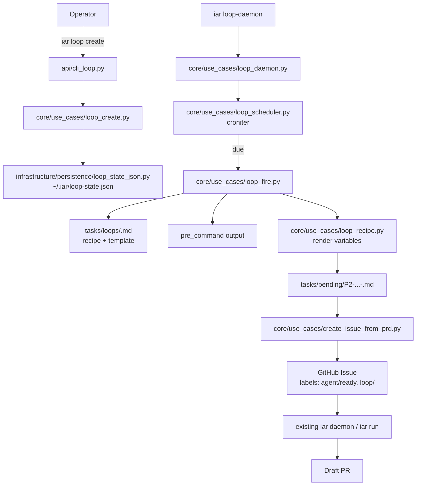

# PRD: IAR Loop — 定时循环任务

- GitHub Issue: https://github.com/zata-zhangtao/keda/issues/110

- PRD path: `tasks/pending/P2-FEAT-20260623-102437-iar-loop-scheduled-recurring-tasks.md`

## 1. Introduction & Goals

### Problem

`iar` 已经能把单个 GitHub Issue 跑成 PR，但它不会“定时造票”。运维者如果想让某个项目每天自动产生一个任务（例如每天早上 8 点抓取 GitHub Trending 并更新文档），目前只能依赖外部 cron 手写脚本调用 `iar issue create`，既没有统一的配方管理，也无法利用 IAR 现有的 Issue/PRD/Runner 闭环。

### Proposed Solution Summary

新增一个 **IAR Loop** 子系统：

1. 用仓库内的 Markdown 文件定义 **loop 配方**（loop recipe），内含 cron 调度、PRD 模板、前置数据命令、目标仓库、标签等元数据。
2. 新增 `iar loop create/list/cancel/run --now/loop-daemon` 命令，CLI 表面尽量贴近 Claude Code 的 `/loop` / scheduled task 心智（短 ID、`list`/`cancel`、自然语言 schedule）。
3. 触发时，loop 渲染模板生成一份带日期戳的 PRD 到 `tasks/pending/`，然后调用现有 `create_issue_from_prd` 创建 GitHub Issue 并贴上 `agent/ready`（以及 `loop/<id>` 标签）。
4. 执行仍然交给现有的 `iar daemon` 或 `iar run`；`loop-daemon` 也可以配置为“造票后立即调用 runner”。
5. 状态保存在操作员环境的 `~/.iar/loop-state.json` 中，配方文件保留在仓库 `tasks/loops/` 下参与版本控制。

这样，用户每天得到的是一份独立的 PRD、Issue 和 PR，历史可追溯，失败可单独重试，不需要重写执行流水线。

### Measurable Objectives

- [ ] 用户能用一条命令注册一个每天早上 8 点运行的 loop：`iar loop create github-trending --recipe tasks/loops/github-trending.md --cron "0 8 * * *"`。
- [ ] loop 触发后能在 `tasks/pending/` 生成当天 PRD，并创建对应 Issue。
- [ ] 生成的 Issue 能被现有 `iar daemon` 正常认领、执行、产生 PR。
- [ ] 支持 `--dry-run` 预览下一次触发会生成什么，不创建真实 Issue。
- [ ] 支持 `iar loop run --now <id>` 手动触发测试。

### Realistic Validation

除单元测试外，本 PRD 要求通过真实 CLI 入口验证关键行为：

- [ ] **Loop 注册与列表**真实验证：通过 `iar loop create ...` 和 `iar loop list` 验证 `~/.iar/loop-state.json` 写入正确。
- [ ] **Loop 触发造票**真实验证：通过 `iar loop run --now <id>` 在目标仓库生成 PRD 与 Issue，Issue body 包含正确的 `PRD path` 锚点。
- [ ] **Loop daemon 调度**真实验证：通过 `iar loop-daemon --interval 10 --dry-run` 观察到 cron 解析与 next-fire 计算正确，不创建真实 Issue。
- [ ] **端到端闭环**真实验证：loop 创建的 Issue 被 `iar run` 或 `iar daemon` 认领后，能正常走完 commit → push → draft PR 流程。

**为什么单元测试不够**：loop 的正确性依赖真实文件系统路径、`config.toml` 仓库解析、GitHub Issue 创建、现有 runner 的状态机衔接，这些边界在隔离 fixture 中无法完整证明。

### Delivery Dependencies

- Group: none
- Depends on groups:
  - none
- Depends on tasks/issues:
  - none
- Gate type: none
- Notes: 本功能复用现有 Issue/PRD/Runner 流程，不依赖新的前后端接口或数据库迁移。

## 2. Requirement Shape

### Actor

项目维护者 / 运维者（operator），在已初始化 IAR 的仓库中配置并启动 loop。

### Trigger

- 定时触发：`loop-daemon` 根据 loop 配方的 cron/interval 计算 next fire，到点后触发。
- 手动触发：用户执行 `iar loop run --now <id>`。
- 启动补偿：`loop-daemon` 启动时，若某 loop 错过了上一次触发且未执行，最多补跑一次（不累积补跑）。

### Expected Behavior

1. 用户创建一个 loop 配方（Markdown + YAML frontmatter）。
2. 用户通过 `iar loop create` 注册该配方到 `~/.iar/loop-state.json`。
3. `loop-daemon` 或系统 cron 周期检查哪些 loop 到期。
4. 到期时，loop 系统：
   - 渲染模板变量（`{{date}}`、`{{timestamp}}` 等）。
   - 可选运行 `pre_command` 获取动态数据并注入变量。
   - 在 `tasks/pending/` 生成新的 PRD 文件（文件名带日期时间戳）。
   - 调用现有 `create_issue_from_prd` 创建 GitHub Issue。
   - 给 Issue 贴上 `agent/ready` 和 `loop/<id>` 标签（若 recipe 中 `queue_ready=true`）。
   - 更新 `loop-state.json` 的 `last_fire_at` / `next_fire_at`。
   - 若 `run_now=true`，调用现有 `run_agent_repositories_once` 立即执行该仓库的 ready issues。
5. 现有 `iar daemon` 随后会正常认领该 Issue 并产出 PR。

### Scope Boundary

- Loop 只负责“造票”和“调度”，不负责 agent 执行、PR review、合并。
- 不修改现有 Issue 状态机、标签语义、PRD 归档规则。
- 不引入新的数据库存储；状态用本地 JSON 文件。
- 多仓库场景下，每个 loop 绑定一个 `repo_id`，不支持单个 loop 跨多个仓库。

## 3. Repository Context And Architecture Fit

### Current Relevant Modules

| 模块 | 作用 | 可复用点 |
|---|---|---|
| `src/backend/core/use_cases/run_agent_daemon.py` | 常驻轮询 runner | loop-daemon 可复用其“睡眠-轮询-异常隔离”模式 |
| `src/backend/core/use_cases/run_agent_repositories_once.py` | 单次执行 ready issues | loop 触发后可调用它立即运行 |
| `src/backend/core/use_cases/create_issue_from_prd.py` | 从 PRD 创建 Issue | loop 渲染 PRD 后调用它 |
| `src/backend/core/use_cases/create_prd_from_issue.py` | 从 Issue 生成 PRD | 其模板渲染思路可用于 loop 配方渲染 |
| `src/backend/core/use_cases/generated_content.py` | AI/模板内容生成 | 可作为 recipe 模板渲染的 fallback |
| `src/backend/api/cli.py` / `cli_typer.py` / `cli_parser.py` | CLI 入口 | 需要同步新增 `loop` 子命令 |
| `src/backend/engines/agent_runner/factory.py` | 依赖装配 | 需要新增 loop state store / clock 的工厂方法 |
| `src/backend/infrastructure/config/settings.py` | 配置模型 | 可在 `[agent_runner]` 下新增 `loop` 段默认配置 |
| `src/backend/core/shared/models/agent_runner.py` | 领域模型 | 新增 loop 相关 dataclass |

### Existing Architecture Pattern

本仓库采用四层依赖方向：

```text
api/ → core/ → engines/ → infrastructure/
```

Loop 子系统应遵循：

- `core/use_cases/loop_*.py`：业务编排（配方解析、调度计算、触发执行）。
- `core/shared/interfaces/loop_scheduler.py`：定义 `ILoopStateStore`、`ILoopClock` 等端口。
- `core/shared/models/loop.py`：`LoopRecipe`、`LoopTask`、`LoopFireResult` 等值对象。
- `infrastructure/persistence/loop_state_json.py`：JSON 状态实现。
- `infrastructure/scheduler/loop_clock.py`：真实时钟实现。
- `api/cli_loop.py`：CLI 解析与调用（或合并进现有 CLI 模块）。

### Constraints

- `core/` 不能反向依赖 `infrastructure/`；状态存储必须通过接口注入。
- `cli_parser.py` 与 `cli_typer.py` 必须保持同步，否则 Typer 与 argparse 帮助/行为不一致。
- 文件 I/O 必须显式 `encoding="utf-8"`。
- 单文件非空行不超过 1000 行；新增 use case 应按职责拆分。

### Matching Or Related PRDs

- `tasks/pending/` 中未发现重叠的 loop/schedule PRD。
- `tasks/archive/P1-FEAT-20260623-002646-iar-daemon-cwd-infer-single-repo.md` 定义了 daemon 的默认仓库推断逻辑，`loop-daemon` 应复用或兼容该行为。
- `tasks/archive/P2-FEAT-20260527-190923-prd-from-issue.md` 提供了 PRD 模板渲染的参考实现。
- 结论：本 PRD 独立，不与任何 pending PRD 形成 hard/soft 依赖。

## 4. Recommendation

### Recommended Approach

采用 **“仓库配方 + 本地状态 + 独立 loop-daemon”** 的方案：

1. 新增 `LoopRecipe` Markdown 格式， frontmatter 描述调度与目标，body 为 PRD 模板。
2. `iar loop create` 把配方注册到 `~/.iar/loop-state.json`。
3. `iar loop-daemon` 用 `croniter` 解析 cron/interval，计算 next fire，到点后触发。
4. 触发时调用现有 `create_issue_from_prd`，不新增造票逻辑。
5. 手动触发和 dry-run 作为一等命令，便于测试。

### Why This Fits

- 最小改动：没有新增数据库存储、没有修改 runner 状态机，只是给现有 Issue/PRD 入口加了一个定时水龙头。
- 心智成本低：Claude 用户已经熟悉 `loop` / `list` / `cancel` / scheduled task 的概念。
- 可追踪：每份 PRD 都带时间戳，失败可以追溯到具体某一天的 Issue。
- 可回滚：删除 `~/.iar/loop-state.json` 中的条目即可停止 loop，不影响历史 Issue。

### Alternatives Considered

1. **纯会话级 `/loop`（Claude  exact parity）**
   - 拒绝作为默认方案：IAR 的核心价值是无人值守执行，要求用户一直开着终端才能跑每天早上 8 点的任务，不符合实际场景。
   - 保留为后续扩展：未来可增加 `iar loop --session` 模式做临时监控。

2. **完全依赖外部 cron / GitHub Actions**
   - 拒绝作为唯一方案：虽然稳定，但会把 loop 配方和调度逻辑散落在仓库外，增加运维成本。
   - 保留为补充：loop-daemon 可导出 crontab/GitHub Actions 配置。

3. **loop 直接 commit 内容而不走 Issue/PRD**
   - 拒绝：绕过现有 acceptance checklist、PR review、失败恢复机制，与 IAR 流程不一致。

## 5. Implementation Guide

> This section is a living implementation guide based on current repository analysis. If implementation discovers additional affected files, hidden dependencies, edge cases, or a better path, update this PRD before proceeding.

### Core Logic

```text
operator
  ├─ writes tasks/loops/<id>.md
  ├─ runs iar loop create <id> --recipe tasks/loops/<id>.md --cron "0 8 * * *"
  │     → core/use_cases/loop_create.py
  │     → infrastructure/persistence/loop_state_json.py 写入 ~/.iar/loop-state.json
  │
  ├─ runs iar loop-daemon
  │     → core/use_cases/loop_daemon.py
  │     → 每分钟（可配置）读取 loop-state.json
  │     → core/use_cases/loop_scheduler.py 用 croniter 计算 next_fire_at
  │     → 到期则进入 loop_fire.py
  │
  └─ loop_fire.py
        ├─ 读取 recipe，渲染 {{date}} 等变量
        ├─ 可选运行 pre_command，输出注入变量
        ├─ 生成 tasks/pending/P2-FEAT-YYYYMMDD-HHMMSS-<slug>.md
        ├─ 调用 create_issue_from_prd（复用现有流程）
        ├─ 给 Issue 贴 agent/ready 与 loop/<id>
        └─ 更新 loop-state.json
```

### Change Impact Tree

```text
.
├── pyproject.toml
│   [修改]
│   【总结】新增 croniter 依赖，用于 cron/interval 调度解析。
│   └── 在 dependencies 中加入 "croniter>=3.0.0"
│
├── src/backend/core/shared/models/loop.py
│   [新增]
│   【总结】定义 LoopRecipe、LoopTask、LoopSchedule、LoopFireResult 等纯领域值对象。
│   └── LoopRecipe: 解析后的配方对象（id, schedule, repo_id, template, pre_command, labels...）
│   └── LoopTask: 注册后的任务实例（id, recipe_path, repo_id, enabled, last/next fire）
│   └── LoopFireResult: 一次触发结果（prd_path, issue_url, skipped_reason）
│
├── src/backend/core/shared/interfaces/loop_scheduler.py
│   [新增]
│   【总结】定义 loop 子系统需要的端口，保证 core 层不反向依赖 infrastructure。
│   └── ILoopStateStore: load/save/list/delete tasks
│   └── ILoopClock: now() / sleep_until()，便于测试替换
│
├── src/backend/core/use_cases/loop_recipe.py
│   [新增]
│   【总结】读取 tasks/loops/*.md，解析 YAML frontmatter，渲染 Jinja2/{{var}} 模板变量。
│   └── parse_loop_recipe(path) → LoopRecipe
│   └── render_loop_recipe(recipe, variables) → rendered_prd_text
│   └── validate_loop_recipe(recipe) 检查 schedule/repo_id/agent 合法性
│
├── src/backend/core/use_cases/loop_scheduler.py
│   [新增]
│   【总结】调度计算：把 schedule 转成 croniter，计算 next_fire_at，判断 loop 是否到期。
│   └── compute_next_fire(schedule, timezone, after) → datetime
│   └── list_due_tasks(state, clock) → list[LoopTask]
│   └── should_skip(task, github_client) → bool（按日期去重）
│
├── src/backend/core/use_cases/loop_fire.py
│   [新增]
│   【总结】执行一次 loop 触发：渲染 PRD、写文件、创建 Issue、更新状态。
│   └── fire_loop(task, repo_context, dry_run=False) → LoopFireResult
│   └── 复用 create_issue_from_prd 创建 Issue
│   └── 可选调用 run_agent_repositories_once 立即执行
│
├── src/backend/core/use_cases/loop_create.py
│   [新增]
│   【总结】把 recipe 注册成持久 loop，写入状态文件并校验 schedule。
│   └── create_loop_from_recipe(recipe_path, repo_id, schedule, state_store) → LoopTask
│
├── src/backend/core/use_cases/loop_daemon.py
│   [新增]
│   【总结】常驻进程，轮询 loop-state.json，触发到期 loop，异常隔离。
│   └── 复用 run_agent_daemon 的 while True / sleep / per-task try/except 模式
│
├── src/backend/infrastructure/persistence/loop_state_json.py
│   [新增]
│   【总结】ILoopStateStore 的 JSON 实现，文件路径 ~/.iar/loop-state.json。
│   └── 读写使用 Path.read_text/write_text(encoding="utf-8")
│   └── 可选文件锁防止并发 daemon 同时写入（MVP 可先警告文档化）
│
├── src/backend/infrastructure/scheduler/loop_clock.py
│   [新增]
│   【总结】ILoopClock 的实时实现，测试时替换为 FixedClock。
│
├── src/backend/api/cli_loop.py
│   [新增]
│   【总结】loop 子命令的业务入口，负责参数转换并调用 core use cases。
│   └── loop_create_command, loop_list_command, loop_cancel_command, loop_run_now_command, loop_daemon_command
│
├── src/backend/api/cli.py
│   [修改]
│   【总结】在 _run_parsed_command 中新增 "loop" 命令分发。
│   └── 引入 cli_loop 的入口函数
│
├── src/backend/api/cli_typer.py
│   [修改]
│   【总结】新增 typer.Typer(name="loop") 与对应命令函数，保持与 argparse 同步。
│   └── 新增 LoopIntervalOption、LoopCronOption 等可复用参数类型
│
├── src/backend/api/cli_parser.py
│   [修改]
│   【总结】新增 "loop" subparser 及 create/list/cancel/run/daemon 子命令。
│   └── loop create 支持 --recipe、--cron、--every、--repo-id、--publish-prd、--queue-ready、--run-now、--dry-run
│   └── loop run 支持 --now、--dry-run
│   └── loop-daemon 支持 --interval
│
├── src/backend/engines/agent_runner/factory.py
│   [修改]
│   【总结】新增 create_loop_state_store()、create_loop_clock() 工厂方法，供 CLI 装配。
│
├── tasks/loops/github-trending.md
│   [新增示例]
│   【总结】loop 配方示例，供用户参考复制。
│
├── tests/test_loop_recipe.py
│   [新增]
│   【总结】配方解析与模板渲染的单元测试。
│
├── tests/test_loop_scheduler.py
│   [新增]
│   【总结】cron/interval 解析、next_fire 计算、去重逻辑的单元测试。
│
├── tests/test_loop_fire.py
│   [新增]
│   【总结】fire 流程的集成测试，使用内存状态仓库和 mocked GitHub client。
│
├── tests/test_cli_loop.py
│   [新增]
│   【总结】CLI 参数解析与帮助文本一致性测试，覆盖 argparse 和 typer 路径。
│
└── docs/guides/iar-loop.md
    [新增]
    【总结】面向用户的 loop 使用文档与配方编写规范。
```

### Executor Drift Guard

- CLI 命令在 `cli_parser.py`、`cli_typer.py`、`cli.py` 三处都有体现；修改任何一处后应运行：
  ```bash
  uv run pytest tests/test_cli_loop.py -v
  ```
- 新增 use case 后应搜索是否还有其他入口会调用 `create_issue_from_prd`，确保 loop_fire 使用的参数名与最新签名一致：
  ```bash
  rg "create_issue_from_prd\(" src/backend
  ```
- loop 状态文件路径被硬编码在 `infrastructure/persistence/loop_state_json.py` 中；若未来改为 DB 存储，应只改该模块，core 层不变。
- 配方 frontmatter 键名应在 `loop_recipe.py` 中集中定义常量，避免散落字符串。

### Flow / Architecture Diagram



### No Data Model Changes In This PRD

本 PRD 不新增数据库表或 ORM 模型。状态持久化使用本地 JSON 文件，领域对象使用 dataclass。

### No Interactive Prototype File Changes In This PRD

本功能为 CLI/后台工作流，无需交互式原型。

### External Validation

| Topic | Source | Checked On | Relevant Finding | Impact On Recommendation |
|---|---|---|---|---|
| Claude Code `/loop` semantics | https://gist.github.com/aydinnyunus/9d507810e78554e2a18668a3dcfd65a8 | 2026-06-23 | `/loop` is session-scoped, supports `5m/1h/1d` intervals, max 50 tasks, 3-day expiry. | We keep the same CLI verbs (`loop`, `list`, `cancel`) but default to durable scheduling because IAR is an unattended runner. |
| Claude Code Desktop scheduled tasks | https://code.claude.com/docs/en/desktop-scheduled-tasks | 2026-06-23 | Desktop/Cloud tasks are durable; local tasks need the machine on, cloud tasks run on Anthropic infra. | We model persistent `loop-daemon` as the local durable equivalent and allow exporting to GitHub Actions for cloud durability. |

### Realistic Validation Plan

| Behavior | Real Entry Point | Test Layer | Mock Boundary | Data/Env Needed | Command Or Procedure | Required For Acceptance |
|---|---|---|---|---|---|---|
| Loop recipe parsing | `pytest tests/test_loop_recipe.py` | unit | file system fixture | sample `tasks/loops/*.md` | `uv run pytest tests/test_loop_recipe.py -v` | Yes |
| Schedule calculation | `pytest tests/test_loop_scheduler.py` | unit | clock | mocked `ILoopClock` | `uv run pytest tests/test_loop_scheduler.py -v` | Yes |
| Register a loop | `iar loop create` | CLI/integration | GitHub client | local test repo with `.iar.toml` | `cd <test-repo> && uv run iar loop create github-trending --recipe tasks/loops/github-trending.md --cron "0 8 * * *" --repo-id test-repo` | Yes |
| List/cancel loops | `iar loop list` / `iar loop cancel` | CLI | state file | existing `~/.iar/loop-state.json` | `uv run iar loop list` and `uv run iar loop cancel github-trending` | Yes |
| Manual fire dry-run | `iar loop run --now <id> --dry-run` | CLI/integration | GitHub client | registered loop | `uv run iar loop run --now github-trending --dry-run` | Yes |
| Manual fire real | `iar loop run --now <id>` | CLI/integration | none (real gh) | registered loop, `gh auth` | `uv run iar loop run --now github-trending` | Yes |
| Daemon scheduling | `iar loop-daemon --interval 10 --dry-run` | CLI/manual | GitHub client | registered loop | `uv run iar loop-daemon --interval 10 --dry-run` | Yes |
| End-to-end runner pickup | `iar daemon` after loop fire | integration | mocked or real gh/agent | loop-created Issue | start `uv run iar daemon` in one terminal, run `iar loop run --now github-trending` in another | Yes |

**Failure triage notes:**
- 若 `iar loop create` 报错，先检查 `tasks/loops/*.md` frontmatter 中的 `repo_id` 是否已在 `config.toml` 注册。
- 若 `loop-daemon` 不触发，检查 `~/.iar/loop-state.json` 的 `next_fire_at` 与时区是否匹配本地时间。
- 若 Issue 创建成功但 runner 不认领，检查 `queue_ready=true` 以及 labels 是否已 `iar labels sync`。

## 6. Definition Of Done

- [ ] 所有新增/修改的 Python 文件通过 `just lint` / `uv run ruff check`。
- [ ] 新增测试通过 `uv run pytest tests/test_loop_*.py`。
- [ ] 通过真实 CLI 命令完成一次 dry-run 注册、触发、列表、取消。
- [ ] 在测试仓库中完成一次真实 loop fire，Issue 被 `iar daemon` 认领并产出 draft PR。
- [ ] `docs/guides/iar-loop.md` 文档已同步。
- [ ] `mkdocs.yml` 导航已更新（若项目使用 MkDocs 导航）。
- [ ] `tasks/inbox/summary.md` 中记录该想法已升级为 PRD。

## 7. Acceptance Checklist

### Architecture Acceptance

- [ ] 新增 loop 相关 use case 全部位于 `src/backend/core/use_cases/`，不违反四层依赖方向。
- [ ] `core/` 层不直接导入 `infrastructure/`；状态存储通过 `ILoopStateStore` 接口注入。
- [ ] `cli_parser.py` 与 `cli_typer.py` 的 `loop` 子命令参数、默认值、帮助文本保持一致。
- [ ] 新增依赖 `croniter` 已写入 `pyproject.toml` 并锁定 lockfile。

### Behavior Acceptance

- [ ] `iar loop create <id> --recipe <path> --cron "0 8 * * *"` 成功注册 loop 并写入 `~/.iar/loop-state.json`。
- [ ] `iar loop create <id> --recipe <path> --every 1d` 等价于 `--cron "0 0 * * *"`（按天 interval 默认对齐 00:00）。
- [ ] `iar loop list` 展示所有 loop 的 id、schedule、next_fire_at、enabled 状态。
- [ ] `iar loop cancel <id>` 删除 loop 条目，不影响已生成的 Issue/PRD。
- [ ] `iar loop run --now <id>` 触发一次 loop，生成当天 PRD 与 Issue。
- [ ] `iar loop run --now <id> --dry-run` 只打印将要生成的文件路径和 Issue 标题，不写入磁盘/不创建 Issue。
- [ ] 同一天同一 loop 不会重复创建 Issue（按 open issue 标题日期或 `loop/<id>` + 日期判断）。
- [ ] `loop-daemon` 启动后按 `--interval` 轮询，到点触发，异常被捕获并记录，进程不退出。
- [ ] loop 生成的 Issue 包含正确的 `- PRD path:` 锚点，可被现有 runner 识别。

### Documentation Acceptance

- [ ] `docs/guides/iar-loop.md` 包含 recipe frontmatter 完整字段说明与示例。
- [ ] `docs/guides/iar-loop.md` 说明 session loop 与 persistent loop 的区别（当前仅实现 persistent）。
- [ ] 若 `mkdocs.yml` 存在，loop 文档已加入导航。

### Validation Acceptance

- [ ] 运行 `uv run pytest tests/test_loop_*.py` 全部通过。
- [ ] 在测试仓库执行 `iar loop create` + `iar loop run --now <id>` 成功生成 Issue（可配置为 mocked GitHub）。
- [ ] 在测试仓库执行 `iar loop-daemon --interval 10 --dry-run` 能正确输出 next fire 时间且零副作用。
- [ ] 端到端验证：loop 生成的 Issue 被 `iar daemon` 正常处理并产出 draft PR。

## 8. Functional Requirements

**FR-1: Loop Recipe Format**

Loop 配方是带 YAML frontmatter 的 Markdown 文件，建议存放于 `tasks/loops/<id>.md`。Frontmatter 必须字段：

- `id`: loop 唯一标识（kebab-case）。
- `schedule`: cron 表达式或 interval 字符串。
- `repo_id`: 目标仓库在 `config.toml` 中的注册 ID。

可选字段：

- `issue_type`: `feature` / `bug` / `refactor`（默认 `feature`）。
- `agent`: `auto` / `claude` / `kimi` / `codex`（默认 `auto`）。
- `labels`: 额外要贴的 GitHub labels 列表（默认包含 `loop/<id>`）。
- `publish_prd`: 是否在创建 Issue 前 commit/push PRD（默认 `true`）。
- `queue_ready`: 是否贴 `agent/ready`（默认 `true`）。
- `run_now`: 造票后是否立即调用 runner（默认 `false`）。
- `pre_command`: 触发前执行的 shell 命令，stdout 按 key=value 注入模板变量。
- `timezone`: 调度时区（默认系统本地时区）。

Body 是 PRD 模板，支持 `{{date}}`、`{{timestamp}}`、`{{loop_id}}` 等变量，以及 pre_command 输出变量。

**FR-2: Loop State Persistence**

Loop 注册表持久化在 `~/.iar/loop-state.json`。每个条目包含：

- `id`, `recipe_path`, `repo_id`, `enabled`
- `created_at`, `last_fire_at`, `next_fire_at`
- `fire_count`, `last_error`（可选）

状态读写通过 `ILoopStateStore` 接口，默认实现为 JSON 文件。

**FR-3: Schedule Evaluation**

- 支持 cron 表达式（5 字段，本地时区）。
- 支持 interval 简写：`10m`、`1h`、`1d`，默认从注册时刻开始计算下一次触发。
- 用 `croniter` 计算 `next_fire_at`。
- loop-daemon 启动时，若 `last_fire_at` 早于上一次应触发时间且未执行，补跑一次（仅一次，不累积）。

**FR-4: CLI Commands**

| 命令 | 作用 |
|---|---|
| `iar loop create <id> --recipe <path> --cron <expr>` | 注册持久 loop |
| `iar loop create <id> --recipe <path> --every <interval>` | 用 interval 注册 |
| `iar loop list` | 列出所有 loop |
| `iar loop cancel <id>` | 删除 loop |
| `iar loop run --now <id>` | 立即手动触发一次 |
| `iar loop run --now <id> --dry-run` | 预览触发结果 |
| `iar loop-daemon [--interval <seconds>]` | 常驻调度进程 |
| `iar loop export --format crontab` | 导出为系统 crontab 片段（可选） |

**FR-5: Fire Behavior**

一次触发执行：

1. 读取 recipe 文件。
2. 计算 `{{date}} = YYYY-MM-DD`、`{{timestamp}} = YYYYMMDD-HHMMSS` 等内置变量。
3. 若存在 `pre_command`，运行并解析 stdout 中的 `KEY=value` 行注入变量。
4. 渲染 PRD 模板。
5. 在 `tasks/pending/` 写入 `P<priority>-<TYPE>-<timestamp>-prd-<slug>.md`。
6. 调用 `create_issue_from_prd` 创建 Issue。
7. 给 Issue 贴上 recipe 中声明的 labels（包括 `loop/<id>`）。
8. 更新 `loop-state.json` 的 `last_fire_at` / `next_fire_at` / `fire_count`。
9. 若 `run_now=true`，调用 `run_agent_repositories_once` 执行该仓库 ready issues。

**FR-6: Idempotency**

同一 loop 在同一调度周期内只能生成一个 Issue。判断方式：

- 查询目标仓库 open issues，找同时带有 `loop/<id>` label 且标题包含当前日期（`YYYY-MM-DD`）的 Issue。
- 若存在，则本次触发标记为 `skipped` 并记录原因。

**FR-7: Dry-Run Mode**

`--dry-run` 下：

- 不写入 `tasks/pending/` PRD 文件。
- 不调用 GitHub 创建 Issue。
- 不更新 `loop-state.json`。
- 输出将要生成的 PRD 路径、Issue 标题、labels、next_fire_at。

**FR-8: Natural Language Schedule (MVP 后增强)**

MVP 只支持 `--cron` 与 `--every`。后续可扩展：

- `iar loop create github-trending --recipe ... --schedule "every morning at 8am"`
- 解析器优先用规则映射常见表达；无法解析时返回错误并提示使用 `--cron`。

本 PRD 不将自然语言 schedule 作为验收项。

## 9. Non-Goals

- 不支持跨仓库的单个 loop。
- 不支持 loop 执行完成后自动合并 PR。
- 不支持 loop 根据上一次执行结果动态修改 recipe（如检测到无 trending 数据则跳过）。
- 不支持会话级 `/loop`（随终端关闭而消失），保留为后续功能。
- 不支持将 loop 作为 GitHub Actions 原生组件实现；仅提供导出辅助。
- 不替代外部 cron / systemd timer；`loop-daemon` 是推荐默认，但不是唯一选项。

## 10. Risks And Follow-Ups

| Risk | 影响 | 缓解措施 |
|---|---|---|
| 配置错误导致大量 Issue/PR 被创建 | 高 | 所有 `create`/`run`/`daemon` 默认支持 `--dry-run`；loop 按日期去重；文档强调先在 dry-run 下验证。 |
| 多个 `loop-daemon` 进程并发写入状态文件 | 中 | MVP 先文档化“只运行一个 daemon”；后续可加文件锁或 SQLite。 |
| 时区/夏令时导致调度漂移 | 中 | schedule 默认使用本地时区，loop-state 中保存带 offset 的 ISO 时间；文档提示使用 cron 的明确时间。 |
| pre_command 输出格式错误导致变量注入失败 | 低 | 解析失败时触发可恢复的 `LoopRecipeError`，loop 标记失败并记录 stderr。 |
| 自然语言 schedule 过度承诺 | 中 | MVP 明确只支持 `--cron`/`--every`，自然语言列为 follow-up。 |

## 11. Decision Log

| ID | Decision | Chosen | Rejected | Rationale |
|---|---|---|---|---|
| D-01 | Loop lifetime default | Persistent loop driven by `loop-daemon` | Session-scoped `/loop` as default | IAR 的核心价值是无人值守执行；会话级 loop 无法支撑每天早上 8 点的任务。 |
| D-02 | What a fire produces | New PRD + Issue per fire, reuse existing runner | Direct commit by loop | 复用现有 acceptance checklist、review、失败恢复机制，保持 IAR 工作流一致。 |
| D-03 | State storage location | `~/.iar/loop-state.json` (operator environment) | New DB table or repo-local state file | 避免数据库迁移；loop schedule 是 operator 级别的，不应污染仓库状态。 |
| D-04 | Recipe storage location | Repo-local `tasks/loops/*.md` | Global `~/.iar/loops/` only | 配方参与版本控制，便于 review 和共享；状态文件只保存调度元数据。 |
| D-05 | Schedule parser library | `croniter` for cron + simple interval parser | Custom cron parser or APScheduler | `croniter` 轻量、专注，避免引入完整调度框架；APScheduler 过重。 |
| D-06 | Natural language schedule | MVP 不支持，后续通过规则+LLM fallback 扩展 | MVP 就支持完整 NLP | 降低实现风险；Claude parity 可通过 CLI 动词和 short ID 先达成。 |
| D-07 | Run after fire | Default `run_now=false`, let existing daemon pick up | Always run immediately | 避免 loop-daemon 变成重执行进程，保持调度与执行解耦。 |
