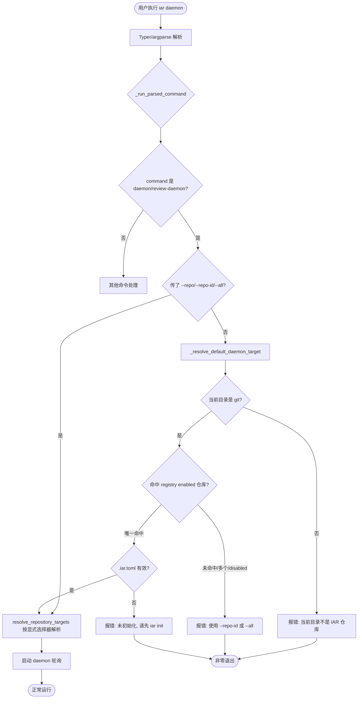

# 修改 `iar daemon` 默认行为：未指定 `--all` 时仅处理当前已初始化仓库

## 1. Introduction & Goals

### Problem Statement

当前 `iar daemon` 与 `iar review-daemon` 在未指定 `--repo`、`--repo-id` 或 `--all` 时，会先尝试把当前工作目录匹配到 registry 中的仓库；若匹配失败，则自动 fallback 到处理 `config.toml` 中所有 enabled registry entries（见 `src/backend/api/cli.py` 中 `_resolve_default_daemon_target` 与 `_run_parsed_command` 的 daemon 分支）。这导致用户在任何目录（包括未初始化的目录）执行 `iar daemon` 都可能意外启动对所有项目的轮询，带来以下问题：

- **意图不明**：用户可能只想在当前仓库启动 daemon，却 unknowingly 对所有注册仓库生效。
- **误操作风险**：在错误目录执行后，会立刻创建/影响其他项目的 worktree、标签、评论等。
- **与文档矛盾**：`docs/guides/agent-runner.md` 表格称默认只处理当前仓库，但正文又写默认监控所有 enabled entries，实际行为与文档不一致。

### Proposed Solution Summary

推荐采用**最小改动路径**：复用现有的 `_resolve_default_daemon_target()` 与 `require_iar_repository_initialized()`，把 daemon/review-daemon 的默认解析规则改为：

- 未指定 `--repo` / `--repo-id` / `--all` 时，要求当前目录所在的 Git 仓库同时满足：
  1. 是 registry 中唯一命中的 enabled 仓库；
  2. 包含有效的 `.iar.toml`（已调用 `iar init`）。
- 任一条件不满足即报错退出，不再自动 fallback 到 `--all`。
- 显式 `--all` 保持原有行为，循环所有 enabled registry entries。

该改动只调整 CLI 入口的目标解析逻辑，不新增存储、服务或抽象层，也不改变 daemon 内部的轮询、worktree、review 等业务流程。

### Measurable Objectives

- `iar daemon` 在未指定 `--all` 且当前目录未初始化（无 `.iar.toml`）时，以非零退出码退出并给出清晰错误。
- `iar daemon` 在未指定 `--all` 且当前目录不是注册仓库时，以非零退出码退出并给出清晰错误。
- `iar daemon` 在已初始化且唯一命中的注册仓库根目录下，仍只处理该仓库。
- `iar daemon --all` 继续处理所有 enabled registry entries。
- 文档对默认行为的描述与代码一致，无矛盾。
- 相关 CLI 单元测试更新，验证新的错误路径与成功路径。

### Realistic Validation

除单元测试和集成测试外，本 PRD 要求通过**真实项目入口点**验证关键行为，确保真实使用路径生效，而非仅在隔离 fixture 中通过。

- [ ] **默认只处理当前仓库**：在已 `iar init` 的 keda 仓库根执行 `uv run iar daemon --interval 300 --dry-run`（dry-run 不执行副作用），确认日志/输出仅出现当前仓库。
- [ ] **未初始化目录报错退出**：在 `/tmp` 或任意非 git 目录执行 `uv run iar daemon --interval 300`，确认命令以非零退出码退出并提示缺少初始化仓库。
- [ ] **未注册但已 init 的仓库报错退出**：在一个已 `iar init` 但不在 `config.toml` registry 中的临时仓库执行 `uv run iar daemon --interval 300`，确认命令以非零退出码退出并提示当前目录不是 enabled registry target。
- [ ] **显式 `--all` 仍循环所有项目**：在任意目录执行 `uv run iar daemon --all --interval 300 --dry-run`，确认对所有 enabled registry entries 产生轮询日志/输出。

**为什么单元测试不够**：单元测试只能验证 `resolve_default_daemon_target()` 或 `_run_parsed_command()` 的返回值/退出码，无法证明真实的 `uv run iar daemon` 入口在完整配置加载、typer/argparse 解析、日志输出链路中的端到端行为。真实入口验证能发现文档与 CLI help 不一致、参数传递错位、工作目录解析差异等问题。

### Delivery Dependencies

- Group: iar-cli-behavior
- Depends on groups:
  - none
- Depends on tasks/issues:
  - none
- Gate type: none
- Notes: 本改动独立，可与当前 pending 的 CLI/registry 相关 PRD 并行交付，但建议合并前统一跑 `just test` 避免回归。

## 2. Requirement Shape

- **Actor**: IAR CLI 用户（开发者/自动化脚本）。
- **Trigger**: 用户执行 `iar daemon` 或 `iar review-daemon` 且未提供 `--repo`、`--repo-id` 或 `--all`。
- **Expected behavior**:
  1. CLI 首先解析当前工作目录所在的 Git root。
  2. 若当前目录不是 Git 仓库，报错退出。
  3. 若 Git root 未匹配到 registry 中 enabled 的仓库条目，报错退出。
  4. 若 Git root 匹配到多个 enabled 仓库条目，报错退出（保持现有行为）。
  5. 若唯一匹配成功但仓库未初始化（缺少有效 `.iar.toml`），报错退出。
  6. 只有唯一匹配且已初始化时，才以该仓库为目标启动 daemon。
- **Explicit scope boundary**:
  - 仅修改 `daemon` 与 `review-daemon` 命令的默认目标解析。
  - 不修改 `iar run`、`iar review`、`iar issue create` 等单仓库命令的行为。
  - 不修改 `iar registry start/stop` 的 registry 托管进程行为。
  - 不新增配置文件字段或持久化状态。

## 3. Repository Context And Architecture Fit

### Current Relevant Modules

- `src/backend/api/cli.py`
  - `_resolve_default_daemon_target()`：当前推断 daemon 目标的核心函数。
  - `_run_parsed_command()`：在 `parsed.command in ("daemon", "review-daemon")` 分支中，无参数时调用 `_resolve_default_daemon_target()` 并 fallback 到 `parsed.all_repositories = True`。
- `src/backend/engines/agent_runner/factory.py`
  - `find_repository_match_for_path()`：把本地路径匹配到 registry entries，返回 unique/enabled/disabled/ambiguous/no-match 结构。
  - `resolve_repository_targets()`：根据 `repo_id`、`repo_path_override`、`all_repositories` 解析目标仓库列表。
- `src/backend/engines/agent_runner/repository_local.py`
  - `require_iar_repository_initialized()`：检查 Git root 下是否存在有效 `.iar.toml`。
  - `IARRepositoryNotInitializedError`：未初始化异常。
- `src/backend/api/cli_typer.py`
  - Typer 命令定义，需确保 `daemon_command` / `review_daemon_command` 的 `all_repositories` 参数签名与 help 文本与 argparse 后端一致。
- `src/backend/api/cli_parser.py`
  - argparse 命令定义，包含 `--all` 选项。
- `docs/guides/agent-runner.md`
  - 目标解析规则表格与正文描述需要同步修正。
- `tests/test_agent_runner_cli.py`
  - 现有 CLI 测试，需要新增/更新 daemon 默认行为测试。

### Existing Architecture Pattern

- CLI 入口遵循 argparse 后端 + Typer 前端的模式，Typer 仅负责解析并转发到 `_run_parsed_command()`。
- 仓库解析统一由 `backend/engines/agent_runner/factory.py` 完成，CLI 层不直接读 `config.toml`。
- 本地初始化检查由 `repository_local.py` 提供，CLI 中已有 `_handle_not_initialized_error()` 统一处理错误输出。
- 依赖方向：`api/` 可调用 `engines/` 与 `core/`，`engines/` 可调用 `core/` 与 `infrastructure/`，不反向依赖。

### Ownership And Dependency Boundaries

- CLI 行为属于 `backend/api/`。
- 仓库匹配属于 `backend/engines/agent_runner/`。
- 不引入新的跨层依赖，仅把已有的 `require_iar_repository_initialized` 引入 `cli.py`（`api` 已依赖 `engines`，符合架构）。

### Constraints From Runtime, Docs, Tests, Workflows

- `just test` 必须继续通过。
- `just lint` 必须继续通过，且单文件非空行不超过 1000 行。
- Python 文本 I/O 必须显式 `encoding="utf-8"`（本次改动如不涉及文件读写则不影响）。
- 文档与代码必须一致，`docs/guides/agent-runner.md` 表格和正文都要更新。

### Matching Or Related PRDs

- `tasks/pending/P2-FEAT-20260623-102437-iar-loop-scheduled-recurring-tasks.md`：涉及 daemon 循环逻辑，但与目标解析无关，可独立交付。
- `tasks/archive/20260521-104408-prd-multi-repository-agent-runner.md`：历史上引入多仓库 daemon 行为，当前改动是对其默认入口的收紧。
- 未找到与本 PRD 直接重复或阻塞的 pending PRD。

## 4. Recommendation

### Recommended Approach

在 `src/backend/api/cli.py` 中：

1. 把 `require_iar_repository_initialized` 从 `backend.engines.agent_runner.repository_local` 导入。
2. 修改 `_resolve_default_daemon_target()`：
   - 当 cwd 命中唯一 enabled registry 仓库时，额外调用 `require_iar_repository_initialized()` 检查 `.iar.toml`。
   - 若未初始化，返回错误信息。
   - 其他情况（非 git、未注册、disabled、ambiguous）保持现有返回结构，但把 "fallback to --all" 的语义从 "无错误" 改为 "返回错误"。
3. 修改 `_run_parsed_command()` 中 daemon/review-daemon 分支：
   - 无参数时调用 `_resolve_default_daemon_target()`。
   - 若有错误 → `logger.error` + return 1。
   - 若返回 `repo_id` → 赋值给 `repo_id`。
   - 删除原来的 `parsed.all_repositories = True` fallback 路径。
4. 同步更新 `src/backend/api/cli_typer.py` 与 `src/backend/api/cli_parser.py` 的 help 文本（如有必要），确保 `--all` 描述清晰。
5. 更新 `docs/guides/agent-runner.md` 的目标解析表格与正文，统一描述为：
   - `iar daemon` / `iar review-daemon`：默认只处理当前目录所在的已初始化注册仓库；未命中或未初始化时报错。
   - `iar daemon --all`：显式处理所有 enabled registry entries。
6. 更新/新增测试覆盖：
   - 当前仓库已 init 且唯一命中 → 成功并只处理该仓库。
   - 当前仓库未 init → 报错退出。
   - 当前目录不是 git → 报错退出。
   - 当前仓库不在 registry → 报错退出。
   - `--all` 仍循环所有 enabled entries。

### Why This Is The Best Fit

- 改动范围最小：只调整入口解析，不碰 daemon 内部逻辑。
- 复用现有工具：`find_repository_match_for_path`、`require_iar_repository_initialized`、`_handle_not_initialized_error` 都已存在。
- 符合 CLI 用户心智：其他单仓库命令（`iar run`）默认就是当前仓库，daemon 也应一致。
- 消除文档与代码的矛盾，降低误操作风险。

### Alternatives Considered

- **A. 保留 fallback，但增加确认提示**：在不初始化目录执行时问用户是否继续。这引入了交互复杂性，且对 nohup/脚本场景不友好。
- **B. 新增 `--current` 显式选项**：要求用户用 `--current` 表示只处理当前仓库。这增加了 API 表面积，且与现有单仓库命令默认当前目录的约定冲突。
- **C. 在 `resolve_repository_targets()` 中统一修改默认行为**：这会影响 `iar run` 等其他命令，超出范围。

推荐方案优于以上三种，因为它最小、最一致、无新增抽象。

## 5. Implementation Guide

> This section is a living implementation guide based on current repository analysis. If implementation discovers additional affected files, hidden dependencies, edge cases, or a better path, update this PRD before proceeding.

### Core Logic

当前控制流：

```text
用户输入 iar daemon
  └── Typer/argparse 解析
        └── _run_parsed_command()
              └── 若 command in (daemon, review-daemon) 且无 repo 选择器
                    └── _resolve_default_daemon_target()
                          ├── cwd 命中唯一 enabled repo → repo_id = xxx
                          ├── cwd 命中 disabled repo → error
                          ├── cwd 命中多个 enabled repo → error
                          └── 未命中 → 返回空（原代码 fallback 到 --all）
                    └── 原代码：error 则退出；有 repo_id 则处理该仓；否则 all_repositories=True
              └── resolve_repository_targets(...)
                    └── 启动 daemon
```

目标控制流：

```text
用户输入 iar daemon
  └── Typer/argparse 解析
        └── _run_parsed_command()
              └── 若 command in (daemon, review-daemon) 且无 repo 选择器
                    └── _resolve_default_daemon_target()
                          ├── cwd 命中唯一 enabled repo 且 .iar.toml 有效 → repo_id = xxx
                          ├── cwd 命中唯一 enabled repo 但 .iar.toml 无效 → error
                          ├── cwd 命中 disabled repo → error
                          ├── cwd 命中多个 enabled repo → error
                          └── 未命中或不是 git 目录 → error
                    └── error 则退出；有 repo_id 则处理该仓
              └── 显式 --all 时 resolve_repository_targets(all_repositories=True)
                    └── 启动 daemon
```

### Change Impact Tree

```text
.
├── API
│   └── src/backend/api/cli.py
│       [修改]
│       【总结】收紧 daemon/review-daemon 默认目标解析，要求当前仓库既在 registry enabled 中又已初始化，不再 fallback 到 --all。
│       ├── 导入 require_iar_repository_initialized
│       ├── _resolve_default_daemon_target() 增加 .iar.toml 检查，并把 no-match 返回改为 error
│       └── _run_parsed_command() daemon 分支删除 fallback 到 all_repositories 的逻辑
│
│   └── src/backend/api/cli_typer.py
│       [修改]
│       【总结】更新 daemon / review-daemon 的 help 文本，明确默认只处理当前已初始化仓库，--all 显式循环所有。
│       └── daemon_command / review_daemon_command 的 docstring 与 option help（如有需要）
│
│   └── src/backend/api/cli_parser.py
│       [修改]
│       【总结】同步 argparse help 文本，确保与 typer 前端一致。
│       └── daemon_parser / review_daemon_parser 的 help 字符串
│
├── Domain
│   └── src/backend/engines/agent_runner/factory.py
│       [不修改]
│       【总结】find_repository_match_for_path 与 resolve_repository_targets 无需改动，仅被 CLI 调用方式变化。
│
│   └── src/backend/engines/agent_runner/repository_local.py
│       [不修改]
│       【总结】require_iar_repository_initialized 被复用，逻辑不变。
│
├── Tests
│   └── tests/test_agent_runner_cli.py
│       [修改]
│       【总结】新增/更新 daemon 默认行为测试用例，覆盖未初始化、未注册、非 git、ambiguous、--all 等路径。
│       ├── 测试：已 init 且唯一命中 → 只处理当前仓库
│       ├── 测试：未 init → 非零退出 + 错误信息
│       ├── 测试：非 git 目录 → 非零退出 + 错误信息
│       ├── 测试：未注册仓库 → 非零退出 + 错误信息
│       └── 测试：--all → 处理所有 enabled entries
│
├── Docs
│   └── docs/guides/agent-runner.md
│       [修改]
│       【总结】统一目标解析表格与正文描述，消除“默认所有项目”的矛盾说法。
│       ├── 表格中 daemon/review-daemon 行改为“当前已初始化注册仓库；未命中或未初始化时报错”
│       ├── 表格中新增 `iar daemon --all` 行
│       └── 正文 :620 附近同步更新
```

### Executor Drift Guard

- 搜索所有 `daemon` 目标解析相关引用：
  ```bash
  rg -n "_resolve_default_daemon_target|all_repositories = True|fallback to --all" src/backend/api/
  ```
- 搜索文档中所有 daemon 默认行为描述：
  ```bash
  rg -n "daemon.*default|default.*daemon|监控所有|处理所有|enabled registry entries" docs/guides/agent-runner.md
  ```
- 搜索测试中对 `iar daemon` 无参数调用的 mock：
  ```bash
  rg -n "daemon" tests/test_agent_runner_cli.py tests/test_cli_registry.py
  ```
- 如果实现时发现 `_resolve_default_daemon_target()` 被其他命令复用，需要评估是否把改动限制在 daemon 专用路径中。

### Flow / Architecture Diagram



### Realistic Validation Plan

| Behavior | Real Entry Point | Test Layer | Mock Boundary | Data/Env Needed | Command Or Procedure | Required For Acceptance |
|---|---|---|---|---|---|---|
| 默认只处理当前已初始化仓库 | `uv run iar daemon --interval 300` | 真实 CLI（dry-run 或短 interval） | GitHub API 可被 dry-run 跳过 | 已 `iar init` 的 keda 仓库，且在 `config.toml` 中 enabled | 在 keda 仓库根执行：`uv run iar daemon --interval 300 --dry-run`（若 `--dry-run` 不兼容 daemon，则使用短 interval 并立即 Ctrl+C，观察日志/输出只出现当前 repo_id） | Yes |
| 未初始化目录报错 | `uv run iar daemon --interval 300` | 真实 CLI | 无需外部依赖 | `/tmp` 或新建空目录 | `cd /tmp && uv run iar daemon --interval 300` | Yes |
| 未注册但已 init 仓库报错 | `uv run iar daemon --interval 300` | 真实 CLI | 无需外部依赖 | 临时 git 仓库，已 `iar init`，但不在 registry | `cd /tmp/tmp-repo && uv run iar daemon --interval 300` | Yes |
| `--all` 仍循环所有 enabled | `uv run iar daemon --all --interval 300` | 真实 CLI（dry-run） | GitHub API 可被 dry-run 跳过 | config.toml 中存在多个 enabled entries | `uv run iar daemon --all --interval 300 --dry-run` | Yes |
| 文档与代码一致 | `docs/guides/agent-runner.md` | 文档 review | 无 | 无 | 检查表格与正文中 daemon/review-daemon 描述是否统一 | Yes |
| 回归检查 | `just test` | 自动化测试 | 按现有测试 mock 边界 | 本地 Python 环境 | `just test` | Yes |

**Failure triage for real CLI validation:**
- 若 `--dry-run` 不被 daemon 支持，可改用 `--interval 300` 并观察启动日志后立即终止；日志中应出现目标 repo_id 列表。
- 若 `/tmp` 被 registry 意外匹配（例如 registry 中有 `/tmp` 路径条目），请改用其他目录或临时禁用该条目。
- 若 `uv run iar daemon` 提示找不到命令，确认当前在 keda 项目根执行，或改用 `uv run --project /path/to/keda iar daemon`。

### Low-Fidelity Prototype

不需要。本改动为 CLI 行为变更，Mermaid 流程图已足够表达。

### ER Diagram

No data model changes in this PRD.

### Interactive Prototype Change Log

No interactive prototype file changes in this PRD.

### External Validation

No external validation required; repository evidence was sufficient.

## 6. Definition Of Done

- [ ] `src/backend/api/cli.py` 中 `_resolve_default_daemon_target()` 与 `_run_parsed_command()` 的 daemon 分支已按推荐方案修改。
- [ ] `src/backend/api/cli_typer.py` 与 `src/backend/api/cli_parser.py` 的 help 文本已同步。
- [ ] `docs/guides/agent-runner.md` 中 daemon/review-daemon 目标解析描述已统一。
- [ ] `tests/test_agent_runner_cli.py` 已新增/更新相关测试用例，且 `just test` 全部通过。
- [ ] `just lint` 通过，无新增超过 1000 行非空行的文件。
- [ ] 真实 CLI 验证条目（见 Realistic Validation Plan）至少完成 3 项并记录结果。

## 7. Acceptance Checklist

### Architecture Acceptance

- [x] 改动仅发生在 `src/backend/api/cli.py` 的 CLI 入口层，未侵入 `core/use_cases/run_agent_daemon.py` 或 `review_daemon.py`。
- [x] 未新增跨层依赖；`require_iar_repository_initialized` 来自 `engines/agent_runner/repository_local.py`，符合现有依赖方向。
- [x] 未新增配置文件、持久化状态或后台服务。

### Behavior Acceptance

- [x] `iar daemon` 在未指定 `--all` 且当前目录不是 Git 仓库时，以非零退出码退出并输出清晰错误。
- [x] `iar daemon` 在未指定 `--all` 且当前目录未匹配到 registry enabled 仓库时，以非零退出码退出并输出清晰错误。
- [x] `iar daemon` 在未指定 `--all` 且当前仓库未初始化（无有效 `.iar.toml`）时，以非零退出码退出并输出清晰错误。
- [x] `iar daemon` 在未指定 `--all` 且当前仓库已 init、唯一命中 enabled 时，只处理该仓库。
- [x] `iar review-daemon` 与 `iar daemon` 行为一致。
- [x] `iar daemon --all` 继续处理所有 enabled registry entries，行为不变。
- [x] `iar daemon --repo-id <id>` 与 `iar daemon --repo <path>` 继续按显式选择器工作，行为不变。

### Documentation Acceptance

- [x] `docs/guides/agent-runner.md` 中目标解析表格已更新，`iar daemon` / `iar review-daemon` 行描述为“当前已初始化注册仓库；否则报错”。
- [x] `docs/guides/agent-runner.md` 中新增或保留 `iar daemon --all` 行，描述为“显式处理所有 enabled registry entries”。
- [x] 文档正文中不再出现“默认监控所有 enabled registry entries”等与代码矛盾的说法。

### Validation Acceptance

- [x] `just test` 通过，且新增/更新的测试用例覆盖了未初始化、未注册、非 git、ambiguous、`--all` 等路径。
- [ ] 真实 CLI 验证：在已 init 的 keda 仓库根执行 `iar daemon`，确认只处理当前仓库。
- [ ] 真实 CLI 验证：在 `/tmp` 或任意非 git 目录执行 `iar daemon`，确认报错退出。
- [ ] 真实 CLI 验证：执行 `iar daemon --all --dry-run`（或等效命令），确认对所有 enabled entries 生效。

## 8. Functional Requirements

- **FR-1**: 当用户执行 `iar daemon` 或 `iar review-daemon` 且未指定 `--repo`、`--repo-id`、`--all` 时，CLI 必须要求当前工作目录所在的 Git 仓库是 registry 中唯一命中的 enabled 仓库。
- **FR-2**: 当 FR-1 中的仓库唯一命中但缺少有效 `.iar.toml` 时，CLI 必须以非零退出码退出，并提示用户先运行 `iar init`。
- **FR-3**: 当 FR-1 中的当前目录不是 Git 仓库、未命中 registry、命中 disabled 仓库或命中多个 enabled 仓库时，CLI 必须以非零退出码退出，并给出明确错误信息。
- **FR-4**: 当用户显式指定 `--all` 时，`iar daemon` / `iar review-daemon` 必须继续处理 `config.toml` 中所有 enabled registry entries，行为与改动前一致。
- **FR-5**: 当用户显式指定 `--repo-id` 或 `--repo` 时，行为与改动前一致，不受默认规则影响。
- **FR-6**: 文档中关于 `iar daemon` / `iar review-daemon` 默认行为的描述必须与代码行为一致。

## 9. Non-Goals

- 不修改 `iar run`、`iar review`、`iar issue create` 等单仓库命令的默认行为。
- 不修改 `iar registry start/stop/reinit` 的托管进程行为。
- 不新增 `--current` 等新的 CLI 选项。
- 不新增交互式确认提示。
- 不修改 daemon 内部的轮询间隔、worktree 策略、review 策略。
- 不修改 config.toml 或 `.iar.toml` 的 schema。

## 10. Risks And Follow-Ups

- **Breaking change 风险**：现有依赖 `nohup iar daemon` 这种无参数全局启动方式的脚本或用户习惯会失效。需要在 PR 描述中明确标注迁移路径：改用 `iar daemon --all`。
- **文档不一致风险**：`docs/guides/agent-runner.md` 中存在多处 daemon 描述，若遗漏会导致用户困惑。实现后需全局搜索文档中相关段落。
- **测试 fixture 风险**：现有测试中可能有无参数调用 `iar daemon` 并期望处理所有仓库的 fixture，需要同步更新。

## 11. Decision Log

| ID | Decision | Chosen | Rejected | Rationale |
|---|---|---|---|---|
| D-01 | 默认行为变更范围 | 仅修改 daemon/review-daemon 无参数时的目标解析，删除 fallback 到 `--all` | 在 `resolve_repository_targets()` 中统一收紧所有命令的默认行为 | 后者会影响 `iar run` 等已有单仓库命令，超出本次需求范围，风险更高。 |
| D-02 | 未初始化检查方式 | 复用 `require_iar_repository_initialized()` | 自己实现 `.iar.toml` 存在性检查 | 复用现有工具可避免重复逻辑，且能自动覆盖 TOML 解析、`[agent_runner]` 段、repository.id 等规则。 |
| D-03 | 是否新增 `--current` 选项 | 不新增 | 新增 `--current` 显式选择当前仓库 | 增加 API 表面积，且与现有单仓库命令默认当前目录的约定冲突，属于过度设计。 |
| D-04 | 是否保留交互式确认 fallback | 不保留 | 在未初始化目录执行时询问用户是否继续 | 交互式提示对 nohup/脚本/CI 场景不友好，且无法明确表达用户意图。 |
| D-05 | `--all` 行为 | 保持不变 | 也要求 `--all` 必须在已初始化目录执行 | `--all` 的语义就是显式全局，不应再受当前目录限制，否则破坏显式选择器的预期。 |

## 12. 关键问题回答

### 12.1 为什么要这么改？

当前 `iar daemon` 的默认行为存在**意图模糊**和**误操作风险**：

1. **默认行为不符合 CLI 一致性**：`iar run`、`iar review`、`iar issue create` 等命令在没有显式选择器时默认只处理当前 Git 仓库；但 `iar daemon` 在匹配失败时会自动 fallback 到处理所有 enabled registry entries，这种不一致会让用户产生错误预期。
2. **误触成本高**：daemon 会主动创建 worktree、打标签、写评论、推送分支、创建 PR。如果用户在错误目录（例如 `/tmp` 或刚 clone 但未 init 的目录）执行 `iar daemon`，会立即对所有注册项目产生副作用。
3. **文档自相矛盾**：`docs/guides/agent-runner.md` 表格写默认只处理当前仓库，正文又写默认监控所有 enabled entries，实际代码行为是条件 fallback，文档可信度受损。
4. **用户已明确表达意图**：用户自己遇到 `iar daemon --all` 与 cwd 推断冲突的报错，说明当前解析规则在显式选择器和默认推断之间的优先级令人困惑。

### 12.2 这么改的意义和价值大吗？

价值较大，但属于**体验和安全加固**，不是新功能：

- **明确意图**：无参数 = "我只想在这个仓库跑"，`--all` = "我要全局跑"，语义清晰。
- **降低误操作风险**：避免在错误目录启动全局 daemon，减少对其他项目的意外修改。
- **消除文档矛盾**：让文档和代码一致，降低新用户学习成本。
- **符合最小惊讶原则**：与 `iar run` 等其他命令的默认行为对齐。
- **对自动化脚本友好**：脚本如果需要全局行为，显式用 `--all`；如果漏写参数，会立刻失败而不是静默影响多个项目。

### 12.3 是否过度设计？

**不是过度设计**。理由：

- 不新增抽象层、服务、配置项或持久化状态。
- 只复用两个已有工具：`find_repository_match_for_path` 和 `require_iar_repository_initialized`。
- 改动集中在单个函数 `_resolve_default_daemon_target()` 和 `_run_parsed_command()` 的一个分支。
- 没有新增 CLI 选项或交互式提示，API 表面积反而更干净。

如果采用“新增 `--current` 选项”或“增加交互式确认”才算过度设计；本次推荐方案是最小改动。

### 12.4 ROI 如何？

| 维度 | 评估 |
|---|---|
| **实现成本** | 低。约 1-2 小时编码 + 测试 + 文档同步。 |
| **风险** | 中低。主要风险是 breaking change 影响依赖无参数全局启动的用户，但迁移路径简单（加 `--all`）。 |
| **收益** | 中高。消除误操作风险、文档矛盾，提升 CLI 一致性。 |
| **维护成本** | 几乎为零。不新增模块或配置，后续行为更稳定。 |

**结论**：ROI 为正，值得做。这是一个低成本的体验/安全加固，收益明显大于风险。
