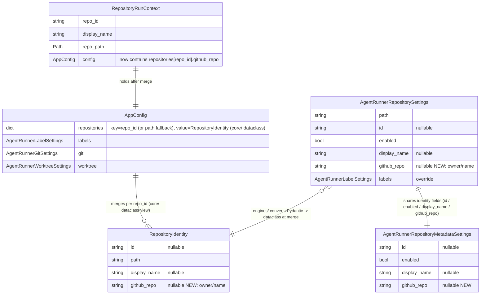

# PRD: iar 仓库标识到 GitHub owner/repo 的解析

- GitHub Issue: TBD

## 1. Introduction & Goals

`iar issue list` 在不传 `--repo-id`、`--repo`、`--all-registered` 时会回退到 git 仓库目录名作为 `repo_id`；当用户传 `--all-registered` 或 `--repo-id keda-main` 时则用 registry 中的 key 名作为 `repo_id`。这两条路径最终都把字符串原样塞给 `gh pr list --repo <repo_id>`，而 `gh` CLI 要求 `[HOST/]OWNER/REPO` 格式，触发 `expected the "[HOST/]OWNER/REPO" format, got "keda"` 报错。所有走 `_repo_label_for` 的命令（issue list 当前唯一，但合并这条 PRD 后任何未来 use case 都复用）都被波及。

### Proposed Solution Summary

在 iar 的两个配置 schema（registry 级 `AgentRunnerRepositorySettings` 与 repo-local 级 `AgentRunnerRepositoryMetadataSettings`）里同时新增一个**显式可选字段 `github_repo: str | None`**，存真正的 GitHub `owner/repo`（如 `zata-zhangtao/keda`）。由用户写 config 时声明，iar 不做运行时 `git remote` 解析或推断。`merge_repository_config` 在合并仓库级覆盖时**也**把这个仓库的 Pydantic `AgentRunnerRepositorySettings` 转换成一个 `core/` 层 dataclass `RepositoryIdentity`（定义于 `src/backend/core/shared/models/agent_runner.py`，含 `id` / `path` / `display_name` / `github_repo` 四个字段），合并进 `AppConfig.repositories[repo_id]`，让 `RepositoryRunContext.config.repositories[context.repo_id].github_repo` 成为 `_repo_label_for` 的唯一可信来源。`_repo_label_for` 改造为：先看 `context.config.repositories[context.repo_id].github_repo`，格式合法就用，否则回退为 `None`（issue list 收到 `None` 后跳过 PR 列，并在 stderr 一次性打印警告指明哪个仓库未配置）。`list_pull_requests_for_issue` 入参语义保持「`owner/repo`」，由 `_repo_label_for` 提前保证。最低复杂度方案，复用现有的 `merge_repository_config` merge 管线，不引入新抽象（`RepositoryIdentity` 是简单的 frozen dataclass，零业务逻辑）、不改存储、不改 `gh` 调用形态、不动 daemon 进程归属语义。

### Measurable Objectives

- `iar issue list`（无任何 repo 选择器）不再因 `expected the "[HOST/]OWNER/REPO" format` 报错；只要配置了 `github_repo`，PR 列正确填充。
- `iar issue list --all-registered` 命中多个注册仓时，每个仓的 PR 列都正确连接到自己的 `owner/repo`。
- 任何仓库未配置 `github_repo` 时，`issue list` 不崩溃、退出码为 0，PR 列为空，stderr 给出明确指引。
- `gh pr list --repo <X>` 在 iar 全代码路径下接收到的 `<X>` 永远包含至少一个 `/`（registry 单仓模式与 ad-hoc 单仓模式都覆盖）。
- 现有 `merge_repository_config` 行为不回归：所有其他 sub-config（labels / git / worktree / runner / safety / validation / prompts / pre_pr_review / post_pr_supervisor / generated_content / interactive_decision / deliberation）合并结果与改动前一致。

### Realistic Validation

除单元测试外，本 PRD 要求通过**真实项目入口点**验证关键行为，确保真实使用路径生效，而非仅在隔离 fixture 中通过。

- [ ] **无选择器 ad-hoc 路径真实验证**：在 `/Users/zata/code/keda`（已注册 `keda-main`，无 `--repo-id`）下跑 `iar issue list`，验证返回 `RepositoryRunContext.github_repo` 已被 `merge_repository_config` 注入，且 PR 列非空。
- [ ] **`--all-registered` 多仓路径真实验证**：跑 `iar issue list --all-registered`，验证多仓（keda-main、freshai、fsense）每行 PR 列各自连接正确 owner/repo。
- [ ] **缺失降级真实验证**：临时把 `keda-main` 的 `github_repo` 注释掉，跑 `iar issue list`，验证 PR 列空、stderr 含未配置警告、退出码 0。
- [ ] **格式校验真实验证**：把 `github_repo` 写成 `not-a-slash`，验证配置加载阶段报错指向具体行/字段名，而不是跑到 `gh` 才崩。

**为什么单元测试不够**：`merge_repository_config` 的输入是构造好的 `AppConfig` 与 `AgentRunnerRepositorySettings`，单测只能证 merge 后的 dict 内容正确；真实路径还需证 CLI 入口经过 `_resolve_repository_targets` → `_repo_label_for` → `gh pr list` 的整条调用链在没有手写 mock 时也能拿到正确 owner/repo 并被 gh 接受。

### Delivery Dependencies

- Group: none
- Depends on groups:
  - none
- Depends on tasks/issues:
  - none
- Gate type: none
- Notes: 本 PRD 不依赖任何现有 pending PRD；它本身也不应阻塞其他 PRD（独立可交付）。仓库内无相关 in-flight 任务。

## 2. Requirement Shape

- **Actor**: iar 用户（开发者 / 维护者），通过 `config.toml` / `.iar.toml` 显式登记 GitHub owner/repo
- **Trigger**: 用户执行任何依赖 `_repo_label_for` 的 iar 命令（当前仅 `iar issue list`，未来 use case 自动复用）
- **Expected Behavior**:
  - 配置了 `github_repo` 的仓库 → PR 列正确连接到 GitHub
  - 未配置 `github_repo` 的仓库 → PR 列为空 + stderr 一次性警告，不报错退出
  - `github_repo` 格式非法（不含 `/`、owner 空、name 空）→ config 加载阶段报错，定位到具体字段
- **Scope Boundary**:
  - 不改 `gh` CLI 调用形态
  - 不引入运行时 `git remote get-url` 推断（用户明确拒绝）
  - 不改 daemon / review-daemon 进程的 registry `repo_id` 归属语义（registry key 仍然是 iar 内部 ID）
  - 不改 `AppConfig` 已有的 sub-config（labels / git / worktree 等）合并语义

## 3. Repository Context And Architecture Fit

### Current relevant modules / files

- `src/backend/infrastructure/config/settings.py:624-727` — `AgentRunnerRepositoryMetadataSettings`（repo-local 元数据）与 `AgentRunnerRepositorySettings`（registry 级，含 path / id / display_name 与所有 override 共享字段），以及 `load_agent_runner_local_settings` 把 `.iar.toml` 元数据合并成 `AgentRunnerRepositorySettings` 的组装逻辑。
- `src/backend/engines/agent_runner/factory.py:503-552` — `merge_repository_config` 把仓库级 `AgentRunnerRepositorySettings` 的 sub-config（labels / git / ...）合并进全局 `AppConfig`；目前完全丢弃仓库的身份元数据（path / id / display_name / github_repo）。
- `src/backend/engines/agent_runner/factory.py:634-727` — `resolve_repository_targets` 三条入口：ad-hoc 单仓（`fallback_repo_id="ad-hoc"`）、`--repo-id` 显式、`--all` 全注册仓扫描、回退到 cwd 目录名（`fallback_repo_id=repo_root_path.name`）。
- `src/backend/engines/agent_runner/factory.py:829-869` — `_build_repository_context_from_settings` 与 `_build_merged_repository_context` 构造 `RepositoryRunContext`（仅含 `repo_id` / `display_name` / `repo_path` / `config`，不含 `github_repo`）。
- `src/backend/core/shared/models/agent_runner.py:407-413` — `RepositoryRunContext` 当前 dataclass 形状。
- `src/backend/core/use_cases/issue_pr_status.py:205-219` — `_repo_label_for` 把 context 翻译为 `gh` 用的字符串（当前实现错的——直接把 repo_id 当 owner/repo 用）。
- `src/backend/core/use_cases/issue_pr_status.py:233-254` — `_build_issue_with_pulls` 用 repo_label 调 `list_pull_requests_for_issue`。
- `src/backend/infrastructure/github_client.py:1018-1050` — `list_pull_requests_for_issue(repo: str, issue_number: int)`，接收 `owner/repo` 直接传给 `gh pr list --repo`。
- `src/backend/engines/agent_runner/takeover.py:186-209` — `parse_selected_repositories`，现有 `owner/repo` 格式校验模式可借鉴（不含 `/` 抛 `ValueError`）。
- `config.toml:489-502` — 现有 registry 注册：`keda-main`、`zata-zhangtao-fsense`、`zata-zhangtao-freshai`（共 3 条 enabled 仓；另有 `transmaster` 处于 disabled 状态不需要 `github_repo`），需要补 `github_repo` 字段。
- `docs/guides/agent-runner.md` — registry / local 配置章节需要同步。
- `tests/test_agent_runner_config.py:105-321` — 既有 settings 单测可参照。
- `tests/test_issue_list.py` — issue list 既有单测。

### Existing architecture pattern to follow

- 仓库身份元数据与 override sub-config 共享 `_AgentRunnerRepositoryOverrideSettings` 这条「共享字段基类」的设计。新增 `github_repo` 应当作为 `AgentRunnerRepositoryMetadataSettings` 与 `AgentRunnerRepositorySettings` **两处都加**（registry 与 repo-local 双来源，已是既有惯例：id / enabled / display_name 都是这样）。
- merge 阶段走 `merge_repository_config`，与现有 sub-config 完全平行：把它当作一个新的 sub-config 字段，但因其是仓库身份（不是「覆盖」），merge 阶段把仓库的 Pydantic `AgentRunnerRepositorySettings` 转换（剥掉 sub-config，留下 id / path / display_name / github_repo）为 `core/` 层 `RepositoryIdentity` dataclass 后，合入 `AppConfig.repositories[repo_id]`。这是**唯一一个**与既有模式不同的设计点（必须经一次 Pydantic→dataclass 转换以避免 `core/` 反向依赖 `infrastructure/`），必须在实现时区分。
- 配置校验抛 `ValueError` 时，错误信息要带字段路径（参照 `load_agent_runner_local_settings` 既有的「Invalid IAR local config at {path}: {exc}」格式）。

### Ownership and dependency boundaries

- `core/` 层只读 schema 与 context，不感知 Pydantic；新增的 `github_repo` 字段对 core 是「`context.config.repositories[repo_id]`（值是 `core/` 层 `RepositoryIdentity` dataclass）上的可选字符串」，无需新增抽象，**且避免 `core/` 反向依赖 `infrastructure/` 的 Pydantic 类型**。
- `engines/agent_runner/factory.py` 负责 merge；新增 `github_repo` 在 merge 时由 `engines` 把 Pydantic `AgentRunnerRepositorySettings` 转换为 `RepositoryIdentity` dataclass，合入 `AppConfig.repositories[repo_id]`，**不进**顶层（避免污染全局）。
- `infrastructure/config/settings.py` 负责 schema 与加载；新增字段同时落到两个 model，错误信息保持一致。
- `api/` 层不感知；它只读 `RepositoryRunContext`。

### Constraints from runtime, docs, tests, workflows

- 单代码文件 ≤ 1000 行（`just lint` 报警）—— `factory.py` 当前 **1110 行**，**已超出** 1000 行限制（属既有债务，不在本 PRD 范围解决；本 PRD 新增 `RepositoryIdentity` 工厂方法 + `merge_repositories_dict` helper 预计再加约 30-50 行）。**本 PRD 实施约束**：新增逻辑须保持紧凑（避免冗长 docstring / 重复注释），并在 `merge_repository_config` 处考虑将 `repositories` dict 合并逻辑抽到一个独立小函数，避免把长函数继续拉长；如最终 factory.py 行数进一步显著上升，需在 PR 描述中标注并在 follow-up 提一个 factory.py 拆分任务。
- 公共 Python API 使用 Google Style Docstrings（settings.py 已遵守）。
- Python I/O 显式 `encoding="utf-8"`（merge 路径不涉及文件 I/O，仅内存 dict 操作）。
- config 注释（`config.toml` 顶部）风格须保留：用户可见字段需带简短行内注释。
- `just test` 跑完整套件；新增字段需在 `test_agent_runner_config.py` 覆盖。
- 全局安装 iar（`~/.local/share/uv/tools/keda`）通过 editable install 同步源码；改动会即时生效，但仍需 `uv tool install --reinstall keda` 让发布快照带新字段（不在本 PRD 范围内，但 Decision Log 标注）。

### Matching or related PRDs found

- `tasks/pending/P2-FEAT-20260623-110000-iar-daemon-default-current-repo-only.md`（已存在）：改 `iar daemon` / `iar review-daemon` 默认行为为「仅处理当前仓」，删除了回退到 `--all` 的逻辑。**与本 PRD 无关**：它改的是 daemon 命令的仓选择默认行为，不涉及 `_repo_label_for` 链路。
- `tasks/archive/20260521-104408-prd-multi-repository-agent-runner.md`（已归档）：引入 `[agent_runner.repositories.<id>]` 表与 `RepositoryRunContext`。本 PRD 在它之上扩展身份字段，无冲突。
- `tasks/archive/20260520-114108-prd-migrate-issue-agent-runner.md`（已归档）：与 issue list 演进相关，但其内容已沉淀进既有代码；本 PRD 是它缺失的「正确 owner/repo」补全。

未发现重复或阻塞关系，本 PRD 可独立交付。

### Potential redundancy risks

- 若实现同时新增 `context.github_repo` 字段与 `context.config.repositories[...].github_repo`，会造成两处真相；本 PRD 选 B 方案（仅后者），避免冗余。
- 若新增一个 `GitHubIdentity` 子模型包住 owner/name 拆字段，会过度设计；`owner/repo` 字符串是最简形式（与 `gh` CLI / takeover.py `parse_selected_repositories` 的惯例一致）。

## 4. Recommendation

### Recommended Approach

1. **Schema 新增**：在 `AgentRunnerRepositoryMetadataSettings`（repo-local 元数据，line 624，继承 `BaseModel`）添加 `github_repo: str | None = None`；在 `AgentRunnerRepositorySettings`（registry 级，line 649，继承 `_AgentRunnerRepositoryOverrideSettings`）添加同名同位置字段。两者按"身份字段在两个 model 上各写一份"的既有惯例保持一致（id / enabled / display_name 都是这样，**注意**：这些身份字段目前**不**走 `_AgentRunnerRepositoryOverrideSettings`——该基类只承载 sub-config override，不承载身份字段；本 PRD 也不为 `github_repo` 引入新的共享基类，保持与既有惯例完全一致）。
2. **Schema 校验**：在两个字段上加 `field_validator`：`github_repo` 必须满足 `len(owner) > 0 and len(name) > 0 and "/" in value and not value.startswith("/") and not value.endswith("/")`，否则抛 `ValueError("Invalid github_repo {value!r}; expected 'owner/name' format.")`。**注**：本校验规则是 `takeover.py:parse_selected_repositories`（line 186-209）已有规则**的严格度超集**——`parse_selected_repositories` 只检查 `"/" not in full_name`，会接受 `"a/b/c"`（多斜杠）、`"/owner/repo"`（前导斜杠）、`"owner/repo/"`（尾随斜杠）；本 PRD 为配置加载阶段增加更严的约束，run-time `parse_selected_repositories` 暂不修改（与 Decision Log D-06 一致）。
3. **local config 加载透传**：在 `load_agent_runner_local_settings` 末尾的 `AgentRunnerRepositorySettings(...)` 构造里添加 `github_repo=repository_metadata.github_repo`（与现有 `id` / `enabled` / `display_name` 平行的元数据透传）。
4. **merge_repository_config 扩展**：函数签名不变；新增一行 `repositories=merge_repositories_dict(global_config.repositories, repo_settings)`，其中 `merge_repositories_dict` 把传入的 Pydantic `AgentRunnerRepositorySettings` 转换为 `RepositoryIdentity`（用 `RepositoryIdentity.from_pydantic(repo_settings)` 工厂或类似），再以 `{repo_settings.id or repo_settings.path: repository_identity}` 合入 dict。**注意**：`AgentRunnerRepositorySettings.id` 不一定存在（ad-hoc 路径只用 path 作 key），需要稳健选择 key。
5. **`AppConfig` 新增字段**：`src/backend/core/shared/models/agent_runner.py` 新增 `RepositoryIdentity` dataclass（`@dataclass(frozen=True)`，含 `id: str | None`、`path: str`、`display_name: str | None`、`github_repo: str | None`），`AppConfig` 加 `repositories: dict[str, RepositoryIdentity] = field(default_factory=dict)`，与 `AgentRunnerSettings.repositories`（已在第 767 行）语义对齐但**不是同一个**——后者是「配置加载时的注册表」，前者是「merge 后每个 `RepositoryRunContext` 视角下的当前仓库元数据字典」。`RepositoryIdentity` 必须放在 `core/` 层（不能复用 `AgentRunnerRepositorySettings` 这个 `infrastructure/` 的 Pydantic 类型），以保持 `core/` 不依赖 `infrastructure/` 的依赖方向。
6. **`_repo_label_for` 改造**：读 `context.config.repositories.get(context.repo_id)`，取 `.github_repo`；缺失或为 `None` → 返回 `None`；格式非法（理论上 merge 阶段已保证，但仍防御）→ 返回 `None`。**完全删除**当前 `if repo_id and repo_id != "ad-hoc": return str(repo_id)` 这条错的路径。
7. **`_build_issue_with_pulls` 改造**：当 `repo_label is None` 时保留现有「PR 列空」逻辑（issue_pr_status.py:240-241 已存在）；新增：当 `repo_label is None` 时，`_process_one_repo` 入口处用 stderr 一次性打印 `[yellow]WARN: Repository '<repo_id>' has no github_repo configured; PR column will be empty.[/]`，避免每行 issue 都打。
8. **`config.toml` 现有三条登记补字段**：`keda-main` → `github_repo = "zata-zhangtao/keda"`、`zata-zhangtao-freshai` → `github_repo = "zata-zhangtao/freshai"`、`zata-zhangtao-fsense` → `github_repo = "zata-zhangtao/fsense"`。
9. **docs 同步**：`docs/guides/agent-runner.md` 的「[agent_runner.repositories.<id>]」章节加一段说明 `github_repo` 是「owner/repo 形式的 GitHub 标识，gh CLI 调用时使用；不填则 PR 列空」。
10. **单测补强**：
    - `test_agent_runner_config.py`：覆盖 `AgentRunnerRepositoryMetadataSettings.github_repo` 校验（合法 / 空 / 多斜杠 / 首尾斜杠）。
    - 新增 `test_merge_repositories.py` 或扩展既有：覆盖 `merge_repository_config` 合并 `repositories` dict 后 `context.config.repositories[repo_id].github_repo` 可被读到。
    - `test_issue_list.py`：扩展 `_repo_label_for` 的现有覆盖（如果存在）—— 新增 case：context 含 `github_repo` → 返回 owner/repo；context 缺 `github_repo` → 返回 None 且不打 stderr；现有错误路径（直接用 repo_id）的 case 改为期望返回 None。

### Why this is the best fit for the current architecture

- **复用既有 share-base 设计**：`github_repo` 沿 `id / enabled / display_name` 双 model + `_AgentRunnerRepositoryOverrideSettings` 路径，最小侵入。
- **复用既有 merge 管线**：唯一扩展是把仓库身份纳入 `merge_repository_config` 的输出；不改 sub-config merge 语义，回归风险集中在一处。
- **复用既有格式校验语义**：`takeover.py:parse_selected_repositories` 已经有 owner/repo 校验经验（`"/" not in full_name`），本 PRD 采纳**其严格度超集**（额外拒多斜杠、首尾斜杠），实现加载阶段早失败。
- **`RepositoryRunContext` 不必扩字段**：选 B 方案时真相源是 `context.config.repositories[context.repo_id].github_repo`，context 形状不变，所有已有 context 消费方零改动。
- **降级策略贴合现有 `_repo_label_for` 返回 None 的语义**：现有 `_build_issue_with_pulls:240-241` 已经处理 `repo_label is None → pulls=()`；新行为只在原来「错填 owner/repo」的位置补了「正确填」的来源。

### Rationale for rejecting redundant abstractions

- **不引入 `GitHubIdentity` 子模型**：owner/repo 是 `gh` 的最小语义单元，拆成结构体反而要在边界反复 pack/unpack；字符串形式与现有 `parse_selected_repositories` / `_repo_label_for` 一致。
- **不引入运行时 `git remote` 推导**：用户明确拒绝，且会引入额外 git 子进程调用与失败模式（无 remote 时降级到 None + 警告，与缺失配置行为重叠）。
- **不改 `list_pull_requests_for_issue` 入参语义**：保持接收 `owner/repo` 字符串即可；它本身契约正确，错的只是上游 `_repo_label_for`。
- **不改 daemon 进程的 registry `repo_id` 归属语义**：registry key 仍是 iar 内部 ID（如 `keda-main`），与 GitHub owner/repo 是两个命名空间，不要把它们混成同一字段。

### Alternatives Considered

- **方案 A**（最小 context 改动）：在 `RepositoryRunContext` 加 `github_repo` 字段，merge 时直接塞进 context，不动 `AppConfig.repositoreis`。**拒绝原因**：与既有 `RepositoryRunContext.config.repositories`（即将引入）双真相，且 `merge_repository_config` 已经是「把仓库级覆盖塞进 AppConfig」的既定语义，新增 bypass 会让未来其他仓库身份字段（如 `default_branch`）没有标准落点。
- **运行时 git remote 推导**：跑 `git -C <repo_path> remote get-url <remote>` 解析 SSH/HTTPS URL 抽 owner/repo。**拒绝原因**：用户明确选择显式配置；且需要新增「解析 SSH/HTTPS URL」helper、超时处理、无 remote 时降级——复杂度远超一个字符串字段。
- **env 变量覆盖硬错误降级**：默认静默跳过，env `IAR_STRICT_GITHUB_REPO=1` 切硬错误。**拒绝原因**：YAGNI；当前无 CI / staging 场景要求硬错误，未来真要加只需再补一个 env 检查，约 5 行。

## 5. Implementation Guide

This section is a living implementation guide based on current repository analysis. If implementation discovers additional affected files, hidden dependencies, edge cases, or a better path, update this PRD before proceeding.

### Core Logic

数据流（变更后）：

1. **加载阶段**：`config.toml` / `.iar.toml` 经 Pydantic 加载进 `AgentRunnerSettings.repositories` 与 `AgentRunnerLocalSettings.repository.github_repo`（repo-local）或 `AgentRunnerSettings.repositories[<key>].github_repo`（registry）。字段校验失败立即抛 `ValueError`，含字段路径。
2. **目标解析阶段**：CLI 命令调 `_resolve_targets_with_cwd_autodetect` → `resolve_repository_targets` → `_build_merged_repository_context`（或 `_build_repository_context_from_settings`）。后两者现在额外做两件事：① 决定仓库在 `AppConfig.repositories` dict 里的 key（优先用 `repo_settings.id`，否则用 `repo_settings.path`）；② 把仓库元数据 dict 合入 `AppConfig.repositories`。
3. **merge 阶段**：`merge_repository_config` 现在多 merge 一个 `repositories` 字段（dict 合并而非 model 覆盖）；其余 sub-config merge 语义不变。
4. **label 阶段**：`_repo_label_for(context)` 读 `context.config.repositories.get(context.repo_id)`，取 `.github_repo`；缺失返回 `None`。
5. **执行阶段**：`_build_issue_with_pulls(..., repo_label=None)` 走现有空 PR 列分支；`repo_label=owner/repo` 调 `list_pull_requests_for_issue`，传 `gh pr list --repo owner/repo`。
6. **告警阶段**：`_process_one_repo` 入口检测 `repo_label is None` 时，向 stderr 打印一次警告（per-repo 一次，不 per-issue），指引用户去 config 加 `github_repo`。

### Change Impact Tree

```text
.
├── src/backend/infrastructure/config/settings.py
│   [修改]
│   【新增 github_repo 字段 + 格式校验 + 透传逻辑】
│
│   ├── AgentRunnerRepositoryMetadataSettings 增加 github_repo: str | None = None
│   ├── AgentRunnerRepositorySettings（_AgentRunnerRepositoryOverrideSettings）增加 github_repo: str | None = None
│   ├── 新增 _validate_github_repo_format 校验函数（owner/name 必含 / 且两端非 /）
│   ├── core/shared/models/agent_runner.py 新增 RepositoryIdentity dataclass（frozen，含 id / path / display_name / github_repo 四字段）
│   ├── AppConfig 增加 repositories: dict[str, RepositoryIdentity] 字段（值类型是 core/ dataclass，非 Pydantic）
│   └── load_agent_runner_local_settings 末尾 AgentRunnerRepositorySettings 构造增加 github_repo=repository_metadata.github_repo
│
├── src/backend/engines/agent_runner/factory.py
│   [修改]
│   【merge_repository_config 把仓库身份合并进 AppConfig.repositories；context 构建保持不变】
│
│   ├── merge_repository_config 末尾增加 repositories=merge_repositories_dict(...)
│   ├── 新增 _merge_repositories_dict（key 选 id 优先，回退 path）
│   └── _build_merged_repository_context / _build_repository_context_from_settings / _repository_settings_for_path 全部不变（不扩 RepositoryRunContext）
│
├── src/backend/core/use_cases/issue_pr_status.py
│   [修改]
│   【_repo_label_for 改为读 AppConfig.repositories[repo_id].github_repo；缺失时返回 None 并打 stderr 警告】
│
│   ├── _repo_label_for 改为：context.config.repositories.get(context.repo_id).github_repo if context.config.repositories.get(context.repo_id) else None
│   ├── 删除 if repo_id and repo_id != "ad-hoc": return str(repo_id) 这条错路径
│   ├── _repo_label_for 同步重写 docstring（当前 docstring 还描述着旧的"用 repo_id 作 label"行为，与新实现矛盾）
│   └── _process_one_repo 入口在 repo_label is None 时向 stderr 打印一次警告（仅 stderr，不污染 stdout table 输出）
│
├── config.toml
│   [修改]
│   【现有 3 条注册仓补 github_repo 字段】
│
│   ├── [agent_runner.repositories.keda-main] 补 github_repo = "zata-zhangtao/keda"
│   ├── [agent_runner.repositories.zata-zhangtao-freshai] 补 github_repo = "zata-zhangtao/freshai"
│   └── [agent_runner.repositories.zata-zhangtao-fsense] 补 github_repo = "zata-zhangtao/fsense"
│
├── docs/guides/agent-runner.md
│   [修改]
│   【[agent_runner.repositories.<id>] 章节加 github_repo 字段说明与示例】
│
└── tests/
    ├── tests/test_agent_runner_config.py
    │   [修改]
    │   【覆盖 github_repo 字段合法/非法路径，以及 load_agent_runner_local_settings 透传】
    │
    ├── tests/test_issue_list.py（若已存在）
    │   [修改]
    │   【_repo_label_for 新增 case：context 含/缺 github_repo；现有"返回 repo_id"case 改为期望 None】
    │
    └── tests/test_agent_runner_dependencies.py 或 tests/test_factory.py
        [新增或修改]
        【merge_repository_config 合并 repositories dict 的回归测试】
```

### Executor Drift Guard

本 PRD 涉及「跨 schema + merge 逻辑 + 真实 CLI 入口」三层改动，存在以下隐藏引用风险：

- **`_repo_label_for` 当前仅在 `src/backend/core/use_cases/issue_pr_status.py` 使用**，未来 use case（如 `sync_labels`、`run_agent_repositories_once` 的某些 path）若新增 GitHub 写入/读取代码，会复制当前错误路径。实现时用 `rg -n "gh .* --repo" src/backend` 扫一遍现有所有 `gh --repo` 调用，确认本 PRD 之外没有遗漏点。
- **`AppConfig.repositories` 是新增字段**。在仓库级 `merge_repository_config` 之外，`AppConfig` 也被 `build_app_config_from_settings`（factory.py:158）构造。用 `rg -n "AppConfig\(" src/backend` 扫所有构造点，确认其他构造点保留默认空 dict（`field(default_factory=dict)` 已自然处理），不必修改。
- **`AgentRunnerSettings.repositories`（`settings.py:767`）与 `AppConfig.repositories` 是两个不同字段**，分别管「加载期注册表」与「merge 期 per-context 视图」。命名近似是已知风险，实现时在新字段上方写一句注释解释边界，避免未来混淆。
- **`.iar.toml` 文件**：当前 keda 仓库根没有 `.iar.toml`，所以 `load_agent_runner_local_settings` 返回 `None` 路径走不到；新增字段对未来启用 repo-local 元数据的仓库才生效。无需在本 PRD 内同步新增 `.iar.toml`。
- **全局 iar 安装**：`~/.local/share/uv/tools/keda` 是 editable install，源码改动即时生效；但 `uv tool install keda` 重新打包才会让发布快照带新字段，**不在本 PRD 范围内**——README / dev-onboard 文档可能提一句「改 schema 后需 reinstall」。

搜索锚点（实现时复制粘贴执行）：

```bash
# 找所有 gh --repo 调用，确认本 PRD 之外没有遗漏
rg -n 'gh .* --repo' src/backend/

# 找所有 AppConfig 构造点
rg -n 'AppConfig\(' src/backend/

# 找所有 _repo_label_for 的潜在复制点
rg -n '_repo_label_for|repo_label' src/backend/

# 找所有 AgentRunnerRepositorySettings 构造点
rg -n 'AgentRunnerRepositorySettings\(' src/backend/ tests/

# 找现有 config.toml 的 repositories 登记（避免漏补 github_repo）
rg -n '^\[agent_runner\.repositories\.' config.toml
```

### Flow or Architecture Diagram

```mermaid
flowchart TD
    A[CLI: iar issue list] --> B[_resolve_targets_with_cwd_autodetect]
    B --> C{selector?}
    C -->|repo override| D[resolve_repository_targets path_override]
    C -->|repo-id| E[resolve_repository_targets repo_id]
    C -->|--all| F[resolve_repository_targets all]
    C -->|cwd has .iar.toml| G[resolve_repository_targets cwd]
    C -->|none of above| H[resolve_repository_targets cwd fallback to dir name]

    D --> I[_build_repository_context_from_settings]
    E --> J[_build_merged_repository_context]
    F --> J
    G --> I
    H --> I

    I --> K[merge_repository_config<br/>+ repositories dict merge]
    J --> K

    K --> L[RepositoryRunContext<br/>repo_id / repo_path / config<br/>config.repositories has github_repo]

    L --> M[_repo_label_for]
    M --> N{config.repositories<br/>.github_repo set?}
    N -->|yes| O[owner/repo]
    N -->|no| P[None + stderr WARN once per repo]

    O --> Q[list_pull_requests_for_issue<br/>gh pr list --repo owner/repo]
    P --> R[pulls = () + table column empty]

    style N fill:#fef3c7
    style P fill:#fee2e2
    style O fill:#dcfce7
```

### Realistic Validation Plan

| Behavior | Real Entry Point | Test Layer | Mock Boundary | Data/Env Needed | Command Or Procedure | Required For Acceptance |
|---|---|---|---|---|---|---|
| ad-hoc 单仓 `iar issue list` 正确取 owner/repo | CLI `iar issue list` in cwd | integration | 仅 gh CLI 真实 | 已配置 `keda-main.github_repo=zata-zhangtao/keda` | `cd /Users/zata/code/keda && iar issue list --limit 5` | Yes |
| 多仓 `--all-registered` 每行 owner/repo 正确 | CLI `iar issue list --all-registered` | integration | 仅 gh CLI 真实 | config.toml 三条注册仓都有 github_repo | `cd /Users/zata/code/keda && iar issue list --all-registered --limit 5` | Yes |
| 缺失 github_repo 降级：PR 列空 + stderr WARN + 退出码 0 | CLI `iar issue list` with one repo unset | integration | 仅 gh CLI 真实 | 临时注释 `keda-main.github_repo`；保留 freshai / fsense | `cd /Users/zata/code/keda && iar issue list --limit 5`；观察 stderr 与退出码 | Yes |
| 格式非法在 config 加载阶段报错 | `load_agent_runner_local_settings` + Pydantic 校验 | unit | 无 | 临时把 github_repo 改为 `"not-a-slash"` | `uv run python -c "from backend.infrastructure.config.settings import AgentRunnerRepositorySettings; AgentRunnerRepositorySettings(path='/tmp', github_repo='not-a-slash')"`；期望抛 `ValidationError`/`ValueError`，错误信息含 `github_repo` 字段名 | Yes |
| merge_repository_config 把仓库元数据合入 AppConfig.repositories | 直接调 merge 函数 | unit | 无 | 构造 fake global_config + repo_settings | `uv run pytest tests/test_agent_runner_dependencies.py -k merge_repository_config -v`；断言 `result.repositories[repo_id].github_repo == "owner/name"` | Yes |
| issue list 不再调用 `gh pr list --repo keda`（单仓目录名路径） | CLI 进程外行为断言 | integration | spy on subprocess | 任何含 issue 编号 | `rg -n 'expected the .HOST./.OWNER/REPO. format' ~/.local/share/uv/tools/keda/logs 2>/dev/null` 应为空；或运行时打 print 监控 gh 入参 | No |

### Low-Fidelity Prototype

不需要。改动不涉及 UI；Mermaid flow diagram 已足够说明行为路径。

### ER Diagram



变更前后唯一不同：
- `AgentRunnerRepositorySettings.github_repo`（NEW，infrastructure/ Pydantic）
- `AgentRunnerRepositoryMetadataSettings.github_repo`（NEW，infrastructure/ Pydantic）
- `RepositoryIdentity` dataclass（NEW，core/，含 `id` / `path` / `display_name` / `github_repo` 四字段）
- `AppConfig.repositories` 字段（NEW dict，值类型为 `RepositoryIdentity`）

### Interactive Prototype Change Log

No interactive prototype file changes in this PRD.

### External Validation

No external validation required; repository evidence was sufficient.

## 6. Definition Of Done

- implementation validation: `just lint` 通过；`just test` 全套件通过；新增单测覆盖三层（schema 校验 / merge / _repo_label_for）。
- realistic validation through the highest feasible real entry point: 在 `/Users/zata/code/keda` 下跑 `iar issue list` 与 `iar issue list --all-registered`，肉眼验证 PR 列内容；临时注释 `keda-main.github_repo` 跑一次验证降级警告；临时把 `github_repo` 改成 `"not-a-slash"` 验证 config 报错。
- docs updates: `config.toml` 三条注册仓补 `github_repo`；`docs/guides/agent-runner.md` 的 `[agent_runner.repositories.<id>]` 章节加 `github_repo` 字段说明。
- no regression checks: `merge_repository_config` 现有 12 个 sub-config 合并输出与改动前一致（既有 `test_agent_runner_dependencies.py` 覆盖）；`list_pull_requests_for_issue` 契约不变。
- architecture-fit checks: `_repo_label_for` 不再依赖 iar registry key 与 GitHub owner/repo 的错误耦合；core 层不感知 Pydantic；engines 层唯一扩展是 `merge_repository_config` 加一行。
- overall delivery/readiness gates: Acceptance Checklist 全部勾选后归档到 `tasks/archive/`。

## 7. Acceptance Checklist

### Architecture Acceptance

- [ ] `AgentRunnerRepositorySettings` 与 `AgentRunnerRepositoryMetadataSettings` 同时新增 `github_repo: str | None = None`，且都通过 `_AgentRunnerRepositoryOverrideSettings`（或同位置直接定义在 metadata）保持双源一致。
- [ ] `core/shared/models/agent_runner.py` 新增 `RepositoryIdentity` dataclass（`id` / `path` / `display_name` / `github_repo` 四个字段，frozen）；`AppConfig` 新增 `repositories: dict[str, RepositoryIdentity] = field(default_factory=dict)`，注释说明与 `AgentRunnerSettings.repositories` 的边界以及与 Pydantic 类型的隔离原因。
- [ ] `merge_repository_config` 在末尾把当前 `repo_settings` 合并进 `repositories` dict；key 选择策略（`id` 优先，回退 `path`）有单元测试覆盖。
- [ ] `RepositoryRunContext` 形状不变（不新增 `github_repo` 字段）。
- [ ] `_repo_label_for` 完全删除 `if repo_id and repo_id != "ad-hoc": return str(repo_id)` 这条路径；唯一来源是 `context.config.repositories[context.repo_id].github_repo`。

### Dependency Acceptance

- [ ] 现有 `_AgentRunnerRepositoryOverrideSettings` 共享字段机制不被打破（labels / git / worktree / runner / safety / validation / prompts / pre_pr_review / post_pr_supervisor / generated_content / interactive_decision / deliberation 全部仍 merge 到顶层，非进 `repositories` dict）。
- [ ] `load_agent_runner_local_settings` 末尾构造 `AgentRunnerRepositorySettings` 时透传 `repository_metadata.github_repo`。

### Behavior Acceptance

- [ ] `gh pr list --repo` 在 iar 全代码路径下接收到的参数必含至少一个 `/`。可用 `rg -n 'gh .* --repo' src/` 确认所有调用点上游都有 owner/repo 校验。
- [ ] `github_repo="not-a-slash"` 在 config 加载阶段抛错，错误信息含 `github_repo` 字段名（不是延迟到 `gh` 才报）。
- [ ] 缺失 `github_repo` 的仓库：`iar issue list` 退出码 0，PR 列为空，stderr 一次性 WARN 警告（per-repo 不重复 per-issue）。
- [ ] 缺失 `github_repo` 的仓库走 `list_issues_by_label` 仍正常工作（issue 列本身不依赖 owner/repo）。

### Documentation Acceptance

- [ ] `config.toml` 三条注册仓（`keda-main` / `zata-zhangtao-freshai` / `zata-zhangtao-fsense`）各自补 `github_repo = "..."` 字段。
- [ ] `config.toml` 顶部 `[agent_runner.repositories]` 注释块（若存在）说明 `github_repo` 用途与可省略语义。
- [ ] `docs/guides/agent-runner.md` 的 `[agent_runner.repositories.<id>]` 章节加 `github_repo` 字段说明 + 1 个示例。
- [ ] `docs/guides/agent-runner.md` 不出现「目录名 = owner/repo」之类的错误表述。

### Validation Acceptance

- [ ] `cd /Users/zata/code/keda && iar issue list --limit 5` 输出 PR 列非空，stderr 无 WARN。
- [ ] `cd /Users/zata/code/keda && iar issue list --all-registered --limit 5` 三条仓库各自 PR 列非空，stderr 无 WARN。
- [ ] 临时注释 `config.toml` 中 `keda-main.github_repo`，跑 `cd /Users/zata/code/keda && iar issue list --limit 5`：PR 列空，stderr 含 `[WARN] ... has no github_repo configured`，退出码 0；随后还原。
- [ ] 临时把 `config.toml` 中 `keda-main.github_repo = "not-a-slash"`，跑 `cd /Users/zata/code/keda && iar issue list`：报错指向 `github_repo` 字段，exit code 非 0；随后还原。
- [ ] `uv run pytest tests/test_agent_runner_config.py tests/test_agent_runner_dependencies.py tests/test_issue_list.py -v` 全绿。
- [ ] `just test` 全套件通过。
- [ ] `rg -n 'gh .* --repo' src/` 列出所有 gh `--repo` 调用，上游都有 owner/repo 来源可追溯（本 PRD 涉及的 `_repo_label_for` 已修改，其他点如有遗留需在 Decision Log 标注）。

## 8. Functional Requirements

- **FR-1**: `AgentRunnerRepositorySettings` 与 `AgentRunnerRepositoryMetadataSettings` 必须各包含一个可选 `github_repo: str | None` 字段，默认 `None`。
- **FR-2**: `github_repo` 字段必须经过格式校验：必含一个 `/`、首尾均非 `/`、owner 与 name 两段均为非空字符串。校验失败抛 `ValueError`/`ValidationError`，错误信息含字段名 `github_repo`。
- **FR-3**: `load_agent_runner_local_settings` 必须把 `.iar.toml` 的 `[agent_runner.repository].github_repo` 透传到构造出的 `AgentRunnerRepositorySettings` 上。
- **FR-4**: `core/shared/models/agent_runner.py` 必须新增 `RepositoryIdentity` frozen dataclass（`id` / `path` / `display_name` / `github_repo` 四字段）；`AppConfig` 必须新增 `repositories: dict[str, RepositoryIdentity]` 字段，默认空 dict。`RepositoryIdentity` 必须是 dataclass（不是 Pydantic），以避免 `core/` 反向依赖 `infrastructure/`。
- **FR-5**: `merge_repository_config` 必须把传入的 Pydantic `repo_settings` 转换为 `RepositoryIdentity`（`RepositoryIdentity.from_pydantic(repo_settings)` 工厂方法或类似），合并进输出 `AppConfig.repositories` dict；key 选择 `repo_settings.id or repo_settings.path`。
- **FR-6**: `_repo_label_for(context)` 必须返回 `context.config.repositories.get(context.repo_id, RepositoryIdentity(path=str(context.repo_path))).github_repo`，缺失或为 `None` 时返回 `None`。
- **FR-7**: `_process_one_repo` 必须在 `repo_label is None` 时向 stderr 一次性打印 `[WARN] Repository '<repo_id>' has no github_repo configured; PR column will be empty.`，同一 repo 不重复。
- **FR-8**: `config.toml` 中 `keda-main` / `zata-zhangtao-freshai` / `zata-zhangtao-fsense` 三条登记必须各含 `github_repo = "owner/name"` 字段。
- **FR-9**: `docs/guides/agent-runner.md` 必须说明 `github_repo` 字段用途、格式要求与可省略语义。
- **FR-10**: 所有 `gh --repo` 调用点的上游必须可追溯到 owner/repo 字符串来源；本 PRD 不修复 `_repo_label_for` 之外的隐藏调用，但需在 Decision Log 标注 `rg -n 'gh .* --repo' src/` 扫描结果。

## 9. Non-Goals

- **不**实现运行时 `git remote get-url` 解析；用户显式拒绝此路径。
- **不**改 `gh` CLI 调用形态；`list_pull_requests_for_issue` 入参仍接收 `owner/repo` 字符串。
- **不**改 daemon / review-daemon 进程的 registry `repo_id` 归属语义；`keda-main` 仍然是 iar 内部 ID 而非 GitHub owner/repo。
- **不**改 `merge_repository_config` 现有 12 个 sub-config 的 merge 语义（labels / git / worktree / runner / safety / validation / prompts / pre_pr_review / post_pr_supervisor / generated_content / interactive_decision / deliberation）。
- **不**改 `list_pull_requests_for_issue` 入参或 `gh` 调用形态。
- **不**新增独立 `GitHubIdentity` 子模型；owner/repo 是字符串。
- **不**改 `RepositoryRunContext` dataclass 形状；真相源是 `context.config.repositories[repo_id].github_repo`。
- **不**处理「`owner` 或 `name` 含特殊字符」的边缘情况；与 `takeover.py:parse_selected_repositories` 当前接受范围一致。
- **不**强制所有现有仓库必须配置 `github_repo`；缺失降级为「PR 列空 + WARN」，不报错退出。
- **不**在 `keda` 仓库根新增 `.iar.toml`；该文件当前不存在。
- **不**处理全局 iar 安装（`~/.local/share/uv/tools/keda`）的发布快照同步；editable install 即时生效足以 dev 验证。

## 10. Risks And Follow-Ups

### Risks

- **R-1（低）**：用户现有 config 没有 `github_repo`，首次跑 `iar issue list` 看到 PR 列空可能误以为是「GitHub 没 PR」而非「未配置」。**缓解**：stderr WARN 文案明确写「no github_repo configured」。
- **R-2（低）**：`merge_repository_config` 现在既 merge sub-config 又 merge repositories dict，未来若新增其他 sub-config 时遗漏 `repositories` 字段会被认为「这个仓库不参与注册」。**缓解**：现有 12 个 sub-config 全部仍 merge 到顶层，repositories 仅放仓库身份，命名注释明确边界。
- **R-3（极低）**：`AppConfig.repositories` 与 `AgentRunnerSettings.repositories` 命名近似导致未来读代码误读。**缓解**：在 `AppConfig.repositories` 字段上方写注释解释两个字段的边界。

### Follow-Ups（非本 PRD 范围）

- 未来如增加更多 GitHub API 调用（如 `gh api repos/.../issues`），复用 `_repo_label_for` 的统一出口（本 PRD 已建立）。
- 未来如启用 `IAR_STRICT_GITHUB_REPO=1` 硬错误降级，约 5 行改动（不在本 PRD 范围）。
- `uv tool install keda --reinstall` 让发布快照带新字段（DevOps 流程问题，不在本 PRD 范围）。

## 11. Decision Log

| ID | Decision | Chosen | Rejected | Rationale |
|---|---|---|---|---|
| D-01 | github_repo 字段来源 | 显式 config 字段（`AgentRunnerRepositorySettings.github_repo` + `AgentRunnerRepositoryMetadataSettings.github_repo`） | 运行时 `git remote get-url` 解析 | 用户明确拒绝推断；显式声明可测试、可静态校验、零运行时开销。 |
| D-02 | 修改范围 | 全局：所有走 `_repo_label_for` 的命令（当前仅 `issue list`，未来 use case 自动复用） | 仅修 `issue list` 一条命令 | 单点修复会在下次新增 use case 时复发；改一处仓库身份来源一次性解决。 |
| D-03 | 真相源位置 | `context.config.repositories[context.repo_id].github_repo`（方案 B：merge 进 AppConfig.repositories） | 在 `RepositoryRunContext` 新增 `github_repo` 字段（方案 A） | 与既有 `merge_repository_config`「把仓库级覆盖塞进 AppConfig」的语义对齐；未来其他仓库身份字段（default_branch 等）有标准落点；`RepositoryRunContext` 形状不变。 |
| D-04 | 缺失降级策略 | 静默跳过 PR 列 + stderr 一次性 WARN（per-repo） + 退出码 0 | 硬错误退出；env 切硬错误（YAGNI） | 缺失降级贴合现有 `_repo_label_for` 返回 None 的语义；零新增 env；CI 用户真要硬错误可后续 5 行补。 |
| D-05 | 字段校验时机 | Pydantic 字段级 `field_validator`，加载阶段立即抛错 | 运行时调用 gh 前再校验 | 早失败原则；与 `takeover.py:parse_selected_repositories` 既有错误信息风格一致。 |
| D-06 | 字段格式校验严格度 | `len(owner) > 0 and len(name) > 0 and "/" in value and not value.startswith("/") and not value.endswith("/")` | 允许 `host/owner/name` 三段（GitHub Enterprise with host） | 当前 `gh pr list --repo` 接受 `[HOST/]OWNER/REPO`；本 PRD 暂不支持 host 段，用户场景全为 github.com；未来若启用 Enterprise 再放宽。 |
| D-07 | repositories dict 的 key 选择 | `repo_settings.id or repo_settings.path`（id 优先，回退 path） | 仅用 `path`；仅用 `id` | 既覆盖「`--repo-id` 显式」入口，也覆盖「ad-hoc 单仓」入口（无 id，用 path）；`_repo_label_for` 用 `context.repo_id` 查 dict，二者口径一致。 |
| D-08 | 文档同步范围 | `config.toml` 三条登记补字段 + `docs/guides/agent-runner.md` 加字段说明 | 同步更新 README.md / onboarding 文档 | 当前 onboarding 文档主入口是 `docs/guides/agent-runner.md`；README 摘要级别即可，不强制本 PRD 改动。 |
