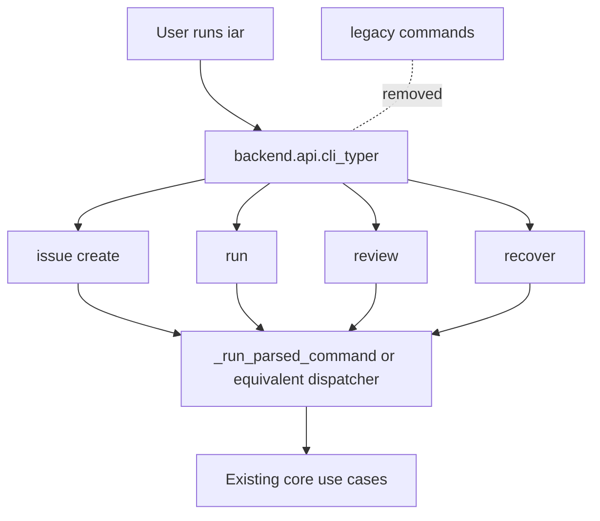

# PRD: Remove Legacy iAR CLI Commands After Typer Alias Stabilization

## 1. Introduction & Goals

`iar` 已迁移到 Typer/Rich 命令树，并新增推荐入口：

- `iar issue create`
- `iar run`
- `iar review`
- `iar recover`

旧命令仍被保留用于兼容：

- `iar issue-from-prd`
- `iar run-once`
- `iar review-once`
- `iar recover-publish`

本 PRD 规划在新入口稳定后删除旧命令，收敛 CLI 表面积，降低未来维护两套命令命名的成本。

目标：

- 删除 Typer command tree 中的旧命令注册。
- 删除或重写 legacy parser facade 中仅服务旧命令的解析覆盖。
- 将 README、Agent Runner guide、PRD 文档和测试中的推荐/兼容引用收敛到新命令。
- 保留底层 use case、函数名和内部领域语义，不因为 CLI 命令名变化而重命名 core use case。
- 给用户清晰的失败提示或迁移说明，避免旧命令删除后出现难以理解的 Typer usage error。

### Realistic Validation

除单元测试和集成测试外，本 PRD 要求通过**真实项目入口点**验证关键行为：

- [ ] **新命令真实验证**：通过 `uv run iar run --dry-run`、`uv run iar issue create --help`、`uv run iar review --help`、`uv run iar recover --help` 验证新入口仍可用。
- [ ] **旧命令删除真实验证**：通过 `uv run iar run-once --help`、`uv run iar issue-from-prd --help`、`uv run iar review-once --help`、`uv run iar recover-publish --help` 验证旧命令不再作为有效入口出现，并给出可理解的迁移提示或 Typer 错误。
- [ ] **仓库引用清理验证**：通过 `rg -n "issue-from-prd|run-once|review-once|recover-publish" README.md docs src tests tasks/pending` 验证仅保留必要的历史归档引用或明确迁移说明。
- [ ] **为什么单元测试不够**：删除 CLI 命令会影响 console script 入口、help 输出、文档命令和用户脚本；必须通过真实 `uv run iar ...` 入口证明生产路径行为。

## 2. Requirement Shape

**Actor**：本地运行 `iar` 的开发者、Agent Runner operator、维护 CLI 文档和测试的工程师。

**Trigger**：

- Typer/Rich 新入口已稳定，团队决定停止支持旧命令名。
- 用户执行新命令，应继续成功。
- 用户执行旧命令，应看到明确的不可用行为和迁移方向。

**Expected Behavior**：

- `iar issue create` 是创建 PRD Issue 的唯一推荐命令。
- `iar run` 是单次执行 runner 的唯一公开命令。
- `iar review` 是单次 review supervisor 的唯一公开命令。
- `iar recover` 是恢复发布失败的唯一公开命令。
- 旧命令不再出现在 `iar --help` 的 command list 中。
- 旧命令相关测试被删除或改为验证不可用/迁移提示。
- 文档中的命令示例统一使用新命令，除历史归档 PRD 外不再推荐旧命令。

**Explicit Scope Boundary**：

- 不删除或重命名 core use case，例如 `run_agent_repositories_once(...)`、`review_once(...)`、`create_issue_from_prd(...)`。
- 不删除 `iar daemon`、`iar review-daemon`、`iar labels sync`、`iar worktree ...`、`iar deliberate`。
- 不改变 GitHub label 状态机。
- 不改变 `.iar.toml` 配置结构。
- 不做自动 shell alias 或 wrapper 迁移。

## 3. Repository Context And Architecture Fit

### Existing Path

当前命令注册路径：

```text
backend.api.cli:main
  -> backend.api.cli_typer.main
     -> Typer command tree
        ├── issue create         # new
        ├── issue-from-prd       # legacy
        ├── run                  # new
        ├── run-once             # legacy
        ├── review               # new
        ├── review-once          # legacy
        ├── recover              # new
        └── recover-publish      # legacy
```

所有命令最终调用：

```text
backend.api.cli._run_parsed_command(...)
  -> existing use cases and factories
```

### Current Relevant Modules And Files

| Path | Current Role | Planned Relationship |
|---|---|---|
| `src/backend/api/cli_typer.py` | Typer command tree | 删除旧命令注册；保留新命令 |
| `src/backend/api/cli.py` | legacy parser facade and shared dispatcher | 评估是否仍需 `build_parser()`；若保留，改为只覆盖新命令或测试所需入口 |
| `tests/test_agent_runner_cli.py` | CLI dispatch tests | 删除旧命令正向测试；新增旧命令不可用和新命令真实入口测试 |
| `README.md` | 快速开始 | 删除旧命令兼容段落 |
| `docs/guides/agent-runner.md` | 操作指南 | 全量切换到新命令；保留迁移说明 |
| `tasks/pending/` | 未完成 PRD backlog | 更新尚未执行 PRD 中的命令示例，避免 future executor 使用旧命令 |
| `tasks/archive/` | 历史记录 | 默认不改历史事实；仅当 hook 或 docs 引用要求时补注 |

### Architecture Constraints

- CLI 删除属于 `src/backend/api/` 层改动，不能把 command-name 迁移逻辑塞进 core use case。
- 新命令仍必须调用 `_run_parsed_command(...)` 或后续等价 shared dispatcher。
- 不应因为删除旧 CLI 名称而重命名 core use case 或领域模型。
- 文档变更应同步 README 和 `docs/guides/agent-runner.md`；若新增导航页才更新 `mkdocs.yml`，本 PRD 不需要新增页。

### Reuse Candidates

- 复用现有 `cli_typer.py` 新命令函数。
- 复用 `tests/test_agent_runner_cli.py` 中的新别名测试，扩展为删除旧命令的回归测试。
- 复用 `rg` 仓库搜索清理旧引用。
- 复用 `just test` 与 `uv run mkdocs build --strict` 验证。

### Potential Redundancy Risks

- 保留旧命令但隐藏在 help 里会产生半支持状态；本 PRD 不推荐。
- 用 shell wrapper 做迁移提示会绕开 Typer 并增加额外入口；不推荐。
- 删除 `build_parser()` 前必须确认没有测试或工具直接依赖它；否则应先收窄再删除。

## 4. Options And Recommendation

### Option A: Hard Remove Legacy Commands From Typer (Recommended)

从 `cli_typer.py` 删除旧命令注册，保留新命令。旧命令执行时走 Typer 的 unknown command 错误；可通过顶层 help 和文档提供迁移说明。

**Pros**：

- CLI 表面积最清晰。
- 维护成本最低。
- 不产生隐藏兼容层。

**Cons**：

- 旧脚本会立刻失败。
- 需要确保文档和 pending PRD 不再复制旧命令。

### Option B: Keep Legacy Commands With Deprecation Error

保留旧命令注册，但命令体只打印迁移提示并返回非零。

**Pros**：

- 旧用户获得更明确迁移提示。

**Cons**：

- 旧命令仍出现在 Typer command tree 中，删除不彻底。
- 仍需维护旧命令注册和测试。

### Option C: Keep Legacy Commands Indefinitely

不删除旧命令，只在文档中推荐新命令。

**Rejected**：这与本 PRD 的收敛目标冲突，长期会保留两套 CLI 表面。

### Recommendation

推荐 **Option A**，但执行前必须满足稳定条件：

- 至少一个完整迭代周期内新命令没有 CLI 解析回归。
- README 和 Agent Runner guide 已默认使用新命令。
- `just test` 持续通过。
- 用户确认可以接受旧脚本失败，或已完成脚本迁移。

如稳定期内发现外部脚本仍大量依赖旧命令，可改用 Option B 作为短期过渡，但必须设置明确删除日期。

## 5. Implementation Guide

This section is a living implementation guide based on current repository analysis. If implementation discovers additional affected files, hidden dependencies, edge cases, or a better path, update this PRD before proceeding.

### Pre-Implementation Search

```bash
rg -n "issue-from-prd|run-once|review-once|recover-publish" README.md docs src tests tasks/pending tasks/archive
rg -n "@app.command\\(\"issue-from-prd\"\\)|@app.command\\(\"run-once\"\\)|@app.command\\(\"review-once\"\\)|@app.command\\(\"recover-publish\"\\)" src/backend/api
rg -n "build_parser\\(|parse_args\\(" src tests
```

### Core Steps

1. In `src/backend/api/cli_typer.py`:
   - Remove `@app.command("issue-from-prd")`.
   - Remove `@app.command("run-once")`.
   - Remove `@app.command("review-once")`.
   - Remove `@app.command("recover-publish")`.
   - Keep shared helper functions used by new commands.
2. In `src/backend/api/cli.py`:
   - Re-evaluate `build_parser()` usage.
   - Either remove it entirely if no callers remain, or reduce it to new command coverage only.
   - Keep `_run_parsed_command(...)` unless a follow-up dispatcher refactor replaces it with typed request objects.
3. In tests:
   - Replace old command positive tests with new command positive tests.
   - Add real Typer runner tests for old command failure behavior.
   - Keep tests proving new command behavior maps to existing use cases.
4. In docs:
   - Remove compatibility snippets for old commands from README and guide.
   - Add one migration note listing old -> new mapping.
   - Update pending PRDs that contain executable future commands.
5. Validate:
   - Run targeted CLI tests.
   - Run real entry commands via `uv run iar ...`.
   - Run docs build and `just test`.

### Change Impact Tree

```text
API
├── src/backend/api/cli_typer.py
│   [修改]
│   【总结】删除旧命令注册，仅保留 Typer 新入口
│
│   ├── 删除 issue-from-prd command
│   ├── 删除 run-once command
│   ├── 删除 review-once command
│   └── 删除 recover-publish command
│
├── src/backend/api/cli.py
│   [修改]
│   【总结】收敛 legacy parser facade，避免旧命令继续被测试或内部调用
│
Tests
├── tests/test_agent_runner_cli.py
│   [修改]
│   【总结】验证新命令正向行为和旧命令删除行为
│
Docs
├── README.md
│   [修改]
│   【总结】删除旧命令兼容示例，保留迁移映射
│
├── docs/guides/agent-runner.md
│   [修改]
│   【总结】统一使用新命令，删除旧命令推荐路径
│
Backlog
├── tasks/pending/*.md
│   [修改]
│   【总结】清理尚未执行 PRD 中的旧命令示例，避免后续实现沿用旧入口
```

### Architecture Diagram



### Migration Mapping

| Old Command | New Command |
|---|---|
| `iar issue-from-prd tasks/pending/example.md` | `iar issue create tasks/pending/example.md` |
| `iar run-once --dry-run` | `iar run --dry-run` |
| `iar review-once` | `iar review` |
| `iar recover-publish --issue 5` | `iar recover --issue 5` |

### Realistic Validation Plan

| Behavior | Real Entry Point | Dependencies | Command | Expected Result |
|---|---|---|---|---|
| New run command works | Console script | Real uv/Typer; no live GitHub if dry-run with mocked/empty local setup is used | `uv run iar run --dry-run` | Command parses and reaches runner workflow |
| New help surfaces work | Console script | Real Typer/Rich | `uv run iar issue create --help && uv run iar review --help && uv run iar recover --help` | Exit 0 and help shows new options |
| Old commands removed | Console script | Real Typer/Rich | `uv run iar run-once --help; test $? -ne 0` and equivalent old commands | Non-zero or explicit migration error |
| References cleaned | Repository search | Real repo files | `rg -n "issue-from-prd|run-once|review-once|recover-publish" README.md docs src tests tasks/pending` | Only approved migration/history references remain |
| Full repo remains green | Project task runner | Real lint/test stack | `just test` | Full lint and pytest pass |

## 6. Functional Requirements

- **FR-1**: `iar issue-from-prd` must no longer be registered as a valid Typer command.
- **FR-2**: `iar run-once` must no longer be registered as a valid Typer command.
- **FR-3**: `iar review-once` must no longer be registered as a valid Typer command.
- **FR-4**: `iar recover-publish` must no longer be registered as a valid Typer command.
- **FR-5**: `iar issue create` must remain available and behaviorally equivalent to the current PRD issue workflow.
- **FR-6**: `iar run` must remain available and behaviorally equivalent to the current single-run workflow.
- **FR-7**: `iar review` must remain available and behaviorally equivalent to the current single-review workflow.
- **FR-8**: `iar recover` must remain available and behaviorally equivalent to the current publish recovery workflow.
- **FR-9**: `iar --help` must not list removed commands.
- **FR-10**: Documentation must use new commands as the only executable examples outside explicit migration notes.

## 7. Non-Goals

- No change to core use case names.
- No change to GitHub labels or Issue state machine.
- No change to `.iar.toml`.
- No removal of `daemon`, `review-daemon`, `labels`, `worktree`, `deliberate`, or `init`.
- No shell alias installation.
- No live GitHub migration automation.

## 8. Risks And Follow-Ups

| Risk | Impact | Mitigation |
|---|---|---|
| Existing local scripts still call old commands | Scripts fail after removal | Require explicit user confirmation before implementation; document mapping |
| Hidden docs or pending PRDs keep old examples | Future agents may reintroduce old commands | Use repository-wide `rg` cleanup and add tests for removed commands |
| `build_parser()` removal breaks internal tests | Test suite failure or hidden callers | Search before removal; if still needed, narrow parser facade rather than delete immediately |
| Typer unknown-command message is less helpful than custom migration text | Poor UX for old command users | If needed, switch to Option B temporarily with explicit deletion date |

## 9. Decision Log

| ID | Decision | Rationale |
|---|---|---|
| D-01 | Wait until Typer/Rich aliases stabilize before deletion | Avoids breaking scripts immediately after migration |
| D-02 | Prefer hard removal over hidden deprecated commands | Keeps final CLI surface simple |
| D-03 | Do not rename core use cases | CLI naming and business use case naming are separate concerns |
| D-04 | Clean pending PRDs but not historical archive facts by default | Pending docs guide future work; archive docs are historical records |

## 10. Acceptance Checklist

### Architecture Acceptance

- [ ] Legacy command registrations are removed from `src/backend/api/cli_typer.py`.
- [ ] `src/backend/api/cli.py` no longer exposes old commands through parser-only paths, unless explicitly justified for tests.
- [ ] Core use case names and behavior remain unchanged.
- [ ] No new API/core/infrastructure dependency violation is introduced.

### Behavior Acceptance

- [ ] `iar issue create --help` exits 0.
- [ ] `iar run --help` exits 0.
- [ ] `iar review --help` exits 0.
- [ ] `iar recover --help` exits 0.
- [ ] `iar issue-from-prd --help` is no longer valid or prints a non-zero migration error.
- [ ] `iar run-once --help` is no longer valid or prints a non-zero migration error.
- [ ] `iar review-once --help` is no longer valid or prints a non-zero migration error.
- [ ] `iar recover-publish --help` is no longer valid or prints a non-zero migration error.

### Documentation Acceptance

- [ ] `README.md` uses only new command examples outside a migration mapping.
- [ ] `docs/guides/agent-runner.md` uses only new command examples outside a migration mapping.
- [ ] Pending PRDs no longer instruct future executors to use removed commands.

### Validation Acceptance

- [ ] `uv run pytest tests/test_agent_runner_cli.py -q` passes.
- [ ] `uv run mkdocs build --strict` passes.
- [ ] `just test` passes.
- [ ] Repository search confirms old command strings appear only in approved migration/history contexts.
